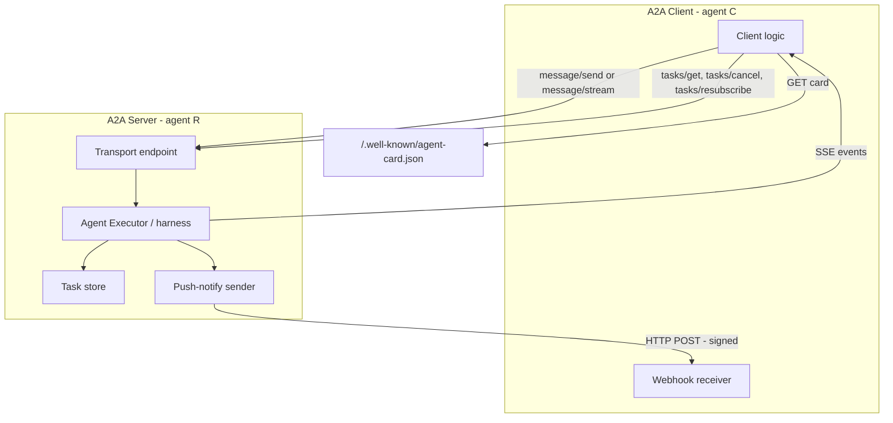

> [!info] Context
> Part of [[Harness-Internals-Overview|Harness Engineering Internals]], Level 2 wave. Parent chapter: [[Harness-Internals-Production-Patterns]], which sketched A2A as one of the seven convergent platform patterns. This chapter opens the protocol itself — the Agent Card, the task state machine, the streaming and webhook transports, the exact seam where the wire format stops and bilateral trust begins — and takes a hard, evidence-grounded line on whether A2A is actually used or mostly aspirational. Read it alongside [[Harness-Internals-MCP-Protocol-Internals]] (the tool-integration sibling it is deliberately designed to complement) and [[Harness-Internals-Subagent-Orchestration]] (the in-process delegation topology A2A externalizes across trust boundaries).

# A2A Protocol Internals

## 1. Executive Overview

A2A — Agent2Agent — is a wire protocol for one autonomous agent to discover, hire, and delegate a unit of work to *another* agent that it does not own, did not build, and cannot see inside. Where [[Harness-Internals-MCP-Protocol-Internals|MCP]] standardizes the joint between an agent and its tools (structured functions with defined inputs and outputs), A2A standardizes the joint between an agent and a *peer* — a system that reasons, plans, holds state across a long interaction, and returns results whose derivation you are not allowed to inspect. It was created by Google, announced April 9, 2025, and donated to the Linux Foundation on June 23, 2025, where it is now governed as a vendor-neutral project.

The one claim that reframes A2A for someone who thinks they already understand it: **A2A is not a communication protocol, it is a task-lifecycle protocol.** People pattern-match it to "REST for agents" or "a message bus for LLMs" and immediately misdesign around it. The primitive A2A actually standardizes is not the message and not the connection — it is the *Task*: a server-owned, uniquely-identified, stateful object that moves through an explicit finite state machine (`submitted → working → input-required → completed/failed/canceled/...`) and can outlive any single HTTP request, any dropped SSE stream, and in the webhook mode, any live connection at all. The message is just how you push a task forward. Every hard question about A2A — how long-running work is modeled, how human-in-the-loop pauses work, how you reconnect after a network blip, where the protocol's guarantees stop — is a question about that state machine and who owns it. Get the Task model and the rest of the protocol is mechanical. Miss it, and you will build a chat protocol and wonder why it falls apart under real enterprise workflows.

The second claim, which the marketing will not tell you and the honest engineering blogs will: as of mid-2026, A2A's *specification* is mature (v1.0, signed Agent Cards, five language SDKs, 150+ member organizations) while its *production reality* is genuinely thin relative to the hype, for a specific and instructive reason covered in section 10. This chapter separates the two ruthlessly.

## 2. Historical Evolution

The problem A2A attacks is older than LLMs. "How do heterogeneous autonomous software components discover each other and coordinate work?" is the question behind CORBA (1991), SOAP/WSDL/UDDI web services (early 2000s), and FIPA-ACL agent communication languages (late 1990s). Each generation produced a discovery mechanism (UDDI registries, WSDL documents), a message envelope (SOAP), and a coordination model — and each collapsed under its own ceremony. UDDI registries went largely unused; WSDL's rigidity lost to REST's pragmatism; FIPA-ACL's speech-act semantics never escaped academia. The graveyard matters because A2A is consciously trying not to join it, which is why it is built on boring, already-won standards: HTTP, Server-Sent Events, and JSON-RPC 2.0, with authentication deliberately styled after OpenAPI's security schemes so enterprises could reuse existing identity plumbing.

The proximate history is compressed into 2024–2026 and is worth dating precisely because the sequencing explains the design.

**November 2024** — Anthropic releases MCP, solving agent↔tool integration (see [[Harness-Internals-Tool-Calling-Internals]] and [[Harness-Internals-MCP-Protocol-Internals]]). MCP's rapid adoption, cemented when OpenAI embraced it in March 2025, proved two things: the industry would accept a standard for the agent's *lower* boundary (to tools), and JSON-RPC over HTTP was an acceptable substrate. But MCP by construction models the far side as a *tool* — a passive capability the model invokes. It has no vocabulary for a far side that is itself an agent: no notion of a peer that takes minutes-to-days, asks *you* clarifying questions mid-task, or streams partial artifacts of its own accord.

**April 9, 2025** — Google announces A2A with 50+ launch partners (Atlassian, Box, Cohere, Intuit, LangChain, MongoDB, PayPal, Salesforce, SAP, ServiceNow, Workday, plus the big consultancies — Accenture, Deloitte, PwC, TCS, Wipro, and others). The framing is explicit and complementary: A2A is for the agent's *upper* boundary — to other agents — and it is positioned as the sibling of MCP, not its rival. The launch version leans on HTTP + SSE + JSON-RPC, and Google commits to a "production-ready version later in the year."

**June 23, 2025** — Google donates A2A to the Linux Foundation, which launches the Agent2Agent Protocol Project with 100+ companies and, crucially, AWS and Microsoft as backers. This is the strategic masterstroke and the tell: a protocol owned by one hyperscaler is a competitive weapon that the other hyperscalers will route around; a protocol at a neutral foundation with AWS, Microsoft, Cisco, Salesforce, SAP, and ServiceNow co-signing becomes a Schelling point. Google gave up control to buy legitimacy — the same move that made Kubernetes an industry standard rather than a Google product.

**Through 2025 into 2026** — The spec matures across versions. The v0.2.x line established the JSON-RPC-first shape (lowercase hyphenated task states, `/.well-known/agent.json`); v0.3.0 tightened it and moved the discovery path to `/.well-known/agent-card.json`; and a v1.0 generation reorganized the model around a canonical Protocol Buffers schema with three equal transport bindings (JSON-RPC, gRPC, HTTP+JSON/REST), plus signed Agent Cards. At the one-year mark (April 2026), the Linux Foundation reports 150+ organizations, 22,000+ GitHub stars, five production SDKs (Python, JavaScript/TypeScript, Java, Go, .NET), and integrations in Azure AI Foundry, Amazon Bedrock AgentCore, and Google Cloud. A sibling protocol, Agent Payments Protocol (AP2), spins up to handle the money layer A2A deliberately left out.

The evolution's throughline: A2A is the *second* interoperability standard, defined against the shape of the first. MCP taught the ecosystem that a standard could win; A2A is Google's bet that a second standard is needed one layer up. Whether that bet is paying off is section 10's job.

## 3. First-Principles Explanation

Build the protocol from the requirement, and every field falls out.

Suppose agent **C** (a client, itself perhaps a full agent) wants agent **R** (a remote peer, owned by a different org) to do something — "rebook my cancelled flight under $600." Enumerate what C must know and what must be true, and you have re-derived A2A.

**C must find R and know how to talk to it.** This is *discovery*, and it cannot assume shared prior configuration if the ecosystem is open. So R publishes a machine-readable manifest — the **Agent Card** — at a predictable location. A2A borrows the well-known-URI convention (RFC 8615): the card lives at `https://R-domain/.well-known/agent-card.json`, fetched with a plain HTTP GET. The card answers: who are you (`name`, `description`, `provider`, `version`), where do I send work (`url`, `preferredTransport`), what can you do (`skills`), what do you require of me to talk to you (`securitySchemes`, `security`), and what modalities do you speak (`defaultInputModes`, `defaultOutputModes`). This is the exact analogue of an OpenAPI document, but for an autonomous agent rather than a REST API — and the analogy is load-bearing: a card is a *self-declared* description, a claim, not a proof. Hold that thought; it is the crack the entire trust story leaks through (section 5, section 9).

**C must be able to hand R a unit of work and track it.** A tool call is request/response: you call, you block, you get a result. That model breaks the instant the work takes longer than an HTTP timeout, or needs a follow-up question, or produces incremental output. So A2A does not model the interaction as a call; it models it as a **Task** — a stateful object, created and owned by R, identified by a server-generated `id`, carrying a `status` (the current state plus an optional message), an accumulating `history` of messages, and an accumulating array of `artifacts` (the outputs). C pushes the task forward by sending **Message** objects; R advances the task's state and appends artifacts. The task is the durable spine; messages are the events that move it.

**The work is variable-duration and may need C mid-flight.** Hence the **state machine**. A task starts `submitted`, moves to `working`, and from there can reach a *terminal* state (`completed`, `failed`, `canceled`, `rejected`) or an *interrupted* state where it needs something from C before it can continue (`input-required` — R needs more information; `auth-required` — R needs credentials). Interrupted states are the protocol's native representation of human-in-the-loop and consent gates: the task is paused but alive, and C resumes it by sending another message with the same `taskId`. This is the same suspend/resume shape the parent chapter identified as a convergent platform pattern, and the same one [[Harness-Internals-Durable-Execution]] treats as a first-class control-flow primitive — A2A just standardizes it on the wire between organizations.

**C must receive progress and results over an unpredictable duration.** A blocking response cannot span a three-hour task. So A2A offers three delivery mechanisms, matched to how long the work runs and whether C can hold a connection: synchronous response (short tasks), **SSE streaming** (C holds an HTTP connection and receives a live event feed), and **push notifications** (R POSTs to a webhook C registered — for tasks measured in hours or days, or when C is a mobile app or serverless function that cannot hold a socket open). Polling via `tasks/get` is the always-available fallback.

**Content is multimodal and heterogeneous.** Neither a plain string nor a fixed schema suffices. So every message and artifact is a list of **Part**s, each part discriminated by kind: a `TextPart` (`kind: "text"`), a `FilePart` (`kind: "file"`, bytes or a URL), or a `DataPart` (`kind: "data"`, structured JSON — the escape hatch for forms, structured tool outputs, anything). A message is `parts: Part[]`; an artifact is `parts: Part[]`. One container type, three payload shapes, arbitrary composition.

**Both sides need security they already understand.** Rather than invent an auth scheme, A2A points the card's `securitySchemes` at the OpenAPI/OAuth catalog — API keys, HTTP bearer, OAuth 2.0, OpenID Connect, mutual TLS — and, critically, treats *how* those credentials are obtained and validated as out of band. The protocol says "here is what I require"; it does not run the login. This is the single most important design boundary in A2A and section 5 dwells on it.

That is the whole protocol from first principles: a discoverable self-description, a stateful server-owned task with a lifecycle, three ways to receive updates, a uniform multimodal content model, and a pointer to standard auth. Everything else is encoding detail.

## 4. Mental Models

**The Agent Card is a business card; the Task is a work order; A2A is the courier and the tracking number.** When you engage a contractor you do not stream your consciousness at them — you read their card (what they do, how to reach them, their credentials), you hand over a scoped work order, and you get a tracking number you can query. The work happens opaquely on their side; you see status changes and deliverables, not their internal process. A2A's deliberate *opacity* — an agent collaborates without exposing its memory, tools, prompts, or reasoning — is exactly the contractor relationship, and it is a feature, not a limitation: it is what lets two competitors' agents cooperate without either revealing IP.

**MCP is a function call; A2A is a job ticket.** The sharpest way to keep the two straight. A function call (MCP `tools/call`) is synchronous-shaped, stateless per call, and the caller owns the control flow — the tool is inert between invocations. A job ticket (A2A Task) is asynchronous, stateful, server-owned, and the *worker* drives progress and can bounce the ticket back to you (`input-required`) when it needs something. If the thing on the far side is inert until you poke it and returns immediately, it is a tool — use MCP. If it churns on its own, takes real time, and might ask you questions, it is an agent — use A2A. The auto-repair-shop example from the A2A docs makes this concrete: the customer's agent uses **A2A** to delegate to the shop-manager agent, which uses **A2A** to delegate to a mechanic agent, which uses **MCP** to drive its diagnostic scanner and platform lift. A2A between the reasoning peers; MCP from each peer down to its tools.

**The Task state machine is a promise about liveness.** Think like a distributed-systems engineer: the value of an explicit, standardized state machine is that it lets a client reason about a remote process it cannot see. `working` means "alive, don't retry." `input-required` means "alive, your move." `failed` means "dead, and it was my fault." `rejected` means "I never started — your request, not my execution." That last distinction (rejected vs. failed) is not pedantry; it changes the client's retry logic. A rejected task should not be retried verbatim (the agent said no); a failed task might be (transient error). Standardizing the states standardizes the client's decision tree.

**A2A externalizes subagent orchestration across a trust boundary.** [[Harness-Internals-Subagent-Orchestration]] describes delegation *inside* one harness: an orchestrator forks a subagent, which shares the parent's process, memory model, and trust domain. A2A is that same delegation pattern with the fork line drawn through an organizational boundary — the "subagent" is now a stranger's agent, on a stranger's infrastructure, with its own incentives. Everything that was implicit inside one process (identity, trust, liability, error semantics) must now be made explicit on a wire. A2A makes the *mechanics* explicit and leaves most of the *trust* to you — which is precisely why the protocol looks simple and deploying it is not.

## 5. Internal Architecture

A2A has four architectural pieces: the roles, the Agent Card, the Task object graph, and the transport layer. Here is how they fit.



**Roles.** Every A2A relationship has an **A2A Client** (the party initiating work — often itself an agent) and an **A2A Server** (the remote agent exposing an HTTP endpoint). Roles are per-relationship, not global: an agent is a server to its callers and a client to the agents it delegates to. A three-tier delegation (customer → manager → mechanic) has the manager acting as server to the customer and client to the mechanic simultaneously.

**The Agent Card** is the entry point and the trust anchor. Its top-level fields, per the stable v0.3.0 schema:

- `protocolVersion` — which A2A version the card speaks.
- `name`, `description`, `version`, `provider` — identity and provenance (`provider` names the organization).
- `url` and `preferredTransport` (defaults to `"JSONRPC"`), plus `additionalInterfaces` — an array of `{url, transport}` bindings so one agent can offer JSON-RPC, gRPC, and REST at different endpoints.
- `capabilities` (an `AgentCapabilities` object): booleans `streaming`, `pushNotifications`, and support for extensions and the authenticated extended card.
- `skills` — an array of `AgentSkill` objects, each with an `id`, `name`, `description`, `tags`, example prompts, and optional per-skill input/output modes. Skills are the coarse-grained "things I can do," written for a *reasoning* consumer (another agent deciding whether to delegate), not a schema-validating one — a deliberate contrast with MCP tool schemas, which are written for a model to fill in arguments precisely.
- `securitySchemes` and `security` — a map of named schemes (mirroring OpenAPI: `APIKeySecurityScheme`, `HTTPAuthSecurityScheme`, `OAuth2SecurityScheme`, `OpenIdConnectSecurityScheme`, `MutualTlsSecurityScheme`) and which apply.
- `defaultInputModes` / `defaultOutputModes` — MIME-type lists declaring supported modalities.
- `supportsAuthenticatedExtendedCard` — whether a fuller card is available *after* authentication (so an agent can reveal privileged skills only to authorized callers).
- `signatures` — an array of `AgentCardSignature` objects (JWS) proving the card was not tampered with. Added in the v1.0 generation precisely because unsigned cards were the protocol's most-criticized weakness.

**The Task object graph.** A `Task` is `{ id, contextId?, status, artifacts[], history[], metadata }`. The `status` is a `TaskStatus` = `{ state, message?, timestamp? }`. A `Message` is `{ messageId, role, parts[], contextId?, taskId?, referenceTaskIds?, metadata }` where `role` is `user` or `agent`. An `Artifact` is `{ artifactId, name?, parts[], metadata }`. The two identifiers do enormous work:

- `taskId` identifies one unit of work with one lifecycle. It is server-generated and immutable.
- `contextId` groups *multiple* tasks and standalone messages into one logical conversation. This is the key to refinement: because terminal tasks are immutable (you cannot reopen a `completed` task), asking R to "make the boat red" after it already generated a boat spawns a *new* task, tied to the old one by the shared `contextId` and an explicit `referenceTaskIds` pointer, producing a new artifact version. The immutability-plus-context design gives you clean traceability (every task is a sealed record) without losing conversational continuity.

**The transport layer.** The canonical operations, named in the stable JSON-RPC binding:

- `message/send` — send a message; get back a `Task` or a direct `Message` (R chooses whether the interaction warrants a tracked task).
- `message/stream` — same, but the response is an SSE stream of events (requires `capabilities.streaming`).
- `tasks/get` — poll a task by id (`historyLength` bounds how much history returns).
- `tasks/cancel` — request cancellation.
- `tasks/resubscribe` — reattach an SSE stream to an existing task after a dropped connection.
- `tasks/pushNotificationConfig/set` | `get` | `list` | `delete` — manage webhook configs (requires `capabilities.pushNotifications`).
- `agent/getAuthenticatedExtendedCard` — fetch the privileged card post-auth.

> [!warning] Version drift is real — verify against the version you target
> The v1.0 generation reorganized around a Protocol Buffers canonical model, which changes surface details you will hit in practice. In the protobuf model the state enum is spelled `TASK_STATE_SUBMITTED`, `TASK_STATE_WORKING`, etc., and some method names shift (`tasks/subscribe`, `tasks/list`, `tasks/pushNotificationConfig/create`, `agent/card`). The stable, most-widely-deployed JSON-RPC wire representation uses the lowercase hyphenated states (`"submitted"`, `"working"`, `"input-required"`, `"completed"`, `"failed"`, `"canceled"`, `"rejected"`, `"auth-required"`, `"unknown"`) and the method names above. Before you assert a field or state name in code, check the `protocolVersion` in the counterparty's Agent Card and read *that* version's spec — this is a live protocol and the names are not stable across major versions.

### Where the protocol stops and trust begins

This is the seam infra interviews probe, so make it explicit. A2A guarantees, on the wire: a discovery format, a task lifecycle, transport-level security (TLS), a place to declare auth requirements, and content integrity if you sign artifacts and cards. A2A does **not** guarantee, and explicitly leaves to bilateral agreement: whether the remote agent is *competent* (a skill is a self-declared claim), whether its *incentives* align with yours (an airline's rebooking agent optimizes for the airline), how you *verify* an opaque result you cannot see the reasoning behind, who bears *liability* when a delegated task causes harm, and how the two parties *settle* money (deliberately punted to AP2). The protocol draws the identity-and-transport box; the trust contract — allowlists, per-counterparty evaluation, human gates on high-stakes actions, treating remote output as untrusted input to your own verification — is drawn by you, on top. A2A is the plumbing for trust, not the trust.

## 6. Step-by-Step Execution

Trace "rebook my cancelled flight under $600" end to end, with a mid-task question and a mid-task network drop, to exercise the interesting paths.

1. **Discover.** C's harness decides it needs a travel agent and has `travel.example.com` from a registry. It issues `GET https://travel.example.com/.well-known/agent-card.json`. The card comes back: `preferredTransport: "JSONRPC"`, `capabilities.streaming: true`, `capabilities.pushNotifications: true`, a `skills` entry `{id: "rebook_flight", ...}`, and `securitySchemes` requiring an OAuth 2.0 bearer token with scope `flights:write`.

2. **Verify the card (if signed).** The card carries a `signatures[0]` JWS. C canonicalizes the card body with JCS (RFC 8785), reads the `protected` header for `alg` and `kid`, fetches R's public key from R's JWKS endpoint by `kid`, and verifies the detached signature. Tampering or an unknown key aborts the interaction *before any work is requested*. (If the card is unsigned, C is trusting DNS + TLS alone — see section 9.)

3. **Authenticate.** C obtains an OAuth token for R out of band (the protocol does not run this flow) and will attach it as an `Authorization: Bearer` header on every request. In a delegation chain, C attaches its *own* workload credential, not the end user's — the delegation-vs-impersonation distinction from [[Harness-Internals-Production-Patterns]] and its dedicated identity chapter.

4. **Send the work, streaming.** Because the task will take a while and C can hold a connection, C calls `message/stream` with a `Message`: `role: "user"`, `parts: [TextPart("rebook my cancelled flight, budget $600")]`, plus structured context as a `DataPart` (the cancelled PNR). R accepts, generates a `taskId` and `contextId`, and opens an SSE stream.

5. **Watch it work.** R emits a `TaskStatusUpdateEvent` → state `submitted`, then another → `working`, then intermediate `working` events carrying human-readable progress messages ("searching alternate flights..."). C renders these as live progress.

6. **The interrupt.** R finds two options but needs a choice. It emits a `TaskStatusUpdateEvent` with state `input-required` and a message asking "aisle or window?" — and, because `input-required` is a stream-terminating condition, closes the SSE stream. The task is now paused-but-alive on R's side.

7. **The human turn.** C surfaces the question to the user, gets "aisle," and calls `message/send` (or `message/stream` again) with a new `Message` on the **same `taskId`**: `role: "user"`, `parts: [TextPart("aisle")]`. R transitions the task back to `working`.

8. **The network drop.** Mid-booking, C's SSE connection dies (it had reopened a stream on the resume). C does not lose the task — it calls `tasks/resubscribe` with the `taskId`, and R reattaches a fresh SSE stream to the still-running task, replaying/continuing status. This is the concrete payoff of server-owned task state: the task's liveness is independent of any one connection.

9. **The result.** R books the flight, emits a `TaskArtifactUpdateEvent` carrying the confirmation as an `Artifact` (a `DataPart` with the new PNR plus a `FilePart` boarding-pass PDF; if the PDF were large it would arrive in chunks with `append: true` and a final `lastChunk: true`), then a final `TaskStatusUpdateEvent` with state `completed` and `final: true`, and closes the stream.

10. **The webhook alternative.** Had C been a mobile app that cannot hold a socket, step 4 would instead register a `PushNotificationConfig` (`url`, `token`, `authentication`) via `tasks/pushNotificationConfig/set`, then disconnect. On each significant transition R would POST the update to C's webhook, signed as a JWT so C can verify it genuinely came from R (section 7). C reconnects only to read the final artifact.

Every meaningful step here is also a place to emit an OTel `execute_tool`/`invoke_agent` span (the GenAI semantic conventions from the parent chapter), so a delegated A2A task shows up in C's trace waterfall as a first-class child.

## 7. Implementation

Two things are worth building out in detail: the server's task manager, and the webhook security handshake, because they are where naïve implementations break.

**Server side: the task manager.** A minimal but correct A2A server separates transport handling from an *agent executor* (your harness) via a task store. The executor never touches HTTP; it manipulates task state and emits events.

```python
# Sketch — an A2A server task manager (transport-agnostic core)
class TaskManager:
    def __init__(self, store, executor, notifier):
        self.store, self.executor, self.notifier = store, executor, notifier

    async def on_message_send(self, msg, stream=False):
        task = self.store.get(msg.taskId) if msg.taskId else None
        if task and task.status.state in TERMINAL:
            raise A2AError("task in terminal state; open a new task in this contextId")
        if task is None:
            task = self.store.create(id=uuid4(), contextId=msg.contextId or uuid4(),
                                     status=TaskStatus("submitted"))
        # append the driving message to history
        self.store.append_history(task.id, msg)
        # hand to the harness; it yields state/artifact events
        async def run():
            self.store.set_state(task.id, "working")
            yield status_event(task, "working")
            async for ev in self.executor.run(task):     # your agent loop
                if ev.kind == "artifact":
                    self.store.add_artifact(task.id, ev.artifact)
                    yield artifact_event(task, ev.artifact)
                elif ev.kind == "need_input":
                    self.store.set_state(task.id, "input-required")
                    yield status_event(task, "input-required", final=True)  # ends stream
                    return
            self.store.set_state(task.id, "completed")
            yield status_event(task, "completed", final=True)
        return self._stream_or_collect(task, run(), stream)
```

The load-bearing invariants: (a) a message on a *terminal* task is rejected — refinement must open a new task in the same `contextId`; (b) `taskId` is server-generated and the store is the single source of truth for state (never let the transport layer infer state); (c) `input-required` and `auth-required` set `final: true` on the SSE event to close the stream cleanly, because the task is now waiting on an external actor and holding the socket open buys nothing. The task store must be durable if you support push notifications or resubscription — an in-memory store loses tasks on restart, which is fine for a demo and a data-loss bug in production. This is where [[Harness-Internals-Durable-Execution]] stops being optional: a real A2A server that promises to run a task for hours needs the task state on durable storage, checkpointed, so a deploy or crash does not orphan it.

**Client/server: the push-notification security handshake.** Webhooks invert the connection direction — R now makes an outbound call to a URL C supplied — and that inversion is a security minefield in both directions.

*R's obligation (don't get used as an SSRF cannon):* the `PushNotificationConfig.url` is attacker-controllable input. R "SHOULD NOT blindly trust and send POST requests to any URL," per the spec — a malicious client could register `http://169.254.169.254/...` (cloud metadata) or an internal address and use R as a proxy to probe R's own network. Mitigations: allowlist schemes/hosts, verify webhook ownership (challenge-response before first real POST), and block private/link-local ranges.

*C's obligation (don't trust an unauthenticated POST):* anyone who learns C's webhook URL can forge notifications. So R signs each notification as a JWT and C verifies it: R signs with its private key, publishing public keys at a JWKS endpoint; the POST carries the JWT in the `Authorization` header; C extracts it, reads `kid`, fetches the matching public key, verifies the signature, and validates `iss`, `aud`, `iat`, `exp`, and `jti` (the last for replay defense). C also checks the opaque `PushNotificationConfig.token` it originally supplied, to bind the notification to the task it registered. Skip any of these and your webhook is an open command channel.

**Wire format.** A `message/send` request is unremarkable JSON-RPC 2.0:

```json
{
  "jsonrpc": "2.0", "id": 7, "method": "message/send",
  "params": {
    "message": {
      "messageId": "9b1c...", "role": "user",
      "parts": [{"kind": "text", "text": "rebook my flight, budget $600"}]
    }
  }
}
```

and the response is a `Task` object with `"status": {"state": "submitted"}` and a server-assigned `id`. The SSE variant returns the same shape wrapped per event as JSON-RPC responses on a `text/event-stream`.

## 8. Design Decisions

**Server-owned Task as the primitive, not the message.** A2A could have been a thin message-passing protocol (send blob, get blob). It chose a stateful, server-owned task with an explicit lifecycle. Cost: servers must maintain durable task state, implement a state machine, and handle resubscription — real complexity, and the source of the "implementation burden" critique. Gain: long-running, resumable, human-interruptible work is expressible *natively* instead of being reinvented per integration. The rejected alternative (stateless messaging) pushes all lifecycle bookkeeping onto every client-server pair, which is exactly the N×M glue A2A exists to kill. The critics who say "the primitive should be the message stream, not the message" (section 10) are arguing the state machine is under-specified for true distributed-systems rigor — a critique of *degree*, conceding the stateful-task instinct is right.

**Three transports, one canonical model (v1.0).** Supporting JSON-RPC *and* gRPC *and* REST triples the surface area and the conformance-testing burden. Why? Because the target adopters are enterprises with entrenched stacks — a gRPC shop and a REST shop will each refuse a protocol that forces the other's transport. Defining a single Protocol Buffers canonical model and mapping it to three bindings lets the semantics stay identical while meeting teams where they are. The hidden cost lands on library authors and on interoperability testing, not on the enterprise — a deliberate shift of pain from the adopter to the ecosystem, which is how you win adoption.

**Opacity by default.** A2A agents expose skills and results but *not* internal memory, tools, prompts, or reasoning. The alternative — richer introspection — would make debugging and trust easier. It was rejected because the whole point is cross-organizational collaboration, and no vendor will expose its agent's internals to a competitor's agent. Opacity is what makes the protocol commercially viable; it is also what makes verification hard (you cannot check work you cannot see), which the trust section treats as the central open problem.

**OpenAPI-style security schemes, auth left out of band.** A2A declares auth requirements in the card but does not perform authentication. Cost: the protocol is *incomplete* on its own — you cannot deploy A2A securely without also standing up an identity system, and the spec's own critics note it "delegates credential management entirely to implementers." Gain: A2A reuses two decades of enterprise IAM (OAuth, OIDC, mTLS) instead of inventing a competitor to it, which no enterprise would trust anyway. This is the same "don't reinvent the substrate" instinct as building on HTTP/SSE/JSON-RPC — and it is why A2A can plausibly enter an enterprise at all.

**Unsigned cards at launch, signed cards later.** The initial versions shipped Agent Cards as plain unsigned JSON. This was a genuine design miss — a discovery-and-trust anchor with no integrity protection — and it drew immediate, pointed criticism (there is a literally-titled GitHub discussion, "Sign agent cards for the love of god!"). The v1.0 generation added `AgentCardSignature` (JWS over the JCS-canonicalized card). The lesson for protocol designers: shipping the trust anchor without integrity protection and retrofitting it is a predictable, avoidable sequencing error — you cannot bolt trust on after adoption without leaving a long tail of unsigned deployments.

**Money left out (AP2).** A2A deliberately does not model payment, settlement, or liability. Splitting a focused protocol (coordination) from a separate one (payments) keeps each tractable and independently governable. The cost is that "delegate a purchase to a supplier agent" — the flagship A2A use case — is *not actually complete* in A2A alone; it needs AP2 layered on. A candid read is that the most compelling A2A demos require a protocol that is even less mature than A2A itself.

## 9. Failure Modes

**Agent Card spoofing and impersonation.** The card is a self-declared claim served over HTTP. If unsigned, an attacker who can MITM, poison DNS, or stand up a look-alike domain can serve a forged card advertising a trusted provider's identity, false endpoints, or capabilities the real agent lacks — and the client, trusting the card, delegates sensitive work to the attacker. This is the protocol's original sin, formally catalogued in the Cloud Security Alliance's MAESTRO threat model of A2A. Mitigation: require signed cards, verify the JWS against a known key, pin TLS certs, and treat any unsigned card as untrusted-by-default. Debug signature: work being delegated to an endpoint nobody recognizes, discoverable only if you log the resolved `url` and card `provider` per delegation.

**Task replay.** Because task-driving messages travel over a request/response channel, an attacker who captures a message can replay it to re-trigger work (re-run a payment, re-book a flight). The spec's recommended defense is nonce-plus-MAC / `jti`-based replay prevention on notifications and idempotency on task creation. A server that treats every `message/send` as fresh is replayable by construction.

**The `input-required` deadlock.** An `input-required` task is alive but paused, waiting on C forever. If C is an autonomous agent with no human behind it and no handler for the interrupt, the task hangs indefinitely, and R holds resources for a response that never comes. Worse: a client that mistakes `input-required` for an error and *retries the whole task* spawns duplicate work and burns tokens on both sides. Fix: model interrupts as first-class suspensions (as in [[Harness-Internals-Termination-Budgets-Loop-Control]]), set server-side timeouts that transition an over-long `input-required` task to `failed`/`canceled`, and never retry an interrupted task — respond to it.

**Lost tasks on server restart.** If R keeps task state in memory and restarts (deploy, crash, autoscale), every in-flight task vanishes; clients polling `tasks/get` get "unknown," and webhook promises are silently broken. This is the failure the durable task store in section 7 exists to prevent. Debug signature: tasks that "disappear" correlated with R's deploy timeline.

**SSRF via push-notification URL.** Covered in section 7 — an unvalidated webhook `url` turns R into a request cannon against R's own internal network. This is not hypothetical; it is the canonical webhook vulnerability, inherited wholesale by A2A's push mode.

**Opaque-result verification gap.** R returns an artifact; C cannot see how it was derived. If R is buggy, adversarial, or subtly misaligned (the airline agent that books a technically-valid-but-terrible itinerary), C has no protocol-level way to catch it. The failure is silent by design — opacity is a feature that becomes a liability the moment the remote agent is wrong. Mitigation is entirely out of band: schema-validate artifacts, cross-check against independent sources, gate high-stakes results on human review, run per-counterparty evals. The protocol cannot help you here, and pretending otherwise is how teams ship agents that trust strangers.

**Streaming vs. push mismatch under scale.** SSE holds a connection per active task; at thousands of concurrent long tasks the connection count, not the compute, becomes the bottleneck, and load balancers with idle-connection timeouts silently sever streams. Push notifications trade that for webhook-delivery reliability problems (retries, ordering, the receiver being down). Choosing SSE for day-long tasks, or push for a chatty interactive UI, produces latency and resource pathologies that look like bugs but are architecture mismatches. Match the mode to the task duration and the client's connection-holding ability, as the spec's selection criteria spell out.

## 10. Production Engineering — Adoption Reality

This is the section where the marketing and the engineering diverge, and the contract demands honesty over hype. Both of the following are true, and holding them together is the whole point.

**What is verifiably real (Linux Foundation, one-year press release, April 2026).** 150+ member organizations (up from ~50 at launch). v1.0 released with signed cards, multi-transport support, and multi-tenancy. Five production SDKs (Python, JS/TS, Java, Go, .NET). 22,000+ GitHub stars. Integrations shipped into Azure AI Foundry and Copilot Studio (Microsoft), Amazon Bedrock AgentCore Runtime (AWS — the parent chapter's case study natively hosts A2A servers), and Google Cloud. The Foundation reports "active production deployments" across supply chain, financial services, insurance, and IT operations — but, tellingly, names *industries*, not *companies or concrete use cases*. That omission is the single most informative fact in the press release.

**What is verifiably thin.** Independent engineering assessments through 2026 converge on a blunt read: "supported by" is not "deeply used in production by most developers," and protocol ecosystems "look larger in press releases than they feel in day-to-day engineering work." One widely-cited teardown (Credal) argues A2A largely *failed to gain the traction its backing implied*, for a specific two-part reason: **limited differential value over MCP**, and **implementation burden that outweighed the benefit**. The value critique: MCP servers are themselves stateful and can retain context, so the "A2A gives you statefulness and discovery" pitch overlapped more with MCP than the clean "tools vs. agents" story admits. The burden critique: connecting Claude to Notion/Jira/GitHub via MCP took minutes, while A2A asked developers to learn agent-orchestration concepts *and* stand up an entire second communication layer *and* manage dual protocols. Speed-to-value decided the adoption race, and MCP won it decisively — even inside the enterprises A2A specifically targeted.

**The deeper architectural critique.** A separate strand of criticism (e.g., a pointed "A2A is a nonsense protocol" essay) argues the model gets a distributed-systems fundamental wrong: it treats direct agent-to-agent messaging as the primitive when the primitive should be the *message stream* — the difference, the author contends, between something that demos well and something that survives production. Whether or not you accept the specific claim, it names the real gap: A2A standardizes a task lifecycle but under-specifies the harder distributed-systems guarantees (exactly-once delivery, ordering, partition behavior) that production multi-agent systems actually need, leaving them — like trust — to the implementer.

**Cross-vendor posture.** The convergence is genuine at the *declaration* layer: AWS, Microsoft, and Google all support A2A, and all three managed platforms can host an A2A server. But support is cheap and asymmetric in motive. Google authored it and benefits most from a neutral standard that levels its runtime disadvantage. AWS and Microsoft support it as insurance — the cost of a checkbox is low, the cost of being locked out of an interop standard that *might* win is high — which is exactly the incentive that produces broad "support" and shallow *use*. The honest inference (labeled as inference — no vendor publishes internal A2A traffic volumes): A2A in mid-2026 is a well-specified option that platforms make available and that comparatively few production systems actually route meaningful traffic through, because the compelling multi-vendor-agent-marketplace use case it was built for has not yet materialized at scale. The rails were laid ahead of the trains.

**Where it genuinely fits today.** The defensible A2A use cases are the ones MCP structurally cannot serve: delegating to an agent you do *not* own and cannot wrap as an MCP tool (a partner's or vendor's autonomous agent across an org boundary), and long-running human-in-the-loop workflows that need a standardized lifecycle across teams. Inside a single organization, where you control both agents, the honest answer is that MCP plus in-process subagent orchestration ([[Harness-Internals-Subagent-Orchestration]]) usually wins on simplicity, and reaching for A2A is over-engineering.

## 11. Performance

A2A's performance story is dominated by three costs, and none of them is the protocol's serialization overhead — JSON-RPC over HTTP is negligible next to what agents actually do.

**Model and task latency dwarf transport.** The remote agent is running its own LLM loop; the A2A round trip is rounding error against seconds-to-hours of remote reasoning. This is why the protocol invests in *liveness signaling* (states, streaming, push) rather than in shaving milliseconds — the engineering problem is "how does C stay informed over a long, variable wait," not "how fast is the encode." The parent chapter's observation applies transitively: a delegated task multiplies C's tail-latency exposure, because C's completion is now bounded by R's slowest step, over which C has no control.

**Connection cost under concurrency.** SSE's one-socket-per-active-task model makes connections, not CPU, the scaling constraint for a server fielding many simultaneous long tasks. At thousands of concurrent tasks you either burn file descriptors and hit load-balancer idle timeouts, or you move to push notifications and inherit webhook-delivery cost (retry queues, dead-letter handling, ordering). The crossover is empirical and workload-specific: interactive tasks measured in seconds favor SSE; batch tasks measured in hours favor push. Choosing wrong is the most common A2A performance pathology.

**Fan-out amplification.** An orchestrator delegating to N agents in parallel via A2A buys wall-clock speedup at N× token cost and N× tail-latency exposure — the p99 of the fan-out is the p99 of its slowest branch, and one slow or hung remote agent stalls the join. This is the same economics as in-process subagent fan-out ([[Harness-Internals-Agent-Topology-Economics]]), except worse: the branches are on infrastructure you do not control and cannot profile, so you cannot even diagnose the slow branch without the counterparty's cooperation. Bounding fan-out and setting aggressive per-delegation timeouts is not optional at scale.

**Resubscription and idempotency as latency-hiding.** `tasks/resubscribe` and idempotent task creation are performance features disguised as correctness features: they let a client treat transient network failure as a cheap reconnect rather than a full task restart, which for a two-hour task is the difference between a blip and re-paying for two hours of compute.

There are, honestly, no widely-published A2A throughput/latency benchmarks to cite — the protocol is young and real production traffic is thin (section 10), so quantitative performance claims here would be fabrication. Treat the above as architectural reasoning, not measured numbers.

## 12. Best Practices

Require signed Agent Cards and verify them; treat an unsigned card as untrusted and a trigger for a human or a hard allowlist, never as a green light. Pin the set of counterparties you will delegate to — open discovery is a research demo, allowlists are production. Attach *your own* workload identity in delegation chains, never the end user's credentials, so the audit trail says "agent X, on behalf of user Y" and not "user Y did this" (the delegation-not-impersonation rule from [[Harness-Internals-Production-Patterns]]). Model `input-required` and `auth-required` as first-class suspensions with durable checkpoints and timeouts, not as errors to retry. Persist task state durably from the first version if you promise long-running tasks or webhooks — an in-memory task store is a data-loss bug waiting for a deploy. Validate every push-notification webhook (JWT signature via JWKS, `jti` for replay, the config `token`) and validate every webhook URL you accept (SSRF allowlist). Match the update mode to the task: SSE for interactive/seconds-scale, push for hours/days-scale or connectionless clients, polling as the universal fallback. Treat every artifact returned by a remote agent as untrusted input to *your* verification — schema-validate it, cross-check high-stakes results, gate irreversible actions on human review. Emit OTel spans per delegation so a remote task is a visible child in your trace, not a black hole.

The anti-patterns are the mirror images: trusting unsigned cards; open discovery without allowlists; passing user credentials downstream; retrying interrupted tasks; in-memory task state; unvalidated webhooks; SSE for day-long jobs; and — the meta-anti-pattern — reaching for A2A *inside* one organization where MCP plus in-process orchestration is simpler and you own both ends anyway.

## 13. Common Misconceptions

**"A2A replaces or competes with MCP."** They sit at different joints and compose: MCP is agent↔tool (a capability the model invokes), A2A is agent↔agent (a peer you delegate a task to). One agent uses A2A to talk to peers and MCP to drive its own tools, in the same system — the auto-repair-shop topology. Treating them as rivals is the single most common confusion, and the parent chapter flags it too.

**"A2A is a chat/messaging protocol."** It is a *task-lifecycle* protocol that happens to move tasks with messages. If you model it as chat you will build stateless message-passing and rediscover, painfully, why the server-owned Task with a state machine exists. The Task, not the Message, is the primitive.

**"The Agent Card proves what an agent can do."** The card is a self-declared claim, structurally an OpenAPI-style manifest — even signed, a signature proves *authenticity and integrity* (this card really came from this provider, untampered), not *competence* (the agent actually does what it says well). Verifying the signature and verifying the capability are different problems, and A2A only addresses the first.

**"A2A makes multi-agent systems secure."** It makes them *authenticatable* — you can know who you are talking to and secure the transport. Authorization, trust, liability, incentive alignment, and result verification are left to bilateral contract and out-of-band controls. The protocol is a security *substrate*, not a security *solution*, and every serious deployment layers real controls on top.

**"150+ supporting organizations means A2A is widely used in production."** "Supported by" and "routing meaningful production traffic through" are different claims, and the gap between them is A2A's central adoption story (section 10). Broad shallow support is exactly what cheap-to-declare interop standards produce; it is weak evidence of deep use.

**"You should use A2A for your multi-agent app."** Only if the agents cross a trust/ownership boundary. Inside one org, where you control both ends, MCP plus in-process subagents is usually simpler and cheaper, and A2A is over-engineering. The protocol earns its complexity specifically at organizational boundaries.

## 14. Interview-Level Discussion

**Q1: Why is the primitive a server-owned Task with a state machine rather than a message exchange, and what would break if you modeled it as request/response?**
Because the interactions A2A targets are long-running, resumable, and human-interruptible — none of which request/response expresses. A tool call blocks until it returns; an A2A task may run for hours, pause to ask you a question (`input-required`), survive a dropped connection, and stream partial artifacts. Model it as request/response and you must reinvent, per integration, a way to represent "still working," "paused, your move," "resume this specific unit of work," and "reconnect after a blip" — the exact N×M glue the standard exists to eliminate. The server owns the task because liveness must be independent of any one connection: `tasks/resubscribe` only works if the server, not the socket, holds the truth. The design cost is real (durable task stores, a state machine, resubscription), and it is the source of the "implementation burden" critique — but the alternative pushes that same complexity onto every client-server pair, unstandardized.

**Q2: Walk the exact boundary between what A2A guarantees and what you must supply yourself for a delegation to a partner's agent to be safe.**
A2A gives you: a discovery format (Agent Card), transport security (TLS), a slot to declare auth requirements (`securitySchemes`), a task lifecycle, and card/artifact integrity *if* you sign and verify. It does not give you: authentication execution (out of band — you stand up OAuth/OIDC/mTLS), authorization (which of your users may trigger which delegations), competence assurance (a skill is a claim, a signature proves provenance not quality), incentive alignment (the counterparty optimizes for itself), result verification (you cannot see opaque reasoning), liability allocation, or payment (punted to AP2). So a safe delegation adds, on top of the protocol: signed-card verification with key pinning, a counterparty allowlist, your own workload identity attached (not the user's), per-counterparty evaluation suites, schema-validation and independent cross-checks on returned artifacts, human gates on irreversible actions, and idempotency/replay defenses. The protocol is the identity-and-transport box; you draw the trust contract on top.

**Q3: Contrast SSE streaming with push notifications for a task that takes six hours, and justify the choice including the security delta.**
Six hours rules out SSE for most clients: holding an HTTP connection open for six hours across load balancers with idle timeouts is fragile, and it consumes a socket per task, making connections the scaling bottleneck. Push notifications fit: C registers a webhook, disconnects, and R POSTs on significant transitions, so C holds no connection and can even be serverless or mobile. The cost is a harder security posture, in both directions. R must not be turned into an SSRF cannon — it validates the webhook URL against an allowlist and blocks internal/link-local ranges, because the URL is attacker-controllable. C must not trust unauthenticated POSTs — R signs each notification as a JWT, C verifies it against R's JWKS by `kid`, checks `iss`/`aud`/`exp`/`jti`, and matches the config `token`. SSE, by contrast, rides the authenticated request connection C already opened, so it has no inbound-webhook attack surface at all. The rule: SSE for interactive/short and connection-capable clients, push for long/connectionless — and pay the webhook-security tax when you choose push.

**Q4: A2A has 150+ backers and integration into all three hyperscaler platforms. Is it winning? Argue both sides and give your read.**
The bull case: broad neutral-foundation governance, five SDKs, v1.0 with signed cards, and native hosting in AgentCore/Foundry/Google Cloud — the rails are laid and the standard is a Schelling point the way Kubernetes was. The bear case, and the stronger one on current evidence: "supported by" is cheap and motivated by insurance, not use; the one-year press release names industries not companies; independent teardowns argue implementation burden outweighed differential value over MCP, which already covers stateful, context-retaining integration and connects to real systems in minutes; and the flagship use case (cross-vendor agent marketplaces, autonomous commerce) needs a trust layer and a payments protocol (AP2) that are even less mature. My read: A2A is a well-specified option that platforms make available and few production systems route meaningful traffic through yet, because its defining use case — delegating across organizational boundaries at scale — has not materialized. The rails were built ahead of the trains, which is a reasonable bet on the future and a weak claim about the present. Distinguish the spec's maturity (real) from its production adoption (thin).

**Q5: The Agent Card shipped unsigned at launch and gained signatures in v1.0. What class of attack did that enable, and why is retrofitting trust anchors hard?**
An unsigned, self-declared manifest served over HTTP at a well-known URL is a spoofing and impersonation target: an attacker who can MITM, poison DNS, or squat a look-alike domain serves a forged card claiming a trusted provider's identity, false endpoints, or inflated capabilities, and the client delegates sensitive work to the attacker — the top risk in the CSA MAESTRO threat model of A2A. Signatures (JWS over the JCS-canonicalized card, verified against a published key) fix *integrity and authenticity*. Retrofitting is hard for two reasons: first, a trust anchor without integrity protection is a contradiction that early adopters build assumptions around, so you inherit a long tail of unsigned deployments and clients that don't verify; second, signature verification only works with a key-distribution and trust-root story, which is itself unspecified-hard (whose keys, distributed how, revoked how). The lesson: ship the trust anchor *with* integrity protection, because bolting it on after adoption never fully closes the gap — it just makes verification optional, which for security is nearly as bad as absent.

**Q6: When would you deliberately *not* use A2A, even in a multi-agent system?**
When you own both agents. Inside one organization and trust domain, A2A's entire reason for existing — cross-boundary discovery, opacity, self-declared trust, standardized lifecycle across teams you don't control — is dead weight. You can share memory, pass rich internal state, debug both ends, and orchestrate in-process via subagents ([[Harness-Internals-Subagent-Orchestration]]) or drive shared tools via MCP, all with less ceremony and no durable-task-store-plus-webhook-security burden. A2A earns its complexity precisely at the organizational boundary; using it internally is over-engineering that pays the interop tax without buying interop. The decision rule is a trust-boundary test, not an agent-count test: multiple agents you own → MCP + in-process orchestration; an agent you don't own → A2A.

## 15. Advanced Topics and Open Problems

**Verifiable delegation and capability attestation.** The deepest open problem: a signature proves a card is authentic, not that the agent is competent or honest. Research directions include capability attestation (cryptographic or reputation-based proof that an agent actually performs a claimed skill to a standard), portable reputation that survives across vendors, and delegated-authority chains where scope provably narrows at each hop (user → my agent → partner agent, each with strictly less authority). None of this exists in shipping A2A; the identity groundwork is necessary and nowhere near sufficient.

**Distributed-systems rigor.** The message-stream critique (section 10) names a genuine gap: A2A specifies a task lifecycle but under-specifies delivery guarantees (exactly-once vs. at-least-once), event ordering, and partition/failure semantics that production multi-agent systems need. A future revision that treats the durable event stream — not the discrete message — as the primitive, with explicit consistency guarantees, would move A2A from "works in demos" toward "survives production." Whether the current governance appetite exists for that scale of change is unclear.

**Trust bootstrapping and registries.** Well-known-URI discovery presumes you already know the domain. Curated registries are the scalable answer, but a registry is itself a trust root and a single point of failure/capture. Open questions: how registries vet listings, how reputation aggregates, how an agent proves listing-worthiness, and how to avoid the UDDI fate (registries nobody trusts or uses). This is where A2A either grows a real ecosystem or stalls.

**The payments and liability seam (AP2).** A2A punted money to a separate protocol. Composing A2A coordination with AP2 settlement — with the liability, dispute-resolution, and authorization-chain semantics that autonomous commerce demands — is largely greenfield. The flagship "delegate a purchase to a supplier agent" use case is not fully expressible until this seam is solved, which is a candid reason the most-cited A2A demos remain demos.

**Long-horizon reliability across a boundary.** Per-step success compounds badly (99%/step ≈ 37% over 100 steps), and a delegated task is a step whose reliability you neither observe nor control. Checkpointing contains crash blast-radius but not *drift* in a remote agent you cannot inspect. Mid-trajectory verification of opaque remote work, without doubling cost, is unsolved — and it is the reliability ceiling on any serious multi-vendor agent system. This connects directly to [[Harness-Internals-Evaluation-Infrastructure]]: you cannot evaluate at hour scale what you cannot see.

## 16. Glossary

- **A2A (Agent2Agent)** — Open protocol for agent↔agent discovery and task delegation across trust boundaries; Google-created (April 2025), Linux Foundation-governed (June 2025).
- **Agent Card** — Machine-readable JSON manifest at `/.well-known/agent-card.json` advertising an agent's identity, skills, endpoints, auth requirements, and modalities; a self-declared claim, optionally JWS-signed.
- **AgentSkill** — A coarse-grained capability entry in an Agent Card (`id`, `name`, `description`, `tags`, examples), written for a reasoning consumer rather than for precise argument-filling.
- **Task** — The A2A primitive: a stateful, server-owned unit of work with a server-generated `id`, a `status` (state + message), an `artifacts` array, and a `history`.
- **TaskState** — The lifecycle enum: `submitted`, `working`, `input-required`, `auth-required`, `completed`, `failed`, `canceled`, `rejected`, `unknown` (v0.3.0 wire spelling; the v1.0 protobuf model spells them `TASK_STATE_*`).
- **Terminal state** — `completed`, `failed`, `canceled`, `rejected` — irreversible; a terminal task cannot restart, so refinement opens a new task in the same context.
- **Interrupted state** — `input-required` / `auth-required` — paused-but-alive, awaiting external action; resumed by a message on the same `taskId`.
- **contextId** — Identifier grouping multiple tasks and standalone messages into one logical conversation, enabling refinement across immutable tasks.
- **referenceTaskIds** — Field on a Message pointing at prior tasks it builds on (e.g., a refinement referencing the original).
- **Message** — A turn pushing a task forward: `messageId`, `role` (`user`/`agent`), `parts[]`, optional `taskId`/`contextId`.
- **Part** — A content unit: `TextPart` (`kind:"text"`), `FilePart` (`kind:"file"`), or `DataPart` (`kind:"data"`); messages and artifacts are lists of parts.
- **Artifact** — A task output: `artifactId`, optional `name`, and `parts[]`; streamable in chunks via `append`/`lastChunk`.
- **TaskStatusUpdateEvent / TaskArtifactUpdateEvent** — The two SSE event types: lifecycle-state changes and new/updated artifacts respectively; a `final` flag marks stream end.
- **PushNotificationConfig** — Webhook config (`url`, `token`, `authentication`) letting a server POST task updates to a client for very long or connectionless tasks.
- **tasks/resubscribe** — Method to reattach an SSE stream to a still-running task after a dropped connection (server-owned state makes this possible).
- **Authenticated Extended Card** — A fuller Agent Card revealed only after authentication (`agent/getAuthenticatedExtendedCard`), for privileged skills.
- **AgentCardSignature** — A JWS (RFC 7515) over the JCS-canonicalized (RFC 8785) card body proving authenticity and integrity; added in the v1.0 generation.
- **MAESTRO** — The Cloud Security Alliance threat-modeling framework applied to A2A, cataloguing spoofing, replay, privilege escalation, and injection risks.
- **AP2 (Agent Payments Protocol)** — A separate protocol for agent-driven transactions; the money/settlement layer A2A deliberately excluded.

## 17. References

- **A2A Protocol Specification (latest / v1.0)** — https://a2a-protocol.org/latest/specification/ — The canonical spec: Agent Card schema, Task/Message/Part/Artifact structures, TaskState enum, all methods, and the three transport bindings. The primary source; read first, and note the version you target.
- **A2A Protocol Specification v0.3.0** — https://a2a-protocol.org/v0.3.0/specification/ — The stable JSON-RPC-first generation with lowercase hyphenated task states and the `message/send`/`tasks/*` method names most deployments use. Read to ground the exact wire spellings in sections 5–7.
- **Life of a Task (A2A docs)** — https://a2a-protocol.org/latest/topics/life-of-a-task/ — How `taskId`/`contextId` model continuity, why terminal tasks are immutable, and how refinement spawns new tasks. Read for the state-machine intuition behind section 6.
- **Streaming & Asynchronous Operations (A2A docs)** — https://a2a-protocol.org/latest/topics/streaming-and-async/ — SSE event types, `append`/`lastChunk` chunking, resubscription, and the push-notification webhook security handshake (JWT/JWKS, SSRF). Read before implementing either delivery mode.
- **Agent Discovery (A2A docs)** — https://a2a-protocol.org/dev/topics/agent-discovery/ — Well-known URI, registries, direct configuration, and the authenticated extended card. Read for the discovery half of section 5.
- **A2A and MCP (A2A docs)** — https://a2a-protocol.org/latest/topics/a2a-and-mcp/ — The official "tools vs. agents" composition model and the auto-repair-shop example. The authoritative source for the MCP-vs-A2A boundary in sections 3–4.
- **Announcing the Agent2Agent Protocol (Google Developers Blog, April 9 2025)** — https://developers.googleblog.com/en/a2a-a-new-era-of-agent-interoperability/ — Original launch, the 50+ partners, and the HTTP/SSE/JSON-RPC + OpenAPI-auth design choices. Read for section 2's history.
- **Linux Foundation launches the A2A Protocol Project (June 23 2025)** — https://www.linuxfoundation.org/press/linux-foundation-launches-the-agent2agent-protocol-project-to-enable-secure-intelligent-communication-between-ai-agents — The donation, vendor-neutral governance, and 100+ backers including AWS and Microsoft. Read for why the LF move mattered strategically.
- **A2A Surpasses 150 Organizations… First Year (Linux Foundation, April 2026)** — https://www.linuxfoundation.org/press/a2a-protocol-surpasses-150-organizations-lands-in-major-cloud-platforms-and-sees-enterprise-production-use-in-first-year — The one-year adoption metrics (SDKs, stars, cloud integrations, v1.0). Read alongside the critiques below — note it names industries, not companies.
- **What happened to A2A Protocol? (Credal)** — https://www.credal.ai/blog/what-happened-to-a2a-protocol — The sharpest honest critique: implementation burden vs. differential value over MCP, and why MCP won speed-to-value. Essential counterweight to the press releases for section 10.
- **Threat Modeling Google's A2A with MAESTRO (Cloud Security Alliance)** — https://cloudsecurityalliance.org/blog/2025/04/30/threat-modeling-google-s-a2a-protocol-with-the-maestro-framework — Structured threat analysis: card spoofing, task replay, privilege escalation, injection. Read for the security failure modes in section 9.
- **Safeguarding AI Agents: A2A Protocol Risks and Mitigations (Palo Alto Networks)** — https://live.paloaltonetworks.com/t5/community-blogs/safeguarding-ai-agents-an-in-depth-look-at-a2a-protocol-risks/ba-p/1235996 — Practitioner security walkthrough with concrete mitigations (signed cards, mTLS+OIDC, replay defense). Read for the defensive checklist behind section 12.
- **A2A Specification (GitHub, a2aproject/A2A)** — https://github.com/a2aproject/A2A/blob/main/docs/specification.md — Source of truth for schemas and the `AgentCardSignature` (JWS/JCS) details; the "Sign agent cards for the love of god!" discussion (#199) documents the unsigned-card design miss. Read to verify exact field names against the live repo.
- **Agent Interoperability Protocols 2026 (Zylos Research)** — https://zylos.ai/research/2026-03-26-agent-interoperability-protocols-mcp-a2a-acp-convergence/ — Situates A2A against MCP, ACP, and the convergence trajectory. Read for the broader protocol-landscape context.

## 18. Subtopics for Further Deep Dive

### The A2A Trust and Verification Layer (Attestation, Reputation, Delegated Authority)
- **Slug**: A2A-Trust-Attestation-Layer
- **Why it deserves a deep dive**: This chapter established that A2A stops at authentication and leaves competence, incentive alignment, and result verification to bilateral contract — the single largest open problem. The emerging solutions (capability attestation, portable reputation, scope-narrowing delegation chains, opaque-result verification) are deep enough for a full chapter and are where the next protocol iteration will be fought.
- **Has enough depth for a full chapter**: yes
- **Key questions to answer**: How could an agent cryptographically or reputationally *prove* a skill claim rather than assert it? How should authority provably narrow across a user → orchestrator → partner-agent chain? What verification of an opaque remote artifact is possible without seeing the reasoning, and at what cost?

### A2A Security Threat Model and Hardening (MAESTRO in Depth)
- **Slug**: A2A-Security-Threat-Model
- **Why it deserves a deep dive**: Section 9 surveyed the failure modes; a full treatment of the MAESTRO analysis, card-spoofing kill chains, task-replay defenses, webhook SSRF, and the signed-card/JCS/JWS verification mechanics — with concrete attack and defense implementations — is a chapter in its own right and directly interview-relevant for infra-security roles.
- **Has enough depth for a full chapter**: yes
- **Key questions to answer**: What does an end-to-end card-spoofing attack and its full mitigation stack look like in code? How exactly does JCS canonicalization + JWS verification defeat tampering, and where does it still leave gaps? How do you build a replay-resistant, SSRF-safe A2A server?

### AP2 and the Agent Commerce Stack
- **Slug**: A2A-AP2-Agent-Payments
- **Why it deserves a deep dive**: A2A deliberately excluded money; the flagship "delegate a purchase to a supplier agent" use case is incomplete without AP2, and the composition of coordination + payment + liability + dispute resolution for autonomous commerce is largely greenfield and commercially significant.
- **Has enough depth for a full chapter**: yes
- **Key questions to answer**: What does AP2 add on top of A2A, and how do the two protocols compose for an autonomous transaction? How are authorization, liability, and disputes modeled when an agent spends money on a user's behalf? Why is this the seam that keeps A2A commerce demos from becoming production?

### Agent Registries and Discovery at Scale
- **Slug**: A2A-Registries-Discovery-Scale
- **Why it deserves a deep dive**: Well-known-URI discovery presumes you already know the domain; scaling to an open ecosystem needs registries, which are themselves trust roots and potential single points of capture — and the history of UDDI shows how this fails. The design space (vetting, reputation aggregation, capability-based search, avoiding the UDDI fate) is rich but narrower than the trust/security topics.
- **Has enough depth for a full chapter**: yes
- **Key questions to answer**: How should a registry vet and rank agent listings without becoming a trust bottleneck? How does capability-based discovery work over thousands of agents? What did UDDI get wrong that an agent registry must avoid?
