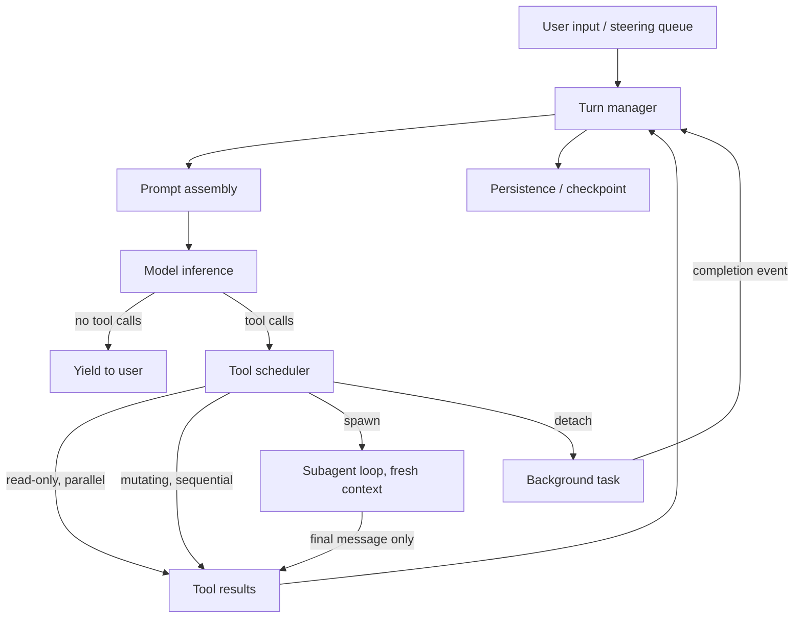

> [!info] Context
> Part of [[Harness-Internals-Overview|Harness Engineering Internals]]. Chapter: **Agent Loop and Orchestration Architecture: Single Loops, Graphs, Subagents, and the Multi-Agent Debate**. Depth level 1.

# Agent Loop and Orchestration Architecture

## 1. Executive Overview

Every agent harness has an execution engine at its core: the code that decides *what runs next*. Strip away the context management (covered in [[Harness-Internals-Context-Compilation]]) and the tool plumbing (covered in [[Harness-Internals-Tool-Calling-Internals]]) and what remains is a control-flow problem — who owns the branch decisions of the program: your code, or the model?

That single question generates the entire design space of this chapter. If your code owns the branches, you have a **workflow** — a pipeline, a router, a DAG. If the model owns them, you have an **agent** — a loop that keeps calling the model until it stops asking for tools. Every production system sits somewhere on the line between those poles, and the most interesting engineering fights of 2025–2026 — Cognition's "Don't Build Multi-Agents" versus Anthropic's multi-agent research system, LangGraph's explicit graphs versus Claude Code's flat loop — are fights about where on that line to stand for a given class of task.

The punchline, stated up front because the rest of the chapter earns it: production coding agents converged on a **single-threaded master loop** with subagents used strictly for *context isolation*, not for parallel decision-making. Multi-agent parallelism wins only for read-heavy, breadth-first tasks — and even there it costs roughly 15× the tokens of a chat. Meanwhile, the frontier of the field is shifting from "which topology?" to "how do we stop wasting the enormous amount of idle context and redundant compute these loops burn?" — which is where durable execution, checkpointing, and pipelining enter.

## 2. Historical Evolution

The pre-history is chains. In 2022–2023, "LLM applications" meant prompt pipelines: call the model, parse the output, feed it to the next call. Control flow lived entirely in developer code. This worked because models were too weak to be trusted with control flow — GPT-3.5-era models would forget the goal three steps in.

Then came the first free-form loops: AutoGPT and BabyAGI in early 2023. These handed the model full control — plan, act, observe, repeat, forever — and they mostly failed in public. The models spiraled, hallucinated task lists, repeated work, and burned money. The lesson the industry drew (temporarily) was "autonomy doesn't work," and 2023–2024 became the era of orchestration frameworks: LangChain's chains, then LangGraph's explicit state machines, Microsoft's AutoGen, OpenAI's Swarm — all attempts to cage the model inside developer-defined structure.

Two things changed the picture. First, Anthropic's December 2024 essay "Building Effective Agents" gave the field a shared taxonomy — five workflow patterns plus the autonomous agent loop — and a piece of advice that aged well: start with the simplest thing, add structure only when a simpler solution demonstrably fails. Second, models got good enough at tool use that the free-form loop started *working*. Claude Code (early 2025), Codex CLI, Cursor's agent mode, Devin — all converged on the same minimal architecture: one model, one flat message history, one while-loop. The industry ran the experiment AutoGPT proposed two years too early, and this time it succeeded.

That convergence set up the defining argument of mid-2025. In June 2025, within days of each other, Cognition published "Don't Build Multi-Agents" (parallel agents make conflicting implicit decisions; share full traces; stay single-threaded) and Anthropic published "How we built our multi-agent research system" (an orchestrator with parallel subagents beat single-agent Opus by 90.2% on research tasks). Both were right, for different task classes — untangling *why* is Section 10's job.

The current era (2026) is about efficiency and durability. Once you accept that agents are long-running distributed programs that fail mid-flight, you inherit thirty years of distributed-systems answers: event sourcing, checkpointing, durable execution (Temporal and friends), and pipeline scheduling. GitHub's engineering blog framing captures the shift: treat "agents like distributed systems, not chat flows."

## 3. First-Principles Explanation

Start from what a language model actually is: a pure function from token sequence to token distribution. It has no memory, no ability to act, no persistence. Everything that looks like agency has to be built *around* the model by ordinary software. That software is the harness, and its core is embarrassingly small:

```python
def agent_loop(user_message, tools):
    history = [system_prompt, user_message]
    while True:
        response = model.infer(history, tool_schemas(tools))
        history.append(response)
        if not response.tool_calls:
            return response.text          # model is done; yield to user
        for call in response.tool_calls:
            result = execute(call)         # the ONLY place side effects happen
            history.append(tool_result(result))
```

Everything else in this chapter is an elaboration of, or a reaction to, those ten lines. Notice what the loop gives you for free:

**The model owns control flow.** There is no `if intent == "refund"` branch in your code. The model reads the accumulated history and decides the next action. This is Anthropic's definition boundary: workflows are "systems where LLMs and tools are orchestrated through predefined code paths"; agents are systems where the model "dynamically directs its own processes and tool usage."

**The environment provides ground truth.** Each tool result is a fact the model didn't hallucinate — a compiler error, a file's real contents, a test failure. The loop is a feedback controller: the model proposes, reality disposes, and the error signal flows back into context. This is why agents work at all where open-loop generation fails: a model that writes buggy code but can *run the tests* converges; a model that can't, doesn't.

**Termination is emergent.** The loop ends when the model produces a response with no tool calls. There's no explicit "done" state; doneness is a behavior the model exhibits. This is elegant and also a failure surface — Section 9 covers premature termination and runaway loops.

Now derive the workflow patterns as *constraints you add back* when the free loop is too unreliable or too slow. Anthropic's taxonomy, read this way:

- **Prompt chaining** removes the model's control over sequencing: you fix the step order in code (draft → critique → translate) and each LLM call only fills in one step. You buy accuracy per step by trading away flexibility and latency. Use when the decomposition is known and stable.
- **Routing** lets a cheap classifier call pick which fixed path (or which model — Haiku for easy, a frontier model for hard) handles the input. You've added one model-owned branch point and kept everything else deterministic.
- **Parallelization** runs independent LLM calls concurrently — either *sectioning* (split the task) or *voting* (same task, multiple samples, aggregate). No coordination between branches; that's precisely why it's safe.
- **Orchestrator-workers** is parallelization where the *decomposition itself* is model-decided at runtime: a lead model breaks the task down, delegates, and synthesizes. This is the load-bearing pattern for subagents (Section on subagents below) and the architecture of Anthropic's research system.
- **Evaluator-optimizer** puts a generate → critique → regenerate cycle in code: one call produces, another judges against criteria, and the loop repeats until the judge passes it. It works "when we have clear evaluation criteria, and when iterative refinement provides measurable value" — vague rubrics turn it into an expensive coin flip.

The deep insight: these aren't six different technologies. They are six positions of one dial — *how much control flow do you cede to the model* — and the correct position is a function of task predictability and model capability. As models improve, the dial moves toward the free loop; that's exactly the historical trajectory Section 2 described.

## 4. Mental Models

**The loop is a CPU; context is RAM; tools are syscalls.** The master loop fetches (assemble prompt), executes (inference), and handles traps (tool calls) — a fetch-decode-execute cycle where the "instruction set" is natural language. This model predicts real phenomena: context exhaustion behaves like memory pressure (and compaction like swapping — see [[Harness-Internals-Context-Compilation]]), and tool sandboxing is exactly the user-space/kernel-space boundary ([[Harness-Internals-Runtime-Anatomy]]).

**Actions carry implicit decisions.** This is Cognition's central axiom and the single most useful sentence in the multi-agent debate. Every action an agent takes rests on dozens of micro-decisions it made while reading its context: naming conventions, style, interpretation of ambiguous requirements. Two agents acting from different contexts *will* make conflicting implicit decisions — not sometimes, structurally. Merging their outputs means reconciling decisions nobody wrote down. Every orchestration topology should be evaluated against this axiom first.

**Read vs. write is the parallelism boundary.** Parallel *reads* (search, file inspection, research) compose trivially — worst case, you fetched redundant information. Parallel *writes* (edits, commits, API mutations) conflict — worst case, you shipped two halves of incompatible designs. This one distinction predicts nearly the whole empirical record: Anthropic's parallel-subagent triumph is a read-heavy research product; Cognition's failure cases are write-heavy coding tasks. When someone proposes a multi-agent design, ask "what fraction of the actions are writes?" before anything else.

**Tokens are the budget; topology is how you spend it.** Anthropic's data: agents use ~4× the tokens of chat, multi-agent systems ~15×, and on their BrowseComp evaluation, token usage alone explained 80% of performance variance. Read that last number again — *which architecture you picked mattered far less than how many tokens you burned*. Multi-agent systems win largely because they are a mechanism for spending more tokens within a wall-clock budget and beyond a single context window's capacity. That reframing keeps you honest: the question is never "is multi-agent better?" but "is this task worth 15× tokens, and can a single bigger context do it for 4×?"

## 5. Internal Architecture

A production execution engine decomposes into six components. (This is the generic anatomy; [[Harness-Internals-Claude-Code-Architecture]] maps it onto one concrete product.)

1. **Turn manager** — owns the while-loop itself: assembles the prompt (delegating packing to the context layer), invokes inference, parses out tool calls, decides loop-continue vs. loop-exit. One "turn" = one full model-response → tool-execution round trip.
2. **Tool scheduler** — decides *how* a batch of requested tool calls runs: read-only calls concurrently, mutating calls sequentially (the Claude Agent SDK does exactly this, keying off a `readOnlyHint` annotation), long-running commands optionally detached to background with completion notifications re-injected as events.
3. **Interrupt/steering channel** — a queue that lets user input arrive *mid-turn*. On interrupt, the harness either cancels in-flight tool calls and re-prompts, or injects the message as a system reminder before the next inference so the model course-corrects without losing state.
4. **Planning layer** — plan mode (a permission state where mutating tools are locked out while the model explores and proposes), and the todo list (externalized plan state — see below).
5. **Subagent manager** — spawns child loops with fresh contexts, tracks their lifecycles, returns only their final messages to the parent as tool results.
6. **Persistence layer** — session transcripts, checkpoints, resumability. In durable-execution designs this becomes an event-sourced history (Section 7).



Notice what's *absent*: there is no graph engine, no message bus between peer agents, no blackboard. The production consensus for coding agents is that the topology above — one loop, one flat history, subagents as leaf calls — is the whole architecture.

### Todo lists as externalized planning state

The todo list deserves its own treatment because it's the sleeper innovation of this layer. A model's plan, if it lives only in its reasoning, dies at the next context compaction and drifts under distraction. Writing the plan into a structured artifact — a todo list rendered back into context every turn, or a PROGRESS.md on disk — does three jobs at once: it's a *commitment device* (the model checks items off, resisting the pull of shiny subproblems), a *recitation mechanism* (re-reading the plan each turn keeps the goal in the model's effective attention even 100 turns in), and a *checkpoint* (a fresh session can resume from the artifact). This is the builder-side mechanism behind the operator disciplines in [[Harness-Engineering-Hub]] — state persistence and WIP=1 scope control work *because* the harness gives plans a durable home outside the context window.

Plan mode is the complementary control: a harness-enforced permission state, not a prompt suggestion. Mutating tools are simply unavailable until the user approves the plan. That distinction matters — a model *asked* to plan-first will sometimes start editing anyway; a model whose Write tool returns "not permitted in plan mode" cannot. Structure you must guarantee belongs in the harness, not the prompt. (The *strength* of that gate varies by surface: the Agent SDK's permission mode hard-denies mutating tools, while the interactive CLI's default plan mode appears to lean more on a re-injected `<system-reminder>` plus an approval gate, per community teardowns — a softer, prompt-reinforced boundary. [[Harness-Internals-Planning-And-Reflection]] dissects these enforcement layers; the principle above is the design ideal the SDK path realizes.)

## 6. Step-by-Step Execution

Walk one real turn through a coding agent, using the officially documented Codex and Claude Agent SDK loops (both publish this; no inference needed). Prompt: *"Fix the failing tests in auth.ts."*

1. **Prompt assembly.** The harness concatenates: system prompt, tool schemas, project instructions (AGENTS.md / CLAUDE.md), conversation history, and the new user message. Nothing is "remembered" server-side by the model — the entire state travels in this sequence every single inference. (How it's packed and cached: [[Harness-Internals-Context-Compilation]].)
2. **Inference #1.** The model streams a response containing a tool call: `Bash("npm test")`. Michael Bolin's Codex write-up flags the latency physics here: "the model processes every input token before it can produce any output token" — so every verbose file you previously read taxes *this and every future* inference.
3. **Tool execution.** The harness (not the model) runs the command — permission checks, sandboxing, output truncation — and appends the result to history: three failures, with stack traces. This append *is* the perception step; the model will only ever know what got written into history.
4. **Inference #2.** History now = everything above + test output. The model requests `Read("auth.ts")` and `Read("auth.test.ts")`. Both are read-only, so the scheduler runs them concurrently and appends both results.
5. **Inference #3.** The model emits `Edit(auth.ts, old, new)` then `Bash("npm test")`. Mutating calls, so the scheduler serializes them. Tests pass; output appended.
6. **Inference #4.** The model, seeing green tests, produces text with no tool calls: "Fixed the null check in validateToken; all three tests pass." No tool calls → the loop exits and yields to the user. Four turns, three with tools.

Two structural observations. First, the *deliverable was never the final message* — as Bolin puts it, "the primary output... is the code it writes or edits on your machine." The text is a receipt; the side effects were the work. Second, cost: because each inference resends all prior history, total tokens grow quadratically with turn count — "doubling the session length roughly quadruples the total tokens sent." Prefix caching is what makes this economically survivable (Section 11).

If the user had typed "actually, don't touch the test file" between steps 4 and 5, the steering channel would have injected that message before inference #3, and the model would replan with full memory of what it had already learned — no restart, no lost state. That mid-turn steerability is a headline advantage of the single loop; a graph mid-node or a fleet of parallel workers has no equivalently clean injection point.

## 7. Implementation

How you'd build this yourself, layer by layer. The naive loop from Section 3 needs five upgrades before it's production-grade.

**Async tool scheduling.** Model responses can contain multiple tool calls. Classify each as read-only or mutating (a static annotation per tool; GitHub's guidance and MCP's `readOnlyHint` both formalize this), then:

```python
async def run_batch(calls):
    reads  = [c for c in calls if c.tool.read_only]
    writes = [c for c in calls if not c.tool.read_only]
    results = await asyncio.gather(*[execute(c) for c in reads])
    for c in writes:                       # order preserved, one at a time
        results.append(await execute(c))
    return results
```

**Background execution.** A dev server or a 10-minute build must not block the loop. Detach it, return a handle immediately ("started as task #3"), and when it exits, enqueue a completion event that gets injected into context at the next turn boundary. This converts the loop from strictly synchronous request/response into an event loop that merges three input streams: model output, tool completions, and user steering. The subtle part is *when* to inject — mid-inference injection is impossible (the prompt is already sent), so events queue until the next prompt assembly.

**Retries with error-context injection.** Transient failures (rate limits, network, flaky commands) get exponential backoff with jitter in harness code, invisibly. *Semantic* failures — the compile error, the failed assertion — must do the opposite: be fed back verbatim into context, because the error text is exactly the signal the model needs to self-correct. The classic bug is applying retry policy to semantic errors ("run tests" fails → harness retries the identical command three times, learning nothing, burning time). Rule: retry the *transport*, never the *semantics*; semantics go back to the model. Also cap self-correction: if the same tool fails the same way N times, escalate to the user instead of letting the model thrash.

**Reflection loops.** The evaluator-optimizer pattern in harness form: after the model claims completion, run a verification pass — a test suite, a linter, or a *critic call* (same or cheaper model, prompted only to judge against acceptance criteria, with the artifact but not the full generation history, so it can't inherit the generator's rationalizations). Feed failures back and re-enter the loop. This is the builder-side twin of the operator's "premature victory prevention" discipline in [[Harness-Engineering-Hub]] — and hooks (e.g., a Stop hook that runs the test suite and blocks completion) let you make it mandatory rather than advisory. Bound it: two or three reflection rounds capture most of the value; unbounded critic loops oscillate between two "improvements" forever.

**Durable state.** The serious version of persistence is event sourcing: append every step (inference result, tool result, user input) to a log; current state is a fold over the log. This is precisely Temporal's durable-execution model, and it's why Temporal aggressively courts agent workloads: model calls and tool calls become Activities whose results are recorded in history, and after a crash "already-completed LLM invocations and tool calls are not repeated" — a new worker replays the history and resumes at the exact failed step. The catch is determinism: replay only works if orchestration code is deterministic, so anything nondeterministic (every model call, every tool) must live in Activities, never inline. LangGraph reaches the same destination differently — checkpointing the state object at every super-step boundary — with the corresponding requirement that node logic be idempotent, since a resumed node re-executes from its start and pre-checkpoint side effects repeat. Either way, the invariant you're buying is: *an agent that dies at step 47 of 60 resumes at step 47*, not step 1. Anthropic states this exact requirement for their research system: restarts from scratch are "expensive and frustrating for users," so agents resume from checkpoints, and cross-session state feeds into [[Harness-Internals-Memory-Systems]].

### Subagents: context isolation is the point

The subagent mechanism is small: a tool (Claude Code's `Task`/`Agent` tool) whose handler spins up a *fresh* agent loop — new empty history, its own system prompt, usually a restricted tool set — runs it to completion, and returns **only its final message** as the tool result in the parent's history.

Be precise about why this exists, because it's widely misunderstood. Subagents are not primarily about parallelism, specialization, or role-play. They exist for **context isolation**. A broad codebase search might churn through 80k tokens of file dumps to produce a three-sentence answer. Run inline, those 80k tokens poison the parent's context for the rest of the session — cost on every subsequent turn, degraded attention, earlier compaction. Run in a subagent, the exploration happens in a disposable context and the parent pays only for the conclusion. The subagent is a *context firewall*: tokens go in a side channel, distilled knowledge comes back. Cognition — the most anti-multi-agent voice in the debate — explicitly endorses this narrow use: subagents that answer well-defined *questions* while the main agent keeps full visibility and makes all decisions.

Design rules that follow from the isolation purpose:

- **The parent's prompt is the subagent's whole world.** It sees none of the parent's history, so the delegation prompt must carry objective, output format, tool guidance, and boundaries. Anthropic found vague delegation ("research the semiconductor shortage") causes subagents to duplicate work, leave gaps, or misinterpret scope — teaching the orchestrator to delegate precisely was one of their biggest prompt-engineering wins.
- **Results come back as summaries, not transcripts.** The synthesis step is lossy by design; if the parent needed the full transcript, isolation would be pointless.
- **Subagents rarely spawn subagents — and shallow stays the default even where deep is now allowed.** Historically every major harness capped nesting at one level. That cap has since loosened in places (Claude Code raised it to as many as five levels around v2.1.172, per community teardown — treat the exact version as reported, not vendor-confirmed; see [[Harness-Internals-Subagent-Orchestration]]), but the reasons to *keep trees shallow* are unchanged and still decide the design in practice, in increasing order of importance: (1) runaway risk — recursive spawning is a fork bomb with API billing; (2) resource accounting — a bounded shallow tree has predictable worst-case cost, arbitrary trees don't; (3) Cognition's axiom — each nesting level is another lossy summarization boundary crossed by implicit decisions, so a depth-3 tree is playing telephone with the task spec. Shallowness keeps every worker within a hop or two of the full-context orchestrator; the raised cap is headroom, not a recommendation.

## 8. Design Decisions

### Flat loop vs. graph

LangGraph models the application as an explicit `StateGraph`: typed shared state, nodes as functions returning state updates, edges (including conditional edges) as routing, executed Pregel-style in super-steps with per-key reducers merging concurrent updates, checkpointed at every super-step boundary. You get compile-time structural validation, first-class human-in-the-loop interrupts (`interrupt()` / `Command(resume=...)`), time-travel debugging, dynamic map-reduce via the `Send` API, and total control over what runs when.

Claude Code and Codex chose ten lines of while-loop instead. This is not naivety — it's a bet with a clear rationale:

- **The model is the router.** A graph encodes, in code, decisions the model can now make in context. Every edge you draw is a decision frozen at design time by a developer with *less* information than the model has at run time. When models were weak, freezing decisions was the point; as they strengthen, each frozen edge becomes a ceiling. Anthropic's guidance was always conditional on this: add structure when the simple loop demonstrably fails — and for coding tasks, by 2025, it mostly didn't.
- **Debuggability.** A flat loop's trace *is* its message history — one linear transcript, readable top to bottom. A graph's trace is a partial order of node executions with merged state updates; reconstructing "why did it do that?" requires tooling.
- **Maintenance asymmetry.** Migration is one-way. Starting flat and adding structure later is routine; extracting a deeply-embedded graph back out of a codebase is not. Harrison Chase's own framing concedes the split: generic tasks like coding "might use simple tool-calling loops," while the durable value of a framework is the *runtime services* — persistence, streaming, human-in-the-loop, observability — not the workflow control.

So the honest decision rule: choose the graph when the process is genuinely fixed by the domain (a compliance pipeline where legal review *must* follow drafting — structure is a feature, not a ceiling), when you need checkpoint-level durability and human approval gates as platform primitives, or when regulators/auditors need a legible process. Choose the flat loop when the task distribution is open-ended and the model's runtime judgment beats your design-time judgment. LangChain's own three-layer vocabulary is useful here: LangGraph is a *runtime*, LangChain an *abstraction*, and things like Deep Agents or Claude Code are *harnesses* — the debate is really about how much of the middle layer should exist.

### Synchronous vs. asynchronous orchestration

Anthropic's research system, as shipped, ran subagents *synchronously*: the lead agent spawns a wave of 3–5 subagents, then blocks at a barrier until the whole wave completes. They name the cost themselves — the lead agent can't steer subagents mid-flight, can't act on early results, and the wave finishes at the speed of its slowest member — and the benefit: coordination stays simple, with no result-ordering, state-consistency, or error-propagation races. Async execution is the acknowledged future ("agents working concurrently and creating new subagents when needed") and the acknowledged hard problem. This is barrier-synchronized fork-join versus dataflow scheduling, replayed from parallel computing — with the extra twist that here the "processor" holding an open context during a stall is itself billed by the token.

### The multi-agent debate, resolved by task shape

Put the two 2025 manifestos side by side and the contradiction dissolves.

**Cognition's argument** (write-heavy coding): Principle 1 — share context, and "share full agent traces, not just individual messages." Principle 2 — actions carry implicit decisions, and parallel agents acting on unshared context make *conflicting* implicit decisions. Their canonical failure: task "build a Flappy Bird clone," subagent 1 builds a Mario-styled background, subagent 2 builds a bird with mismatched art direction, and the final agent inherits two miscommunications it cannot reconcile — merging code is easy, merging unstated design decisions is not. Sharing the original task text isn't enough, because in real multi-turn systems the decisions that matter are buried in intermediate tool calls each agent made privately. Their prescription: single-threaded linear agent; when tasks outgrow the window, add a *compressor* — a model (possibly fine-tuned) that distills the trace into key details and decisions — rather than parallel agents. They call frameworks marketing parallel collaboration (Swarm, AutoGen circa 2025) actively counterproductive, and note the same consolidation logic killed the 2024 edit-apply-model pattern: having a small model apply a big model's edit instructions created failures from instruction ambiguity, fixed by letting one model decide *and* act atomically.

**Anthropic's argument** (read-heavy research): for breadth-first queries — "identify all board members of S&P 500 IT companies" — parallel exploration is the only way to exceed one context window's carrying capacity, and the orchestrator-worker system beat single-agent Opus 4 by 90.2% on their internal eval. Subagents' partial redundancy doesn't corrupt anything because findings *compose*: facts merge; design decisions don't. Costs, in their own numbers: ~15× chat tokens, viable only "for high-value tasks"; parallel spawning plus parallel tool calls within subagents cut research wall-clock time by up to 90%.

The synthesis is the read/write mental model from Section 4, and both companies effectively state it: Anthropic concedes most coding "involves fewer truly parallelizable tasks than research, and LLM agents are not yet great at coordinating and delegating to other agents in real time"; Cognition concedes read-only question-answering subagents are fine. **Parallelize exploration, never decision-making.** The write path stays single-threaded; the read fan-out feeds it.

**GitHub's contribution** is the engineering floor for whoever builds multi-agent anyway: these workflows "often fail" in quiet ways — one agent closes an issue another just opened; a change ships that violates a downstream check the agent never knew existed — because agents exchange loose natural language and make implicit assumptions about state and ordering. Their fixes are classic distributed-systems hygiene: typed schemas at every boundary so invalid messages fail fast; *action schemas* (a closed discriminated union of allowed outcomes — `assign | close-as-duplicate | request-more-info | no-action`) so the model can't invent actions; validation at every boundary, logged intermediate state, and design for partial retries. Note what this is: mechanical enforcement of exactly the implicit-decision problem Cognition diagnosed — you can't make agents share minds, but you can shrink the surface across which unshared assumptions can flow.

## 9. Failure Modes

**Runaway loops.** The model re-tries a failing approach forever, or "improves" endlessly. Emergent termination has no built-in bound, so every production harness adds explicit ones — max turns, budget caps (`max_turns`, `max_budget_usd` in the Claude Agent SDK), wall-clock limits — and distinct exit codes so callers can tell *finished* from *hit limit* and resume with a raised ceiling. Debug signal: the same tool call with near-identical arguments recurring in the transcript.

**Premature termination.** The inverse: the model declares victory with failing tests. The loop exits on "no tool calls," and nothing in the mechanism validates the claim. Mitigation is the reflection layer from Section 7 — a Stop-hook verification pass that can veto completion and push the loop back in.

**Conflicting implicit decisions.** The Flappy Bird failure. Insidious because every component *individually* succeeded; the artifact is incoherent only as a whole, so no error is thrown and only end-to-end evaluation catches it. Debug by diffing the parallel branches' assumptions, then fix the architecture: move the conflicting decision *before* the fork (orchestrator decides art direction, workers implement) or eliminate the fork.

**Lossy delegation, both directions.** Down: underspecified subagent prompts yield duplicated work and scope drift. Up: over-aggressive summarization drops the one detail the parent needed, and the parent proceeds confidently on incomplete information. Debug by reading the subagent's full transcript against its returned summary — harnesses that discard child transcripts make this class of bug nearly invisible, which is an argument for persisting them even though the parent never sees them.

**Checkpoint/replay hazards.** Non-deterministic code inline in a durable workflow (a timestamp, a random ID, a direct network call) makes replay diverge from history — Temporal's determinism constraint exists precisely because of this. LangGraph's variant: checkpoints land at super-step boundaries, so a node that crashed halfway re-runs *from its start* and repeats pre-crash side effects; non-idempotent nodes (send email, charge card) execute twice. The fix is idempotency keys or upserts in every effectful node — the outbox pattern, rediscovered.

**Steering races.** The user's interrupt lands while three tool calls are in flight. Cancel them? Mutating operations half-applied are worse than completed ones — you generally must drain or roll back writes, while reads can be abandoned freely (the read/write split again, now as a cancellation policy). Then ensure the model's next prompt reflects both the interrupt *and* the true final state of whatever did execute, or the model will act on a stale world-model.

**Error cascades in orchestration.** A subagent times out, returns garbage, or hits a rate limit mid-wave. A naive orchestrator either aborts the whole run (wasting every sibling's tokens) or silently synthesizes over the hole (producing confident, incomplete answers — the worse failure). Production behavior: per-subagent timeouts and retry-with-backoff, then *explicit partial-result accounting* — the synthesis prompt is told which workers failed so the model can hedge or re-spawn, not guess.

## 10. Production Engineering

**Anthropic — Claude Research** (verified; engineering blog). Orchestrator-workers with an Opus 4 lead and Sonnet 4 subagents; lead plans, spawns 3–5 subagents in parallel, each making 3+ parallel tool calls; separate citation pass at the end. 90.2% improvement over single-agent Opus 4 on internal research evals; ~15× chat tokens; token spend explains 80% of BrowseComp variance. Effort is scaled to complexity by prompt-encoded heuristics — "simple fact-finding requires just 1 agent with 3–10 tool calls... complex research might use more than 10 subagents." Operationally: synchronous subagent waves (accepted bottleneck), checkpoint-based resume for long runs, *rainbow deployments* — old and new harness versions serving simultaneously with traffic shifting gradually, because a hard cutover would strand agents mid-flight on code that no longer exists — and observability that traces decision patterns and interaction structures without reading conversation contents ([[Harness-Internals-Evaluation-Infrastructure]] covers their LLM-as-judge rubric and small-N eval philosophy).

**Cognition — Devin** (verified as stated position; internal details inferred from their writing). Single-threaded linear agent for the write path; a context-compression model for long traces — which they admit is "hard to get right" and worth fine-tuning for; explicit rejection of parallel-collaboration architectures as of 2025, with the door left open as agents get better at long-horizon communication.

**Anthropic — Claude Code** (loop shape verified via official docs and the Agent SDK, which states it runs "the same execution loop that powers Claude Code"; internal codename "nO" for the master loop is inference — community reverse-engineering of the minified CLI, not officially documented). Single-threaded master loop, one flat message history, no competing personas; subagents via the Task/Agent tool, historically depth-limited to one level (cap since raised — see [[Harness-Internals-Subagent-Orchestration]]); read-only tools parallelized, mutating tools serialized; background Bash tasks with completion re-injection; plan mode as a permission state; automatic compaction with hookable boundaries. The full product anatomy is [[Harness-Internals-Claude-Code-Architecture]].

**OpenAI — Codex** (verified; Bolin's "Unrolling the Codex agent loop"). Same loop shape, documented with unusual candor about cost physics: full history resent per inference, quadratic session growth, prefix caching as the countermeasure, and the Responses API chosen over Chat Completions partly for 40–80% better cache utilization in multi-turn agentic use.

**GitHub — Copilot's agentic workflows** (verified; engineering blog). The typed-schema/action-schema discipline of Section 8, with MCP positioned as the enforcement layer validating inputs *and* outputs at boundaries; "treat agents like distributed systems, not chat flows."

**Temporal and the durable-execution vendors** (verified docs/blog). Agent loops as durable workflows: LLM and tool calls as Activities with automatic retry, event-sourced history, replay-based recovery so completed steps never re-execute, and Signals/Queries for human-in-the-loop without losing state. LangGraph's checkpointer is the framework-native equivalent. The shared bet: agents are long-running distributed programs, so they should inherit the reliability machinery built for those — see also [[Harness-Internals-Production-Patterns]].

## 11. Performance

The bottleneck hierarchy, in order:

**Inference latency dominates everything.** Tool execution is milliseconds-to-seconds; each inference is seconds-to-a-minute at agentic context sizes. Turn count is therefore the metric to minimize — which is why parallel tool calls matter so much (fewer round trips for the same information) and why Anthropic credits parallelization with up to 90% wall-clock reduction on complex research.

**Quadratic token growth.** Resending history every inference makes cumulative cost O(n²) in turns. Countermeasures, in order of leverage: *prefix caching* (unchanged prefixes — system prompt, tool schemas, old history — are cached at the provider; append-only history and stable prompt prefixes are what make the flat loop economically viable, and are why harnesses avoid editing old messages, which invalidates the cache); *compaction* (summarize old history — trades tokens for fidelity; mechanics in [[Harness-Internals-Context-Compilation]]); *subagent isolation* (exploratory token bursts never enter the parent's history at all); *output truncation* (cap tool results before they hit context — a 50k-token log dump is a tax on every remaining turn).

**Idle-context waste and barrier stalls.** The efficiency critique of current architectures: in synchronous fork-join, the orchestrator's large context sits idle while workers run, and each wave completes at its slowest member's pace; workers redundantly re-read overlapping sources because they can't see each other; at synchronization points, naive designs rebroadcast unchanged context wholesale (recent efficiency research measures the majority of multi-agent token budget going to retransmitted, unchanged context, and quantifies runtime supervision saving ~30% of tokens). The redesigns are pipeline-era classics: *dataflow scheduling* instead of barriers (synthesis starts on the first returned result, stragglers merge in — at the cost of the state-consistency and error-propagation complexity Anthropic flagged); *shared read caches* so worker B doesn't re-fetch what worker A fetched; *checkpointing* so failures cost one step instead of one run; *model tiering* (frontier model for orchestration and writes, cheaper/faster models for read fan-out — exactly the Opus-lead/Sonnet-workers split) and per-task effort throttling (the SDK's `effort` levels) so routine turns don't pay reasoning-depth prices.

## 12. Best Practices

Anthropic's original rule remains the field's best one-liner — "start with simple prompts, optimize with evaluation, and add complexity only when simpler solutions demonstrably fail" — build the single loop first and demand evidence before every escalation. Parallelize reads, serialize writes, and keep every decision that shapes the artifact in one context. Make delegation prompts carry objective, output format, tool guidance, and boundaries — an underspecified subagent is a coin flip you paid tokens for. Externalize plans into todo artifacts and enforce structure in the harness (permission states, hooks, schemas), not the prompt, whenever the guarantee actually matters. Bound everything: turns, budget, retries, reflection rounds, subagent depth. Feed semantic errors back verbatim and retry only transport errors. Type every inter-agent boundary and close the action space. Persist event logs and design effectful steps idempotent from day one — retrofitting durability is miserable.

Anti-patterns, all field-observed: role-play multi-agent (a "PM agent" and "engineer agent" negotiating in prose is topology cosplay — you've added lossy boundaries and gained nothing a section header in one prompt wouldn't); graphs encoding decisions the model makes better at runtime; parallel writers on shared artifacts; retrying semantic failures without new information; unbounded critic loops; and treating subagents as a specialization mechanism when their real function is context isolation.

## 13. Common Misconceptions

**"Multi-agent systems are the advanced version of single agents."** The maturity ladder runs the other way in practice: teams start with impressive-sounding swarms, get incoherent artifacts, and retreat to a single loop plus read-only fan-out. Multi-agent is a *specialized* tool for breadth-first read workloads at 15× token cost — not a graduation.

**"Subagents are for parallelism/specialization."** Their load-bearing function is context isolation. Parallelism is a bonus on read tasks; "specialization" is mostly a restricted tool set plus a focused system prompt — which you could apply without any subagent. If your subagent design doesn't save the parent's context tokens, question it.

**"The agent decides everything; the harness is a dumb pipe."** The harness owns termination bounds, permission gates, scheduling (parallel vs. sequential execution of the model's requests), retry policy, interruption, and persistence. The model proposes; the harness disposes. Most reliability wins of 2025-era agents came from the harness side, not the model side.

**"A graph is more 'production-grade' than a loop."** Conflates two independent axes. The production-grade properties — durability, checkpointing, human-in-the-loop, observability — are *runtime services*, obtainable with or without a graph (Temporal under a flat loop gives you all four). Graph topology is a separate choice about control-flow ownership. LangChain's own writing distinguishes exactly this: the orchestration structure and the runtime services are separable value.

**"More agents = more intelligence."** Token budget, not agent count, is the dominant performance variable (80% of variance on BrowseComp). Agent count is one mechanism for deploying tokens — and a mechanism that adds coordination failure modes as it scales.

## 14. Interview-Level Discussion

**Q1: You're building a coding agent. An architect proposes five parallel specialist agents — planner, coder, tester, reviewer, documenter. Critique it.**
The specialists are write-path participants sharing one artifact, so this design maximizes exposure to conflicting implicit decisions: the coder makes hundreds of unstated choices the tester and documenter can't see, and every hop between specialists is a lossy summarization boundary. The role division also mistakes *phases* for *agents* — plan, code, test, review are sequential phases of one task, cleanly expressible as one loop's progression (or, at most, prompt-chained stages over shared full context), not concurrent workers. Legitimate salvage: read-only fan-out (parallel searchers feeding the coder), a critic pass as evaluator-optimizer (a *call*, not a peer agent), and subagents for context isolation on exploration. Cite the record: Cognition's argument plus Anthropic's own concession that coding lacks truly parallelizable structure.

**Q2: Your agent dies at step 47 of a 60-step migration. Design for resumption.**
Event-source the run: append every inference result, tool result, and user input to a durable log; state = fold(log). On restart, rebuild context from the log and resume at 47. Two hard requirements: deterministic orchestration code (all nondeterminism — model calls, tools, clocks, randomness — behind recorded Activity boundaries, or replay diverges) and idempotent effectful steps (crash-then-retry double-executes the step in flight; use idempotency keys/upserts). Then the LLM-specific wrinkle: replaying *prompts* isn't enough if the provider's sampling differs — you must record *results*, never re-derive them. Temporal gives this off the shelf; LangGraph's checkpointer approximates it at super-step granularity; a bespoke harness can get 80% with a JSONL transcript plus a resume-from-transcript path — which is also, not coincidentally, what makes session forking and time-travel debugging possible.

**Q3: When is LangGraph's explicit graph genuinely the right call over a flat loop?**
When the control flow is fixed by the *domain*, not chosen by the developer: regulated pipelines where step order is a compliance requirement; approval gates where a human must sign off between specific stages (graph interrupts make this a platform primitive rather than prompt-and-hope); heterogeneous multi-model pipelines where each stage has a different model, budget, and SLA; and anywhere audit demands a legible, statically-analyzable process. The tell in the other direction: if you find yourself adding conditional edges to let the model choose among many paths, you're hand-building a worse version of the model's own routing — collapse it to a loop.

**Q4: Why does the read/write distinction keep appearing at every layer of this chapter?**
Because it's the commutativity boundary, and commutativity is what parallel correctness reduces to. Reads commute — any interleaving yields the same world — so they parallelize, cancel freely, cache shareably, and tolerate redundancy at worst as wasted tokens. Writes don't commute — order and exclusivity define the outcome — so they serialize, require drain-or-rollback on interrupt, demand idempotency under replay, and can't be safely delegated to actors with divergent context. One invariant, five mechanisms: tool scheduling, multi-agent topology, cancellation policy, checkpoint semantics, and delegation rules all fall out of it. It's the same reason databases distinguish shared from exclusive locks.

**Q5: Multi-agent research cost 15× tokens for +90.2% on evals. Walk the actual economics.**
First correct the frame: 90.2% is against a *single-agent* baseline on breadth-first research evals, where the single agent structurally can't fit the corpus in one window — partly a capability unlock, not a pure quality delta, and token spend alone explains 80% of variance, so much of the win is "spent more tokens efficiently in parallel." Then it's expected-value arithmetic: 15× token cost against the value of the answer and the cost of human time displaced. Legal due diligence or competitive intelligence clears the bar easily; a casual question doesn't. Then check the task-shape precondition — read-heavy and decomposable — or the premium buys incoherence instead of coverage. And compare the true alternative: a single agent with compaction and 4× tokens may reach 80% of the quality at a quarter of the cost; whether the marginal quality is worth ~4× more is a product decision, not an architecture decision.

**Q6: Design mid-turn steering. What are the hard parts?**
Input arrives on a channel the loop polls at defined points, never as preemption of inference (the prompt already left). Decisions: (1) injection points — next turn boundary is safe; aborting the in-flight inference is faster but discards paid tokens; (2) in-flight tools — abandon reads, drain or roll back writes, then reconcile: the next prompt must reflect both the user's correction and the *true* final state of what executed, else the model plans against a stale world; (3) semantics — append as a user message the model may weigh, or as a directive that forces replanning; harnesses often mark these distinctly (system-reminder framing) so the model treats steering differently from conversation; (4) races — the user says "stop" the instant the model finishes; you need a consistent rule for whether post-hoc corrections re-open the turn. The single-threaded loop makes all four tractable because there's exactly one context to reconcile; that's an underrated argument for it.

**Q7: Your orchestrator's subagent wave has a straggler: four of five done for 90 seconds, one still running. What do you change?**
Immediate mitigations: per-subagent timeout with partial-result return (the synthesis prompt told explicitly which worker is missing what); hedged requests (spawn a duplicate of the straggler, take first result — the tail-latency trick from search infrastructure, affordable here only because reads tolerate redundancy). Structural fix: replace the barrier with dataflow — synthesis begins incrementally on arrivals, stragglers merge in, and the orchestrator can re-scope or kill a straggler based on what siblings already found (which the barrier design forbids: no mid-wave steering). Costs to name honestly: incremental synthesis must handle late evidence contradicting early conclusions, and error propagation gets messier — exactly the async challenges Anthropic cited for shipping synchronous anyway. The general lesson: barrier synchronization prices your whole wave at its slowest member, and with per-token billing on idle orchestrator context, that price is unusually visible.

## 15. Advanced Topics

**Asynchronous multi-agent coordination.** The named frontier: orchestrators that steer running subagents, spawn on demand, and consume results as dataflow. The open problems are state consistency (workers acting on a world an earlier worker changed), result ordering, and error propagation across a dynamic task graph — distributed-systems problems with a stochastic component in every node.

**Learned orchestration.** Today's delegation heuristics ("simple = 1 agent, 3–10 calls") are prompt-encoded folklore. The research direction is models trained to *decide* decomposition, worker count, and token budgets — RL over orchestration decisions with cost in the reward — plus fine-tuned compressor models (Cognition's stated bet) that preserve decision-relevant details far better than generic summarization.

**Agent-to-agent communication beyond summaries.** Everything in this chapter passes prose between contexts. Alternatives under exploration: structured artifacts (typed findings with provenance), shared memory stores workers read/write with locking (rebuilding the blackboard architecture from 1980s AI, now with token budgets — see [[Harness-Internals-Memory-Systems]]), and KV-cache-level sharing so parallel workers reuse each other's prefix computation rather than re-embedding identical sources.

**Efficiency as a first-class research target.** Measured findings that most multi-agent token spend is retransmitted unchanged context, and that runtime supervision (pruning redundant actions, capping observations) saves ~30% of tokens, point to a near future where the scheduler — not the topology — is the main object of optimization: differential context updates instead of rebroadcast, speculative execution of likely-next tools, admission control on token budgets per subtree.

**Verified termination and progress guarantees.** Emergent termination is unverified today; work on progress metrics (is the diff converging? are test failures monotonically decreasing?) aims to give the harness a principled basis for "this loop is thrashing, intervene" beyond crude turn caps.

## 16. Glossary

- **Workflow**: system where LLM and tool calls follow developer-predefined code paths; the code owns control flow.
- **Agent**: system where the model dynamically directs its own process and tool usage; the model owns control flow.
- **Turn**: one full cycle of model response → tool execution → results fed back. A session is a sequence of turns.
- **Master loop**: the single-threaded while-loop (inference → tools → append → repeat until no tool calls) at the core of production coding agents.
- **Prompt chaining / Routing / Parallelization / Orchestrator-workers / Evaluator-optimizer**: Anthropic's five workflow patterns — fixed sequence; classify-then-dispatch; independent concurrent calls (sectioning or voting); model-decided decomposition with delegation and synthesis; generate-critique-regenerate loop.
- **Subagent**: child agent loop with a fresh, isolated context, spawned as a tool call; returns only its final message to the parent.
- **Context isolation**: confining high-volume exploratory tokens to a disposable child context so the parent pays only for conclusions; the primary reason subagents exist.
- **Implicit decision**: an unstated choice embedded in an agent's action, invisible to agents that didn't share its context; the root cause of parallel-write incoherence (Cognition).
- **Barrier synchronization**: fork-join scheduling where the orchestrator blocks until an entire wave of workers completes; simple, but prices the wave at its slowest member.
- **Dataflow scheduling**: consuming worker results as they arrive and acting incrementally, instead of waiting at a barrier.
- **Steering**: injecting user input mid-task so the agent course-corrects without restarting; requires an input queue and defined injection points.
- **Plan mode**: harness-enforced permission state in which mutating tools are unavailable while the model explores and proposes a plan.
- **Reflection / evaluator-optimizer loop**: post-hoc verification (tests, linters, critic model) whose failures are fed back into the loop before completion is accepted.
- **Error-context injection**: returning semantic failures (compiler output, failed assertions) verbatim into context so the model can self-correct — as opposed to harness-level retry, which is for transport failures only.
- **Durable execution**: running the agent as an event-sourced workflow whose history is replayed after a crash so completed steps never re-execute (Temporal model).
- **Checkpointing**: persisting execution state at defined boundaries (e.g., LangGraph super-steps) to enable resume, human-in-the-loop pauses, and time-travel debugging.
- **Event sourcing**: representing state as a fold over an append-only log of events rather than a mutable snapshot.
- **Super-step**: one discrete iteration of LangGraph's Pregel-style execution, in which all activated nodes run (possibly in parallel) and their state updates are merged by reducers.
- **Rainbow deployment**: running old and new harness versions simultaneously and shifting traffic gradually, so in-flight agents are never stranded by a cutover.
- **Action schema**: a closed, typed set of allowed agent outcomes (discriminated union), enforced at the boundary so agents cannot invent actions.

## 17. References

- **Anthropic — "Building Effective Agents"** (https://www.anthropic.com/research/building-effective-agents) — The field's shared taxonomy: workflows vs. agents, the five patterns, and the simplicity-first doctrine. Read first; every other source argues with or builds on its vocabulary.
- **Cognition — "Don't Build Multi-Agents"** (https://cognition.com/blog/dont-build-multi-agents) — The case for single-threaded agents: share full traces, actions carry implicit decisions, the Flappy Bird failure, the compressor alternative. Read when tempted to parallelize a write path.
- **Anthropic — "How we built our multi-agent research system"** (https://www.anthropic.com/engineering/multi-agent-research-system) — The strongest production counterpoint: orchestrator-workers with hard numbers (90.2%, 15×, 80%-of-variance), delegation prompt engineering, sync-vs-async trade-offs, rainbow deployments, resume. Read alongside Cognition's piece — the pair defines the debate.
- **OpenAI — "Unrolling the Codex agent loop"** (Michael Bolin) (https://openai.com/index/unrolling-the-codex-agent-loop/) — The most candid official walkthrough of a production loop's mechanics and cost physics: full-history resend, quadratic growth, prefix caching, Responses API cache gains. Read to ground the economics of Section 11.
- **Claude Docs — "How the agent loop works" (Agent SDK)** (https://code.claude.com/docs/en/agent-sdk/agent-loop) — The same loop as an operable API: turns, message types, parallel read-only tool execution, limits, compaction, hooks, subagent context rules. Read when building on the SDK or verifying loop behavior claims.
- **GitHub Blog — "Multi-agent workflows often fail. Here's how to engineer ones that don't."** (https://github.blog/ai-and-ml/generative-ai/multi-agent-workflows-often-fail-heres-how-to-engineer-ones-that-dont/) — Failure taxonomy plus the typed-schema/action-schema discipline; "treat agents like distributed systems, not chat flows." Read before wiring any two agents together.
- **LangChain Blog — "How to think about agent frameworks"** (https://www.langchain.com/blog/how-to-think-about-agent-frameworks) — The framework-side rebuttal: context control as the hard problem, the critique of opaque agent abstractions, declarative-vs-imperative disentangled, runtime services as the durable value. Read for the graph side of Section 8's argument.
- **LangGraph Docs — Graph API concepts** (https://docs.langchain.com/oss/python/langgraph/graph-api) — The concrete graph execution model: StateGraph, reducers, Pregel-style super-steps, Send API, checkpointing and interrupts. Read to understand exactly what the flat loop is declining to buy.
- **Temporal Blog — "Durable Execution meets AI"** (https://temporal.io/blog/durable-execution-meets-ai-why-temporal-is-the-perfect-foundation-for-ai) — Event history, replay, Activities-vs-Workflows, determinism constraints, human-in-the-loop signals — the durable-execution model applied to agent loops. Read when your agents start running longer than your deploy cycle.
- **arXiv — "Stop Wasting Your Tokens: Towards Efficient Runtime Multi-Agent Systems"** (https://arxiv.org/html/2510.26585v2) — Empirical grounding for the efficiency critique: token waste patterns and a runtime supervisor saving ~30% of tokens. Read for Section 15's research direction.

## 18. Subtopics for Further Deep Dive

### Subagent Orchestration Internals
- **Slug**: Agent-Loop-Subagent-Orchestration
- **Why it deserves a deep dive**: This chapter covered the why (context isolation) and the rules (depth 1, summary returns); a full chapter exists in the how — spawn lifecycle, delegation prompt construction, result synthesis strategies, partial-failure handling, and cost accounting across a subagent tree.
- **Has enough depth for a full chapter**: yes
- **Key questions to answer**: How do production harnesses construct delegation prompts and validate returned summaries? What synthesis strategies (concatenate, re-rank, adjudicate) work at 5+ workers? How should budgets and timeouts propagate down a subagent tree?

### Durable Execution and Event-Sourced Agent State
- **Slug**: Agent-Loop-Durable-Execution
- **Why it deserves a deep dive**: Checkpointing, replay determinism, and idempotency got one implementation section here but constitute an entire engineering discipline — and they're where agent infrastructure most directly inherits (and strains) classical distributed-systems machinery.
- **Has enough depth for a full chapter**: yes
- **Key questions to answer**: How do Temporal-style replay and LangGraph-style checkpointing differ in guarantees and failure semantics? How do you make LLM calls replay-safe given provider nondeterminism? What does exactly-once tool execution actually require?

### Schedulers, Background Tasks, and Mid-Turn Steering
- **Slug**: Agent-Loop-Scheduling-And-Steering
- **Why it deserves a deep dive**: The event-loop transformation of the agent loop — merging model output, tool completions, and user interrupts — is the least-documented part of production harnesses and the source of the subtlest races.
- **Has enough depth for a full chapter**: yes
- **Key questions to answer**: What are the correct cancellation semantics for in-flight mutating tools? How do harnesses order and frame injected events (completion notifications, steering messages) so models treat them correctly? How does hedged/speculative tool execution interact with permission systems?

### Planning Layers: Plan Mode, Todo State, and Reflection Loops
- **Slug**: Agent-Loop-Planning-And-Reflection
- **Why it deserves a deep dive**: Externalized planning (todo artifacts, plan-mode permission states) and bounded self-correction (critic passes, Stop-hook verification) each got a section here; together they form the harness's entire "metacognition" layer and deserve mechanism-level treatment.
- **Has enough depth for a full chapter**: yes
- **Key questions to answer**: What makes recitation-style plan re-injection effective, and when does it degrade into noise? How should critic prompts be constructed so they don't inherit the generator's rationalizations? Where is the empirical point of diminishing returns for reflection rounds?

### The Economics of Agent Topologies
- **Slug**: Agent-Loop-Token-Economics
- **Why it deserves a deep dive**: The 4×/15×/80%-of-variance numbers suggest topology choice is substantially a budgeting problem; a dedicated chapter could build actual cost models — cache-adjusted quadratic growth, subagent isolation savings, parallel wall-clock value — instead of rules of thumb.
- **Has enough depth for a full chapter**: yes
- **Key questions to answer**: How do you model cache-adjusted session cost as a function of turn count and prefix stability? At what task-value threshold does 15× multi-agent spend dominate 4× single-agent-with-compaction? How should per-subtree token budgets be set and enforced?

