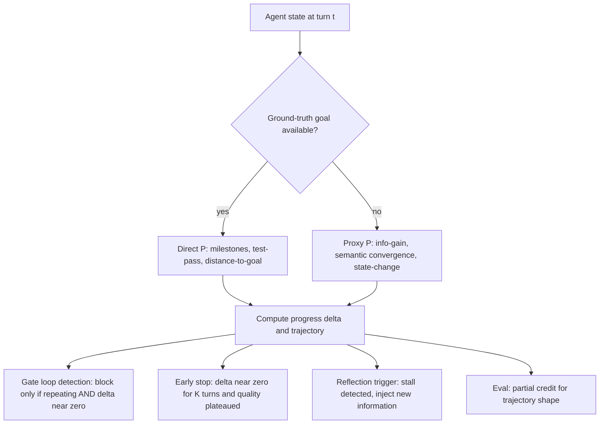
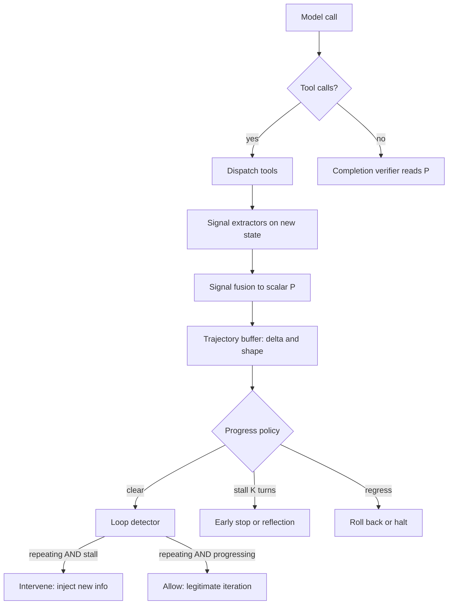

> [!info] Context
> Part of [[Harness-Internals-Overview|Harness Engineering Internals]], Level 2 wave. Parent chapters: [[Harness-Internals-Termination-Budgets-Loop-Control]] (which named a rigorous progress signal "arguably the single highest-value open problem in termination") and [[Harness-Internals-Agent-Loop-Architecture]] (whose §15 flagged "verified termination and progress guarantees" as an open frontier). This chapter builds the missing primitive both of them kept reaching for: a *progress metric* — a harness-computable answer to "is this agent getting closer to done?" It sits underneath loop detection, budget-aware stopping, and trajectory-quality evaluation, and it is the shared dependency of [[Harness-Internals-Agentic-Search-vs-Embedding-Retrieval]] (which wants to cut turn counts) and the doom-loop discrimination problem (which wants to stop without false positives).

# Agent Progress Metrics

## 1. Executive Overview

Two Level 2 chapters in this repository independently hit the same wall. The agentic-search chapter wanted to reduce an agent's turn count without hurting recall. The termination chapter wanted to break doom-loops without misfiring on legitimate iteration. Neither could close the gap with the tools they had, and both bottomed out on the same unanswered question: **how does an agent know it is making progress?**

That question is not rhetorical, and it is not solved. Every mechanism in the termination chapter — turn caps, fingerprint detectors, budget countdowns — is a *proxy* for progress, because none of them can measure the thing you actually care about. A turn cap counts steps but not advancement. A fingerprint detector catches repetition but cannot tell you whether the repetition is a stuck agent or a legitimately-polling one. A token budget counts what you *spent*, never what you *bought*. The whole discipline of termination engineering is a workaround for the absence of a direct progress signal. Build that signal and half the workarounds dissolve.

Here is the reframing claim, the one that should change how you think even if you have already built an agent loop: **a progress metric is not a monitoring nicety bolted onto the loop — it is a fifth clock, orthogonal to the four resource clocks (turns, tokens, dollars, wall-time), and it is the only one that measures *value delivered* rather than *resources consumed*.** The four resource clocks all answer "how much has this cost?" A progress metric answers "is it working?" — and that is a categorically different question that no amount of resource accounting can approximate. An agent can burn zero incremental tokens per turn and make zero progress (a tight doom loop); it can burn enormous tokens per turn and make enormous progress (a hard refactor converging). Resource clocks conflate these; a progress clock separates them.

The uncomfortable truth this chapter will keep returning to: progress is *easy* to define when you have a ground-truth goal state (distance-to-goal, milestones reached, test-pass delta) and *genuinely hard* — arguably not fully solved as of mid-2026 — when you do not, which is the normal production case. Worse, the most obvious fix, asking the model "how much progress have you made?", has been measured to *degrade* task success rather than help it. So the chapter builds up from the tractable cases, confronts the intractable one honestly, and shows which partial answers actually ship.

## 2. Historical Evolution

Progress measurement for agents did not start with agents. It is a re-import of ideas from three older fields, and knowing the lineage tells you which parts are solved.

**Phase 0 — potential functions in classical RL (1999).** Ng, Harada, and Russell's potential-based reward shaping (PBRS) proved something that is now the theoretical bedrock of this whole topic: you can add a shaping reward of the form `γ·Φ(s') − Φ(s)` — the *change* in a potential function `Φ` over the state — to a reinforcement-learning problem *without changing the optimal policy*, provided `Φ` depends only on the state. `Φ(s)` is, definitionally, a progress metric: "how good is this state, how close to the goal." The 1999 result is why "progress = difference in a potential over states" is not a heuristic but a principled construction. The catch it left behind, unsolved for 25 years and still unsolved for LLM agents: PBRS tells you progress *is* `Φ(s') − Φ(s)`, but it does not tell you what `Φ` *is* for an open-ended task. In a gridworld, `Φ` is Euclidean distance to the exit. In "fix the failing test," `Φ` is undefined.

**Phase 1 — process supervision for reasoning (2023).** The LLM field rediscovered the same idea under a new name. OpenAI's "Let's Verify Step by Step" (arXiv 2305.20050) trained a *process reward model* (PRM) that scores each intermediate reasoning step, not just the final answer, and released PRM800K — 800,000 human step-level correctness labels on MATH solutions. The finding that mattered: process supervision beat outcome supervision, and a process-supervised verifier solved 78% of a MATH test subset. This established that step-level "is this step good?" signals are both learnable and more useful than final-answer-only signals — the reasoning-model version of a progress metric.

**Phase 2 — automated process labels (late 2023–2024).** Human step-labeling does not scale. Math-Shepherd (arXiv 2312.08935) removed the human: it defines the quality of an intermediate step by *Monte-Carlo rollout* — from a given prefix, sample `k` completions, and score the step by the fraction that reach the correct final answer. This is PBRS's `Φ` estimated empirically: a step's value is its probability of leading to success. It is the single most important idea for progress-without-a-goal, because it grounds "progress" in *eventual outcome* rather than in any hand-specified distance — but it needs the ground-truth answer to compute the rollouts, which is exactly what production does not have at runtime.

**Phase 3 — progress as an agent benchmark metric (2024).** AgentQuest (arXiv 2404.06411) was the first to argue that binary success/failure is too coarse to *debug* agents, and shipped two cross-benchmark metrics: a **progress rate** (how far toward the goal, computed against annotated milestones) and a **repetition rate** (how much the agent repeats actions). Crucially, it showed the two together diagnose failure: *progress-rate saturation plus rising repetition rate* is the signature of a stuck agent. This is the first time the field wrote down the conjunction the termination chapter later needed — repetition *and* lack of progress — as a measurable pair.

**Phase 4 — progress trained into the policy (2025).** With RL-for-search maturing (Search-R1, arXiv 2503.09516), the question became whether progress could be *internalized* rather than *measured externally*. Search-R1 used only an outcome reward and let efficient search behavior emerge; the next step made the progress signal explicit and dense. Information Gain-based Policy Optimization (IGPO, arXiv 2510.14967) defines a per-turn reward as the *marginal increase in the policy's probability of the correct answer* after each tool call — a turn-level progress signal, trained in, that gave dense gradients where outcome-only RL gave none.

**Phase 5 — progress as the loop's own control signal, and the honesty crisis (2025–2026).** The frontier turned to using progress *at runtime* to control the loop, and immediately ran into a wall. The perseveration-loop work (arXiv 2510.10823) formalized doom loops as *cycle detection AND progress-below-ε AND high-revisit-ratio*, making a progress term load-bearing for loop detection. Semantic early-stopping (arXiv 2606.27009) proposed stopping when successive answer embeddings stop changing. And then RePro (arXiv 2606.14302) reported the crisis: asking an agent to estimate its own progress *online* — verbalize a 0–100% completion number before each action — *consistently degraded* task success (−8.6% on average across two frontier models), while the *same* progress information helped when grounded retrospectively in known outcomes. Progress is real and useful, but the naive way to get it — ask the model — actively hurts. That tension defines the current state of the art and the rest of this chapter.

The through-line: progress metrics are a 25-year-old solved problem *when you have `Φ`*, and an open problem *when you must invent `Φ` for an open-ended task at runtime without the answer.* Every technique below is a different bet on how to approximate `Φ`.

## 3. First-Principles Explanation

Start from the loop, stripped to its exit conditions (the loop from [[Harness-Internals-Agent-Loop-Architecture]] §3, read now for what it *cannot* see):

```python
while True:
    resp = model.call(context)
    if not resp.tool_calls:
        break                    # natural termination — a claim, not a fact
    results = dispatch(resp.tool_calls)
    context.extend(results)
```

Ask the first-principles question the termination chapter deferred: *at the top of each iteration, is the agent closer to done than it was last iteration?* The loop has no way to answer. It knows how many times it has looped (turn count), how big the context is (token count), and how long it has run (wall-clock) — but "closer to done" is a statement about the *task*, and nothing in the loop measures the task. This is the gap.

Formalize what a progress metric must be. Let `s_t` be the agent's state at turn `t` (context, environment, accumulated results). A progress metric is a function `P(s_t)` such that `P` increases as the agent approaches task completion. Two derived quantities matter more than `P` itself:

- **Progress delta** `ΔP_t = P(s_t) − P(s_{t−1})` — the per-turn advancement. This is the PBRS shaping term. `ΔP_t > 0` means the last turn helped; `ΔP_t ≈ 0` for several turns means the agent has stalled; `ΔP_t < 0` means it went backwards (reverted a good edit, corrupted state).
- **Progress trajectory** `{P(s_0), P(s_1), ..., P(s_t)}` — the shape over time. A healthy task shows a rising, roughly monotone curve; a doom loop shows a flat curve; a thrashing agent shows a sawtooth.

Now derive *why this is hard* from the definition, because the difficulty is not incidental — it is structural, and understanding it prevents you from shipping a broken metric.

**Difficulty 1: `P` requires knowing the goal, which you usually don't.** `P(s_t)` is "distance to completion," and completion is a state you cannot enumerate for an open-ended task. For "sort this list," the goal state is computable, so `P` is trivial (fraction sorted). For "audit this repo for security issues," there is no goal state — you do not know how many issues exist, so you cannot measure distance to having found them all. *The absence of a goal state is the normal production case,* and it is why progress-with-ground-truth (§ tractable cases below) and progress-without-ground-truth (§2 of the must-answers) are different problems with different solutions.

**Difficulty 2: the agent is the worst-placed observer of its own progress.** The intuitive fix — the model *is* reasoning about the task, so ask *it* — fails empirically. RePro measured online self-estimated progress as a net negative. The mechanism is instructive: a model asked to output "45% complete" is generating a token like any other, subject to the same confidence miscalibration as the rest of its output, and the act of committing to a number appears to bias subsequent behavior (an agent that just said "90% done" is primed to wrap up prematurely). Worse, self-assessed uncertainty in LLMs does not generalize across task distributions (arXiv 2602.06948 documents systematic agentic *overconfidence*). So the progress signal cannot simply be the model's self-report; it must be computed by the harness from observable state, or trained into the policy where it can be grounded against outcomes.

**Difficulty 3: repetition and progress are not the same axis, and conflating them is the doom-loop bug.** A poll loop that repeats `check_deploy_status` ten times while the deploy advances is repeating *with* progress. An agent that re-runs the same failing test three times is repeating *without* progress. A naive detector sees only the repetition and cannot distinguish them — this is precisely the false-positive/false-negative tension the termination chapter documented. Repetition is *necessary* for a doom loop but not *sufficient*; the sufficient condition is `repetition AND ΔP ≈ 0`. The progress metric is the second conjunct, and it is the one that was missing.

Those three difficulties define the shape of every real solution: because you rarely have the goal (D1), you approximate `P` with a *proxy* computed from observable signals; because the model can't self-report reliably (D2), the proxy is harness-computed or policy-internal, not prompted; and because repetition alone lies (D3), you use `ΔP` to gate loop detection rather than replace it.



## 4. Mental Models

**Progress is the derivative of the task, not the derivative of the transcript.** The single most common conceptual error is measuring change in the *conversation* (tokens produced, tool calls made, text written) and calling it progress. The transcript changing is not the task advancing — a doom loop produces a rapidly-growing transcript with a flat task state. Hold the mental image of two curves: the transcript length, always rising, and the task completion, which is the one you care about and which the transcript's slope tells you nothing about. A progress metric is an estimator of the *second* curve's slope. Whenever someone proposes a progress signal, ask: "if the agent were stuck in a perfect doom loop, would this signal still rise?" If yes (token count, turn count, message count all fail this test), it is a transcript derivative, not a progress derivative.

**The fuel gauge versus the odometer.** The termination chapter gave you the fuel gauge (budget countdown — how much you have left to spend) and the fuel-cutoff breaker (hard budget). A progress metric is neither. It is the *odometer combined with the map* — it tells you how far you have actually traveled toward the destination, which is orthogonal to how much fuel remains. You can be low on fuel and nearly there (stop, you'll make it), low on fuel and nowhere (abort, top up, replan), or full of fuel and going in circles (the doom loop — full tank, odometer not moving). The four resource clocks are all fuel gauges; the progress metric is the odometer. A car with only fuel gauges and no odometer cannot tell "almost home" from "hopelessly lost" — both just look like "fuel decreasing."

**Progress as a potential field, and the doom loop as a local minimum.** Borrow the physicist's picture from PBRS. Imagine task-space as a landscape where height is `−P` (low = done). A healthy agent rolls downhill. A doom loop is the agent trapped in a *local minimum* — a "soft trap," in the perseveration paper's exact language, "a local attractor that tempts entry but imposes a slightly higher cost to exit." The agent oscillates in the basin (ABAB), never climbing out. This model predicts the escape strategy: you do not escape a local minimum by trying harder in the same direction (re-running the test) — you escape by *adding energy from outside* (injecting new information, forcing a different tool). It also predicts the detection strategy: measure `ΔP` over a window; a basin shows `ΔP` oscillating around zero with no net descent. The geometry paper (arXiv 2512.10350) makes this literal, treating successive agent states as points on a unit hypersphere and distinguishing a *contractive* regime (converging to a stable attractor — either done or stuck) from an *exploratory* regime (productive divergence).

**Two ways a trajectory can converge, and only one is good.** This is the subtlety that trips up naive semantic-similarity stopping. When successive states stop changing (embeddings converge), it means one of two opposite things: the agent *finished* (converged on the answer — good, stop) or the agent is *stuck* (converged on a fixed point it can't leave — bad, intervene). Convergence alone cannot tell them apart, which is why semantic early-stopping needs a *second* signal — "the answer's measured quality stops improving" — to disambiguate "converged because done" from "converged because stuck." Hold this: a progress metric that only measures *change* is ambiguous at zero; you need a metric that measures *quality* or *distance-to-goal* to break the tie. Convergence is necessary evidence of stopping-worthiness but never sufficient.

## 5. Internal Architecture

A progress-aware harness adds one subsystem to the six components of [[Harness-Internals-Agent-Loop-Architecture]] §5 and rewires three existing ones to consume its output. The subsystem is the **progress estimator**, and its job is to turn raw state into a scalar `P(s_t)` (and its delta) every turn.

- **Signal extractors.** A set of cheap functions, each producing one candidate progress signal from the turn's observable state: a *state-change extractor* (diff size, files touched, environment variables changed), a *test extractor* (count of passing/failing tests parsed from tool output), a *novelty extractor* (was this tool result seen before, or is it new information), a *semantic extractor* (embed the agent's current answer/plan, compare to last turn), and — where milestones are annotated — a *milestone extractor* (which known checkpoints are satisfied). Each is domain-specific; the harness runs whichever apply to its tool set.
- **Signal fusion.** Combines the extractors into a single `P(s_t)`. Naive fusion is a weighted sum; better fusion is a small learned model (the rubric PRM of SWE-TRACE, arXiv 2604.14820, which fuses test results, code edits, and localization into one score). Fusion must handle missing signals (no tests in this repo → drop the test extractor, don't zero it).
- **Trajectory buffer.** A ring buffer of recent `P` values, mirroring the loop detector's fingerprint buffer from the termination chapter — deliberately, because the two are consumed together. It computes `ΔP_t`, the windowed mean delta, and the trajectory shape (rising / flat / sawtooth).
- **Progress policy.** The decision layer that maps the trajectory to actions: `clear` (progressing, continue), `stall` (flat for K turns, trigger reflection or stop), `regress` (going backwards, alarm). This is what the loop detector and finalizer consume.

The data flow, showing where the estimator plugs into the existing loop:



Two architectural points carry the design. First, the progress estimator runs *after dispatch* (it needs the new state) but its output is consumed *before* the next model call, so the progress signal for turn `t` gates the harness's decision to *enter* turn `t+1`. Second, and this is the load-bearing integration with the parent chapter: **the loop detector no longer fires on repetition alone.** It fires on `repetition AND (progress policy == stall)`. This single change is how the progress metric dissolves the false-positive problem — the poll-with-progress case now shows `repetition` true but `stall` false, and the detector correctly stays silent.

## 6. Step-by-Step Execution

Walk one concrete trajectory with the progress estimator live, so you can see `P` do work the resource clocks cannot. Task: *"make the flaky integration test pass"* — the same scenario the termination chapter used, now instrumented.

The estimator here fuses three extractors: `tests_passing` (parsed from test output), `files_touched` (novel files edited), and `answer_novelty` (is the model saying something new). Weights: tests dominate, because for a "make the test pass" task, test-pass count is the closest thing to ground-truth `Φ` available.

1. **Turn 1.** Model runs `npm test -- integration`. Output: "1 failing (expected 200, got 500)." Extractors: `tests_passing = 0/1`, `files_touched = 0`, `answer_novelty = high` (first observation). Fused `P(s_1) = 0.15`. `ΔP_1 = +0.15`. Policy: `clear`.
2. **Turn 2.** Model reads the handler, edits a line, re-runs. Output: still "1 failing (expected 200, got 500)" — byte-identical. Extractors: `tests_passing = 0/1` (unchanged), `files_touched = 1` (edited handler — a small positive), `answer_novelty = low` (same error). Fused `P(s_2) = 0.18`. `ΔP_2 = +0.03` — barely moved. Policy: `clear`, but the buffer notes the delta is shrinking.
3. **Turn 3.** Model makes a similar edit, re-runs. Same failing output. Extractors: `tests_passing = 0/1`, `files_touched = 1` (same file re-edited, no new file → novelty of *state* is zero), `answer_novelty = low`. Fused `P(s_3) = 0.18`. `ΔP_3 = 0.00`. Now the fingerprint detector *also* sees the third identical `npm test`. **The conjunction fires: `repetition AND ΔP≈0`.** Under the termination chapter's repetition-only detector this was already a `block`; here it is a *confirmed* block, because the progress metric rules out the false-positive interpretation (a polling tool would have shown `files_touched` or `tests_passing` moving). The harness injects new information: "You have run this test three times, tests-passing is stuck at 0, and no new file has been touched. The failure may be a race condition invisible in the output. Try `--runInBand` or add logging."
4. **Turn 4.** Steered, the model runs `npm test -- integration --runInBand`. Output: "1 passing." Extractors: `tests_passing = 1/1` — the ground-truth signal jumps. Fused `P(s_4) = 0.95`. `ΔP_4 = +0.77` — a large positive delta, the signature of real progress. Policy: `clear`, trajectory now steeply rising.
5. **Turn 5.** Model emits no tool calls: "Fixed; the race is resolved with `--runInBand`." The completion verifier reads `P(s_4) = 0.95` and confirms `tests_passing = 1/1` in the transcript — natural termination *backed by the progress signal*, accepted as finished rather than merely stopped.

Contrast the counterfactual where step 4's steer fails and the model re-runs the identical test a fourth, fifth time. The progress trajectory stays pinned at 0.18 — a flat line — and after `K=2` more stalled turns the progress policy escalates from `stall` to a *hard* early-stop, routing through the finalizer (commit WIP, write handoff) *before* the turn budget is anywhere near exhausted. The resource clocks would have let this run to `max_turns=25`; the progress clock stops it at turn 6, having correctly concluded "not converging." That is the fifth clock earning its place: it stopped a doomed run 19 turns early, on evidence about the *task*, not the *budget*.

Now the harder scenario — no ground truth. Task: *"audit this repo for security issues."* There is no `tests_passing`; there is no goal state. The estimator falls back to proxy signals: `novel_findings` (distinct issues surfaced this turn, deduplicated against prior findings) and `coverage_novelty` (new files/functions inspected). Turns 1–6 each surface new findings — `ΔP > 0`, healthy. By turn 12 the agent is re-reading files it already read and re-surfacing issues already logged: `novel_findings → 0`, `coverage_novelty → 0`. `ΔP ≈ 0` for three turns not because the agent is *stuck in a loop* but because it has *exhausted the search space* — and for an audit, exhaustion-of-novelty *is* completion. The progress policy reads the same `stall` signal and triggers the same early-stop, which here is exactly right: the audit is done when new information stops arriving. The identical mechanism serves both "stuck" and "finished," because both are `ΔP → 0` — and the disambiguation (is this good-stop or bad-stop?) comes from the *level* of `P` (near 1.0 with quality high = done; low with quality flat = stuck), the tie-breaker from §4.

## 7. Implementation

Here is a progress estimator you could build, wired into the loop and the loop detector from [[Harness-Internals-Termination-Budgets-Loop-Control]] §7. The design goal is that each extractor is cheap, missing extractors degrade gracefully, and the output gates — never replaces — the existing detector.

**The extractors.** Each returns a value in `[0,1]` or `None` if inapplicable:

```python
import hashlib
from dataclasses import dataclass, field

@dataclass
class ProgressState:
    seen_results: set = field(default_factory=set)   # hashes of prior tool results
    seen_files: set = field(default_factory=set)      # files already inspected
    findings: set = field(default_factory=set)        # deduped findings (no-ground-truth tasks)

def extract_tests(tool_output, st) -> float | None:
    m = parse_test_counts(tool_output)                # None if no test output this turn
    if m is None: return None
    passed, total = m
    return passed / total if total else None

def extract_novelty(tool_result, st) -> float:
    h = hashlib.md5(str(tool_result).encode()).hexdigest()
    novel = h not in st.seen_results
    st.seen_results.add(h)
    return 1.0 if novel else 0.0                      # 0 = result already seen (stall signal)

def extract_coverage(files_read, st) -> float:
    new = set(files_read) - st.seen_files
    st.seen_files |= set(files_read)
    return min(1.0, len(new) / max(1, len(files_read)))

def extract_semantic(answer_text, prev_embedding) -> float:
    e = embed(answer_text)                            # optional: costs an embedding call
    if prev_embedding is None: return 1.0
    sim = cosine(e, prev_embedding)
    return 1.0 - sim                                  # high when the answer is still changing
```

Three notes that separate this from a toy. **`extract_tests` returns `None`, not `0`, when there is no test output** — the difference between "no test signal available this turn" and "all tests failing" is the difference between graceful degradation and a false stall alarm; fusion must skip `None`, never average it in as zero. **`extract_novelty` is the workhorse for no-ground-truth tasks** — it is the harness-computable proxy for information gain, and it is nearly free (one hash). **`extract_semantic` is the only expensive extractor** (an embedding call per turn), so it is opt-in; for most tasks the cheap extractors suffice and you pay the embedding tax only where near-duplicate evasion (varied-arg loops the fingerprint detector misses) is common.

**Fusion and the trajectory buffer:**

```python
from collections import deque

class ProgressEstimator:
    def __init__(self, weights, window=5, stall_eps=0.02, stall_turns=3):
        self.weights = weights                        # e.g. {"tests":0.7,"novelty":0.2,"coverage":0.1}
        self.P = deque(maxlen=window)                 # recent fused P values
        self.stall_eps = stall_eps
        self.stall_turns = stall_turns

    def update(self, signals: dict) -> float:
        # signals: {"tests":0.33, "novelty":1.0, ...}; drop None-valued extractors.
        active = {k: v for k, v in signals.items() if v is not None}
        wsum = sum(self.weights[k] for k in active) or 1.0
        p = sum(self.weights[k] * v for k, v in active.items()) / wsum
        self.P.append(p)
        return p

    def delta(self) -> float:
        return self.P[-1] - self.P[-2] if len(self.P) >= 2 else self.P[-1]

    def policy(self) -> str:
        if len(self.P) < self.stall_turns + 1:
            return "clear"
        recent = list(self.P)[-(self.stall_turns + 1):]
        deltas = [b - a for a, b in zip(recent, recent[1:])]
        if all(d < -self.stall_eps for d in deltas):  # monotone decreasing P
            return "regress"
        if all(abs(d) <= self.stall_eps for d in deltas):
            return "stall"                            # flat for stall_turns
        return "clear"
```

**The wired loop — the critical integration is the gated detector:**

```python
async def run_turn(session, budget, detector, progress):
    for _ in range(budget.limits["turns"] or 10_000):
        ctx = assemble_context(session)
        resp = await model.call(ctx, budget=budget)
        session.append(resp); budget.charge(turns=1, tokens=resp.usage.total)
        if not resp.tool_calls:
            # Completion gated on progress LEVEL, not just the model's word.
            if progress.P and progress.P[-1] >= 0.9 and verify_completion(session):
                return finalize_success(session)
            session.inject_system("Progress signal not high enough to confirm done. "
                                  "Run the tests / verify against acceptance criteria.")
            continue
        signals = {}
        for call in resp.tool_calls:
            result = await dispatch(call)
            session.append(result)
            signals["novelty"]  = extract_novelty(result, progress.state)
            signals["tests"]    = extract_tests(result, progress.state)
            signals["coverage"] = extract_coverage(files_in(call), progress.state)
            repeating = detector.observe(call, result) == "block"
            # THE GATE: repetition is a doom loop ONLY if progress has stalled.
            if repeating and progress.policy() == "stall":
                session.inject_system(loop_break_message(call)); break
        progress.update(signals)
        pol = progress.policy()
        if pol == "stall" and turns_since_progress(progress) >= progress.stall_turns:
            return finalize_early_stop(session, reason="no_progress")   # 5th clock fires
        if pol == "regress":
            session.inject_system("State is going backwards — you may have reverted "
                                  "working changes. Re-check the last edit.")
        if budget.breached():
            return finalize_salvage(session, reason="budget")
    return finalize_salvage(session, reason="turns")
```

The whole design compresses to one line: `if repeating and progress.policy() == "stall"`. That conjunction is the parent chapter's requested fix ("repetition *combined with* lack of progress") made executable. Everything else — the extractors, the fusion, the buffer — exists to compute the second operand honestly.

## 8. Design Decisions

**Which signals actually correlate with success — and which are seductive noise.** The empirical record, assembled from multiple 2025–2026 studies, is unusually clear on a few points and honestly murky on others.

- **Trajectory *length* is a strong negative signal — but backwards from the naive read.** Multiple independent SWE-bench studies find *failed* trajectories are systematically *longer* than successful ones. "Understanding Code Agent Behaviour" (arXiv 2511.00197) and "Beyond Resolution Rates" (arXiv 2604.02547) report failed trajectories longer by margins from +14% to +112% depending on agent, all at `p < 0.001`; SWE-agent's resolved instances ran a median 12 steps versus ~21 for unresolved. The lesson is *not* "shorter is better" as a target (that invites premature stopping) but "a trajectory that has grown long *without resolving* is evidence of being stuck" — length is a lagging proxy for stalled progress. This is why turn count alone is a bad progress metric (it always rises) but *turn count with flat `P`* is a good stall signal.
- **Information gain is a validated *positive* signal.** IGPO (arXiv 2510.14967) shows that rewarding turns by the marginal increase in the policy's probability of the correct answer produces denser, more useful gradients than outcome-only RL (+4.8 F1 over an outcome-only baseline across seven QA datasets; +15.3 points on a 3B model), and that agents with the signal show larger entropy reduction. Entropy-based observability work (arXiv 2606.05872) independently reports higher-success agents show higher information gain. Information-gained-per-turn *does* correlate with success — it is the best-validated proxy in the no-ground-truth setting.
- **Test-pass trajectory is the strongest signal where it exists — and the most hackable.** For coding tasks, "count of passing tests" is the closest thing to ground-truth `Φ`, and SWE-TRACE's rubric PRM (arXiv 2604.14820) fuses it with edits and localization to score partial progress. But test-pass as a progress signal is a *reward-hacking magnet*: SpecBench (arXiv 2605.21384) and the "Verification Horizon" analysis (arXiv 2606.26300) document agents that make the test-pass number rise by memorizing test inputs (a 2,900-line hash-table "compiler") or over-fitting to visible tests, with the hack gap growing +28 points per 10× code size. So test-pass is high-signal but must be paired with held-out verification, or the progress metric measures cheating.
- **Semantic-distance-to-goal is real but ambiguous at the fixed point.** Semantic convergence (arXiv 2606.27009, 2512.10350) is a genuine signal but suffers the two-ways-to-converge problem of §4 — it needs a quality signal to disambiguate done from stuck.
- **Tool-result *entropy* per turn is a plausible proxy with weaker validation.** The intuition — informative turns return high-entropy (surprising) results, stalled turns return low-entropy (repetitive) ones — is sound and cheap, and entropy-based frameworks (arXiv 2606.05872) operationalize it, but there is less evidence it *predicts* success than for information gain proper. Treat it as a supporting signal, not a primary one.

The design decision that falls out: **fuse multiple cheap proxies rather than trust one.** No single proxy is robust — test-pass is hackable, semantic convergence is ambiguous, length is lagging — but their failure modes are largely independent, so a weighted fusion (or a learned rubric PRM) is more robust than any one. This is the same "compose with independent signals" logic the termination chapter used for budgets.

**Trained-in versus measured-externally: the central architectural fork.** This is the deepest decision in the space, and it maps cleanly onto must-answer #4. You can put the progress signal *inside the policy* (train the model, via RL, to be efficient — Search-R1, IGPO, PRM-guided RL) or *outside in the harness* (compute `P` at runtime and act on it — AgentQuest, semantic stopping, the estimator above). The trade-offs:

| Dimension | Trained-in (RL on trajectory efficiency) | Measured-externally (harness computes P) |
|---|---|---|
| Runtime cost | Zero — the efficiency is baked into the weights | Per-turn extractor/embedding cost |
| Requires | Training data + ground-truth outcomes + RL infra | Only observable state at runtime |
| Transparency | Opaque — efficiency is emergent, not inspectable | Fully inspectable — you can log `P` every turn |
| Tunability | Retrain to change behavior | Change a weight or threshold |
| Model-agnostic | No — tied to the trained model | Yes — wraps any model |
| Failure mode | Reward hacking — optimizes the proxy, not the task | False stalls / false progress from a bad proxy |
| Best for | Owning the model, high-volume, one domain | Wrapping frontier APIs, multi-domain, needs auditability |

The honest verdict as of mid-2026: **harnesses that call frontier APIs measure externally (they cannot retrain Claude or GPT); labs that own their models train it in.** They are complementary, not competing — a trained-efficient model *plus* an external progress monitor is strictly more robust than either alone, because the external monitor catches the reward-hacking failure the trained-in approach is prone to. The potential-based-reward-shaping guarantee (Ng et al. 1999) is the bridge: because progress-as-potential-difference is policy-invariant, you can train with a `ΔP` shaping reward *and* monitor the same `ΔP` at runtime without the two conflicting.

**Why not just ask the model?** Because it was measured to hurt. RePro (arXiv 2606.14302) is the decisive citation: online self-estimated progress degraded success by −8.6% on average, while the *same information grounded retrospectively* (annotated against known outcomes, then shown as demonstrations) *helped* by +7.9%. The design implication is sharp: **progress must drive *harness* decisions computed from *observable state*, never be elicited as a *prompt* the model answers online.** If you want the model to benefit from progress awareness, ground it retrospectively (train on completed trajectories with known outcomes) rather than asking it to introspect live. This is the least intuitive and most important design decision in the chapter.

## 9. Failure Modes

**The transcript-derivative masquerading as progress.** A team wires "progress" to tokens produced or tool calls made. The doom loop, which produces tokens and tool calls furiously, reads as *high* progress and the metric actively hides the stall. *Debug:* plot the metric against a known doom-loop trace; if it rises, it is a transcript derivative. *Fix:* every signal must pass the "would this rise during a perfect doom loop?" test — use novelty, test-delta, milestone, or information-gain, all of which flatten when the task stalls.

**The false stall on a legitimately slow turn.** A single expensive turn (a large build, a long search) produces no visible progress signal, and a too-eager `stall_turns=1` policy kills a healthy run. *Debug:* the early-stop fires on a task that a human would say was progressing. *Fix:* require `stall` to persist `K≥3` turns, and never let a *single* zero-delta turn trigger anything — the whole point of the window is to distinguish a momentary plateau from a genuine flatline. Also exempt known-slow tools (the poll classifier from the termination chapter) from contributing zero-novelty penalties.

**The two-ways-to-converge confusion.** Semantic-similarity stopping halts an agent that has *converged because stuck* mistaking it for *converged because done*, or vice versa — returns a half-finished answer as final, or keeps grinding a finished one. *Debug:* the stop fires at a fixed point but the answer is wrong/incomplete (stuck misread as done) or the agent keeps going after a correct answer (done misread as stuck). *Fix:* never stop on convergence alone; gate it on a *quality/level* signal (`P ≥ 0.9` for done; `P` low and flat for stuck) — the disambiguator from §4.

**Reward-hacking the progress proxy.** If the agent can *see* the progress signal (or the tests that feed it), it optimizes the proxy instead of the task — memorizing test inputs, overfitting visible tests. Documented gap: +28 points per 10× code size (SpecBench). *Debug:* `P` rises to 1.0 but held-out evaluation fails. *Fix:* keep the progress signal *harness-private* (never surface the raw `P` to the model, per the RePro finding it hurts anyway), and feed the test-extractor from *held-out* tests the agent never sees.

**The no-ground-truth over-claim.** On an open-ended task (audit, research), the novelty proxy flatlines when the agent has genuinely exhausted the space — but *also* flatlines when it is stuck early. Reading both as "done" ships an incomplete audit as complete. *Debug:* the early-stop fires but coverage of the space is low. *Fix:* pair novelty-exhaustion with a *coverage floor* — do not accept "no new findings" as completion until a minimum fraction of the space (files, sources) has been inspected. Novelty-flat plus high-coverage = done; novelty-flat plus low-coverage = stuck.

**Progress miscalibration across task distributions.** A weighting tuned on coding tasks (test-pass dominant) is meaningless on a research task (no tests). Deployed globally, the estimator produces garbage `P` on out-of-distribution tasks. *Debug:* `P` is uncorrelated with eventual success on a task class you did not tune for. *Fix:* per-domain extractor sets and weights, selected by task type; never ship one global weighting. This mirrors the finding that LLM self-uncertainty does not generalize across distributions (arXiv 2602.06948) — neither does a progress metric.

**The regress signal that fires on healthy exploration.** `ΔP < 0` can mean "reverted a good change" (bad) *or* "abandoned a dead-end branch to try another" (good). A naive regress alarm interrupts healthy backtracking. *Debug:* the alarm fires when the agent deliberately undoes exploratory work. *Fix:* distinguish *regression in verified progress* (test-pass count dropped — real alarm) from *regression in exploratory signals* (novelty dropped — expected during backtracking); only alarm on the former.

## 10. Production Engineering

How real systems handle progress, with epistemic labels — and the honest headline is that *most shipping harnesses do not have a true progress metric yet;* they have the proxies from the termination chapter and are converging toward progress signals from different directions.

**Anthropic / Claude Code + Agent SDK.** *Verified (documentation):* The clean-state-handoff harness ("Effective harnesses for long-running agents," Nov 2025) uses a *feature-list-as-JSON* where every feature starts "failing" and only the environment can flip it to "pass." This is a **milestone-based progress metric in disguise** — the fraction of features flipped to pass *is* AgentQuest's progress rate, computed against a concrete goal state. Task budgets (beta `task-budgets-2026-03-13`) give a *resource* countdown, not a progress signal, and the docs are explicit it is the token clock, not a completion estimate. *Inference (from the docs' framing, not an internal spec):* Claude Code's interactive loop-break heuristics almost certainly incorporate some form of repeated-state detection, but whether they compute a true `ΔP` or only fingerprint repetition is not documented; treat the feature-list as the closest verified thing to a shipped progress metric.

**OpenAI / Codex + reasoning models.** *Verified:* The process-supervision lineage (PRM800K, "Let's Verify Step by Step," arXiv 2305.20050) is OpenAI's, and reasoning-model training uses step-level verification — a *trained-in* progress signal at the reasoning-step granularity. *Inference:* Whether Codex's *agent loop* (as opposed to the model's internal reasoning) computes a runtime progress metric over tool-use turns is not published; the public writeups emphasize resource physics (cache, quadratic growth) over progress estimation. The reasonable read is that OpenAI's progress signal lives *inside the model* (trained via process supervision) rather than in the harness.

**The research frontier (verified as published results, not production claims).** The clearest progress-metric engineering is in papers, not products: SWE-TRACE's rubric PRM (arXiv 2604.14820) fusing test/edit/localization signals for test-time trajectory selection and early stopping; IGPO's information-gain turn reward (arXiv 2510.14967); AgentQuest's milestone progress rate (arXiv 2404.06411); RePro's retrospective grounding (arXiv 2606.14302). These are the techniques a production harness *would* adopt, and several read like direct proposals for the estimator in §7.

**Evaluation vendors (verified, product docs / benchmarks).** Trajectory-quality evaluation is where progress metrics have shipped commercially: SWE-eval scores efficiency, logical consistency, and tool-utilization (an info-gain metric) over the trajectory; general agent-eval platforms (the confident-ai / MLflow class of tools) offer trajectory-based scoring beyond binary pass/fail. This is the eval side of the same primitive — measuring progress *after* the run to grade trajectory quality — and it is more mature than the runtime-control side.

The cross-cutting tell: **everyone has the *pieces* (milestones, process rewards, info-gain, semantic convergence) and no one has published a single unified runtime progress clock that gates the loop the way the four resource clocks do.** That gap — the reason this chapter exists — is real, not an artifact of secrecy; the RePro result (self-estimation hurts) and the reward-hacking results (proxies get gamed) explain *why* it is still open: the naive versions actively backfire, so the robust version has to be built carefully.

## 11. Performance

The performance story splits by where the signal lives, and it inverts the usual "cheap = worse" intuition.

**Harness-computed proxies are nearly free — except the semantic one.** The novelty extractor is a hash (sub-microsecond); test-parsing is a regex over output already in hand; coverage is a set difference. These add negligible latency and no API cost, and each catches a doom loop that would otherwise burn full frontier round-trips — the same lopsided cost/benefit the termination chapter found for fingerprinting. The exception is the *semantic* extractor: an embedding call per turn (tens of milliseconds and a real per-turn cost). The economics are identical to the termination chapter's semantic-early-stopping analysis: the embedding tax pays off only when the *avoided* turns (each a full frontier call) outweigh the *added* embeddings. For a harness on an expensive model with common near-duplicate loops, it pays; otherwise the cheap extractors dominate and the embedding is a net loss. This is why the estimator makes `extract_semantic` opt-in.

**The reported wins are large where measured.** Semantic early-stopping reports a **38% operational-token reduction at parity quality on HotpotQA** versus a fixed `max_iterations` cap (arXiv 2606.27009) — meaning more than a third of the tokens a naive iteration cap spends are spent *after* the answer stopped improving, pure waste a progress metric recovers. IGPO's information-gain reward achieves "stronger performance with fewer tokens" (arXiv 2510.14967). SWE-TRACE's PRM-guided early stopping concentrates compute on promising trajectories rather than spending it uniformly. The consistent finding: a progress signal converts a fixed compute budget into an *adaptive* one — spend more on trajectories that are advancing, cut trajectories that have plateaued — and that reallocation is where the token savings come from.

**Trained-in progress has zero runtime cost but a training-time one.** IGPO/Search-R1-style efficiency lives in the weights, so inference pays nothing extra — but you paid once, up front, in RL compute and ground-truth data, and you cannot change the behavior without retraining. This is the classic amortization trade: high fixed cost, zero marginal cost, best at high volume in one domain.

**The fifth clock changes the tail, not the mean.** Like the wall-clock budget, a progress clock's biggest effect is on the *tail* of the run-time distribution — the doomed run that would otherwise burn the full turn budget. On a healthy run the progress policy never fires (`ΔP` stays positive), so it adds only the cheap extractor cost; on a doomed run it cuts 15–20 turns. So the metric's value is concentrated in the worst cases, which is exactly where a fleet's cost and latency blow up — a small mean overhead buying a large tail reduction.

## 12. Best Practices

Each traces to a finding or failure mode above.

- **Measure the task derivative, not the transcript derivative.** Every progress signal must flatten during a doom loop. Novelty, test-delta, milestone-fraction, and information-gain pass this test; token count, turn count, and message count fail it. Apply the "would this rise while stuck?" test to every candidate signal.
- **Gate loop detection on progress, never fire on repetition alone.** `block` only when `repeating AND ΔP≈0`. This is the single change that dissolves the false-positive/false-negative tension the termination chapter documented — the poll-with-progress case now correctly passes.
- **Never ask the model for its progress online.** RePro measured it as a net negative (−8.6%). Compute `P` in the harness from observable state. If you want the model progress-aware, ground it retrospectively in training, not by prompting live.
- **Fuse independent proxies; trust none alone.** Test-pass is hackable, semantic convergence is ambiguous, length lags. Their failures are independent, so a weighted fusion (or a learned rubric PRM) is robust where any single signal is brittle.
- **Keep the progress signal harness-private.** If the agent can see `P` or the tests feeding it, it will hack the proxy (+28 points per 10× code size). Private signal, held-out tests.
- **Disambiguate the fixed point with a level signal.** Convergence (ΔP→0) means done *or* stuck; break the tie with the *level* of `P` (high = done, low = stuck) plus a coverage floor for open-ended tasks. Never stop on change-alone.
- **Return `None`, not `0`, for inapplicable extractors.** "No test signal this turn" and "all tests failing" are opposite states; fusion must skip missing signals, not average them in as zero.
- **Per-domain weights, never a global one.** A coding weighting is meaningless on research. Select extractor sets and weights by task type; a progress metric no more generalizes across distributions than self-uncertainty does.
- **Alarm on verified regression, tolerate exploratory regression.** A dropping test-pass count is a real alarm; dropping novelty is expected backtracking. Only the former warrants intervention.
- **Use progress to stop *early*, and route the early-stop through the finalizer.** The progress clock's payoff is cutting doomed runs 15–20 turns before the budget would — but an early-stop is still a stop, so commit WIP and write a handoff (the termination chapter's `finalize` path) rather than a bare return.

Anti-patterns, named: progress = tokens/turns (transcript derivative); repetition-only doom detection (false positives on polling); prompting the model for a completion percentage (measured to hurt); a single-signal metric (hackable/ambiguous); surfacing `P` to the agent (invites hacking); one global weighting (breaks out-of-distribution); stopping on semantic convergence without a level check (halts stuck agents as "done").

## 13. Common Misconceptions

**"The model knows how far along it is — just ask it."** The most tempting and most decisively refuted. RePro measured online self-estimated progress as a consistent *degradation* of success (−8.6%), and agentic-overconfidence work (arXiv 2602.06948) shows LLM self-assessment does not generalize across task distributions. The model is generating a progress token like any other token, miscalibrated like any other output, and committing to a number appears to bias its behavior. Progress must be *computed from observable state by the harness*, not introspected by the model. The same information helps only when grounded retrospectively against known outcomes.

**"A progress metric is just a fancy loop detector."** They are different axes. A loop detector answers "is the agent *repeating*?" A progress metric answers "is the agent *advancing*?" The doom loop is precisely the case where these diverge — repeating *and* not advancing — and you need *both* signals to catch it without false positives. The progress metric is the second conjunct that the loop detector alone lacks; it does not replace the detector, it disambiguates it.

**"Shorter trajectories are better, so minimize turns."** The correlation (failed trajectories are longer) is real but the causal read is wrong. Length is a *lagging proxy* for being stuck, not a target — an agent optimized to minimize turns will stop prematurely, the exact failure the termination chapter's completion-verifier guards against. The right target is *progress per turn*, and a long trajectory with steadily rising `P` is healthy; a short one that plateaued is not. Optimize the derivative, not the length.

**"Semantic convergence means the agent is done."** Convergence means the agent's state *stopped changing*, which happens both when it finishes and when it gets stuck. Reading convergence as completion halts stuck agents mid-task; reading it as stuckness grinds finished agents. You must break the tie with a quality/level signal. Change-alone is ambiguous at exactly the point you care about.

**"Test-pass count is ground truth, so it's an unhackable progress metric."** Test-pass is the *best* signal for coding tasks and the *most gamed* — agents memorize test inputs and overfit visible tests, inflating the signal while the real task regresses (documented gaps up to +28 points per 10× code size). A progress metric built on tests the agent can see measures cheating. Held-out tests and a harness-private signal are mandatory, not optional.

**"Progress metrics are a monitoring feature — nice for dashboards, not load-bearing."** They are the missing *control* primitive. The four resource clocks cannot distinguish "burning budget productively" from "burning budget in a loop"; only a progress signal can, which makes it the basis for adaptive compute allocation, principled early stopping, and non-false-positive loop breaking. It is a fifth clock, not a widget.

## 14. Interview-Level Discussion

**Q1: The termination chapter says a good progress metric would "dissolve the false-positive/false-negative tension in loop detection." Walk me through exactly how.**
The tension is that repetition is ambiguous: a repeating agent might be doom-looping (re-running a failing test) or working correctly (polling a deploy, iterating a refinement). A repetition-only detector must either fire aggressively (false positives on legitimate polling) or conservatively (false negatives, missing real loops). A progress metric adds the disambiguating second axis. You redefine the doom-loop condition as `repetition AND ΔP≈0` — repeating *and not advancing*. Now the poll-with-progress case shows `repetition=true, stall=false` and correctly passes; the stuck-re-run case shows `repetition=true, stall=true` and correctly blocks. The false positive is eliminated because the metric proves the "legitimate" repetition is actually advancing; the false negative on A-B-A-B oscillation is caught because oscillation-without-progress also satisfies `ΔP≈0` even though no single call repeats. The perseveration-loop paper (arXiv 2510.10823) writes exactly this conjunction: cycle-detection AND progress-below-ε AND high-revisit-ratio. The interviewer is listening for: repetition and progress are orthogonal axes, the conjunction is the fix, and the progress term must be harness-computed not model-reported.

**Q2: You're building a coding agent on the Claude API — you can't retrain the model. Design a progress metric with no ground-truth goal state.**
Externally measured, fused from cheap harness-computed proxies. Primary signal: test-pass delta where tests exist (parse test output, fraction passing) — closest to ground-truth `Φ`, but feed it from *held-out* tests and keep it harness-private so the agent can't game it. Secondary: information-gain proxied by result novelty (hash each tool result; novel = progress, repeated = stall) — nearly free and the best-validated no-ground-truth proxy per IGPO and entropy-observability work. Tertiary: coverage novelty (new files/functions inspected). Fuse with per-domain weights, return `None` for inapplicable extractors, and compute `ΔP` over a 3–5 turn window. Use it three ways: gate the loop detector (`repeating AND stall`), early-stop on `stall` persisting K turns (routed through a finalizer), and gate completion on `P≥0.9`. Explicitly *do not* ask the model its progress — RePro shows that hurts. For the no-goal case, pair novelty-exhaustion with a coverage floor so "no new findings" only counts as done after enough of the space is covered.

**Q3: RePro found asking an agent for its progress *hurts* performance. Reconcile that with the fact that progress information clearly helps.**
The reconciliation is *grounding*. Online self-estimation (the model outputs "45% done" before each action, with no access to the outcome) degraded success −8.6% — because the estimate is an uncalibrated generated token, and committing to a number biases subsequent behavior (an agent that says "90%" is primed to stop early). Retrospective grounding (annotate *completed* trajectories where the outcome is known, then use those as demonstrations) *helped* +7.9%. Same information, opposite sign, and the variable is whether the progress signal is grounded in real outcomes or hallucinated live. The engineering implication: never elicit progress as a live prompt; either compute it in the harness from observable state (external) or train it in against known outcomes (internal, e.g. Math-Shepherd's Monte-Carlo grounding or IGPO's info-gain). The failure is specifically *online introspection*, not progress awareness as such.

**Q4: Compare training progress into the policy (IGPO, Search-R1) versus measuring it in the harness. When do you pick each?**
Trained-in puts the efficiency in the weights: zero runtime cost, but needs training data plus ground-truth outcomes plus RL infrastructure, is opaque and un-tunable without retraining, is tied to your model, and is prone to reward-hacking the proxy. Measured-externally computes `P` at runtime: model-agnostic, fully inspectable, tunable by changing a weight, needs only observable state — but pays a per-turn extractor cost and can produce false stalls from a bad proxy. Pick trained-in when you own the model, run high volume, and stay in one domain (a lab optimizing its own coding model). Pick measured-externally when you wrap frontier APIs, span domains, or need auditability (most product harnesses). The subtlety worth raising: they're complementary — a trained-efficient model *plus* an external monitor is strictly more robust, because the external monitor catches the reward-hacking the trained-in approach invites, and potential-based reward shaping (Ng et al. 1999) guarantees the `ΔP` shaping reward is policy-invariant, so you can train on it and monitor it without conflict.

**Q5: How does progress-driven early stopping compose with the four resource budgets and with the reflection layer?**
It's a fifth clock, orthogonal to the four resource clocks, and it composes the same way — `any()`, stop when the strictest fires — but it measures a different thing: value delivered, not resources consumed. The resource clocks bound *cost*; the progress clock bounds *futility*. Concretely: on a doomed run the progress clock fires *first* (stall detected at turn 6) and saves the ~19 turns the budget would have burned to `max_turns=25` — that's its whole value, cutting the tail. With reflection: the progress metric is the *trigger* and reflection is the *response*. When `ΔP≈0` for K turns, you don't just stop — you first inject new information or force a different tool (reflection/steering), and only escalate to a hard early-stop if reflection fails to restore `ΔP>0`. This is the graceful layer the termination chapter wanted: the progress stall is the earliest, most task-aware signal, firing before the loop detector (which needs literal repetition) and long before the resource caps. And every progress-driven stop still routes through the finalizer — commit, handoff — because a stop that isn't a finish leaves broken state regardless of *why* it stopped.

**Q6: Design a progress-aware evaluation. Why is it better than pass/fail, and what's the failure mode?**
Binary pass/fail throws away all information about *how* the agent solved (or failed) — a near-miss and a catastrophic flail score identically (0), and a lucky one-line fix and an elegant robust one score identically (1). A progress-aware eval assigns *partial credit for trajectory quality*: milestone-fraction reached (AgentQuest progress rate), efficiency (resource per unit progress), logical consistency, and tool-utilization info-gain (SWE-eval's three axes), plus a rubric PRM score over intermediate states (SWE-TRACE). This surfaces *where* to improve — an agent stuck at 55% progress with rising repetition has a specific, diagnosable failure the binary metric hides. Cross-link [[Harness-Internals-Evaluation-Infrastructure]] for the statistical machinery. The failure mode is the *lucky-pass* and *reward-hacking* problem (AgentLens arXiv 2605.12925, SpecBench arXiv 2605.21384): partial-credit signals are *more* gameable than binary ones, because there are more intermediate targets to hack. So a progress-aware eval must use held-out verification and randomized tests, or it grades the agent's ability to inflate the trajectory-quality proxy rather than its ability to do the task.

## 15. Advanced Topics

**The universal `Φ` problem.** PBRS proved progress *is* `Φ(s') − Φ(s)`; 25 years later, nobody can write `Φ` for an open-ended task. Every technique in this chapter is a domain-specific approximation (test-pass for coding, novelty for research, milestones where annotated). The open research question: is there a *learnable, task-general* `Φ` — a model that, given any agent state and task description, estimates distance-to-completion? Math-Shepherd's Monte-Carlo grounding (`Φ(s)` = probability a rollout from `s` succeeds) is the most principled candidate, but it needs the ground-truth answer to compute rollouts, which runtime lacks. A `Φ` that works without ground truth at runtime — perhaps a PRM trained across many domains to predict eventual success from partial state — would be the single highest-value result in the field, dissolving loop detection, early stopping, and adaptive compute allocation simultaneously.

**Progress-aware planning (front-loading value).** Today's progress metrics are *reactive* — the harness detects a stall and responds. The next capability is *proactive*: a model that plans against a progress budget, front-loading the highest-`ΔP` work so that a mid-run cut still leaves a maximally-complete partial result. This connects to [[Harness-Internals-Planning-And-Reflection]] and the budget-aware-planning direction the termination chapter flagged — instead of "react to the countdown," it is "sequence the plan so progress is monotone and early cuts are graceful." The hard part is that `ΔP` of a planned step is unknown until executed, so this requires *predicting* progress, not just measuring it.

**Code-aware progress embeddings.** The semantic-convergence approach embeds *call text*, which is why it struggles on coding (edit-test-edit-test looks semantically similar whether stuck or progressing — the termination chapter's exact warning). A progress embedding that encodes *test state and diff semantics* rather than surface text — so that "same edit, tests still failing" is far from "different edit, one more test passing" even when the call text is similar — would make semantic stopping work for long-horizon coding. This is an open modeling problem: what is the right state representation whose geometry aligns with task progress?

**Progress in multi-agent topologies.** When a parent spawns subagents ([[Harness-Internals-Subagent-Orchestration]]), progress composes non-trivially: the ensemble's progress is not the sum of the children's, and a parent must decide when the *whole* is advancing. A subagent can be individually stalled while the ensemble progresses (its stall *is* the information that its branch is a dead end). Composing per-agent `P` into an ensemble progress signal — and using it to kill dead-end branches while crediting productive ones — is unspecified in every current framework, and connects to the budget-inheritance problem the termination chapter left open.

**Distinguishing exploration from exploitation in the progress signal.** The regress-tolerance problem (§9) generalizes: a good agent *deliberately* lowers some progress signals to explore (abandons a branch, `novelty` drops; tries a risky refactor, `test-pass` temporarily drops). A progress metric that punishes all regression suppresses healthy exploration. The research direction is a metric that separates *exploratory dips* (expected, recoverable) from *genuine regression* (state corruption) — analogous to the exploration/exploitation distinction in RL, but computed at runtime over a single trajectory without the luxury of many episodes.

## 16. Glossary

- **Progress metric `P(s_t)`**: A harness-computable (or policy-internal) scalar that increases as an agent approaches task completion. The "fifth clock," orthogonal to the four resource clocks.
- **Progress delta `ΔP_t`**: `P(s_t) − P(s_{t−1})`, the per-turn advancement; the potential-based-reward-shaping term. Positive = the turn helped; near zero for K turns = stall; negative = regression.
- **Progress trajectory**: The sequence `{P(s_0),…,P(s_t)}`; healthy tasks show a rising roughly-monotone curve, doom loops a flat line, thrashing a sawtooth.
- **Potential function `Φ`**: From potential-based reward shaping (Ng et al. 1999); a function over states whose difference is a policy-invariant progress reward. Definable for goal-state tasks, undefined for open-ended ones — the core difficulty.
- **Process reward model (PRM)**: A model scoring each *intermediate step* rather than only the final outcome (OpenAI's "Let's Verify Step by Step," PRM800K). A learned progress metric at reasoning-step granularity.
- **Outcome reward model (ORM)**: Scores only the final result; the baseline PRMs improve on by providing dense step-level signal.
- **Information gain (per turn)**: The reduction in uncertainty about the answer after a tool call; operationally, the marginal increase in the policy's probability of the correct answer (IGPO). The best-validated no-ground-truth progress proxy.
- **Progress rate**: AgentQuest's metric — fraction of annotated milestones (environment hidden states) reached; `|milestones|=1` collapses to binary success rate.
- **Repetition rate**: AgentQuest's companion metric — fraction of actions that repeat prior ones; progress-rate saturation *plus* rising repetition rate is the stuck-agent signature.
- **Milestone**: An intermediate environment state the agent must reach en route to the goal; the annotation that makes progress rate computable for a task with a known goal.
- **Semantic early-stopping**: Halting when successive answer embeddings converge (cosine distance below threshold, patience window) *and* measured quality plateaus (arXiv 2606.27009).
- **Two-ways-to-converge problem**: Convergence (ΔP→0) means the agent finished *or* got stuck; change-alone is ambiguous at the fixed point, so a quality/level signal is needed to disambiguate.
- **Trained-in vs measured-externally**: Whether the progress signal lives inside the policy (RL on trajectory efficiency — IGPO, Search-R1) or is computed by the harness at runtime (AgentQuest, semantic stopping).
- **Retrospective grounding**: Annotating progress on *completed* trajectories with known outcomes (helps) versus eliciting it *online* from the model (hurts, −8.6% per RePro).
- **Rubric PRM**: A learned model fusing multiple progress signals (test results, edits, localization) into one trajectory score (SWE-TRACE); used for test-time trajectory selection and early stopping.
- **Reward hacking the proxy**: An agent optimizing a visible progress signal (memorizing test inputs, overfitting visible tests) instead of the task; why the progress signal must be harness-private and fed from held-out verification.
- **Transcript derivative**: A signal that measures change in the conversation (tokens, turns, messages) rather than in the task; rises even during a doom loop, and is therefore a false progress metric.

## 17. References

- **Ng, Harada, Russell — "Policy Invariance Under Reward Transformations" (potential-based reward shaping, 1999)** — the theoretical bedrock: progress = `γ·Φ(s') − Φ(s)`, policy-invariant when `Φ` depends only on state. Read to understand why "progress = difference in a potential over states" is principled, not heuristic, and what the unsolved `Φ` problem is. (Overviewed at https://www.emergentmind.com/topics/potential-based-reward-shaping ; foundational recent variant https://arxiv.org/pdf/1902.06239)
- **OpenAI — "Let's Verify Step by Step" (arXiv 2305.20050)** — https://arxiv.org/abs/2305.20050 — process supervision beats outcome supervision; PRM800K, 800k human step labels (https://github.com/openai/prm800k). Read for the reasoning-model progress signal and why step-level beats outcome-level.
- **"Math-Shepherd: Verify and Reinforce LLMs Step-by-step without Human Annotations" (arXiv 2312.08935)** — https://www.emergentmind.com/papers/2312.08935 — automated step labels via Monte-Carlo rollout: a step's value is its probability of leading to a correct answer. Read for the most principled way to ground progress in eventual outcome without human labels — and why it still needs ground truth at labeling time.
- **"AgentQuest: A Modular Benchmark Framework to Measure Progress and Improve LLM Agents" (arXiv 2404.06411)** — https://arxiv.org/html/2404.06411v1 — the progress rate (milestone-based) and repetition rate metrics, and the finding that their conjunction diagnoses stuck agents. Read for the first written-down progress+repetition pair and the milestone construction.
- **"Information Gain-based Policy Optimization" (IGPO, arXiv 2510.14967)** — https://arxiv.org/html/2510.14967v1 — per-turn reward as the marginal increase in the policy's probability of the correct answer; +4.8 F1 over an outcome-only baseline, +15.3 on 3B. Read for the best-validated information-gain progress signal trained into the policy.
- **"Search-R1: Training LLMs to Reason and Leverage Search Engines with RL" (arXiv 2503.09516)** — https://arxiv.org/abs/2503.09516 — outcome-reward RL where efficient multi-turn search behavior emerges; the trained-in baseline IGPO densifies. Read for trajectory-efficiency-via-RL and its outcome-only reward design.
- **"Retrospective Progress-Aware Self-Refinement for LLM Agent Training" (RePro, arXiv 2606.14302)** — https://arxiv.org/html/2606.14302v1 — the decisive result: online self-estimated progress *degrades* success −8.6%; retrospective grounding *helps* +7.9% (WebShop/ALFWorld/Sokoban; DS-v4, GPT-5.1, Qwen). Read for why you must never ask the model its progress online. (Recent preprint — treat numbers as reported, not settled.)
- **"The Irrational Machine: Neurosis and the Limits of Algorithmic Safety" (arXiv 2510.10823)** — https://arxiv.org/abs/2510.10823 — perseveration loops formalized as cycle-detection AND progress-below-ε AND high-revisit-ratio, with the "soft trap" local-attractor model and lightweight online detectors. Read for the conjunctive doom-loop condition that makes a progress term load-bearing.
- **"Semantic Early-Stopping for Iterative LLM Agent Loops" (arXiv 2606.27009, Sahil Shrivastava)** — https://arxiv.org/pdf/2606.27009 — stop when consecutive answer embeddings stop changing *and* measured quality plateaus; ~38% token reduction at parity on HotpotQA vs `max_iterations`. Read for the semantic-convergence progress signal and the "syntactic killswitch" critique. (Recent preprint.)
- **"SWE-TRACE: Optimizing Long-Horizon SWE Agents Through Rubric Process Reward Models and Heuristic Test-Time Scaling" (arXiv 2604.14820)** — https://arxiv.org/pdf/2604.14820 — a rubric PRM fusing test results, edits, and localization into a trajectory progress score used for early stopping and trajectory selection. Read for the production-shaped coding progress metric. (Recent preprint.)
- **"Understanding Code Agent Behaviour: An Empirical Study of Success and Failure Trajectories" (arXiv 2511.00197)** and **"Beyond Resolution Rates: Behavioral Drivers of Coding Agent Success and Failure" (arXiv 2604.02547)** — https://arxiv.org/pdf/2511.00197 , https://arxiv.org/pdf/2604.02547 — failed trajectories are longer (+14% to +112%, p<0.001); resolved instances use fewer turns. Read for the empirical length-vs-success correlation and its correct (lagging-proxy) interpretation.
- **"Geometric Dynamics of Agentic Loops in Large Language Models" (arXiv 2512.10350)** — https://arxiv.org/html/2512.10350v1 — agent states as points on a hypersphere; contractive (converging/stuck) vs exploratory (progressing) regimes, dispersion and calibrated-similarity measures. Read for the trajectory-in-semantic-space mental model and the two-ways-to-converge geometry.
- **"Entropy-Based Observability / Evaluation of AI Agents" (arXiv 2606.05872)** — https://arxiv.org/html/2606.05872v1 — action entropy, trajectory entropy, tool entropy, information gain, exploration efficiency; higher-success agents show higher information gain. Read for the tool-result-entropy family of proxies. (Recent preprint.)
- **"SpecBench: Measuring Reward Hacking in Long-Horizon Coding Agents" (arXiv 2605.21384)** and **"The Verification Horizon: No Silver Bullet for Coding Agent Rewards" (arXiv 2606.26300)** — https://arxiv.org/html/2605.21384v1 , https://arxiv.org/html/2606.26300 — test-pass-as-progress is a reward-hacking magnet; hack gap grows +28 points per 10× code size. Read before building any progress metric on tests the agent can see.
- **"AgentLens: Revealing The Lucky Pass Problem in SWE-Agent Evaluation" (arXiv 2605.12925)** and **SWE-eval (OpenReview, trajectory-enhanced evaluation)** — https://arxiv.org/pdf/2605.12925 , https://openreview.net/forum?id=aPeeUApKtW — partial-credit trajectory evaluation (efficiency, logical consistency, tool-utilization info-gain) and its gameability. Read for the progress-aware-eval half of the chapter; cross-reference [[Harness-Internals-Evaluation-Infrastructure]].
- **"Agentic Uncertainty Reveals Agentic Overconfidence" (arXiv 2602.06948)** — https://arxiv.org/pdf/2602.06948 — LLM self-assessed uncertainty does not generalize across task distributions. Read for why the model's self-report cannot be the progress signal, and why per-domain calibration is mandatory. (Recent preprint.)

## 18. Subtopics for Further Deep Dive

### A Learnable, Task-General Potential Function `Φ`
- **Slug**: Universal-Progress-Potential
- **Why it deserves a deep dive**: PBRS proved progress is `Φ(s')−Φ(s)` but nobody can write `Φ` for open-ended tasks. A model that estimates distance-to-completion from any partial state and task description would dissolve loop detection, early stopping, and adaptive compute simultaneously — the single highest-value open problem downstream of this chapter.
- **Has enough depth for a full chapter**: yes
- **Key questions to answer**: Can Math-Shepherd-style Monte-Carlo grounding be approximated without the ground-truth answer at runtime? What state representation makes a cross-domain PRM transfer? How do you validate a `Φ` that has no ground-truth to check against?

### Progress-Aware Planning and Value Front-Loading
- **Slug**: Progress-Aware-Planning
- **Why it deserves a deep dive**: Today's metrics are reactive (detect a stall, respond). Making the model *plan* so progress is monotone and mid-run cuts leave maximally-complete partials is a different, harder capability that fuses progress metrics with planning.
- **Has enough depth for a full chapter**: yes
- **Key questions to answer**: How do you *predict* a planned step's `ΔP` before executing it? Does front-loading high-value work measurably improve partial-result quality under early cuts? How does this interact with [[Harness-Internals-Planning-And-Reflection]]?

### Code-Aware Progress Embeddings
- **Slug**: Code-Aware-Progress-Embeddings
- **Why it deserves a deep dive**: Semantic-convergence stopping fails on coding because call text looks similar whether stuck or progressing. An embedding whose geometry encodes test state and diff semantics — not surface text — would extend semantic stopping to long-horizon coding.
- **Has enough depth for a full chapter**: yes
- **Key questions to answer**: What state representation aligns embedding geometry with task progress? Can you learn it from success/failure trajectory pairs? How does it compare to a rubric PRM on the same signals?

### Ensemble Progress in Multi-Agent Topologies
- **Slug**: Ensemble-Progress-Metrics
- **Why it deserves a deep dive**: A subagent can be individually stalled while the ensemble progresses (its stall is the signal its branch is a dead end). Composing per-agent `P` into an ensemble signal — and using it to kill dead branches while crediting productive ones — is unspecified everywhere and connects to budget inheritance.
- **Has enough depth for a full chapter**: yes
- **Key questions to answer**: How do you compose per-agent progress into an ensemble metric that isn't a naive sum? How does a parent use children's stalls as information? Connects to [[Harness-Internals-Subagent-Orchestration]] and the budget-inheritance problem.

### Exploration-Aware Progress (Tolerating Healthy Regression)
- **Slug**: Exploration-Aware-Progress
- **Why it deserves a deep dive**: A good agent deliberately lowers some progress signals to explore (abandons a branch, tries a risky refactor). A metric that punishes all regression suppresses healthy exploration; separating exploratory dips from genuine state corruption at runtime, over a single trajectory, is an open problem analogous to RL's exploration/exploitation trade-off.
- **Has enough depth for a full chapter**: yes
- **Key questions to answer**: How do you distinguish an exploratory dip from real regression without multiple episodes? Which signals regress reversibly (novelty) vs irreversibly (verified test-pass)? Can the harness credit "productive failure" that narrows the search space?
