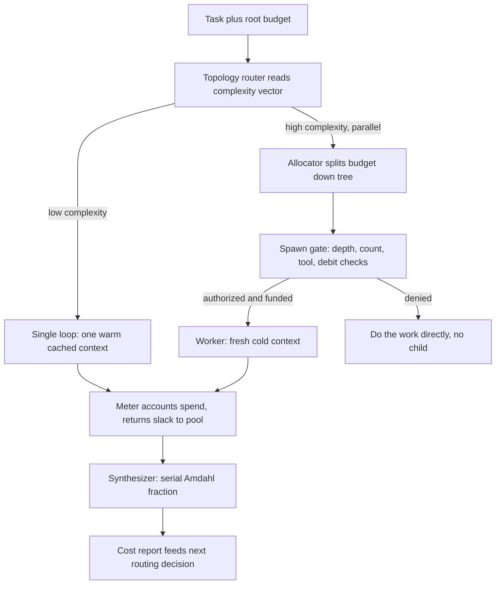

> [!info] Context
> Part of [[Harness-Internals-Overview|Harness Engineering Internals]], Level 2 wave. Parent chapters: [[Harness-Internals-Agent-Loop-Architecture]] (which gave the raw multipliers — 4× a chat for a single agent, 15× for multi-agent, 80% of eval variance explained by token spend) and [[Harness-Internals-Subagent-Orchestration]] (which argued the topology by task shape and stated the budget-conservation and fan-in laws without building the full cost model). This chapter closes that loop: it fuses the caching arithmetic from [[Harness-Internals-Prompt-Assembly-Cache-Economics]] with the budget-enforcement machinery from [[Harness-Internals-Termination-Budgets-Loop-Control]] into an actual, quantitative cost model for choosing a topology — and it is the home for the "budget inheritance / agent fork bomb" problem that the termination chapter named as open.

# The Economics of Agent Topologies

## 1. Executive Overview

"Single agent or multi-agent?" is not an architecture question. It is a **budgeting question wearing an architecture costume**, and the parent chapters said so twice — [[Harness-Internals-Agent-Loop-Architecture]] with the number that should have ended the debate ("token usage by itself explains 80% of the variance"), and [[Harness-Internals-Subagent-Orchestration]] with the read/write shape rule. What neither built is the model that turns those observations into a decision you can defend to a CFO: given a task worth `V` dollars, with a parallelizable fraction `p`, running on an API that bills cached tokens at one-tenth the price of fresh ones, *which topology minimizes cost per unit of delivered value* — and where exactly does the answer flip?

This chapter builds that model. The reframing claim, stated up front because the rest of the chapter earns it: **the famous 4× and 15× multipliers are pre-cache, pre-quality gross figures, and both corrections that make them real point in opposite directions.** Cache-adjust them and the single deep loop pulls *further* ahead on raw dollars, because a single append-only context is the single most cache-friendly object a harness can build — one warm prefix, reused at 0.1× for the whole session — whereas a fan-out of fresh subagents forfeits that locality: every worker cold-starts on its own distinct prefix and pays write prices for it. Quality-adjust them and the fan-out pulls ahead, because a single context that grows to 200k tokens *rots* — its effective reasoning quality per token falls as the window fills — while each small worker window reasons near its peak. Caching favors the monolith; context rot favors the swarm. The decision is the point where those two forces balance, and that point is a function of task value, parallelizable fraction, and verification cost — not of anyone's architectural taste.

That framing dissolves the apparent contradiction the field has been arguing since June 2025. Anthropic's multi-agent research system beat single-agent Opus 4 by 90.2%; a 2026 Stanford paper showed single agents match or beat multi-agent systems under equal thinking budgets. Both are correct because they measure different regimes of the same cost surface: one where the corpus exceeds a single window (so the single agent is *capped by physics*, and buying a second window at 15× is the only way forward), and one where the task fits a window (so the fan-out merely fragments one reasoning trace into lossy pieces and pays 15× for the privilege). The model in this chapter tells you which regime you are in *before* you spend the money — and it is also the natural home for the failure mode that appears when budget accounting across a topology is wrong: the **agent fork bomb**, where a subagent inherits the power to spawn subagents but not the obligation to pay for them, and a single delegated task detonates into dozens of redundant children on someone's bill.

## 2. Historical Evolution

The economics of topology were invisible until three things became true in sequence, and each milestone is a point where a cost that had been hidden suddenly showed up on a bill.

**2022–2023 — cost was flat, so topology was free.** In the chains era ([[Harness-Internals-Agent-Loop-Architecture]]), a "pipeline" made a handful of model calls with no history replay and no caching. Token cost grew linearly with steps and there was no cache to lose, so nobody modeled topology economically. You picked a structure for correctness; the bill was an afterthought.

**Early 2023 — the runaway loop put the first number on unbounded topology.** AutoGPT and BabyAGI handed the model full control and it spiraled, and the industry learned that an agent with no ceiling is an unbounded line item. LangChain's `max_iterations` (default 15) was the first admission, in code, that topology has a cost that must be bounded ([[Harness-Internals-Termination-Budgets-Loop-Control]] traces this lineage).

**August 2024 — prompt caching made layout a billing contract, and therefore made topology a billing decision.** Anthropic shipped `cache_control` (1.25× to write a cache entry, 0.1× to read one); OpenAI shipped automatic prefix caching (discounts of 50–90%). Overnight, the cost of a request stopped being "tokens × price" and became "fresh tokens × price + cached tokens × 0.1 × price" — and the two topologies allocate tokens between those two buckets *completely differently*. A single loop puts almost everything in the cheap cached bucket; a fresh-subagent fan-out forces each worker to refill the expensive bucket from cold. The mechanics are the subject of [[Harness-Internals-Prompt-Assembly-Cache-Economics]]; the *topological consequence* is the subject of this chapter, and it did not exist as a question before this date.

**June 2025 — the two manifestos, and the first published multipliers.** Cognition's "Don't Build Multi-Agents" and Anthropic's "How we built our multi-agent research system" landed within days. Anthropic put the numbers on the table that this chapter dissects: single agents use ~4× the tokens of a chat, multi-agent ~15×, the 90.2% quality lift, and the killer line — "token usage by itself explains 80% of the variance." That last figure quietly reframed the whole debate as a spending question, but nobody built the cost model that the reframing demanded.

**2026 — the formalization wave.** Three research threads independently turned the folklore into math. The equal-thinking-budget paper (arXiv 2604.02460) controlled for tokens and found the multi-agent advantage largely evaporates, grounding the result in the Data Processing Inequality. The Agent Contracts framework (arXiv 2601.08815) formalized budget conservation across a delegation tree and proved it holds at runtime. Retrieval-Conditioned Topology Selection (arXiv 2605.05657) made topology a *per-task decision variable* chosen under a provable budget bound. And the "Token Economics for LLM Agents" dual-view study (arXiv 2605.09104) imported the actual apparatus of production economics — a CES production function, a Coasian firm boundary, marginal-cost-equals-marginal-value stopping. Simultaneously the failure side matured: an empirical catalog of 63 budget-overrun incidents (arXiv 2606.04056) named "delegation-fanout" as a distinct failure cluster, and the fork bomb showed up in production issue trackers (Claude Code #68110, opencode #18100) as a real bug that burned millions of tokens. The through-line: every phase added a way to *see and bound* a topology cost that the previous phase had left invisible.

## 3. First-Principles Explanation

Strip the question to its atoms. A topology is a way of spending a token budget to buy answer quality. There are exactly two things you can do with a marginal token: **add it to an existing context**, or **start a new context and put it there**. Single-loop topologies do the first; fan-out topologies do the second. Everything economic about topology follows from the fact that those two operations have different *price* and different *yield*.

**The price of a token is not fixed — it depends on whether it is fresh or cached.** Recall the one fact from [[Harness-Internals-Prompt-Assembly-Cache-Economics]]: an agent replays its entire history every turn, and with prompt caching the replayed prefix is billed at ~0.1× while only the newly-appended tokens are billed at full price (or 1.25× if you cache them for the future). So the true per-turn input cost of a context of size `C` with `Δ` new tokens this turn is:

```
turn_cost ≈ 0.1 · (C − Δ) · price     +     1.0–1.25 · Δ · price
            └── cached re-read of history ──┘   └── fresh work ──┘
```

Define the **cache hit rate** `h = cached_input / total_input`. The effective price multiplier of a turn, versus paying full price for everything, is `(1 − h) + 0.1·h = 1 − 0.9·h`. At `h = 0.9` (a deep append-only session) that is `0.19` — a 5.3× discount. At `h = 0` (a cold start) it is `1.0`. This single expression is the hinge of the whole cost model: **topology is, economically, a choice about what cache hit rate you get to run at.**

**The yield of a token is not fixed either — it depends on how full the context already is.** This is the fact the parent chapters gestured at ("context rot") but never priced. A token added to a nearly-empty context lands in a window the model attends to sharply. A token added to a 200k-token context lands in a window where the model's attention is diluted and "lost-in-the-middle" degradation is in force. So the *effective work* a marginal token buys is a decreasing function of current window occupancy. Write it as `yield(C)`, monotonically decreasing in `C`. Anthropic's own framing is exactly this: LLMs "have an 'attention budget' that they draw on when parsing large volumes of context," "every new token introduced depletes this budget," and context "must be treated as a finite resource with diminishing marginal returns."

Now the two topologies fall out as two strategies over `(price, yield)`:

- **Single loop (add the token to the existing context).** Price is *low* — `h` climbs toward 0.9+ as the append-only prefix grows and stays warm. Yield is *falling* — every token pushes the window fuller, so `yield(C)` declines. You are buying cheap tokens that each do less.
- **Fresh fan-out (start a new context per worker).** Price is *high* — each worker is a cold start (`h ≈ 0` on its distinct prefix; no sharing across siblings, because their prefixes differ byte-for-byte). Yield is *high and flat* — each worker window stays small, so `yield(C)` stays near its peak. You are buying expensive tokens that each do more.

That is the entire trade, and it is why there is no universal answer. On a cache-friendly, window-fitting task, cheap-but-low-yield wins: the single loop's 0.19× price multiplier crushes the fan-out's 1.0×, and the yield gap is small because neither context is rotting. On a window-*exceeding* task, high-but-flat-yield wins: the single loop's yield doesn't just fall, it hits a *wall* — a corpus larger than the context window has `yield → 0` for the tokens that don't fit, no matter how cheap they are, while the fan-out can open as many fresh windows as the corpus needs. The 15× multiplier is what you pay to break through that wall, and it is only worth paying when there is a wall to break.

**Why the Data Processing Inequality caps the fan-out's upside.** The equal-budget paper (arXiv 2604.02460) proves the ceiling: "By the Data Processing Inequality, `I(Y;C) ≥ I(Y;M)`" — a multi-agent system's messages carry no more mutual information with the true answer `Y` than the single unified context `C` did. So on a task that *fits one window*, fan-out cannot exceed single-agent quality on information grounds; it can only lose. Its measured wins there come from spending *more* tokens (which you could also spend on one longer single-agent trace) or from the single agent's context being degraded — the paper's own two escape conditions. This is the formal reason the 90.2% and the equal-budget result do not contradict: one measures a regime with a wall (window-exceeding breadth-first research, where the single agent is capped by physics), the other a regime without one (window-fitting multi-hop reasoning, where DPI bites).

## 4. Mental Models

**Caching is a mortgage; context rot is depreciation.** A single deep loop is like buying one house on a cheap mortgage: the longer you hold it, the more the fixed cost amortizes (cache hit rate climbs, marginal tokens get cheaper), but the asset depreciates the whole time (the window rots). A fan-out is like renting a fresh apartment for each task: you pay full price every time you move in (cold cache), but you always live in a clean, un-rotted space. The right choice depends on how long you'll hold and how fast the neighborhood decays — exactly the two variables `h` and `yield(C)`.

**The 15× is a gross multiplier; you want the net.** "Multi-agent costs 15×" is like "the sticker price is $15." It ignores that the single agent runs at a deep cache discount the fan-out largely forfeits, so the *net* dollar gap on a cache-friendly workload is often **wider** than 15×; and it ignores that the fan-out's tokens have higher yield, so the *value-adjusted* gap is narrower. Anyone quoting 15× as if it were the decision variable is quoting the sticker and ignoring both the discount and the quality. The whole job of this chapter is to compute the net.

**Amdahl is the governor on the fan-out's speed dividend.** Multi-agent's other selling point — wall-clock reduction (Anthropic: "up to 90%") — is bounded by the oldest law in parallel computing. Speedup ≤ `1 / (serial fraction)`. In an agent topology the serial fraction is *synthesis*: the orchestrator must, alone, read `N` returns and reconcile them. If synthesis is 20% of the work, your speed ceiling is 5× no matter how many workers you spawn; if it is 50%, it is 2×. And unlike CPUs, agents coordinate in lossy natural language, so real speedup is *strictly below* Amdahl's already-pessimistic ceiling. This is why fan-out width has an optimum, not a monotonic benefit: past a point, adding workers only grows the serial synthesis pile.

**Budget is an affine resource, or it is a fork bomb.** The cleanest mental model for the spawn problem comes from type theory (arXiv 2606.04056): a budget should behave like a coin, not like a number. A number can be read by two children at once (both "see" $2 remaining and both spend it — double-spend). A coin, when handed to a child, *leaves the parent's pocket*. If spawning a subagent physically *moves* budget out of the parent — so the parent cannot spawn more than its remaining budget allows, and a child cannot spend budget its parent already spent — the fork bomb is *impossible by construction*, because a bomb needs to duplicate fuel and an affine resource cannot be duplicated. Hold this model; Section 7 makes it concrete.

## 5. Internal Architecture

The economic decision is not made once; it is made by a set of components that price, allocate, meter, and cap topology spend. A topology-aware harness adds five economic components on top of the orchestration machinery from [[Harness-Internals-Subagent-Orchestration]].

1. **Topology router.** Before spawning anything, decides the *shape*: single loop, shallow fan-out, deep tree, or workflow. The state of the art conditions this on measurable task features rather than the model's whim. Retrieval-Conditioned Topology Selection (arXiv 2605.05657) extracts a 5-dimensional complexity vector `c = (d_dep, n_f, n_s, h_t, ρ_x)` — dependency depth, file count, symbol count, tree depth, cross-module coupling — "read from tree metadata in <1 ms," and maps it deterministically to one of `FastPath` (single-file), `SubAgent` (localized), `MultiAgent` (broad), or `DeepResearch` (ambiguous). This is the harness answering "which regime am I in?" *before* spending.
2. **Cost estimator.** Given the chosen shape, projects the bill using the cache-adjusted model of Section 3 — expected turns, expected cache hit rate per context, expected fan-out width. This is what the router's decision is scored against.
3. **Budget ledger and allocator.** Holds the root budget and apportions it down the tree, enforcing the conservation law `Σ Rᵢ ≤ R_parent`. This is the same ledger as [[Harness-Internals-Termination-Budgets-Loop-Control]], now made *hierarchical*.
4. **Spawn gate.** The fork-bomb defense. Sits between a worker's request to spawn a child and the actual spawn, checking depth, count, tool authorization, and — the deep version — debiting the child's budget from the parent atomically before the child exists.
5. **Meter and reconciler.** Accounts actual spend up the tree as workers complete, returns unused budget to a shared pool, and produces the per-topology cost report that closes the loop for the next routing decision.



The architectural point the diagram makes: **the spawn gate is the load-bearing safety component, and it is exactly the thing every production fork-bomb incident was missing.** In Claude Code issue #68110, a `general-purpose` subagent "has access to the Agent tool and recursively spawns its own child agents… creating an exponential fan-out tree with no depth or count limit" — the diagram's `SG` box was absent, so every worker was silently promoted to an orchestrator with a fresh, un-debited budget.

## 6. Step-by-Step Execution

Walk two concrete topologies on the *same task* — "audit this 40-file service for security issues and produce a cited report" — and price each turn, so the cache and quality effects are visible in dollars rather than adjectives. Use a base input price of `1 unit/token` (multiply by the model's real rate for dollars) and Anthropic caching (0.1× read, 1.25× write).

**Path A — single loop with compaction.**

1. **Turns 1–8, reading.** The agent reads files one at a time. Each turn appends a file (~2,000 tokens) to an append-only context. By turn 8 the context is ~20k tokens. Cache hit rate climbs each turn — turn 8 replays ~18k cached tokens at 0.1× (1,800 units) and writes ~2k fresh (2,500 units at 1.25×). The prefix is warm; the discount is real.
2. **Turns 9–20, cross-referencing.** The window passes 60k, then 100k tokens. Two things happen simultaneously: the *price* keeps falling (hit rate now ~0.9, effective multiplier ~0.19) and the *yield* starts falling (past ~100k the model begins to lose the thread — the lost-in-the-middle effect means a vulnerability noted at turn 3 is now buried mid-context and under-attended). Cheap tokens, declining returns.
3. **Turn 21, compaction fires.** The context nears a soft limit; the harness compacts. Per [[Harness-Internals-Prompt-Assembly-Cache-Economics]], compaction "replaces the transcript wholesale; the post-compaction context shares no prefix with the pre-compaction one, so the entire new context re-prefills at write prices." The cache hit rate drops to ~0 for one turn — a spike of ~100k × 1.25 = 125,000 units. This is the single loop's structural cost: it is cheap per turn but pays a full re-prefill every time it compacts, and it compacts because it rotted.
4. **Turns 22–30, report.** Fresh compacted context, warm again, writes the report. Natural termination.

Total shape: **low per-turn cost, punctuated by compaction spikes, with quality sagging in the deep-context middle turns.** Grounded numbers from an independent teardown (Augment's file-reading agent, Claude Sonnet 4.6): a naive 10-step read loop costs $1.49 versus $0.03 for a single-pass — a **43.3×** blowup driven by the `N(N+1)/2` quadratic replay term — and prompt caching helps but "reduces the `N×S` term [and discounts the replay] … leav[ing]" the quadratic mass as the dominant cost.

**Path B — orchestrator with 5 fresh subagents.**

1. **Turn 1, planning.** The orchestrator plans in a small context (~5k tokens) and decides to slice the 40 files into 5 groups of 8.
2. **Wave 1, 5 cold starts.** Each worker spawns with its *own* system prompt and tool subset — a distinct prefix from the parent and from every sibling. Its first inference is cache-cold: it pays full/write price on its entire prompt (~4k units each, ×5 = 20k units) before reading a single file. This is the fan-out's structural cost: **five cold prefixes where the single loop had one warm one.** No sibling can reuse another's cache; the prefixes differ.
3. **Wave 1, work.** Each worker reads 8 files in a *small, clean* window (~18k tokens peak). Its yield is near peak — no rot, no lost-in-the-middle, because no window ever gets large. Each burns ~30k tokens exploring and returns a ~1,500-token distilled finding. The exploration tokens are billed mostly fresh (each worker's cache only warms within its own short life).
4. **Synthesis.** The orchestrator receives 5 × 1,500 ≈ 7,500 tokens of findings — *not* the 150k+ tokens of raw file reads, which are discarded. It reconciles, dedupes, and runs a separate citation/verification pass (Anthropic's `CitationAgent` pattern). This synthesis is the **serial Amdahl fraction** — it cannot be parallelized, and it is a real token cost that grows with fan-out width.

Total shape: **high fixed cost (5 cold prefixes + synthesis), but every token spent at high yield, and no single context ever rots or compacts.** The gross token multiplier over Path A is the familiar ~15× (Anthropic) to ~8.5× (Augment measured 850k vs 100k on an unoptimized system); the *net dollar* multiplier is worse than gross because Path A ran at a deep cache discount Path B mostly forfeited — but the *value-adjusted* multiplier is better than gross because Path B's tokens never rotted.

The two paths deliver the same artifact. Which is cheaper *per unit of correct, complete answer* is the question Sections 7–8 answer with a formula.

## 7. Implementation

Build the cost model and the two safety mechanisms it depends on: the cache-adjusted estimator, the hierarchical allocator, and the fork-bomb spawn gate.

### The cache-adjusted topology cost estimator

The estimator prices a whole topology by summing per-context costs, each priced by its own expected cache hit rate.

```python
def context_cost(turns, growth_per_turn, base_price,
                 hit_rate, write_mult=1.25, read_mult=0.10,
                 compactions=0, compact_size=0):
    """Cost of ONE context over its life, cache-adjusted."""
    total = 0.0
    ctx = 0
    for _ in range(turns):
        fresh = growth_per_turn
        cached = ctx                      # prior history, replayed
        total += (read_mult * cached + write_mult * fresh) * base_price * hit_rate \
               + (1.0 * (cached + fresh)) * base_price * (1 - hit_rate)
        ctx += fresh
    # each compaction re-prefills the whole context at write price
    total += compactions * compact_size * write_mult * base_price
    return total

def single_loop_cost(N, g, price):
    # one deep context: hit rate climbs high, but pays compaction resets
    return context_cost(N, g, price, hit_rate=0.9,
                        compactions=N // 20, compact_size=N * g // 2)

def fanout_cost(width, worker_turns, g, price, orch_turns):
    # each worker is a COLD prefix (low hit rate), plus orchestrator + synthesis
    workers = width * context_cost(worker_turns, g, price, hit_rate=0.4)
    orch    = context_cost(orch_turns, width * 1500, price, hit_rate=0.85)
    return workers + orch
```

The load-bearing modelling choices, each defensible from the sources:

- **The single loop's `hit_rate` is high (~0.9) but it pays compaction resets.** Append-only assembly keeps its prefix byte-stable, so replay is cheap — but each compaction is a full re-prefill at write price ([[Harness-Internals-Prompt-Assembly-Cache-Economics]]), and it compacts *because* the window rotted, so compaction frequency is a function of how long you run.
- **Each fresh worker's `hit_rate` is low (~0.4, not 0).** It cold-starts on its distinct prefix (full write price up front), then warms *within its own life* — so a worker that runs many turns claws some caching back, but never shares a prefix with a sibling. This is the single most under-appreciated line in the whole model: **fan-out multiplies cold prefixes.** (A *fork*-based fan-out is different: forks "reuse the parent's prompt cache directly," so a fork tree's `hit_rate` is high like the single loop's — the reason [[Harness-Internals-Subagent-Orchestration]] rates forks as the cache-cheap way to branch.)
- **The orchestrator's `hit_rate` is high (~0.85)** because it holds a small, stable context and only ingests ~1,500-token returns.

Run it and the qualitative result is robust to the exact constants: on a *window-fitting* task the single loop wins on dollars by a wide margin (deep cache, few compactions); as the task grows past one window, the single loop's compaction spikes multiply and its yield collapses, and the fan-out — whose per-worker cost is *flat* in total corpus size because you just add workers — overtakes it. The crossover is the corpus size at which `single_loop_cost` (with rising compaction count) exceeds `fanout_cost` (with rising width).

### The hierarchical budget allocator

This is the conservation law from [[Harness-Internals-Subagent-Orchestration]] made executable, following Agent Contracts (arXiv 2601.08815). The formal invariant it enforces is `Σⱼ cⱼ(r) ≤ B(r) ∀ r ∈ R` — total consumption across all agents cannot exceed the system budget for any resource — with the delegation constraint `Σ Rᵢ ≤ R_parent`.

```python
def allocate(parent_budget, weights, reserve_frac=0.12):
    """Apportion a parent's budget to children by complexity weight,
       holding back a reserve. Enforces Σ child ≤ parent by construction."""
    reserve = parent_budget * reserve_frac
    pool = parent_budget - reserve
    total_w = sum(weights)
    # b_j = (w_j / Σ w) · (B − B_reserve)   — the Agent Contracts formula
    return [pool * (w / total_w) for w in weights], reserve

def return_slack(reserve, completed):
    # B_available(t) = B_reserve + Σ_completed (b_j − c_j)
    return reserve + sum(b - c for (b, c) in completed)
```

Three properties make this correct rather than plausible-looking. **The reserve (10–15%) is not optional** — it funds coordination overhead and re-spawns, and without it a fully-allocated tree cannot recover from a single worker's overrun. **Slack returns to a shared pool** so an efficient worker subsidizes a hungry sibling, which is what makes proportional allocation robust to bad complexity estimates. And **allocation is by weight, not equal split**, because equal split is "safe, wasteful" — it gives a trivial subtask the same budget as a hard one.

### The spawn gate — the fork-bomb defense, in layers

The spawn gate is where budget inheritance becomes concrete and where the fork bomb is stopped. Four layers, cheapest and bluntest first, principled and deepest last.

```python
def spawn_gate(parent, request):
    # Layer 1 — depth cap. Bounds tree height → worst-case leaves = b^L.
    if parent.depth >= MAX_DEPTH:            # Claude Code: 5; opencode proposal: 3
        return DENY("depth cap reached; do the work directly")
    # Layer 2 — tool authorization. The structural fix: a leaf simply lacks Agent.
    if "Agent" not in parent.tools:          # omit Agent / disallowedTools
        return DENY("not authorized to spawn")
    # Layer 3 — fan-out count cap per node.
    if parent.children_spawned >= MAX_FANOUT:
        return DENY("fan-out cap reached")
    # Layer 4 — AFFINE budget debit. The child's budget MOVES out of the parent.
    if request.budget > parent.remaining_budget - parent.reserve:
        return DENY("insufficient budget to fund child")
    parent.remaining_budget -= request.budget   # atomic move; no double-spend
    return ALLOW(child_budget=request.budget)
```

Layer 4 is the one the field is converging toward and the one that makes the fork bomb *impossible* rather than merely *bounded*. A depth cap still lets a tree of `b^5` leaves detonate below the cap; a count cap can be evaded by a model that spawns in waves. But if spawning **atomically moves budget from parent to child** — the affine-resource discipline of arXiv 2606.04056, where "cloning, double-spending, and using a budget after delegating it are *compile errors*" — then a parent that has spent its budget *cannot fund a child*, and the bomb starves itself. That paper measured the difference starkly: on delegation-fanout patterns, the affine approach hit **0/30 overshoot** where a naive `asyncio` implementation hit **30/30**. Agent Contracts reports the same enforcement working at runtime: it "detected and halted a runaway agent that exceeded its 40K token budget (56K consumed)" with "zero conservation violations across all 50 trials." The three-layer stack — depth cap for a coarse bound, tool removal for a structural cut, affine debit for the guarantee — is the answer to the question [[Harness-Internals-Termination-Budgets-Loop-Control]] left open: "a parent that spawns subagents faster than they terminate is a fork bomb in agent space, and no harness has a clean answer yet." The clean answer is: make budget a coin, not a number.

## 8. Design Decisions

### The task-value threshold — where 15× beats 4× (must-answer #2)

Now derive the decision rule as an expected-value calculation rather than a slogan. Let:

- `V` = value of a correct, complete answer (dollars).
- `C_s`, `C_m` = cost of the single-agent (≈4× chat) and multi-agent (≈15× chat) runs, *cache-adjusted* per Section 7 (so `C_m/C_s` may exceed 15/4 on cache-friendly work, and be less on cache-hostile work).
- `Q_s`, `Q_m` = probability each topology delivers the correct, complete answer.
- `C_v` = verification cost — synthesis plus the citation/checking pass that multi-agent needs to be trustworthy, which single-agent needs far less of.

Multi-agent is the rational choice when its expected value net of cost exceeds single-agent's:

```
V · Q_m − C_m − C_v   >   V · Q_s − C_s
⟺   V · (Q_m − Q_s)   >   (C_m − C_s) + C_v
⟺   V   >   V*  =  [ (C_m − C_s) + C_v ] / (Q_m − Q_s)      (when Q_m > Q_s)
```

`V*` is the **break-even task value.** Below it, spend on the single agent; above it, on the fan-out. The formula is only interesting because of what governs its three inputs, and here the parallelizable fraction and context physics enter:

**The quality gap `Q_m − Q_s` is large in exactly one regime and near-zero otherwise.** By the Data Processing Inequality, on a task that *fits one window*, `Q_m ≤ Q_s` at equal tokens — the gap is *negative or zero*, `V*` is infinite, and no task value justifies multi-agent. The gap only goes positive when the single agent is *capped by physics or degraded*: the corpus exceeds one window (breadth-first research — Anthropic's regime, where `Q_s` is bounded below 1 no matter the spend), or the single-agent context has rotted enough that "a single reasoning trajectory [cannot] distinguish relevant from misleading information" (the equal-budget paper's `α = 0.7` corruption case, where multi-agent overtook). So the first gate on multi-agent is not value — it is **"is the single agent hitting a wall?"** If not, stop; `V*` is infinite.

**The parallelizable fraction `p` governs how much of the gap the fan-out can actually capture.** Even when a wall exists, Amdahl caps the realizable benefit. If synthesis (the serial fraction, `1−p`) is 30% of the work, the fan-out's speed and coverage dividend is ceilinged at `1/0.3 ≈ 3.3×`, and because agents coordinate in lossy prose, real capture is below that. A task that is only 50% parallelizable gives a 2× ceiling — often not enough to clear `(C_m − C_s)`. This is why "read-heavy and decomposable" is the precondition the parent chapter insisted on: it is the condition `p → 1` that lets the fan-out convert its 15× spend into quality rather than into synthesis overhead.

**The verification cost `C_v` grows with fan-out width and eats the margin.** Reconciling `N` returns is `O(N)` at best and `O(N²)` when they conflict and must be cross-checked; the citation pass scales with claims. So `C_v` is increasing in width, which means `V*` is increasing in width — there is an **optimal fan-out width** past which each added worker raises cost faster than quality. This is the quantitative form of "confabulation consensus" and the reason wide stars have a ceiling ([[Harness-Internals-Subagent-Orchestration]]'s fan-in law `N ≤ ⌊W/m⌋` is the window-side version of the same constraint).

Putting it together, the honest decision rule is a *conjunction*, not a threshold on value alone: **spawn multi-agent only when (a) the single agent hits a wall — window-exceeding or rot-degraded — AND (b) the task is highly parallelizable (`p → 1`) AND (c) the task value clears `V* = [(C_m − C_s) + C_v] / (Q_m − Q_s)`.** Miss any conjunct and the single agent, run longer under the same token budget, wins. Legal due-diligence over 10,000 documents clears all three (wall: corpus ≫ window; parallel: documents are independent; value: high). A multi-hop reasoning question that fits a window fails (a) and (b) and no value clears it.

### Why the router should read task features, not ask the model

An alternative to computing `V*` is to let the orchestrator model *decide* the topology in-context (Anthropic's effort heuristic: "simple fact-finding = 1 agent"). This works but is prompt-encoded folklore. The stronger design measures. Retrieval-Conditioned Topology Selection (arXiv 2605.05657) routes on a structural complexity vector read in "<1 ms" and reports the payoff: misrouting fell "from 30.1%… to 8.2%" and constrained routing achieved "40% resolution at ~6,000 tokens per task" versus "50–120k tokens" for unconstrained monolithic agents — an **8–20× reduction**. The lesson generalizes: `V*` and the wall-detection gate are *computable from task features* (corpus size vs window, dependency structure), so compute them; do not pay a frontier model to guess what a `<1 ms` metadata read can tell you.

### Model tiering as the highest-leverage lever

Independent of topology, the single biggest cost error is paying frontier prices for mechanical fan-out. Anthropic's own split — Opus lead, Sonnet workers — and Claude Code's runnable-on-Haiku Explore agent encode the rule: **frontier model for the orchestrator and any write path, cheap model for read fan-out.** The Token Economics dual-view (arXiv 2605.09104) formalizes why this is not a hack but the optimum: with a CES production function `Y = A·[δK^ρ + (1−δ)M^ρ]^(θ/ρ)·L^β`, quality substitutes compute for tokens, so buying *more, cheaper* worker tokens can dominate buying *fewer, expensive* ones — as long as the orchestrator (where reasoning depth is irreducible) stays on the frontier model. Tiering can move the entire cost curve down under either topology, which is why it should be decided *before* topology, not after.

## 9. Failure Modes

**The fork bomb (the headline).** A worker inherits the Agent tool but not the obligation to pay for its children, and one delegated task detonates. The production evidence is unambiguous. Claude Code #68110: "a single `Agent` call for 'research Venmo integration options' resulted in **48+ background agents** running simultaneously," "~1.5M+ tokens consumed across redundant agents," where "the useful research was complete within the first 3–4 agents; the remaining 44 added no new information." opencode #18100: "**47 total sessions** (1 parent + 46 nested child/grandchild sessions)," "**20 levels of nesting depth**," "**18 layers of pure explore→explore recursion**… each doing nothing except re-dispatching the same task." A community report cited a recursive spawn consuming an entire Pro Max 5-hour token limit (≈4M tokens) "in under 5 minutes." *Root cause:* the spawn gate's Layer-4 debit (and often Layers 1–3) was absent — subagents were silently promoted to orchestrators. *Debug:* count transitive children per top-level `Agent` call; a healthy tree has single-digit fan-out and depth ≤2. *Fix:* the four-layer gate of Section 7, with affine budget debit as the guarantee.

**Cache annihilation by topology churn.** A subtler cost bomb: a topology that keeps starting fresh contexts (a fan-out that re-spawns workers per turn, or a "handoff" that rewrites the prefix) never lets any cache warm, so it runs permanently at `h ≈ 0` — the 5× discount the single loop enjoys is simply never earned. *Debug:* per-call cached-token ratio stays near zero across a whole run. *Fix:* prefer forks (which reuse the parent's warm prefix) over fresh subagents when branching frequently; keep worker lives long enough to amortize their cold start.

**The compaction thrash.** The single loop's version of the same disease: firing compaction too eagerly pays the full re-prefill reset repeatedly. Augment measured the difference — *scheduled* compression "achieved 22.7% token savings… while matching baseline accuracy," whereas unscheduled compaction "yielded only 6% savings and caused accuracy degradation." *Fix:* compact on a schedule tuned to the 150–200k soft-limit guidance, not reflexively.

**Synthesis-bound fan-out (Amdahl violation).** A team spawns 20 workers on a task whose synthesis is 40% of the work, hits the 2.5× speed ceiling, and pays 20× tokens for a 2.5× wall-clock gain — a catastrophic value trade. *Debug:* orchestrator (synthesis) tokens are a large and *growing* fraction of the total as width increases; the Augment reference split of orchestrator ~9.8% / workers ~70.6% has inverted. *Fix:* cap fan-out at the width where marginal synthesis cost equals marginal worker yield (Section 8's optimal width).

**Stale-spend overshoot at fleet scale.** When the budget ledger is a shared counter across many concurrent agents (LiteLLM's cross-pod Redis pattern), a hard cap can overshoot under burst load because the counter lags actual spend — LiteLLM issue #27735 documents exactly this race. *Fix:* accept eventual-consistency for cost *control*; for a hard regulatory ceiling, pay for synchronous accounting. This is the fleet-scale echo of the per-session problem in [[Harness-Internals-Termination-Budgets-Loop-Control]].

**The budget-primitive-missing failure.** The empirical catalog (arXiv 2606.04056) found "M-budget-primitive-missing (12 rows / 6 frameworks)" — frameworks that ship "without a first-class aggregate-budget primitive," exposing it only through callbacks that regress silently. The most severe single incident in the catalog reached "≈$2,150… in unintended spend"; a delegation-fanout cluster of 11 incidents traced to budgets "split across sub-agents without proper ownership tracking." *Fix:* an aggregate budget must be a first-class, non-bypassable object (the affine type), not an advisory callback.

## 10. Production Engineering

**Anthropic — Claude Research (verified; engineering blog).** The reference multi-agent economics: orchestrator (Opus) + workers (Sonnet), 3–5 subagents per wave (10+ for complex research), separate citation pass. The published economics this chapter is built on: "agents typically use about 4× more tokens than chat interactions," "multi-agent systems use about 15× more tokens than chats," "token usage by itself explains 80% of the variance" (three factors → 95%), 90.2% quality lift over single-agent Opus 4, "up to 90%" wall-clock reduction. The explicit viability gate, verbatim: "For economic viability, multi-agent systems require tasks where the value of the task is high enough to pay for the increased performance" — this chapter's `V*` is the formalization of that sentence. And the boundary: systems that "require all agents to share the same context or involve many dependencies… are not a good fit," which is the low-`p` exclusion.

**Anthropic — Claude Code / Agent SDK (docs verified; internals inference).** The spawn gate exists in the SDK: a subagent depth cap ("depth is counted as the number of subagent levels below the main conversation," and "a subagent at depth five doesn't receive the Agent tool and can't spawn further… fixed and not configurable"), and the structural cut ("to prevent a specific subagent from spawning others… omit Agent from its tools list or add it to disallowedTools"). Per-worker budgets via `maxTurns` and model tiering ("control costs by routing tasks to faster, cheaper models like Haiku") in `.claude/agents/*.md` frontmatter. The fork-bomb *incidents* (#68110) show the gate is necessary and was, for a window, insufficiently enforced — Anthropic's own tracker documents the exponential fan-out as "a harness/runtime change," corroborating that this is an *economic* safety component, not a model property. Claude-Code-specific isolation lives in [[Harness-Internals-Claude-Code-Subagent-Isolation]].

**OpenAI — Codex / Agents SDK (verified; docs and source).** Cost governance is layered: per-run `max_turns` (default 10, `MaxTurnsExceeded`), org-level spend limits, and Compliance-API usage export across CLI/IDE/cloud. Codex's subagents are documented with explicit orchestration; the Responses API's superior cache utilization ([[Harness-Internals-Prompt-Assembly-Cache-Economics]]) is itself a topology-economics lever — better caching lowers the single-loop cost floor that any fan-out must beat.

**The research frontier (verified; papers).** Retrieval-Conditioned Topology Selection (arXiv 2605.05657) ships the topology router as a *deterministic, budget-conserving* component with a 6-dimensional budget vector `B = (B_iter, B_calls, B_tok, B_sec, B_retry, B_handoff)` and the parallel-composition guarantee `⊕ᵢ Bᵢ ⪯ B_parent` verified in "O(|V|+|E|) time before any LLM call." Agent Contracts (arXiv 2601.08815) proves the conservation law holds at runtime. The affine-type catalog (arXiv 2606.04056) proves the fork-bomb defense works (0/30 vs 30/30 overshoot). None of the three major products has shipped the *full* research stack — production still leans on depth caps and tool removal rather than affine budget types — which is the clearest "verified gap between research and production" in this chapter.

**Monitoring, across all.** The per-topology cost report is the closing feedback loop. Instrument: cached/total input ratio per context (topology-churn detector), orchestrator-vs-worker token split (Amdahl detector), transitive children per top-level spawn (fork-bomb detector), and cost-per-completed-task by topology (the router's training signal). What you cannot see, you will over-spend on.

## 11. Performance

The performance story is the cost model's quantitative core, and it has three surfaces.

**Surface 1 — the cache-adjusted dollar cost (must-answer #1).** The single loop's cost is dominated by the quadratic replay term `u·N(N+1)/2 + r·N(N-1)/2` (Augment's formula), which caching *discounts but does not eliminate*: the replayed history is billed at 0.1×, turning a `1.0 × O(N²)` full-price mass into a `~0.1 × O(N²)` cached mass plus `O(N)` full-price writes. So the effective per-session multiplier over "everything full price" is `1 − 0.9h` — at `h = 0.9`, a **~5.3× discount**; the single loop *earns this discount and the fan-out largely does not*. The fan-out replaces one deep warm prefix with `width` cold prefixes, each paying full write price on its whole prompt before doing any work, warming only within its own short life (`h ≈ 0.4`). The consequence, stated as the chapter's central quantitative claim and labeled as an inference from the two caching mechanisms: **caching *widens* the single-vs-multi dollar gap beyond the 15× gross figure on cache-friendly, append-only workloads, because the single loop's 5× cache discount is a discount the fresh fan-out forfeits.** Forks are the exception — they "reuse the parent's prompt cache directly" and so keep `h` high — which is why a fork-tree is the cache-cheap way to branch and a fresh-subagent-star is the cache-expensive way ([[Harness-Internals-Subagent-Orchestration]]). Concrete anchors: Augment's 10-step loop cost $1.49 naive vs $0.03 single-pass (43.3×); an unoptimized multi-agent system 850k vs 100k single-agent tokens (8.5×); AgentPrune (arXiv 2410.02506) cut a multi-agent communication topology from **$43.7 to $5.6** (a 7.8× topology-overhead reduction) with 28.1–72.8% token reduction — the size of the prize available purely from pruning redundant inter-agent context.

**Surface 2 — the wall-clock speedup, Amdahl-capped (part of must-answer #2).** Multi-agent's latency dividend ("up to 90%") is real but bounded by `1/(serial fraction)`, and the serial fraction is synthesis. The table that governs the ceiling: serial 5% → 20× max, 10% → 10×, 20% → 5×, 50% → 2× — and real agent speedup is *below* these because coordination is lossy prose, not binary protocol. There is also a queueing tax: at high orchestrator utilization the synthesis queue grows as `ρ/(1−ρ)` — at 95% utilization, a 19× queue backlog — so pushing the orchestrator toward saturation with an ever-wider fan-out is self-defeating. Wall-clock value is only bankable when `p → 1` *and* synthesis stays unsaturated.

**Surface 3 — the quality-per-token yield (must-answer #4).** Dollars are half the calculus; effective work per token is the other half, and it is where context-window degradation enters *as an economic term, not just a caveat*. The Chroma 2025 study (18 frontier models incl. GPT-4.1, Claude Opus 4, Gemini 2.5) found degradation that "kicks in somewhere around 300,000–400,000 tokens" for 1M-window models, with performance dropping "even with 100% perfect retrieval" — a 13.9%-to-85% degradation range across input lengths. Stanford's lost-in-the-middle is the sharp version: accuracy fell from "70–75%… down to 55–60%" — a 15–20 percentage-point drop "based entirely on position, not content quality" — at just ~4,000 tokens across 20 documents. Price this: a token added to a single loop already at 150k tokens buys degraded yield (it lands in the rotting middle), while the *same* token in a fresh 18k-token worker window buys near-peak yield. So the fan-out's effective *quality-adjusted* cost per unit of work is lower than its dollar cost suggests, by exactly the rot factor the single loop suffers. This is the economic content of "context is a finite resource with diminishing marginal returns": the marginal token's *yield* — not just its price — is topology-dependent, and the single loop's yield decays while the fan-out's stays flat. The two surfaces net out: caching makes the single loop's tokens *cheaper*, rot makes them *worth less*, and `V*` is where those cancel.

## 12. Best Practices

Route topology from measurable task features, not model whim: compute "does the single agent hit a wall?" (corpus vs window, dependency structure) before spending, because below that wall the single agent under equal tokens wins by the Data Processing Inequality and above it the fan-out is the only option — this is a `<1 ms` metadata read, not a frontier-model guess. Cache-adjust every cost estimate: a single append-only loop earns a ~5× cache discount the fresh fan-out forfeits, so the net dollar gap is worse than the 15× sticker on cache-friendly work — prefer forks over fresh subagents when you must branch frequently, because forks keep the warm prefix. Quality-adjust it too: past ~150–200k tokens a single window rots, so its cheap tokens buy less; a fan-out's small windows keep yield flat — the two effects cancel at `V*`. Compute `V*` explicitly for high-stakes runs and gate multi-agent on the conjunction (wall AND high `p` AND value ≥ `V*`), never on value alone. Cap fan-out width at the point marginal synthesis cost equals marginal worker yield; a synthesis-bound fan-out pays for tokens it cannot convert to speed. Tier models before choosing topology — frontier orchestrator, cheap workers — because it moves the whole cost curve down under either shape. Make the budget an affine, first-class, non-bypassable object: spawning must *move* budget out of the parent, so a fork bomb starves itself; back it with a depth cap and tool removal for defense in depth. Meter per-topology cost-per-completed-task and feed it back to the router.

Anti-patterns, all field-observed: quoting 15× as the decision variable (it is the pre-cache, pre-quality sticker, not the net); a fresh-subagent star used where a fork tree would keep the cache warm; a subagent that inherits the Agent tool without a budget debit (the fork bomb — #68110, #18100); wide fan-out on a low-`p` task (paying 15× for a 2× Amdahl ceiling); reflexive compaction (paying the re-prefill reset repeatedly); a budget exposed only as an advisory callback rather than a first-class aggregate primitive (the arXiv 2606.04056 "$2,150 unintended spend" failure); and choosing topology before tiering models, which optimizes the wrong variable first.

## 13. Common Misconceptions

**"Multi-agent costs 15×, so it's 15× the price."** The 15× is a *gross token* multiplier measured pre-cache. The single loop runs at a ~5× cache discount the fresh fan-out forfeits (cold prefixes, no sibling sharing), so on cache-friendly workloads the *net dollar* gap is **wider** than 15×; on quality-adjusted value the gap is *narrower* because the fan-out's tokens don't rot. Both corrections are real and they point opposite ways — which is why 15× is a starting point for a calculation, not the calculation.

**"The 90.2% result proves multi-agent is a better architecture."** It proves multi-agent is better *on breadth-first research that exceeds one context window*, where the single agent is capped by physics and 80% of the win is explained by spending more tokens. On a task that fits a window, the Data Processing Inequality guarantees `Q_m ≤ Q_s` at equal tokens, and the 2604.02460 paper confirms single agents "match or outperform" under equal budgets. The 90.2% is a regime result, not an architecture verdict.

**"Adding workers adds speed."** Only up to `1/(serial fraction)`. Synthesis is serial and unavoidable, so a task that is 50% parallelizable ceilings at 2× no matter how many workers you spawn — and real agent coordination, being lossy prose, comes in below the Amdahl ceiling. Past the optimal width, workers only grow the synthesis pile.

**"A depth limit prevents the fork bomb."** A depth cap *bounds* the bomb (worst case `b^L` leaves below the cap) but does not *prevent* it — a tree can still detonate within the cap, as opencode #18100's 20-level, 47-session incident shows a cap would have merely truncated. Prevention requires the budget to be affine: spawning must move budget out of the parent so an exhausted parent cannot fund a child.

**"Caching makes topology cost irrelevant."** Caching *changes* the topology cost ranking; it does not flatten it. It deepens the single loop's advantage (one warm prefix) and does nothing for a fresh fan-out (cold prefixes) — so "caching is automatic, so I needn't think about topology cost" is exactly backwards. Caching makes topology cost *more* consequential, because it rewards the cache-friendly shape and penalizes the cache-hostile one.

## 14. Interview-Level Discussion

**Q1: Build the cache-adjusted cost model for single-loop-with-compaction vs orchestrator+workers. Where does caching change the naive comparison?**
Start from the per-turn model: input cost `= 0.1·(cached) + 1.0–1.25·(fresh)`, so a context's effective multiplier over all-full-price is `1 − 0.9h` for hit rate `h`. The single loop is append-only with a byte-stable prefix, so `h` climbs to ~0.9 (a ~5× discount) — but it pays a full re-prefill at write price on every compaction, and it compacts because the window rotted. The fan-out replaces one warm prefix with `width` cold prefixes: each worker's system prompt and tool set are a *distinct* prefix, so it cold-starts at full write price and shares no cache with siblings (`h ≈ 0.4`). The naive comparison says multi-agent is 15× the tokens; the cache-adjusted comparison says the single loop *also* runs those tokens ~5× cheaper, so on cache-friendly work the net dollar gap is *wider* than 15×. The exception is forks, which reuse the parent's warm prefix and so keep `h` high — which is why a fork tree is the cache-cheap branch and a fresh-subagent star is the cache-expensive one. The crossover where multi wins is the corpus size at which the single loop's compaction spikes and rot overwhelm its cache discount.

**Q2: A task is worth $V. Derive the threshold at which 15× multi-agent beats 4× single-agent, and name every lever.**
Expected value: multi wins iff `V·(Q_m − Q_s) > (C_m − C_s) + C_v`, so `V* = [(C_m − C_s) + C_v] / (Q_m − Q_s)`. Three levers govern it. (1) The quality gap `Q_m − Q_s` is ≤0 by the Data Processing Inequality on a window-fitting task — so `V*` is infinite unless the single agent hits a *wall* (corpus exceeds one window, or context is rot-degraded). Wall-detection is the first gate, not value. (2) The parallelizable fraction `p` caps how much of the gap the fan-out can capture — Amdahl ceilings the benefit at `1/(1−p)`, so a low-`p` task can't clear `(C_m − C_s)` however valuable. (3) The verification cost `C_v` grows with fan-out width (`O(N)` to `O(N²)` to reconcile), so `V*` rises with width and there's an optimal width. The rule is a conjunction: wall AND `p → 1` AND `V ≥ V*`.

**Q3: Design budget inheritance down a subagent tree, and prove your design prevents a fork bomb.**
Budgets flow down under conservation `Σ Rᵢ ≤ R_parent`; allocate by complexity weight `bⱼ = (wⱼ/Σw)·(B − B_reserve)` with a 10–15% reserve, and return slack to a shared pool. The fork-bomb defense is a spawn gate with four layers: depth cap (bounds height to `b^L`), tool removal (a leaf lacks the Agent tool — the structural cut), fan-out count cap, and — the guarantee — an *affine budget debit*: spawning atomically *moves* budget from parent to child, so budget behaves like a coin, not a number. Proof of prevention: a bomb needs to duplicate fuel; an affine resource cannot be duplicated (cloning/double-spend/use-after-delegate are the forbidden operations); a parent that has spent its budget cannot fund a child, so recursion starves itself. Empirically, affine debit hit 0/30 overshoot on delegation-fanout where naive async hit 30/30, and runtime conservation enforcement halted a 40K-budget agent at 56K consumed. A depth cap alone only *bounds* the bomb; affine debit *prevents* it.

**Q4: How does context-window quality degradation, not just token price, enter the topology decision?**
Because the *yield* of a marginal token — the effective work it buys — is a decreasing function of window occupancy, not a constant. Chroma measured degradation "even with 100% perfect retrieval," kicking in ~300–400k tokens on 1M-window models; Stanford's lost-in-the-middle showed 15–20 percentage-point accuracy drops from position alone at ~4k tokens. So a token added to a single loop already at 150k lands in the rotting middle and buys degraded yield, while the same token in a fresh 18k-token worker window buys near-peak yield. This makes the fan-out's *quality-adjusted* cost lower than its dollar cost implies, by exactly the rot factor the single loop suffers. The economic upshot: caching makes the single loop's tokens *cheaper*, rot makes them *worth less*, and the topology threshold `V*` is where those two forces cancel. Ignoring rot means over-crediting the single loop's cheap tokens.

**Q5: Anthropic reports +90.2% for multi-agent; the equal-budget paper reports single-agent wins. What are you actually licensed to conclude?**
That they measure different regimes and both are correct. Anthropic's baseline is single-agent on breadth-first research that *cannot fit one window*, so part of the 90.2% is a capability unlock (the single agent was capped by physics), and "token usage by itself explains 80% of the variance" — much of the win is spending more tokens in parallel, which you could partly replicate with one longer single-agent trace. The equal-budget paper controls tokens on window-*fitting* multi-hop reasoning and finds single agents "match or outperform," grounded in the Data Processing Inequality (`I(Y;C) ≥ I(Y;M)` — inter-agent messages cannot add information). So you are licensed to conclude: multi-agent is a mechanism to deploy *more* tokens in parallel *beyond one window*, and it wins when and only when the single agent hits a wall; you are *not* licensed to conclude it is a better architecture in general, and the 15× is a cost you pay to break the window wall, not a quality dividend you get for free.

**Q6: You're asked to make a coding agent's fan-out cheaper without hurting quality. What are your top three moves, in order?**
First, tier models — frontier orchestrator, cheap (Haiku-class) workers — because it moves the whole cost curve down regardless of topology and read-fan-out doesn't need reasoning depth. Second, prune inter-agent context: broadcasting full context to every worker wastes ~30%+ of the budget (AgentPrune cut a topology from $43.7 to $5.6), so route only role-relevant context and pass 1–2k-token summaries, not transcripts. Third, prefer forks to fresh subagents where you branch frequently, so the warm cached prefix is reused instead of cold-restarted — and cap fan-out width at the synthesis-bound optimum so you don't pay for workers Amdahl won't let you use. Notably none of these three is "add more agents"; all three are about spending the existing token budget better.

## 15. Advanced Topics

**Topology as a solved optimization, per query.** The endpoint of this chapter's model is a harness that chooses fan-out width, tree depth, and per-subtree budget the way a database query planner chooses a join order — under a dollar budget, from task features. Retrieval-Conditioned Topology Selection (arXiv 2605.05657) is the first concrete instance, routing on a structural complexity vector with a provable `⊕ᵢ Bᵢ ⪯ B_parent` conservation guarantee. Open problems: learning the complexity→topology map from realized cost-per-task rather than hand-mapping it, and extending it beyond code generation to open-ended research where "complexity" is harder to read from metadata.

**Affine and linear budget types as a language feature.** The fork-bomb defense (arXiv 2606.04056) treats budget as an affine resource enforced by a type system, making "cloning, double-spending, and using a budget after delegating it… *compile errors*." The frontier is making this the *default* substrate of agent frameworks rather than a research prototype — a world where the SDK's spawn primitive simply *cannot* be called with duplicated budget, the way Rust's borrow checker makes a use-after-free uncompilable. None of the three major products has shipped this; they lean on runtime caps. Whether affine budgets become the standard is the single most consequential open question for topology safety.

**Cache-editing and the death of the compaction penalty.** [[Harness-Internals-Prompt-Assembly-Cache-Economics]] flags emerging server-side cache-editing primitives that restructure a cached context without a full re-prefill. If they mature, the single loop's structural cost — the compaction reset that this chapter prices as its main disadvantage — partly dissolves, shifting `V*` further toward the single loop and shrinking the multi-agent regime. The cost model here is explicitly contingent on the current append-only-cache physics; a cache-editing API would require re-deriving it.

**KV-cache sharing across a fan-out.** The fan-out's core cost is that sibling workers have distinct prefixes and cannot share cache. Research on prefix-tree sharing and cross-request KV reuse ([[Harness-Internals-Runtime-Optimization]]) points at a future where workers reading the *same* source documents reuse each other's prefix computation at the serving layer — attacking the "cold prefix per worker" penalty at the substrate rather than the application level. If realized, it would narrow the caching gap between fork trees and fresh-subagent stars, moving the two topologies' costs closer together.

**Budget-aware planning as a first-class capability.** Today the model *reacts* to a budget countdown ([[Harness-Internals-Termination-Budgets-Loop-Control]]). The next step is a model that *plans* its topology against a budget from the start — front-loading the highest-value fan-out so a mid-run budget cut still leaves a useful partial result, allocating tokens across sub-goals the way a project manager allocates hours. This connects topology economics to [[Harness-Internals-Planning-And-Reflection]] and is where the router stops being a pre-flight component and becomes an in-loop one.

## 16. Glossary

- **Topology (agent)**: the shape of a harness's execution — single loop, shallow fan-out star, deep tree, or externalized workflow. Economically, a choice of how to allocate a token budget between one growing context and many fresh ones.
- **Cache hit rate (`h`)**: the fraction of a request's input tokens served from the prompt cache at ~0.1× price; the effective per-turn price multiplier over all-full-price is `1 − 0.9h`.
- **Gross vs net multiplier**: the gross token multiplier (4× single, 15× multi) is measured pre-cache and pre-quality; the net dollar multiplier accounts for the single loop's cache discount (widening the gap) and the fan-out's flat yield (narrowing the value-adjusted gap).
- **Yield (`yield(C)`)**: the effective work a marginal token buys, a decreasing function of window occupancy `C`; the economic form of context rot.
- **Context rot**: measurable quality degradation as a context window fills, present "even with 100% perfect retrieval," kicking in ~300–400k tokens on 1M-window models (Chroma 2025); includes the lost-in-the-middle positional effect.
- **Break-even task value (`V*`)**: `[(C_m − C_s) + C_v] / (Q_m − Q_s)`; the task value above which multi-agent's expected value beats single-agent's. Infinite unless the single agent hits a wall.
- **Wall (physics wall)**: the point at which a single agent is capped regardless of spend — a corpus exceeding one context window, or a context degraded past reliable reasoning. Multi-agent's quality advantage exists only past a wall.
- **Parallelizable fraction (`p`)**: the fraction of a task that can run concurrently; by Amdahl's law, speedup ≤ `1/(1−p)`, and the serial `1−p` fraction in an agent topology is synthesis.
- **Data Processing Inequality (DPI)**: `I(Y;C) ≥ I(Y;M)` — inter-agent messages carry no more information about the answer than the unified context did; the formal ceiling on multi-agent quality at equal tokens.
- **Budget conservation law**: `Σⱼ cⱼ(r) ≤ B(r)` and `Σ Rᵢ ≤ R_parent` — total and child consumption cannot exceed the system/parent budget for any resource.
- **Affine budget**: a budget treated as a non-duplicable resource — spawning *moves* it from parent to child; cloning, double-spend, and use-after-delegate are forbidden, making the fork bomb impossible by construction.
- **Agent fork bomb**: unbounded recursive subagent spawning where children inherit the power to spawn but not the obligation to pay, detonating one task into dozens of redundant agents (Claude Code #68110: 48+ agents, 1.5M+ tokens).
- **Spawn gate**: the harness component between a spawn request and the actual spawn, enforcing depth, count, tool-authorization, and affine budget-debit checks.
- **Synthesis (serial fraction)**: the orchestrator's un-parallelizable work of reconciling `N` worker returns; the Amdahl `1−p` term and a cost increasing with fan-out width.
- **Cold prefix**: a fresh subagent's distinct, un-cached system-prompt-and-tools prefix, paid at full write price on first inference and unshared with siblings; the fan-out's structural cost.

## 17. References

- **Anthropic — "How we built our multi-agent research system"** (https://www.anthropic.com/engineering/multi-agent-research-system) — The primary source for every published multiplier (4×, 15×, 90.2%, 80%/95% variance, 90% wall-clock) and the explicit viability gate ("tasks where the value… is high enough to pay"). This chapter's `V*` is the formalization of that sentence; read it first.
- **"Single-Agent LLMs Outperform Multi-Agent Systems… Under Equal Thinking Token Budgets"** (arXiv 2604.02460) — https://arxiv.org/abs/2604.02460 — The equal-budget correction and the Data Processing Inequality argument (`I(Y;C) ≥ I(Y;M)`), the `α=0.7` degradation crossover, and the extraction-failure counts. The skeptical counterweight that defines the "no wall" regime; required reading before choosing multi-agent.
- **"Agent Contracts: A Formal Framework for Resource-Bounded Autonomous AI Systems"** (arXiv 2601.08815) — https://arxiv.org/abs/2601.08815 — The budget conservation law (`Σⱼ cⱼ(r) ≤ B(r)`, `Σ Rᵢ ≤ R_parent`), the reserve-buffer and pooling formulas, and runtime enforcement (halted a 40K-budget runaway at 56K, zero violations in 50 trials). The formal grounding for hierarchical budget inheritance.
- **"Token Budgets: An Empirical Catalog of 63 LLM-Agent Budget-Overrun Incidents…"** (arXiv 2606.04056) — https://arxiv.org/abs/2606.04056 — The eight failure clusters (M-delegation-fanout, M-retry-loop, M-budget-primitive-missing), the dollar losses (≈$2,150 worst case), and the affine-type mitigation (0/30 vs 30/30 overshoot). The empirical case for making budget a non-duplicable resource; read for the fork-bomb defense.
- **"Retrieval-Conditioned Topology Selection with Provable Budget Conservation…"** (arXiv 2605.05657) — https://arxiv.org/html/2605.05657 — Topology as a per-task decision variable chosen from a `<1 ms` complexity vector under a provable `⊕ᵢ Bᵢ ⪯ B_parent` bound, with the 8–20× cost reduction and 30.1%→8.2% misrouting result. The state of the art in topology routing; read for Section 5's router.
- **"Token Economics for LLM Agents: A Dual-View Study from Computing and Economics"** (arXiv 2605.09104) — https://arxiv.org/html/2605.09104v1 — The CES production function, the total-cost decomposition, the Coasian firm boundary and `O(|V|²)` communication tax, and marginal-cost-equals-marginal-value stopping. Read for the rigorous economic apparatus behind model tiering and diminishing returns.
- **Augment Code — "AI Agent Loop Token Costs"** (https://www.augmentcode.com/guides/ai-agent-loop-token-cost-context-constraints) — The quadratic cost formula (`N·S + u·N(N+1)/2 + r·N(N-1)/2`), the $1.49-vs-$0.03 (43.3×) worked example, the 22.7%-vs-6% scheduled-vs-unscheduled compaction result, and the 850k-vs-100k (8.5×) multi-agent measurement. The best worked dollar arithmetic; read for Section 11's cache-adjusted numbers.
- **Electric — "Amdahl's Law for AI Agents"** (https://electric.ax/blog/2026/02/19/amdahls-law-for-ai-agents) — The speedup-≤-`1/H` framing, the serial-fraction table (5%→20×, 50%→2×), and the queueing tax (`ρ/(1−ρ)`, 19× at 95% utilization). Read for the wall-clock half of the value calculation.
- **"Language Model Teams as Distributed Systems"** (arXiv 2603.12229) — https://arxiv.org/pdf/2603.12229 — Amdahl's law applied to LLM teams, coordination overhead scaling with team size, and decomposability as the core driver of whether scaling helps. Read alongside the Electric piece for the academic version of the parallelizability argument.
- **Chroma / context-rot research (via Redis, "Context rot explained")** (https://redis.io/blog/context-rot/) — The Chroma 2025 finding (18 models, degradation even at 100% retrieval) and the Stanford lost-in-the-middle numbers (70–75%→55–60% at ~4k tokens, 15–20pp from position alone). Read for the quality-degradation term in the yield model.
- **Anthropic — "Effective context engineering for AI agents"** (https://www.anthropic.com/engineering/effective-context-engineering-for-ai-agents) — The "attention budget," "every new token depletes this budget," and "finite resource with diminishing marginal returns" framing that makes context rot an *economic* term, plus the 1,000–2,000-token subagent-return figure. Read for why yield, not just price, is topology-dependent.
- **Claude Code issue #68110 — recursive subagent fan-out** (https://github.com/anthropics/claude-code/issues/68110) — The production fork bomb: "48+ background agents" and "~1.5M+ tokens" from a single `Agent` call, with "the useful research… complete within the first 3–4 agents." The verified evidence that the spawn gate is a necessary economic safety component.
- **opencode issue #18100 — subagents infinitely recurse via Task tool** (https://github.com/anomalyco/opencode/issues/18100) — A cross-harness fork bomb (47 sessions, 20 levels deep, 18 layers of pure recursion) with the depth-cap proposal (default 3). Read alongside #68110 to see the fork bomb is a topology problem, not a single-product bug.
- **Claude Code Docs — "Create custom subagents"** (https://code.claude.com/docs/en/sub-agents) — The shipped spawn-gate mechanics: the depth-5 cap (a depth-5 subagent "doesn't receive the Agent tool"), tool removal to prevent spawning, and per-worker `maxTurns`/model-tiering fields. Read for what production actually enforces today.
- **"Cut the Crap: An Economical Communication Pipeline for LLM-based Multi-Agent Systems" (AgentPrune)** (arXiv 2410.02506) — https://arxiv.org/abs/2410.02506 — The $43.7→$5.6 topology-pruning result and 28.1–72.8% token reduction from removing redundant inter-agent context. Read for the size of the prize in Section 11's "prune the topology" lever.

## 18. Subtopics for Further Deep Dive

### Learned Topology Routing from Realized Cost
- **Slug**: Learned-Topology-Routing
- **Why it deserves a deep dive**: Section 5's router maps task features to topology by hand (or by the deterministic rules of arXiv 2605.05657); learning that map from realized cost-per-completed-task — an RL problem with cost in the reward — is a distinct, deeper capability that would make `V*` a learned function rather than a computed one.
- **Has enough depth for a full chapter**: yes
- **Key questions to answer**: How do you estimate per-task complexity well enough to route before spending? How does the router learn from cost feedback without expensive exploration? How does learned routing generalize across task domains where "complexity" reads differently?

### Affine and Linear Budget Type Systems for Agent Frameworks
- **Slug**: Affine-Budget-Types
- **Why it deserves a deep dive**: The fork-bomb defense (arXiv 2606.04056) treats budget as a non-duplicable typed resource, but it is a research prototype; making affine budgets the *default substrate* of an agent SDK — where the spawn primitive cannot be called with duplicated budget — is a full language-design and runtime chapter.
- **Has enough depth for a full chapter**: yes
- **Key questions to answer**: How do you enforce affine budget discipline in a dynamically-typed harness (Python) rather than Rust? What does the SDK API look like when budget is a moved-not-copied value? How does affine budgeting interact with slack-return-to-pool and hedged requests?

### KV-Cache Sharing Across a Fan-Out
- **Slug**: Fanout-Cache-Sharing
- **Why it deserves a deep dive**: The fan-out's core cost is cold, unshared per-worker prefixes; serving-layer prefix-tree sharing could let workers reading the same sources reuse each other's KV computation, narrowing the cost gap between fork trees and fresh-subagent stars at the substrate level. Overlaps [[Harness-Internals-Runtime-Optimization]] but from the topology-economics side.
- **Has enough depth for a full chapter**: no (better as a section extension of Runtime-Optimization)
- **Key questions to answer**: Can serving stacks share KV prefixes across sibling workers with distinct system prompts but shared source documents? What is the isolation cost? How much of the cold-prefix penalty is recoverable?

### The Quality-Adjusted Cost Metric
- **Slug**: Quality-Adjusted-Token-Cost
- **Why it deserves a deep dive**: This chapter prices topology in dollars-per-*effective*-token by folding in context rot as a yield term, but "effective work per token" has no standard measurement; a rigorous quality-adjusted cost metric would let `V*` be computed empirically rather than reasoned about, and it is the missing measurement behind every claim in Section 11's third surface.
- **Has enough depth for a full chapter**: yes
- **Key questions to answer**: How do you measure a token's marginal yield as a function of window occupancy, per model? Can you build a per-model rot curve and price against it? How does yield interact with task type (retrieval vs reasoning vs generation)?
