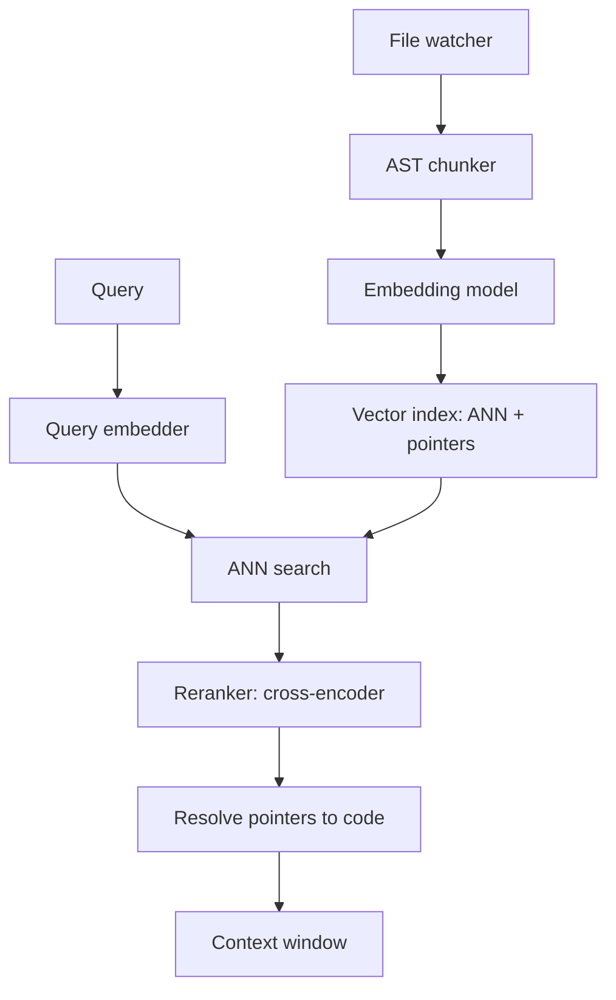
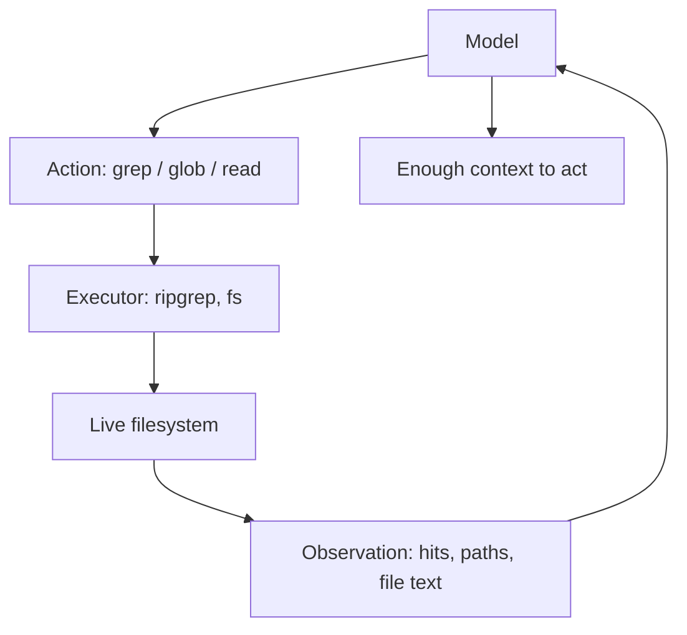
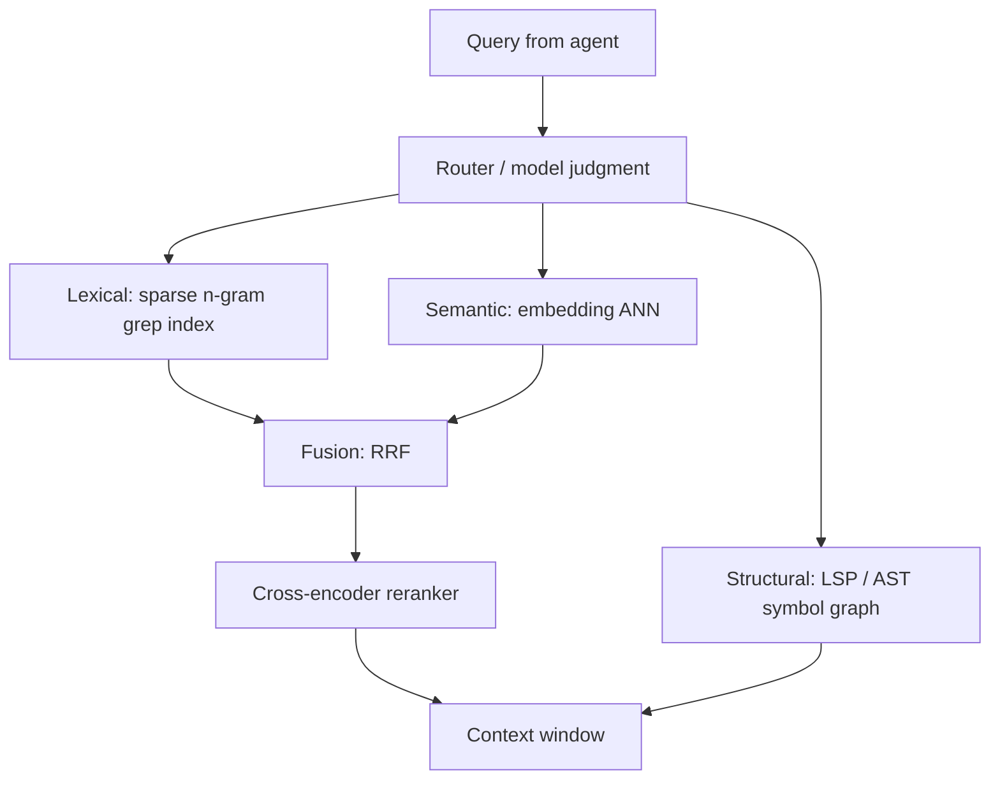

> [!info] Context
> Part of [[Harness-Internals-Overview|Harness Engineering Internals]], Level 2 wave. Parent chapters: [[Harness-Internals-Claude-Code-Architecture]] (the no-RAG decision), [[Harness-Internals-Cursor-AI-IDE-Architecture]] (the embedding-index counter-position), and [[Harness-Internals-Tool-Calling-Internals]] (tool selection as the same IR problem at registry scale). This chapter is the benchmark-level treatment of the field's most-interviewed design fork: retrieve code by iteratively searching, or retrieve it from a pre-built vector index — and it shows that the same fork recurs, structurally identical, when a harness has a thousand tools instead of a thousand files.

# Agentic Search vs Embedding Retrieval

## 1. Executive Overview

Every agent harness has to answer one question thousands of times per session: *given what the model needs to do next, which few thousand tokens out of millions should I put in the context window?* This is the retrieval problem, and there are exactly two philosophies for solving it. The first, **embedding retrieval** (RAG for code), pre-processes the corpus once into a vector index and answers each query with a single approximate-nearest-neighbor lookup. The second, **agentic search**, keeps no index at all: the model searches the live corpus the way a human engineer does — `grep` for a symbol, read the hits, follow an import, `grep` again — spending model turns instead of index infrastructure.

The parent chapters staked out the two positions. [[Harness-Internals-Claude-Code-Architecture|Claude Code]] tried RAG with a local vector database, removed it, and Boris Cherny reported agentic search "outperformed everything. By a lot, and this was surprising" **[verified — Pragmatic Engineer interview]**. [[Harness-Internals-Cursor-AI-IDE-Architecture|Cursor]] made the opposite bet, maintaining a Merkle-synced embedding index because an IDE's sub-200-millisecond latency budget cannot absorb a grep-and-read loop. Both are coherent. Both ship at massive scale. The interview trap is treating this as a winner-take-all religious war when it is a **constraint-satisfaction problem** with a clean crossover surface.

The one claim that reframes this topic for someone who thinks they already know it: **agentic search vs embedding retrieval is not a choice between two algorithms — it is a choice about *when you pay and who maintains the invariant*.** RAG front-loads cost into a standing index that some system must keep synchronized with a corpus that changes every few seconds; agentic search defers all cost into per-query model round-trips against a corpus it never has to synchronize because it reads the ground truth directly. Once you see it as a cost-curve-and-freshness problem rather than a relevance-quality problem, three things fall out that this chapter proves: (1) the retrieval-quality gap between the two is far smaller than folklore assumes — an AWS paper puts agentic keyword search at over 90% of RAG performance with no vector database **[verified — AAAI 2026]**; (2) the decision is dominated by corpus churn, query type, and latency budget, not by embedding model quality; and (3) *the identical fork reappears one level up* — when a harness carries hundreds of MCP tools, choosing whether to load all tool definitions or retrieve them on demand is the same lexical-vs-semantic retrieval decision over a different corpus, with the same accuracy collapse at scale and the same fix. Retrieval is one problem wearing three costumes: code files, tool descriptions, and memory.

## 2. Historical Evolution

**Pre-2020 — lexical search was the only search.** Code search meant `grep`, and at scale it meant inverted indexes over tokens or trigrams. Google built Zoekt (Han-Wen Nienhuys) and Sourcegraph productized it: a positional-trigram index that answers substring and regex queries over billions of lines **[verified — Zoekt repo/design docs]**. There was no "semantic" code search because there were no code embeddings worth the name. Relevance was exact-match, and exact-match is *right* for the dominant code query — "find every caller of `getUserById`" is a string question, not a similarity question.

**2020–2022 — the embedding era arrives for code.** CodeBERT (2020) and later CodeT5, UniXcoder, and CodeSage showed you could embed code and natural language into a shared vector space and do text-to-code retrieval. This unlocked the query lexical search *can't* answer: "where do we handle refunds?" against a codebase that never uses the word "refund." The bimodal NL↔PL retrieval task became a research field. But these were small BERT-class encoders, and their embeddings — rich in token context — did not encode deeper program logic and degraded under naming variation and obfuscation **[verified — code-embedding survey literature]**.

**2022–2024 — RAG becomes the default coding-assistant architecture.** When chat models got good enough to write whole functions, context became the bottleneck: how do you get 30 relevant files out of a 30,000-file repo into a 100K window? The industry answer was to chunk the repo, embed the chunks, store vectors, and ANN-search at query time. Cursor built its product on exactly this pipeline (AST chunking, content-addressed embedding cache, Turbopuffer store — see the parent chapter). It works and it is fast, but it imports four permanent operational liabilities that recur throughout this chapter: **staleness** (the index describes a repo that no longer exists the instant you type), **security/privacy** (code-derived vectors sitting in a store, partially invertible), **infrastructure** (someone runs the embedder, the vector DB, the sync protocol), and **relevance mismatch** (embedding similarity is the wrong function for exact-identifier queries).

**2024 — SWE-bench quantifies how bad retrieval is.** The original SWE-bench paper made retrieval a first-class, measured component. It used BM25 sparse retrieval — explicitly choosing lexical over dense because "keys and queries are too long and there is modality mismatch between natural language queries and code" **[verified — SWE-bench paper]**. The numbers were brutal and clarifying: Claude 2 resolved 1.96% of issues with BM25-retrieved context versus 4.8% with *oracle* retrieval (the ground-truth files handed over), rising to 5.9% when the oracle context was collapsed to just the edited lines ±15. Retrieval quality, not reasoning, was a dominant bottleneck.

**2025 — the agentic-search turn.** Two things happened at once. Models got cheap and fast enough that spending 5–10 tool round-trips on a search became affordable, and harness builders noticed that a model iteratively grepping *outperformed* one-shot retrieval on real localization. Claude Code shipped no index at all. Cursor kept its index but layered agentic tools on top and then *optimized grep itself* with a sparse-n-gram index to make agent search sub-millisecond **[verified — Cursor "Fast regex search" blog]**. Anthropic's advanced-tool-use work simultaneously discovered the *same* pattern at the tool layer: loading 50+ MCP tools tanked selection accuracy, and retrieving tools on demand fixed it **[verified — Anthropic engineering]**.

**2026 — the empirical verdict lands, hedged.** An AWS paper ("Keyword search is all you need," AAAI 2026) showed tool-based keyword search reaching >90% of RAG performance with no vector store **[verified]**. A parallel research line (LocAgent, FastCode, SWE-Debate, BLAgent) showed agentic explorers forming "a clear tier above classical retrieval" on SWE-bench localization — FastCode at 86.13% Acc@1 versus embedding-based Agentless at 63.0% Top-1 **[verified — respective papers; note these are different systems, not a controlled A/B]**. The frontier is now *hybrid and routed*: lexical-first with semantic fallback, and learned routers that pick per query. This is the state this chapter documents.

## 3. First-Principles Explanation

Start from the irreducible problem. A model has a context window `W` (say 200K tokens). A corpus `C` is far larger (a real repo is tens of millions of tokens). You need a function `retrieve(query, C) -> subset that fits in W` that maximizes the probability the model has what it needs. There are two families of implementation, and they differ in *where the work lives*.

**Embedding retrieval as an algorithm.** Offline: chunk `C` into `n` pieces, run each through an embedding model to get a vector, store `(vector, pointer)` in an index supporting approximate nearest neighbor (ANN) search. Online: embed the query, ANN-search for the top-`k` chunks, resolve pointers to text, stuff into context. The cost profile: a large one-time `O(n)` embedding pass, ongoing `O(churn)` re-embedding as files change, and a cheap `O(log n)` per query. One model round-trip. The relevance function is cosine similarity in a learned semantic space — it answers "what is *like* this query" and is blind to exact tokens and to structure.

**Agentic search as an algorithm.** There is no offline phase. Online, the model runs a loop:

```
context = [task]
loop:
    action = model(context)           # decide: grep? glob? read? or answer
    if action is final answer: return
    observation = execute(action)     # ripgrep / glob / read a file range
    context.append(action, observation)
```

Concretely in Claude Code the actions are `Glob` (path patterns, returns file paths sorted by mtime, hard-capped near 100 results), `Grep` (ripgrep over contents, defaulting to `files_with_matches` output to conserve tokens), and `Read` (a file range, default 2000 lines, with `offset`/`limit`, and — critically — it `stat`s the file on every call so there is *no cache*; the filesystem is always the live source of truth) **[verified/inference — Claude Code tool docs + reverse-engineering; the "no cache, stat on read" behavior is community-observed and consistent with the design]**. The relevance function is *whatever the model reasons*: it forms a hypothesis, tests it with an exact-match query, observes, and reformulates. This is iterative deepening search where the model is the heuristic.

Now the decisive first-principles observation, the one that reframes the whole debate: **these two are not competing for the same relevance function.** Embedding search is a *similarity* oracle; agentic grep is an *exactness-plus-reasoning* oracle wrapped in a feedback loop. For the query "find callers of `getUserById`," exact match is not "better than" embeddings — embeddings are *categorically wrong*, because two functions that both call `getUserById` are not semantically similar to the string "getUserById." For "where do we handle money?", grep is not wrong so much as *blind* — if the code says `Invoice` and `Ledger` and never "money," a literal search returns nothing. Each oracle has a class of queries it structurally cannot serve.

The second observation is about **self-correction**, and it is why the loop wins more often than intuition predicts. A bad grep returns zero results — and *zero results is information*. The model observes the empty set and reformulates: broader pattern, different casing, a related identifier. A bad ANN lookup returns `k` confidently-wrong chunks that the model cannot distinguish from correct ones; the wrong context is *poison*, silently degrading the answer. An empty result is a signal; a wrong result is a lie. Iterative search converts retrieval failure into a recoverable observation; one-shot retrieval converts it into an unrecoverable hallucination. That asymmetry, more than raw recall@k, is why agentic search punches above its weight.

## 4. Mental Models

**Retrieval is memory hierarchy, and grep-vs-index is cache-vs-recompute.** A CPU can keep a precomputed value in cache (fast lookup, must be invalidated when inputs change) or recompute it on demand (no invalidation, costs cycles each time). An embedding index is a cache of "relevance"; agentic search recomputes relevance every query from the source. As with real caches, the index wins when the value is expensive to compute and reused often against slowly-changing inputs, and loses when the inputs change faster than you can invalidate. Code changes every few seconds. That single fact — high write rate — is why the "cache" (index) is perpetually stale and the "recompute" (grep) is perpetually correct.

**The index is a promise; the filesystem is the truth.** An embedding index promises "these vectors describe your code." Every edit makes the promise a little false until re-indexing repays it. Agentic search makes no promise it has to keep — it reads the file that exists *now*, mid-refactor, mid-generation. This matters most in the case the model *creates itself*: an agent that writes a file and then searches for what it wrote. Cursor states it plainly — "semantic indexes are tolerant of staleness, while text search demands extreme freshness, especially when the agent reads back content it just wrote; a stale text search index sends the agent into futile search loops" **[verified — Cursor blog]**. The model reading its own writes is the freshness stress test that kills indexes.

**Grep output is a map; ANN output is a coordinate.** When you `grep` a symbol across a repo and get the list of files and lines, you receive not just hits but the *shape of the codebase* — which directories cluster around the concept, how the naming conventions run, where the tests live. It is human-readable and directly usable as context. An ANN result is `k` decontextualized chunks: precise coordinates with the map torn off. During *exploration* — the phase where the model is still forming a model of the repo — the map is worth more than the coordinate.

**Tool selection is retrieval wearing a different hat.** Hold this one until §6 and §14, but plant it now: a harness with 500 tools deciding which 3 to consider is doing IR over a corpus of tool descriptions. "Load all tools into the prompt" is the RAG-equivalent of stuffing the whole corpus into context; "search for the right tool" is agentic retrieval over the registry. The accuracy curves, the token economics, and the lexical-vs-semantic tradeoffs are *the same problem*, which is why Anthropic's fix for tool bloat looks exactly like a retrieval system.

## 5. Internal Architecture

The two retrieval philosophies decompose into different component graphs. Here is the embedding-retrieval stack (Cursor-shaped, generalized):



Every box is standing infrastructure with its own failure mode: the watcher can miss events, the chunker can split a function, the embedder drifts across versions, the index goes stale, the reranker adds latency. Now the agentic-search stack:



The entire retrieval system is the model, a search binary, and the filesystem. There is no index to build, no vector store to run, no reranker to train. The "components" are model turns. This is why the agentic stack is not just simpler to *reason* about but simpler to *operate*: the parts list is three items, and two of them (the model, the filesystem) you already have.

The interesting architecture is the **hybrid**, which every serious production system is converging toward. Cursor is the cleanest specimen: it runs the embedding index *and* a fast local grep index *and* agentic tools *and* rerankers, and increasingly routes per query.



Three retrieval arms, each for the query class it serves — lexical for exact identifiers, semantic for conceptual queries, structural (LSP/AST) for relational queries (callers, implementors, type hierarchy) that *neither* similarity nor substring can answer well. Fusion combines the ranked lists; a reranker sharpens the top; the model or a learned router decides which arms to fire. Cursor's "Fast regex search" is precisely the lexical arm rebuilt so it is fast enough for an agent to call constantly and in parallel — a **client-side** index of two files (a memory-mapped lookup table of hashes to posting-list offsets, and an on-disk postings file read on demand) chosen local rather than server-side for latency, freshness, and privacy **[verified — Cursor blog]**.

## 6. Step-by-Step Execution

Trace two concrete executions. First, **agentic search** on "the webhook signature check is rejecting valid Stripe events."

1. **Hypothesis + lexical probe.** The model reasons that the concept is likely named and greps: `Grep("verify.*signature", output_mode="files_with_matches")`. Ripgrep returns three files. Cost: one model turn, a few hundred tokens of paths. Note the model chose an exact-ish pattern, not a sentence — it is exploiting that code *names* things.
2. **Narrow.** It greps again inside the strongest candidate for the provider: `Grep("stripe", path="src/webhooks/")`, gets line hits. Another turn.
3. **Read.** It `Read`s the ~120 relevant lines of `verifier.ts` (using `offset`/`limit`, not the whole file). Now it has ground truth — including that the file was edited two minutes ago, because `Read` stat'd it live.
4. **Follow structure.** It sees the verifier calls `getRawBody()` and greps for that to confirm the body is being parsed before signature check (a classic Stripe bug). One more turn.
5. **Answer / act.** Five turns, maybe 4,000 tokens of retrieved context, zero standing infrastructure. Critically, if step 1 had returned nothing, the empty result would have told the model to try `hmac` or `webhook` instead — the loop self-heals.

The cost structure of this loop is the answer to must-answer question 1. Let `t` be the number of tool round-trips (here 5) and `s` the context size, which *grows every turn* because prior observations accumulate. Each round-trip is a full inference pass over the whole (growing) context. So token cost is roughly `sum over turns of context_so_far` — superlinear in `t` — and latency is `t` serial model calls plus tool execution. This is why the two dominant optimizations are **parallelism** (fire independent greps/reads in one turn — Relace's "Fast Agentic Search" reports ~4x latency reduction and collapsing 20-turn chains to 4–5 by running 4–12 tools per turn **[verified — Relace, reported]**) and **subagent offloading** (Claude Code's Explore subagent runs the search loop on Haiku in an *isolated* context and returns only a summary, so the parent never pays for the 80K tokens of exploration — the loop's superlinear cost is quarantined). The cost curve of grep→read is: cheap per query at small `t`, punishing as `t` and `s` grow, which is exactly why long searches get pushed into cheap models and disjoint contexts.

Second, **embedding retrieval** on "where do we handle refunds?" against a codebase that says `reverseCharge`:

1. Embed the query with the *same* model used for the index (mismatched embedders = garbage).
2. ANN-search the vector store; top-8 chunks come back as pointers.
3. Resolve pointers to code (in Cursor, the client decrypts obfuscated paths and reads local line ranges — the store never held plaintext).
4. Optionally rerank the 8 with a cross-encoder.
5. Stuff into context. One model round-trip. Total latency: milliseconds of ANN + one inference.

This is where embeddings *win*: the conceptual query in foreign vocabulary. Grep for "refund" returns nothing; the embedding of "handle refunds" lands near `reverseCharge` because the model learned they are semantically adjacent. One lookup, no loop. That is must-answer question 2's core: embeddings measurably win when the query is semantic, the vocabulary is unknown to the searcher, latency must be single-digit (interactive), and the corpus is large enough that grepping blindly would be many turns.

Now the **tool-retrieval execution**, must-answer question 6's setup, showing it is the *same* algorithm. A harness has 600 tools. Instead of rendering all 600 schemas (~72K tokens for even 50 tools, per Anthropic **[verified]**), it exposes one meta-tool, `tool_search`. The model calls `tool_search("create a calendar event")`; the harness runs BM25 or regex or embedding retrieval over the 600 tool *descriptions*, returns the top 3 schemas, and the model picks among 3 instead of 600. This is grep-then-read with "tool descriptions" as the corpus and "load the schema" as the read. The identical loop.

## 7. Implementation

If you were building these systems, here is what actually carries the weight.

**Building the agentic-search side is mostly prompt and tool contracts.** The retrieval "system" is three tools with disciplined contracts. `Grep` must default to token-frugal output (`files_with_matches`, not full lines) or a single verbose call floods context. `Read` must `stat` on every call and never cache, or the agent-reads-its-own-writes case breaks. `Glob` must cap results and sort by recency (a heuristic that surfaces the files a developer just touched). And the *system prompt* must teach the search policy — when to broaden, when to read, when to spawn a subagent. The genuinely hard engineering is elsewhere: making ripgrep fast enough. Naive `ripgrep` scans all file contents and can exceed 15 seconds on a monorepo, stalling the agent **[verified — Cursor]**. Cursor's fix is a **sparse n-gram index**: rather than fixed trigrams, assign frequency-based deterministic weights to character pairs and extract variable-length substrings where edge weights exceed internal weights, so far fewer index entries are produced; at query time a "covering algorithm" emits the minimal n-grams needed, avoiding the trigram engine's need to load dozens-to-hundreds of posting lists **[verified — Cursor blog]**. Compare Zoekt's classic approach: positional trigrams, where a substring query checks only the first and last trigram at the correct distance apart, accepting false positives (the candidate line is re-verified with the real regex anyway) to keep RAM at ~1.2x corpus size; symbol matches from `ctags` are ranked above plain-text hits **[verified — Zoekt design]**. Either way, the lesson is that "just use grep" hides a real inverted-index engine once the corpus is large.

**Building the embedding side is where a *good code embedding model* matters — must-answer question 3.** A general text embedder underperforms on code for a concrete, mechanical reason: it was trained to capture *linguistic* similarity, but code retrieval needs syntax, control flow, variable dependencies, and API-usage patterns — "algorithmic reasoning needs and nuanced syntax rules including keywords, control structures, nesting, and formatting" that a prose-trained model never learned to weight **[verified — Voyage]**. Two functions can be near-identical prose ("sort a list") and semantically opposite in behavior; two can look textually alien and do the same thing. The fix is training data and objective, and the public recipes are unusually clear:

- **voyage-code-3** trains on a corpus with a deliberately tuned code-to-text ratio, plus docstring-code and code-code contrastive pairs across 300+ languages, and beats OpenAI-v3-large by 13.80% and CodeSage-large by 16.81% averaged over 32 code-retrieval datasets **[verified — Voyage blog]**. It also demonstrates the storage lever: Matryoshka-nested dimensions (2048/1024/512/256) and int8/binary quantization let a 256-dim binary embedding hit within ~4.8% of a 3072-dim float32 at 1/384 the storage.
- **CoRNStack / CodeRankEmbed** is the open, fully-documented recipe and the best study artifact. It builds a 21M-pair contrastive dataset from Stack v2 via **dual consistency filtering** (keep a (text, code) pair only if the code ranks in the top-k most similar snippets *and* similarity exceeds δ=0.7 — lifting correctness from 52.9% raw to 77.1%) and **curriculum hard-negative mining** (an offline pass removes false negatives, an online softmax sampler anneals negative difficulty via temperature 0.05→0.001). The payoff: a 137M-parameter Arctic-Embed-M fine-tune hits 78.4% MRR on CodeSearchNet, beating the 1.3B-parameter CodeSage-Large's 70.8% — a model **10x smaller** winning on data quality **[verified — CoRNStack paper]**. That result is the whole "why general embedders lose" thesis in one number: it is not model size, it is code-specific contrastive data.

**The reranker is the other half of a serious embedding stack.** ANN recall is fuzzy; a cross-encoder re-scores the top candidates by jointly encoding (query, chunk) with full cross-attention, catching subtle relevance a bi-encoder's independent embeddings miss — at a cost that only permits scoring a shortlist (top-100 to top-1000), never the whole corpus **[verified — reranking literature]**. For code specifically, CodeRankLLM is a listwise 7B reranker (Qwen-2.5-Coder-7B, distilled from a 32B teacher's rankings) that lifts CodeSearchNet from 77.7% (retriever alone) to 80.5% MRR@100 **[verified — CoRNStack]**. Cohere Rerank, BGE, and ColBERTv2 are the production defaults for the general case.

**A hybrid client** wires these together. Run BM25/sparse and dense in parallel, fuse with **Reciprocal Rank Fusion** (rank-only, so it sidesteps the score-incompatibility problem: BM25 scores are unbounded while cosine sits in [-1, 1], so averaging raw scores is meaningless; RRF rewards documents both arms rank highly by position) **[verified — hybrid-search literature]**, then rerank the fused top-100. This is the "lexical-first with semantic fallback" architecture must-answer question 5 asks about.

## 8. Design Decisions

**Why did Claude Code delete a working RAG pipeline?** Cherny lists four reasons — security, privacy, staleness, reliability — but the *design* reason underneath is the cost-curve argument, sharpened by HarrisonSec's analysis: `total_cost = build + maintain × time + per_query × queries`. RAG minimizes `per_query` but pays `build` and a `maintain` term that scales with churn (re-embedding on every edit, and *superlinearly* when refactors touch many files). Agentic search pays zero build and zero maintain — "the live filesystem is the index" — at a higher `per_query`. The crossover where RAG's cheaper queries repay its build+maintain cost only arrives at mega-monorepo scale, and even there the winner tends to be a *symbol-graph* index (structural), not vector RAG **[verified — HarrisonSec, reasoned]**. For any repo under ~1M lines that changes frequently and is queried with exact identifiers by a model with cheap, abundant context, grep wins the arithmetic. And the choice was really a bet on the *model-improvement curve*: agentic search converts retrieval from an infrastructure problem into a model-capability problem, and model capability improves for free every release while your index infrastructure does not.

**Why does Cursor keep the index anyway?** Because its constraint is different: interactive latency. You cannot run a 5-turn grep→read loop inside a keystroke-to-suggestion budget; you need the single-lookup path. An IDE also *already* has the ambient context (cursor, open buffers, recent edits) that a terminal agent must grep to discover, so the index complements rather than replaces. Cursor's engineering — obfuscated paths, discard-plaintext-after-embedding, content-addressed cache — is precisely the work required to make a standing index *palatable* on the security/privacy axes that pushed Anthropic away from one. Different constraint, different optimum, both correct.

**How should structural queries be served — must-answer question 4.** "Find all callers of `X`," "who implements interface `Y`," "what is the type of this expression" are **relational** queries, and both embeddings and substring search serve them badly. Embedding similarity is the wrong function (callers are not similar to the callee); grep gets close for unique identifiers but drowns on common names, misses dynamic dispatch, and cannot resolve overloads or follow type hierarchies. The right tool is a **program-structure index**: LSP (`textDocument/references`, `textDocument/implementation`, `callHierarchy`) or an AST/symbol graph built with tree-sitter or ctags. LSP gives *semantically resolved* answers (it knows which `open` you mean) at the cost of running a language server per language and per project state — hard to multiplex across an agent's speculative edits, which is why terminal agents lean on grep and only occasionally invoke LSP **[verified — practitioner observation]**. AST-grep / tree-sitter gives low-configuration structural matching that layers cleanly on top of grep results. The production answer is *layered*: grep for the fast lexical pass, tree-sitter for structural precision, LSP when you need resolved semantics, embeddings for the conceptual tail. SWE-bench localization research bears this out — the strongest systems (LocAgent, graph-based explorers) build or traverse a code graph rather than relying on similarity alone.

**Why hybrid, and does lexical-first + semantic-fallback actually work — must-answer question 5.** The empirical case is strong. Sparse and dense have *complementary* failure modes — BM25 nails exact/rare tokens and misses paraphrase; dense nails paraphrase and misses exact rare tokens — so fusing them strictly dominates either alone on heterogeneous query mixes **[verified — hybrid-search literature]**. "Lexical-first" is also the *cheap-first* ordering: try the near-free exact-match, and only spend embedding/ANN/rerank compute when lexical returns too little. The AWS keyword-search paper is the extreme version — pure agentic keyword tools reaching >90% of full-RAG quality — which reframes semantic retrieval as a *fallback* for the ~10% of queries lexical genuinely can't serve, rather than the default engine. The honest caveat: hybrid adds operational surface (two indexes, a fusion step, a reranker), so its win must clear that cost; for a terminal coding agent, "lexical-first" often collapses all the way to "lexical-only plus the model's reasoning as the fusion step."

## 9. Failure Modes

**Index staleness (embedding side).** Between syncs the vector store describes deleted code; the model confidently references phantom functions. Debug signal: retrieved line ranges that no longer match file contents. Mitigations: event-driven sync on save, and blending live buffer contents over indexed chunks so open files always override. The pathological case is the self-write loop — the agent writes code, searches for it, and a stale index returns the *old* version, sending it into futile re-search. This is why text-search indexes demand freshness that semantic indexes don't.

**Grep blindness (agentic side).** Lexical search inherits lexical weaknesses: dynamically-dispatched call sites, string-built identifiers, reflection, cross-language boundaries, and *conceptual queries in unfamiliar vocabulary*. The agent greps "refund," gets nothing, and — if it doesn't reformulate — concludes the feature doesn't exist. Mitigation is prompt-level (teach reformulation) and architectural (a semantic fallback arm). Know this cold when asked "when does no-RAG lose": foreign-vocabulary conceptual queries over a corpus with no exploitable naming conventions.

**Chunk-boundary blindness.** Even AST-aware chunking cannot make a function's callers visible inside its own chunk — "who calls this" is a graph query, not a similarity query, so pure embedding retrieval misses it almost structurally. This is *the* reason rerankers, grep, and structural indexes coexist with vectors in every serious system.

**Reranker and fusion pitfalls.** RRF done on incompatible raw scores (averaging BM25 and cosine) silently biases toward the unbounded scorer. A cross-encoder run on too-large a candidate set blows the latency budget. And a reranker trained on general text mis-ranks code (the query-code modality gap again), which is why code-specific rerankers exist.

**Retrieval-eval blind spots.** The nastiest failure is silent: the system retrieves plausible-but-wrong context and the *answer just gets mediocre* with no error logged. You cannot detect this from error rates; it requires a retrieval eval measuring recall@k against known-relevant sets. SWE-bench's oracle-vs-BM25 gap (1.96% → 4.8% for Claude 2) is exactly this failure made measurable — the model was fine, the retrieval was starving it.

**Embedding-inversion / privacy.** "We only store vectors" is not "vectors leak nothing" — inversion attacks recover approximate text from embeddings, so a code-derived index is *confidential*, not merely anonymous. The architectural control is keeping plaintext resolution client-side (pointers not payloads), which is why agentic search's "nothing embedded, nothing uploaded" posture is genuinely a smaller attack surface, not just a simpler one.

## 10. Production Engineering

**Anthropic / Claude Code** runs pure agentic search: ripgrep binaries vendored in the bundle, `Grep`/`Glob`/`Read` with token-frugal contracts, an Explore subagent on Haiku for deep search in an isolated context, and — per HarrisonSec's teardown — the whole exploration strategy still gated behind A/B flags (`tengu_amber_stoat`, tested against an alternative "Fork" architecture), meaning even Anthropic treats the exact retrieval policy as *unsettled and empirically tuned*, not doctrine **[inference — reverse-engineering; treat the flag names as version-bound]**. The economic enabler is prompt caching: because the search tools and system prompt form a byte-stable prefix present in most turns, cached reads bill at ~0.1x, which is what makes a multi-turn search loop affordable **[verified — caching design]**.

**Cursor** runs the full hybrid: a Merkle-synced central embedding index (Turbopuffer, content-addressed embedding cache, obfuscated paths), a *client-side* sparse-n-gram grep index for fast agent regex, agentic tools, and rerankers, routing per query. The published indexing-latency wins (median time-to-indexed 7.87s → 525ms, p99 4+ hours → 21s) are almost entirely content-addressed-cache economics — indexing cost scales with *novel code written*, not repos opened **[verified — Cursor]**. Cursor's position is the honest refutation of "RAG is dead": the company with the most sophisticated code embedding stack *also* built a faster grep, because different query classes need different arms.

**Sourcegraph / Zoekt** is the incumbent lexical-at-scale answer: positional trigram shards, memory-mapped for zero-downtime index swaps, ctags symbol ranking, ~1.2x corpus RAM. It is the reference for "how do you grep a billion lines" and the substrate a lot of code-search-as-a-tool is built on **[verified]**.

**The tool-layer story (Anthropic advanced tool use).** This is where the retrieval fork appears at registry scale in production. Loading 50+ MCP tools costs ~72K tokens and *tanks* selection accuracy; the **Tool Search Tool** defers loading (retrieve tools on demand via regex, BM25, or custom embedding search over descriptions), dropping to ~8.7K tokens (85% reduction, 95% of context preserved) while *raising* accuracy — Opus 4 from 49% to 74%, Opus 4.5 from 79.5% to 88.1% **[verified — Anthropic]**. **Programmatic Tool Calling** keeps intermediate tool results in a sandbox out of context (43,588 → 27,297 tokens, 37%). This is the same recall-beats-completeness lesson as code RAG, at the tool corpus.

**The independent-convergence signal.** Amazon Science (agentic keyword search ≥90% of RAG), Anthropic (drop RAG for grep), Cursor (build a *faster* grep even while keeping embeddings), and the SWE-bench localization leaderboard (agentic explorers above classical retrieval) are four independent teams, different constraints, landing on the same conclusion: **lexical/agentic search is the default, embeddings are the specialized fallback.** When teams with this little in common converge, the constraint is real.

## 11. Performance

**The agentic-search cost curve, quantified.** Per-query cost is `Σ context_at_each_turn` — superlinear in turn count `t` because observations accumulate. A 5-turn search over a growing 4K→20K context can cost more total tokens than a single 8-chunk RAG lookup by an order of magnitude. The three levers that bend this curve:
- **Parallelism within a turn.** Independent reads/greps in one assistant turn amortize the prefill: 5 reads = 1 inference over the context, not 5. Relace reports ~4x latency reduction and 20→4-5 turn collapse from firing 4–12 tools per turn **[verified — reported]**.
- **Cheap-model offloading.** Push the search loop to Haiku-class models in a subagent; the frontier model pays only for the summary. This is why >50% of Claude Code's LLM calls in a session were measured going to cheap models **[inference — MinusX, version-bound]**.
- **Prefix caching.** Byte-stable tool/system prefix makes the reprocessed context bill at ~0.1x. Without it the resend-everything loop is unaffordable.

**The embedding path is latency-flat but has a fixed floor.** ANN is `O(log n)`, milliseconds; the floor is one embedding call + one inference + optional rerank. It does not grow with corpus size (that is its whole appeal) but it does not *self-correct* either — a bad lookup is a bad answer at full price. Indexing cost, with content-addressing, scales with novel code, not corpus size (Cursor's p99 4h→21s).

**Retrieval quality numbers to anchor on** (different systems, not a controlled benchmark — cite as directional):
- SWE-bench: BM25 vs oracle, Claude 2 1.96% → 4.8% resolved — retrieval is a first-order lever **[verified]**.
- Agentic localization: FastCode 86.13% Acc@1, LocAgent 77.74%, SWE-Debate 81.67% file-level; embedding-based Agentless 63.0% Top-1 with GPT-4o **[verified — respective papers]**.
- Code embedders: voyage-code-3 +13.8% over OpenAI-v3-large; CoRNStack's 137M model 78.4% MRR beating a 1.3B model's 70.8% **[verified]**.
- Reranking: CodeRankLLM +2.8 MRR (77.7→80.5) over retriever alone **[verified]**.
- Tool retrieval: RAG-MCP triples selection accuracy (13.62% → 43.13%) and halves tokens; baseline selection craters from ~87% at 500 tools to ~65% at 2,000 **[verified — RAG-MCP / HumanMCP]**.

**The universal performance law across both stacks:** move work off the critical path. RAG moves it offline (index once); agentic search moves it into parallel turns and cheap models. Both are fighting the same enemy — serial work in the latency budget.

## 12. Best Practices

**Default to lexical/agentic; add semantic as a measured fallback.** Start with grep-then-read plus the model's reasoning. Add an embedding arm only when a retrieval eval shows a class of queries lexical is missing (conceptual, foreign-vocabulary). This is the empirically-supported ordering, not just the cheap one — pure keyword agentic search reaches ≥90% of RAG on real tasks.

**Make `Read` live and `Grep` frugal.** Never cache file reads (breaks the agent-reads-own-writes case); default grep to path/count output modes and only pull full lines on demand. A single unbounded grep can dump 20K tokens of noise.

**If you index, key everything by content hash.** Chunk, embed, and cache keyed on chunk content — dedup and incrementality fall out for free, and indexing cost collapses to novel-code-written. Store pointers, not payloads, so plaintext resolves client-side (privacy and storage architecture in one).

**Use a code-specific embedder and a code-specific reranker, or don't bother.** A general text embedder on code is a known-underperformance path; the modality gap is real and measured. If you can't run voyage-code-class or CoRNStack-class models, the embedding arm may not clear its own operational cost.

**Serve structural queries structurally.** Route "callers/implementors/type-of" to LSP or a tree-sitter/ctags symbol graph, not to similarity or substring. Building a code graph is the highest-leverage upgrade for localization tasks.

**Treat tool selection as retrieval past ~30–50 tools.** Below that, load all definitions. Above it, defer-load with search over descriptions; retrieval becomes *mandatory* past ~100 tools where selection accuracy otherwise collapses.

**Anti-patterns:** byte-window chunking of code (splits functions); re-embedding unchanged files; averaging BM25 and cosine scores (use RRF); trusting an embedding index for exact-identifier or freshness-critical queries; running a cross-encoder over more than a shortlist; and — the meta anti-pattern — building a vector database before you have a retrieval eval that proves grep is insufficient.

## 13. Common Misconceptions

**"Agentic search is a downgrade — a workaround for not having embeddings."** Backwards. It is often the *better* retriever for code because it self-corrects (empty results are informative, wrong chunks are poison) and never goes stale, and it converts an infra problem into a model-capability problem that improves for free. Anthropic tried RAG first and *removed* it.

**"Better embeddings will solve code retrieval."** Similarity search cannot answer structural queries (callers, implementors, data flow) at *any* embedding quality — those are graph queries. Production systems blend vectors with exact search, structural indexes, rerankers, and user pinning. The index is one arm, not the retrieval system.

**"A general embedding model is fine for code."** Measurably false. General embedders capture linguistic similarity; code needs syntax, control flow, and API-usage structure. A 137M code-trained model beats a 1.3B general-ish model on code retrieval — it is the *data and objective*, not size.

**"RAG is dead."** Marketing overreach. RAG is the specialized path for semantic, foreign-vocabulary, latency-critical, or truly-massive-corpus retrieval; Cursor's IDE latency budget makes it mandatory there. "Lexical-first, semantic-fallback" is the accurate summary, not "vectors are obsolete."

**"Tool calling and code retrieval are different problems."** They are the *same* IR problem at different corpora. The token economics, the accuracy-collapse-at-scale, and the retrieve-then-select fix are identical whether the corpus is files or tool descriptions. Seeing this unifies half the harness.

## 14. Interview-Level Discussion

**Q1 — Walk me through the exact cost curve of grep→read versus a vector lookup, and where they cross.** Grep→read costs `t` serial inference passes over a context that *grows each turn*, so total token cost ≈ `Σ context_at_turn_i`, superlinear in `t`; latency is `t` × (inference + tool exec). A vector lookup is one embedding + one `O(log n)` ANN + one inference, flat in corpus size. So agentic search is cheaper when `t` is small (well-named code, exact queries, good reformulation) and when you can parallelize turns and offload to cheap models; RAG is cheaper when queries are semantic (grep would need many failed turns), latency must be interactive (no loop fits), or the corpus is huge. The crossover is governed by corpus *churn* and query *type*, not size alone — high churn pushes toward grep (index maintenance dominates), semantic-foreign-vocabulary queries push toward embeddings. The deepest framing: grep bets on the model curve, RAG bets on infrastructure; the former appreciates every model release.

**Q2 — Where do embeddings measurably win, with evidence?** Conceptual queries in unfamiliar vocabulary ("handle refunds" over `reverseCharge`), where grep returns nothing and cosine lands near the right chunk; interactive-latency surfaces (Cursor's keystroke budget, where a 5-turn loop is impossible); and huge corpora where blind grep is many turns. Evidence for the *complement*: hybrid consistently beats either arm because failure modes are complementary (BM25 misses paraphrase, dense misses exact rare tokens). But note the ceiling: AWS measured pure agentic keyword search at ≥90% of RAG, so the embedding win is the last ~10%, not the bulk.

**Q3 — Why do general text embedders underperform on code, and what does a good code embedder do differently?** General embedders optimize linguistic similarity; code retrieval needs syntax, control flow, variable dependencies, and API usage — structure a prose model never learned to weight, so textually-similar code with opposite behavior collides and textually-alien equivalents scatter. Good code embedders fix it with *data and objective*: voyage-code-3 tunes a code-to-text corpus ratio and trains on docstring-code + code-code contrastive pairs across 300+ languages; CoRNStack's open recipe uses dual consistency filtering (52.9%→77.1% pair correctness) and curriculum hard-negative mining, letting a 137M model beat a 1.3B one (78.4 vs 70.8 MRR). The takeaway: it is contrastive code data quality, not parameter count.

**Q4 — How should structural queries (callers/implementors) be served, and why not embeddings?** They are relational graph queries; embedding similarity is the wrong function (a caller isn't "similar" to the callee) and substring drowns on common names and misses dynamic dispatch. Serve them with LSP (`references`, `implementation`, `callHierarchy`) for semantically-resolved answers, or a tree-sitter/ctags symbol graph for low-config structural matching. LSP costs a running language server per project-state (hard to multiplex across an agent's speculative edits), which is why terminal agents grep first and invoke LSP sparingly, and why SWE-bench's strongest localizers build a code graph. Layer them: grep → tree-sitter → LSP → embeddings, cheapest and most-exact first.

**Q5 — Design a retrieval eval at 1,000-tool scale, and explain why tool selection is the same IR problem.** Tool selection *is* retrieval: the corpus is tool descriptions, the query is the task, the "relevant document" is the correct tool. Build the eval like an IR benchmark: a labeled set of (task, correct-tool) pairs across a realistic 1,000-tool registry with near-duplicate distractors (the hard case is two tools that both plausibly apply); measure Top-k hit rate and end-to-end task success *separately* (selection vs parameterization vs execution). Sweep tool-count to find the collapse point — baselines drop from ~87% at 500 tools to ~65% at 2,000, and retrieval-based selection becomes mandatory past ~100. Compare retrieval methods (regex, BM25, SentenceTransformer, reranked) exactly as you would for documents — RAG-MCP found SentenceTransformer at 87.6% Top-10 hit, reranked to 76% final accuracy. The failure is silent (a plausible-wrong tool, no error), so error logs are useless; only a selection eval catches it. This is why Anthropic's Tool Search improved accuracy *while removing context* — fewer distractors in a fixed attention budget, the same recall-beats-completeness lesson as code RAG.

**Q6 — Your teammate wants to add a vector database to your coding agent "because grep can't do semantic search." Steelman, then decide.** Steelman: genuinely conceptual queries in foreign vocabulary are grep's blind spot, embeddings serve them in one cheap lookup, and at large corpus + interactive latency a loop is infeasible — Cursor is right to index. Decision: first ship a retrieval eval and measure the *fraction* of real queries that are conceptual-foreign-vocabulary; the AWS result says it is likely ~10%, and grep-plus-reformulation-plus-the-model's-reasoning covers much of even that. If the eval justifies it, add embeddings as a *fallback arm* with a code-specific model and a reranker, keyed by content hash, pointers-not-payloads — not as the default engine, and never before the eval. The teammate's instinct (there's a query class grep misses) is right; the implementation (replace grep with RAG) is wrong. Add an arm, don't switch engines.

## 15. Advanced Topics

**Learned per-query routing.** Today's hybrid fires arms by heuristic or model judgment; the frontier is a trained router that reads the query and allocates a retrieval budget across lexical/semantic/structural arms by expected relevance gain. The eval problem is the blocker — routing quality is only as good as the labeled query-class data you can build.

**Reinforcement-learned search agents.** CodeScout and similar work train the *search policy* itself with RL — rewarding trajectories that localize the right code in fewer turns. This attacks agentic search's superlinear cost curve directly by teaching the model to reformulate efficiently instead of flailing, and it is the natural successor to prompt-engineered search policy.

**Structural retrieval as the real mega-scale answer.** At FAANG-monorepo scale the winning index is a symbol/dependency graph, not vector RAG — because the dominant queries are relational and the graph answers them exactly. Codebase-as-knowledge-graph (tree-sitter-built, MCP-served) is an active research line that may subsume both grep and embeddings for large-repo localization.

**Tool retrieval's open evaluation gap.** Tool-selection benchmarks at 1,000+ tools barely exist; embedding retrieval over tool descriptions, usage-history priors ("this project always uses these six"), and hierarchical namespaces are obvious v2 directions with almost no standardized eval. This is charted territory for exactly one company (Anthropic) and open everywhere else — a genuine research opening.

**Embedding privacy hardening.** Inversion attacks keep improving, eroding "we only store vectors." Directions: noised/DP embeddings (quality cost), client-held decryption of vector payloads, and retrieval where the server never sees query vectors in clear. Agentic search sidesteps all of this by never building the index, which may become a *compliance* advantage, not just an engineering one.

**Freshness as the durable moat for grep.** As models get cheaper and faster, the per-query cost disadvantage of agentic search shrinks toward zero, while the staleness disadvantage of indexes is permanent (churn is a property of code, not of compute). The long-run trajectory favors agentic search precisely on the axis that does *not* improve with hardware.

## 16. Glossary

- **Agentic search**: retrieval by iterative model-driven tool use (grep/glob/read) against the live corpus at query time; no pre-built index.
- **Embedding retrieval / RAG**: retrieval by ANN search over a pre-built vector index of embedded corpus chunks; one lookup per query.
- **ANN (approximate nearest neighbor)**: sublinear vector search returning approximately-closest vectors; the query engine of an embedding index.
- **BM25**: sparse lexical ranking function over term frequencies; the exact-match retrieval baseline, strong on rare/exact tokens, blind to paraphrase.
- **Trigram / sparse n-gram index**: inverted index over 3-character (or variable-length) substrings enabling fast substring/regex search; Zoekt uses positional trigrams, Cursor uses weighted sparse n-grams.
- **AST-aware chunking**: splitting code into embedding units along syntax-tree boundaries (functions, classes) rather than fixed byte windows.
- **Content-addressed cache**: cache keyed by hash of content, making entries immutable and shareable; collapses indexing cost to novel-code-written.
- **Cross-encoder reranker**: model that jointly encodes (query, candidate) with full cross-attention to score relevance precisely; runs only on a shortlist.
- **Reciprocal Rank Fusion (RRF)**: rank-only fusion combining multiple retrieval lists by position, sidestepping incompatible raw scores.
- **Dual consistency filtering**: contrastive-data cleaning (CoRNStack) keeping a pair only if it is mutually top-ranked and above a similarity threshold.
- **Hard-negative mining**: selecting difficult non-matching examples (rather than random) to train a discriminating embedder; curriculum-annealed in CoRNStack.
- **Matryoshka embedding**: nested representation letting one model serve multiple dimensionalities (2048/1024/512/256) by truncation.
- **LSP structural query**: `references`/`implementation`/`callHierarchy` — semantically-resolved relational answers a language server provides.
- **Oracle retrieval**: giving a model the ground-truth relevant files; the retrieval upper bound used in SWE-bench ablations.
- **Tool Search Tool / deferred loading**: keeping tool definitions out of context until retrieved on demand; retrieval over the tool-description corpus.
- **Staleness**: divergence between an index and the live corpus it describes; the permanent liability of any pre-built index over changing code.

## 17. References

- **Boris Cherny / Pragmatic Engineer — "Building Claude Code"** (https://newsletter.pragmaticengineer.com/p/building-claude-code-with-boris-cherny) — Primary source for the no-RAG decision and the "agentic search outperformed everything" claim. Read first for the design intent behind agentic search.
- **HarrisonSec — "Agent Retrieval Is a Cost Curve Problem"** (https://harrisonsec.com/blog/agent-retrieval-cost-curve-claude-code-grep-vs-rag/) — The build/maintain/per-query cost model and the crossover analysis; also documents Claude Code's grep/glob/read contracts and the A/B-flagged Explore-vs-Fork search architecture. The single best conceptual frame for the whole chapter.
- **Amazon Science — "Keyword search is all you need" (AAAI 2026)** (https://www.amazon.science/publications/keyword-search-is-all-you-need-achieving-rag-level-performance-without-vector-databases-using-agentic-tool-use) — The empirical ≥90%-of-RAG-without-vectors result. Read for the quantitative case that lexical/agentic search is the sensible default.
- **Cursor — "Fast regex search: indexing text for agent tools"** (https://cursor.com/blog/fast-regex-search) — The sparse-n-gram grep index, the >15s ripgrep stall problem, and the freshness argument ("the model reading its own writes"). Read for why even the most RAG-invested company built a faster grep.
- **Cursor — "Securely indexing large codebases"** (https://cursor.com/blog/secure-codebase-indexing) — The embedding-index counter-position: Merkle sync, content-addressed cache, obfuscated paths, indexing-latency numbers. The primary source for the RAG-wins-here case.
- **Voyage AI — "voyage-code-3"** (https://blog.voyageai.com/2024/12/04/voyage-code-3/) — Code-embedding SOTA numbers, Matryoshka/quantization levers, and the "why code needs specialized training" argument. Read for must-answer question 3.
- **Liu et al. — "CoRNStack: High-Quality Contrastive Data for Better Code Retrieval and Reranking"** (https://arxiv.org/abs/2412.01007) — The fully-open code-embedder + reranker recipe: consistency filtering, curriculum hard negatives, the 137M-beats-1.3B result, SWE-bench localization gains. The best study artifact for building a code retriever.
- **SWE-bench paper (ICLR 2024)** (https://arxiv.org/pdf/2310.06770) — BM25-vs-oracle retrieval ablation and the modality-mismatch rationale for choosing sparse over dense. Read for the canonical evidence that retrieval quality dominates outcomes.
- **Zoekt design docs / Thomas Tay — "Exploring Zoekt"** (https://github.com/sourcegraph/zoekt/blob/main/doc/design.md, https://thomastay.dev/blog/how-zoekt-works/) — Positional-trigram code search internals: index construction, false-positive-tolerant matching, ctags symbol ranking, ~1.2x-corpus RAM. The reference for lexical-search-at-scale.
- **RAG-MCP — "Mitigating Prompt Bloat in LLM Tool Selection"** (https://arxiv.org/abs/2505.03275) — Tool selection as retrieval: the accuracy-vs-tool-count collapse, the ~100-tool threshold, SentenceTransformer hit rates. Read for must-answer question 6.
- **Anthropic — "Introducing advanced tool use"** (https://www.anthropic.com/engineering/advanced-tool-use) — Tool Search Tool numbers (72K→8.7K tokens; Opus 4 49%→74%; Opus 4.5 79.5%→88.1%) and Programmatic Tool Calling. The production instance of retrieval-at-tool-scale.
- **Hybrid search / reranking references (2026 practitioner writeups)** (https://www.digitalapplied.com/blog/hybrid-search-bm25-vector-reranking-reference-2026) — RRF mechanics, cross-encoder placement, complementary-failure-mode argument. Read for the hybrid-architecture design rules.

## 18. Subtopics for Further Deep Dive

### Code Embedding Model Training from First Principles
- **Slug**: Code-Embedding-Model-Training
- **Why it deserves a deep dive**: This chapter used code embedders as one arm; the full training pipeline (contrastive objectives, consistency filtering, curriculum hard-negative mining, Matryoshka + quantization, the code-to-text corpus ratio) is a self-contained ML-systems topic with open recipes (CoRNStack) rare in this proprietary space.
- **Has enough depth for a full chapter**: yes
- **Key questions to answer**: How does dual consistency filtering trade recall for precision quantitatively? Why does curriculum temperature annealing beat static hard negatives? How much of voyage-code-3's edge is data vs architecture?

### Structural Code Retrieval: LSP, Tree-sitter, and Code Knowledge Graphs
- **Slug**: Structural-Code-Retrieval
- **Why it deserves a deep dive**: Callers/implementors/type queries are underserved by both grep and embeddings, and the graph-index answer (LSP multiplexing across agent edit-states, tree-sitter symbol graphs, MCP-served code KGs) is the emerging mega-scale localization approach with real distributed-systems depth.
- **Has enough depth for a full chapter**: yes
- **Key questions to answer**: How do you multiplex one language server across an agent's speculative edit-states? What does a code KG express that grep+embeddings cannot? Where is the LSP-vs-AST-vs-graph boundary in production localizers?

### Reinforcement-Learned Search Policies for Coding Agents
- **Slug**: RL-Search-Policies-Coding-Agents
- **Why it deserves a deep dive**: Agentic search's superlinear cost curve is directly attackable by RL-training the search policy (CodeScout-style), and this sits at the intersection of loop control, reward design, and retrieval that this chapter only gestured at.
- **Has enough depth for a full chapter**: yes
- **Key questions to answer**: What reward shape teaches efficient reformulation without reward-hacking trivial searches? How is search-trajectory training data constructed? How much does RL cut turn count on real localization?

### Tool Retrieval at Registry Scale
- **Slug**: Tool-Retrieval-At-Scale
- **Why it deserves a deep dive**: The tool-selection-as-IR framing is barely charted — indexing, ranking, usage-history priors, and evaluation over thousands of tool descriptions have production stakes (MCP bloat) and almost no standardized benchmarks. Overlaps [[Harness-Internals-Tool-Calling-Internals]]'s own Level-3 candidate.
- **Has enough depth for a full chapter**: yes
- **Key questions to answer**: When does embedding retrieval beat BM25/regex over tool descriptions? How should usage-history priors and namespace hierarchies shape ranking? How do you build a tool-selection eval at 1,000-tool scale with realistic distractors?
