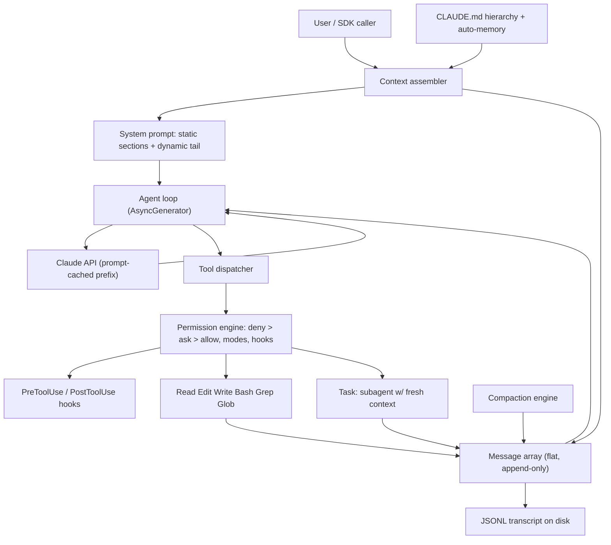

> [!info] Context
> Part of [[Harness-Internals-Overview|Harness Engineering Internals]]. Chapter: Claude Code: Reverse-Engineered Architecture. Depth level 1.

# Claude Code: Reverse-Engineered Architecture

**A note on evidence before anything else.** Claude Code is proprietary. It ships as a single minified `cli.js` bundle (~10.5 MB in v2.x), so everything we know comes from two very different evidence classes, and this chapter labels every load-bearing claim as one or the other:

- **[verified]** — officially documented: the Claude Code docs, the Agent SDK docs, Anthropic engineering posts, or on-the-record statements by the team (Boris Cherny's public posts, the Pragmatic Engineer interviews).
- **[inference]** — reverse-engineered: minified-source teardowns (karanprasad.com's 512K-line analysis, VILA-Lab's Dive-into-Claude-Code, Piebald-AI's extracted system prompts), network-trace analysis (AGIFlow), and behavioral probing (MinusX). These are credible but version-bound: minified identifiers rotate between builds, thresholds get tuned weekly, and two teardowns of different versions routinely disagree on exact numbers. Where they disagree, I show the disagreement rather than picking a winner.

This distinction is not pedantry. If you cite a "92% compaction threshold" to an Anthropic engineer in an interview, you are citing a community measurement of one build, not a design contract. Knowing which claims are contracts and which are snapshots is half of understanding this system.

## 1. Executive Overview

Claude Code is the strongest existence proof we have that an agent harness can be radically simple and still win. There is no graph engine, no workflow DSL, no vector index, no planner module. There is one loop, one flat message array as the only conversational state, a set of about a dozen file-and-shell tools, and a large amount of deterministic scaffolding around the model: permission gates, context compaction, prompt caching, hooks. VILA-Lab's teardown of v2.1.88 puts a number on the ratio: roughly 1.6% of the codebase is "AI decision logic"; the other 98.4% is deterministic infrastructure — permissions, context management, tool routing, rendering, recovery **[inference]**.

That inversion is the whole chapter in one sentence: the intelligence lives in the model; the engineering lives in everything that feeds, constrains, and audits the model. Every design decision below — agentic grep instead of embeddings, exact-string edits instead of diffs, message-level injection instead of system-prompt mutation — falls out of taking that inversion seriously.

Why it matters commercially: Claude Code launched as a research preview in February 2025, went GA in May 2025, and was widely reported to have crossed $1B in annualized revenue within months (reported figure from press coverage and the Pragmatic Engineer's interviews — treat the exact number as journalism, not an audited statement). It did this while frameworks with far more machinery (graph orchestrators, indexed-RAG editors) were the conventional wisdom. Understanding why the minimal design beat the maximal ones is the most transferable lesson in this manual.

## 2. Historical Evolution

Three generations of coding assistance preceded this design, and each one's failure explains one of Claude Code's choices.

**Generation one: autocomplete.** Copilot-style completion has no loop at all — one forward pass per keystroke burst. It can't run tests, can't read a second file, can't recover from being wrong. The model was too weak to be given agency, so the product gave it none.

**Generation two: chat plus retrieval.** When chat models got good enough to write whole functions, the bottleneck moved to context: how do you get the right 30 files out of a 30,000-file repo into a 100K-token window? The industry answer was RAG — chunk the repo, embed it, ANN-search at query time. Cursor built its product on this. It works, but it imports four permanent operational problems: the index is *stale* the moment you edit a file, it's a *security/privacy* liability (your code, embedded, sitting in an index — Anthropic's own codebase was too sensitive for that), it's *infrastructure* someone must run, and embedding similarity is the wrong relevance function for code, where you usually want exact identifiers, not "semantically similar" text.

**Generation three: orchestration frameworks.** 2023–2024's answer to multi-step tasks was to move control flow *outside* the model: LangGraph-style DAGs, state machines, role-based multi-agent systems. The premise was that models couldn't be trusted to sequence their own work, so engineers would encode the sequence in a graph. See [[Harness-Internals-Agent-Loop-Architecture]] for the full theory; the short version is that graphs freeze assumptions about task structure into code, and every model release makes those frozen assumptions more wrong.

Claude Code is the bet against both crutches at once. Boris Cherny (its creator) has said this directly about the retrieval half: early versions of Claude Code *did* use RAG with a local vector DB, and the team found that "agentic search generally works better. It is also simpler and doesn't have the same issues around security, privacy, staleness, and reliability" **[verified — Cherny, public statement]**. In the Pragmatic Engineer interview he added that agentic search "outperformed everything. By a lot, and this was surprising" **[verified — on-record interview]**. The graph half was never built at all: the product shipped as a single loop from the prototype onward, on the thesis that the model itself is the planner and the harness should be, in Anthropic's own framing from the original best-practices post, "intentionally low-level and unopinionated, providing close to raw model access without forcing specific workflows" **[verified — Anthropic engineering post, now folded into the official best-practices doc]**.

The internal codename that leaks through the reverse-engineered flags — hundreds of runtime feature flags prefixed `tengu_` **[inference — minified source]** — dates the project's DNA: this was built fast, by a small team, iterated live behind A/B flags, with reportedly ~90% of its own code written by Claude Code itself and around five releases per engineer per day **[verified — team interviews; the 90% figure is the team's own characterization]**.

## 3. First-Principles Explanation

Strip everything away and ask: what is the minimum machinery that turns a stateless text-completion API into a working software engineer?

The API takes a list of messages and returns one more message, which may contain *tool-use requests* — structured JSON saying "call Bash with `npm test`". The API does not execute anything. So the minimum harness is:

```
messages = [user_task]
loop:
    response = api(system_prompt, tools, messages)
    messages.append(response)
    if response has no tool calls: return response
    for call in response.tool_calls:
        messages.append(execute(call))
```

That is the entire control flow of Claude Code. The official Agent SDK docs describe exactly this cycle — evaluate, request tools, execute, feed results back, repeat until a response arrives with no tool calls — and one full cycle is a *turn* **[verified — Agent SDK agent-loop doc]**. MinusX's behavioral analysis confirms the runtime shape: one main thread, one flat message list, no persistent parallel branches **[inference]**; teardowns of the bundle find the loop implemented as an `AsyncGenerator` that yields messages, which gives you streaming, backpressure, and cancellation for free from the language runtime instead of from a framework **[inference — minified source; the specific minified function names community posts cite, like `nO`, rotate between builds and shouldn't be treated as stable API]**.

Now justify each abstraction from that base:

**Why is the message array the only state?** Because the model is stateless, *anything the model needs to know must be in the array anyway*. Any second state store — a task graph, an agent-scratchpad database, a "plan object" — creates a synchronization problem: the array and the store can disagree, and the model only sees the array. Claude Code refuses to create that problem. Plans live in the array as assistant text. Todos live in the array as TodoWrite tool results. Progress lives in the array as tool outputs. The array is append-only during a session and persisted as an append-only JSONL transcript on disk, which is what makes resume/fork/rewind cheap — session state is a file you can replay **[inference — VILA-Lab; the JSONL transcripts in `~/.claude/projects/` are also directly observable on any machine, so call this well-confirmed]**.

**Why tools instead of workflows?** A workflow encodes *one* path through a task. Tools encode *capabilities*, and the model composes them per-task. The tool suite is deliberately layered: `Bash` is the universal escape hatch (anything a developer can do in a shell), `Read`/`Write`/`Edit`/`Grep`/`Glob` are purpose-built versions of the most frequent shell operations — purpose-built not for capability (Bash can do all of them) but for *legibility*: structured arguments the permission system can reason about, structured outputs the model parses reliably, and behavioral contracts (Edit's read-before-write check) that raw shell can't enforce. `Task`/`Agent` (subagents) and `TodoWrite` are the only "meta" tools, and they exist for context and attention management, not for capability. See [[Harness-Internals-Tool-Calling-Internals]] for the general theory of this layering.

**Why does the harness exist at all, if the model does the thinking?** Because four jobs cannot be delegated to a probabilistic component: *safety* (the model must not be the thing that decides whether `rm -rf` runs — that's the permission engine's job), *context economics* (the model can't manage what it can't see; compaction and caching are harness jobs by construction), *determinism where users demand it* (hooks: "run eslint after every edit" must happen 100% of the time, and the docs are explicit that CLAUDE.md instructions are advisory while hooks are guaranteed **[verified]**), and *observability* (transcripts, cost accounting, permission audit trails).

## 4. Mental Models

The model experienced engineers converge on: **Claude Code is an operating system for one untrusted, brilliant process.** The LLM is the process. Tools are syscalls. The permission engine is the kernel's security boundary — and like a real kernel, it never trusts the process's own claims about what it intends. Compaction is virtual memory: when the working set exceeds physical context, the harness pages old history out through a lossy summarizer. Subagents are `fork()` with a twist: the child gets a *fresh* address space (no parent history) and returns only its exit summary. CLAUDE.md is the boot configuration. Hooks are seccomp filters. The analogy is unusually load-bearing because the failure modes transfer too: page-out loses data (compaction drops early instructions), fork is expensive (subagents re-pay system-prompt and CLAUDE.md costs), and syscall filtering is only as good as the argument parser (which is why the Bash tool carries a multi-thousand-line command parser — more below).

A second model, from MinusX's analysis and worth internalizing: **keep one main loop, maximum one branch.** Claude Code allows the loop to spawn a subagent, but the subagent runs its own flat loop and cannot spawn further nesting in the same way; results merge back as a single tool result in the parent's array **[inference — MinusX; the one-level restriction is also stated in the Task tool's own prompt text extracted by Piebald-AI]**. The team chose *debuggability of a single transcript* over the theoretical throughput of an agent swarm. When something goes wrong, there is exactly one totally-ordered history to read.

## 5. Internal Architecture

The components, and who talks to whom:



**The context assembler** builds what the API actually sees, and its central discipline is the *static/dynamic split*, driven entirely by prompt-cache economics. Anthropic's prompt caching bills cache reads at a small fraction of input price, but a cache hit requires a byte-identical prefix. So the assembly order is: system prompt (identical for every user on the same version — which lets Anthropic share the cached prefix across its entire user base **[verified — the official prompt-caching doc describes this design]**), then tool definitions, then the conversation. Anything that changes mid-session — current todos, file-freshness notices, CLAUDE.md content, hook output — is injected as **message-level content wrapped in `<system-reminder>` tags**, never spliced into the system prompt, because a system-prompt mutation would invalidate the whole cached prefix on every turn **[verified in principle in the caching doc; the specific `<system-reminder>` wrapper and its injection sites are [inference — network traces by AGIFlow and Piebald-AI's prompt extraction], and trivially observable by any SDK subagent reading its own input]**. Teardowns of one v2.x build count the assembled prompt at roughly 7 static globally-cacheable sections plus 13 dynamic per-session ones **[inference — karanprasad]**; MinusX measured the core system prompt at ~2,800 tokens with ~9,400 more of tool descriptions in an earlier build **[inference — version-bound numbers, cite the shape not the digits]**.

**The memory layers** feeding the assembler form a hierarchy, officially documented: enterprise/organization policy, then `~/.claude/CLAUDE.md` (user-global), then project-root `CLAUDE.md` (checked into git), then `CLAUDE.local.md`, with parent-directory files pulled in for monorepos and child-directory files loaded on demand when Claude touches files there; `@path` imports let one file include others **[verified — memory docs]**. Alongside the human-authored layer sits *auto-memory*: a directory Claude itself writes, with a `MEMORY.md` acting as the index and topic files hanging off it, shared across all worktrees of one repo **[verified — memory docs]**. The division of labor: CLAUDE.md is what *you* insist on; MEMORY.md is what *it* learned. [[Harness-Internals-Memory-Systems]] covers the general design space; [[Harness-Engineering-Instructions-Drawing-A-Map]] covers how to write the CLAUDE.md layer well from the operator side.

**The permission engine** sits between every model request and every execution. Officially: rules are `allow`/`deny`/`ask` patterns over tool names and arguments (`Bash(npm run lint:*)`), evaluated deny-first, layered across user/project/local settings files; *permission modes* (`default`, `acceptEdits`, `plan`, `dontAsk`, `bypassPermissions`, and the newer classifier-driven `auto`) set the disposition for anything the rules don't cover **[verified — permissions and SDK docs]**. Reverse engineering adds texture: one teardown describes a seven-stage decision cascade, and — the detail I find most instructive — a hand-rolled recursive-descent parser for Bash commands, ~4,400 lines across 23 files, that ASTs every command before rule-matching, catching command substitution, control-character smuggling, and Unicode-whitespace tricks that naive string matching would wave through **[inference — karanprasad]**. You cannot regex-match your way to shell safety; Anthropic evidently concluded the same and paid for a parser. `plan` mode is just this engine in a different disposition: reads allowed, mutations refused, so the model explores and produces a plan artifact the user approves before execution **[verified]**.

**Hooks** are the deterministic interception points: user-supplied scripts registered on lifecycle events (`PreToolUse`, `PostToolUse`, `UserPromptSubmit`, `Stop`, `PreCompact`, `SubagentStart`/`Stop`, and more). A `PreToolUse` hook receives the full tool call as JSON on stdin and can allow, deny, force an ask, or rewrite the arguments; its stdout can be injected back into context. Hooks run in the host process, outside the context window, so they cost zero tokens until they fire **[verified — hooks docs]**. This is the pressure valve that lets the core stay probabilistic: anything that must *always* happen becomes a hook instead of a prompt instruction.

**Subagents** (the `Task`/`Agent` tool) get their own section below. **The compaction engine** likewise. **The terminal UI** is architecturally irrelevant to the agent but a fun fact worth one sentence: the CLI embeds a custom React reconciler rendering to a terminal cell buffer through Yoga flex layout with frame diffing — a browser-grade UI pipeline for a TTY **[inference — karanprasad]**.

## 6. Step-by-Step Execution

Walk "fix the failing tests in auth.ts" end to end. The turn structure is from the official SDK doc **[verified]**; the assembly details in step 1 are the traced/inferred parts.

1. **Assembly.** The harness composes the request: the version-static system prompt (identity, tone rules, tool-usage policy, task-management instructions); tool schemas; then the first user message — the task text plus `<system-reminder>` blocks carrying the merged CLAUDE.md hierarchy and any startup context. Cache breakpoints are placed so the static prefix is a shared cache hit.
2. **Turn 1.** The model responds with a tool call: `Bash("npm test")`. Before execution: PreToolUse hooks fire; the permission engine parses the command, matches rules (`npm test` is typically allowlisted or approved). The command runs; stdout/stderr come back as a tool-result message appended to the array — three failures. Nothing else in the array changed; the cached prefix still hits, and the API reprocesses only the new suffix.
3. **Turn 2.** The model greps for the failing symbol, then calls `Read` on `auth.ts` and `auth.test.ts`. Both are read-only, so the dispatcher runs them concurrently — read-only tools parallelize; mutating tools serialize **[verified — SDK doc]**. The harness records file state at read time.
4. **Turn 3.** The model calls `Edit(file_path, old_string, new_string)`. The harness enforces two contracts before touching the disk: the file must have been Read this session (edits from stale memory are refused), and `old_string` must match exactly once (ambiguity is an error demanding more surrounding context) **[verified — tools reference]**. The edit lands; a PostToolUse hook might run the linter and inject its complaint. The model re-runs `npm test`; green.
5. **Final turn.** The model emits a text-only response — no tool calls — which terminates the loop by definition. The SDK yields the final assistant message and a result message carrying cost, usage, and session ID **[verified]**. The transcript JSONL on disk now contains the entire ordered history, replayable via `--resume`.

Had the session run long, one more actor would have interceded: at a context-usage threshold the compaction engine summarizes older history into a structured digest (teardowns report an 8–9-section template: files touched, errors and fixes, decisions, current work **[inference]**), splices it in place of the old messages, and emits a `compact_boundary` event **[verified that this event exists — SDK doc]**.

## 7. Implementation

If you built this yourself — and building a toy version is the single best way to internalize it — the modules fall out cleanly:

```python
class Harness:
    def __init__(self, cfg):
        self.messages: list[Message] = []          # THE state
        self.tools = ToolRegistry(cfg)             # schemas + executors
        self.perms = PermissionEngine(cfg.rules, cfg.mode)
        self.hooks = HookBus(cfg.hooks)
        self.static_prefix = build_system_prompt(cfg)  # never mutate mid-session

    async def run(self, task: str):
        self.messages.append(user(task, reminders=self.gather_context()))
        while True:
            if self.context_used() > COMPACT_AT:
                self.messages = compact(self.messages)   # summarizer call
            resp = await api(self.static_prefix, self.tools.schemas,
                             self.messages, cache_prefix=True)
            self.messages.append(resp)
            calls = resp.tool_calls
            if not calls:
                return resp                                # loop exit condition
            results = await self.dispatch(calls)           # perms+hooks inside
            self.messages.append(user_results(results))
```

The subtleties that separate a toy from the real thing:

- **Dispatch policy.** Partition each turn's calls into read-only (run concurrently, bounded) and mutating (run in request order, serially). This is a correctness rule, not an optimization — two concurrent Edits to one file is a lost-update bug.
- **Errors are messages.** A denied permission, a failed Edit match, a timed-out Bash command — all of them become tool-result messages, because the model's recovery ability is the error handler. Your job is to make error strings *instructive* ("old_string matched 3 locations; include more surrounding lines"), since that string is the only debugging information the model gets.
- **Context injection discipline.** Never rewrite history and never touch the static prefix mid-session. New information (todo state, hook output, freshness warnings) enters as appended message content in a recognizable wrapper. This one rule preserves both cache hits and transcript auditability.
- **Subagent IPC.** In-process, a subagent is just a recursive `Harness` with a fresh `messages` list whose return value becomes a tool result. Claude Code's real multi-session coordination (agent teams / parallel sessions) has been observed using a file-based mailbox under `~/.claude/` polled at short intervals rather than sockets **[inference — karanprasad; note this describes one build's cross-process layer, not the ordinary in-session Task tool]**. Files-as-IPC is a deliberate simplicity trade: crash-tolerant, inspectable with `ls`, no daemon — at the cost of polling latency and documented race windows.
- **Persistence.** Append every message to a JSONL transcript synchronously. Resume is "load file, replay array." Fork is "copy file." Rewind is "truncate at checkpoint" (Claude Code additionally snapshots files Claude changed so code state can rewind with conversation state **[verified — checkpointing docs]**). This is [[Harness-Engineering-State-Persistence]] implemented at the harness layer instead of the operator layer.

## 8. Design Decisions

**The no-RAG decision — agentic search over an embedding index.** The most interviewed design choice in this space, so get it exactly right. What Claude Code does: no index of any kind. It searches the repo the way you would — `Grep` (vendored ripgrep binaries ship inside the bundle **[inference — bundle inspection]**), `Glob`, directory listing, then `Read` of candidates, iteratively: grep → read → follow the import → grep again. Why it wins for code: (a) code retrieval is dominated by *exact-identifier* queries where lexical match is strictly better than embedding similarity; (b) it is *never stale* — it reads the file that exists right now, mid-refactor; (c) *zero infrastructure and zero exfiltration* — nothing embedded, nothing uploaded, which Cherny explicitly lists (security, privacy, staleness, reliability) **[verified]**; (d) it is *self-correcting* — a bad grep returns nothing, the model observes that and reformulates, whereas a bad ANN lookup returns confidently wrong chunks the model can't distinguish from good ones. What it costs: multiple model round-trips (latency and tokens) where a vector lookup is one cheap query, and weaker performance on purely conceptual queries ("where do we handle money?") in unfamiliar vocabularies. The honest summary: agentic search trades *per-query cost* for *correctness and zero ops*, and the trade got better every time models got faster and cheaper — which is why betting on it was really a bet on the model-improvement curve. Cursor made the opposite bet for interactive-latency reasons and maintains embedding indexes; both are coherent, they just optimize different constraints.

**Edit's exact-string-match contract.** Alternatives existed: unified diffs (Codex's direction — see [[Harness-Internals-Codex-Architecture]]), line-number addressing, whole-file rewrites. Claude Code chose `old_string → new_string` with two hard rules: match exactly once, and Read before Edit. The design forces the model to *prove it has current knowledge of the file*: you cannot produce a byte-exact `old_string` including whitespace from a hallucinated memory of the file, and the read-before-edit gate blocks edits from stale recall outright **[verified — tools reference documents both constraints]**. Line numbers were rejected because they're invalidated by every preceding edit; whole-file rewrites burn output tokens and non-deterministically mangle untouched regions; diffs are compact but a malformed hunk fails opaquely, while a failed exact-match fails with an explanation the model can act on. The hidden cost is real: whitespace-sensitive failures and multi-match errors on repetitive code are the tool's signature annoyances, and the harness accepts that failure rate to keep the "prove you read it" property.

**Flat loop over graph engine.** Compressed, since [[Harness-Internals-Agent-Loop-Architecture]] carries the full argument: a graph encodes the *designer's* task decomposition at framework-authoring time; a loop lets the *model* decompose at runtime. Graphs add framework surface (nodes, edges, state reducers, checkpointers) that must be learned, versioned, and debugged, and their value proposition — "the model can't be trusted to sequence work" — depreciates with every model release. Claude Code's counter-position: put sequencing in the model, put *guarantees* in deterministic rails (permissions, hooks) orthogonal to control flow. What the loop genuinely gives up: statically analyzable workflows, per-node retry semantics, and cheap resumability at arbitrary graph nodes — which is why graph engines persist in regulated back-office automation where the workflow *is* the spec, and why the flat loop wins where the task distribution is open-ended, like software engineering.

**Subagents as context firewalls, not an org chart.** A Task-spawned subagent inherits the system prompt and project context but *none* of the parent's message history; only its final message returns to the parent **[verified — SDK subagents doc]**. The design goal is context economics: a research subagent can burn 80K tokens reading files and return a 500-token conclusion, so the parent pays 500, not 80K. It is explicitly not a communicating multi-agent society — subagents don't message each other mid-flight; results merge only through the parent's array. Compare Cognition's "don't build multi-agent" argument: fragmented context produces incoherent action. Claude Code threads that needle by allowing parallelism only where contexts *should* be disjoint (read-only research, verification) and keeping one writer.

**TodoWrite as attention engineering.** The todo tool mutates no files and executes nothing; its entire function is to write the plan *into the message array* and re-surface it via reminders so attention over a long session keeps re-anchoring on the plan. It's a fix for a transformer failure mode (long-context drift), implemented as a tool. That's harness thinking in miniature.

## 9. Failure Modes

- **Compaction amnesia.** Compaction replaces old messages with a summary; instructions given early in-conversation may simply not survive. The docs say so plainly and give the mitigation: persistent rules belong in CLAUDE.md, which is re-injected every request, not in turn-1 prompt text **[verified]**. Operators also steer the summarizer itself — a CLAUDE.md section telling the compactor what to preserve is honored **[verified — SDK doc]**. Debug signal: the agent suddenly "forgets" a constraint right after a `compact_boundary` event.
- **Context rot before compaction.** Performance degrades as the window fills — the official best-practices doc treats this as *the* central constraint. Symptom: rising correction frequency deep in a session. The sanctioned fixes are operator moves: `/clear` between tasks, subagents for exploration, `/compact <instructions>` at natural boundaries. See [[Harness-Engineering-Hub]] for the operator-side discipline.
- **Edit thrash.** Whitespace mismatch or non-unique `old_string` produces repeated failed edits; each failure appends more context, accelerating rot. Well-built error messages break the loop by telling the model to widen its match; the pathological version is the model falling back to Write (whole-file overwrite), which destroys unrelated concurrent edits — a reason the read-before-write freshness check also guards Write.
- **Grep's blind spots.** Agentic search inherits lexical search's weaknesses: dynamically dispatched call sites, string-built identifiers, reflection, and cross-language boundaries won't literal-match. The model usually compensates by reading structure (routing tables, DI configs), but on conceptual queries in unfamiliar naming conventions, an embedding index would genuinely have helped. Know this when asked "when does no-RAG lose?"
- **Permission fatigue → rubber-stamping.** The default mode's security model assumes a human actually reviews prompts; after the tenth prompt they don't (the best-practices doc admits this verbatim). The system's answers are graduated: allowlists for known-safe patterns, the `auto` classifier mode, OS-level sandboxing so approval isn't the only wall — see [[Harness-Internals-Guardrails-Sandboxing]].
- **Prompt injection through tool output.** Everything a tool returns enters the model's context: a README, a web page, a test fixture can carry adversarial instructions. The layered response — deny-first permission rules the model can't override, hooks, the Bash AST parser, sandboxing — exists precisely because the model itself is inside the blast radius and can't be the last line of defense.
- **Concurrency races.** The in-session dispatcher serializes mutations, but the cross-process coordination layer (file mailboxes, polling) has documented race windows — one teardown counts 13, including privilege-escalation vectors, in the build it analyzed **[inference — karanprasad; version-bound]**. Files-as-IPC without locking is a known trade, not an oversight, but it's a real attack/failure surface.

## 10. Production Engineering

**Anthropic's own operation** **[verified — team interviews unless noted]**: TypeScript, React+Ink terminal UI, Bun; ~90% of Claude Code's code written by Claude Code; on the order of five releases per engineer per day, gated by hundreds of runtime flags (`tengu_*` **[inference]**) via A/B testing. The cardinal product rule per the team: nothing changes your system without permission. The economics run on two levers: the version-identical system prompt makes the cached prefix shareable across *all* users — Anthropic computes it once per version, and every session everywhere hits it **[verified — prompt-caching doc describes this]** — and cheap-model offloading: behavioral analysis found the majority of LLM calls in a session go to Haiku-class models for file summarization, bash-output condensation, conversation titles, and similar glue **[inference — MinusX measured >50% in one build]**.

**The compaction pipeline in production** is more graduated than "one threshold": teardowns describe an escalation ladder — time-based micro-compaction, cached-prefix-preserving trims, reactive truncation on `prompt_too_long`, full narrative summarization, session reset as last resort **[inference — karanprasad's six tiers / VILA-Lab's five stages; the two teardowns even segment it differently, which tells you it's internal, tuned, and version-fluid]**. Reported auto-compact trigger points range across 80–95% of the window depending on source and build; an env override (`CLAUDE_AUTOCOMPACT_PCT_OVERRIDE`) exists for operators **[inference/community-documented]**. Cite the *shape* (graduated escalation, summarize-and-splice, boundary event) as fact and the percentages as snapshots.

**Contrast with the neighbors.** Cursor: embedding index maintained per-repo, retrieval at interactive latency, plus agentic tools layered on top — infrastructure cost accepted to make sub-second context assembly possible in an IDE. OpenAI Codex: same flat-loop family but different contracts — Rust CLI, diff-based patching, sandbox-first execution posture ([[Harness-Internals-Codex-Architecture]]). Devin/Cognition: heavier planning layer and VM-lifetime sessions. The convergence across all of them — loop + tools + compaction + permissions, no graph — is the strongest industry signal in this manual: four independent teams with different constraints landed on the same skeleton, differing mainly in *contracts* (edit format, sandbox default, retrieval strategy), not *architecture*.

## 11. Performance

The performance story is cache-first, and it explains otherwise-odd choices.

**Prefix caching dominates.** Input reprocessing is the cost center of a loop that resends the whole array every turn; cached tokens are billed at a small fraction of fresh ones and skip prefill compute. Hence: static system prompt, byte-stable across turns; dynamic content appended, never prepended or spliced; `<system-reminder>` injection at message level specifically so the prefix survives. Every architectural layer bows to this: even compaction has a prefix-preserving trim tier before it resorts to full rewrites **[inference]**, because a full rewrite invalidates the cache and repays prefill for the entire history once.

**Token diet.** Tool outputs are the other cost center — a verbose test run can be tens of thousands of tokens. Mitigations in the stack: Haiku-class summarization of large bash outputs before they enter context **[inference — weaxsey]**, read limits/offsets on the Read tool, deferred loading of MCP tool schemas via tool search so a fat server doesn't tax every request **[verified — SDK docs]**, and subagents as the blunt instrument: exploration happens in a context the parent never pays for.

**Latency.** Agentic search costs multiple serial model round-trips where an index costs one lookup; Claude Code buys some of it back with parallel read-only tool execution within a turn **[verified]** and lower reasoning effort on trivial calls (the SDK exposes `effort` per session and per subagent **[verified]**). The remaining latency is a deliberate product position: Claude Code optimizes for *delegated sessions* (minutes of autonomy, correctness at the end) rather than *interactive completion* (sub-second), which is exactly the axis on which it and Cursor made opposite retrieval bets.

**Scale-out** is horizontal and shameless: parallel sessions via git worktrees, headless `claude -p` fan-out over thousands of files with scoped `--allowedTools`, writer/reviewer session pairs **[verified — best-practices doc]**. The flat loop makes this trivially safe to parallelize at the *session* level precisely because sessions share nothing but the filesystem.

## 12. Best Practices

For builders extracting lessons (operator-side practice lives in [[Harness-Engineering-Hub]]):

- **Sort your context by volatility.** Immutable identity → per-version config → per-session config → per-turn state, in that order, with cache breakpoints between. This single habit is most of [[Harness-Internals-Context-Compilation]].
- **Make tool contracts do epistemic work.** Edit's exact-match rule isn't ergonomics, it's a *proof obligation* — the tool's input format is designed so that only a model with true current knowledge can produce valid input. Ask of every tool you design: what does a valid call prove the model knows?
- **Write error messages for the model.** Every tool failure string is a prompt. "Match failed" teaches nothing; "matched 3 times, add surrounding lines" converts a retry loop into a one-shot fix.
- **Advisory vs. guaranteed is a hard line.** Prompt instructions (CLAUDE.md) for preferences; hooks for invariants. If violating it would page someone, it's a hook.
- **Anti-patterns**, all observed in the wild: mutating the system prompt mid-session (cache torched every turn); bloated CLAUDE.md (the official docs warn that overlong files cause instruction *loss*, not just cost); letting exploration run in the main context instead of a subagent; trusting string-matching to secure shell access (Anthropic wrote a parser; so should you); adding a graph engine because the demo looked disorganized — the disorganization was a prompting problem.

## 13. Common Misconceptions

**"Claude Code indexes my codebase."** No — nothing is embedded, uploaded, or pre-scanned; every search is a live ripgrep at question-time. Tempting because every previous code tool *did* index, and because people can't believe grep-in-a-loop outperforms a vector DB. It does, for code, for the exact-match and freshness reasons in §8 — and the team tried RAG first and removed it **[verified]**.

**"`<system-reminder>` blocks are part of the system prompt."** They're user-message content. The name misleads. The distinction matters practically: system-prompt content is version-static and cache-shared; reminders are the *dynamic* channel, and understanding that split is understanding the caching design.

**"Compaction is lossless."** It's a lossy model-written summary. Anything not in CLAUDE.md or re-derivable from disk can vanish at the boundary. Design sessions assuming everything before the last compaction is *probabilistically* remembered.

**"Subagents make it a multi-agent system."** Subagents share no live state, don't talk to each other, and return one message. It's `fork/join` for context isolation, not a society of agents. Calling it multi-agent leads people to expect (and build) coordination machinery it deliberately lacks.

**"The harness is thin, so it's trivial."** The *decision layer* is thin. The deterministic shell — permission cascade, shell parser, compaction ladder, cache-aware assembly, transcript persistence — is the overwhelming majority of the code **[inference — the 98.4% figure]** and is where all the hard engineering lives. "Simple architecture" and "small engineering effort" are different claims; only the first is true.

## 14. Interview-Level Discussion

**Q1: Why did agentic search beat embeddings for Claude Code, and where does that result *not* transfer?**
It won on the four axes Cherny named — simplicity, security/privacy, staleness, reliability — plus two structural ones: code queries are exact-identifier-dominated (lexical > semantic there), and iterative search is self-correcting where one-shot ANN retrieval is not; empty grep results are informative, wrong chunks are poison. It doesn't transfer when (a) latency budget is interactive — you can't grep-loop in 200ms, which is Cursor's constraint; (b) the corpus isn't lexically navigable — millions of prose documents with no directory structure or naming conventions to exploit; (c) queries are genuinely semantic in foreign vocabulary. The deepest framing: agentic search converts retrieval from an infrastructure problem into a model-capability problem, which is exactly the kind of problem that improves for free every model generation.

**Q2: Defend the Edit tool's exact-string contract against unified diffs.**
Diffs are more compact and handle multi-hunk edits in one call — that's real, and Codex went that way. Exact-match buys three things diffs don't: a *proof-of-freshness* obligation (byte-exact `old_string` + read-before-edit gate means edits from hallucinated file state get structurally rejected, not silently applied); *legible failure* (a mismatch names its cause; a misapplied hunk corrupts silently or fails opaquely); and *format robustness* (models emit malformed diff syntax at a nonzero rate; two literal strings have no syntax to get wrong). Cost: verbosity and whitespace fragility. The choice reveals a priority: fail loudly on stale knowledge over edit-format efficiency.

**Q3: The message array is the only state. What breaks first as sessions scale, and what's the mitigation stack?**
Attention quality breaks before capacity does — context rot degrades instruction-following well below the window limit **[verified that the docs treat this as the central constraint]**. Mitigation stack, in escalation order: token diet (output summarization, read limits, deferred schemas), attention re-anchoring (TodoWrite reminders), context firewalls (subagents), lossy paging (the compaction ladder), and finally durable-state relocation — moving what must survive out of the array into CLAUDE.md/MEMORY.md/files-on-disk, which is re-injected or re-readable rather than remembered. Notice the pattern: every tier moves information from "attended tokens" to "retrievable on demand."

**Q4: Where does determinism live in a system whose controller is probabilistic?**
Three orthogonal rails, all outside the model's authority: the permission engine (deny-first rules the model cannot rewrite, argument-level parsing so intent claims don't matter), hooks (user code at lifecycle points, able to block/rewrite calls, guaranteed to run), and sandboxing (OS-level walls that hold even if the first two are socially engineered). The design principle: never implement a *guarantee* as a prompt instruction; prompts set the distribution's mean, rails clip its tails. That separation — model proposes, deterministic shell disposes — is the load-bearing safety idea, and it's why the harness can afford a free-running loop at all.

**Q5: Your teammate wants to rebuild Claude Code on a graph framework "for reliability." Steelman, then rebut.**
Steelman: graphs give typed state, per-node retries, resumable checkpoints, statically reviewable flow — auditors and SLA-holders love them, and for fixed workflows (document pipeline, refund flow) they're genuinely right. Rebuttal for the coding domain: task structure is unknowable at design time — the graph either grows an edge per contingency (a hand-rolled, worse model of Claude's own reasoning) or funnels everything through generic nodes (a loop with extra steps). Reliability empirically came from elsewhere: tool contracts, permission rails, verification loops, context hygiene — none require a graph. And graphs freeze the harness against the model curve, which was the losing side of every bet in this space since 2023. Reliability is a property of the *rails*, not the *routing*.

**Q6: Why do system-reminders exist instead of just updating the system prompt each turn?**
Cache arithmetic. The prefix is only reusable if byte-identical; a single mutated character in the system prompt reprices the entire history at fresh-input rates and re-pays prefill latency, every turn. Appending dynamic state as message content keeps the prefix stable, so each turn pays only for its true delta. Secondary wins: the transcript stays append-only (auditability, replay), and Anthropic gets fleet-wide cache sharing because the prompt is user-invariant per version. It's the clearest case in the system of an economic constraint dictating an architectural pattern.

## 15. Advanced Topics

**Classifier-in-the-loop permissions.** `auto` mode replaces both static rules and human clicks with a fast model judging each command for scope escalation and hostile-content-driven action **[verified — permission-modes docs]**. This is safety migrating from rules to models — with the fallback ladder (consecutive-denial thresholds drop to manual **[inference]**) acknowledging classifiers fail. Expect this pattern (cheap guard model wrapping expensive actor model) to generalize across harnesses.

**Model–harness co-evolution.** The harness increasingly assumes model behaviors (interleaved thinking between tool calls, native tool-search competence), and models are trained against harness-shaped environments. The open question: does the harness eventually compile *into* the model — tools and permission-awareness as trained reflexes — leaving only the deterministic rails outside? The 98.4% figure suggests the rails are the durable part.

**Compaction vs. million-token windows.** Long contexts don't kill compaction; attention degradation and quadratic-ish cost mean *selective* context beats *maximal* context even when capacity is free. The research frontier is smarter forgetting: learned salience over transcript spans instead of one narrative summary.

**Memory consolidation.** Auto-memory (MEMORY.md + topic files) is early-stage: current behavior is append-and-index. Open problems are the classic memory-systems ones — contradiction resolution, decay, promotion from episodic (transcript) to semantic (MEMORY.md) — covered in [[Harness-Internals-Memory-Systems]].

**Agent teams and cross-session coordination.** Shared task lists, inter-session messaging, a lead session **[verified that the feature exists]** — the harness inching from fork/join toward genuine concurrency, with the file-mailbox substrate's race windows as the engineering debt to watch **[inference]**.

## 16. Glossary

- **Agent loop / turn**: the evaluate → tool-call → execute → feed-back cycle; a turn is one full cycle; the loop exits on a response with no tool calls.
- **Agentic search**: retrieval by iterative tool use (grep/glob/read) at question-time; no pre-built index.
- **Auto-compaction**: harness-initiated lossy summarization of older messages near a context-usage threshold, marked by a `compact_boundary` event.
- **Auto-memory / MEMORY.md**: directory of notes Claude writes for itself across sessions; MEMORY.md is its index.
- **CLAUDE.md hierarchy**: layered instruction files (enterprise → user → project → local → subdirectory) merged into every session's context.
- **Hook**: user-supplied script bound to a lifecycle event (PreToolUse, Stop, PreCompact…); deterministic, runs outside the context window, can block or rewrite tool calls.
- **Permission mode**: session-wide disposition for uncovered tool calls: default, acceptEdits, plan, dontAsk, auto, bypassPermissions.
- **Plan mode**: permission disposition allowing reads but refusing mutations; produces a user-approved plan before execution.
- **Prompt-cache prefix**: the byte-identical leading portion of a request (system prompt, tools, stable history) billed at reduced rates; the static/dynamic split exists to protect it.
- **Static/dynamic split**: assembly discipline placing version-stable content first and per-turn state last (as message content), preserving cache hits.
- **Subagent (Task tool)**: child loop with fresh message history inheriting system prompt and project context; returns only its final message to the parent.
- **`<system-reminder>`**: XML wrapper for dynamic context injected into *user messages* (CLAUDE.md content, todo state, hook output) — message-level, not system-prompt-level.
- **TodoWrite**: no-op-on-disk tool whose sole effect is writing plan state into the message array to re-anchor attention.

## 17. References

- **How the agent loop works — Claude Code / Agent SDK docs** (https://code.claude.com/docs/en/agent-sdk/agent-loop) — The canonical, official description of the loop, turns, message types, tool permissioning, compaction behavior, and hooks. Read first; it's the ground truth everything else is measured against.
- **Best practices for Claude Code — official docs** (https://code.claude.com/docs/en/best-practices; the original anthropic.com/engineering post redirects here) — The design philosophy in Anthropic's own words: context as the central constraint, verification loops, CLAUDE.md discipline, permission strategy, headless fan-out. Read to understand what the *builders* think the system is for.
- **Boris Cherny on dropping RAG** (https://x.com/bcherny/status/2017824286489383315) and **Building Claude Code with Boris Cherny — Pragmatic Engineer** (https://newsletter.pragmaticengineer.com/p/building-claude-code-with-boris-cherny) — Primary-source record of the no-RAG decision and the team's operating model (90% self-written code, release cadence). Read before any interview touching agentic search.
- **How Claude Code Actually Works: Reverse-Engineering 512K Lines — Karan Prasad** (https://karanprasad.com/blog/how-claude-code-actually-works-reverse-engineering-512k-lines) — The deepest single minified-source teardown: permission cascade, Bash AST parser, compaction tiers, IPC mailboxes, prompt-section counts. Read for texture; remember every number is version-bound.
- **Dive into Claude Code — VILA-Lab** (https://github.com/VILA-Lab/Dive-into-Claude-Code) — Structured academic-style teardown of v2.1.88: the 1.6%/98.4% split, seven safety layers, five-stage compaction, JSONL persistence. Read as the systematic cross-check on the blog-post teardowns.
- **Decoding Claude Code — MinusX** (https://minusx.ai/blog/decoding-claude-code/) — Behavioral analysis that popularized "one main loop, flat message list, max one branch" and measured Haiku offloading and prompt sizes. Read for the mental model; it's the analysis practitioners quote most.
- **Claude Code prompt augmentation — AGIFlow** (https://agiflow.io/blog/claude-code-internals-reverse-engineering-prompt-augmentation) — Network-trace analysis of the six injection mechanisms and the `<system-reminder>` wrapper, with per-mechanism context-cost accounting. Read when designing your own injection layer.
- **Claude Code system prompts — Piebald-AI** (https://github.com/Piebald-AI/claude-code-system-prompts) — Extracted, versioned copies of the actual system prompt and all tool descriptions. Read the Edit and Task tool texts verbatim; tool descriptions are the harness's real API documentation.
- **Claude Code internals analysis — weaxsey.org** (https://weaxsey.org/en/articles/2025-10-12/) — Complementary teardown covering Haiku-powered summarization paths, the compact summary template, and subagent/model allocation tables.
- **How Claude Code memory works — official docs** (https://code.claude.com/docs/en/memory) — CLAUDE.md hierarchy, imports, and auto-memory/MEMORY.md, officially specified. Read alongside [[Harness-Internals-Memory-Systems]].

## 18. Subtopics for Further Deep Dive

### The No-RAG Decision: Agentic Search vs. Embedding Indexes
- **Slug**: Claude-Code-Agentic-Search-vs-RAG
- **Why it deserves a deep dive**: The single most interviewed design choice in agent harness engineering; deserves a full treatment with benchmark evidence, Cursor's counter-position, and the exact boundary conditions where each wins.
- **Has enough depth for a full chapter**: yes
- **Key questions to answer**: What does the iterative grep→read policy actually look like as a search algorithm, and what's its token/latency cost curve? Where do embedding indexes still win measurably (corpus shape, latency budget, query type)? How do hybrid designs (lexical-first with semantic fallback) perform?

### System Prompt Assembly and Prompt-Cache Economics
- **Slug**: Claude-Code-Prompt-Assembly-and-Caching
- **Why it deserves a deep dive**: The static/dynamic split is the clearest case of billing mechanics dictating architecture, and the fleet-wide shared-prefix design is unique among harnesses.
- **Has enough depth for a full chapter**: yes
- **Key questions to answer**: Exactly where do cache breakpoints sit relative to MCP/tool/CLAUDE.md content and why? How much does one mid-session prefix mutation cost in dollars and latency at realistic transcript sizes? How do system-reminder injection sites trade cache safety against instruction salience?

### The Compaction Ladder: Graduated Context Reclamation
- **Slug**: Claude-Code-Compaction-Pipeline
- **Why it deserves a deep dive**: Teardowns disagree on tier counts and thresholds, which means the real design (graduated escalation from trims to narrative rewrite to reset) has never been cleanly documented in one place.
- **Has enough depth for a full chapter**: yes
- **Key questions to answer**: What are the observable tiers and their triggers across versions? What does the summarization template preserve vs. drop, measured empirically? How should operators steer it (CLAUDE.md compaction instructions, PreCompact hooks, partial rewind-summarize)?

### The Permission Pipeline and the Bash AST Parser
- **Slug**: Claude-Code-Permission-Pipeline
- **Why it deserves a deep dive**: The deny-first cascade, rule syntax, mode spectrum, classifier-driven auto mode, and a 4,000-line hand-rolled shell parser together form the most serious deterministic-safety layer shipped in any harness.
- **Has enough depth for a full chapter**: yes
- **Key questions to answer**: How does argument-level rule matching survive shell metacharacter attacks (substitution, Unicode whitespace, chaining)? Where does the auto-mode classifier sit in the cascade and what are its fallback thresholds? How do hooks, rules, modes, and sandboxing compose when they conflict?

### Subagent Isolation and Cross-Session Coordination
- **Slug**: Claude-Code-Subagent-Isolation-and-IPC
- **Why it deserves a deep dive**: The fork/join context-firewall model, sidechain transcripts, worktree/remote isolation modes, and the file-mailbox coordination layer (with its documented race windows) are a self-contained distributed-systems story.
- **Has enough depth for a full chapter**: yes
- **Key questions to answer**: What exactly does a subagent inherit vs. not, and how are its transcripts persisted relative to the parent? How do agent teams coordinate through the filesystem, and which race conditions matter in practice? When does worktree or remote isolation beat in-process forking?
