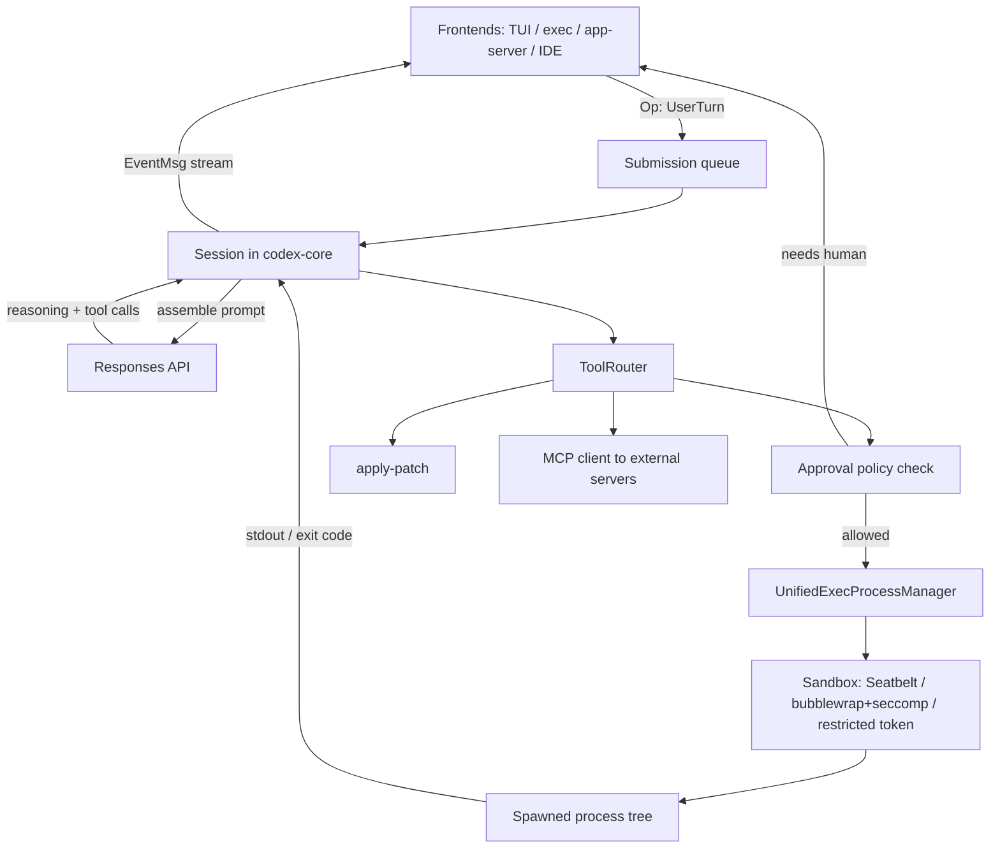

> [!info] Context
> Part of [[Harness-Internals-Overview|Harness Engineering Internals]]. Chapter: OpenAI Codex — Execution Model, Kernel-Level Sandboxing, and the Rust Runtime. Depth level 1.

# OpenAI Codex: Execution Model, Kernel-Level Sandboxing, and the Rust Runtime

**Epistemic note before anything else.** Codex is the one major harness you can actually read. The CLI is open source at [github.com/openai/codex](https://github.com/openai/codex), so most claims in this chapter are checkable against real Rust code. Codex *cloud* is proprietary infrastructure — everything about it here comes from OpenAI's official docs and blog posts plus observable behavior. Throughout, claims are labeled: **(source-verified)** for things in the repo, **(documented)** for official OpenAI statements, **(community analysis)** for third-party source reads I could not independently line-verify, and **(inference)** for reasoning from observed behavior.

## 1. Executive Overview

Codex is OpenAI's coding agent, shipped as three surfaces over one engine: a terminal CLI, IDE extensions, and a cloud service that runs tasks in disposable containers. As a harness case study it matters for two reasons that no other major agent gives you.

First, it is the only frontier-lab harness whose full agent loop, tool dispatch, and sandbox implementation are public. When this manual says "harnesses assemble prompts in layers" or "tool calls spawn sandboxed process trees," Codex is where you can open the file and watch it happen.

Second, Codex made the opposite security bet from Claude Code, and the contrast is the single most instructive design disagreement in the harness space. Claude Code governs agent behavior in the *application layer* — permission prompts, allowlists, hooks that run before tools execute. Codex governs it in the *kernel*: every shell command the model requests is spawned inside an OS-enforced sandbox (Seatbelt on macOS, Landlock + seccomp on Linux, restricted tokens on Windows) that makes disallowed writes and network calls fail at the syscall level, no matter what the model says or how it was prompted. One system trusts a correctly configured policy engine sitting in front of the model; the other assumes the model's output is adversarial and makes the dangerous thing physically impossible. Neither is strictly better — the trade-offs are the meat of this chapter.

The third thread is the runtime itself: Codex was born in TypeScript and rewritten in Rust, and the stated reasons — GC pauses in a long-running agent process, runtime-dependency friction, and the need for first-class kernel sandbox bindings — are a compressed lesson in what an agent harness actually demands from its host language.

## 2. Historical Evolution

The name "Codex" has been used twice, and conflating the two eras is a common mistake. The 2021 Codex was a *model* — the GPT-3 descendant fine-tuned on code that powered the original GitHub Copilot. It was deprecated in 2023. The 2025 Codex is a *product*: an agent harness wrapped around OpenAI's reasoning models. This chapter is entirely about the second one.

The 2025 timeline compresses the whole industry's harness learning curve into about a year:

**April 2025 — CLI v1, TypeScript.** The first Codex CLI was a Node.js application with a React-based terminal UI (Ink). TypeScript was the right call for iteration speed — the team was discovering what a coding agent even was, and shipping UI experiments daily.

**May 2025 — Codex cloud.** Announced alongside codex-1 (a fine-tune of o3 for software engineering), the cloud product ran each task in its own container, preloaded with your repo, and pushed results back as pull requests. This established the container-per-task pattern the industry later converged on.

**May 30, 2025 — "Codex CLI is Going Native."** OpenAI maintainer @fouad-openai announced the Rust rewrite in GitHub discussion #1174 **(documented)**, giving four reasons: zero-dependency install ("currently Node v22+ is required, which is frustrating or a blocker for some users"), native security bindings (they were *already* shipping Rust for Linux sandboxing and bridging to it through FFI shims), optimized performance ("no runtime garbage collection, resulting in lower memory consumption"), and an extensible wire protocol so TypeScript, Python, and other languages could drive the agent without reimplementing it.

**Late 2025 onward — Rust becomes the product.** By early 2026 roughly 95% of the codebase was Rust **(source-verified — the repo language stats)**. The remaining TypeScript is a thin npm shim (`codex-cli/bin/codex.js`) that resolves your platform and spawns the right prebuilt Rust binary **(community analysis — agent-safehouse investigation)**.

Why did TypeScript become insufficient rather than merely inelegant? Three concrete pressures. A long agentic session accumulates hundreds of megabytes of conversation state, streamed deltas, and process buffers; V8's garbage collector pauses are unpredictable, and a GC pause landing mid-stream visibly stutters token rendering and, worse, adds jitter to timing-sensitive PTY interaction. Second, kernel sandboxing APIs — Seatbelt profile spawning, Landlock rulesets, seccomp BPF filters — are C-level interfaces; in Node they lived behind fragile native add-ons, while in Rust they are ordinary memory-safe dependencies. Third, `codex exec` in CI wants millisecond startup because pipelines fan out dozens of agent invocations; Node's runtime boot cost is paid on every one.

> [!tip] The generalizable lesson
> The harness rewrite wasn't about making the *model* faster — inference dominates wall-clock time regardless. It was about the harness being a **long-running, latency-sensitive, security-critical systems program**, which is a different genre of software than the CRUD tooling TypeScript excels at. Every major harness team hits this fork; Codex just documented its choice publicly.

## 3. First-Principles Explanation

Strip Codex to its irreducible problem: a language model emits text; some of that text is a request to run a shell command on your machine; the model's output is influenced by everything in its context — including files in the repo it's reading, which may contain instructions planted by an attacker. So the harness must execute *commands generated by a process that can be manipulated by untrusted input*. That is, precisely, the threat model of a web browser executing JavaScript from arbitrary sites.

Once you frame it that way, the design space has exactly two families of answers, and Codex uses both, composed:

**Answer one: make dangerous actions require a human.** Before running a command, pause and ask. This is an *approval policy*. It's flexible and legible, but it has a fatal failure mode at scale: approval fatigue. A human who has clicked "yes" forty times in an hour stops reading the prompts. The security boundary silently degrades to nothing.

**Answer two: make dangerous actions impossible.** Don't ask whether `curl evil.com` should run — spawn it in an environment where the `connect()` syscall returns `EPERM`. This is a *sandbox*. It doesn't degrade with fatigue and doesn't care how clever the prompt injection was, because enforcement happens below the level where the model's text has any authority. Its cost is bluntness: the kernel can't distinguish "malicious network call" from "npm install," so legitimate work gets blocked too.

Codex's core architectural insight is that these are *orthogonal dials*, not alternatives. The **sandbox mode** defines what is physically possible without asking anyone: `read-only` (inspect files, run nothing mutating), `workspace-write` (edit files and run commands, but writes confined to the workspace and network disabled), or `danger-full-access` (no OS restrictions). The **approval policy** defines when the agent may *escalate beyond* the sandbox by asking the human: `untrusted` (ask for anything outside a small trusted set), `on-request` (the default — run freely inside the sandbox, ask to exceed it), `on-failure` (try sandboxed first; if the command fails in a way that smells like a sandbox denial, offer to rerun unsandboxed), and `never` (never ask; sandbox denials are final) **(documented — developers.openai.com/codex/concepts/sandboxing)**.

The composition is the trust model. `workspace-write` + `on-request` means: the agent works autonomously inside a kernel-enforced cage, and the human is only interrupted for cage-exceeding requests — so every approval prompt is *meaningful*, which is what keeps humans actually reading them. `read-only` + `never` is a safe unattended auditor. `danger-full-access` + `never` is full autonomy, sane only inside an already-isolated container — which is exactly what Codex cloud does, moving the boundary from the kernel to the container wall.

The same first-principles pressure explains the Rust runtime (a process that must never pause mid-stream and must speak kernel APIs natively) and the prompt-assembly discipline (an agent loop that replays its whole history every turn lives or dies by prefix caching — Section 11). Everything downstream in this chapter is these three forces — adversarial execution, human attention as a scarce resource, and replay economics — playing out in code.

## 4. Mental Models

**The model is an untrusted process.** This is the load-bearing model for all of Codex's security design. Don't think "my AI assistant"; think "a browser tab running third-party JavaScript." You don't secure a browser tab by asking it to promise good behavior in its system prompt — you give it a renderer sandbox. Codex applies the same reasoning: prompt-level guardrails are UX, the kernel is the boundary.

**Two dials: CAN vs. MAY-WITH-PERMISSION.** Sandbox mode is what *can* happen without a human; approval policy is what *may* happen with one. Every confusing Codex configuration question resolves instantly once you separate the dials. "Why did it ask me even in workspace-write?" — because the command needed something outside the cage (network, a path outside the workspace) and the policy was `on-request`.

**The conversation is an append-only ledger.** Codex never edits history mid-session; it only appends. This isn't tidiness — it's economics. Prompt caching works on exact byte prefixes, so any mutation of earlier messages invalidates the cached KV state for everything after it. Think of the context like a blockchain: you can add blocks, and the one sanctioned rewrite (compaction) is expensive precisely because it resets the chain.

**The harness is an operating system for one untrusted program.** Codex-core schedules turns (a scheduler), mediates tool access (syscall interface), enforces isolation (memory protection), manages the context window (virtual memory, with compaction as swapping). This model predicts Codex's architecture surprisingly well — including why there's a `ToolRouter` sitting between the model and every side effect, exactly where a kernel's syscall dispatch table sits.

## 5. Internal Architecture

The repository is a Cargo workspace rooted at `codex-rs/`. Sizing it honestly: the workspace `Cargo.toml` on `main` as of mid-2026 lists roughly 150 member crates **(source-verified — I fetched the file)**; you'll see "49 crates," "~60," "~70," or "~80" in articles, and all were true at the time of writing — the workspace has been growing fast, so treat any count as a snapshot. The structure matters more than the number. The workspace uses Rust edition 2024 and denies `clippy::unwrap_used` and `expect_used` workspace-wide **(source-verified)** — a deliberate posture for a long-running process where a stray panic kills an hour of agent state.

The crates organize into layers:

**Entry points.** `cli` is the multitool dispatcher. `tui` is the interactive terminal UI, built on Ratatui with immediate-mode rendering and snapshot-tested via `insta`. `exec` is the headless runner for CI and scripting. `app-server` is a JSON-RPC 2.0 bridge that IDE extensions spawn and drive — this is the "extensible wire protocol" from the rewrite announcement made concrete: the VS Code extension doesn't reimplement the agent, it remote-controls this process. `mcp-server` exposes Codex itself as an MCP server (and Codex is also an MCP *client*, connecting out to external tool servers).

**Core engine.** `core` (published surface: codex-core) is the embeddable library containing the agent loop. Inside it: `ThreadManager` owns thread lifecycles, `CodexThread` coordinates a session, and `Session` handles turn-by-turn model interaction, tool dispatch, and context management **(community analysis of core internals; crate names source-verified)**. `protocol` defines the submission/event types. `apply-patch` implements Codex's structured file-editing format. `rollout` persists sessions as JSONL; `thread-store` and `state` back threads with SQLite under `~/.codex/` **(community analysis — agent-safehouse)**.

**Security layer.** `sandboxing` is the cross-platform abstraction; `linux-sandbox` implements Landlock + seccomp (with a dedicated `codex-linux-sandbox` helper binary); `bwrap` handles the vendored-bubblewrap path for kernels without adequate Landlock; `windows-sandbox-rs` implements restricted tokens; `execpolicy` statically classifies commands as safe/unsafe; `network-proxy` implements a MITM proxy (built on the `rama` framework) for controlled network egress; `process-hardening` locks down the harness's own process **(source-verified — all of these are directories in codex-rs/)**.

The wire protocol deserves emphasis because it shapes everything. Codex-core is *not* request/response. Frontends submit **Operations** (`Op::UserTurn`, `Op::Interrupt`, `Op::Shutdown`) onto a submission queue and consume a stream of **Events** (`TurnStarted`, `AgentMessageDelta`, `ExecCommandBegin`/`End`, `PatchApplied`, `TokensUsed`) off an event queue **(source-verified — the protocol crate)**. The agent loop never blocks on a renderer; the TUI, the IDE extension, and the headless runner are all just event consumers. This is the decoupling that lets one engine serve four surfaces.

Notice in the diagram how every path from the model to a side effect funnels through the ToolRouter — nothing the model emits touches the OS without crossing that one chokepoint.



## 6. Step-by-Step Execution

Walk one real turn end to end: you type "fix the failing auth test" into the TUI, in a repo on macOS, with defaults (`workspace-write`, `on-request`).

**Step 1 — Submission.** The TUI wraps your message in `Op::UserTurn` and puts it on the submission queue. The `Session` inside codex-core picks it up and emits `TurnStarted`.

**Step 2 — Prompt assembly.** The Session builds the model input as a strictly ordered layer stack: system instructions, tool definitions (including any MCP servers configured at startup), sandbox/environment context, developer instructions, the merged AGENTS.md chain, working directory and shell info, then the full prior conversation, then your new message **(community analysis of exact ordering; the append-only design is documented in OpenAI's "Unrolling the Codex agent loop")**. Everything before the first user message is byte-identical to last turn — that's the cacheable prefix.

**Step 3 — Inference via the Responses API.** Codex calls the Responses API (it migrated off Chat Completions; OpenAI reported the Responses API gave agentic workflows materially better cache utilization and a small SWE-bench improvement **(documented)**). The response streams back as *items*: reasoning items first, then either an assistant message or one or more function calls. Deltas are forwarded as `AgentMessageDelta` events — this is where "no GC pauses mid-stream" is user-visible.

**Step 4 — The model asks to run a command.** Say it emits a shell call: `cargo test auth`. The call goes to the **ToolRouter**, the single chokepoint through which *every* tool invocation passes **(source-verified — core/src/tools)**.

**Step 5 — Policy gate.** The router consults the approval policy. `cargo test auth` is a workspace-local command with no network need; under `on-request` it proceeds without asking. Had the model requested `curl https://api.example.com`, the sandbox would block it, and the harness would surface an approval prompt offering to rerun outside the sandbox.

**Step 6 — Sandboxed spawn.** The `UnifiedExecProcessManager` spawns the command via `tokio::process::Command`, wrapped in the platform sandbox — here, `sandbox-exec` with a dynamically generated Seatbelt profile: deny-by-default, reads allowed broadly, writes allowed only under the workspace roots, network denied, and `.git/` and `.codex/` inside the workspace carved out as read-only so the agent cannot rewrite git hooks or its own sandbox config **(source-verified — the seatbelt policy generation in the sandboxing layer; carveouts confirmed by both the docs and independent source reads)**. Crucially the profile binds the *entire process tree*: `cargo` forking `rustc` forking a linker all inherit the cage.

**Step 7 — Unified exec decides: transient or persistent.** Codex's exec tool is PTY-based. If the process completes within the initial yield window, the tool returns output with no session id — a transient execution. If it's still running (a dev server, a REPL), the manager parks it in a session-scoped process store and returns a `session_id`; the model can send further input to that same live shell in later tool calls. The store is a mutex-protected map, LRU-pruned at 64 live processes **(community analysis — DeepWiki source read of unified_exec.rs; the file exists in core/src/tools, source-verified)**. This is how Codex gets stateful shell interaction — env vars, activated virtualenvs, running servers — without giving up per-command sandbox wrapping.

**Step 8 — Output returns, loop continues.** Exit code and captured output are appended to history as a function-call-output item, and the Session calls the model again with the extended (still append-only) input. A single user turn can chain many tool calls — community measurements report up to ~50 before the final message **(community analysis)**.

**Step 9 — Turn ends.** The model emits a final assistant message; the Session appends it, emits `TokensUsed` with cache statistics, persists the rollout to JSONL, and goes idle awaiting the next Op.

## 7. Implementation

If you were building the Codex execution pipeline yourself, the essential structure is small; the platform sandbox adapters are where the real work lives.

```
fn run_tool_call(call, policy, sandbox_mode) -> ToolOutput {
    // 1. Static classification: is this command in the trusted set?
    let risk = execpolicy::classify(call.command);

    // 2. Policy gate: may this run without a human?
    match gate(risk, policy, sandbox_mode) {
        Deny        => return refusal(),
        AskHuman    => if !prompt_user(call) { return refusal() },
        RunSandboxed => {}
    }

    // 3. Wrap in the platform cage and spawn the process tree
    let child = platform_sandbox(sandbox_mode)   // Seatbelt / Landlock / token
        .writable_roots(workspace_roots)
        .readonly_carveouts([".git", ".codex"])
        .network(Denied)
        .spawn_pty(call.command);

    // 4. Transient vs persistent
    match child.wait_with_yield(timeout) {
        Done(out)    => ToolOutput::finished(out),
        StillRunning => { store.insert(child); ToolOutput::session(child.id) }
    }
}
```

The platform adapters, concretely:

**macOS.** Generate an SBPL (Seatbelt Policy Language) profile per spawn: `(deny default)` then explicit allows — file reads broadly, writes under workspace roots minus the carveouts, PTY and safe-sysctl access, no network. Execute via `/usr/bin/sandbox-exec`. Seatbelt is deny-by-default kernel MAC, so the profile *is* the whole story. The spawned environment carries `CODEX_SANDBOX=seatbelt` so child tooling can detect it **(source-verified / community analysis of the profile details)**.

**Linux.** Two mechanisms, split by concern. **Landlock** (kernel ≥ 5.13, unprivileged) handles the filesystem: build a ruleset granting read everywhere and write only to whitelisted directories plus `/dev/null`, then apply it after `prctl(PR_SET_NO_NEW_PRIVS)` so the process can never regain privileges via setuid binaries. **seccomp-BPF** handles the network: a syscall filter blocking `connect`, `accept`, `bind`, `listen`, `sendto`, `sendmsg` — with `AF_UNIX` sockets exempted, because without local IPC sockets, ordinary shell tooling breaks **(source-verified — codex-rs/linux-sandbox/src/landlock.rs)**. That AF_UNIX carveout is a nice example of the compatibility/security tension: it preserves D-Bus and language-server workflows, and it also means a cooperating unsandboxed process on the same machine could be used as a network relay — accepted risk. Where Landlock is unavailable (older kernels, some distros), Codex falls back to **bubblewrap** for namespace-based filesystem isolation; there's a vendored `bwrap` crate in the workspace so the harness doesn't depend on distro packaging **(source-verified — the bwrap crate exists)**. On systems restricting unprivileged user namespaces via AppArmor, this path needs an admin sysctl — a real operational sharp edge.

**Windows.** No unprivileged kernel MAC exists, so Codex builds the cage from primitives: dedicated low-privilege sandbox users (`CodexSandboxOffline`, `CodexSandboxOnline`), restricted process tokens, ACLs on the workspace, a private desktop for UI isolation, and — since v0.118.0 — OS-level firewall egress rules for proxy-only networking, replacing the older environment-variable-based signaling (`CODEX_SANDBOX_NETWORK_DISABLED=1`) **(community analysis of windows-sandbox internals; the crate is source-verified)**. Windows is honestly the weakest platform: parts of the enforcement are user-space, and elevated mode needs admin.

**Network egress, when allowed.** Rather than binary on/off, Codex can route sandboxed processes through a MITM proxy built on the `rama` framework; the sandbox then permits *only* loopback traffic to the proxy port, and the proxy applies domain policy **(source-verified — the network-proxy crate; community analysis of behavior)**. This is the right shape: the kernel enforces "you can only talk to the proxy," and the proxy enforces "the proxy only talks to approved domains."

**Hardening the harness itself.** The main process disables debugger attachment (`ptrace(PT_DENY_ATTACH)` on macOS, `PR_SET_DUMPABLE=0` on Linux), disables core dumps (`RLIMIT_CORE=0`), and filters `CODEX_`-prefixed variables out of loaded `.env` files so a repo's dotfiles can't reconfigure the sandbox **(community analysis — agent-safehouse; process-hardening crate source-verified)**. That last one is subtle and important: the *repo contents* are attacker-controlled in the threat model, so anything the harness reads from the workspace must be treated as tainted input — including configuration.

## 8. Design Decisions

**Kernel enforcement vs. application enforcement.** The decision that defines Codex. Claude Code's model — permission prompts, allow/deny rules, PreToolUse hooks — is *more expressive*: you can encode "allow `npm test` but not `npm publish`, writes to `src/` but not `.env`," arbitrary business logic in a shell script. Codex's kernel model is *less expressive but unforgeable*: Seatbelt cannot be talked out of its profile by a prompt injection, and there is no configuration file inside the workspace that can widen it (the `.codex` carveout exists precisely to keep it that way). The hidden cost of the kernel approach is bluntness-induced friction — legitimate commands fail with cryptic errors and users respond by reaching for `danger-full-access`, which is worse than a well-tuned application-layer policy. The hidden cost of the application approach is that its security degrades with configuration mistakes and approval fatigue, invisibly. Both teams know both costs; they weighted them differently. (Anthropic has since added OS-level sandboxing options too — the philosophies are converging from opposite ends; see [[Harness-Internals-Claude-Code-Architecture]] and [[Harness-Internals-Guardrails-Sandboxing]].)

**Full-disk read is allowed.** Codex's sandboxes restrict *writes* and *network*, not reads — a sandboxed process can read your entire disk **(documented and source-verified)**. This is deliberate: build tools legitimately read from system paths, toolchains, caches, and home-directory config, and enumerating them is hopeless. The cost is stark: the sandbox does not, by itself, prevent *exfiltration* — if the agent ever gets network (via approval, or a proxy-allowed domain), a prompt-injected model could read `~/.ssh` and send it somewhere. The mitigation is the composition: network is denied by default, so read-everything is paired with talk-to-no-one. But you should understand that approving "this command needs network" is the single most security-relevant click in a Codex session.

**Sandbox the tool calls, not the harness.** The Codex main process runs unsandboxed; only spawned commands are caged **(source-verified)**. The alternative — sandbox everything — would break the harness's own legitimate needs (API calls to OpenAI, writing session state, keyring access). The consequence: the trust boundary is *between the model's requests and the OS*, not around the binary. Compromise of the harness process itself is out of scope; compromise via model output is the defended path.

**Append-only history.** The loop resends full history each turn and never mutates it, because exact-prefix caching turns quadratic replay cost into near-linear effective cost (numbers in Section 11). The alternative — aggressive rolling summarization each turn — saves context but destroys the cache prefix every time, and loses verbatim detail the model may need. Codex chooses: keep everything, append only, compact rarely and reluctantly. See [[Harness-Internals-Context-Compilation]] for the general pattern.

**A wire protocol instead of a library-only design.** Making codex-core speak Op/Event queues (and app-server speak JSON-RPC with TypeScript types *generated from the Rust definitions* — manual edits prohibited **(source-verified — schema generation in app-server-protocol)**) cost real engineering versus just linking a library. What it bought: four frontends, IDE embedding without logic duplication, and the ability for the TUI to be rewritten (it was, in Ratatui) without touching the engine. This is the same conclusion Anthropic reached from the other direction with the Agent SDK — the loop is the product; interfaces are skins.

**PTY-based unified exec.** One-shot `exec()` per command is simpler and cleaner to sandbox, but loses shell state — the venv you activated, the dev server you started. A single persistent shell is stateful but unsandboxable per-command and fragile. Unified exec's transient/persistent split (session promoted only if the process outlives the yield window) captures both, at the cost of genuinely hairy lifecycle management — see the failure modes below.

## 9. Failure Modes

**Sandbox-denial detection is heuristic.** When a command fails under `on-failure`, Codex must decide "did the sandbox cause this?" It pattern-matches stderr and exit codes (`is_likely_sandbox_denied`) rather than receiving a structured signal — the kernel doesn't annotate an `EPERM` with "this was Landlock" **(community analysis of the escalation path)**. False negatives are real: a tool that swallows write errors and exits 0-ish just silently misbehaves, and the agent proceeds on a corrupted premise. Debugging tip that generalizes: `codex debug seatbelt -- <cmd>` and `codex debug landlock -- <cmd>` run arbitrary commands under the exact profile, which is how you distinguish "sandbox blocked it" from "the command is just broken" **(documented)**.

**Shell-spawn paths that dodge the wrapper.** v0.106.0 fixed a path where zsh's fork-based execution could escape the sandbox wrapper (PR #12800) **(community analysis, pinned to a release)**. The lesson is structural: kernel sandboxes are inherited by child processes, but only if the *wrapping* happens before the first fork — any code path that spawns a shell outside the wrapper is a full bypass. When auditing any harness, enumerate every place a process gets spawned and confirm they all route through the cage.

**Missing `/dev` inside the cage.** Early Linux sandboxing broke tools needing `/dev/tty` or `/dev/urandom`; v0.105.0 provisions a minimal `/dev` **(community analysis)**. Classic sandbox lifecycle: every real-world cage ships too tight, then accretes carefully justified holes.

**Approval fatigue → the nuclear option.** The observed anti-pattern: users hit sandbox friction, don't understand it, and flip to `danger-full-access` globally. The design intends escalation to be *per-command*; the failure is human. If your harness's safe mode is annoying enough, your users will disable it — friction is a security parameter.

**Composition bugs between the two dials.** Issue #11885 reports `workspace-write` ignoring a configured `approval_policy` and behaving as `on-failure` **(documented — open GitHub issue)**. Two orthogonal-by-design settings whose interaction matrix is 12 cells is exactly where config-resolution bugs breed, especially with Codex's five-layer config precedence (CLI flags → env → project config → user config → defaults).

**Unified exec sessions that never let go.** Issue #5948: `docker compose logs --follow` never completes, the session never detaches, the turn hangs **(documented — GitHub issue)**. Persistent PTY sessions need heuristics for "this process is a server, stop waiting," and heuristics have holes. The LRU cap of 64 processes bounds the damage but doesn't fix stuck turns.

**Cache-destroying configuration.** Timestamps or version strings in instructions, MCP servers that reconnect mid-session (reordering tool definitions), and auto-generated per-directory AGENTS.md content all silently break the prefix match, and the bill quietly doubles. Nothing errors; you only see it in the cached-token metrics — which is why Codex exports `codex.cache.hit_rate` via OpenTelemetry **(community analysis)**.

**The exfiltration seam.** Worth restating as a failure mode: full-disk read + any approved network path = a prompt-injection exfiltration channel. Kernel sandboxing does not defend the case where the *human approves* the hostile command. The defense is the meaningfulness of prompts (Section 3) — which is why anything that increases prompt volume degrades the actual security of the system.

## 10. Production Engineering

**Codex cloud: container-per-task.** Everything here is **(documented)** from OpenAI's docs unless noted. Each cloud task gets its own container from the `codex-universal` image (reference Dockerfile public at openai/codex-universal), with your repo checked out at a chosen ref. Execution has two phases with different trust: the **setup phase** runs your environment's setup script *with full internet* to install dependencies; the **agent phase** then runs with internet *disabled by default*, optionally opened per domain allowlist. Secrets are decrypted only for the setup script and are unavailable to the agent phase — a clean answer to "how do I let the build authenticate to my registry without handing the model my tokens." Container state is cached up to 12 hours (shared workspace-wide on Business/Enterprise), with a maintenance script run on cache resume and automatic invalidation when setup scripts, env vars, or secrets change. The scheduling model is fan-out-friendly: dispatch many tasks in parallel, and Codex can run multiple independent agents on the *same* task (best-of-N, e.g., three attempts) for you to pick the winner. Output lands as a reviewable diff and a pushed PR via the GitHub integration. Note the architectural echo: the cloud runs `danger-full-access` semantics *inside* the container because the container **is** the sandbox — same two-dial theory, boundary relocated. **(inference on the internal sandbox mode — OpenAI doesn't state the flag, but the observable capability set matches.)**

**The flagship story: harness engineering.** OpenAI's "Harness engineering: leveraging Codex in an agent-first world" post describes an internal beta product of roughly **one million lines** in which *every* line — application code, tests, CI config, observability, tooling, docs — was written by Codex, no human-authored code, over about five months **(documented)**. Coverage of the post reports ~1,500 merged PRs from a team that started at three engineers driving agents (roughly 3.5 PRs per engineer per day) and grew to seven, with OpenAI estimating ~10× faster than hand-writing **(documented via the post and InfoQ's coverage; I could not fetch the post directly — openai.com blocks automated fetchers — so per-number attribution rides on secondary coverage)**. The practices are more interesting than the numbers: a structured docs directory as the single source of truth, *mechanically enforced* — linters and CI validate that the docs and code stay consistent, because stale docs poison every future agent's context; and strict dependency layering (types → config → repo → service → runtime → UI) enforced by structural tests, so agents physically cannot introduce the cross-layer spaghetti that would degrade every subsequent agent run. The humans' job shifted to designing the environment, specifying intent, and reviewing — which is precisely the operator discipline covered from the other side in [[Harness-Engineering-Hub]].

**Codex vs. Claude Code, condensed.** Security: kernel-enforced default sandbox vs. application-layer permissions/hooks (with OS sandboxing available but not the default posture) — unforgeable-but-blunt vs. expressive-but-config-dependent. Source: Codex CLI is Apache-2.0 open source; Claude Code's core is closed with an SDK surface — which is why this manual's Codex chapter can say "source-verified" and its Claude Code chapter must say "inferred" far more often. Config: both use layered instruction files (AGENTS.md chain with `AGENTS.override.md` precedence, walked from `~/.codex` through git root to cwd, closest-wins vs. CLAUDE.md hierarchy); both use TOML/JSON settings layering; Claude Code exposes dramatically more lifecycle hook surface. Loop design: nearly identical — assemble layered prompt, stream, dispatch tools through a router, append results, repeat; append-only history for cache economics; threshold-triggered compaction. The convergence on the loop and divergence on enforcement is the cleanest evidence that the loop is a solved shape while the trust model is still genuinely contested. Full treatment: [[Harness-Internals-Claude-Code-Architecture]] and [[Harness-Internals-Agent-Loop-Architecture]].

## 11. Performance

**Prompt caching is the dominant economic force.** OpenAI's cache matches on exact token prefixes — minimum cacheable prefix 1,024 tokens, extended in 128-token increments — and cached input tokens are billed at a steep discount (the multiplier has varied by model generation; treat any specific percentage as time-stamped) with up to ~80% time-to-first-token improvement on long stable prefixes **(documented — OpenAI caching docs; discount figures via community analysis)**. Because the Codex loop resends the whole history every model call, a session's *sent* tokens grow quadratically in turn count — but with an append-only layout, everything except the newest items is a cache hit, so *charged* tokens grow near-linearly. This single fact explains the loop's most rigid discipline: the prompt layer order (static instructions → tools → environment → AGENTS.md → history → newest input) exists so the longest possible prefix stays byte-stable. The `prompt_cache_key` parameter adds routing stickiness — parallel sessions sharing a key preferentially land on inference engines holding the warm KV state — with cache retention on the order of minutes idle, up to an hour **(documented)**.

**Compaction is a cache-hostile necessity.** When accumulated tokens cross a threshold, Codex replaces history with a compact representative summary (checked both pre-turn and mid-tool-chain at loop boundaries; the configurable limit is capped at 90% of the context window; prior summaries are excluded when re-compacting so stale summaries don't stack) **(documented behavior + community analysis of triggers)**. Every compaction resets the cacheable prefix — the next call is a full-price cache miss — so the tuning rule is: compact as *late* as headroom allows, not as often as tidiness suggests. On OpenAI-hosted models, Codex can use a server-side compaction endpoint returning an opaque encrypted blob the client replays — compaction without the client ever holding the summary **(community analysis)**. The general theory of this trade lives in [[Harness-Internals-Runtime-Optimization]].

**Runtime performance.** The Rust binary's millisecond startup matters mainly for `codex exec` fan-out in CI; deterministic allocation (no GC) matters for stream smoothness and for memory ceilings in day-long sessions — the TypeScript version's Node heap grew without bound on large codebases **(documented — rewrite rationale)**. Parallel tool calls within a single response (a Responses API capability) let independent reads/searches execute concurrently instead of serially, cutting wall-clock per turn. The unified-exec process store's LRU cap (64) bounds harness memory against session leaks.

**Where the bottleneck actually is.** After all of this, inference latency dominates. The harness's job is to stop *adding* to it (cache discipline, parallel calls, no GC jitter) and to stop *wasting* attention (compaction quality). A harness that saves 50ms of process-spawn time but breaks the cache prefix has optimized the wrong four orders of magnitude.

## 12. Best Practices

Practices that fall directly out of the mechanics above, and that experienced Codex operators converge on:

Keep the prefix sacred: stable AGENTS.md (no generated timestamps or per-run content), all MCP servers configured at session start (disable rather than remove mid-session), no version strings in custom instructions. Run `workspace-write` + `on-request` as the daily default — it preserves the property that every approval prompt means something; reserve `danger-full-access` for inside containers, never bare on a workstation. Treat "allow network for this command" as the highest-stakes prompt in the product and actually read it. Put project truth in AGENTS.md at the git root with subdirectory files only for genuinely local rules (closest-wins means deep files silently override). In CI, give each parallel `codex exec` a shared `prompt_cache_key` per repo/branch to exploit routing stickiness. Watch `TokensUsed`/OTel cache metrics — a hit-rate collapse is a config regression, not noise. And delay compaction: raise the auto-compact limit toward (not past) the 90% cap when your model's context is large, because 30–50 turns of cache hits is worth more than early tidiness.

The anti-patterns are the mirror images: global full-access as a friction painkiller, mid-session tool churn, compacting eagerly "to keep things clean," and writing AGENTS.md like marketing copy instead of like machine instructions (it is compiled into every prompt of every session — it is code).

## 13. Common Misconceptions

**"Codex runs in a sandbox."** Almost — *the commands Codex runs* run in sandboxes. The harness process itself is unsandboxed (and self-hardened instead). The distinction decides what the security boundary defends: model-initiated actions, yes; a compromised harness binary, no.

**"The Rust rewrite made the AI faster."** Inference is the bottleneck and Rust does nothing about it. The rewrite bought install simplicity, bounded memory in long sessions, jitter-free streaming, native kernel-API bindings, and an embeddable engine. If you evaluate it as an inference speedup it looks pointless; as systems engineering for a new genre of long-running program, it's coherent.

**"Approval policies are the security layer."** Tempting because approvals are the visible security UX. But the sandbox is the enforcement; approvals are a *controlled door through* it. The proof: `never` mode is the most locked-down policy, not the least — it just means the door is welded shut.

**"read-only means the agent can't do damage."** Read-only stops mutation, not disclosure. A read-only agent still reads your whole disk, and its *outputs* (the messages it sends back through the API, the summaries it writes) carry whatever it read. Confidentiality requires controlling egress, not just writes.

**"AGENTS.md is just a prompt prefix I write."** It's a hierarchically *compiled* artifact — global override → global → git-root → intermediate dirs → cwd, with `AGENTS.override.md` outranking `AGENTS.md` at each level and closest-to-the-file winning conflicts. In a monorepo, the instructions in effect differ by which file the agent is touching. Treating it as one flat file is how teams end up with contradictory instruction chains they've never read end to end.

**"More kernel sandboxing is always safer than Claude Code's approach."** Category error — they defend different failure classes. Kernel enforcement is strictly stronger against prompt injection and model misbehavior; application-layer policy is richer against *semantically* dangerous-but-syscall-legal actions (`git push --force` to main needs no forbidden syscall). A serious deployment wants both layers; the products differ in which one they make load-bearing by default.

## 14. Interview-Level Discussion

**Q1: Why does Codex allow full-disk *read* in its sandbox while strictly confining writes? Defend and attack the choice.**
Defense: write-allowlisting is tractable (the workspace is enumerable) while read-allowlisting is not — toolchains legitimately read from hundreds of system paths, and a too-tight read policy breaks compilation in undebuggable ways, driving users to disable sandboxing entirely; friction is itself a security cost. Writes and network are also where *irreversible* harm lives. Attack: it makes confidentiality entirely dependent on egress control — one approved network command after reading `~/.aws/credentials` is game over — and egress control has human-approval holes. The mature answer: the choice is correct *for a developer workstation product* and wrong for handling regulated data, which is why Codex cloud (container = nothing sensitive on disk beyond the repo) is the answer to the attack.

**Q2: A teammate proposes summarizing the conversation every turn to keep context small. Argue from Codex's economics.**
Every-turn summarization mutates history, so every model call is a 100% cache miss at full input price, *and* you pay a summarization inference per turn, *and* you lose verbatim tool output the model may need to reference. Codex's data: append-only replay with ~85% cache hit rates costs less *per turn* than a "smaller" mutated context billed cold, until you approach the window limit. The correct architecture is exactly what Codex ships: append-only by default, compaction as a rare threshold event, tuned late. Context growth is a problem you *schedule*, not one you fix continuously.

**Q3: Design the interaction matrix between sandbox modes and approval policies. Which cells are incoherent?**
Lay out 3×4. Coherent workhorses: `workspace-write`+`on-request` (default), `read-only`+`never` (unattended auditor), `danger-full-access`+`never` *inside a container*. Near-incoherent: `read-only`+`never` for a *coding* task (agent can't act and can't ask — it will produce advice, not work); `danger-full-access`+`untrusted` (you removed the cage but interrogate every command — all friction, no enforcement); `on-failure` with `read-only` (almost everything "fails," so it degenerates to ask-for-everything). Strong answers also flag the engineering hazard: 12 cells × 5 config layers is a combinatorial surface where precedence bugs (cf. issue #11885) are near-inevitable without an explicit resolution table and tests per cell.

**Q4: The kernel sandbox wraps spawned processes. Enumerate the escape classes that remain.**
(1) Spawn paths that miss the wrapper — any code path forking a shell before the cage applies (the zsh fork bug is the existence proof). (2) The human door — social-engineering the approval prompt; prompt injection doesn't need a kernel exploit if it can phrase a hostile command persuasively. (3) Cooperative relays — AF_UNIX is exempt from the seccomp filter, so an unsandboxed local daemon can proxy for a sandboxed process. (4) Config-layer attacks — anything writable that influences future spawns; Codex's `.codex`/`.git` read-only carveouts and `CODEX_*` env filtering exist precisely to close these. (5) Kernel bugs themselves — Landlock/Seatbelt vulnerabilities; mitigated only by defense in depth (containers, VMs). The meta-point interviewers want: the sandbox reduces the attack surface to these enumerable seams, which is the entire value — you can now *audit a list* instead of an open world.

**Q5: Why did OpenAI build a wire protocol (Op/Event queues, JSON-RPC app-server) instead of shipping codex-core as a library and calling it done?**
Because the frontends have incompatible runtimes (Ratatui TUI, VS Code's Node extension host, CI shells) and a library answer forces either logic duplication (the original TypeScript-era problem) or FFI bindings per host. An async message protocol makes the engine language-agnostic to drive, keeps streaming natural (events, not callbacks across FFI), survives frontend crashes without losing agent state, and — with TypeScript types generated from Rust definitions — keeps the contract single-sourced. Cost: protocol versioning burden and serialization overhead, both cheap relative to inference. This is the microservices-vs-monolith argument at process scale, and here the split is clearly right.

**Q6: You must bring Codex-grade sandboxing to Windows, which lacks unprivileged kernel MAC. What do you build, and what do you concede?**
Build what Codex built: dedicated low-privilege sandbox accounts (offline and online variants), restricted tokens via `CreateProcessAsUser`, ACLs scoping the workspace, a private desktop against UI-level attacks, and firewall egress rules for the network dimension. Concede: parts of enforcement are user-space and identity-based rather than syscall-based, elevated setup needs admin (an adoption tax), and fidelity with the macOS/Linux semantics is approximate — so document the differences instead of pretending parity. The honest fallback answer: recommend WSL2 so the Linux sandbox path (bubblewrap+seccomp) applies, which is in fact what Codex's docs steer toward.

## 15. Advanced Topics

**Guardian/smart approvals.** Recent Codex versions add a policy-evaluating subagent that judges risky actions against rules without interrupting the human, enabling unattended runs with per-action judgment **(community analysis — reported from v0.115.0+)**. This is the frontier compromise between the two dials: a *model* deciding escalations that a kernel can't express and a human is too fatigued to review. Whether a model checking a model is a real boundary or a turtle stack is the open question; the honest framing is that it raises the cost of attacks, not the impossibility.

**execpolicy: static analysis of commands.** The `execpolicy` crate classifies proposed commands against a policy before execution — a third enforcement layer between "prompt" and "kernel" that can reason about *semantics* (which binary, which flags) the kernel can't see. Expect this layer to grow toward full command-AST analysis; it's where "block `git push --force`" style rules belong.

**Encrypted reasoning and stateless operation.** The Responses API returns reasoning items that improve subsequent turns; for zero-data-retention deployments, `store: false` plus `include: ["reasoning.encrypted_content"]` returns encrypted reasoning blobs the client replays — decrypted in-memory server-side, never persisted *there* **(documented)**. (The encrypted blob itself *is* persisted client-side — it rides in Codex's rollout JSONL alongside the rest of the session, per [[Harness-Internals-Responses-API-Protocol]]; the ZDR guarantee is about server-side plaintext retention, not client-side ciphertext.) Codex's server-side encrypted compaction blobs follow the same shape. The direction: harness state that is *opaque to the harness*, letting stateless clients keep stateful-model benefits. This has deep implications for [[Harness-Internals-Tool-Calling-Internals]]-style protocol design — the conversation is becoming partially unreadable to its own runtime, by design.

**MicroVM and container outer walls.** The community increasingly runs Codex inside Docker/microVMs *on top of* its kernel sandbox — defense in depth against sandbox bugs, and the only way to get full-auto safely on untrusted repos. Expect first-party support for "the container is the sandbox mode" to formalize, since Codex cloud already embodies it.

**Open problem: exfiltration-aware egress.** Nobody — Codex included — has a good answer for "the agent read a secret, then made an *approved* network call." Taint-tracking from file reads to network writes across a process tree is a research-grade problem; today's mitigations are secrets hygiene (cloud's setup-phase-only secrets) and egress allowlists. Watch this space; it's the biggest hole in every current harness's story.

## 16. Glossary

- **Codex CLI** — OpenAI's open-source terminal coding agent; Rust engine, npm-shim installer.
- **Codex cloud** — Proprietary container-per-task agent service; tasks arrive from web/IDE/GitHub and return as diffs/PRs.
- **codex-core** — The embeddable Rust crate containing the agent loop (`ThreadManager`, `CodexThread`, `Session`).
- **ToolRouter** — The single dispatch chokepoint through which every model-requested tool invocation passes for policy and sandbox selection.
- **Unified exec** — Codex's PTY-based execution tool; transient runs return output, long-lived processes are promoted to persistent sessions addressable by `session_id`.
- **UnifiedExecProcessManager** — Lifecycle owner of sandboxed processes; mutex-protected store, LRU-capped at 64.
- **Sandbox mode** — Kernel-enforced capability envelope: `read-only`, `workspace-write`, `danger-full-access`.
- **Approval policy** — When the agent may ask a human to exceed the sandbox: `untrusted`, `on-request`, `on-failure`, `never`.
- **Seatbelt (SBPL)** — macOS's kernel MAC framework; Codex generates deny-by-default profiles executed via `sandbox-exec`.
- **Landlock** — Unprivileged Linux LSM for filesystem access control (kernel ≥ 5.13); **historically Codex's write-confinement mechanism, since demoted to a legacy fallback** behind `use_legacy_landlock` — see [[Harness-Internals-Sandbox-Kernel-Enforcement]].
- **seccomp-BPF** — Linux syscall filtering; Codex's network/syscall-denial mechanism (blocks `connect`/`bind`/etc., exempts `AF_UNIX`); retained as the in-process primitive (`no_new_privs` + seccomp) alongside bubblewrap.
- **bubblewrap (bwrap)** — Namespace-based sandbox; **now Codex's default Linux filesystem confinement** (the `linux-sandbox` module enforces filesystem restrictions via bubblewrap), not merely a fallback; vendored in the workspace.
- **Restricted token** — Windows process token with reduced privileges; basis of Codex's Windows sandbox with dedicated sandbox users.
- **AGENTS.md** — Hierarchical machine-instruction files compiled into the prompt; `AGENTS.override.md` takes precedence per level, closest file wins.
- **Responses API** — OpenAI's agent-oriented inference API; item-based (reasoning, messages, function calls), stateful or stateless.
- **Reasoning item / encrypted_content** — Model reasoning carried across turns; encrypted variant enables stateless/ZDR replay.
- **Prompt caching** — Server-side KV reuse on exact token prefixes (≥1,024 tokens, 128-token granularity); the economic foundation of the replay loop.
- **prompt_cache_key** — Request parameter adding cache-routing stickiness across related sessions.
- **Compaction** — Threshold-triggered replacement of history with a summary; frees context, resets the cache prefix.
- **Op / EventMsg** — Codex-core's asynchronous wire protocol: operations in (UserTurn, Interrupt), event stream out (deltas, exec begin/end, tokens).
- **codex-universal** — Default cloud container image, pre-provisioned with common toolchains.
- **Harness engineering** — OpenAI's term for building the environment (docs, layering, checks, feedback loops) that lets agents produce all the code; from the eponymous 1M-line post.

## 17. References

- **[openai/codex (GitHub)](https://github.com/openai/codex)** — The primary source. Read `codex-rs/Cargo.toml` for the workspace shape, `core/src/tools/` for the router and unified exec, `linux-sandbox/src/landlock.rs` for the Landlock/seccomp implementation. Read it whenever any secondary source makes a claim you care about — this is the one harness where you can check.
- **[Codex CLI is Going Native — GitHub discussion #1174](https://github.com/openai/codex/discussions/1174)** — The official Rust-rewrite rationale from @fouad-openai, in OpenAI's own words. Read first for the runtime story; it's short and primary.
- **[Unrolling the Codex agent loop (OpenAI)](https://openai.com/index/unrolling-the-codex-agent-loop/)** — OpenAI's own walkthrough of prompt assembly, the Responses API loop, caching, and compaction. The canonical description of Section 6's material. (Blocks automated fetchers; read in a browser.)
- **[Harness engineering: leveraging Codex in an agent-first world (OpenAI)](https://openai.com/index/harness-engineering/)** — The 1M-line, zero-human-code production story and the doc/layering/feedback practices behind it. Read for Section 10 and for the operator-side discipline; pair with [InfoQ's coverage](https://www.infoq.com/news/2026/02/openai-harness-engineering-codex/) for the numbers if the original is paywalled to bots.
- **[Sandbox — OpenAI Codex docs](https://developers.openai.com/codex/concepts/sandboxing)** — The official definitions of sandbox modes and approval policies and their composition. The normative reference when behavior and blog posts disagree.
- **[The codex-rs Architecture (Codex Knowledge Base, Daniel Vaughan)](https://codex.danielvaughan.com/2026/03/28/codex-rs-rust-rewrite-architecture/)** — The best independent source-read of the crate structure, core internals, and Op/Event protocol. Community analysis, but consistently checkable against the repo; this KB's [sandbox platform](https://codex.danielvaughan.com/2026/04/08/codex-sandbox-platform-implementation/), [agent loop](https://codex.danielvaughan.com/2026/03/28/codex-agent-loop-deep-dive/), and [prompt caching](https://codex.danielvaughan.com/2026/04/21/codex-cli-prompt-caching-maximise-cache-hits-cost-reduction/) posts back Sections 7, 6, and 11 respectively.
- **[Codex investigation (agent-safehouse.dev)](https://agent-safehouse.dev/docs/agent-investigations/codex)** — A security-focused teardown: process hardening, credential storage, network proxy, state layout, the `.env` filtering detail. Read when you need the paranoid-auditor view of the same codebase.
- **[Cloud environments — OpenAI Codex docs](https://developers.openai.com/codex/cloud/environments)** — Official reference for container lifecycle, setup/maintenance scripts, 12-hour caching, phase-split internet access, and secrets handling. The source for Section 10's cloud claims.
- **[Better performance from reasoning models using the Responses API (OpenAI Cookbook)](https://developers.openai.com/cookbook/examples/responses_api/reasoning_items)** — Reasoning items, `store: false`, and `reasoning.encrypted_content` with working code. Read before building anything Codex-like on the Responses API.
- **[AGENTS.md — OpenAI Codex docs](https://developers.openai.com/codex/guides/agents-md)** — The official instruction-file spec; pair with the [Codex KB hierarchy analysis](https://codex.danielvaughan.com/2026/03/26/agents-md-advanced-patterns/) for override/precedence edge cases in monorepos.

## 18. Subtopics for Further Deep Dive

### Kernel Sandbox Implementations Across Platforms
- **Slug**: Codex-Sandbox-Platform-Internals
- **Why it deserves a deep dive**: This chapter covered Seatbelt/Landlock/seccomp/restricted-tokens at one level of depth; the actual profile generation code, the SBPL grammar, Landlock ABI versioning, and the Windows token/ACL machinery each reward line-level study — and generalize to any agent product.
- **Has enough depth for a full chapter**: yes
- **Key questions to answer**: What does a generated Seatbelt profile actually contain, line by line? How does Codex negotiate Landlock ABI versions across kernels? What can Windows restricted tokens genuinely not enforce that Landlock can?

### Unified Exec and PTY Session Management
- **Slug**: Codex-Unified-Exec-Internals
- **Why it deserves a deep dive**: The transient/persistent promotion logic, PTY buffering, yield windows, LRU pruning, and the stuck-session failure class (issue #5948) form a self-contained systems problem every harness must solve.
- **Has enough depth for a full chapter**: yes
- **Key questions to answer**: How does the yield-window heuristic decide session promotion, and where does it misfire? How is sandbox wrapping preserved across commands sent into an existing PTY session? How should a harness detect "this process is a server" reliably?

### The Responses API as an Agent Protocol
- **Slug**: Responses-API-Agent-Protocol
- **Why it deserves a deep dive**: Item-based turns, reasoning items, stateful vs. stateless operation, encrypted content, and parallel tool calls constitute a protocol design distinct from Chat Completions — and it's becoming the substrate for OpenAI's whole agent stack.
- **Has enough depth for a full chapter**: yes
- **Key questions to answer**: What exactly changes in cache behavior between Chat Completions and Responses? How do encrypted reasoning items interact with compaction and ZDR? What does the item lifecycle look like across a 50-tool-call turn?

### Codex Cloud Infrastructure and Container Orchestration
- **Slug**: Codex-Cloud-Container-Execution
- **Why it deserves a deep dive**: Container-per-task scheduling, the codex-universal image, cache sharing semantics, phase-split networking, and best-of-N fan-out are a production infrastructure case study — mostly inferable but not yet consolidated anywhere.
- **Has enough depth for a full chapter**: yes — with the caveat that it will lean on (inference) labeling more than the CLI material.
- **Key questions to answer**: What is actually cached in a "cached container" and how is it resumed? How does the domain-allowlist proxy enforce agent-phase egress? How does best-of-N task fan-out schedule and dedupe work?

### execpolicy and the Semantic Enforcement Layer
- **Slug**: Codex-Execpolicy-Command-Analysis
- **Why it deserves a deep dive**: Static classification of proposed commands is the layer between prompts and kernels — the only place "syscall-legal but semantically dangerous" actions can be caught — and Codex's implementation is open.
- **Has enough depth for a full chapter**: yes
- **Key questions to answer**: How does execpolicy parse and classify commands (tokenization, known-binary tables, flag analysis)? What is the trusted command set for `untrusted` mode and how is it maintained? Where do Guardian-style model-evaluated approvals plug into this pipeline?
