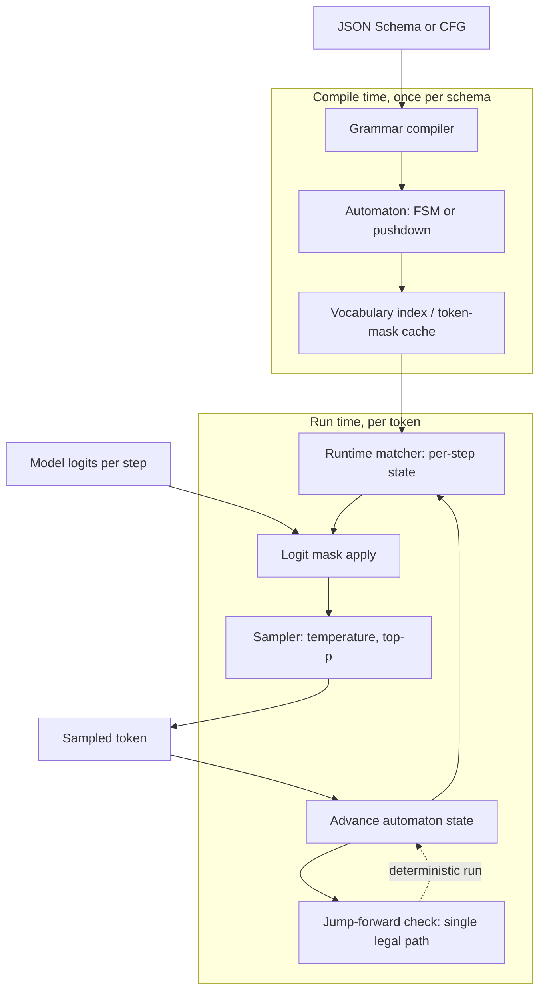

> [!info] Context
> Part of [[Harness-Internals-Overview|Harness Engineering Internals]], Level 2 wave. Parent chapter: [[Harness-Internals-Tool-Calling-Internals]] (which established that "strict mode" turns a schema into a compiled grammar and masks logits, and named Outlines/XGrammar/llguidance without opening them). This chapter opens them: the automata compilers, the ~128K-vocabulary intersection, jump-forward decoding, the distribution-distortion tax, and how the whole thing composes with [[Harness-Internals-Speculative-Decoding]] — the two subsystems that both live in the logits layer and fight over the same forward pass.

# Constrained Decoding Engines

## 1. Executive Overview

Constrained decoding is the machinery that converts a promise into an invariant. In the parent chapter, "the tool arguments will be valid JSON matching this schema" was something you *hoped* a well-trained model would honor and validated after the fact with a retry loop. A constrained decoding engine makes it a property of the decoder: at every generation step, it computes the exact set of tokens that could still lead to a schema-valid string, sets the logits of every other token to negative infinity, and lets the model sample only from what remains. Invalid output is not caught — it is made *unrepresentable*. The model literally cannot emit a token that breaks the grammar, in the same way a statically typed program cannot reach a state where a string is added to an integer.

That is the easy half. The hard half — the reason this is a systems topic and not a one-paragraph trick — is that the model does not think in the units the grammar is written in. A JSON grammar is defined over characters (`{`, `"`, `}`); the model emits *tokens*, and a single token like `":"` or `",\n  "` can straddle three grammar symbols at once. So the engine cannot just check "is this character legal" — it must precompute, for every state the grammar could be in, *which of the ~128,000 tokens in the vocabulary* keep the machine on a path to a valid string. Do that naively and you pay an O(128,000) scan on every token you generate, which would dwarf the model's own forward pass. The entire field — Outlines, XGrammar, llguidance, the vendor engines behind OpenAI, Anthropic, and Gemini — is a set of competing answers to one question: *how do you make the per-token vocabulary intersection cost approximately nothing?*

The reframe for someone who thinks they already understand structured outputs: **constrained decoding is not a filter you bolt onto generation — it is a compiler and a runtime that race the GPU.** The compiler turns your schema into an automaton indexed against the tokenizer; the runtime looks up a bitmask in tens of microseconds while the GPU does its 10–50 ms forward pass. When the compiler is slow you get "first-request latency" (the parent chapter's observation). When the runtime is slow you get throughput collapse. And when either is *too* aggressive — collapsing deterministic paths, masking tokens the model wanted — you get the quality tax: syntactically perfect output that is semantically worse than what the model would freely have said. This chapter is about all three: the compile, the run, and the tax.

## 2. Historical Evolution

**The prompting era (through 2023).** Before engines, "structured output" meant asking nicely and parsing the wreckage — the ReAct/regex world the parent chapter opened with. JSON mode (OpenAI, late 2023) guaranteed *syntactic* JSON but not *your* schema, because it constrained only "is this valid JSON so far," not "does this match these fields." It was a coarse grammar (the JSON grammar) applied at the decoder, and it proved the mechanism worked at scale before anyone made it schema-specific.

**The FSM-indexing breakthrough (July 2023).** Willard and Louf's *Efficient Guided Generation for Large Language Models* (arXiv 2307.09702), the paper behind Outlines, is the founding document of the modern field. Its contribution was not "mask logits against a regex" — people had done that with an O(N) vocabulary scan per token. It was the *index*: precompute, once, a map from every FSM state to the set of tokens legal in that state, so the per-token cost drops from O(vocabulary) to O(1) on average. This reframed constrained decoding from "a validation pass that slows you down" to "a table lookup that is free," and it is why every engine since is some variation on "build a smarter index."

**The CFG wall and the pushdown era (2024).** Regular expressions cannot express recursion, and JSON is recursive (objects nest objects, arrays nest arrays). A pure FSM must flatten nesting to a fixed depth or reject recursive schemas outright. Outlines extended toward context-free grammars via a pushdown automaton over an LALR(1) parser; then **XGrammar** (CMU/NVIDIA/SJTU/Berkeley, arXiv 2411.15100, Nov 2024) built a purpose-designed byte-level pushdown automaton and, crucially, split the vocabulary into *context-independent* tokens (validity depends only on the automaton position, precomputable) and *context-dependent* tokens (validity depends on the full stack, must be checked live) — finding that >99% of the mask is context-independent and therefore cacheable. XGrammar reported JSON mask generation under 40 microseconds and adoption as the default backend in vLLM, SGLang, and TensorRT-LLM.

**The Earley era and vendor absorption (2024–2025).** Microsoft Research's **llguidance** (2023–2025) took a different bet: an Earley parser over a lexer built from *derivatives of regular expressions*, computing masks lazily on the fly (≈50 μs/token for a 128K tokenizer, ≈1.5 ms to warm a typical JSON schema, negligible startup) rather than precomputing a big index. By May 2025 **OpenAI had switched its Structured Outputs / CFG feature to llguidance under the hood**, and exposed context-free grammars directly to developers via custom tools in a Lark dialect. Anthropic shipped its own grammar-constrained structured outputs and strict tool use in late 2025 with a 24-hour compiled-schema cache (parent chapter §10). The open-source techniques had become the vendor infrastructure.

**The agentic-scale correction (2026).** The newest problem is *many grammars, arriving dynamically*. An agent with 50 tools has 50 schemas, changing per request; a reasoning model switches between free thinking and constrained tool syntax mid-stream. **XGrammar-2** (arXiv 2601.04426) answered with just-in-time grammar compilation (~10 ms vs >1000 ms, overlapped with decoding), *TagDispatch* (dispatch to a sub-grammar when the model emits a tag like `<function=`), cross-grammar caching via hierarchical FSM hashing, and a switch from pushdown automata to an Earley parser for polynomial worst-case guarantees. The frontier is no longer "can we constrain one schema efficiently" but "can we constrain a fleet of changing schemas without a compile stall."

## 3. First-Principles Explanation

Build the engine from nothing. You have a language model that, at each step, produces a vector of logits — one real number per vocabulary token, ~128K of them for a Llama-3-class tokenizer. You want to guarantee the concatenation of sampled tokens, decoded to text, matches a JSON schema. There are exactly three sub-problems, and every engine solves all three.

### Sub-problem 1: turn the schema into a formal language

A JSON Schema describes a *set of valid strings*. To reason about "what can come next," you need that set in a computational form. Two rungs on the Chomsky ladder matter:

- **Regular languages / FSM.** If the schema is flat — a fixed set of typed fields, no arbitrary nesting — the set of valid serializations is a regular language, expressible as a regex and therefore as a **finite-state machine**: states are "valid prefixes," transitions consume characters, accepting states are "a complete valid string." `{"location": "<string>"}` becomes a small FSM: state 0 expects `{`, state 1 expects `"`, and so on, with a loop in the string state for arbitrary characters until the closing quote.
- **Context-free languages / pushdown automaton.** The moment the schema allows recursion — an object whose property is another object of the same shape, or an array of arbitrary-depth arrays — a finite machine is provably insufficient, because it has no way to remember "how deep am I" to match closing brackets. You need a **pushdown automaton**: an FSM plus a *stack*. Open-brace pushes; close-brace pops; the stack is the unbounded memory that a plain FSM lacks. This is why JSON, which is inherently recursive, forces the pushdown machinery on any engine that wants to support nested schemas fully.

### Sub-problem 2: the token-boundary problem — the crux of the whole field

Here is the subtlety that makes this hard, and it is worth dwelling on because everything expensive flows from it. The automaton in sub-problem 1 consumes **characters** (or bytes). The model emits **tokens**, and a token is an arbitrary multi-character chunk chosen by the tokenizer: `{"` might be one token, `location` another, `":` a third, and `",\n  "` a fourth that spans a closing quote, a comma, a newline, and indentation. Tokens do not respect grammar boundaries.

So the question the engine must answer at each step is not "which *character* is legal" but "which *tokens* — as whole multi-character units — keep the automaton on a path to some accepting state?" A token is legal in FSM state `q` iff feeding its entire character sequence through the automaton starting from `q` never hits a dead state. To know that for all ~128K tokens, the naive algorithm walks each token character-by-character through the automaton — an O(vocabulary × token-length) scan *per generated token*. On a 128K vocabulary that is millions of automaton steps for every single token the model produces, easily 10–100× the cost of the model's forward pass. **Unoptimized, constrained decoding is slower than the model it constrains.** That is the problem the indexes exist to kill.

### Sub-problem 3: intersect, mask, sample, advance

Once you can cheaply get the legal-token set for the current state, the runtime loop is simple:

1. Model produces logits `z` over the vocabulary.
2. Look up the allowed-token set (a bitmask over the vocabulary) for the current automaton state.
3. Set `z[t] = -inf` for every disallowed token `t` (the **logit mask**).
4. Apply temperature / top-p / top-k to the *masked* logits and sample a token.
5. Advance the automaton by that token's characters; if it lands in an accepting state and the model chose the stop token, finish.

Step 3 is the intersection of the model's distribution with the grammar. Step 4 is where the **quality tax** is born (§5, §13): masking removes probability mass, and renormalizing over the survivors *changes the relative probabilities of everything left*. The model no longer samples from its own distribution `p`; it samples from `p` restricted to the legal set and rescaled — a different distribution that can commit it to a token it would rarely have chosen.

### Where the index comes from

Outlines' founding move (Algorithm 3 and 4 of arXiv 2307.09702) is to do sub-problem 2 **once, offline**, and store the answer. Algorithm 3 walks a single token's characters through the FSM from every possible starting state, recording which start-states accept it. Algorithm 4 inverts that across the whole vocabulary into a map `σ: state → set-of-tokens`. At generation time, "which tokens are legal" is a hash-map lookup — **O(1) on average**, the paper's headline. The index costs memory proportional to the number of FSM states; the paper measured even a naively built index for an augmented Python grammar at only ~50 MB. That single precomputation is the difference between "constrained decoding is free" and "constrained decoding is unusable," and the rest of the field is arguments about how to build a better index for harder grammars.

## 4. Mental Models

**A constrained decoder is a type checker fused into the sampler.** The parent chapter used this analogy; here it becomes literal and mechanical. Post-hoc validation (generate, parse, retry) is dynamic typing: you run, you catch the exception, you try again. Logit masking is static typing: the illegal state is unrepresentable because the compiler (the grammar compiler) proved it away before a single token was sampled. And it inherits static typing's two costs exactly — a restricted language (the supported schema subset: no unbounded recursion in some engines, no arbitrary numeric ranges, `additionalProperties: false` required) and a compile step (the first-request grammar-compilation latency).

**The vocabulary intersection is a set operation done 100 times a second.** Think of two sets at each step: what the *model* wants (a soft distribution over 128K tokens) and what the *grammar* allows (a hard 128K-bit mask). Decoding is their intersection. The engine's whole job is making that intersection — which touches a 128K-element space — cost microseconds. XGrammar's answer: precompute the mask for the >99% of tokens whose legality never depends on the stack, so live work touches only the <1% context-dependent tail. llguidance's answer: never materialize the full set; walk a trie of tokens with an Earley parser and prune whole subtrees. Same set operation, different data structure.

**Jump-forward decoding is constant-folding for generation.** A compiler that sees `x = 2 + 3` does not emit an add instruction — it folds the constant to `5` at compile time. A grammar that is in a state with only one legal continuation — after `{"name` in a fixed schema, the next characters *must* be `": "` — does not need the model to "decide" them. The engine can fold that deterministic run of characters directly into the output and skip the forward passes. This is the single most important throughput idea in the chapter, and it is why constrained decoding can be *faster* than unconstrained: the grammar sometimes knows the answer without asking the model.

**Compile-time vs run-time is a latency budget you allocate, not eliminate.** Outlines spends heavily at compile time (build the full index) to make run time O(1). llguidance spends almost nothing at compile time (lazy) and pays ~50 μs/token at run time. XGrammar-2 moves the compile *into* run time via JIT and overlaps it with the GPU. There is no free lunch — there is a choice about *when* to pay, and the right choice depends on whether your schemas are static (amortize compile: Outlines/XGrammar) or dynamic-per-request (minimize compile: llguidance/XGrammar-2). This is the deepest design axis in the chapter and it maps directly onto agentic vs batch-extraction workloads.

## 5. Internal Architecture

A constrained decoding engine has four components, and they split cleanly across a compile-time phase and a run-time phase that straddles the GPU.



**Grammar compiler.** Parses the schema/regex/CFG and lowers it to an automaton. This is where the supported-subset restrictions live: keywords that cannot be expressed as a finite automaton over tokens (unbounded `minimum`/`maximum`, backreference-bearing patterns, deep recursion in FSM-only engines) are rejected or approximated here. Compile cost ranges from ~2 ms (llguidance warmup) through ~10 ms (XGrammar-2 JIT) to seconds-or-minutes (Outlines on a large complex grammar), and this variance is the single biggest differentiator between engines.

**Automaton.** An FSM for regular schemas; a byte-level pushdown automaton (XGrammar-1) or Earley-parser state (llguidance, XGrammar-2) for context-free ones. The automaton is the source of truth for "what characters are legal next." XGrammar's automaton is a set of per-rule FSMs linked by a stack; it applies compiler optimizations — inlining and equivalent-state merging — to shrink node count, and uses a *persistent execution stack* (a tree structure managing many stacks) so it can fork cheaply for tree-structured decoding and speculative branches.

**Vocabulary index / token-mask cache.** The bridge across the token-boundary problem. Outlines: a full `state → token-set` map. XGrammar: an *adaptive token mask cache* storing precomputed masks for the context-independent majority. llguidance: no materialized index — a token trie traversed on demand with the "slicer" optimization keeping average mask computation under 50 μs and >99% of computations under 1 ms. This component's shape *is* the engine's performance profile.

**Runtime matcher.** Holds the live automaton state, produces the bitmask each step, applies it to the logits, and advances on the sampled token. It also owns two co-design hooks that matter enormously downstream (§6, §9): **rollback** (undo an advance — mandatory for speculative decoding, where drafted tokens may be rejected) and **jump-forward** (detect a deterministic run and emit it without a forward pass). XGrammar exposes both as explicit APIs precisely so serving stacks can fuse constrained decoding with speculation and coalescence.

## 6. Step-by-Step Execution

Trace one constrained generation of the tool arguments `{"location": "Delhi"}` against the schema `{"type":"object","properties":{"location":{"type":"string"}},"required":["location"]}`, on a model with a byte-BPE tokenizer. Assume greedy-ish sampling for clarity; the distribution effects are §5's concern.

**Compile phase (once).**
1. The compiler lowers the schema to an automaton. Because there is no recursion, an FSM suffices: a chain expecting `{`, optional whitespace, `"location"`, `:`, whitespace, a JSON string, `}`.
2. The engine walks the ~128K vocabulary against this automaton and builds the index. For the start state, the only legal first tokens are those whose text is a prefix-compatible opening — a token `{` or `{"` is legal; a token `hello` is not; a token `{"location"` (if the tokenizer has it) is legal *and jumps several states at once*. This is where the token-boundary work is spent, and where it is cached.

**Run phase (per token).**
3. **Step 1 — state = START.** Bitmask allows `{`, `{"`, and any token whose bytes begin a legal `{...`. The model's raw logits might prefer to start narrating ("Sure,"), but those tokens are masked to −inf. It samples `{"`. Advance: the automaton consumes `{` and the opening `"`, landing in "inside the key name."
4. **Jump-forward fires.** In state "inside the key name," the schema has exactly *one* legal property, `location`, and the key is fixed. The only path forward is the characters `location": `. There is no decision for the model to make. The engine **jump-forwards**: it appends `location": ` directly and advances the automaton across all of it — *zero forward passes*. This is the coalescence/jump-forward optimization in action, and on a schema full of fixed keys and punctuation it can skip a large fraction of the tokens (§11).
5. **Step 2 — state = "inside string value."** Now the model genuinely decides. The bitmask allows any token that continues a JSON string without illegally closing it — most of the vocabulary is legal here (that is the point of a string field), except tokens containing an unescaped `"` prematurely or control characters. The model samples `Delhi`.
6. **Step 3 — state = "inside string value, after Delhi."** Legal continuations: more string characters, or the closing `"`. The model samples `"`. Advance: the string closes; the automaton is now in "after value."
7. **Jump-forward fires again.** The only legal completion of the object is `}`. The engine appends it and moves to an accepting state.
8. **Terminate.** In the accepting state, the stop token becomes legal; the model emits it (or the harness stops). Output: `{"location": "Delhi"}`, provably schema-valid, with the model having made only two real decisions (`Delhi`, and closing the string) — the rest folded by jump-forward.

Two things to internalize from this trace. First, **most of the tokens in a structured output are not "generated" in any meaningful sense** — keys, colons, braces, commas are grammar-determined, and a good engine folds them. Second, **the model's real choices happen only in the free "value" regions**, which is exactly where the distribution-distortion tax also concentrates: the mask is loose there (many legal tokens) so distortion is mild, whereas in the tight regions the model had no choice anyway. The interesting quality effects live at the boundaries — the moment the model is forced *into* the structured region from free text (§13).

## 7. Implementation

Four artifacts carry the engineering weight if you were building this. The masking loop, the index build, the jump-forward step, and the speculative-composition hook.

**The runtime masking loop** is deceptively small; the subtlety is that the mask must be a GPU-resident bitmask applied inside the sampling kernel, not a Python set filtered on CPU (which would serialize the GPU behind the CPU every token).

```python
def constrained_sample(logits, matcher, temperature):
    # matcher holds the live automaton state for THIS sequence
    mask = matcher.fill_next_token_bitmask()   # 128K-bit vector; cached lookup
    logits = apply_bitmask(logits, mask)       # disallowed -> -inf, on GPU
    probs = softmax(logits / temperature)      # renormalizes over survivors
    tok = sample(probs)
    matcher.accept_token(tok)                   # advance automaton across tok's bytes
    return tok
```

The load-bearing detail: `fill_next_token_bitmask` must be *fast* and *overlappable*. XGrammar computes the mask on CPU in parallel with the GPU forward pass and only synchronizes to apply it, so mask computation hides under inference latency instead of adding to it. That overlap is why "40 μs mask" does not mean "40 μs added per token" — for most of that 40 μs the GPU is busy anyway.

**The index build** (Outlines-style) is the offline half. For each token, walk it through the automaton from candidate states and record the transitions:

```python
def build_index(fsm, vocabulary):
    index = defaultdict(set)          # fsm_state -> {allowed token ids}
    for tok_id, text in vocabulary.items():
        for start in fsm.states:
            state = start
            ok = True
            for ch in text:           # walk the token's bytes
                state = fsm.step(state, ch)
                if state is DEAD:
                    ok = False; break
            if ok:
                index[start].add(tok_id)   # tok legal from `start`, lands in `state`
    return index                      # ~50MB for an augmented Python grammar
```

This is O(states × vocabulary × token-length) *once*. It is why Outlines has meaningful compile cost on big grammars, and why XGrammar-2's JIT — building only the parts of the index the generation actually reaches, overlapped with decoding — is the modern refinement: you rarely visit most states, so eagerly indexing all of them is wasted compile time.

**The jump-forward step** is the highest-leverage optimization and the trickiest to get right because of retokenization:

```python
def try_jump_forward(matcher):
    run = matcher.deterministic_continuation()   # chars forced by the grammar
    if not run:
        return None
    # DANGER: appending chars != appending tokens. Re-tokenize the boundary.
    return matcher.retokenize_and_advance(run)
```

The danger is real and specific: models prefer to merge characters into big tokens (LMSYS's example — decoding `"Hello"`, a model naturally emits `"He`, `llo`, `",` not single characters). If you jump-forward by appending the *string* `location": ` and then hand control back for the value, the token boundary you left the model on may be one the model would never have produced, pushing it out of distribution. SGLang's fix is to append the *string* and **re-tokenize** the affected span (measured ~4% overhead) so the model resumes on a natural token boundary, and to prefer a single comprehensive regex over concatenated ones so FSM and model stay boundary-aligned. This is the token-healing problem (Guidance's term) surfacing inside jump-forward: back up to a token boundary and re-anchor rather than trusting a raw character append.

**The speculative-composition hook** is the piece the parent chapter's sibling ([[Harness-Internals-Speculative-Decoding]]) needs and is worth showing because it is where two logits-layer subsystems collide. When speculative decoding drafts `k` tokens, each must be validated against the grammar, and rejected drafts must roll back the automaton:

```python
def verify_speculative(matcher, draft_tokens, target_logits):
    for i, tok in enumerate(draft_tokens):
        mask = matcher.fill_next_token_bitmask()
        if not mask[tok]:            # draft token is grammar-illegal
            matcher.rollback(i)      # undo automaton advances for the tail
            return accepted[:i]      # truncate here; resample under mask
        matcher.accept_token(tok)
    return draft_tokens
```

vLLM's implementation (PR #14702) generates a bitmask *per speculative draft position* so the bonus token also respects the grammar, and calls `grammar_matcher.rollback()` when drafts are rejected — "this operation should not modify the matcher state" for the pure validation, with rollback for the rejected tail. XGrammar exposes rollback as a first-class API precisely for this, and its persistent execution stack lets the automaton fork per speculative branch (SpecInfer-style trees) cheaply.

## 8. Design Decisions

**FSM vs pushdown vs Earley — why the field moved twice.** The FSM (Outlines' original) is the fastest possible run-time structure — a table lookup — but cannot express recursion, so it caps nesting depth or rejects recursive JSON. That is fine for flat extraction and fatal for real-world schemas with `$ref` recursion. The pushdown automaton (XGrammar-1) restores recursion by adding a stack, at the cost that the mask now depends on the stack (the context-dependent tokens) and cannot be fully precomputed. The Earley parser (llguidance, XGrammar-2) is the most general — it handles arbitrary CFGs with polynomial worst case (O(n³) general, O(n²) unambiguous) and, critically, degrades gracefully on ambiguous or pathological grammars where a pushdown automaton can blow up. The trajectory FSM → PDA → Earley is a steady trade of raw speed for *coverage and worst-case safety*, driven by the discovery (JSONSchemaBench) that real schemas break simpler engines: on GitHub-Hard schemas, Outlines' coverage collapses to ~3% while the more general engines hold up better. Generality won because correctness on hard schemas matters more than microseconds on easy ones.

**Precompute-everything vs compute-lazily.** Outlines precomputes the full index (compile-heavy, run-O(1)); llguidance computes masks lazily (compile-near-zero, run ≈50 μs). The right choice is a function of schema churn. A batch extraction job hitting the same schema a million times should precompute — amortize the compile across a million calls. An agent whose tool schemas change every request cannot amortize anything, so llguidance's lazy model or XGrammar-2's JIT wins, because the precompute would be paid fresh every request and never recovered. **OpenAI's choice of llguidance is a tell**: an API serving arbitrary developer schemas, most seen only a few times, is the pure dynamic case, and lazy mask computation with negligible startup beats a big precomputed index that never gets reused. Anthropic's 24-hour compiled-schema cache is the same insight from the other side — precompute, but *only if* you can amortize across a day's worth of identical requests, and evict when you cannot.

**Context-independent/dependent split — why XGrammar's core idea generalizes.** The observation that >99% of tokens' legality depends only on automaton position, not the stack, is what makes pushdown-based masking fast: you precompute the 99% and check only the 1% live. This is a classic "make the common case fast" factoring, and it recurs everywhere — the deterministic-run detection in jump-forward is the same idea at the sequence level (the common case is "the grammar forces this," handle it without the model).

**Where to pay for correctness under the token-boundary problem.** Three strategies coexist: (a) re-tokenization after jump-forward (SGLang, ~4% overhead) to keep the model on natural boundaries; (b) token healing (Guidance) — back up one token at a constraint boundary and constrain the first generated token to complete it; (c) byte-level automata (XGrammar) that operate below the token level so boundaries never misalign in the first place. Byte-level is the cleanest (the boundary problem dissolves if your automaton speaks bytes) but requires the whole pipeline to be byte-aware; re-tokenization is a pragmatic patch that any engine can bolt on. Engines converged on byte-level automata as the principled fix.

**Vendor-hosted vs self-hosted.** OpenAI/Anthropic/Gemini give you a compiled, cached, subset-restricted engine you cannot inspect or tune, with documented complexity caps (Anthropic: 20 strict tools, 24 optional params, 16 unions per request — parent §10) that are *the automaton's blow-up limits surfaced as API limits*. Self-hosting Outlines/XGrammar/llguidance on vLLM/SGLang gives you full grammar expressiveness (arbitrary CFGs, custom regex, jump-forward you control) and the ability to compose with your own speculative-decoding stack — at the cost of owning the compile-latency and coverage-failure modes yourself. The caps are not arbitrary vendor stinginess; they are the points past which the automaton's state space or the mask cost stops being economical.

## 9. Failure Modes

**Coverage collapse on complex schemas.** The most consequential and least advertised failure. JSONSchemaBench (arXiv 2501.10868) found that *no* framework covers all 45 JSON Schema feature categories, and coverage craters on hard schemas: on GitHub-Hard (deep nesting, recursion, complex patterns) the measured declared-coverage figures were Guidance ~41%, llama.cpp ~39%, XGrammar ~28%, and Outlines ~3%, versus all engines above ~86% on simple GlaiveAI schemas. The failure is quiet and dangerous: the engine either rejects the schema at compile time (loud, at least) or silently approximates it (masks against a *weaker* grammar than you specified, so "guaranteed valid" is a lie). Debugging: validate outputs against the *original* schema independently of the engine's guarantee, and test your exact schemas against the engine before trusting strict mode. This directly qualifies the parent chapter's "provably matches the schema" — provable only for the subset the engine actually compiled.

**First-request compile stall.** The parent chapter's "first-request latency" is this: a cold schema triggers a full grammar compile (milliseconds to *minutes* for Outlines on a pathological grammar) before the first token. Under load, a burst of distinct schemas can stall a serving queue. Mitigations: warm caches on deploy, prefer engines with cheap compile (llguidance, XGrammar-2 JIT), and canonicalize schema serialization so cache keys hit (parent §9's grammar-cache-invalidation-storm bug applies verbatim — a timestamp in a description defeats the compile cache).

**Jump-forward retokenization corruption.** If jump-forward appends characters without re-tokenizing, the model resumes on an unnatural boundary and can spiral into "endless decoding" (LMSYS's failure) — repeatedly proposing multi-char tokens the constraint forbids, accepting single chars, never converging. Symptom: a structured request that generates far more tokens than the output length justifies. Fix: re-tokenize the jump-forward span (§7), or use a byte-level automaton.

**Speculative-decoding acceptance collapse.** When you compose constrained decoding with speculative decoding, drafts get *truncated at the first grammar-invalid position*. vLLM's own benchmarks (PR #14702): on deterministic extraction, 96.1% draft acceptance and 0.98× overhead (basically free — the grammar and the draft agree because the output is forced); but on *generative* JSON content, acceptance falls to 30–55% with 1.5–1.7× overhead, because effective accepted length collapses from ~7 to ~3 when a draft token hits a masked position and the whole tail is discarded. The two optimizations *interfere*: speculation wants long agreed runs, and the grammar mask keeps chopping the run at structural boundaries. This is must-answer question 6's sharpest edge — the composition is correct but not free, and it is *most* free exactly where jump-forward would already have helped (deterministic regions) and *least* free in the free-text value regions where speculation would otherwise shine.

**Distribution distortion producing plausible-but-wrong output.** Covered as the quality tax (§13) but it is also a silent failure: masking never errors, so a semantically degraded-but-valid output looks identical to a good one in the logs. Detection requires *task-quality* evals, not parse-success rates — parse success is 100% by construction and tells you nothing.

**Numeric and unbounded-constraint rejection.** `{"minimum": 0, "maximum": 1000000}` cannot be a finite automaton over tokens without enumerating a huge state space, so engines either reject it, ignore the bound (masking only "is this a digit"), or approximate it. The parent chapter noted Anthropic strips unsupported constraints into descriptions and validates client-side; that is the correct pattern — do not assume the decoder enforced a numeric range it structurally cannot.

## 10. Production Engineering

**OpenAI (verified).** Structured Outputs and custom-tool CFGs are backed by **llguidance** (credited May 2025), with schemas compiled to grammars, per-org artifact caching, and documented first-request latency. Developers can supply a context-free grammar directly in a Lark dialect (or a Rust-regex) for custom tools — full grammar-constrained decoding exposed as API surface, the strongest public statement that a vendor runs a general CFG engine, not just JSON masking. Strict mode requires `additionalProperties: false` and all properties in `required` (optionals become unions with null) — the automaton's structural requirements surfaced as schema rules.

**Anthropic (verified).** Grammar-constrained structured outputs and strict tool use, GA late 2025, with a **24-hour compiled-grammar cache**, documented complexity caps (20 strict tools / 24 optional params / 16 unions), and the explicit escape hatch that guarantees are void on `max_tokens`/`refusal` stops (parent §9). The public docs do not name the backend engine; it is *unverifiable from outside* whether Anthropic runs llguidance, XGrammar, or a proprietary engine, and any specific claim would be fabrication. What is inferable (labeled inference): the 24h cache + complexity caps + subset restrictions are the exact signature of a compiled-automaton engine with a bounded state budget, consistent with the whole field.

**Google Gemini (verified).** `responseSchema` + `responseMimeType: "application/json"` for constrained JSON, plus a `propertyOrdering` field — the tell that ordering affects the grammar/output, and that overly complex schemas can fail generation outright rather than degrade (the hard edge of pure grammar enforcement, parent §10).

**vLLM (verified).** Multiple backends — `xgrammar` (default), `guidance` (llguidance), `outlines`, `lm-format-enforcer` — selectable, with an `auto` mode that picks per request. Parameters `guided_json`, `guided_regex`, `guided_grammar`, `guided_choice`. XGrammar and guidance use Rust-style regex; feature gaps exist (XGrammar historically limited on complex JSON with regex patterns or numeric ranges, falling back to another backend). Speculative decoding + structured outputs composition landed via PR #14702 with the per-draft bitmask + rollback machinery.

**SGLang (verified).** Ships the **compressed-FSM jump-forward** decoding from the LMSYS work: build a compressed FSM, collapse singular-transition runs, decode multiple tokens per step, re-tokenize the boundary (~4% overhead). Reported up to 2× latency reduction and 2.5× throughput, and 1.6× throughput on the JSON benchmark specifically — the case where constrained decoding *beats* unconstrained because the grammar folds tokens the model would otherwise have to emit one at a time. XGrammar is also available as a backend.

**TensorRT-LLM (verified).** XGrammar as the structured-generation backend, with the co-design APIs (rollback, jump-forward) wired for composition with its speculative-decoding methods.

**The frontier labs' serving internals are otherwise unknowable.** Exactly as with speculative decoding (sibling chapter §10), no provider publishes its production engine's draft/mask internals, per-token overhead, or coverage subset beyond the documented caps. The caps and cache TTLs are the only externally verifiable facts; everything else is labeled inference from the open-source engines that the vendors demonstrably build on (OpenAI→llguidance is the one confirmed link).

## 11. Performance

The costs stack in three layers, and the counterintuitive headline is that constrained decoding can be a net *speedup*, not just a tax.

**Mask computation — the per-token run-time cost — is engineered to near-zero.** XGrammar: JSON mask under 40 μs, up to 100× faster than prior mask generation, *overlapped* with the GPU forward pass so it adds ~nothing to wall-clock. llguidance: ~50 μs/token for a 128K tokenizer, slicer keeping >99% of computations under 1 ms. XGrammar-2: per-token overhead well under llguidance's ~250 μs on its benchmark. These are all noise against 10–50 ms/token of model inference — mask *computation* is a solved problem. The corollary from the parent chapter holds: masking is cheap; *compilation* is where cost hides.

**Compilation — the first-request cost — is where engines differ 100×.** XGrammar-2 JIT: ~10 ms vs XGrammar-1's >1000 ms (>100×), overlapped with decoding. llguidance: ~1.5 ms to warm a typical JSON schema, ~2 ms startup. Outlines: seconds-to-minutes on large/complex grammars (the index build is O(states × vocabulary)). This is the number that decides whether an engine is usable for dynamic agentic schemas, and it is why the field's newest work is all about killing compile latency.

**Jump-forward / coalescence turns the grammar into a speedup.** Because keys, punctuation, and fixed structure are grammar-determined, an engine that folds them skips forward passes entirely. LMSYS/SGLang measured up to 2× latency reduction and 2.5× throughput from compressed-FSM jump-forward, 1.6× on JSON specifically. dottxt's coalescence framing: the JSON key `"name"` has 8 possible tokenizations collapsing to as few as 2 model calls — "at least a 5× speedup over structured generation in Outlines." **This is the answer to must-answer question 2: jump-forward saves on the order of 2–5× on structure-heavy outputs, and the saving scales with the ratio of grammar-determined characters to free-value characters** — a schema of mostly fixed keys and punctuation saves the most, a schema of long free-text fields saves the least. The saving comes with the retokenization caveat (§7): naive coalescence distorts the distribution (§13), so the ~4% re-tokenization overhead is the price of doing it correctly.

**Composition with speculative decoding is where the layers fight.** As §9 quantified: 0.98× overhead (free) on deterministic extraction, but 1.5–1.7× overhead on generative JSON as the grammar mask chops speculative runs from ~7 to ~3 accepted tokens. The performance rule: constrained decoding composes *well* with speculation on input-grounded/forced outputs (where both agree) and *poorly* on generative outputs (where the mask keeps invalidating drafts). Since the sibling chapter established that speculation itself already degrades under continuous batching, stacking constrained decoding on top compounds the load sensitivity — a serving-scheduling problem, not a correctness one.

## 12. Best Practices

**Reason first, constrain last.** The single highest-leverage practice, and it is architectural, not a tuning knob. Let the model emit free-form reasoning (or a thinking block) *unconstrained*, then constrain only the final structured emission. This is the CRANE finding (§13) and the parent chapter's "reason, then constrain" default: it recovers most of the quality tax because the distortion enters when the model is forced into structure while still reasoning. Production APIs enable this by letting text/thinking blocks precede the tool block.

**Match the engine to the schema-churn profile.** Static, high-volume schema → precompute (Outlines/XGrammar, amortize the compile). Dynamic, per-request schemas → lazy/JIT (llguidance/XGrammar-2, minimize compile you can never amortize). Choosing precompute for a dynamic agent is the classic mistake — you pay the index build every request and throw it away.

**Test your exact schemas against the engine's coverage before trusting "guaranteed."** Given the JSONSchemaBench coverage collapse, "strict mode" is only as strong as the subset the engine compiled. Run your real schemas, especially recursive/nested ones, and validate outputs against the *original* schema independently. Treat the vendor complexity caps as hard design constraints, not suggestions.

**Prefer byte-level or re-tokenizing engines for jump-forward.** If you enable coalescence, make sure the engine re-tokenizes boundaries or operates on bytes; otherwise you trade a 2–5× speedup for out-of-distribution corruption on the token seams.

**Canonicalize schema serialization.** Nondeterministic key ordering or embedded timestamps defeat the compile cache *and* the prompt cache (parent §9), converting every request into a first-request compile stall. The tools array and its schemas are cache keys — treat them as such.

**Monitor task quality, not parse rate.** Parse success is 100% by construction under strict mode and is therefore a useless health metric. The distortion tax is invisible in parse logs and only shows up in downstream task-accuracy evals. Anti-pattern: declaring victory because "0 parse failures."

**Don't reach for strict mode by default.** The parent chapter's judgment stands and this chapter reinforces it mechanically: for a capable model calling well-designed tools, soft enforcement + error-as-result converges at near-identical reliability without the compile latency, coverage-subset restrictions, or distortion tax. Strict mode earns its cost when the consumer is *code with no retry path* (extraction into a database) or a smaller model whose format compliance genuinely wobbles.

## 13. Common Misconceptions

**"Constrained decoding just removes invalid options — it can't hurt quality."** It renormalizes probability over the survivors, which *changes the relative probabilities of everything left*. When the model assigns high mass to tokens the grammar masks, the leftover mass is rescaled and the differences among valid tokens are amplified, which can commit the model to a low-probability trajectory it would have avoided. *Let Me Speak Freely?* (arXiv 2408.02442) measured ~10–15% degradation on reasoning tasks under strict JSON versus free-form-then-convert. The distortion is a per-step reverse-KL shift, not a neutral filter.

**"The distortion happens in the decoder."** Mostly it happens at the *prompt*: the model behaves differently the instant it is told to emit JSON, and much of the measured loss is that behavioral shift, not the logit masking. This is why "reason free, constrain the final emission" recovers most of it — you remove the prompt-level format pressure during reasoning. The parent chapter made this point; the follow-up literature (CRANE, the RANLP "Hidden Cost of Structure") is the evidence.

**"A finite-state machine can enforce any JSON schema."** Regular expressions cannot express recursion, and JSON is recursive. A pure FSM must cap nesting depth or reject recursive schemas — which is exactly why Outlines collapses to ~3% coverage on GitHub-Hard schemas and why the field moved to pushdown/Earley. If your schema has `$ref` recursion, an FSM-only engine is silently approximating it.

**"Coalescence/jump-forward is a pure free win."** It is a win *for throughput* and a risk *for correctness of the distribution*. dottxt's own coalescence writeup shows that greedily collapsing to the longest tokenization changes the conditional distribution at the seam (their "Paul" vs "John" example): identical output strings reached by different token paths carry different continuation probabilities, so naively picking one path biases what comes next. Done right it preserves the distribution and re-tokenizes the boundary; done naively it is a silent bias.

**"Strict mode makes tool calling reliable."** (Carried from the parent, still the top misconception.) Strict mode guarantees *syntax*. The dominant real-world failures — wrong tool selected, right tool with a semantically wrong-but-type-valid argument (`"config.yml"` when the file is `config.yaml` — a perfectly valid string) — are untouched. Schema conformance was already ~99% on frontier models; constrained decoding closes a small gap at a real cost and does nothing for selection or semantics.

**"The 128K-vocabulary scan is the bottleneck."** It *was*, in the naive O(N)-per-token version, and it is exactly what the index (Outlines), the context-independent cache (XGrammar), and the trie+slicer (llguidance) exist to eliminate. In a modern engine the per-token mask is tens of microseconds and hides under the GPU. The real bottleneck migrated to *compile latency* and *coverage*, not the vocabulary intersection.

## 14. Interview-Level Discussion

**Q: Walk me through why a JSON grammar cannot be masked by simply checking each character, and what data structure fixes it.** The model emits tokens, not characters, and a token is an arbitrary multi-character chunk that can straddle grammar boundaries (`",\n  "` spans a quote, comma, newline, indentation). So "is the next character legal" is the wrong question; the right one is "does this whole token's byte sequence keep the automaton on a path to an accepting state." Answering that for 128K tokens per step is an O(vocabulary × token-length) automaton walk — slower than the model. The fix is precomputing, offline, a map from each automaton state to its legal-token set (Outlines' index, Algorithm 4), making the per-step lookup O(1). XGrammar refines it by noting >99% of tokens are context-independent (legality depends only on automaton position, not the pushdown stack) and precomputing just those, checking the <1% context-dependent tail live. The whole field is variations on "build a cheaper index for the token-boundary problem."

**Q: Your structured-extraction service has 100% parse success but downstream accuracy dropped 12% after enabling strict mode. Explain.** Parse success is 100% *by construction* under constrained decoding — it is not a quality signal. The 12% is the distribution-distortion tax: masking + renormalization changes the relative probabilities of the surviving tokens, and forcing the model into JSON structure while it is still "reasoning" shifts its behavior (much of the loss is prompt-level, per *Let Me Speak Freely?*, ~10–15% on reasoning tasks). The fix is architectural: let the model reason unconstrained, then constrain only the final structured emission (CRANE recovers ~9 points on GSM-Symbolic doing exactly this). Monitor task accuracy, never parse rate.

**Q: Why is jump-forward decoding sometimes faster than unconstrained generation, and what breaks if you implement it carelessly?** Because a schema's fixed structure — keys, colons, braces, punctuation — is grammar-determined, so the engine can fold a deterministic run of characters directly into the output without a forward pass (constant-folding for generation). On structure-heavy JSON this yields 2–5× (SGLang 2×/2.5×, dottxt "at least 5× over Outlines"). What breaks: appending *characters* leaves the model on a token boundary it would never have chosen (models merge chars into big tokens), pushing it out of distribution into "endless decoding." The fix is re-tokenizing the jumped span (~4% overhead) or using a byte-level automaton so token boundaries never misalign.

**Q: You want strict JSON output *and* speculative decoding for latency. What has to happen at their intersection, and where does it stop paying off?** Every drafted token must be validated against the grammar mask before acceptance, and rejected drafts must roll back the automaton state (vLLM PR #14702: per-draft bitmask + `grammar_matcher.rollback()`; XGrammar exposes rollback as a first-class API, with a persistent stack that forks per speculative branch). It pays off on input-grounded/deterministic output — vLLM measured 96.1% acceptance, 0.98× overhead — because the grammar and the draft agree on forced tokens. It stops paying off on generative content: the mask truncates each speculative run at the first grammar-invalid position, collapsing effective accepted length from ~7 to ~3, yielding 1.5–1.7× *overhead*. The two optimizations compete for the same runs — speculation wants long agreed sequences, the grammar keeps chopping them at structural boundaries.

**Q: OpenAI runs llguidance (Earley + lazy masking); Outlines precomputes a full index. Both are "correct." When is each the right engineering choice?** It is an amortization decision on schema churn. Outlines' index is O(1) at run time but pays a heavy offline build — worth it when one schema is hit millions of times (batch extraction), where the build amortizes to nothing. llguidance computes masks lazily at ~50 μs/token with ~2 ms startup — worth it when schemas are dynamic and mostly seen once (an API serving arbitrary developer schemas), where a precomputed index would be built fresh every request and never reused. OpenAI's product *is* the pure dynamic case, so lazy wins; Anthropic's 24h cache is the same logic with a time-bounded amortization window. There is no universal winner — there is a churn profile, and picking wrong (precompute for a dynamic agent) means paying the compile every request.

## 15. Advanced Topics

**Distribution-preserving constrained decoding.** The distortion tax is not fundamental — it is an artifact of naive masking-then-renormalizing. Research like (G)I-DLE (arXiv 2503.18050) frames constrained decoding as minimizing KL divergence from the unconstrained distribution subject to the grammar constraint, rather than hard-masking and rescaling, aiming to keep the constrained distribution as close as possible to what the model intended. The open problem: doing this cheaply enough to run per-token at serving scale, where the current answer (hard mask) is chosen precisely because it is a bitwise-cheap operation.

**Grammars beyond JSON — DSLs as first-class output.** OpenAI's Lark-CFG custom tools point at constraining outputs that are *not* JSON: SQL, diffs, arithmetic expressions, domain query languages, directly as grammars instead of stuffed into JSON string fields where escaping burns tokens and invites corruption. This connects to [[Harness-Internals-Programmatic-Tool-Calling]]: if the model writes *code* that calls tools, constraining that code to a valid subset is a grammar problem, and the same engines apply.

**Agentic-scale grammar management.** XGrammar-2's TagDispatch, cross-grammar caching, and JIT are the beginning of treating "a fleet of changing grammars" as the primary workload rather than "one static schema." The open questions: how to share automaton sub-structures across hundreds of tool schemas (hierarchical FSM hashing is v1), how to switch grammars mid-stream when a reasoning model transitions between thinking and tool-calling, and how to bound total state-cache memory when every request brings new schemas. This is where constrained decoding meets tool-retrieval-at-scale (the parent's deferred-loading world).

**Reachability theory and the limits of constraint.** CRANE's Proposition 3.1 result — that forcing a model to answer in a single constrained step bounds it to TC⁰ circuits, which cannot solve problems (like graph reachability) that need polynomial reasoning depth — is a genuine theoretical limit on what constrained decoding can do without an unconstrained reasoning prefix. It formalizes *why* reason-then-constrain is not just an empirical trick but a computational necessity: the constraint removes the model's ability to use tokens as scratch space. The research edge is grammars that are *expressive enough to reason in* — augmented with delimited free-reasoning regions (CRANE's `Ga → RM·G`) — so the constraint applies only to the final answer.

**Diffusion and non-autoregressive constrained decoding.** As diffusion LLMs mature, constrained decoding must move off the left-to-right assumption that FSM/pushdown masking depends on (you constrain "the next token given a prefix"). Early work (arXiv 2508.10111, CFG-constrained diffusion) is charting how to enforce a grammar when tokens are refined in parallel rather than generated in sequence — a genuinely different masking problem with no settled answer.

## 16. Glossary

- **Constrained (guided/structured) decoding**: masking illegal tokens at each sampling step so output provably matches a grammar or schema.
- **Logit mask / bitmask**: a 128K-bit vector marking allowed tokens; disallowed logits set to −inf before sampling.
- **Token-boundary problem**: tokens are multi-character chunks that do not align with grammar symbols, so legality must be computed over whole tokens, not characters — the field's core difficulty.
- **Context-independent / context-dependent token** (XGrammar): whether a token's legality depends only on automaton position (precomputable, >99%) or on the full pushdown stack (checked live).
- **FSM (finite-state machine)**: automaton for regular languages; fast masking but cannot express recursion.
- **Pushdown automaton (PDA)**: FSM + stack; handles recursive/nested grammars (JSON's nesting).
- **Earley parser**: general CFG parser (O(n³), O(n²) unambiguous) used by llguidance and XGrammar-2 for coverage and worst-case safety.
- **Vocabulary index** (Outlines): precomputed `state → legal-token-set` map making per-step lookup O(1).
- **Adaptive token mask cache** (XGrammar): precomputed masks for context-independent tokens.
- **Slicer optimization** (llguidance): keeps lazy mask computation under ~50 μs average without precompute.
- **Jump-forward / coalescence**: folding a grammar-determined deterministic run of characters into the output without model forward passes; 2–5× on structure-heavy output.
- **Re-tokenization**: re-splitting a jump-forward span so the model resumes on a natural token boundary (~4% overhead).
- **Token healing** (Guidance): backing up one token at a constraint boundary and constraining the first generated token to complete it.
- **Distribution distortion / quality tax**: masking + renormalization changes relative token probabilities, degrading semantics (~10–15% on reasoning tasks).
- **Reason-then-constrain / CRANE**: reason unconstrained, constrain only the final structured emission, recovering most of the quality tax.
- **JIT grammar compilation** (XGrammar-2): building the automaton/index lazily at runtime, overlapped with decoding (~10 ms vs >1000 ms).
- **Rollback**: undoing automaton advances when speculative draft tokens are rejected — the co-design hook for speculative decoding.

## 17. References

- [Willard & Louf — Efficient Guided Generation for Large Language Models (arXiv 2307.09702)](https://ar5iv.labs.arxiv.org/html/2307.09702) — the founding Outlines paper. Algorithms 3–4 (the FSM-state→token-set index) and the O(1) claim; read first to internalize the token-boundary problem and why an offline index is the answer. Includes the pushdown/LALR(1) extension to CFGs and the ~50 MB index measurement.
- [XGrammar: Flexible and Efficient Structured Generation (arXiv 2411.15100)](https://arxiv.org/pdf/2411.15100) and the [MLC engineering blog](https://blog.mlc.ai/2024/11/22/achieving-efficient-flexible-portable-structured-generation-with-xgrammar) — the byte-level pushdown automaton, context-independent/dependent split (>99%), adaptive mask cache, GPU/CPU overlap, and the rollback/jump-forward co-design APIs. The clearest exposition of taming the 128K vocabulary. Under-40-μs mask, up-to-100× mask speedup, up-to-14×/80× end-to-end.
- [XGrammar-2: Efficient Dynamic Structured Generation for Agentic LLMs (arXiv 2601.04426)](https://arxiv.org/html/2601.04426) — the agentic-scale answer: JIT compilation (~10 ms vs >1000 ms), TagDispatch, cross-grammar caching, the pushdown→Earley switch. Read to understand why "many changing grammars" is the new frontier.
- [llguidance repo](https://github.com/guidance-ai/llguidance) and [LLGuidance: Making Structured Outputs Go Brrr](https://guidance-ai.github.io/llguidance/llg-go-brrr) — the Earley + regex-derivatives lazy engine OpenAI adopted. ~50 μs/token, ~1.5 ms schema warmup, the slicer optimization, and the compile-vs-run trade against Outlines/XGrammar. The reference for "compute masks lazily."
- [LMSYS — Fast JSON Decoding with Compressed FSM](https://www.lmsys.org/blog/2024-02-05-compressed-fsm/) — the jump-forward / compressed-FSM writeup behind SGLang: singular-transition compression, multi-token decode, the retokenization fix (~4% overhead), and the 2× latency / 2.5× throughput / 1.6× JSON numbers. The canonical source for must-answer question 2.
- [dottxt — Coalescence: making LLM inference 5x faster](https://blog.dottxt.ai/coalescence.html) — the coalescence speedup *and* its distribution-distortion risk (the `"name"` 8-tokenization example, the Paul/John bias). Read to see why jump-forward is not a pure free win.
- [Let Me Speak Freely? (arXiv 2408.02442)](https://arxiv.org/html/2408.02442v1) — the empirical quality-tax study: ~10–15% reasoning degradation under strict formats, and the NL-then-convert mitigation. The evidence base for must-answer question 5.
- [CRANE: Reasoning with Constrained LLM Generation (arXiv 2502.09061)](https://arxiv.org/html/2502.09061v3) — the theory (Proposition 3.1, TC⁰/reachability) of *why* constraint limits reasoning, and the augmented-grammar reason-then-constrain fix with GSM-Symbolic/FOLIO recovery numbers. Pair with *Let Me Speak Freely?*.
- [JSONSchemaBench (arXiv 2501.10868)](https://arxiv.org/pdf/2501.10868) — the coverage reality check: no engine covers all 45 JSON Schema features; the GitHub-Hard collapse (Outlines ~3%, XGrammar ~28%, guidance ~41%). Read before trusting any "guaranteed valid" claim.
- [vLLM PR #14702 — Speculative Decoding with Structured Outputs](https://github.com/vllm-project/vllm/pull/14702) and the [vLLM structured-decoding intro](https://blog.vllm.ai/2025/01/14/struct-decode-intro.html) — the per-draft bitmask + rollback composition and its acceptance numbers (96.1%/0.98× vs 30–55%/1.5–1.7×). The primary source for must-answer question 6.
- [OpenAI — Introducing Structured Outputs](https://openai.com/index/introducing-structured-outputs-in-the-api/) and the [function-calling / custom-tool CFG guide](https://developers.openai.com/api/docs/guides/structured-outputs) — the vendor surface: llguidance backing, Lark-CFG custom tools, the `additionalProperties: false` / `required` rules. Compare against the parent chapter's Anthropic and Gemini coverage.
- [(G)I-DLE (arXiv 2503.18050)](https://arxiv.org/pdf/2503.18050) — distribution-preserving constrained decoding via KL minimization; the research direction for killing the quality tax rather than living with it.

## 18. Subtopics for Further Deep Dive

### Distribution-Preserving Constrained Decoding
- **Slug**: Distribution-Preserving-Constrained-Decoding
- **Why it deserves a deep dive**: The quality tax is the least-solved problem in the field, and the KL-minimization / residual-sampling approaches that would fix it at serving scale are an active research frontier with real production stakes (every strict-mode extraction pipeline pays this tax silently).
- **Has enough depth for a full chapter**: yes
- **Key questions to answer**: Can distribution-preserving masking be made bitwise-cheap enough for per-token serving? How does it interact with jump-forward (which is inherently distortive)? What is the measurable quality recovery versus the reason-then-constrain architectural fix, and when is each preferable?

### Grammar Engines for Non-JSON DSLs (SQL, diffs, code)
- **Slug**: Grammar-Constrained-DSL-Generation
- **Why it deserves a deep dive**: OpenAI's Lark-CFG custom tools and code-mode tool calling push constrained decoding beyond JSON into programming-language and diff grammars, where the token-boundary problem is harder and the payoff (no JSON-string escaping) is larger. Intersects [[Harness-Internals-Programmatic-Tool-Calling]].
- **Has enough depth for a full chapter**: yes
- **Key questions to answer**: How do you constrain a Turing-complete-ish DSL without rejecting valid programs? How does constraining generated *code* (vs data) change the reasoning-degradation picture? How do diff-format grammars compose with the edit-application pipeline in [[Harness-Internals-Speculative-Decoding]]?

### Constrained Decoding Under Continuous Batching and Speculation
- **Slug**: Constrained-Decoding-Serving-Economics
- **Why it deserves a deep dive**: This chapter and the speculative-decoding sibling both showed load-dependent behavior; the combined scheduling problem (when to constrain, when to speculate, when to jump-forward, all as a function of batch size and schema churn) is a goodput-optimization topic no one has charted end-to-end.
- **Has enough depth for a full chapter**: yes
- **Key questions to answer**: How should a scheduler co-optimize mask overhead, jump-forward savings, and speculative acceptance under a fixed compute budget? What is the goodput crossover where constrained decoding should be disabled or degraded? How do per-org grammar caches behave under adversarial schema churn?

### Coverage and Correctness Verification of Constrained Engines
- **Slug**: Constrained-Decoding-Coverage-Verification
- **Why it deserves a deep dive**: JSONSchemaBench exposed that "guaranteed valid" is only true for a compiled subset that collapses on hard schemas, silently. Building the verification harness that tells you whether *your* schema is actually enforced is unglamorous, critical, and undocumented.
- **Has enough depth for a full chapter**: no — better folded into [[Harness-Internals-Evaluation-Infrastructure]] unless combined with a formal treatment of the JSON Schema feature lattice, which would push it to yes.
- **Key questions to answer**: How do you differentially test an engine's compiled grammar against the original schema? Which JSON Schema features silently degrade vs loudly reject across engines? How do you monitor coverage regressions when a vendor updates its engine underneath you?
