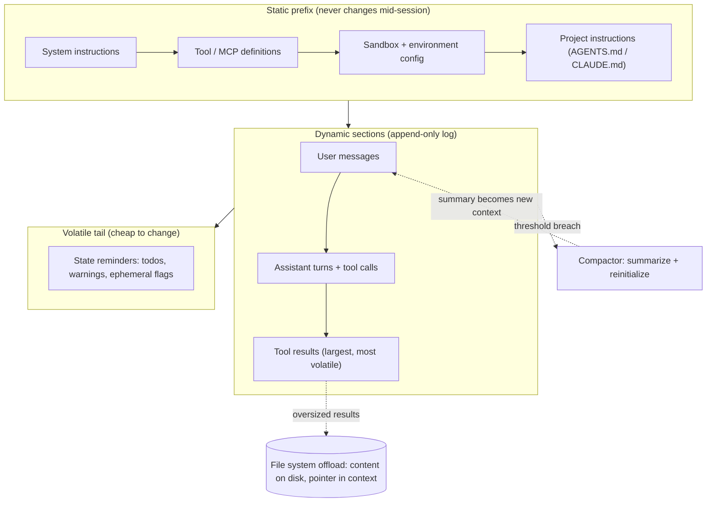

> [!info] Context
> Part of [[Harness-Internals-Overview|Harness Engineering Internals]]. Chapter: Context Engineering as a Systems Problem: Compilation, Packing, and the KV-Cache Contract. Depth level 1.

# Context Engineering as a Systems Problem: Compilation, Packing, and the KV-Cache Contract

## 1. Executive Overview

Every request an agent harness sends to a model is a single, flat token sequence. The model doesn't see your database of tool definitions, your conversation store, or your file system — it sees one compiled artifact, assembled milliseconds before the call. Context engineering is the discipline of building that artifact well, and it is a systems problem, not a writing problem: you are allocating a scarce resource (the model's attention) under a hard capacity limit (the window), subject to a brutal economic constraint (prompt caching only pays off if your byte layout is stable), while the resource itself degrades as you fill it.

Three facts make this hard. First, model accuracy measurably decays as input grows — Chroma tested 18 frontier models and every one got worse with length, non-uniformly ("context rot"). Second, position matters: models attend most strongly to the beginning and end of context and lose things in the middle. Third, the KV cache turns your prompt layout into a binary contract — change one token near the front and you pay full price for everything after it, a 10x cost difference on cached-heavy workloads. Manus calls KV-cache hit rate "the single most important metric for a production-stage AI agent," and once you see the math you'll agree. This chapter builds the whole discipline from those three facts.

## 2. Historical Evolution

The pre-history is prompt engineering: one human, one request, one hand-crafted string. Effort went into wording — few-shot examples, chain-of-thought phrasing — because the input was small and constructed once. Nothing about it was a *systems* problem; there was no loop, no accumulation, no cost curve.

RAG broke that first. Retrieval pipelines started machine-assembling prompts from chunks, and suddenly the questions were engineering questions: how many chunks, in what order, deduplicated how? The "needle in a haystack" benchmarks appeared here, and they were misleading — models aced synthetic needle retrieval, so vendors advertised 128K–1M windows as if capacity were the whole story. Chroma's 2025 context-rot study demolished that: on realistic tasks with distractors and low needle–question similarity, all 18 tested models degraded well before the advertised limit, and degradation was non-uniform — cliffs, not slopes. Long windows shipped before long-window *reliability* did.

Agents broke it a second time, structurally. An agent loop appends a tool result to the context on every step and re-sends the whole thing. Manus reports an average input-to-output ratio around 100:1 — the model reads a hundred tokens for every one it writes. Context stopped being a document and became an append-only log that grows for hours. Naïve string concatenation now had a quadratic cost curve and a degrading-accuracy curve, simultaneously.

The third shift came from the serving side. In 2024, providers exposed prompt caching (Anthropic explicit `cache_control`, OpenAI automatic prefix caching), passing an inference-runtime optimization — KV-state reuse for identical prefixes — through to the API as pricing: cache reads at 0.1x input price on Anthropic, 50–90% discounts on OpenAI depending on model. This changed context assembly from a quality concern into a cost-and-latency concern with a hard technical constraint: *exact byte-prefix match or nothing*. The moment that pricing existed, every serious harness (Claude Code, Codex CLI, Manus) reorganized its prompt layout around cache preservation. That reorganization — treating the context as a compiled artifact with a stable ABI — is what this chapter teaches. The arXiv survey "Context Engineering 2.0" (2510.26493) frames the whole arc usefully: context engineering is entropy reduction, converting high-entropy human intention and world state into a low-entropy sequence a machine can act on, and each generation of machine intelligence changes how much reduction the human side must do.

## 3. First-Principles Explanation

Start with why context is scarce even when the window is huge.

**Attention degrades with length.** A transformer computes pairwise relationships between tokens — n² of them. At 10,000 tokens that's 100 million pairs competing for a fixed amount of representational capacity. Anthropic's engineering guidance names the consequence directly: models have an "attention budget" that depletes as you add tokens. The empirical evidence is consistent across three independent lines. Liu et al.'s "Lost in the Middle" showed a U-shaped accuracy curve: in a 20-document context, moving the answer document from position 1 to the middle cost 30+ points of accuracy — models attend strongly to the start (primacy) and end (recency) and under-attend the middle. Chroma's context-rot work added the interaction effects: degradation accelerates when the needle is semantically *dissimilar* to the question, a single distractor measurably hurts, and — the finding that surprises everyone — models did *better* on shuffled haystacks than logically coherent ones, across all 18 models. Drew Breunig's synthesis gives the operational ceilings: Gemini 2.5 Pro started favoring repeating actions from its history rather than planning fresh beyond ~100K tokens; Databricks found Llama 3.1 405b correctness falling around 32K. The design consequence: Anthropic's stated goal for context engineering is finding "the smallest possible set of high-signal tokens that maximize the likelihood of some desired outcome." Not the most complete set. The smallest high-signal set.

**The KV cache makes layout a contract.** During prefill, the model computes key/value tensors for every input token. Those tensors depend only on the tokens *before* them — that's what causal attention means. So if two requests share an identical token prefix, the KV state for that prefix is identical and can be reused instead of recomputed. Providers expose this as cached-token pricing. But the reuse condition is exact prefix identity: token t's cached state is valid only if tokens 0..t-1 are byte-identical to the cached run. One changed token at position 0 — a timestamp, say — invalidates every cached token after it. There is no partial credit, no fuzzy matching. Manus states it plainly: "even a single-token difference can invalidate the cache from that token onward."

**Now derive the agent cost curve.** An agent loop re-sends the full history each step. With a fixed per-step growth of k tokens, step i sends roughly i·k input tokens; over n steps total input is O(n²·k). Concretely, from the Codex CLI analysis: a 20-turn session at ~50,000 tokens per turn costs about $1.25 in input at GPT-5.4 rates uncached; at an 85% cache hit rate it costs ~$0.72 — and the deeper the session, the larger the fraction of each request that is cached history, so marginal turn cost approaches the *new* tokens only. Caching turns a quadratic spend into a near-linear one. That is why the harness's prompt layout, not its prompt wording, is the first-order cost lever. Latency follows the same shape: cached prefixes skip prefill compute, and one controlled measurement (ankitbko's KV-cache study) put median time-to-first-token at 953ms with stable prefixes versus 2,727ms with perturbed ones — a 65% improvement — alongside a 71.3% cost reduction, with stable prompts hitting an 85.2% cache rate and perturbed ones hitting exactly 0%.

So the two forces of the discipline point in opposite directions, and that tension generates every technique in this chapter. Attention economics says: keep the context small, prune aggressively, remove stale junk. Cache economics says: never touch anything you've already sent, only append. Every packing, compaction, and offloading strategy that follows is a negotiated settlement between those two constraints.

## 4. Mental Models

**Context is a compiled artifact, not a string.** The harness holds structured state — session config, tool registry, message history, tool results, memory files — and on every model call it *compiles* that state into a token sequence. Like any compiler, it has a source representation, transformation passes (truncation, masking, summarization), and a target layout constrained by the platform. The platform constraint here is the cache: your layout has an ABI, and the stable prefix is the part you've promised not to change. Break the ABI, pay the recompile.

**Memory hierarchy, not filing cabinet.** Think of the context window as RAM: fast to access, expensive, small. The file system is disk: slow (one tool call away), cheap, unbounded. Compaction is page eviction with lossy compression; a reference to a file path is a pointer; re-reading the file is a page fault you deliberately take. Manus designed exactly this: the file system as "unlimited in size, persistent by nature" external memory, with the rule that compression must be *restorable* — drop a web page's content from context but keep its URL; drop a document's body but keep its path. You can always dereference the pointer later. Irreversible deletion is the thing you never do to information you might need.

**Attention is the scarce resource; tokens are just the unit of account.** A budget of 200K tokens is not 200K units of equal value. Tokens at the front and back of the sequence get more attention than tokens in the middle (the U-curve); tokens semantically close to the current question get retrieved more reliably than distant ones (Chroma); and every irrelevant token doesn't just waste its own slot — it actively dilutes attention over the relevant ones (a single distractor measurably reduces accuracy). Budgeting decisions are therefore two-dimensional: *whether* something is in context, and *where* it sits.

## 5. Internal Architecture

A production context compiler is organized by **volatility** — how often each section changes — because volatility order and cache-optimal order are the same thing: stable content first, volatile content last. This is the verified layout of Codex CLI (open-source, so checkable) and, per Anthropic's caching docs, the enforced cache hierarchy of the Claude API itself (tools → system → messages, with changes at any level invalidating that level and everything after it).



The components and their responsibilities:

**Static prefix builder.** Assembles everything that is identical for the whole session: system prompt, tool schemas, environment context, project instruction files. The contract: built once at session start, then frozen. Codex CLI keeps system instructions, tool definitions, sandbox configuration, and environment context "identical and consistently ordered between requests" precisely to preserve exact-prefix matches. Corollary: all MCP servers must be configured *before* the session starts — adding one mid-session inserts tokens into the prefix and invalidates everything.

**Append-only transcript.** User turns, assistant turns, tool calls, tool results, appended in order and never edited in place. Manus: "Make your context append-only. Avoid modifying previous actions or observations" — and ensure deterministic serialization, because a JSON library that doesn't guarantee key order will silently reorder `{"theme":"dark","language":"en"}` into a different byte sequence and zero out your cache.

**Budget allocator.** Tracks token counts per section against the effective window (context limit minus reserved output headroom) and triggers interventions at thresholds. Claude Code reserves output space and fires auto-compaction near ~92% of the effective window (inference — from community reverse-engineering of the minified client, not officially documented; the observed formula is effective window ≈ context window − max-output-reservation, compaction at effective − 13K).

**Packers/pruners.** Per-section policies that shrink content *at ingestion time* — truncating a 200KB tool output to head+tail before it ever enters the transcript, swapping oversized bodies for file references. Ingestion-time is the key word: filtering content before it's appended costs no cache, while editing it after it's appended breaks the prefix. TokenPilot (arXiv 2606.17016) names this exact trade-off — "text sparsity vs. prompt cache continuity" — and gets its 56–61% cost reductions by gating noise at ingestion and evicting only in conservative batches at turn boundaries.

**Compactor.** The threshold-triggered summarizer that replaces the transcript wholesale. Covered in depth in §8.

**Volatile tail.** Anything that legitimately must change per-turn — todo-list recitations, ephemeral warnings, injected state — goes at the *end* of the message list, after all cached content, where changing it invalidates nothing. Claude Code injects system reminders into conversation messages rather than the system prompt for exactly this reason (inference — consistent with observed request traces and community analysis, and with Anthropic's documented cache hierarchy).

## 6. Step-by-Step Execution

Walk one turn of a coding agent, mid-session, turn 14. The harness state: 12K-token static prefix, ~90K tokens of transcript, a todo list with three open items.

The user (or the loop) produces the next input — say the previous assistant turn requested `read_file("src/auth.py")` and the tool has just returned 40KB of text.

**Step 1 — Ingestion.** The tool-result packer inspects the 40KB result (~10K tokens) against its per-result budget (say 4K). Policy: keep in full if under budget; else write the full content to a scratch file and append a truncated view plus the pointer: first 100 lines, a marker `[... 812 lines truncated — full content at /tmp/tool-results/t14-read.txt ...]`, last 40 lines. The information is demoted to disk, not destroyed — restorable compression.

**Step 2 — Assembly.** The compiler concatenates: frozen static prefix (byte-identical to turn 13), transcript turns 1–13 (byte-identical — append-only), the new tool result block, then the volatile tail (the todo recitation, rewritten this turn: item 2 checked off). Total: ~104K tokens, of which ~100K are identical to the previous request's prefix.

**Step 3 — Cache negotiation.** On Anthropic's API the harness sets `cache_control` breakpoints (max 4) — typically end of tools, end of system, end of the previous transcript. The server hashes prefixes, walks back up to 20 blocks from each breakpoint looking for entries written by prior requests, and finds the turn-13 entry: ~100K tokens read from cache at 0.1x price, ~4K new tokens charged at 1.25x as a cache write, and the volatile tail charged as ordinary input. On OpenAI the same thing happens implicitly — requests route by a hash of the first ~256 tokens (plus `prompt_cache_key` for stickiness), and the longest matching prefix in 128-token increments is reused. Prefill for 100K tokens is skipped; time-to-first-token drops accordingly.

**Step 4 — Budget check.** Post-assembly count: 104K of, say, a 187K effective threshold. No compaction. Had it crossed the threshold, the harness would fork a summarization call *before* the main call (see §8).

**Step 5 — Model responds**, emits the next tool call. The response is appended to the transcript verbatim — including its exact formatting, because next turn it must be byte-identical. The loop repeats. Note what the design bought: the marginal cost of turn 14 was essentially the new tool result plus the tail, not the 104K total. That is the linear-not-quadratic agent loop.

## 7. Implementation

If you build this yourself, the load-bearing abstraction is a section list with volatility classes and per-section policies:

```python
class Section:
    id: str
    volatility: Literal["static", "append_only", "volatile"]
    budget: TokenBudget          # soft cap + hard cap
    packer: Packer               # ingestion-time shrink policy
    render() -> list[Block]      # deterministic! stable ordering, stable serialization

class ContextCompiler:
    sections: list[Section]      # ordered: static -> append_only -> volatile

    def compile(self) -> Request:
        blocks = []
        for s in self.sections:
            blocks += s.render()
        assert self.prefix_unchanged(blocks)   # ABI check: static+append_only
                                               # regions byte-match last request
        return Request(blocks, cache_breakpoints=self.place_breakpoints(blocks))

    def ingest_tool_result(self, result):
        packed = self.tool_section.packer.pack(result)   # truncate / offload BEFORE append
        self.tool_section.append(packed)                  # never edit after this
        if self.total_tokens() > self.compact_threshold:
            self.compact()
```

Design points that matter in practice:

- **The ABI assertion is not optional.** The single most valuable test in a harness is one that compiles context twice from the same state and diffs the bytes, and one that compiles turn n and turn n+1 and asserts turn n's request is an exact prefix of turn n+1's (modulo the volatile tail). Cache regressions are silent — nothing errors, you just pay 10x — so you need telemetry too: log `cache_read_input_tokens` / total input per call (Anthropic returns these fields; Codex CLI exposes `codex.cache.hit_rate` via OpenTelemetry) and alert when session hit rate drops below your baseline.
- **Determinism everywhere.** Sorted JSON keys, stable tool ordering, no locale-dependent formatting, no `datetime.now()` anywhere near a static section. If the model needs the current time, put it in the volatile tail or inject it via a tool.
- **Packers are pure functions of the raw result** — content-addressed offload paths (hash of content) keep even the pointers deterministic.
- **Compaction runs as a separate model call** with its own prompt, ideally forked so the main loop's transcript isn't polluted by the summarization instructions.
- **Concurrency:** a cache entry only becomes available after the first response begins (Anthropic-documented), so n parallel cold-start requests with the same prefix will each pay the write. Warm the cache first — Anthropic supports `max_tokens: 0` as an explicit pre-warm — then fan out. And keep any single prefix under ~15 requests/minute on OpenAI, or traffic spills to additional servers that each miss once.

## 8. Design Decisions

**Append-only vs. in-place editing.** The intuitive design edits history — delete stale tool outputs, fix earlier errors, reorder for relevance. Every production harness rejected it, because any in-place edit invalidates the cache from the edit point forward, and mid-context edits also disturb the model's established reading of the transcript. The costs of append-only — stale content lingers, budget pressure grows — are handled downstream by compaction. Manus even keeps *failed actions* in context deliberately: "leave the wrong turns in the context," because seeing its own error and the resulting stack trace is how the model stops repeating the mistake. Cleaning errors out of the transcript deletes the evidence the model adapts from.

**Masking vs. removing tools.** When you want to constrain the action space mid-session, deleting tool definitions is the obvious move and the wrong one: tool schemas sit at the front of the context, so removal invalidates the entire cache, and past turns now reference tools that no longer exist — confusing the model. Manus instead masks token logits during decoding via a context-aware state machine, preventing (or forcing) specific tool selections without touching the serialized definitions, with consistent name prefixes (`browser_`, `shell_`) so whole tool families can be masked by prefix. The trade-off: logit masking needs serving-stack support (response-prefill or constrained decoding); harnesses on plain APIs approximate it with instruction-level constraints in the volatile tail. See [[Harness-Internals-Tool-Calling-Internals]] for the decoding mechanics.

**Compaction vs. reset.** When the budget is breached you can summarize-and-continue or start a fresh session. Compaction preserves continuity but is lossy and destroys the cached prefix in one shot (the new context shares no prefix with the old — the full post-compaction context is re-prefilled at write prices). Reset is cheap and clean but loses everything not externalized. The decision rule that falls out of production practice: compaction for mid-task budget pressure, reset (plus external state files) at task boundaries. The Codex CLI guidance quantifies the timing: on a 1M-window model, set the auto-compact limit around 150–200K tokens — not because the window is full, but because model quality degrades in deep contexts (§3) and because delaying compaction that long means you've amortized the cached prefix across 30–50 turns before paying the reset. What must survive compaction is the real design content: Anthropic's guidance says preserve architectural decisions, unresolved bugs, and implementation details; discard redundant tool outputs. Claude Code's compaction prompt (inference — community extraction from the client) makes the model produce a structured summary — primary intent, technical concepts, files touched with snippets, errors and fixes, all user messages verbatim, pending tasks, current work, next steps — and rehydrates recently-read files and the todo list into the fresh context. The pattern to steal: compaction output is a *schema*, not a freeform summary, and user intent plus file paths are its non-negotiable fields. Losing a file path is losing a pointer into external memory — the one class of loss that isn't restorable.

**Just-in-time retrieval vs. pre-loading.** Pre-loading (classic RAG: embed, retrieve, stuff everything upfront) buys latency and works when the needed information is predictable. JIT retrieval — the agent holds lightweight identifiers (paths, queries, URLs) and loads data via tools when needed — buys context efficiency and freshness, at the cost of tool-call round-trips. Anthropic's framing: JIT mirrors human cognition — we don't memorize corpora, we maintain file systems and look things up. Claude Code is explicitly hybrid: CLAUDE.md dropped into context upfront; everything else explored with `grep`/`glob` at runtime. The deciding variable is predictability of information need: high → pre-load; low (open-ended agentic work) → JIT.

**Sub-agent isolation as context engineering.** A sub-agent is a context-window management device before it is anything else: fork a task into a fresh window, let it burn tens of thousands of tokens on exploration, and return only a condensed answer — Anthropic cites 1,000–2,000 token summaries — to the orchestrator. The orchestrator's context stays clean and its cached prefix stays intact (the sub-agent's churn happens in a different cache line entirely). The cost: information loss at the boundary, and coordination failures when the sub-agent lacked context the orchestrator forgot to pass. That trade — Cognition famously argues against multi-agent designs for exactly this reason — is covered in [[Harness-Internals-Agent-Loop-Architecture]].

**Recitation.** Manus's todo.md trick: the agent maintains a todo file and re-writes it into the *end* of context each turn. This is a pure attention play — copying the global plan into the recency-favored tail biases attention toward goals that would otherwise sit 50 tool calls back in the under-attended middle. It costs tokens and (in the tail) no cache, and it measurably reduces goal drift on Manus's ~50-tool-call tasks. The operator-side discipline of maintaining such files is covered in [[Harness-Engineering-Hub]] and its state-persistence notes; here the point is that harnesses *automate* it.

## 9. Failure Modes

**Silent cache annihilation.** The classic: a timestamp, request ID, or user-personalization string interpolated near position 0. Every request becomes unique; hit rate is 0%; nothing errors; the bill is 10x. Variants: non-deterministic JSON key ordering, an AGENTS.md that embeds a git-generated line count, MCP servers registered mid-session, toggling `tool_choice` or thinking parameters (which invalidate the messages-level cache on Anthropic even though tools/system survive), reordering tools between requests, a proxy that strips `prompt_cache_key`. Debug by diffing consecutive raw request bodies byte-by-byte — the first divergence is your leak — and by watching `cache_read_input_tokens` per call.

**The 20-block lookback miss (Anthropic-specific).** Cache reads walk back at most 20 content blocks from each breakpoint. Append 30 small blocks between breakpoints and your previous entry falls outside the window: a miss despite a byte-perfect prefix. Fix: place breakpoints so no gap exceeds 20 blocks.

**Context poisoning.** A hallucination enters the transcript and, because the transcript is append-only and trusted, gets re-read as fact every turn. Breunig's example: Gemini 2.5 playing Pokémon hallucinated game state into its goals section and then fixated on impossible objectives. Mitigation is structural, not corrective — you can't edit it out without a cache reset — so validate at ingestion (schema-check tool results) and let compaction act as a filter that drops unverified claims.

**Distraction, confusion, clash.** The other three of Breunig's taxonomy. Distraction: past ~100K tokens Gemini 2.5 Pro favored repeating actions from history over planning fresh. Confusion: on the GeoEngine benchmark a quantized Llama 3.1 8b failed with all 46 tool definitions in context and succeeded with 19 — irrelevant tools aren't neutral, they're distractors. Clash: the Microsoft/Salesforce sharded-prompt study found a 39% average drop when task information arrived across turns instead of at once (o3: 98.1 → 64.1), because models commit to early assumptions and over-rely on their own premature answers sitting in the transcript.

**Compaction data loss.** The summary drops a file path, a user constraint, or the fact that approach A already failed; the agent re-explores, re-fails, or violates the constraint — often *confidently*, since the contradicting evidence is gone. Detect with post-compaction evals: seed a session with a constraint, force compaction, test whether behavior still honors it.

**Truncation corruption.** A byte-limit truncator cuts a tool result mid-JSON-object or mid-diff. The model sees malformed structure and either errors or hallucinates the missing half. Truncate on structural boundaries (lines, objects, list items) and always mark the cut explicitly with a pointer to the full content.

**Budget accounting drift.** The harness estimates tokens with a local tokenizer that disagrees with the server (images, tool-schema serialization overhead are the usual culprits); sessions die with hard 400s at "80% usage." Reconcile your estimate against the API's returned usage every call and correct the drift.

## 10. Production Engineering

**Manus (verified — first-party blog).** The most explicit public numbers: KV-cache hit rate as the #1 production metric; 100:1 input:output ratio; $0.30 vs $3.00/MTok cached-vs-uncached on Claude Sonnet. Practices: stable prefix (no timestamps), append-only with deterministic serialization, explicit cache breakpoints where the provider requires them, logit-masking over tool removal, file system as restorable external memory, todo.md recitation, errors kept in context, and deliberate variation injected into serialized actions to break few-shot mimicry ruts. They rebuilt their framework four times as they learned this — context shape drove architecture, not vice versa.

**Claude Code (mixed).** Verified from Anthropic's engineering posts: hybrid retrieval (CLAUDE.md upfront, agentic search for the rest), compaction that preserves decisions/bugs/details while discarding redundant tool outputs, sub-agents returning condensed summaries. Inference (community reverse-engineering of the minified client; consistent across independent analyses but not officially documented): a tiered system — cache-aware rearrangement of volatile content without model calls ("microcompaction"), threshold-triggered full compaction near 92% of effective window using a forked call with a structured multi-section summary schema, verbatim retention of user messages, and rehydration of recent files and todos after reset; system reminders injected into messages rather than the system prompt to protect the stable prefix. See [[Harness-Internals-Claude-Code-Architecture]].

**Codex CLI (verified — open source).** The cleanest reference implementation of cache-ordered layout: system instructions → tool/MCP definitions → sandbox config → environment context → developer config instructions → AGENTS.md → user context → conversation, with everything through the first user message frozen. Uses `prompt_cache_key` for router stickiness; documents that mid-session MCP changes, unstable AGENTS.md content, and aggressive compaction are the main cache killers; exposes cache hit rate via OpenTelemetry. See [[Harness-Internals-Codex-Architecture]].

**The providers themselves (verified — official docs).** Anthropic: explicit `cache_control`, up to 4 breakpoints, tools→system→messages hierarchy, 5-minute TTL refreshed free on each hit (1-hour TTL at 2x write price), 1.25x write / 0.1x read, per-model minimum cacheable sizes (512–4,096 tokens), 20-block lookback, `max_tokens: 0` pre-warming. OpenAI: automatic prefix caching above 1,024 tokens in 128-token increments, routing by hash of the first ~256 tokens plus optional `prompt_cache_key` (one coding customer: 60% → 87% hit rate by adding it), discounts from 50% (gpt-4o) to 90% (gpt-5-nano), ~15 requests/minute per prefix before overflow. The convergence is the story: three independent harness teams and two providers all landed on *stable prefix, append-only body, volatile tail* — because the KV cache's exact-prefix constraint admits essentially one optimal layout. Where they diverge (explicit vs automatic caching), Anthropic is selling control — you choose what's worth the 1.25x write premium — and OpenAI is selling zero-config defaults at a shallower discount on most models.

## 11. Performance

The numbers that should drive your design reviews:

- **Cost:** cache reads are 0.1x input price (Anthropic) or 50–90% off (OpenAI, model-dependent). On a 100:1 input-heavy agent workload, hit rate is *the* cost lever: the controlled ankitbko measurement showed 71.3% total cost reduction from prefix stability alone ($95,560 vs $333,060 annualized at 10K requests/day).
- **Latency:** prefill skipping cut median TTFT 65% in the same measurement (953ms vs 2,727ms); the Codex analysis cites up to 80% TTFT reduction on long prefixes. For interactive agents TTFT *is* perceived speed, since each of a session's dozens of calls pays it.
- **Write economics (Anthropic):** the 1.25x write premium is recovered on the first hit; break-even is ≥1 reuse within TTL. Agent loops reuse every turn, so always-cache is correct; one-shot batch jobs with unique prompts should not cache.
- **Compaction economics:** one full compaction costs a summarization call plus a full re-prefill at write prices, then restores cheap turns. Late-but-not-too-late is optimal: late enough to amortize the prefix (30–50 turns), early enough to stay under the quality-degradation knee (§3) — hence 150–200K triggers even on 1M windows.
- **Attention budget:** treat the advertised window as capacity, not usable budget. Chroma's data plus the Databricks/Gemini distraction ceilings argue for keeping working context well under half the window for reliability-critical work.
- **What to monitor:** per-call cached/total input ratio, per-session hit rate, TTFT distribution, compaction frequency, tokens-per-task. A hit-rate regression is a layout bug; a tokens-per-task regression is a packing bug.

Everything GPU-side — paged KV blocks, prefix-tree sharing across requests, cache eviction on the serving fleet — belongs to [[Harness-Internals-Runtime-Optimization]]; this chapter's contract is just: *identical prefix in, discount out*.

## 12. Best Practices

Freeze the prefix at session start — system prompt, tools, MCP servers, instruction files — and treat any mid-session change as a session restart. Keep the transcript append-only with deterministic serialization. Push everything that must change per-turn to the tail. Pack at ingestion, never by editing history: truncate on structural boundaries, mark cuts, offload big payloads to disk with restorable pointers. Give compaction a schema and make user intent, decisions, failures, and file paths mandatory fields. Prefer masking to removal for tools; prefer sub-agents to letting exploration churn flood the orchestrator; prefer JIT retrieval when information needs are unpredictable. Keep errors in context. Recite goals into the tail on long tasks. Instrument cache hit rate from day one and diff raw request bytes when it drops.

The anti-patterns are the mirror image: timestamps or per-user strings in the system prompt; "helpful" relevance-based reordering of history (cache-fatal and, per Chroma's shuffled-haystack result, not even clearly better for accuracy); deleting failed attempts; unbounded tool results appended raw; loading 40 tools when 10 are relevant; compacting eagerly at 50% "to be safe," paying reset costs while losing context the model was using perfectly well.

## 13. Common Misconceptions

**"Long windows made context engineering obsolete."** Backwards. Capacity grew; *reliable* attention didn't keep pace. Every one of Chroma's 18 models degraded with length, distraction ceilings appear far below advertised limits, and cost still scales with tokens sent. Bigger windows raised the ceiling on what a sloppy harness can waste.

**"Caching is the provider's job."** The provider supplies the mechanism; the hit rate is 100% determined by your byte layout. The same workload runs at 0% or 85% hit rate depending on whether you interpolated a timestamp. No provider setting fixes a moving prefix.

**"More relevant context is always better."** Placement and dilution matter as much as relevance. A relevant document in the under-attended middle can contribute less than a shorter context with it at the edge; a single distractor measurably reduces accuracy; 46 tools made a model fail where 19 succeeded. Curation beats accumulation.

**"Compaction is lossless if the summary is good."** Summarization is lossy by construction — that's its job. The correct posture is to decide *what class of loss is acceptable* (verbose tool outputs) and *what is not* (intent, decisions, failures, pointers), enforce it with a schema, and keep everything else restorable on disk.

**"Cleaning errors out of context helps the model."** It deletes the evidence the model adapts from. Manus keeps wrong turns in deliberately; error-hiding is one of the most common hand-rolled-harness mistakes.

## 14. Interview-Level Discussion

**Q1: Why does one changed token at position 0 invalidate the entire cache, and what does that force architecturally?**
Causal attention means token t's key/value tensors are computed from tokens 0..t; a change at position p makes every cached tensor at index ≥ p wrong, and providers only match exact prefixes. Architecturally it forces volatility-ordered layout (static → append-only → volatile), append-only transcripts, deterministic serialization, and pushing all per-turn state to the tail. It's an ABI: the prefix is a binary interface you commit to for the session.

**Q2: Your agent's per-task cost doubled with no code change to prompts. Debug it.**
First check `cache_read_input_tokens`/input ratio per call — cost doubling with flat token counts screams cache regression. Diff consecutive raw request bodies; the first divergent byte is the leak. Usual suspects: a dependency bump changing JSON key order, an MCP server now registering mid-session, config toggling `tool_choice` or thinking params, a proxy dropping `prompt_cache_key`, request rate exceeding ~15/min per prefix and spilling across servers. If hit rate is fine, check tokens-per-task instead: a packer regression (tool results no longer truncated) grows every subsequent request.

**Q3: Design the compaction trigger and survival policy for a coding agent.**
Trigger on effective window (window minus output reservation), around 80–90% of it — late enough to amortize the cached prefix across tens of turns, early enough to avoid both hard overflow and the quality knee. Survival schema: user intent and constraints (verbatim where possible), architectural decisions with rationale, attempted-and-failed approaches, file paths and key snippets, pending todos, current work, next step. Discard raw tool outputs — they're restorable via re-read. Rehydrate recent files and todos into the fresh context. Validate with evals that plant a constraint pre-compaction and test adherence post-compaction.

**Q4: When do sub-agents beat one long context, and what's the failure mode?**
When a subtask needs high token churn but produces a low-token conclusion — exploration, search, verification — isolation wins: the orchestrator's window and cache stay clean, and churn happens in a disposable cache line, with only a 1–2K summary returned. The failure mode is boundary information loss: the sub-agent lacks context the orchestrator didn't pass, or its summary omits what the orchestrator needed, and errors compound silently (Cognition's core argument against multi-agent splits). Rule: isolate read-heavy work aggressively; keep write/decision authority in one context.

**Q5: Anthropic charges 1.25x to write cache and 0.1x to read; OpenAI caches automatically at 50% off. What's each betting on?**
Anthropic's explicit model bets that sophisticated builders will exploit control: they choose breakpoints, pay a write premium only where reuse is likely, and get a deep 90% read discount plus features like 1-hour TTL and pre-warming — pricing that rewards engineered layouts. OpenAI bets on default coverage: no integration work, everyone above 1,024 tokens benefits, at a shallower discount (on most models). For a harness you control end-to-end, the explicit model extracts more value; for a heterogeneous developer base, automatic captures more aggregate savings. Both converge on the same constraint underneath: exact prefix reuse.

**Q6: Why might you keep a *stale* tool result in context rather than delete it, and when does the calculus flip?**
Deleting it invalidates the cache from that point (10x on all downstream history), removes evidence the model may still reference, and breaks transcript coherence — dangling references to actions that "never happened." Stale-but-present costs only its attention dilution. The calculus flips when accumulated staleness threatens the budget or measurably degrades behavior (distraction): then you take one *batched* intervention — compaction — paying the reset once instead of per-deletion. TokenPilot formalizes this as conservative batch-turn eviction beating continuous fine-grained pruning precisely because of cache continuity.

## 15. Advanced Topics

**Cache-aware context management as a research area.** TokenPilot (arXiv 2606.17016) is the first systematic treatment of the sparsity-vs-cache-continuity trade-off: ingestion-aware compaction to stabilize prefixes plus lifecycle-aware eviction that offloads segments only when task relevance expires, in batches at turn boundaries — 56–61% cost reductions over naïve pruning. Expect this to become a standard harness layer, and expect provider APIs to grow primitives for it (Anthropic's cache-editing work — the ability to restructure cached content server-side without full re-prefill — points that direction; currently beta/inference territory).

**Dynamic context ranking.** Re-scoring transcript segments each turn by relevance to the current sub-goal and packing accordingly collides head-on with cache economics — reordering is invalidation — so viable designs rank only within the volatile tail, or re-rank at compaction boundaries where the cache resets anyway. An open problem: ranking functions cheap enough to run per-turn that beat recency, given Chroma's evidence that even semantic-similarity intuitions (coherent beats shuffled) can be wrong.

**Attention calibration.** Rather than working around the U-curve, fix it: "Found in the Middle" (arXiv 2406.16008) shows positional attention bias can be calibrated to improve mid-context utilization. If serving stacks adopt this, the placement half of context engineering weakens — the packing/economics half doesn't.

**Learned compaction.** Today's summarization prompts are hand-written schemas. Training compaction end-to-end — optimizing summaries for downstream task completion rather than human-judged quality — is an obvious next step, with the eval infrastructure challenge of measuring "what did compaction lose" at scale (see [[Harness-Internals-Evaluation-Infrastructure]]).

**Entropy framing.** Context Engineering 2.0 (arXiv 2510.26493) casts the whole field as entropy reduction across human-machine interaction history, predicting that as models handle more raw high-entropy input themselves, the engineering burden shifts from *content curation* to *lifecycle management* — collection, storage, invalidation — which is precisely the systems territory this chapter covers. Long-term stores that persist across sessions are [[Harness-Internals-Memory-Systems]]'s domain.

## 16. Glossary

- **Context compilation**: deterministic assembly of structured harness state into the flat token sequence sent to the model.
- **KV cache**: stored key/value attention tensors for a token prefix, reusable when a new request shares that exact prefix; exposed via cached-token pricing.
- **Cache hit rate**: fraction of input tokens served from cache; the primary cost/latency metric for agent workloads.
- **Stable prefix**: the front region of the context guaranteed byte-identical across a session's requests.
- **Volatile tail**: end-of-context region where per-turn changes are placed because they invalidate nothing.
- **Cache breakpoint**: explicit marker (`cache_control`, Anthropic) designating a prefix position to write/read cache at; max 4 per request.
- **Context rot**: measured degradation of model accuracy as input length grows, non-uniform across position, similarity, and distractor conditions (Chroma).
- **Lost in the middle / U-shaped attention**: positional bias where start- and end-of-context tokens receive reliable attention and middle tokens don't (Liu et al.).
- **Attention budget**: the finite effective attention a model can distribute over context; the true scarce resource behind the token limit.
- **Observation masking / tool-output truncation**: ingestion-time shrinking of tool results before they enter the transcript.
- **Reference swapping / file-system offloading**: replacing bulky content with a pointer (path/URL) whose target remains retrievable — restorable compression.
- **Recitation**: re-writing goals/todos into the context tail each turn to hold attention on them (Manus todo.md).
- **Compaction**: threshold-triggered replacement of the transcript with a structured summary plus rehydrated essentials; lossy by design; resets the cache.
- **Microcompaction**: cache-preserving cleanup/rearrangement of volatile content without a model call (Claude Code; inference).
- **Just-in-time retrieval**: agent loads data via tools at need, holding only identifiers in context, vs. pre-loading everything upfront.
- **Sub-agent context isolation**: delegating token-churn-heavy subtasks to fresh windows that return condensed summaries.
- **Logit masking**: constraining tool selection at decode time instead of removing tool definitions from context.
- **prompt_cache_key**: OpenAI routing hint that increases the chance requests with the same prefix land on the same cache-holding server.

## 17. References

- **Anthropic — Effective context engineering for AI agents** (https://www.anthropic.com/engineering/effective-context-engineering-for-ai-agents). The canonical statement of attention budgets, "smallest set of high-signal tokens," JIT retrieval, compaction, note-taking, and sub-agents, from the team that ships Claude Code. Read first for the conceptual frame.
- **Manus — Context Engineering for AI Agents: Lessons from Building Manus** (https://manus.im/blog/Context-Engineering-for-AI-Agents-Lessons-from-Building-Manus). The best production war-story in the field: KV-cache-first design, 100:1 ratio, masking, file-system memory, recitation, keeping errors. Read second for how the frame survives contact with reality.
- **Anthropic — Prompt caching documentation** (https://platform.claude.com/docs/en/build-with-claude/prompt-caching). The authoritative mechanics: breakpoints, TTLs, pricing multipliers, invalidation hierarchy, 20-block lookback, pre-warming. Read when implementing.
- **OpenAI — Prompt Caching 201 cookbook** (https://developers.openai.com/cookbook/examples/prompt_caching_201). The routing internals of automatic caching: 256-token hash, `prompt_cache_key`, overflow behavior, discount tables, cache-busting catalog. Read alongside the Anthropic docs to understand the explicit-vs-automatic trade.
- **Daniel Vaughan — Prompt Caching in Codex CLI** (https://codex.danielvaughan.com/2026/04/21/codex-cli-prompt-caching-maximise-cache-hits-cost-reduction/). Concrete cache-ordered prompt layout of a real open-source harness, with cost math and invalidation triggers. The best worked example of this chapter's architecture section.
- **Ankit Sinha — Prompt Engineering for KV-Cache** (https://ankitbko.github.io/blog/2025/08/prompt-engineering-kv-cache/). A controlled experiment quantifying prefix stability: 85.2% vs 0% hit rate, 65% TTFT and 71% cost improvements. Read for the measurement methodology.
- **Chroma — Context Rot: How Increasing Input Tokens Impacts LLM Performance** (https://www.trychroma.com/research/context-rot). 18-model study behind every "long context degrades" claim here; the shuffled-haystack and distractor findings are required reading before trusting any placement intuition.
- **Liu et al. — Lost in the Middle** (https://arxiv.org/abs/2307.03172). The original U-shaped position-bias evidence. Read the figures if nothing else.
- **Drew Breunig — How Long Contexts Fail** (https://www.dbreunig.com/2025/06/22/how-contexts-fail-and-how-to-fix-them.html). The poisoning/distraction/confusion/clash taxonomy with the Pokémon, GeoEngine, and sharded-prompt evidence. The vocabulary your incident reviews will use.
- **TokenPilot: Cache-Efficient Context Management for LLM Agents** (https://arxiv.org/abs/2606.17016). Formalizes the sparsity-vs-cache-continuity trade-off and shows batch eviction beating continuous pruning. Read when designing a pruning layer.
- **Context Engineering 2.0: The Context of Context Engineering** (https://arxiv.org/abs/2510.26493). Historical and theoretical framing (entropy reduction, HCI→HAI phases). Read last, for perspective.
- **Inside Claude Code — Context Compaction** (https://y-agent.github.io/inside-claude-code/04-context-compaction.html). Community reverse-engineering of Claude Code's tiers, thresholds, and summary schema. Treat all specifics as inference, but the extracted compaction-prompt structure is directly reusable.

## 18. Subtopics for Further Deep Dive

### Compaction Pipeline Design
- **Slug**: Context-Compaction-Pipelines
- **Why it deserves a deep dive**: Compaction is the single most consequential lossy operation in a harness — its schema, trigger policy, and rehydration strategy determine whether long sessions stay coherent — and this chapter could only give it one section.
- **Has enough depth for a full chapter**: yes
- **Key questions to answer**: What summary schemas do production harnesses use and how do they differ per task domain? How do you eval compaction loss systematically? Can compaction be trained end-to-end against downstream task success?

### Prompt Cache Mechanics Across Providers
- **Slug**: Prompt-Cache-Provider-Mechanics
- **Why it deserves a deep dive**: The Anthropic/OpenAI/Gemini/Bedrock caching implementations differ in breakpoints, TTLs, routing, minimums, and pricing in ways that materially change harness design, and cache-editing-style APIs are emerging.
- **Has enough depth for a full chapter**: yes
- **Key questions to answer**: How does each provider's routing and eviction actually work? How should a multi-provider harness abstract over explicit vs automatic caching? What do emerging cache-editing primitives enable?

### Tool-Result Packing and Observation Management
- **Slug**: Tool-Result-Packing
- **Why it deserves a deep dive**: Tool results are the dominant token source in agent transcripts; truncation boundaries, offload formats, restorable pointers, and structured-output design form a coherent sub-discipline with its own failure modes.
- **Has enough depth for a full chapter**: yes
- **Key questions to answer**: What truncation strategies preserve model usability (head/tail vs structural vs semantic)? How should offloaded content be addressed and re-retrieved? How do you design tool output formats that are token-efficient by construction?

### Context Failure Taxonomy and Detection
- **Slug**: Context-Failure-Detection
- **Why it deserves a deep dive**: Poisoning, distraction, confusion, and clash are named but barely instrumented anywhere; detecting them at runtime (not post-mortem) is an open engineering problem with real production value.
- **Has enough depth for a full chapter**: yes
- **Key questions to answer**: What runtime signals indicate each failure mode? Can a harness auto-quarantine suspected poisoned segments without breaking cache? What benchmarks measure failure-mode susceptibility?

### Sub-Agent Context Topologies
- **Slug**: Sub-Agent-Context-Topologies
- **Why it deserves a deep dive**: The orchestrator/sub-agent boundary is fundamentally a context-partitioning decision, and the Anthropic-vs-Cognition disagreement over multi-agent designs is really a disagreement about acceptable information loss at that boundary.
- **Has enough depth for a full chapter**: yes
- **Key questions to answer**: What context should cross the fork boundary in each direction? When does isolation's cache/window benefit outweigh coordination loss? How do fork-with-full-context designs (Claude Code forks) change the calculus vs fresh-context designs?
