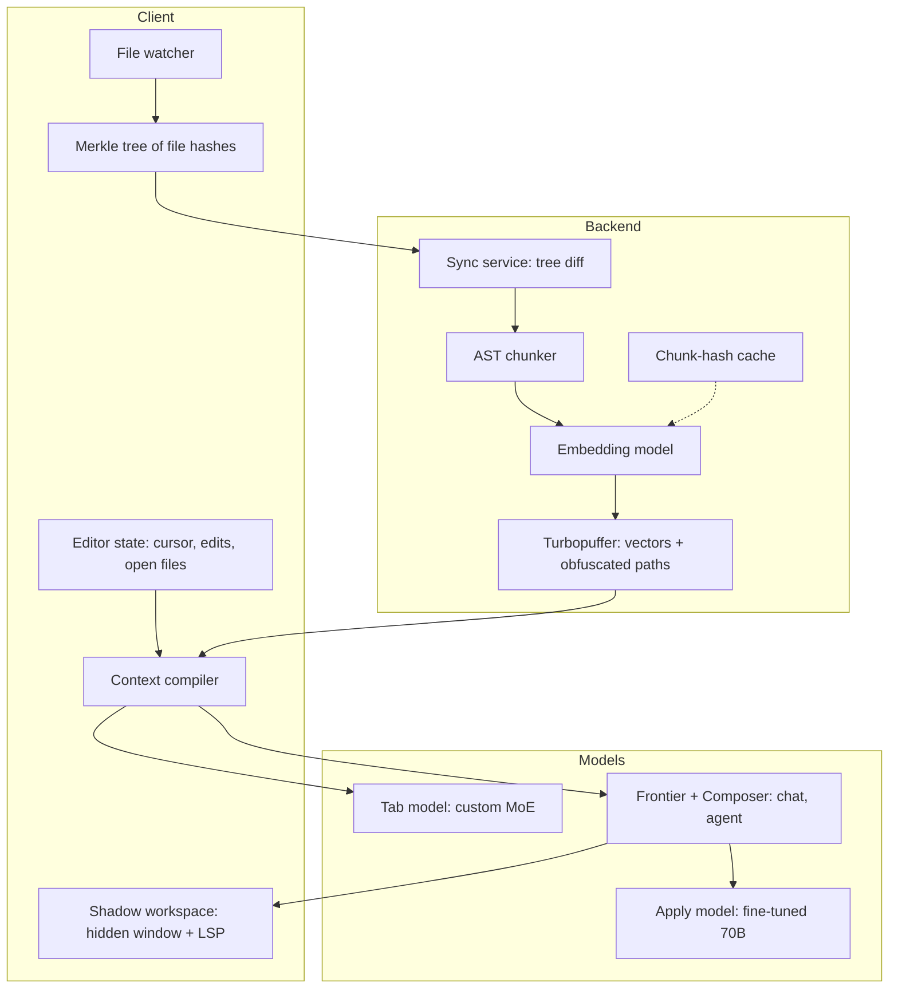

> [!info] Context
> Part of [[Harness-Internals-Overview|Harness Engineering Internals]]. Chapter: Cursor and the Architecture of AI IDEs: Indexing, Retrieval, Speculation, and Model Routing. Depth level 1.

# Cursor and the Architecture of AI IDEs: Indexing, Retrieval, Speculation, and Model Routing

> [!abstract] Epistemic ground rules for this chapter
> Cursor is a proprietary system. Everything below is labeled one of three ways: **(verified)** — stated in Cursor's own engineering blog, security documentation, or by founders on the record (the Lex Fridman interview, Aman Sanger's public posts); **(reported)** — secondary engineering analysis (ByteByteGo, Engineer's Codex, The Pragmatic Engineer) that is consistent with primary sources but not independently confirmable; **(inference)** — community reverse-engineering or my own reasoning from observable behavior. When a number appears without a label, it comes from a verified source named in that paragraph.

## 1. Executive Overview

An AI IDE is not a chatbot bolted onto a text editor. It is a distributed system with a hard real-time component: one leg runs on the user's laptop inside a forked editor process, the other runs on GPU clusters serving custom models, and the two are joined by a synchronization protocol, a retrieval index, and a family of latency budgets that range from "under 100 milliseconds perceived" for tab completion to "a few seconds" for chat. Cursor is the best-documented specimen of the species — its team has published real engineering blog posts on indexing, apply models, and background iteration — so this chapter uses it as the primary case study, with Windsurf, GitHub Copilot, and Zed as comparison points.

The reason this chapter belongs in a harness-engineering manual: an AI IDE is a harness whose tool surface is *the editor itself*. Where [[Harness-Internals-Claude-Code-Architecture|Claude Code]] gives the model a shell and a filesystem, Cursor gives the model cursor position, open buffers, recent edits, LSP diagnostics, and a semantic index of the whole repository — and then routes different models to different surfaces because the economics of a billion completions a day will not tolerate a frontier model on every keystroke. Every major theme of this manual — context compilation, caching economics, speculation, sandboxed verification — shows up here in its most latency-constrained form.

## 2. Historical Evolution

The lineage has three distinct generations, and each one was killed by a specific inadequacy.

**Generation one: static analysis completion (IntelliSense, ~1996–2021).** Completion was a symbol-table lookup: the editor's language service knew every identifier in scope and offered them alphabetically or by type compatibility. It was deterministic, instant, and correct — and it could only ever complete *names*, never *intent*. It had no way to write the loop body you were obviously about to write for the fifth time.

**Generation two: the completion plugin (GitHub Copilot, 2021).** Copilot's insight was that a language model trained on code could complete intent, not just symbols. Architecturally it stayed humble: a VS Code *extension* that assembles a prompt locally — code before the cursor, code after it, snippets from other open tabs — and sends it to a hosted model that fills in the middle. This worked, and GitHub published the numbers: fill-in-the-middle (sending suffix as well as prefix) produced roughly a 10% relative lift in acceptance rate, and "neighboring tabs" (snippets from other open files) added about 5% more (verified — GitHub engineering blog). But the extension architecture set a ceiling. An extension cannot render arbitrary UI inside the editor's core views, cannot spawn hidden editor instances, cannot intercept the rendering pipeline to paint multi-line diff previews inline, and has no privileged view of the whole workspace beyond what the extension API exposes. Copilot could suggest text at the cursor. It could not *be an editing partner*.

**Generation three: the forked IDE (Cursor, 2023).** Anysphere forked VS Code outright. The fork is the founding architectural decision, and everything else in this chapter descends from it — the custom Tab UI, the shadow workspace, the deep integration between retrieval and every surface. The cost was equally structural: a fork must continuously rebase against upstream VS Code, re-verify extension compatibility, and forgo the Microsoft-proprietary extensions (Pylance, the official C++ tools) that are licensed only to genuine VS Code builds. Cursor's founders judged — correctly, on the revenue evidence — that AI-native UX was worth a permanent merge tax.

The generation-three bet has since been validated from the other direction: Windsurf is also a VS Code fork, and Zed went further and built an entire editor from scratch (GPU-accelerated, in Rust) rather than inherit anyone's architecture. The industry converged on the same conclusion: **the plugin API of a host editor is the wrong abstraction boundary for AI-native features.** When multiple companies independently eat the same maintenance burden, the constraint they are escaping is real.

## 3. First-Principles Explanation

Strip the product away and an AI IDE must solve four problems. Each is forced by physics or economics, not fashion.

**Problem 1 — the model cannot see your repository.** A model has a context window of a few hundred thousand tokens at best; a working repository is millions. So the IDE needs a function `relevant(query, repo) → few thousand tokens`, and it needs it *fresh* — code changes every few seconds while you type. That forces an incremental semantic index: something that can answer "which chunks of this codebase relate to this question" without re-reading the codebase each time, and that can update itself cheaply when one file out of fifty thousand changes.

**Problem 2 — completion must be faster than thought.** Tab completion fires on keystrokes. Anything beyond a couple hundred milliseconds of perceived latency and the suggestion arrives after the programmer has already typed past it; the feature becomes noise. No frontier model round-trip fits that budget at acceptable cost. That forces custom small models, aggressive KV-cache reuse, and *speculation* — doing work before the user asks for it, betting that you can predict what they'll ask.

**Problem 3 — models are good at deciding what to change and bad at expressing where.** Ask a frontier model to emit a precise diff — with line numbers, exact context lines, correct whitespace — and it fails at a surprising rate. Cursor's instant-apply post gives the mechanistic reasons (verified): diffs force the model to reason in *fewer* output tokens (each forward pass is a unit of computation, so compressed formats give the model less room to think); diffs are out-of-distribution relative to the oceans of full files in pretraining data; and line numbers tokenize badly — a multi-digit number is often a single token, so the model must commit to an exact location in its very first output tokens, before it has "thought" about the edit at all. That forces a two-stage split: a smart model *plans* the change loosely, and a fast, specialized model *applies* it by rewriting the whole file. Full-file rewriting is only viable if you can decode at extreme speed, which forces speculative decoding.

**Problem 4 — the model's code is guilty until proven compilable.** Generated code must be checked — types, lints, ideally execution — *without* mutating the user's working state or blocking their editor. That forces some form of shadow environment where AI edits exist provisionally and language tooling can judge them.

Index, speculate, split plan-from-apply, verify in the shadows. Every AI IDE is some weighting of these four answers.

## 4. Mental Models

**The IDE is a context sensor array.** A terminal agent like Claude Code must *discover* context by running `grep` and reading files — spending tokens and turns to learn what the editor already knows. An IDE knows your cursor position, your last twenty edits, which files you have open, which symbol your caret is inside, and what the type checker thinks of it, all for free, continuously. The defining advantage of the IDE form factor is not the UI; it is this ambient, zero-marginal-cost context stream. The harness's job is compiling that stream into prompts — the same discipline as [[Harness-Internals-Context-Compilation]], with richer inputs and tighter budgets.

**Merkle sync is `git fetch` for embeddings.** Git transfers only the objects whose hashes the remote lacks. Cursor's index sync does exactly this between your disk and its vector store: hash everything into a tree, compare roots, walk only the differing branches. If you understand why `git fetch` is fast, you understand Cursor's indexer.

**Speculation is branch prediction.** A CPU doesn't wait to know which branch is taken; it guesses, executes ahead, and throws away work on a mispredict. Cursor applies the identical trick at three layers: speculative *edits* (guess the model will copy the original code, verify in parallel), speculative *requests* (guess the user will accept the suggestion, precompute the next one), and cache *warming* (guess which context the next request needs, prefill it while the user is still typing). Mispredictions cost compute; correct predictions collapse latency. The wager only pays because code editing, like program control flow, is highly predictable most of the time.

**The model portfolio is a CPU/GPU/ASIC hierarchy.** Frontier models are general-purpose CPUs: expensive, flexible, used where judgment matters (chat, agent planning). Custom mid-size models are ASICs: fixed-function, brutally optimized for one workload (apply = full-file rewrite; tab = next-edit prediction). Routing work to the cheapest unit that can do it is the entire cost story of serving billions of completions.

## 5. Internal Architecture

Cursor is three cooperating layers (verified in outline via Cursor's blog and security docs; component details labeled inline).

**The client** — the VS Code fork. Owns rendering (inline diff overlays, the Tab ghost text), the file watcher, Merkle tree computation, encryption of outbound code, and the shadow workspace host. Fork-level access is what lets it paint suggestions *inside* the buffer rather than in a side panel, and spawn hidden editor windows — both impossible through the extension API (verified — the shadow-workspace post describes the hidden window; extension-API limits are documented VS Code behavior).

**The backend** — API servers on AWS fronted by Cloudflare, with model serving split between Cursor's own fine-tuned models (hosted on Fireworks) and frontier providers (OpenAI, Anthropic, Google Vertex); vector search on Turbopuffer; the whole thing handling on the order of a million queries per second at peak, dominated by tiny autocomplete requests (reported — ByteByteGo's analysis, consistent with Cursor's published security documentation, which does name Turbopuffer, AWS, Fireworks, and the model providers).

**The index** — the piece that joins them, covered step-by-step in §6.

Notice the asymmetry the diagram encodes: *code* flows up from the client only transiently (encrypted, embedded, discarded), while *vectors and metadata* persist server-side. And the model boxes are deliberately plural — no single model serves Cursor; the router in front of them is a first-class component.

One more client-side component deserves a name: **Priompt**, Cursor's open-sourced prompt-composition library (verified — public on GitHub under Anysphere). It treats a prompt like a JSX render tree where every element carries a priority; when the assembled context exceeds the token budget, low-priority elements are dropped until it fits. This is context compilation as literal UI-style layout: the prompt has a responsive design, and the "viewport width" is the context window. If you read [[Harness-Internals-Context-Compilation]], Priompt is the cleanest public artifact of that whole discipline.

## 6. Step-by-Step Execution

### 6a. Indexing a repository end to end (verified — Cursor's secure-codebase-indexing post, except where labeled)

**Step 1 — scan.** On opening a folder with indexing enabled, the client walks the workspace, respecting `.gitignore` and `.cursorignore`, and computes a cryptographic hash per valid file. Hashes of files roll up into hashes of folders, folders into their parents, up to a single root: a Merkle tree. Scale check from Cursor's own post: in a fifty-thousand-file workspace, just filenames plus SHA-256 hashes are about 3.2 MB — which is why you sync the *tree*, never the file list.

**Step 2 — tree diff.** The client sends its root hash. If it matches the server's stored root, sync is done — one comparison. If not, client and server walk down the tree together, descending only into branches whose hashes differ. Entries with differing hashes get synced; matching subtrees are skipped wholesale. The client periodically re-checks (community observation puts the interval at every five to ten minutes, plus event-driven updates — inference; Cursor doesn't publish the schedule). The sync never modifies client files; it is strictly one-directional.

**Step 3 — chunking.** Changed files are split into *syntactic* chunks, not fixed byte windows (verified that chunks are syntactic; the specific tooling — tree-sitter parsing into an AST, then greedily grouping adjacent subtrees until a token limit is reached — is well-sourced community analysis, consistent with Cursor job postings, but not officially documented). The reason semantic chunking matters for code more than for prose: a byte-window chunker will happily cut a function in half, and half a function embeds to a vector that represents neither the function nor its neighbor. AST-aware chunking puts splits *between* functions and *between* statements, so each vector corresponds to a unit a programmer would recognize.

**Step 4 — embed, with a content-addressed cache.** Chunks go to the server (encrypted in transit), an embedding model computes vectors, and — critically — the result is cached **keyed by the hash of the chunk content**. Same chunk, same vector, no recompute. Because the key is content, the cache is shared: when your teammate indexes the same repository, or you re-clone it on a new machine, almost every chunk is a cache hit. Cursor later added a second-level trick (verified — the updated indexing post): a *simhash* summarizing a workspace's file-hash distribution is matched against existing indexes, so a new user can bootstrap from a teammate's nearly-identical index and sync only the delta — with **content proofs** required before reuse: if your client can't prove it actually possesses a file's content, results derived from that file are dropped. That closes the obvious attack of claiming hashes you don't have to read someone else's index.

**Step 5 — store.** What lands in Turbopuffer: the embedding vector, line-range metadata, and an **obfuscated file path** — path segments encrypted with a key held on the client, so the server can return "chunk at ⟨opaque-id⟩ lines 40–65" without ever knowing the path was `src/payments/invoice_processor.py`. The plaintext code itself is discarded after the embedding request completes; Cursor's stated invariant is that source code is never stored at rest server-side (verified as a *stated policy*; and note honestly — embeddings are not information-theoretically one-way, inversion attacks recovering approximate text from embeddings are published research, so the guarantee is "we don't store code," not "vectors leak nothing").

**Step 6 — incremental life.** Edit a file and only its leaf hash and the ancestor hashes up the spine change; the next tree diff isolates it in logarithmic comparisons; old chunks' vectors are deleted, new ones inserted. Cursor published the payoff of the full pipeline rework: median time-to-indexed for a returning repo fell from 7.87 s to 525 ms, p90 from 2.82 minutes to 1.87 s, and p99 from just over four hours to 21 seconds (verified).

### 6b. A retrieval-augmented chat query (verified pipeline shape; reranker details reported)

You ask "where do we validate webhook signatures?" The query is embedded with the same model as the index; nearest-neighbor search in Turbopuffer returns candidate chunks — but what comes back is only metadata: obfuscated paths and line ranges. The *client* decrypts the paths, reads those line ranges from local disk, and only then does actual code enter the prompt — from your machine, at inference time, for exactly the lines needed. This inversion is the privacy architecture's keystone: the vector store is a *pointer* store. On top of vector recall sits a reranker; Aman Sanger has described Cursor's rerankers as fine-tuned code models scoring large candidate sets per query (reported — founder posts and secondary analysis, not a formal blog post). Explicit `@file`, `@folder`, `@Codebase` symbols bypass or seed this pipeline — the user manually pinning context is both a feature and an admission that retrieval is imperfect.

### 6c. One Tab completion, microsecond by millisecond

You type a character. The client fires a request carrying the file region around your cursor plus your recent edit history. Server-side, the request lands on a custom sparse Mixture-of-Experts model (verified — Aman Sanger on the Lex Fridman podcast: the workload is "incredibly pre-fill token hungry" — huge input, tiny output — "the perfect fit for that is a sparse model, an MoE model"; MoE gives you big-model quality at small-model per-token FLOPs because only a few experts activate per token). The prompt is laid out so that its long prefix is byte-identical to the previous keystroke's prompt, so the KV cache from the last request is reused rather than re-prefilling thousands of tokens per keystroke — without this, Aman notes, latency and GPU load per keystroke would be unworkable (verified). Two speculative layers wrap the call: the client *warms the cache* with probable context while you are still mid-word, and on displaying a suggestion it *predicts ahead* — issuing the next request as if you had already accepted, so accepting feels instant (verified — both described by Aman on the record). The model itself is trained continuously: Cursor's online-RL post describes shipping a fresh Tab model every hour or two, rewarding accepted suggestions (+0.75), penalizing rejections (−0.25), with zero for staying silent — the asymmetry deliberately teaches the model to *shut up* unless confident. Result: 21% fewer suggestions with 28% higher acceptance (verified — Cursor blog). Interpret the reward math: a suggestion is worth showing only if its acceptance probability exceeds 25%.

### 6d. Apply: from chat suggestion to edited file

A frontier model in chat produces a loose code block — maybe with `// ... existing code ...` elisions. Naive deterministic patching of such blocks fails roughly 40% of the time (verified — Aman, Lex Fridman podcast), which is why "just string-match it in" is not a product. Instead the block, the conversation, and the current file go to the **apply model** — originally a fine-tuned Llama-3-70B — which rewrites the *entire file*. What makes full-file rewrite affordable is **speculative edits** (verified — the instant-apply post): in ordinary speculative decoding, a small draft model proposes tokens and the big model verifies them in a single parallel forward pass; Cursor noticed that for edits *the original file is the draft model*. Feed chunks of the existing code in as speculated output; the model verifies-and-accepts unchanged regions in bulk, decodes token-by-token only where the edit actually diverges, then resynchronizes to the original and resumes bulk acceptance. Deterministic speculation, no draft network, ~1000 tokens/second (~3500 chars/s) — a 13× speedup over vanilla decoding on the same 70B, and on Cursor's 450-case eval (graded by Claude 3 Opus) the fine-tune outperformed GPT-4-turbo and GPT-4o at the apply task (verified). Zed independently converged on the same trick using vLLM's n-gram speculative decoding — draft tokens proposed by matching n-grams already present in the prompt (verified — Zed blog). Two companies, same insight: **an edit is mostly a copy, so decode the copy in parallel and generate only the diff.**

### 6e. Shadow workspace: letting the AI fail privately (verified — Cursor's shadow-workspace post)

An agent writes code; before showing you anything it should at least know whether the type checker screams. Cursor's answer: spawn a *hidden Electron window* on the same workspace (`show: false` — the team notes hiding it is literally one line; everything else is the hard part). The hidden window is a full VS Code environment, so every language server the user has runs unmodified in it. The AI's edit travels from the visible window through gRPC/Protocol Buffers IPC (chosen over VS Code's stock JSON serialization) into the shadow window, is applied to in-memory buffers there, and the resulting LSP diagnostics — type errors, lint warnings — flow back as the model's next prompt. The loop runs until the linter is quiet or the budget runs out. Design goals were explicitly **LSP-usability** (the AI sees lints, can go-to-definition) and, aspirationally, **runnability** (the AI executes code). Costs and edges, all acknowledged in the post: ~2× memory (hence opt-in), auto-kill after 15 minutes idle, sequential multiplexing of concurrent AI requests through one window (reset folder state to agent A's, service it, reset to B's — AIs, unlike humans, tolerate pauses), and rust-analyzer breaks the model because it runs `cargo check` against *disk*, not virtual buffers. Runnability is where it gets ambitious: running code needs a real filesystem, `cp -r` of a repo plus its `node_modules` is hopeless, macOS `clonefile` measured at 45 s — too slow per request — so the post sketches a **kernel-level folder proxy**: a FUSE-style virtual filesystem that proxies reads to the real folder and captures writes in memory. Trivial on Linux (FUSE), blocked on macOS/Windows where shipping kernel extensions is effectively prohibited; NFS-loopback workarounds die on file locking (Cargo complains). The published pseudocode is ~20 lines; the platform politics are the actual obstacle. This is the IDE-shaped version of the sandboxing problem that [[Harness-Internals-Codex-Architecture|Codex]] solves with containers — same requirement, different substrate, and the LSP feedback loop is the part terminals can't replicate cheaply.

## 7. Implementation

Suppose you had to build a credible AI IDE core. The minimal system is four services and a client, and the interfaces are worth being concrete about.

**Client indexer.** A file watcher (debounced), an ignore-rule engine, and a Merkle tree kept in a local store (SQLite is fine). Interface to the server: `sync(rootHash) → done | descend(childHashes[])`, recursing on mismatch, then `upload(chunks[])` for changed files only. Hash with a fast cryptographic hash; include file mode and path in the leaf hash so renames are detected. The subtle requirements: never block the UI thread on hashing (do it in a worker), and make sync idempotent — the client will crash mid-sync and must reconverge.

**Chunker.** Parse with tree-sitter; walk the AST greedily accumulating sibling nodes until ~512–1024 tokens; emit `(contentHash, text, path, lineRange)`. Fall back to blank-line splitting for unparseable files. Property to test: no chunk boundary inside a function body unless the function alone exceeds the limit.

**Embedding service.** `embed(chunks[]) → vectors[]`, fronted by a content-addressed cache (`contentHash → vector`) in something cheap — object storage with a memory tier is enough, since the workload is read-heavy and immutable. This cache is your margin: across an organization, chunk-level dedup means most embeddings are computed once ever.

**Vector store.** Upsert `(vector, obfuscatedPath, lineRange)`; query `topK(queryVector, filter)`. The design decision that matters is *store pointers, not payloads* — resolve pointers to code on the client. You inherit Cursor's privacy posture and your store stays small.

**Completion path.** This is where engineering lives or dies. Rules that fall straight out of Cursor's public statements: keep the prompt prefix *stable across keystrokes* (append-only layouts so the KV cache survives — the same economics as [[Harness-Internals-Runtime-Optimization]]); use an MoE or otherwise prefill-cheap model; debounce on the client but speculate on the server (precompute the post-acceptance suggestion); and instrument acceptance rate per cohort from day one, because it is the only metric that matters and it feeds your training loop. For apply, implement speculative edits: seed the decoder with the original file as draft tokens, verify in parallel batches, drop to normal decoding on divergence, re-anchor by string-matching ahead in the original. The re-anchoring heuristic is the fiddly 20% that takes 80% of the time.

**Shadow verification.** You don't need a hidden Electron window to start: run `tsc --noEmit`/`ruff`/`cargo check` against an overlay directory (copy-on-write where the OS gives it to you, hardlink farm where it doesn't) and pipe diagnostics back into the agent loop as structured tool output. That gets you 70% of the shadow workspace at 5% of the complexity; the hidden-window design earns its keep only when you need *interactive* LSP features (go-to-definition chains, project-wide rename previews) rather than batch diagnostics.

## 8. Design Decisions

**Fork vs. extension.** The extension API is a deliberately narrow, stability-guaranteed contract; Cursor needed the renderer (inline diff overlays, custom Tab ghost text), the window manager (hidden windows), and the ability to restructure core UI. The hidden cost of forking is perpetual: tracking upstream VS Code, patch conflicts in the merge, extension-marketplace and proprietary-extension friction. GitHub Copilot, living inside first-party VS Code, gets distribution and zero merge tax but ships completion-and-panel experiences years behind Cursor's editing surfaces. Zed's from-scratch editor buys total control and native performance at the price of rebuilding thirty years of editor ecosystem. There is no free position; there is only choosing your tax.

**Server-side index vs. local index.** Windsurf historically emphasized local/hybrid indexing; Cursor centralized it. Central wins on: embedding-cache sharing across a team (the content-addressed cache and simhash bootstrap are *only* possible centrally), zero local GPU/CPU burden, and one place to upgrade the embedding model. Local wins on: no code-derived data leaves the machine, works offline, no sync protocol at all. Cursor's obfuscated-paths + discard-after-embedding design is engineered specifically to make central palatable to security teams — it is a negotiated middle, not an accident.

**Full-file rewrite vs. diff emission.** Covered mechanistically in §6d; the design lesson generalizes. When a model is unreliable at a *format*, you can either constrain decoding to force the format ([[Harness-Internals-Tool-Calling-Internals]] territory) or change the task to one the model is natively good at and eat the extra tokens with systems engineering. Cursor chose the second, and speculation made the extra tokens nearly free. Aider's community benchmarks reached a compatible conclusion — full rewrite beats diff formats on smaller files, diffs only win as files grow — which is why apply models care so much about long-context throughput.

**Custom models vs. frontier models per surface.** The routing (verified in shape from founder statements; exact current assignments are inference — they change quarterly): Tab → custom MoE, always; apply → custom fine-tune, always; chat/agent → frontier models (Claude, GPT, Gemini) or Cursor's own Composer, user-selectable; plus auxiliary custom models for embedding and reranking. Aman's framing: "Cursor really works via this ensemble of custom models trained alongside the frontier models." The dividing line is a rule you can reuse: **frontier models where the task is open-ended judgment; custom models where the task is narrow, latency-bound, and generates enormous volume.** Composer (verified — Cursor blog, Oct 2025) is the interesting boundary-crosser: an in-house MoE trained with large-scale RL (PyTorch + Ray across thousands of GPUs, MXFP8 quantization-aware kernels) on real agentic coding tasks inside full repositories, hitting near-frontier coding quality at ~250 tokens/s — roughly 4× faster generation than comparable frontier models. Its existence is a strategic claim: at sufficient volume, the application layer can afford to train its own frontier-adjacent model *specialized to its own harness*, and the harness data (millions of real agent sessions) is exactly the RL environment nobody else has.

## 9. Failure Modes

**Index staleness.** Between syncs, the vector store describes a repository that no longer exists; retrieval then feeds the model code that was deleted twenty minutes ago, and the model confidently references phantom functions. Mitigations: event-driven sync on save, and blending retrieval with *live* buffer contents so open files always override the index. Debug signal: retrieval results whose line ranges no longer match file contents.

**Chunk-boundary blindness.** Even AST chunking cannot make a 40-line function's callers visible in its chunk. Pure embedding retrieval misses "who calls this" almost structurally — that is a graph query, not a similarity query. This is why rerankers and grep-style exact search coexist with vectors in every serious system, and why agentic search (the model iteratively grepping) has been eating pure-RAG retrieval since 2025.

**Speculation mispredicts.** Predict-ahead Tab requests and cache warming burn GPU on suggestions never viewed. At a million QPS, a small mispredict-rate regression is a large money regression; the ratio of speculative to served work needs its own dashboard. Same class of bug as branch-predictor thrashing: correctness untouched, economics wrecked.

**Apply model resync failure.** Speculative edits must detect where the edit region ends and the original resumes. Repetitive code (switch arms, config blocks) can fool the re-anchoring: the decoder resumes copying at the *wrong* repetition, silently duplicating or dropping a block. This is the nastiest bug class in the pipeline because output remains syntactically plausible. Defense: post-apply structural diff between intended block and applied region, flag anomalies for full non-speculative redecode.

**Shadow workspace divergence.** Language servers that consult disk (rust-analyzer's `cargo check`) judge stale on-disk state, not the AI's in-memory buffers — the AI receives feedback about code it didn't write (verified as a known limitation). And a 2× memory multiplier per hidden window is a resource leak factory; the 15-minute reaper exists because windows *will* be orphaned.

**Privacy-boundary erosion.** Every feature added to the server side (new rerankers, git-history indexing, team caches) is a new chance to accidentally persist something derived from code. Embedding-inversion research means the vector store must be treated as *confidential*, not merely *anonymous*. The engineering control is architectural, not procedural: keep plaintext resolution client-side so there is nothing server-side to leak beyond vectors and opaque ids.

## 10. Production Engineering

**Cursor** (consolidated from the above; verified unless noted): Merkle-synced central index over Turbopuffer with content-addressed embedding cache and simhash index-reuse; custom MoE Tab model retrained on live acceptance signal every couple of hours; fine-tuned 70B-class apply model decoding at ~1000 tok/s via deterministic speculative edits; hidden-window shadow workspace for LSP-verified agent iteration; Composer for fast agentic coding; frontier models for chat/agent by user choice; ~1M peak QPS through Cloudflare into AWS, custom models served on Fireworks (reported).

**GitHub Copilot** (verified — GitHub engineering blog): the extension architecture, refined. Prompt assembly is client-side and index-free for completions: prefix + suffix (FIM, +10% relative acceptance) + neighboring-tab snippets (+5%), served by successively smaller/faster custom OpenAI-lineage models. GitHub's published work on a custom completion model emphasized exactly Cursor's Tab lessons — latency, acceptance-rate reward, and knowing when not to suggest. Codebase-wide semantic search arrived later, scoped to chat, backed by centrally-built embeddings for indexed repos. Copilot demonstrates how far you can get *without* a fork — and its completion-centric ceiling demonstrates why competitors forked.

**Windsurf** (reported — docs and secondary analysis; less primary documentation than Cursor): Cascade, a stateful agent with "flow awareness" — a running trace of user edits and terminal activity as ambient context — plus indexing with local emphasis, M-Query retrieval (parallelized multi-query retrieval over the index), and Riptide, an LLM-scored high-speed search layer. Windsurf's bet is agent-first UX over completion-first: context assembled from *what you've been doing*, not just *where your cursor is*.

**Zed** (verified — Zed blog, model open-sourced): the transparency benchmark. Zeta, their edit-prediction model, is an open-weights Qwen2.5-Coder-7B fine-tune trained with DPO; serving uses vLLM n-gram speculative decoding with published latency targets (p50 < 200 ms, p90 < 500 ms). Because weights and training recipe are public, Zeta is the best artifact for studying what Cursor-Tab-class models actually are: small, edit-conditioned, speculation-friendly rewriters.

**Anthropic and OpenAI** sit upstream: they serve the frontier tiers of every IDE's router, and their prompt-caching pricing structurally shaped IDE prompt layouts (stable prefixes, append-only context) — the connective tissue to [[Harness-Internals-Runtime-Optimization]] and [[Harness-Internals-Claude-Code-Architecture]].

## 11. Performance

The performance story is one sentence long: **move work off the critical path.** Everything else is instances.

*Prefill dominance.* A Tab request is ~10³–10⁴ input tokens and ~10¹ output tokens. Prefill is compute-bound and parallel; decode is memory-bandwidth-bound and serial. MoE slashes per-token FLOPs for the giant prefill; KV-cache reuse across keystrokes eliminates most prefill entirely; MQA/GQA (and MLA-style low-rank compression, which Aman name-checked) shrink the cache so more sessions fit per GPU (verified — founder statements on all three).

*Speculation converts bandwidth into latency.* Speculative edits turn serial decode of an unchanged 300-line file into parallel verification passes — 13× at the apply layer. Predict-ahead requests turn the accept→next-suggestion gap into zero perceived latency at the cost of wasted decode on rejects.

*Content-addressed caching converts organization size into speed.* The chunk-hash embedding cache and simhash bootstrap mean indexing cost scales with *novel code written*, not *repositories opened*. The p99 indexing improvement (4 hours → 21 s) is almost entirely cache economics, not faster embedding.

*The remaining bottleneck is the network.* Sub-100 ms perceived completion latency spends most of its budget on RTT, which is why Cursor terminates at Cloudflare edges and serves custom models from multi-region providers (reported), and why Zed publishes p50/p90 targets rather than means — tail latency is the product.

## 12. Best Practices

Patterns that recur across every system studied here, stated as rules. Design retrieval as pointers-to-code, not copies-of-code — it is simultaneously the privacy architecture and the storage architecture. Key every derived artifact (embedding, chunk, index) by content hash; dedup and incremental everything falls out for free. Keep prompt prefixes byte-stable across successive requests on hot paths; cache locality is a prompt-*layout* property you design, not an optimization you add. Train the high-volume model on the product's own accept/reject signal, and reward silence — a completion engine that won't shut up trains users to ignore it. Split plan from apply whenever a frontier model must edit files. Verify AI output with the language toolchain *before* the user sees it, in an environment the user's state can't feel. And treat the anti-pattern list as seriously: byte-window chunking of code, diff-emission from frontier models, re-embedding unchanged files, frontier models on keystroke paths, and retrieval indexes that trust clients without content proofs are all documented ways to build this system wrong.

## 13. Common Misconceptions

**"Cursor uploads your codebase."** Wrong in the way that matters: plaintext code is sent transiently for embedding and inference and (per stated policy) never stored; what persists server-side is vectors, line ranges, and encrypted path tokens. Also wrong in the *other* direction if you read it as "nothing sensitive leaves the machine" — embeddings are derived from code and partially invertible; central indexing is a calculated trust decision, not a null one.

**"Tab completion is a small GPT predicting next tokens."** It is an *edit* model, not a continuation model: conditioned on recent edit history and surrounding code, predicting your next *change* — possibly above the cursor, possibly a multi-line rewrite, possibly nothing. The training objective (accept/reject RL), the architecture (prefill-heavy MoE), and the serving stack (cache reuse, predict-ahead) are all specialized away from vanilla next-token prediction.

**"The apply step is trivial — just patch the diff in."** Deterministic patching of model output fails ~40% of the time (verified — Aman), and models emit unreliable diffs for tokenizer-level reasons. Apply is a trained model with its own decoding algorithm precisely because the trivial version doesn't work.

**"RAG over code is solved by better embeddings."** Similarity search cannot answer structural queries (callers, implementors, data flow) no matter the embedding quality; production systems blend vectors with exact search, rerankers, user pinning (@-symbols), and increasingly agentic search. The index is one retrieval arm, not the retrieval system.

**"A fork was unnecessary — extensions can do all this."** Name the extension that renders inline multi-hunk diff overlays in the buffer, spawns hidden verification windows, and swaps the completion renderer. The API boundary is real; every company that wanted these features either forked or built an editor.

## 14. Interview-Level Discussion

**Q1 — Why does Cursor sync a Merkle tree instead of a file list with timestamps?** Timestamps lie (clock skew, `git checkout` rewrites mtimes without content change, build tools touch files), and a flat list is O(n) to compare on every sync — 3.2 MB of hashes for a 50k-file repo, every few minutes, per client. Content hashes give exact change detection; the tree gives O(changed × log n) comparison and a single-root fast path for the overwhelmingly common "nothing changed" case. It also gives integrity and — via content proofs — an authorization primitive for cache sharing. One structure, four properties.

**Q2 — Walk through why speculative edits beats draft-model speculative decoding for apply.** Standard speculation needs a draft model: extra deployment, extra latency contribution, acceptance rate hostage to draft/target agreement. For edits, the original file *is* a near-perfect draft for unchanged regions — a strong deterministic prior with zero inference cost and near-1.0 acceptance in copied spans. Where the edit diverges, speculation fails exactly where it should, and you decode normally. The general principle: when your task has structure guaranteeing output≈some known input, exploit that structure deterministically before you reach for a learned speculator. Zed's n-gram variant is the same principle with fuzzier anchoring.

**Q3 — Cursor's Tab reward is +0.75 accept / −0.25 reject / 0 silence. What behavior does this shape, and what's the failure mode of getting it wrong?** Show-if-P(accept) > 0.25 falls out of the expected-value comparison against silence. Raise the rejection penalty and the model turns mute (users lose value); make silence negative and it spams (users learn to ignore ghost text, killing the signal your training depends on — a feedback death spiral). The subtle part is that the *policy* changes the *data distribution* for the next retrain every 1.5–2 hours: it is online RL on a non-stationary human population, so you also need guardrails against reward hacking like suggesting trivially-acceptable no-ops.

**Q4 — Where does the shadow workspace sit in the sandboxing design space versus Codex-style containers?** Containers isolate *execution* with the OS as boundary — strong, but cold to start and blind to editor state. The shadow workspace isolates *editing* with the process/window as boundary — weak as a security boundary (same user, same disk for reads), but instant, warm (language servers already initialized), and rich (full LSP). It is a *correctness* sandbox, not a *security* sandbox. Cursor's kernel-level folder proxy ambition is the attempt to add execution isolation (write-interception) without losing warmth; its platform blockers (macOS kernel extension policy, NFS locking) are why it shipped as a blog post, not a feature.

**Q5 — You're building an AI IDE for a bank that forbids any code derivative leaving the premises. What breaks in Cursor's architecture and what do you re-architect?** Breaks: central embedding, Turbopuffer, cross-team chunk cache, frontier API calls. Keep: everything client-side — Merkle indexing, AST chunking, the pointer-not-payload retrieval design. Re-architect: local or VPC-contained embedding (a 1–7B embedder is fine), self-hosted vector store, on-prem serving for tab/apply-class models (Zeta proves 7B suffices for edit prediction), and the frontier tier becomes the negotiation: on-prem open-weights model, or a zero-retention private endpoint. The instructive point is how *little* of the architecture is inherently centralized — the centralization is an economic optimization (shared caches, elastic GPUs), not a structural requirement.

**Q6 — Why does prompt layout matter more in an IDE than in a chat product?** Volume and cadence. A chat product sees a request every few seconds per active user; the IDE's completion path sees one per *keystroke*. At that cadence the KV cache is the difference between re-prefilling ~10k tokens per keystroke and prefilling ~10. Cache hits require byte-identical prefixes, so context must be laid out append-only with volatile elements (cursor region) last and stable elements (file header, retrieved context) first — prompt design becomes cache-line design. Get it wrong and you don't get a slow product, you get an unaffordable one.

## 15. Advanced Topics

**Agentic retrieval vs. static indexes.** The 2025–26 trend is models that *search* (iterative grep/read loops, as in Claude Code) encroaching on embedding indexes. The open question is the crossover point: agentic search costs tokens and turns but handles structural queries and never goes stale; embeddings are instant and cheap but approximate and staleness-prone. Cursor runs both; expect learned routers that pick per-query.

**The RL flywheel as moat.** Composer and the hourly-retrained Tab model point at the same thesis: the IDE's telemetry (real edits, accepts, rejects, agent sessions in real repos) is an RL environment competitors cannot buy. If product-side RL keeps compounding, the application layer stops being a thin wrapper over frontier models — the strategic inversion of the "GPT wrapper" critique.

**Kernel-level write interception.** The folder-proxy design (§6e) generalizes far beyond Cursor: any agent runtime wants "read the real world, write to an overlay, run real toolchains against the merged view." FUSE answers it on Linux; a portable, blessed answer on macOS/Windows would change agent sandboxing broadly. Watch Apple's FSKit.

**Embedding privacy.** Inversion attacks recovering text from embeddings keep improving; "we only store vectors" erodes as a guarantee. Research directions: noised/DP embeddings (quality cost), client-held decryption of vector payloads, and retrieval schemes where the server never sees query vectors in the clear.

**Speculation stacking.** Cursor speculates at decode level, request level, and cache level. The open engineering problem is *coordinated* speculation — a unified predictor allocating a GPU-seconds budget across layers by expected latency saved, instead of three independent heuristics each with its own waste.

## 16. Glossary

- **Merkle tree** — hash tree where each node hashes its children; enables O(log n) detection of which leaves changed by comparing roots downward.
- **AST-aware chunking** — splitting source into embedding units along syntax-tree boundaries (functions, classes) rather than fixed byte windows.
- **Turbopuffer** — serverless vector/full-text search engine; Cursor's store for embeddings + obfuscated path metadata.
- **Content-addressed cache** — cache keyed by hash of the content itself, making entries immutable and shareable across users.
- **Simhash** — similarity-preserving hash summarizing a whole index, used to find a near-duplicate existing index to bootstrap from.
- **Content proof** — challenge requiring a client to prove possession of file content before index entries derived from it are served.
- **Path obfuscation** — encrypting file-path segments with a client-held key so the server stores routable but unreadable identifiers.
- **FIM (fill-in-the-middle)** — completion prompting with both prefix and suffix, training the model to generate the gap.
- **Speculative decoding** — proposing draft tokens cheaply and verifying them with the target model in one parallel pass; accepted spans skip serial decode.
- **Speculative edits** — Cursor's variant where the *original file* supplies deterministic draft tokens for a full-file rewrite.
- **Apply model** — small fast model that turns a frontier model's loose code block into an exact full-file rewrite.
- **Shadow workspace** — hidden editor window where AI edits are applied to in-memory buffers and judged by language servers before the user sees them.
- **LSP (Language Server Protocol)** — editor-agnostic protocol for diagnostics, definitions, references; the substrate AI IDEs reuse as machine-readable feedback.
- **MoE (Mixture of Experts)** — sparse architecture activating few experts per token; large capacity at small per-token cost, ideal for prefill-heavy workloads.
- **KV cache** — stored attention keys/values for a processed prefix; reusable only while the prefix is byte-identical.
- **MQA/GQA/MLA** — attention variants shrinking KV-cache size (shared or low-rank K/V heads) to cut memory bandwidth.
- **Prefill vs. decode** — parallel compute-bound prompt ingestion vs. serial bandwidth-bound token generation.
- **Priompt** — Anysphere's open-source JSX-style prompt library with priority-based truncation.
- **Composer** — Cursor's in-house RL-trained MoE agent model (~250 tok/s, near-frontier coding quality).

## 17. References

- **Cursor — "Securely indexing large codebases"** (https://cursor.com/blog/secure-codebase-indexing) — The primary source for the Merkle sync protocol, chunk-hash caching, simhash index reuse, content proofs, and the indexing latency numbers. Read first; it is the spine of §6a.
- **Cursor — "Iterating with shadow workspaces"** (https://cursor.com/blog/shadow-workspace) — The hidden-window design, LSP-usability/runnability goals, and the kernel-level folder proxy proposal with its platform blockers. The best public document on verification sandboxes for editing agents.
- **Cursor — "Editing files at 1000 tokens per second"** (https://cursor.com/blog/instant-apply) — Why diffs fail, the full-rewrite decision, and the speculative-edits algorithm with eval methodology. Read alongside §6d; the tokenizer/line-number argument is worth internalizing.
- **Lex Fridman Podcast #447 — Cursor team transcript** (https://lexfridman.com/cursor-team-transcript/) — Founders on the record about Tab's MoE architecture, cache warming, predict-ahead requests, the 40% deterministic-patch failure rate, and the custom-model ensemble. The richest single source of otherwise-unpublished internals; multi-hour, skim by topic.
- **Cursor — "Composer: building a fast frontier model with RL"** (https://cursor.com/blog/composer) — The in-house agent model: RL infrastructure (PyTorch + Ray), MXFP8, speed-vs-quality positioning. Read for the application-layer-trains-its-own-model thesis.
- **Engineer's Codex — "How Cursor indexes codebases fast"** (https://read.engineerscodex.com/p/how-cursor-indexes-codebases-fast) — Careful secondary walkthrough of the indexing pipeline with details (sync cadence, git-history indexing, load-shedding behavior) not in the official post. Good for the reported-vs-verified boundary.
- **Towards Data Science — "How Cursor actually indexes your codebase"** (https://towardsdatascience.com/how-cursor-actually-indexes-your-codebase/) — The clearest treatment of AST chunking mechanics and the pointer-not-payload retrieval flow, with a concrete path-obfuscation example.
- **ByteByteGo — "How Cursor serves billions of AI code completions every day"** (https://blog.bytebytego.com/p/how-cursor-serves-billions-of-ai) — Infrastructure topology (AWS, Cloudflare, Fireworks, Turbopuffer, ~1M QPS) synthesized from Cursor's security docs. Read for the serving picture; treat numbers as reported.
- **The AI Engineer — "How Cursor actually works"** (https://theaiengineer.substack.com/p/how-cursor-actually-works) — Aggressive synthesis including Priompt, reranker scale, and Tab RL cadence; explicitly flags Cursor's transparency gaps. Useful, but check each claim's provenance before repeating it.
- **GitHub Engineering Blog — Copilot prompt engineering and custom-model posts** (https://github.blog/ai-and-ml/github-copilot/the-road-to-better-completions-building-a-faster-smarter-github-copilot-with-a-new-custom-model/) — Verified FIM and neighboring-tabs acceptance-rate numbers; the no-fork counterpoint architecture.
- **Zed — "Zed now predicts your next edit with Zeta"** (https://zed.dev/blog/edit-prediction) — Open-weights edit-prediction model with published latency targets and n-gram speculative decoding; the transparent proxy for studying Tab-class models.
- **Fireworks AI — "How Cursor built Fast Apply using the Speculative Decoding API"** (https://fireworks.ai/blog/cursor) — The serving-provider view of speculative edits; confirms hosting and deployment details of the apply model.

## 18. Subtopics for Further Deep Dive

### Speculative Decoding and Speculative Edits
- **Slug**: Speculative-Decoding-For-Code
- **Why it deserves a deep dive**: The single highest-leverage inference technique in AI IDEs, with three distinct public variants (draft-model, deterministic speculative edits, n-gram) and direct connections to apply models, Tab, and serving economics.
- **Has enough depth for a full chapter**: yes
- **Key questions to answer**: How does verification-pass acceptance actually work at the logit level? When does deterministic speculation beat a learned draft model, quantitatively? How do resynchronization heuristics fail on repetitive code?

### Code Retrieval Systems: Embeddings, Rerankers, and Agentic Search
- **Slug**: Code-Retrieval-Systems
- **Why it deserves a deep dive**: This chapter covered Cursor's index mechanics but not the retrieval-quality frontier — code-specific embedding models, reranker training, hybrid exact+semantic search, and the agentic-search-vs-RAG crossover.
- **Has enough depth for a full chapter**: yes
- **Key questions to answer**: What makes a good code embedding model (and why do general text embedders underperform)? Where exactly does agentic grep beat vector search on cost and accuracy? How should structural queries (callers/implementors) be served?

### Edit-Prediction Models: Training Tab-Class Systems
- **Slug**: Edit-Prediction-Model-Training
- **Why it deserves a deep dive**: Zeta's open recipe (Qwen fine-tune, DPO) plus Cursor's online-RL disclosures make this the rare proprietary-adjacent topic with enough public material for real depth, spanning data construction, reward design, and hourly-cadence deployment.
- **Has enough depth for a full chapter**: yes
- **Key questions to answer**: How is edit-history training data constructed from telemetry? How do you prevent reward hacking in accept/reject RL? What eval predicts real acceptance rate offline?

### Verification Sandboxes for Editing Agents
- **Slug**: Editing-Agent-Verification-Sandboxes
- **Why it deserves a deep dive**: The shadow workspace, overlay filesystems, FUSE/FSKit write interception, and container-based alternatives form a coherent design space that this chapter could only sketch, and it generalizes to every agent runtime.
- **Has enough depth for a full chapter**: yes
- **Key questions to answer**: What are the real options for copy-on-write project clones per OS? How do you make disk-consulting language servers (rust-analyzer) see virtual state? Where is the correctness-sandbox/security-sandbox line?

### LSP as an Agent Substrate
- **Slug**: LSP-For-AI-Agents
- **Why it deserves a deep dive**: LSP quietly powers shadow-workspace feedback, go-to-definition context expansion, and diagnostics-as-reward, yet its protocol details, capability negotiation, and limits (project-level vs buffer-level analysis) are nowhere consolidated for harness builders.
- **Has enough depth for a full chapter**: yes
- **Key questions to answer**: Which LSP methods matter most as agent tools and why? How do you multiplex one language server across concurrent agent edit-states? What does LSP structurally fail to express that agents need?

