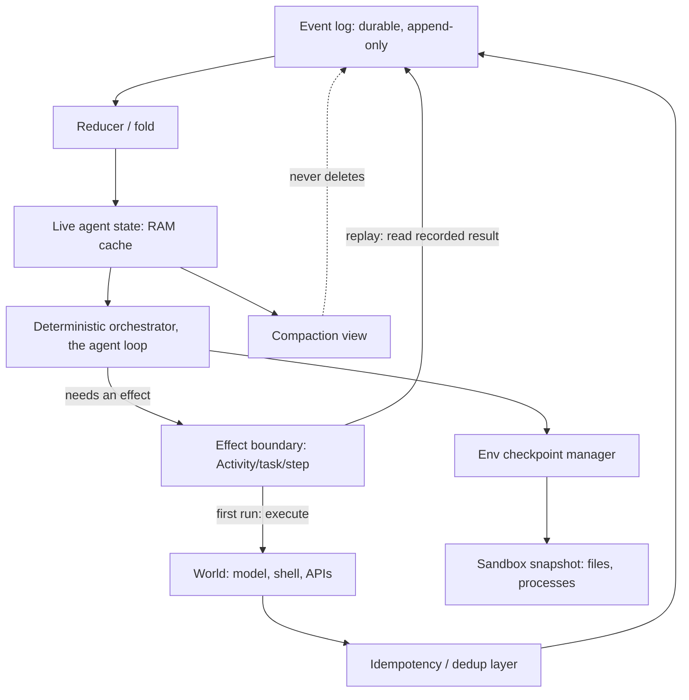

> [!info] Context
> Part of [[Harness-Internals-Overview|Harness Engineering Internals]], Level 2 wave. Parent chapters: [[Harness-Internals-Agent-Loop-Architecture]] (which introduced durable execution as one implementation upgrade to the master loop) and [[Harness-Internals-Runtime-Anatomy]] (which established the append-only transcript as the runtime's source of truth). This chapter takes those two threads — "an agent that dies at step 47 of 60 resumes at step 47" and "the transcript is the state" — and turns them into a full engineering discipline: how you actually make a long-horizon agent survive a crash, and why the Temporal-versus-checkpointing disagreement is a real architectural fork, not a vendor beauty contest.

# Durable Execution and Event-Sourced Agent State

## 1. Executive Overview

An eight-hour agent that loses its state on a crash is a demo, not a product. The parent loop chapter said this in passing; this chapter is about making it false. Durable execution is the substrate under long-horizon reliability — the machinery that lets a coding agent survive a worker restart, a spot-instance eviction, a deploy, or a network partition, and pick up exactly where it left off instead of starting the sixty-step database migration over from step one.

The reframing claim, stated up front because the rest of the chapter earns it: **durable execution for agents is not "save the agent's memory." It is making the agent's control flow itself a recoverable program, and the single load-bearing move is to treat every LLM output and every tool result as an *I/O result to be recorded* — never as a computation to be re-derived.** That inversion is the whole game. A language model is nondeterministic; call it twice with the same prompt and you get two different answers ([[Harness-Internals-Runtime-Anatomy]] established the model as a stateless, stochastic pure function). If your recovery strategy is "re-run the agent from the top and hope it makes the same decisions," you have no recovery strategy — you have a fresh, differently-behaving agent wearing the old one's session ID. The only thing that survives a crash intact is a *record of what already happened*. Durable agents are, at their core, systems that record the model's and the environment's outputs so faithfully that the orchestration around them can be replayed to the exact instruction that was executing when the lights went out.

This is where thirty years of distributed-systems machinery — event sourcing (Fowler, 2005), deterministic replay (Temporal, descended from Uber's Cadence), idempotency keys (Stripe, Kafka) — gets inherited wholesale by AI infrastructure, and where it *strains*, because the classical machinery assumed deterministic business logic and got handed a stochastic language model in the middle of the workflow. The Temporal-versus-checkpointing fork that this chapter resolves is exactly the fork between "make the whole orchestration deterministically replayable" and "just snapshot the state between steps and accept the gaps." Both ship in production. Neither is free. Knowing precisely what each buys — and, more importantly, what each quietly *fails* to buy — is the difference between an agent that resumes and an agent that double-charges a customer's card on recovery.

## 2. Historical Evolution

The pre-history is the same one the loop chapter told, seen from the persistence angle. In the chain era (2022–2023), "state" was a Python variable in a script; if the process died, the run died, and nobody cared because runs were seconds long. AutoGPT and BabyAGI (early 2023) were the first agents long enough for durability to matter — and they had none. A crash three hours into an AutoGPT run lost three hours of work and money. The industry's response at the time was to make runs *shorter and cheaper*, not durable, because the runs weren't valuable enough to protect.

The durability machinery being inherited is much older than agents. **Martin Fowler formalized event sourcing in 2005**: capture every change to application state as an event in an append-only sequence, and you can "blow away the application state and confidently rebuild it from the log." That one sentence is the test of event sourcing and the entire theoretical basis of durable agents. Fowler also, in the same 2005 article, named the exact wound that would bite AI agents fifteen years later: if replaying events "should cause interactions with external systems, then this is a Bad Thing," because "external systems don't know the difference between real processing and replays." Hold that thought — it becomes the tool-idempotency problem in Section 4.

**Temporal** (open-sourced 2019, descended from Uber's Cadence, itself descended from Amazon Simple Workflow) productized event sourcing as *durable execution*: you write ordinary-looking imperative code, and the engine records an event history that lets it replay your function after any crash and resume at the failed line. Temporal spent 2019–2024 serving payments, provisioning, and order pipelines — deterministic business logic, exactly the domain event sourcing was built for.

The agent-specific era begins when two curves cross around 2024–2025: agents got long enough to be worth protecting (Devin, Claude Code, Codex running for hours), and the durable-execution vendors noticed. **LangGraph shipped its checkpointer** (2024) — snapshot the graph state after each super-step, keyed by thread ID — giving the framework-native answer to persistence. Then the durable-execution field fanned out fast: **DBOS** (durable workflows as a Postgres-backed library, no separate server), **Restate** (`ctx.run` durable steps with a lighter programming feel than Temporal), **Inngest** (step-memoized durable functions for serverless), and **Cloudflare Workflows** (step-based durable execution on Workers, generally available April 2025, control-plane rearchitecture April 2026 raising concurrent in-flight instances to 50,000 per account). Every one of these repositioned explicitly for AI agents in 2025–2026, because the pitch writes itself: *LLM calls are expensive; re-running them on retry doubles your bill; durable execution makes you pay for each call exactly once.*

By 2026 the discipline had its own literature. Temporal, Inngest, and Cloudflare published "build a durable AI agent" guides. Research papers arrived: **"The Log is the Agent"** (arXiv 2605.21997) argues the event log *is* the primary artifact, with the agent's state a derived fold; **"Crab"** (arXiv 2604.28138) attacks the specific problem of checkpoint/restore for agent *sandboxes*, measuring that chat-history-only recovery achieves a dismal 6–13% task-success on Terminal-Bench against 100% for semantics-aware checkpointing. And a running argument crystallized — Diagrid's "Checkpoints Are Not Durable Execution" (2026) being its sharpest statement — over whether framework checkpointers (LangGraph, CrewAI, ADK) even count as durable execution, or are merely "I saved your state, you take it from here." That argument is Section 8. The pattern across the whole history repeats the loop chapter's thesis: the interesting engineering is on the harness side, and here specifically in the persistence layer that the naive loop leaves out entirely.

## 3. First-Principles Explanation

Build it up from what a model is. A language model is a pure function from token sequence to token distribution — no memory, no persistence, no effectors ([[Harness-Internals-Runtime-Anatomy]] §3). Therefore *all* agent state lives in the harness: the conversation transcript, the todo list, the loop counter, whatever files were written. The model contributes nothing durable; it is re-fed the entire state on every call.

Now introduce the adversary: **the process can die at any instant.** A worker crashes, a container is OOM-killed, a spot instance is reclaimed, a deploy rolls the fleet, a laptop lid closes. Everything in RAM is gone. The question durable execution answers is: *what does it take to reconstruct the exact execution state — not an approximation, the exact state — after that happens?*

Two properties are required, and they are the whole foundation:

**Property 1 — the state must be durably recorded, not just held in RAM.** This is obvious and cheap: write to disk, to Postgres, to an object store. The subtlety is *what* you record. There are two schools:

- **Snapshot / checkpoint:** periodically serialize the current state (the whole transcript, the graph's state object) to durable storage. To recover, load the last snapshot. Simple, but you lose everything since the last snapshot, and — critically — a snapshot taken *between* steps tells you nothing about a step that was *mid-flight* when the crash hit.
- **Event sourcing / log:** record every state-changing *event* (a model response, a tool result, a user message) to an append-only log. To recover, replay the log from the start (or from a snapshot) and fold it back into state: `state = reduce(apply, events, initial)`. You lose nothing that was written before the crash, and the log doubles as an audit trail, a debugger, and a fork point.

Every durable agent is somewhere on the spectrum between pure-snapshot and pure-log. LangGraph's checkpointer is snapshot-leaning (state object per super-step); Temporal is log-leaning (event history replayed); a hand-rolled JSONL transcript is pure log. The parent loop chapter already named the destination — "append every step to a log; current state is a fold over the log" — this chapter is why that sentence is load-bearing and where it gets hard.

**Property 2 — reconstruction must be faithful, which means the *replayable* part must be deterministic.** Here is the crux, and it is where AI agents strain the classical model. If recovery works by replaying the log through your orchestration code, then your orchestration code, run twice over the same log, must make the *same decisions in the same order*. Temporal calls this the determinism constraint and enforces it brutally: workflow code that, on replay, issues a different sequence of commands than the recorded history throws a **non-determinism error** and refuses to continue. Ordinary-looking code violates this constantly — `if random() > 0.5`, `datetime.now()`, iterating a hashmap in nondeterministic order, reading a live config, and above all *calling an LLM*, whose output differs every time.

The resolution is a partition of the world into two regions, and internalizing it is 80% of understanding durable agents:

> [!tip] The partition that defines durable execution
> **Deterministic orchestration** (the control flow: the loop, the branching, the "which tool next") must be pure and replayable. **Nondeterministic effects** (LLM calls, tool executions, clock reads, random IDs, network I/O) must be *recorded as results the first time and read back from the record on replay — never re-executed.* In Temporal's vocabulary these effects are **Activities**; the orchestration is the **Workflow**. In LangGraph you wrap them in **tasks/nodes**. In a bespoke harness you record them in the transcript. Same partition, three syntaxes.

This is why the LLM's nondeterminism, which sounds like it should be fatal to replay, isn't: you never replay the *model*. You replay the *loop*, and every time the replayed loop reaches the point where it once called the model, it reads the recorded response out of the log instead of calling again. The model's stochasticity is quarantined behind a record-once boundary. The Zylos durable-execution research states the LangGraph version of this rule precisely — "nondeterministic operations and side effects should be wrapped in tasks or nodes, and mutating operations still need idempotency" — and it is the same rule Fowler's gateway was groping toward in 2005.

Property 2 also inherits Fowler's external-systems wound directly. Recording LLM *responses* is safe and desirable — you *want* the recorded answer, not a fresh one. But recording a *side-effecting tool's* result is not enough, because between "the crash" and "the replay reaching the tool," the tool may or may not have actually run. Did the `git push` happen before the crash? Did the email send? Did the card get charged? Replay knows what the *log* says; it does not know what the *world* did if the crash landed between "execute the side effect" and "record its result." That gap is why Section 4's exactly-once discussion exists and why idempotency, not exactly-once, is the honest answer.

## 4. Mental Models

Four framings, each illuminating a different face of the problem.

**The log is the source of truth; RAM is a cache over it.** This is the event-sourcing inversion, and "The Log is the Agent" (arXiv 2605.21997) takes it to its literal conclusion: the agent's live state is a *derived view*, recomputable at any time by folding the event log, and therefore disposable. Once you believe this, a pile of features fall out for free — resume is "fold the log"; time-travel debugging is "fold the log up to event N"; forking a session to explore an alternative is "copy the log's prefix and append divergent events"; auditing is "read the log." The parent runtime chapter's "append-only transcript as source of truth" is exactly this model; durable execution is what you get when you take it seriously enough to make the log survive the process.

**Record I/O, replay logic — the plant/controller split, made persistent.** The loop chapter framed the agent as a feedback controller: the model proposes, the environment (the "plant") disposes, and the error signal flows back. Durability adds one rule to that picture: *the controller's logic is replayable; the plant's responses are recorded.* You can re-run the controller (the loop) as many times as you like for free, because it is deterministic. You cannot re-run the plant (the model, the shell, the API) — its responses are facts of history, captured once. This is why the partition in Section 3 feels natural to control engineers: it is the same line between "the algorithm" (reproducible) and "the measurements" (recorded once, in the moment).

**Exactly-once is a marketing lie you buy back with idempotency.** This is the single most important disabusing in the chapter. In a distributed system with crashes, you *cannot* guarantee a side effect executes exactly once, because there is always a gap between "do the effect" and "durably record that you did it," and a crash in that gap is indistinguishable — on recovery — from "the effect never happened." So the recovery system must choose: retry (risking a second execution — *at-least-once*) or skip (risking zero executions — *at-most-once*). Every honest durable system chooses at-least-once for effects and then makes the *second execution harmless* via **idempotency**: an operation that, run twice, produces the same result as running it once. Kafka's "exactly-once semantics" (Confluent's own writeup admits this) is at-least-once delivery plus idempotent producers plus transactional dedup. Stripe's exactly-once API is at-least-once retries plus an idempotency key that returns the stored first result on any retry. The zylos research names the trap directly: "the biggest trap is believing that checkpoints alone solve durability. They do not" — mutating operations "require separate transaction-like boundaries with receipts and idempotency keys." For agents this means: **exactly-once *tool* execution is achieved, when it is achieved at all, by at-least-once execution plus tool-level idempotency, not by the durable-execution engine waving a wand.** Cloudflare's own durable-agent guide states the stakes in one line: "some tools (like sending emails) should not run twice."

**Two clocks: logical replay position vs. wall-clock time.** A durable workflow lives in two time coordinates simultaneously. There is *wall-clock time* — when things actually happened, recorded in the log. And there is *logical replay position* — how far the replaying orchestration has advanced through the recorded history. During normal execution the two move together. During replay, wall-clock is frozen (or rather, must be *read from the log*, not from the system clock — the Sakura Sky deterministic-replay writeup: "during replay calls to the system clock must be replaced with these recorded values"), while logical position races forward through history at full speed until it catches up to the live edge, at which point normal execution resumes. Confusing the two clocks — letting replayed code read the *real* current time instead of the *recorded* time — is the single most common source of non-determinism errors, because `Date.now()` returns a different value on replay than it did on the original run, and the branch that depended on it diverges.

## 5. Internal Architecture

A durable agent runtime decomposes into seven components. The first five are generic to any durable-execution engine; the last two are what agents specifically add.

1. **Event log / history store.** The append-only durable record: every model response, tool call, tool result, user message, and control decision, in order, with the metadata Section 7 enumerates. Backed by Postgres (DBOS, LangGraph's `PostgresSaver`), a purpose-built store (Temporal's history service over Cassandra/SQL), an object store, or plain JSONL on disk. This is the source of truth; everything else is derived.
2. **Reducer / fold function.** The pure function `apply(state, event) -> state` that reconstructs live state from the log. In an event-sourced design this is explicit; in Temporal it is implicit in re-running the workflow code; in LangGraph it is the state-object merge via channel reducers.
3. **Deterministic orchestrator.** The replayable control flow — the agent loop itself, stripped of all side effects. It may *only* touch the world through recorded boundaries. In Temporal this is the Workflow function; violating determinism here is a hard error.
4. **Effect boundary (Activity / task / step).** The wrapper around every nondeterministic or side-effecting operation. Its contract: execute once, record the result durably, and on replay *return the recorded result without re-executing*. This is where LLM calls, shell commands, and API calls live.
5. **Idempotency / dedup layer.** Guards effectful boundaries against double-execution across the crash gap: idempotency keys, upserts, receipts, dedup tables. Without this, at-least-once execution corrupts state.
6. **Checkpoint/snapshot manager (agent-specific).** For agents, "state" is not just the log — it is also the *sandbox*: files written, processes spawned, environment mutated ([[Harness-Internals-MicroVM-Sandbox-Infrastructure]]). Replaying the LLM log does not recreate a file the agent wrote to `/tmp`. So agent runtimes pair the logical log with *physical* checkpoints of the execution environment. This is Crab's entire subject.
7. **Compaction / summarization interface (agent-specific).** The context window is finite, so long agents compact old history ([[Harness-Internals-Context-Compilation]]). Compaction and durable replay are in direct tension — you cannot replay a tool result you summarized away — and reconciling them is a design problem unique to LLM agents. Section 9 details the failure; the interface here is: compaction must operate on the *context view* of the log, never destroy the *durable* log.



Two things in this diagram deserve emphasis. First, the effect boundary is the *only* path to the world, and it is a two-way valve: on first execution it flows outward (execute, then record); on replay it flows inward (read the record, skip execution). Everything correct about durable agents lives in that valve behaving differently in the two modes. Second, compaction has a dashed, non-destructive edge to the log: it may hide events from the *context* the model sees, but it must never delete them from the *durable* record, or replay becomes impossible. Systems that conflate "the context window" with "the durable state" — which is the naive default — are the ones that lose 45 hours of work to a silent compaction, as community bug reports document.

## 6. Step-by-Step Execution

Walk the canonical scenario from the loop chapter's interview section, now in full mechanical detail: **an agent dies at step 47 of a 60-step database migration, and we resume it.** Assume a Temporal-style deterministic-replay design; the checkpoint-style variant is noted at the end.

**Original run, steps 1–46 (before the crash).** The orchestrator is a deterministic loop. On each iteration it assembles context and needs a model decision — a nondeterministic effect — so it calls the LLM *through an Activity*. The Activity executes: it hits the Anthropic API, gets back "run migration 0047_add_index.sql," and Temporal records that response as an event in the history (`ActivityTaskCompleted`, with the model's text as the result payload). The loop then needs to *run* the migration — a side-effecting tool — so it calls another Activity, which shells out `psql -f 0047_add_index.sql`, gets exit 0, and records that result too. The loop appends both to state and continues. Forty-six migrations applied, ninety-two-odd events recorded, all durable.

**The crash.** At step 47, the worker executing the workflow is OOM-killed *just after* the LLM Activity for step 47 recorded "run migration 0047" but *while* the migration-execution Activity was in flight — the `psql` process had started. RAM is gone. The in-memory loop state, the loop counter reading "47," the assembled context — all vaporized.

**Detection and reschedule.** This is the part checkpoint-only systems don't do for you (Section 8): Temporal's server notices the worker stopped heartbeating on this workflow's task and reschedules it onto a healthy worker. No human clicks anything.

**Replay.** The new worker starts the workflow function *from the very first line* — but in replay mode. The loop runs again, iteration 1. It reaches the LLM Activity call for step 1; instead of hitting the API, the SDK sees a matching `ActivityTaskCompleted` in history and *returns the recorded response instantly* — the model is not called. Same for the step-1 migration Activity: recorded exit code returned, `psql` not re-run. The loop's control flow — being deterministic — makes the exact same decisions it made originally, because it is fed the exact same recorded inputs. This screams forward through steps 1–46 in milliseconds, no API calls, no shell commands, purely reconstructing in-RAM state by folding recorded results back through the deterministic loop. This is the "already-completed LLM invocations and tool calls are not repeated" guarantee the loop chapter cited, shown in motion.

**The live edge, and the gap.** Replay reaches step 47. The LLM Activity for 47 *has* a recorded result ("run migration 0047") — returned from history, model not called. Now the migration-execution Activity for 47: history has *no* `ActivityTaskCompleted` for it (the crash hit before it recorded). So the SDK does not return a recorded value — it *actually executes the Activity now*, for real, on the new worker. And here is the crux the whole chapter has been building toward: **the migration 0047 may have already partially or fully applied on the original worker before the crash.** Temporal will retry the Activity (at-least-once); if `0047_add_index.sql` is not idempotent, we now run `CREATE INDEX` twice and get a "relation already exists" error, or worse, apply a non-idempotent `INSERT` twice and duplicate data.

**The fix, which is not the engine's job.** The engine gave us at-least-once execution of Activity 47 and exact-once replay of 1–46. It did *not* give us exactly-once execution of the migration, and it *cannot*, because it doesn't know whether `psql` committed before the crash. The migration must be written idempotently — `CREATE INDEX IF NOT EXISTS`, `INSERT ... ON CONFLICT DO NOTHING`, or a migrations table checked first — or wrapped with an idempotency key the database dedups on. With that, the second execution is a no-op, exit 0, recorded, and the loop proceeds to step 48 on a fully-reconstructed state as if nothing happened. Steps 48–60 run live. Total wasted work: zero model calls re-billed, one idempotent re-run of a single migration.

**The checkpoint-style variant.** A LangGraph-style design would instead have snapshotted the state object after each super-step. Resume loads the last checkpoint — say, after step 46 — and re-enters the graph at step 47. The difference bites in two places. First, if the crash hit *mid-node* (inside the step-47 node, after the migration ran but before the node returned), the checkpoint after 46 has no record that migration 47 started, so on resume the node re-runs the migration from its top — same idempotency requirement, but now the whole node's pre-crash work repeats, not just the un-recorded tail. Second, in `"exit"` durability mode LangGraph only checkpoints at graph exit, so a mid-run crash loses *everything* — you're back at step 1. The engine choice changed the granularity of "how much repeats," but not the fundamental requirement: **idempotent effects.** No durable engine removes that requirement; they only shrink the window in which it matters.

## 7. Implementation

Build it yourself, three layers deep, from a bespoke JSONL harness up to the vendor pattern.

**Layer 1 — the event-sourced transcript with resume.** The loop chapter's `run_turn` becomes durable with two changes: append every event to durable storage as it happens, and add a resume path that folds the log before entering the loop.

```python
# Every event is appended durably the instant it is known.
def append(log_path, event):        # event: dict with type, payload, ts, seq
    with open(log_path, "a") as f:   # append-only; fsync in production
        f.write(json.dumps(event) + "\n")

def fold(log_path):                  # reconstruct state from the log
    state = SessionState.empty()
    for line in open(log_path):
        state = apply(state, json.loads(line))   # pure reducer
    return state

async def run_durable(session_id, user_msg=None):
    log = f"sessions/{session_id}.jsonl"
    state = fold(log) if os.path.exists(log) else SessionState.empty()
    if user_msg:
        ev = {"type": "user_msg", "payload": user_msg, "seq": state.next_seq()}
        append(log, ev); state = apply(state, ev)

    while not state.done and state.turns < BUDGET:
        # LLM call: check the log first (replay), else execute and record.
        resp = state.recorded_response()          # None unless resuming a gap
        if resp is None:
            resp = await model.call(state.context())
            append(log, {"type": "assistant", "payload": resp, "seq": state.next_seq()})
        state = apply(state, {"type": "assistant", "payload": resp})
        if not resp.tool_calls:
            break
        for call in resp.tool_calls:
            result = await execute_idempotent(call, session_id)  # Layer 2
            append(log, {"type": "tool_result", "call_id": call.id,
                         "payload": result, "seq": state.next_seq()})
            state = apply(state, {"type": "tool_result", "call_id": call.id, "payload": result})
    return state
```

This is 80% of Temporal on a laptop, and it is what "a bespoke harness can get with a JSONL transcript plus a resume-from-transcript path" (loop chapter, Q2) actually looks like. The `recorded_response()` check *is* the effect boundary's replay behavior, hand-rolled. The critical discipline: **append is append-only and happens the instant the result is known, before the next effect.** Mutating past log entries breaks the fold and, incidentally, breaks prefix caching ([[Harness-Internals-Prompt-Assembly-Cache-Economics]]) for the same reason — the log and the cache are both append-only structures over history.

**Layer 2 — idempotent tool execution.** The migration lesson, generalized. Every side-effecting tool gets an idempotency key derived deterministically from its call, and a durable receipt store.

```python
async def execute_idempotent(call, session_id):
    key = hashlib.sha256(f"{session_id}:{call.id}:{call.tool}:{canonical(call.args)}"
                         .encode()).hexdigest()
    if (receipt := receipts.get(key)):    # already ran, even across a crash
        return receipt                    # return stored result, do NOT re-run
    result = await call.tool.run(call.args)   # the real side effect
    receipts.put(key, result)             # durable, ideally same txn as the effect
    return result
```

The subtlety the loop chapter flagged as "the outbox pattern, rediscovered": the receipt write and the side effect should be *atomic*, or you reopen the crash gap between them. For a database tool, write the receipt in the same transaction as the mutation. For a truly external effect (send email), you cannot get atomicity, so you accept a tiny at-least-once window and rely on the downstream provider's own idempotency key (Stripe, SendGrid all accept one). The canonical-args hashing matters: reorder a JSON object's keys and the naive hash changes, defeating dedup — the "Stable Cache Keys for LLM Requests" writeup makes canonical hashing its whole subject.

**Layer 3 — the vendor pattern (Temporal / Cloudflare).** In a real durable engine you stop hand-rolling and lean on the partition. The shape, in Cloudflare Workflows' `step.do` idiom (chosen because it is the most legible):

```typescript
// Each LLM turn and each tool call is its own durable, individually-retryable step.
await step.do(`llm-turn-${turn}`,
  { retries: { limit: 3, delay: "10s", backoff: "exponential" } },
  async () => callModel(context));        // recorded once; not re-run on replay

await step.do(`tool-${turn}-${i}`,
  { retries: { limit: 3 } },
  async () => runTool(call));             // "if a later tool fails, earlier tools do not re-run"
```

Cloudflare's guide states the resulting guarantee plainly: on a crash the workflow "resumes from the last successful step," "LLM calls aren't repeated," and "if a later tool fails, earlier tools do not re-run." Temporal's Python equivalent puts the LLM call in an `@activity.defn` and the loop in an `@workflow.defn`; Pydantic-AI's Temporal integration does this wrapping automatically, so "all the non-deterministic work (model calls, tool executions, external API calls) gets automatically offloaded to Temporal Activities." **LangGraph's `durability` parameter** exposes the snapshot-frequency knob directly — `"sync"` (checkpoint before each step, safest, slowest), `"async"` (checkpoint concurrently with the next step, small crash window), `"exit"` (checkpoint only at graph exit, fastest, no mid-run recovery) — and its docs carry the same warning as everyone else: "wrap any non-deterministic operations or operations with side effects inside tasks to ensure that when a workflow is resumed, these operations are not repeated."

**Making the LLM call itself replay-safe.** The deepest implementation question — must-answer #2 — is: given that the provider is nondeterministic, how do you guarantee replay reproduces the *same* model output? Three techniques, in increasing honesty:

- **Seeding + temperature=0 (insufficient alone).** OpenAI's `seed` parameter and `temperature=0` reduce variance but *do not* guarantee reproducibility — OpenAI's own docs say seed "improves reproducibility but doesn't guarantee it," and Anthropic's docs state results "will not be fully deterministic" even at temperature 0. Hardware nondeterminism (floating-point reduction order across GPU batches), model-weight updates, and MoE routing all leak through. The Zansara writeup ("Setting the temperature to zero will make an LLM deterministic?") is the canonical debunk. Seeding is a variance-reducer, never a durability primitive.
- **Record-replay (the correct answer).** Do not try to *reproduce* the output — *record* it. The first time the loop calls the model, store the exact response as an event. On replay, return the stored response. This is precisely what the effect boundary does, and it is why LLM nondeterminism is a non-problem for durability: you replay the *recording*, not the *model*. "The Log is the Agent" states it cleanly — "record the specific LLM response (not just the prompt) as an event... during replay, the stored response is replayed rather than re-querying the model."
- **Content-addressed response caching (record-replay's dedup cousin).** For debugging and cost, key the cache on a hash of the *entire request* — system message, messages, model ID, tool definitions, decode params — and serve the recorded response when a request's hash matches. The Sakura Sky and TianPan deterministic-replay writeups describe this "cache keyed on request hash" design for reproducing agent runs offline. It is the same mechanism as record-replay, generalized to match on request content rather than sequence position, which additionally lets you *replay a run against modified agent code* and detect divergence — "because the agent code is unchanged, any divergence during replay signals a real correctness issue."

## 8. Design Decisions

### The fork: deterministic replay vs. checkpointing vs. event-sourced custom

This is the chapter's central architectural decision and the "real architectural fork" the dispatch named. Three positions, compared on guarantees, overhead, and failure semantics.

**Deterministic replay (Temporal, Restate, DBOS, Cloudflare Workflows).** The engine records an event history and *replays your orchestration code* to recover. Guarantees: automatic crash detection (server-side supervisor, heartbeats), automatic reschedule-and-resume with no human action, and step-level "completed effects never re-run." Cost: the determinism constraint is *invasive* — your workflow code cannot call the clock, RNG, or any I/O directly; everything nondeterministic must be an Activity, which is a real re-architecture. Temporal specifically requires splitting your app into a workflow service and a worker service plus running the Temporal server (and historically Cassandra). Failure semantics: strong — a crash anywhere resumes at the exact failed Activity. Overhead: Temporal's async dispatch adds "tens to hundreds of milliseconds per step" (DBOS's comparison), which is invisible for minute-long agent turns but real.

**Checkpointing / snapshotting (LangGraph, CrewAI, Google ADK).** The framework snapshots the state object after each super-step, keyed by thread ID. Guarantees: resume from the last checkpoint *if you detect the failure and manually re-invoke with the right thread ID*. Cost: near-zero code change — it's a framework feature you turn on. Failure semantics: **weaker, and the weakness is the whole 2026 argument.** Diagrid's "Checkpoints Are Not Durable Execution" enumerates the gaps precisely: (1) no automatic failure detection — "no supervisor, no watchdog, no heartbeat," you must notice the crash yourself; (2) no automatic recovery — you must manually call `invoke(None, config)` with the correct thread; (3) no exactly-once coordination — two processes resuming the same thread concurrently both execute, "no built-in coordination to prevent both"; (4) no mid-step resilience — checkpoints capture state *between* super-steps, so "if a failure occurs within a node's execution, progress inside that node is lost." The Zylos research states the same in one line: "on resume, later graph work can re-execute... checkpoints alone don't prevent duplicate operations." The honest framing: checkpointing gives you *resumable state*; durable execution gives you *a runtime that owns the workflow's completion*. Checkpointing says "I saved your state, you take it from here"; durable execution says "your workflow will run to completion, I handle everything."

**Event-sourced custom (bespoke JSONL/Postgres log, "The Log is the Agent").** Roll your own log + fold + resume, as in Section 7 Layer 1. Guarantees: exactly what you build — typically resume, fork, time-travel, audit, but *you* implement crash detection, idempotency, and concurrency control. Cost: you own the machinery, including all the corner cases Temporal spent years on. Failure semantics: as good as your discipline. Why anyone does it: total control, no server dependency, the log is in a format you own (critical for agent products where the transcript *is* the user-facing artifact and needs forking/branching semantics that generic engines don't expose), and — the honest reason — for many agents "80% of Temporal with a JSONL file" is genuinely enough, and adding Temporal's operational surface to a laptop coding agent is absurd.

The decision rule: **choose deterministic replay when the agent runs on shared infrastructure, fans out to external systems, must survive deploys/evictions unattended, and correctness-under-crash is a hard requirement (payments, migrations, multi-day autonomous runs). Choose checkpointing when you want cheap resume for human-in-the-loop pauses and long-but-supervised runs, and can tolerate manual recovery and the mid-node gap. Roll your own log when the transcript is your product and you need fork/branch/replay semantics no engine gives you — and you have the discipline to implement idempotency yourself.**

### DBOS vs. Temporal: the operational-weight axis

Even within deterministic replay there's a sub-fork worth naming because it recurs. **Temporal** is an externally-orchestrated server: it earns its operational weight on multi-tenant, multi-region, very-high-fan-out platforms, but it "adds two new failure domains — the Temporal server and its Cassandra data store." **DBOS** is a *library* that stores workflow state directly in your existing Postgres: "exactly one point of failure: Postgres," which most teams already run. The numbers DBOS publishes: integrating DBOS is ~7 lines of change in a 110-line app versus >100 lines and a two-service split for Temporal; each DBOS checkpoint is "a single Postgres write (1–2ms)" versus Temporal's "tens to hundreds of milliseconds per step," making DBOS better for latency-sensitive interactive agents and Temporal better for heavy external fan-out. This is the thin-vs-thick-harness trade-off from [[Harness-Internals-Runtime-Anatomy]] replayed one layer down: the same reliability guarantee, radically different operational surface.

### Where durable state meets microVM suspend/restore

The logical log (Section 3) is necessary but not sufficient for *coding* agents, because their state includes a mutated filesystem and running processes, not just a conversation. Replaying the LLM log recreates the *decisions* but not the *side effects on disk* — a file the agent wrote, a `node_modules` it installed, a dev server it started. This is why durable execution for agents cross-links hard to [[Harness-Internals-MicroVM-Sandbox-Infrastructure]]: the environment itself must be checkpointed. **Firecracker microVM snapshots** persist the guest's full memory and device state and restore in tens of milliseconds — community-reported figures (aggregated from sandbox-vendor blogs, not vendor-official benchmarks) put resume at "under 25ms with all processes intact, even after weeks," and forking "100 VMs in 101ms from a warmed parent snapshot via copy-on-write pages." So the complete durable state of a coding agent is *two* coupled artifacts: the logical event log (decisions and results) and the physical VM snapshot (filesystem and process state). They must be checkpointed *consistently* — a VM snapshot taken at a different log position than the resume point desynchronizes the agent's belief (from the log) from the world (in the VM), which is exactly the "state divergence" failure the runtime chapter warned about.

The **Crab** paper (arXiv 2604.28138) is the sharpest treatment of getting this coupling right, and its numbers are the best public evidence that the logical log alone is insufficient. Crab measures recovery *correctness* on Terminal-Bench under three strategies: chat-history-only (the logical-log-only approach) achieves just **6–13%** task success under trace replay (28% with live LLMs); chat-plus-filesystem gets **28–42%**; and Crab's semantics-aware checkpoint/restore — which uses eBPF to detect exactly which OS effects each turn produced and checkpoints only what changed — reaches **100%** correctness at just **0–1.9%** overhead, by skipping ~75% of turns entirely and overlapping checkpoint writes with LLM inference wait windows. The lesson for durable-agent design: *the conversation log is a fraction of the recoverable state, and recovering only it silently produces agents that resume with the right words and the wrong world.* Full-state checkpointing every turn is the correct-but-expensive alternative (Crab measures naive CRIU process checkpointing at "47 seconds for 64 concurrent 1GB dumps," a 3.06–3.78× slowdown at density), which is why semantics-aware selective checkpointing is the interesting frontier.

## 9. Failure Modes

**Non-determinism errors on replay.** The signature failure of deterministic-replay engines. Orchestration code reads the wall clock, calls `random()`, iterates a dict in insertion-nondeterministic order, or — the agent-specific version — a code change to the running workflow alters the command sequence, and replay's generated commands no longer match recorded history. Temporal throws a non-determinism error and halts. Debug: diff the recorded command sequence against the replayed one; the first divergence names the offending line. Fix: move the nondeterministic read behind an Activity, or use the engine's versioning/patching API (Temporal's `GetVersion`/`Patched`, Worker Versioning) to fork behavior by history version so old workflows replay under old logic. This is why "never edit deployed workflow code carelessly" is a durable-execution commandment — and why Anthropic runs *rainbow deployments* (loop chapter §10), keeping old harness versions live so in-flight agents replay against the code they started on.

**The mid-step / mid-node crash gap.** Covered in Sections 4 and 6, but as a first-class failure: a crash *inside* an effect, after it executed but before its result was recorded. On recovery, the engine cannot tell "done but unrecorded" from "never started," so it retries (at-least-once). If the effect is non-idempotent, it double-executes: duplicate charge, duplicate email, duplicate `INSERT`, duplicate `CREATE INDEX`. This is not a bug in the engine; it is the fundamental limit exactly-once cannot cross. Debug: look for effects that ran twice around a crash timestamp. Fix: idempotency keys, upserts, atomic effect-plus-receipt writes (the outbox pattern). There is no other fix.

**Concurrent-resume double execution.** Two workers (or a human retry plus an auto-retry) resume the same session simultaneously; both replay, both reach the live edge, both execute the next effect. Deterministic-replay engines prevent this with server-side task locking (one worker owns a workflow's task at a time). Checkpoint-only frameworks *do not* — Diagrid names this as gap #3 — so a bespoke or LangGraph design must add its own lease/lock on the session ID (a Postgres advisory lock, a lease row) or risk it. Debug: two live edges advancing the same log. Fix: single-writer lease on the session.

**Orphaned tool_result from compaction.** The compaction-durability collision, and it is nastier than it sounds. The Anthropic Messages API requires every `tool_result` to be preceded by the `assistant` message containing the matching `tool_use`. Compaction that summarizes away the `assistant`/`tool_use` message but keeps the `tool_result` (or vice versa) produces an *orphaned* tool_result, and the API rejects the next call outright — the agent is now wedged, unable to make progress, mid-session. Community bug reports document exactly this ("orphaned tool_result after compaction causes cascading failures"). The deeper form: **you cannot replay a tool result you summarized away.** If compaction destroys the durable record of a tool result (not just its context view), and the agent later crashes and tries to resume, the fold hits a gap it cannot fill. Debug: check for tool_use/tool_result pairs split across a compaction boundary. Fix: compaction operates on a *view* of the log, never the durable log itself (Section 5 component 7); and compaction must preserve tool_use/tool_result pairs atomically — never split a pair.

**Silent context loss mistaken for durability.** The most insidious agent-specific failure: teams conflate "the context window survived" with "the state survived." An agent accumulates 45 hours of reasoning in its context, never writes it durably, compaction fires, and the reasoning is gone with no crash and no error — the loop chapter's "state divergence," but self-inflicted. Fix: the durable log is separate from and larger than the context window; externalize plans and progress to durable artifacts (todo files, PROGRESS.md — loop chapter's externalized-planning-state), so the recoverable state does not live only in a compactable window.

**Snapshot/log desynchronization (coding agents).** The VM snapshot and the logical log are checkpointed at different points; on resume the agent's belief (from the log) and its environment (from the VM) disagree — a file the log thinks exists doesn't, or vice versa. Debug: re-ground at session start (runtime chapter's discipline — read progress files, run tests, check git status) rather than trusting either artifact blindly. Fix: checkpoint log and VM *consistently* at the same turn boundary; Crab's turn-boundary detection is one way to define that point.

**Replay divergence from model drift.** A subtle one for record-replay used as *debugging* (not durability). You recorded a run against `model-2026-01`; you replay months later to debug, but you're re-issuing requests against `model-2026-06` and getting different outputs, so the replay diverges for a reason that isn't a bug. Fix: record the model *identifier and version* with every response (Sakura Sky's requirement), and for true replay serve recorded responses rather than re-calling; only re-call when *intentionally* testing new-model behavior.

## 10. Production Engineering

Epistemic labels per claim: *verified* = stated in vendor docs/blogs or papers I read; *inferred* = reasoned from those; *community* = third-party measurement, not vendor-official.

**Temporal** (*verified*, docs + blog). The reference deterministic-replay engine for agents. Workflows hold the deterministic loop; LLM and tool calls are Activities; the server records full event history and replays to reconstruct state so "already-completed LLM invocations and tool calls are not repeated." Human-in-the-loop via Signals/Updates (inject input) and Queries (read state) without losing durability. Determinism enforced by non-determinism errors; code evolution via versioning/patching. Aggressively courts agent workloads (Pydantic-AI integration auto-wraps effects as Activities). Overhead: tens-to-hundreds of ms per step (*community*, via DBOS comparison).

**LangGraph** (*verified*, docs). Checkpointer snapshots state per super-step, keyed by thread ID; `InMemorySaver`/`SqliteSaver`/`PostgresSaver` backends; enables resume, human-in-the-loop interrupt, and time-travel. The `durability` parameter (`sync`/`async`/`exit`) trades safety for speed. *Verified limitation:* recovery is manual (re-invoke with thread ID), mid-node crashes lose in-node progress, and side effects in re-executed nodes repeat unless wrapped in tasks — LangGraph's own docs carry the idempotency warning. AWS documents a DynamoDB-backed checkpointer for production durability.

**Inngest** (*verified*, blog). Step-memoization rather than full deterministic replay: each `step.run()` result is durably cached; on resume, completed steps "return their cached results instantly," and "you pay for each LLM call exactly once." `step.ai.infer` offloads inference and pauses the function so you don't pay for idle serverless time. Lighter than Temporal, serverless-native.

**Restate** (*verified*, via zylos). `ctx.run`-style durable steps with "a lighter application-programming feel than Temporal," no separate workflow/activity architecture required.

**DBOS** (*verified*, docs/blog). Durable execution as a Postgres-backed *library*, not a server. ~7-line integration, single Postgres write per checkpoint (1–2ms), one failure domain. Best for interactive/latency-sensitive single-service agents; concedes Temporal wins on multi-tenant/multi-region/high-fan-out.

**Cloudflare Workflows** (*verified*, docs/blog). Step-based durable execution on Workers; each `step.do` is individually retriable with per-step retry policy; state auto-persisted and replayed; "resumes from the last successful step," LLM calls not repeated. GA April 2025; April 2026 control-plane rearchitecture raised concurrent in-flight instances to 50,000/account, creation to 300/s. The Agents SDK (Durable Objects) owns live per-agent state; Workflows own the durable retryable pipeline — an explicit split of "live conversation state" from "durable long-running execution."

**Anthropic — Claude Research / Claude Code** (*verified* loop shape via loop chapter; *inferred* internals). Long runs resume from checkpoints because restarts from scratch are "expensive and frustrating for users"; rainbow deployments keep old harness versions live so in-flight agents aren't stranded mid-replay by a deploy. The exact persistence mechanism (event log vs. checkpoint) is not publicly documented — *publicly unknowable* at the mechanism level.

**Crab** (*verified*, arXiv 2604.28138, academic). Semantics-aware checkpoint/restore for agent *sandboxes*: 100% recovery correctness at 0–1.9% overhead by eBPF-classifying which OS effects each turn produced and checkpointing selectively, versus 6–13% for chat-only and 3.06–3.78× slowdown for naive full checkpointing.

**Monitoring, security, cost.** Monitor: `cache_read` tokens (a drop signals a broken prefix and, often, a broken log-append discipline), replay/non-determinism error rate, resume success rate, effect-double-execution alarms (dedup-table hit rate on retries). Security: the durable log contains everything the agent saw and did — secrets in tool outputs, PII in transcripts — so it inherits the full data-governance surface; encrypt at rest, scope access, and treat replay as a privileged operation (replaying a log re-materializes its secrets). Cost: the durability tax is dominated by *storage* of ever-growing logs (snapshot + truncate old history to bound it — Fowler's snapshot optimization) and by the *avoided* cost of re-running LLM calls, which is the entire economic pitch — at agent token prices, not re-billing a crashed 40-turn run is real money.

## 11. Performance

**Replay cost is O(history length), and snapshots bound it.** Pure event-sourcing replays the whole log to recover; a million-event log means a slow recovery. The classical fix (Fowler) is periodic snapshots: store the folded state at event N, and recovery replays only from N forward. Temporal does this internally (continue-as-new resets history); LangGraph's per-super-step checkpoint *is* a rolling snapshot; a bespoke log should snapshot-and-truncate. The agent-specific wrinkle: replay of the *deterministic loop* is cheap (no LLM calls — those are read from history), so agent replay is fast *precisely because* the expensive part (inference) is recorded, not re-run. This is the durability dividend: recovery of a 40-turn agent is milliseconds of loop-folding, not 40 re-billed inference calls.

**Checkpoint write latency is the interactive-agent bottleneck.** For an agent that checkpoints every step, the per-step write is on the critical path. DBOS's single Postgres write (1–2ms) is negligible; Temporal's tens-to-hundreds of ms per step is invisible behind a multi-second inference call but would dominate a fast tool loop; LangGraph's `sync` mode blocks each step on the checkpoint write, `async` overlaps it (small crash window), `exit` skips it (no mid-run durability). Match the mode to the workload: `sync` for a payment agent, `exit` for a supervised research run you'll restart by hand anyway.

**Sandbox checkpoint cost dominates for coding agents.** The logical log is bytes; the VM snapshot is gigabytes. Naive full-VM checkpointing every turn is a 3.06–3.78× slowdown at density (Crab, *community/academic*); Firecracker's copy-on-write snapshots restore in tens of ms (*community*); Crab's selective checkpointing hides nearly all latency by (a) skipping ~75% of turns that changed nothing recoverable and (b) overlapping checkpoint writes with the LLM inference wait window — "median exposed delay is zero" up to 96 sandboxes per host. The general principle: *checkpoint the environment on the same schedule you're already stalled waiting for the model, and it's free.*

**Log-append discipline protects prefix caching.** The append-only requirement for durability is the *same* requirement as for prompt-cache hits ([[Harness-Internals-Prompt-Assembly-Cache-Economics]]): never mutate history. A durable design that appends correctly gets cache-friendly context assembly as a side effect, and vice versa — the two disciplines reinforce. Editing an old event to "fix" it silently 10×'s your inference bill (cache miss) *and* corrupts the fold (bad recovery). One discipline, two payoffs.

## 12. Best Practices

Partition ruthlessly: deterministic orchestration touches the world *only* through recorded effect boundaries; if a line of loop code reads the clock or calls the model directly, it's a latent non-determinism error. Record every LLM response as an event the instant it returns — never plan to reproduce model output by seeding; seeding is a variance-reducer, record-replay is the durability primitive. Make every side-effecting tool idempotent from day one (idempotency keys, upserts, `IF NOT EXISTS`, downstream provider idempotency keys) — retrofitting it after a double-charge incident is miserable, and no engine removes the requirement. Write the effect and its receipt atomically where you can (same DB transaction — the outbox pattern); where you can't (email, external APIs), lean on the provider's idempotency key and accept a minimal at-least-once window. Keep the durable log strictly separate from and larger than the context window; compaction operates on a *view*, never destroys the durable record, and never splits a tool_use/tool_result pair. For coding agents, checkpoint the *environment* (VM/filesystem) consistently with the logical log, and do it during the inference-wait window so it's latency-free. Snapshot-and-truncate to bound replay cost and storage. Single-writer lease every session to prevent concurrent-resume double execution. Version your workflow code and keep old versions live for in-flight agents (rainbow deployments) — deployed durable code is a contract with every running replay. Re-ground at session start (read progress files, run tests, check git) rather than blindly trusting log or snapshot.

Anti-patterns, all field-observed: calling the LLM inside deterministic workflow code (guaranteed non-determinism error); believing checkpoints give you exactly-once (they give at-least-once plus your idempotency); treating the context window as the durable state (silent 45-hour losses); non-idempotent effects behind at-least-once execution (double charges); compaction that destroys durable history or splits tool pairs (wedged sessions); recovering only the chat log for a coding agent (6–13% correctness — right words, wrong world); mutating past log entries (breaks fold and cache at once).

## 13. Common Misconceptions

**"Durable execution guarantees exactly-once side effects."** It guarantees at-least-once execution and exact-once *replay of recorded results*. Exactly-once *effects* are your job, via idempotency. The engine cannot know whether a crash landed before or after your `psql` committed; only your idempotent effect can make the retry harmless. This is the single most consequential misconception, and it's the one that ships double-charges.

**"Checkpointing and durable execution are the same thing."** They occupy different rungs. Checkpointing saves state and hands recovery back to you — no crash detection, no auto-recovery, no concurrency coordination, no mid-node resilience. Durable execution owns the workflow's completion — supervisor, auto-reschedule, exactly-once coordination, resume at the failed step. LangGraph/CrewAI/ADK are the former; Temporal/DBOS/Restate/Cloudflare Workflows are the latter. Both are legitimate; calling the former "durable execution" oversells what happens when the process actually dies.

**"LLM nondeterminism makes agents impossible to replay."** Backwards. You never replay the model — you replay the loop, and the loop reads recorded responses. Nondeterminism is quarantined behind the effect boundary, so it's a non-issue *for durability*. It only bites when you mistakenly try to *reproduce* output (via seeding) instead of *recording* it.

**"temperature=0 gives you deterministic, replayable agents."** No. temperature=0 reduces per-call variance but doesn't eliminate it (hardware FP order, MoE routing, weight updates), and it does nothing about tool nondeterminism, clock reads, or model drift. Even a perfectly deterministic model wouldn't make a multi-step agent replayable — the tools and the environment are nondeterministic too. Record, don't reproduce.

**"The conversation transcript is the agent's state."** For a chat agent, nearly. For a coding agent, it's a fraction — the filesystem, running processes, and environment are state too, and recovering only the transcript resumes with the right decisions and the wrong world (Crab: 6–13% correctness). Durable state for coding agents is the log *and* the sandbox snapshot, kept consistent.

**"Just add Temporal and your agent is reliable."** Temporal gives you the machinery; it does not write your idempotent tools, decide your compaction policy, checkpoint your sandbox, or keep your workflow code deterministic. It's a powerful substrate that still requires you to hold the partition, idempotency, and compaction disciplines. The reliability is in how you use it.

## 14. Interview-Level Discussion

**Q1: Walk me through exactly what deterministic replay guarantees, and what it demands of your agent code.** Guarantee: after a crash, the engine reconstructs the exact pre-crash execution state by re-running your orchestration code against a recorded event history, returning recorded results at every effect boundary so completed LLM calls and tool executions are never re-run, and resumes at the precise operation that was in flight. Demand: your orchestration code must be *deterministic* — same inputs, same command sequence, every replay — which forbids inline clock reads, RNG, unordered iteration, direct I/O, and above all direct model calls; all of that must live behind recorded effect boundaries (Activities). The mechanism that enforces it is the non-determinism error: if replay's generated commands diverge from history, the engine halts. And the honest caveat: replay gives exactly-once *replay*, not exactly-once *effects* — the in-flight effect at the crash edge runs at-least-once, so it must be idempotent.

**Q2: The LLM provider is nondeterministic. How do you make an LLM call replay-safe?** Don't try to reproduce the output — record it. On first execution, wrap the call in an effect boundary that stores the exact response (with model ID, decode params, timestamp) as an event; on replay, return the stored response and never call the model. Seeding and temperature=0 are red herrings — they reduce variance but never guarantee reproducibility (OpenAI and Anthropic both say so), and they don't touch tool nondeterminism or model drift. The correct primitive is record-replay; the debugging generalization is content-addressed caching keyed on a canonical hash of the full request, which additionally lets you replay recorded runs against modified code and treat any divergence as a real bug.

**Q3: What does exactly-once tool execution actually require, and why is at-least-once + idempotency the honest answer?** True exactly-once is impossible across crashes because there's an irreducible gap between executing a side effect and durably recording that you did — a crash in that gap is indistinguishable, on recovery, from never-executed. So the recovery system must retry (at-least-once) or skip (at-most-once); every serious system picks at-least-once for effects and makes the second execution harmless via idempotency — idempotency keys, upserts, `IF NOT EXISTS`, atomic effect-plus-receipt writes (outbox), or delegating to a downstream provider's idempotency key. Kafka's and Stripe's "exactly-once" are exactly this: at-least-once plus dedup. The engine gives you the retry; you give it the idempotence; together they *simulate* exactly-once at the application boundary.

**Q4: Compare Temporal, LangGraph checkpointers, and an event-sourced custom store on guarantees, overhead, and failure semantics.** Temporal (deterministic replay): strongest failure semantics — auto crash-detection, auto-resume, exactly-once coordination, resume at the failed step; cost is an invasive determinism constraint and a two-service-plus-server operational footprint; overhead tens-to-hundreds of ms/step. LangGraph (checkpointing): cheapest to adopt (a framework flag), gives resumable state; but recovery is manual, there's no crash supervisor, no concurrent-resume coordination, and mid-node crashes lose in-node progress — "checkpoints are not durable execution." Custom event-sourced log: total control and product-grade fork/branch/replay semantics on a format you own; you implement crash-detection, idempotency, and concurrency yourself — "80% of Temporal with a JSONL file," fine until you need the last 20%. Rule: replay for unattended correctness-critical fan-out; checkpointing for supervised human-in-the-loop; custom log when the transcript is your product.

**Q5: How does durable state collide with context compaction, and with microVM suspend/restore?** Compaction: you can't replay a tool result you summarized away, so compaction must operate on a *view* of the log, never the durable record — and it must never split a tool_use/tool_result pair, or the API rejects the orphaned result and wedges the session. The durable log is separate from and larger than the context window; conflating them causes silent multi-hour losses. MicroVM: for coding agents the logical log recovers *decisions* but not *side effects on disk*, so the complete durable state is the log plus a Firecracker-style VM snapshot of filesystem and processes, checkpointed *consistently* with the log position — desync means the agent's beliefs (log) and world (VM) disagree. Crab's numbers prove the point: recovering only the chat log yields 6–13% task correctness; you need the environment too. Best practice: checkpoint the environment during the inference-wait window, where it's latency-free.

**Q6: An architect says "we'll use LangGraph checkpointing, so we're durable." Where do you push back?** Checkpointing gives resumable state, not a durable runtime. Ask: who detects the crash? (No supervisor — you do, manually.) Who resumes? (You re-invoke with the thread ID by hand.) What happens if two processes resume the same thread? (Both run — no coordination.) What if the crash is *inside* a node? (In-node progress lost; the node re-runs from its top.) Are your side-effecting nodes idempotent? (They must be, or resume double-executes them.) For a supervised human-in-the-loop research agent, checkpointing is genuinely fine. For an unattended agent that mutates external systems and must survive deploys, it's the wrong rung — you want a durable-execution engine, or you're hand-building one badly on top of the checkpointer.

## 15. Advanced Topics

**Semantics-aware selective checkpointing.** Crab's direction: instead of the false choice between cheap-but-lossy chat-log recovery and correct-but-expensive full-VM checkpointing, use kernel-level observation (eBPF) to detect exactly which recoverable state each turn actually mutated, and checkpoint only that — skipping the ~75% of turns that changed nothing durable and hiding the rest behind inference waits. This reframes durability as a *classification* problem (what state matters this turn?) rather than a fixed-cost tax, and it's the most promising path to making coding-agent durability free. Open problem: the agent–OS semantic gap — neither layer alone knows what needs recovering — and doing the classification without false negatives that silently drop state.

**The log as first-class product artifact.** "The Log is the Agent" pushes event sourcing to its conclusion: if the log is the primary state, then forking (branch execution from any event), time-travel debugging (fold to event N), counterfactual replay (change one event, re-fold, see what differs — "Causal Agent Replay," arXiv 2606.08275), and audit are all *the same operation* on the log. Agent products increasingly expose these to users (fork a conversation, rewind a session), which pushes toward custom event-sourced stores over opaque engine internals, because the log's *format and semantics* become user-facing.

**Durable multi-agent coordination.** Everything here was single-agent. Extend to the subagent trees of [[Harness-Internals-Subagent-Orchestration]] and durability compounds: does a parent's log include its children's, or reference them? A crash mid-fan-out must resume a partially-completed wave without re-spawning completed subagents (Inngest's `step.invoke` pauses the parent durably while a child runs) — durable fork-join. The "Verified Detection of Concurrency Anomalies in Multi-Agent LLM Systems" (arXiv 2606.17182) direction applies database-style serializability theory to concurrent durable agents, treating conflicting agent effects as transaction anomalies to detect and prevent.

**Learned / adaptive durability.** Today durability granularity is a static knob (LangGraph's `sync`/`async`/`exit`, checkpoint-every-turn). A frontier direction: the harness *learns* which turns are worth checkpointing based on cost-at-risk (an expensive irreversible effect coming up → checkpoint now; a cheap read → skip), turning durability into a runtime scheduling decision like Crab's classification, but cost-aware. This connects to the efficiency-as-scheduling theme the loop chapter flagged: the scheduler, not the topology, becomes the object of optimization.

**Deterministic inference as a durability primitive.** A wildcard: if inference providers shipped *truly* deterministic decoding (batch-invariant kernels, fixed reduction order — an active systems-research area), record-replay could be replaced by seed-replay for the model, shrinking log size (store the seed, not the whole response). It wouldn't remove the tool/clock/environment nondeterminism, so record-replay stays necessary, but it would change the storage economics. Watch this space; it's not here yet, and betting durability on it today is the temperature=0 mistake at fleet scale.

## 16. Glossary

- **Durable execution**: running an agent as a recoverable program whose orchestration can be replayed or resumed after a crash so completed work is never repeated; the engine owns the workflow's completion.
- **Deterministic replay**: recovery by re-running orchestration code against a recorded event history, returning recorded results at every effect boundary; requires the orchestration to be deterministic (Temporal model).
- **Checkpointing / snapshotting**: recovery by loading the last saved state snapshot and re-entering execution there; simpler, but loses in-step progress and hands recovery logistics to the developer (LangGraph model).
- **Event sourcing**: representing state as a fold over an append-only log of events rather than a mutable snapshot; "blow away state and rebuild from the log" (Fowler).
- **Event history / log**: the durable, ordered, append-only record of every model response, tool result, and control event; the source of truth.
- **Reducer / fold**: the pure function `apply(state, event) -> state` that reconstructs live state from the log.
- **Effect boundary (Activity / task / step)**: the wrapper around a nondeterministic or side-effecting operation that executes once, records the result, and returns the recorded result on replay instead of re-executing.
- **Determinism constraint**: the requirement that orchestration code produce the same command sequence on every replay given the same history; violation triggers a non-determinism error.
- **Non-determinism error**: the engine halting because replayed commands diverge from recorded history (from clock/RNG/I-O in workflow code, or from a code change to a running workflow).
- **At-least-once / at-most-once / exactly-once**: delivery/execution guarantees; exactly-once effects across crashes are unachievable directly and are simulated by at-least-once execution plus idempotency.
- **Idempotency**: property of an operation that produces the same result whether run once or many times; the mechanism (via keys/upserts/receipts) that makes at-least-once retries safe.
- **Idempotency key**: a deterministic identifier for an operation that a dedup store uses to return the first result on any retry rather than re-executing.
- **Outbox pattern**: writing a side effect and its durable receipt in one atomic transaction so a crash can't leave them inconsistent.
- **Durability mode (LangGraph)**: `sync` (checkpoint before each step), `async` (checkpoint concurrently), `exit` (checkpoint only at graph exit) — the safety/performance knob.
- **Record-replay (LLM)**: making an LLM call replay-safe by recording its exact response and returning the record on replay, never re-calling the model.
- **Content-addressed response cache**: serving a recorded model response keyed on a canonical hash of the full request; record-replay generalized to match on request content.
- **Semantics-aware checkpoint/restore**: checkpointing only the OS/filesystem/process state a turn actually mutated (detected via eBPF), rather than the whole environment (Crab).
- **Rainbow deployment**: running old and new harness versions simultaneously so in-flight durable agents keep replaying against the code they started on.

## 17. References

- **Martin Fowler — "Event Sourcing"** (https://martinfowler.com/eaaDev/EventSourcing.html) — The 2005 origin of the pattern: capture every state change as an event, rebuild state by replaying the log, and the prophetic warning that "external systems don't know the difference between real processing and replays." Read first; it is the theoretical spine of the whole chapter.
- **Temporal Docs — Workflow Definition** (https://docs.temporal.io/workflow-definition) — The exact determinism constraints: what generates Commands, what's forbidden in workflow code, non-determinism errors, and versioning/patching. Read to understand what deterministic replay demands of your code.
- **Temporal Blog — "Durable Execution Meets AI"** (https://temporal.io/blog/durable-execution-meets-ai-why-temporal-is-the-perfect-foundation-for-ai) and **"Build Durable AI Agents with Pydantic and Temporal"** (https://temporal.io/blog/build-durable-ai-agents-pydantic-ai-and-temporal) — Activities-vs-Workflows applied to agent loops; how LLM calls become auto-wrapped Activities so completed calls aren't repeated on replay. Read for the deterministic-replay production pattern.
- **LangChain Docs — Persistence** (https://docs.langchain.com/oss/python/langgraph/persistence) and **Durable Execution** (https://docs.langchain.com/oss/python/langgraph/durable-execution) — The checkpointer model, super-step snapshots, thread IDs, the `sync`/`async`/`exit` durability modes, and the explicit idempotency-on-resume warning. Read to understand exactly what checkpointing buys and doesn't.
- **Diagrid — "Checkpoints Are Not Durable Execution"** (https://www.diagrid.io/blog/checkpoints-are-not-durable-execution-why-langgraph-crewai-google-adk-and-others-fall-short-for-production-agent-workflows) — The sharpest statement of the fork: the four gaps (no crash detection, no auto-recovery, no exactly-once coordination, no mid-step resilience). Read alongside the LangGraph docs to see both sides of Section 8's argument.
- **DBOS — "Making Apps Durable with 10x Less Code"** (https://www.dbos.dev/blog/durable-execution-coding-comparison) and DBOS-vs-Temporal comparison (https://www.dbos.dev/compare/dbos-vs-temporal) — The operational-weight axis: library-in-Postgres vs. external server, with concrete integration-LoC and per-checkpoint-latency numbers. Read when choosing an engine.
- **Inngest — "Durable Execution: The Key to Harnessing AI Agents"** (https://www.inngest.com/blog/durable-execution-key-to-harnessing-ai-agents) — Step-memoization (vs. full replay), "pay for each LLM call exactly once," `step.ai.infer` idle-billing avoidance. Read for the serverless-native durable-agent pattern.
- **Cloudflare — "Build a Durable AI Agent"** (https://developers.cloudflare.com/workflows/get-started/durable-agents/) and Workflows GA post (https://blog.cloudflare.com/workflows-ga-production-ready-durable-execution/) — Step-based durability where each LLM turn and tool call is an individually-retriable `step.do`; the Agents-SDK/Workflows split of live vs. durable state. Read for the most legible durable-agent code idiom.
- **Sakura Sky — "Trustworthy AI Agents: Deterministic Replay"** (https://www.sakurasky.com/blog/missing-primitives-for-trustworthy-ai-part-8/) and TianPan — "Deterministic Replay for Non-Deterministic AI Agents" (https://tianpan.co/blog/2026-04-12-deterministic-replay-debugging-non-deterministic-ai-agents) — What must be recorded (model ID, decode params, timestamps), why temperature=0 is insufficient, the record-mode/replay-mode dependency-injection design. Read for replay-safe LLM calls (must-answer #2).
- **"The Log is the Agent"** (arXiv 2605.21997, https://arxiv.org/pdf/2605.21997) — Event-sourced reactive graphs for auditable, forkable agents; the log as primary artifact, forking and replay as folds. Read for the event-sourced-custom position and its product implications.
- **"Crab: A Semantics-Aware Checkpoint/Restore Runtime for Agent Sandboxes"** (arXiv 2604.28138, https://arxiv.org/html/2604.28138v1) — The proof that logical-log-only recovery is insufficient for coding agents (6–13% vs 100% correctness) and the selective-checkpointing frontier. Read for the durable-state/sandbox coupling (must-answer #5).
- **Zylos Research — "Durable Execution for AI Agent Runtimes"** (https://zylos.ai/research/2026-04-24-durable-execution-agent-runtimes/) — Cross-engine synthesis: Temporal vs LangGraph vs Inngest vs Restate, the "checkpoints alone don't solve durability" trap, tool-level idempotency. Read as the survey that ties the vendors together.
- **Confluent — "Exactly-Once Semantics Are Possible: Here's How Kafka Does It"** (https://www.confluent.io/blog/exactly-once-semantics-are-possible-heres-how-apache-kafka-does-it/) — The canonical explanation that exactly-once is at-least-once plus idempotence plus transactions, from the distributed-systems literature agents inherit. Read to ground must-answer #3.

## 18. Subtopics for Further Deep Dive

### Idempotent Tool Execution and the Outbox Pattern for Agents
- **Slug**: Durable-Execution-Idempotent-Tools
- **Why it deserves a deep dive**: This chapter established that idempotency, not the engine, is what makes tool execution safe under at-least-once recovery, but treated the *how* at sketch level. A full chapter covers idempotency-key derivation from tool calls, atomic effect-plus-receipt writes, the outbox pattern for non-transactional effects, dedup-store design, and how idempotency composes across a subagent tree.
- **Has enough depth for a full chapter**: yes
- **Key questions to answer**: How do you derive a stable idempotency key from a nondeterministic LLM-authored tool call? When can you get atomicity (same-DB-transaction receipt) and what do you do when you can't (external APIs)? How do idempotency guarantees propagate down subagent delegation?

### Semantics-Aware Sandbox Checkpoint/Restore
- **Slug**: Durable-Execution-Sandbox-Checkpointing
- **Why it deserves a deep dive**: The logical-log/physical-VM coupling and Crab's eBPF-based selective checkpointing are a distinct engineering discipline sitting between this chapter and [[Harness-Internals-MicroVM-Sandbox-Infrastructure]]. It deserves mechanism-level treatment: CRIU vs Firecracker snapshots, copy-on-write forking, turn-boundary detection, and consistency between log position and VM snapshot.
- **Has enough depth for a full chapter**: yes
- **Key questions to answer**: How do you detect exactly which OS state a turn mutated without false negatives? How do you checkpoint the logical log and the VM snapshot consistently at one turn boundary? What's the right granularity trade-off between per-turn full snapshots and selective checkpointing?

### Compaction–Durability Reconciliation
- **Slug**: Durable-Execution-Compaction-Reconciliation
- **Why it deserves a deep dive**: The collision between "you can't replay a summarized-away tool result" and finite context windows is unique to LLM agents and got one section here; it interlocks with [[Harness-Internals-Compaction-Pipelines]] and deserves a joint treatment of durable-log-vs-context-view separation, tool-pair-atomic compaction, and re-grounding on resume.
- **Has enough depth for a full chapter**: yes
- **Key questions to answer**: How do you keep the durable log complete while compacting the context view? How do you guarantee compaction never orphans a tool_result or splits a tool_use pair? How does a resumed agent re-ground when its context was compacted but its log wasn't?

### Forkable, Time-Travelable Event-Sourced Agent Stores
- **Slug**: Durable-Execution-Forkable-Log-Stores
- **Why it deserves a deep dive**: "The Log is the Agent" and counterfactual-replay work point at a class of agent products where forking, rewinding, and branching sessions are first-class user features implemented as operations on the event log. Building such a store — with branch semantics, copy-on-write log prefixes, and counterfactual re-folding — is a full systems-design chapter.
- **Has enough depth for a full chapter**: yes
- **Key questions to answer**: How do you implement copy-on-write forking over an append-only agent log? What are the semantics of counterfactual replay (change one event, re-fold) when downstream events depended on the changed one? How do you expose fork/rewind to users without exploding storage?

