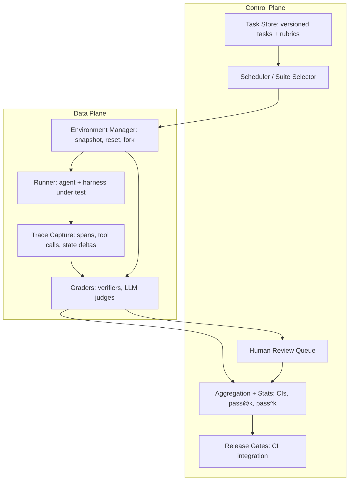

> [!info] Context
> Part of [[Harness-Internals-Overview|Harness Engineering Internals]]. Chapter: Evaluation Infrastructure — Benchmarks, LLM Judges, Trace Evals, and the Machinery of Knowing Whether Your Agent Works. Depth level 1.

# Evaluation Infrastructure: The Machinery of Knowing Whether Your Agent Works

## 1. Executive Overview

Every team building an agent eventually hits the same wall: you change a prompt, the demo looks better, you ship, and three days later a customer reports the agent doing something it never did before. You have no idea whether your change caused it, because you have no way to measure what your agent does — you only have anecdotes.

Evaluation infrastructure is the machinery that replaces anecdotes with measurement. Not a metric list, not a leaderboard — a system. Han-Chung Lee's framing is the sharpest one available: chat eval was a spreadsheet; agent eval is a system. A single-turn chatbot produces one output you can score in a CSV. An agent takes dozens to thousands of steps, mutates files and databases, calls tools that return different things on different days, and can fail at any step while still producing a plausible-looking final answer. To evaluate that, you need the same categories of infrastructure you'd need to run the agent in production: task definitions with verifiable outcomes, environments that can be snapshotted and reset, trace capture, graders (deterministic verifiers, LLM judges, humans), statistical machinery to separate signal from stochastic noise, and release gates wired into CI.

This chapter builds that system from first principles, dissects the public benchmarks (SWE-bench and its Verified repair, Terminal-Bench, Harness-Bench, AgentLens) as case studies in what goes wrong, goes deep on LLM-as-judge and its biases, and covers online evaluation — the production feedback loop that offline evals can never replace. The through-line: an eval score is only as trustworthy as the infrastructure that produced it, and most eval infrastructure is quietly broken in ways that make the scores lie.

## 2. Historical Evolution

The history of agent evaluation is best told as three eras, and the SWE-bench saga compresses all three into four years.

**Era one: static benchmarks (pre-2023).** Classical ML evaluation assumed a frozen test set and a deterministic scoring function: accuracy on ImageNet, F1 on SQuAD, BLEU on WMT. The entire discipline — train/test splits, held-out data, leaderboards — was built for models that map one input to one output. LLM chat evaluation inherited this: a prompt set, a reference answer or a preference judgment, a spreadsheet. MT-Bench (Zheng et al., 2023, arXiv 2306.05685) was the pivotal moment for grading: it showed that GPT-4 as a judge agreed with human preferences over 80% of the time — roughly the same rate humans agree with each other — which made scalable automated grading of open-ended outputs credible for the first time. The same paper documented the biases that haunt judges to this day: position bias, verbosity bias, self-enhancement bias. More on those in section 8's design discussion and section 9's failure modes.

**Era two: agentic benchmarks, naively built (2023–2024).** SWE-bench (October 2023) was the first benchmark that felt like real agent work: 2,294 GitHub issues from twelve Python repos, where the agent must produce a patch that makes the repo's own failing tests pass. Verification is deterministic — tests pass or they don't — which looked like ground truth. Then OpenAI actually audited it. Their annotation campaign — 93 professional Python developers reviewing 1,699 random samples from the test set, each sample labeled on a 0–3 severity scale — found that 38.3% of samples had underspecified problem statements (you cannot tell from the issue what the fix should be) and 61.1% had unit tests that could unfairly reject valid solutions (tests demanding a specific error message the issue never mentioned, for instance). In total, 68.3% of samples were filtered out. The repaired 500-sample subset, SWE-bench Verified (August 2024), shipped with a containerized Docker harness because the original environments themselves were flaky — tests failed regardless of the patch. GPT-4o's score jumped from 16% on original SWE-bench to 33.2% on Verified with the same scaffold. Half the "failures" had been benchmark bugs.

**Era three: the benchmarks themselves become the object of study (2025–2026).** Verified didn't survive contact with frontier models either. OpenAI's follow-up post ("Why SWE-bench Verified no longer measures frontier coding capabilities") reported an audit finding material issues in 59.4% of audited problems, with 35.5% having overly strict tests that reject functionally correct solutions — and, crucially, that contamination interacts with underspecification: a model that saw the repo during training knows the *implementation details* the underspecified tests secretly demand, so contaminated models pass tests that uncontaminated models legitimately cannot. (Figures as reported in OpenAI's post; I could not fetch the page directly, so treat the exact percentages as reported rather than independently re-verified.) Meanwhile AgentLens (arXiv 2605.12925) attacked the pass/fail signal itself: across 2,614 OpenHands trajectories on SWE-bench Verified tasks, 10.7% of *passing* trajectories were "lucky passes" — blind retries, regression cycles, missing verification — chaotic processes that happened to land on green tests. And Harness-Bench (arXiv 2605.27922) showed that the number on the leaderboard isn't even a property of the model: the same model backend scores differently under different harnesses, so every benchmark result is a measurement of a model+harness pair.

The lesson of this arc is the thesis of the chapter: evaluation is not a dataset you download, it's infrastructure you engineer, and it decays like all infrastructure.

## 3. First-Principles Explanation

Start from the question every eval must answer: **did the agent accomplish the task?** Unpack that and four requirements fall out, each forcing a piece of infrastructure into existence.

**First: "the task" must be defined such that success is checkable.** "Fix the bug" is not a task; "after your changes, `pytest tests/test_resolver.py` exits 0 and `pytest tests/` introduces no new failures" is. A task needs inputs (issue text, starting repo state), an environment (the world the agent acts in), and success criteria that a machine or an unambiguous human can apply. Anthropic's rule of thumb from "Demystifying evals for AI agents" is the right bar: a good task is one where two domain experts would independently reach the same pass/fail verdict. Ambiguity in the task spec doesn't disappear — it becomes noise in your metric. The SWE-bench annotation campaign is the empirical proof: 38.3% underspecified tasks meant more than a third of the "signal" was measuring whether the model could guess an unstated intent.

**Second: "accomplish" is a property of the world, not of the agent's words.** An agent can *say* it refunded the customer while the database shows no refund — or fabricate a plausible number after a tool returned an empty list (Lee calls this the canonical trace-level failure: the empty-tool-result hallucination). So grading must inspect **outcomes**: the final state of the environment, not the final message. This forces the environment itself to be part of the test fixture. Terminal-Bench is the cleanest expression of this principle: a task is an instruction, a Docker image, a set of tests, a reference solution, and a time limit — and the tests verify properties of the final container state, never the agent's commands or console output.

**Third: if the environment is the fixture, it must reset perfectly.** Run task 2 in the residue of task 1 — leftover files, a polluted database, an exhausted rate limit — and failures correlate across tasks for reasons that have nothing to do with the agent. Worse, residue can *inflate* scores: a file the previous trial created happens to be the one this trial needs. This is why serious eval infra converged on containerization with per-trial teardown, seed data loaded from versioned snapshots, and — the stronger requirement — checkpointing: the ability to serialize environment state and restore or fork from any point. Lee's line is worth memorizing: an eval infrastructure that cannot restore state to a checkpoint is logs, not eval infrastructure. Logs tell you what happened once; checkpoints let you re-ask the question.

**Fourth: agents are stochastic, so one run answers nothing.** The same agent on the same task passes today and fails tomorrow — temperature, tool-response ordering, provider-side model variance. Any honest claim about an agent is therefore distributional: "this agent passes this task with probability p," estimated from n trials with error bars. Everything statistical in this chapter — pass@k, pass^k, trial counts, why single-run deltas are noise — follows from this one fact.

Put the four together and you get the shape of the system: versioned tasks with verifiable outcomes, resettable environments, outcome-inspecting graders, and repeated trials with statistics. That's the data plane. On top sits the control plane: deciding what to run, aggregating results, and gating releases.

## 4. Mental Models

**The two planes.** Borrow the networking split. The **control plane** decides and judges: task suites and their distributions, verifiers, rubrics, judges, human review queues, dashboards, regression tracking, ship/no-ship gates. The **data plane** executes: the model, the harness, the runtime, tools, memory, environment state, and the traces they emit. Lee's key observation is that teams over-invest in the control plane (another dashboard, another metric) and under-invest in the data plane — but scoring the final response is the easy part; the hard part is a data plane rich enough that the score is *explainable* (which step failed), *reproducible* (rerun and get the same answer), and *actionable* (checkpoint and branch to test a fix). A green line on a dashboard you can't trace back to trajectories is decoration.

**Agents need worlds, not datasets.** Traditional ML teams own datasets. Agent teams must own *worlds* — environments with state, tools, and consequences — and evaluation means making those worlds measurable. Repeated trials, perturbation tests, and counterfactual branches mean you don't just need one world, you need many copies that don't share mutable state: multiverses, in Lee's phrase. This model explains why eval infra converges with production infra (both run the agent in a world) and why the sandboxing machinery from [[Harness-Internals-Guardrails-Sandboxing]] is a direct dependency of your eval stack.

**Evals as executable specification.** Anthropic pushes eval-driven development: write the eval before the agent can pass it. The eval suite becomes the place where "what should this agent do?" is forced into precision — the same role types and tests play for conventional code. This model also tells you where golden datasets come from: every production failure is a specification gap, so you encode it as a task and the spec grows monotonically.

**The diagnostic stack.** When a score drops, you descend three levels (Confident AI's framing, and the structure trace evals mirror): *outcome* (did the task succeed?) → *trajectory* (was the path sane — right tools, right order, no thrashing?) → *component* (which span failed — retrieval, a tool call, an argument?). Aggregate scores tell you *that* something broke; only the stack tells you *what*.

**The score measures model+harness, not the model.** Harness-Bench's contribution is naming this: across 106 tasks and 5,194 trajectories, the same model backend shows substantial variation in completion, process quality, and failure behavior across harnesses. Interestingly, stronger backends showed *lower* cross-harness variance — capable models tolerate differences in prompting, tool interfaces, and recovery scaffolding; weak ones are at the harness's mercy. Whenever you read "Model X scores Y on Z," mentally rewrite it as "Model X *inside harness H* scores Y on Z." This is the eval-side counterpart of everything in [[Harness-Internals-Agent-Loop-Architecture]]: the loop design is part of what's being measured.

## 5. Internal Architecture

A production eval system decomposes into seven components. Notice in the diagram how the control plane never touches the environment directly — everything it knows arrives via traces and grades, which is exactly why trace capture completeness is load-bearing.



**Task store.** Tasks are code, not spreadsheet rows: versioned, reviewed, with schema (inputs, environment spec, graders, reference solution, time/cost budget). The reference solution matters more than it looks — it's your proof the task is solvable, and Anthropic's diagnostic depends on it: with frontier models, 0% pass rate across many trials (0% pass@100) almost always means a broken task, not an incapable agent.

**Environment manager.** Owns world lifecycle: build the container/VM from a pinned image, load seed data, hand an isolated copy to the runner, capture the end state for grading, destroy. The advanced tier adds checkpoint/fork: serialize mid-trajectory state so you can replay from step 12 with a different model, a perturbed tool, or a fixed prompt — Lee's "experience replay," and the mechanism behind perturbation and ablation testing.

**Runner.** Executes the agent-under-test against the environment, enforcing budgets (steps, tokens, wall-clock, dollars). Critically, this should be the *same* harness code that runs production, or you're measuring a sibling of your product — eval/prod skew is a silent killer (section 9).

**Trace capture.** Records the full trajectory: every model call, tool call with arguments and results, latency, cost, and environment state deltas. Lee enumerates five capture surfaces — output, trace, memory (reads/writes to context and persistent state — see [[Harness-Internals-Memory-Systems]]), environment (files added/deleted, DB updates, permissions touched), and, for full-stack labs, mechanistic internals. This is the same instrumentation problem as [[Harness-Engineering-Observability]] covers from the operator side; in a well-built system, eval trace capture and production observability are one codebase.

**Graders.** Deterministic verifiers where ground truth is reachable, LLM judges where it isn't, humans to calibrate the judges. Section 8 covers the choice; the architectural point is that graders are pluggable per-task and a task can have several (outcome verifier + trajectory-efficiency judge + safety check).

**Aggregation and statistics.** Turns per-trial grades into distributional claims with confidence intervals, computes pass@k/pass^k, tracks per-task history to detect regressions and drift.

**Release gates.** The reason all of this exists: a defined suite whose thresholds block a merge or a model swap, exactly like a test suite blocks a broken build.

## 6. Step-by-Step Execution

Walk one task through the system — a support-agent task, since coding tasks get enough airtime.

**Task** `refund-partial-004` (v3, created from production incident #812): environment is a Postgres snapshot with customer Dana Kim owning order #1123 ($84, two items, one already shipped); input is Dana's message asking to cancel the unshipped item; graders are (a) verifier: final DB state shows item 2 cancelled, refund row for $29 exists, shipped item untouched; (b) verifier: no other customer's rows changed; (c) LLM judge on the reply's clarity, rubric v5; budget 30 steps / $0.40; n=8 trials because this is a gate task.

1. The scheduler pulls the regression suite for PR #2210 (a system-prompt change) and requests 8 environments for this task.
2. The environment manager launches 8 containers from image `support-env:9f3a2`, each restoring `seed/refund-partial-004.dump` — identical, isolated worlds.
3. The runner starts the *production* harness in each, injecting the PR's prompt. Trace capture wraps every model and tool call.
4. In trial 5, the agent calls `get_order(1123)`, gets the two line items, calls `cancel_line_item(1123, 2)`, then `issue_refund(1123, 29.00)`, then replies. In trial 7, the agent calls `issue_refund` *before* checking shipment status — it happens to pick the right item, so the outcome verifier will pass, but the trajectory shows no verification step. This is a lucky pass in miniature; the trajectory grader flags it even though outcome graders are green.
5. Each container's final DB state is dumped. Verifier (a) and (b) run as SQL assertions against the dump — deterministic, milliseconds. The judge grades 8 replies against rubric v5, order-randomized, with the reply lengths logged so length-score correlation can be monitored.
6. Aggregation: 7/8 outcome passes → per-trial p̂ = 0.875; pass^4 ≈ 0.59, below the 0.70 gate threshold for this task class. Trial 3's failure links directly to its trace: the agent refunded $84 instead of $29 — it never called `get_order` and guessed. The gate fails the PR with a link to that exact span, not a red number.
7. The failing trajectory gets checkpointed; an engineer forks it at step 2 to test whether a tool-description fix changes the behavior, without re-running the whole suite.

Total cost: 8 trials × ~$0.30 ≈ $2.40 for this task, times a few hundred gate tasks — which is why section 11 is about money.

## 7. Implementation

How you'd actually build this, module by module.

**Task schema.** Resist the notebook-and-CSV gravity well from day one; that's the debt Lee describes (task sets in CSVs, judge prompts in Excel, failures pasted into Slack). A task is a directory in a repo:

```
tasks/refund-partial-004/
  task.yaml        # id, version, owner, provenance (incident #812), budgets, n_trials
  env/             # image ref + seed data (or a builder script)
  graders/
    outcome.sql    # deterministic assertions on final state
    trajectory.py  # programmatic trace checks (verification-before-mutation, step count)
    judge.yaml     # rubric text, judge model pin, calibration-set ref
  reference/       # a known-good trajectory or solution proving solvability
```

Provenance is a first-class field because your golden dataset should be built from real failures, not synthetic guesses. Anthropic's guidance: start with 20–50 simple tasks drawn from real failures and what you already check manually; convert bug reports and support tickets into tasks; prioritize by user impact. Hamel Husain's Level-1/2/3 framing agrees from the practitioner side — synthetic tasks are a legitimate *bootstrap* before you have traffic, but every synthetic task encodes your guess about usage, and production failures are the corrective. Balance the set: include tasks where the behavior *shouldn't* trigger (the customer who asks about a refund but isn't eligible), or you've built a classifier eval with one class.

**Environment manager.** Docker (or microVMs — see [[Harness-Internals-Guardrails-Sandboxing]] for the isolation trade-offs) with three rules: pin image digests, never tags; seed data restored per-trial, never shared; no network egress except through a recorded/mocked gateway. That last one is the determinism linchpin — a task that depends on live web content is a different task every day. For replay and forking, snapshot filesystem + DB dumps at step boundaries; full-state serialization (Lee's checkpoint requirement) is what upgrades your logs into an experimentation substrate.

**Grader interface.** One signature, many implementations:

```python
class Grader(Protocol):
    def grade(self, trace: Trace, env_final: EnvState, task: Task) -> Grade
        # Grade: score in [0,1], verdict, evidence (span ids, sql rows, judge rationale)
```

Evidence is mandatory. A grade that can't point at the span or state row that justified it can't be debugged, and you *will* need to debug graders — Anthropic's CORE-Bench experience is the cautionary tale: Opus 4.5's measured score went from 42% to 95% after fixing grading that rejected "96.12" when the reference said "96.124991…", ambiguous task specs, and non-reproducible stochastic tasks. More than half the headline gap was eval bugs.

**Judge implementation.** Pin the judge model version. Randomize position in any pairwise comparison and require both orderings to agree (MT-Bench's mitigation for position bias — GPT-4 flipped its preference on order-swap in roughly a third of cases). Log response length vs score to catch verbosity bias. Never let a judge grade its own model family without checking for self-preference (documented since MT-Bench; quantified in later work, e.g. arXiv 2604.22891). And calibrate: keep a held-out set of ~100 human-labeled transcripts, measure judge–human agreement per rubric version, and re-measure on every judge-model or rubric change — that re-measurement is your defense against judge drift, where a provider-side model update silently changes your metric's meaning. Hamel's operational version: humans periodically grade a sample of live traces, you track judge–human correlation, and labeler critiques become the raw material for improving the rubric.

**Statistics.** Per-trial success is Bernoulli; report p̂ with a Wilson or bootstrap interval, never bare percentages. With n=8 trials, your 95% CI on a single task is roughly ±30 points — which is fine, because you aggregate across hundreds of tasks; what you must *not* do is compare two agents on one run each. The variance is not hypothetical: reported day-to-day swings on identical settings include 77%→63% on one safety suite (arXiv 2512.06710, which proposes intraclass correlation to quantify eval inconsistency), and Evan Miller's "Adding Error Bars to Evals" (Anthropic, 2024) derives the estimators and recommends resampling protocols. Rule of thumb: a delta smaller than your cross-run standard deviation is not a result, it's weather. Compute both pass@k = 1 − C(n−c, k)/C(n, k) (capability: can it *ever* do this?) and pass^k ≈ (c/n)^k (reliability: does it do this *every time*?). The gap between them is the point: at 70% per-trial success, pass@3 ≈ 97% while pass^3 ≈ 34%. Agents that look great in demos and fail in production live in that gap, because a human picking the best of three attempts experiences pass@k while an unattended pipeline experiences pass^k. Anthropic's guidance matches: pass@k for tool-assisted humans, pass^k for customer-facing autonomy.

**CI integration.** Three tiers, because money: (1) per-PR smoke suite — a few dozen cheap, high-signal tasks, low n, minutes; (2) nightly full regression — the whole suite at proper n; (3) pre-release gate — full suite plus human review of a transcript sample. Cache aggressively (image layers, unchanged-task results keyed on agent-version × task-version) and spend trials adaptively: sequential testing lets you stop early on tasks that are clearly passing or clearly failing and concentrate n where the CI straddles the threshold.

## 8. Design Decisions

**Verifier vs judge.** The rule experienced teams converge on: use deterministic verifiers wherever ground truth is mechanically reachable, and spend judges only on what verifiers can't reach. Code is the easy case — tests pass or they don't, and no judge should ever be asked "does this patch look correct?" when a test suite can answer. The subtlety is that verifiers have their own failure mode in the opposite direction: SWE-bench's "unfair tests" (61.1% flagged) were deterministic verifiers that encoded *one implementation* of a correct behavior. Determinism guarantees reproducibility, not validity. Judges buy flexibility and nuance at the cost of non-determinism, per-grade token cost, bias management, and a calibration obligation. The hybrid is usually right: verifier for the outcome, judge for the qualities no test can express (tone, clarity, appropriateness of escalation).

**Grade outcomes, not paths.** The tempting design is asserting the tool-call sequence: called `search` then `get_order` then `refund`. Anthropic explicitly warns this is too rigid — agents regularly find valid approaches the eval designer didn't anticipate, and path assertions fail them for creativity. Grade the outcome, and use *trajectory properties* (did it verify before mutating? did it loop?) as separate, softer signals. AgentLens is the research version of that softer signal: its taxonomy of passing trajectories — Ideal 20.2%, Solid 69.1%, Lucky 10.7% — exists precisely because outcome-only grading treats a principled solution and a chaotic fluke as identical.

**Real failures vs synthetic tasks.** Synthetic generation scales and covers hypotheticals; real failures carry the distribution of actual usage and are, by construction, cases your agent got wrong. Build the spine from real failures, use synthetic to fill coverage gaps (rare-but-critical scenarios that haven't happened yet), and mark provenance so you can weight them differently. A suite that's mostly synthetic measures your imagination.

**Hermetic vs live environments.** Hermetic (containerized, mocked network) buys determinism and reproducibility at the cost of realism — mocked tools never rate-limit you the way real ones do. Live buys realism at the cost of unreproducible scores. The resolution is layering, not choosing: hermetic for CI gates (a gate must be deterministic to be a gate), scheduled live smoke tests for realism, and online evaluation (section 10's production loop) for truth.

**Shared benchmark vs private suite.** Public benchmarks give cross-team comparability and are contamination-doomed on a two-year fuse — SWE-bench Verified went from gold standard to abandoned-by-OpenAI inside two years. Private suites built from your own failures can't be trained on and measure *your* task distribution, but give you no external comparability. Use public benchmarks to shortlist models; use your private suite to make every actual decision.

## 9. Failure Modes

**Flaky environments corrupt everything downstream.** A test that fails for environmental reasons (dependency drift, port collisions, leaked state, resource exhaustion) is indistinguishable in the aggregate from an agent failure — and correlated environment failures produce phantom regressions that send engineers hunting through prompt diffs for a bug that lives in the Dockerfile. Original SWE-bench had exactly this; the Docker harness was as much a part of the Verified fix as the human screening. Debug signal: failures that cluster by worker node, time of day, or task-adjacency rather than by agent version. Defense: environment health canaries (run the reference solution — if the *known-good* trajectory fails, quarantine the task) and per-trial isolation with no shared mutable state.

**The lucky pass.** Outcome-only grading rewards flailing that lands. At AgentLens's measured 10.7% rate, roughly one in ten of your green checkmarks certifies a process you'd never accept from a junior engineer — and lucky passes are exactly the trajectories that won't survive a distribution shift. Defense: trajectory graders for regression cycles, retries without diagnosis, and missing verification steps; weight pass^k over pass@k in gates.

**Judge biases and drift.** Position bias (order-swap flips ~1/3 of pairwise verdicts for GPT-4 in MT-Bench's measurements), verbosity bias (judges prefer longer answers at rates measurably above human preference for length), self-preference (judges favor their own family's outputs). Each silently tilts comparisons — verbosity bias alone will "reward" any change that makes your agent chattier. Drift is nastier: your judge is an API-served model that gets updated, so the meaning of a 7/10 changes under your feet without any diff in your repo. Defense: pinned judge versions, both-orders pairwise, length-controlled analysis, and scheduled recalibration against your human-labeled set.

**Contamination and the contamination-underspecification interaction.** Training-set leakage inflates scores, but OpenAI's Verified post-mortem identified the compounding version: on underspecified tasks with over-strict tests, memorized repo knowledge supplies the unstated implementation details, so contamination doesn't just add points — it adds points on precisely the tasks that are invalid. Public-benchmark deltas between models with different training cutoffs are partly measuring cutoff dates.

**Eval/prod skew.** Eval runtime and production runtime start "basically the same" and diverge silently — different tool timeouts, memory config, model gateway. Then the dashboard improves while customers regress, and you can't tell whether the agent or the scorer changed. This is Harness-Bench's finding weaponized against you: you evaluated one model+harness pair and shipped a different one. Defense: the runner imports the production harness as a library; any config delta between eval and prod is an explicit, reviewed file.

**Grader bugs read as model weakness.** CORE-Bench's 42%→95% swing and Anthropic's 0%-pass@100 heuristic both say the same thing: when a score is surprisingly bad, suspect the grader before the agent. The only reliable detector is reading transcripts — Anthropic's blunt version: you cannot tell whether your graders work unless you read many trials' transcripts and grades; Hamel's version: look at your data, remove all friction from looking at your data.

**Saturation and Simpson's paradox.** A suite your agent passes at 95% can no longer detect improvement (SWE-bench Verified went 40%→80%+ in a year and stopped discriminating at the frontier); retire and replace tasks continuously. And aggregate movements mislead: a +2.4-point average can hide a regression in your most important task family offset by gains in trivia — slice by task family before believing any headline delta.

## 10. Production Engineering

**Anthropic** (verified — engineering blog). "Demystifying evals for AI agents" is the closest thing to a published internal playbook: definitions (task, trial, grader, transcript, outcome, harness), the start-small-from-real-failures doctrine, the three grader families with explicit trade-offs, pass@k vs pass^k with the customer-facing-agents caveat, eval-driven development, and the organizational pattern — a dedicated evals team owns the core infrastructure while domain experts and product teams contribute most tasks and run evaluations themselves. That org split mirrors the control-plane/data-plane split: platform team owns the planes, task authorship is federated.

**OpenAI** (verified — index posts). The SWE-bench Verified campaign is the canonical case study in benchmark repair: pay 93 professional developers to annotate 1,699 samples on a severity rubric, filter 68.3%, rebuild the harness on Docker, publish the methodology. Their later abandonment of Verified is equally instructive: they audited their own repair, published the failure rates, and moved on — benchmarks are consumables, not monuments.

**Terminal-Bench / Stanford & collaborators** (verified — paper + tbench.ai). Terminal-Bench 2.0's 89 hard tasks formalize the task-as-artifact pattern (instruction + Docker image + state-inspecting tests + reference solution + time limit) in the Harbor task format, with the Harbor harness running Claude Code, Codex CLI, OpenHands, and others against the same tasks — the first serious attempt at holding tasks constant while varying the harness, which is exactly the controlled comparison Harness-Bench argues every reported score needs. Frontier agents score under 65%, so it still discriminates.

**Cursor, Cognition** (inference — limited official documentation). Neither publishes eval internals in depth. Cognition's public writing on Devin emphasizes session-level outcome metrics, and both companies' products imply large-scale trajectory capture and replay; treat specifics as unverified. What *is* verifiable is the outcome-metric pattern they and every coding-agent vendor rely on in production: PR merge rate, edit acceptance rate, and human-review pass rate as online ground truth — metrics that need no judge because the user's accept/reject *is* the label.

**The tooling ecosystem** (verified — vendor docs). Confident AI/DeepEval, Langfuse, Braintrust, LangSmith and peers converge on the same architecture this chapter derives: trace-first capture, span-level scoring (tool correctness, argument correctness, step efficiency), the outcome→trajectory→component diagnostic stack, and CI hooks. Convergent evolution across independent vendors is decent evidence the architecture is load-bearing rather than fashionable. Hamel Husain's warning still applies: don't buy the fancy tool before you've looked at your own data — the tool amortizes a discipline you must already have.

**Online evaluation — everyone, by necessity.** Offline evals sample a guessed distribution; production is the real one. The production loop: implicit feedback (acceptance rates, merge rates, task abandonment, escalation-to-human rate) and explicit feedback (thumbs, ratings) feed a triage queue; triaged failures become new eval tasks; the suite grows to match reality. A/B testing at the agent level works but is harder than UI A/B: outcome metrics are noisy and lagged (a bad refund surfaces days later), per-user variance is huge, so you need longer windows and guardrail metrics (cost per task, escalation rate) alongside the success metric. The regression suite grown from production failures is the compounding asset — it's the only part of your eval stack guaranteed to track your actual failure distribution.

## 11. Performance

Eval infrastructure has a cost curve that surprises teams: a serious suite costs real money per run, and the naive response — run it less often — destroys the feedback loop you built it for.

**Where the money goes.** Trials × steps × tokens dominates. A 300-task gate suite at n=8 trials averaging $0.30/trial is ~$720 per full run; nightly, that's ~$22K/month before you add judge costs (a judge call per grade adds 10–30% overhead). Wall-clock is the second constraint: agent trials run minutes each, so serialized execution of thousands of trials is a day, not an hour.

**Parallelism.** Trials are embarrassingly parallel — every trial is an isolated world by design, so the ceiling is container orchestration and model-API rate limits, not algorithmic. Practical pattern: a worker pool pulling trials from a queue, per-provider token budgets to avoid rate-limit-induced correlated failures (a rate-limited trial is an environment flake, and it will cluster by time — exactly the signature from section 9).

**Caching.** Three layers. Image and seed-data caching (build once per task version, not per trial). Result caching keyed on (agent version, task version, env version) — an unchanged pair needs no re-run in per-PR CI, which is what makes tiered CI affordable. Prompt caching at the provider level cuts per-trial token cost meaningfully for agents with long static system prompts — the same [[Harness-Internals-Runtime-Anatomy]] KV-cache economics apply to eval traffic, and eval traffic is *more* cacheable because tasks repeat.

**Adaptive trial allocation.** Fixed n per task wastes most of its budget on tasks that are clearly fine or clearly broken. Sequential testing (stop when the posterior on pass/fail crosses a threshold) concentrates trials on borderline tasks where the extra n actually changes the decision. This routinely cuts trial spend by half at equal statistical power — standard sequential-analysis behavior, applied to eval budgets.

**The variance-budget trade-off is the real design decision.** Statistical power scales with √n; cost scales with n. You can't afford n=50 everywhere, so allocate by decision weight: gate tasks and known-regression tasks get high n; exploratory coverage gets n=1–2 and only graduates to gate status (with real n) when it proves informative. Anthropic's note that early in development each change has *large* effects means small n suffices early — rigor requirements grow as your effect sizes shrink.

## 12. Best Practices

Start with 20–50 tasks from real failures this week rather than a 500-task synthetic suite next quarter — the small real suite finds bugs immediately and teaches you what infrastructure you actually need. Make every task pass the two-experts test, and prove solvability with a reference solution before blaming the agent. Verifiers first, judges only past the verifier frontier, humans to calibrate the judges — and pin, position-randomize, length-monitor, and recalibrate every judge. Grade outcomes; observe trajectories. Report pass^k for anything unattended. Never compare single runs; a delta without error bars is a mood. Read transcripts on a schedule — grader trust decays otherwise, and every documented eval disaster in this chapter (SWE-bench's 68.3%, CORE-Bench's 42%→95%) was found by humans reading, not by metrics. Keep eval runtime and production runtime the same code. Version tasks, rubrics, judges, and environments like the production artifacts they are. Grow the suite from production failures continuously, and retire saturated tasks with equal discipline.

Anti-patterns, for symmetry: the spreadsheet-and-Slack eval stack (Lee's debt inventory); asserting tool-call sequences; judging what a test could verify; trusting a public leaderboard delta between two model+harness pairs you didn't control; treating the eval suite as done.

## 13. Common Misconceptions

**"Deterministic tests mean the benchmark is valid."** SWE-bench's tests were perfectly deterministic and 61.1% of sampled tasks had tests that could reject correct solutions. Determinism is about *reproducibility*; validity is about whether the check corresponds to task success. You need both, and they fail independently.

**"The benchmark score is a property of the model."** It's a property of the model+harness pair under a specific budget and environment — Harness-Bench exists because this misconception drives purchasing and research decisions. The temptation is real because model-only attribution is simpler and matches how leaderboards are presented. Corrected model: a benchmark number is an experiment report, and the harness is part of the apparatus.

**"90% pass rate means it works."** At which k, and which metric? 90% per-trial success is pass^5 ≈ 59% — an unattended agent asked to do five things in a row disappoints four users in ten. The single-number instinct comes from classification accuracy, where one attempt was the whole story. For agents, reliability *is* the product; report the metric that measures it.

**"Our LLM judge is basically a cheap human."** A judge is a model with measurable, systematic biases (position, length, self-preference) and an unversioned dependency on its provider. It's a human *proxy* whose agreement with humans you must measure and re-measure — MT-Bench's >80% agreement figure came with the bias catalog attached, and both halves of that result matter.

**"More eval tooling will fix our eval problem."** The bottleneck is almost never the dashboard; it's task quality, grader validity, and whether anyone reads transcripts. Hamel Husain's core finding across failed AI products is a missing evaluation *discipline*, not a missing vendor. Tools amortize discipline; they don't create it.

**"We'll build evals once the agent is working."** Backwards — evals are how you find out whether it's working, and eval-driven development uses them to define "working" before you build. Deferring evals means every iteration until then is judged by vibes, which is why the first serious suite so often reveals the demo was pass@k theater.

## 14. Interview-Level Discussion

**Q1: You changed the system prompt and SWE-bench Verified went from 61% to 64%. Ship it?**
Not on this evidence. First, single-run deltas on ~500 binary tasks carry a CI of roughly ±4 points, so +3 is within noise — you need multiple runs and error bars (Miller's resampling protocols) before this is a result. Second, Verified itself has documented validity problems at the frontier (OpenAI's audit: material issues in ~59% of audited problems), so a small delta may live entirely inside broken tasks. Third, check slices for Simpson's paradox — an aggregate gain can hide regression in the task family you care about. What I'd actually do: rerun at n≥5, compare pass^k not just pass@1, slice by repo/task family, and read a sample of newly-passing and newly-failing transcripts to see *what changed behaviorally*. If the transcripts show the same trajectories with luckier endings, it's noise wearing a trend's clothes.

**Q2: Design the grading stack for a customer-support agent that can issue refunds.**
Layered. Outcome verifiers on environment state: refund row exists with correct amount, correct order mutated, no other customer's data touched — SQL assertions, deterministic, non-negotiable. Trajectory verifiers: agent read the order before mutating it (verification-before-action), step count within budget, no repeated failed tool calls. LLM judge only for the reply text (clarity, tone, correct explanation of what was done), with a pinned judge, rubric calibrated against ~100 human-labeled transcripts, and length/position bias monitoring. Safety graders run *inverted* tasks too: the customer who isn't eligible must *not* get a refund — without negative tasks the suite rewards an agent that refunds everyone. Gate on pass^k because this runs unattended; a refund agent that's right 90% per trial is wrong for one customer in ten per attempt chain.

**Q3: Your eval dashboard improved for three weeks; customer complaints rose. Diagnose.**
This is the eval/prod divergence family. Hypotheses in order: (1) eval/prod skew — the eval harness config drifted from production (different timeouts, tool versions, model gateway), so you improved the sibling, not the product; diff the configs. (2) Distribution shift — the suite reflects last quarter's failure distribution; complaints are about new usage patterns the suite doesn't sample; triage recent complaints into tasks and measure. (3) Judge drift or grader rot — the provider updated your judge model, or a grader now passes things it shouldn't; recalibrate against the human-labeled set. (4) Goodhart — three weeks of optimizing against a fixed suite taught the agent the suite; check whether gains concentrate in gate tasks while held-out tasks are flat. The structural fix is the production feedback loop: complaints become tasks, so the dashboard is dragged back toward reality continuously.

**Q4: When do deterministic verifiers actually beat LLM judges, and where's the boundary?**
Verifiers win wherever task success is mechanically checkable from environment state: tests pass, the file compiles, the DB row exists, the API returned 200 with the right payload. They're faster, free, reproducible, and immune to judge biases — for code, tests-pass is ground truth and using a judge there adds noise to a solved problem. The boundary is *specification reachability*: a verifier encodes one formal specification, and when the space of correct behaviors is larger than what you can formalize, the verifier becomes an unfair test — SWE-bench's 61.1% is what over-formalization looks like at scale. Judges take over for qualities without formal specs: clarity, appropriateness, faithfulness of a summary. The mature answer isn't a boundary but a composition — verifier for the outcome core, judge for the human-facing surface — plus the meta-rule that a surprisingly low verifier score indicts the verifier first (0% pass@100 heuristic).

**Q5: Why does pass^k matter more than pass@k for agents, and what does the gap tell you?**
pass@k measures capability (can it ever?), pass^k measures reliability (does it always?). They diverge fast: 70% per-trial → pass@3 ≈ 97%, pass^3 ≈ 34%. Demos, leaderboards, and human-in-the-loop workflows experience pass@k because a human filters attempts; unattended pipelines experience pass^k because nobody catches attempt two. A large gap is diagnostic: the agent has the capability but lacks consistency, which points at stochastic trajectory choices, fragile recovery behavior, or lucky-pass dynamics (AgentLens's 10.7%) rather than missing skill — and the fix is harness work (verification steps, better tool contracts, checkpointed retries — see [[Harness-Internals-Production-Patterns]]) more often than model work.

**Q6: How would you detect that your golden dataset has gone stale?**
Three signals. Saturation: suite pass rate creeps above ~90% and release deltas compress into tenths of points — the suite lost discriminative power (SWE-bench Verified's 40%→80% year). Distribution mismatch: triage a month of production failures and compute what fraction map to an existing task family; if most don't, the suite samples a world that no longer exists. Decision inertness: track how often the gate actually changes a ship decision; a gate that never fires is either measuring solved problems or being routed around. Remedies: retire saturated tasks, mint tasks from the untriaged failure classes, and periodically re-run the two-experts test on old tasks — task validity rots too, as dependencies and product behavior drift.

## 15. Advanced Topics

**Process-aware evaluation.** AgentLens's Prefix Tree Acceptor references — compact automata built from passing trajectories that let you score *how* a new trajectory diverges from known-good processes — point at grading process quality without hand-writing trajectory rules. Open problem: PTAs need many passing trajectories per task, which is exactly the data hard tasks lack.

**Statistical foundations for agent evals.** Intraclass correlation for run-to-run inconsistency (arXiv 2512.06710), Miller's error-bar framework, and bootstrapped CIs on leaderboards are the start. Unsolved: proper significance testing when tasks are correlated (same repo, same tool), and power analysis that tells a team the *minimum* suite size for their decision, not a folk n.

**Self-improving harnesses and eval feedback loops.** Work like Self-Harness (arXiv 2606.09498) explores harnesses that modify themselves against eval signal. This makes the eval suite a training signal, which sharpens Goodhart risk to a point: held-out suites, rotating tasks, and contamination tracking become mandatory once anything optimizes against your evals automatically.

**Mechanistic-interpretability graders.** Lee's fifth capture surface — internal activations — is available only to teams serving their own weights, but it dangles the possibility of graders that detect *why* (the model "knew" the tool result was empty and answered anyway) rather than *that*. Entirely research-stage today.

**Environment realism at scale.** The frontier between hermetic determinism and live realism is being attacked with recorded-replay tool gateways and high-fidelity simulated services (simulated inboxes, CRMs, browsers). The open problem is drift between the simulacrum and the real service — a simulated Stripe that lags real Stripe's API is a slowly-falsifying eval.

## 16. Glossary

- **Control plane / data plane**: The decision-and-judgment half of eval infra (task suites, graders, gates, dashboards) vs the execution half (agent, harness, environments, traces).
- **Task**: A single test: inputs, environment spec, success criteria, budgets. Good tasks pass the "two experts, same verdict" bar.
- **Trial**: One attempt at a task. Agents are stochastic, so tasks are run for multiple trials.
- **Trajectory / transcript / trace**: The complete record of a trial — model calls, tool calls with arguments and results, intermediate state, costs.
- **Outcome**: The final environment state at trial end; what outcome graders inspect, as opposed to what the agent claims.
- **Golden dataset**: The curated task suite used for offline evaluation, ideally built from real production failures.
- **Verifier**: A deterministic grader that checks outcomes mechanically (tests pass, DB row exists).
- **LLM-as-judge**: A model grading outputs against a rubric; flexible but non-deterministic and systematically biased (position, length, self-preference); requires calibration against human labels.
- **Judge drift**: Silent change in a judge's grading behavior, typically from provider-side model updates; detected by recalibration against a fixed human-labeled set.
- **pass@k**: Probability at least one of k trials succeeds — capability. 1 − C(n−c,k)/C(n,k).
- **pass^k**: Probability all k trials succeed — reliability. ≈ (c/n)^k. The gate metric for unattended agents.
- **Lucky pass**: A passing trajectory produced by a chaotic process (blind retries, no verification) rather than a principled one; ~10.7% of passes in AgentLens's SWE-bench study.
- **Harness sensitivity**: Variation in a model's benchmark score across harnesses; the reason a score is a property of the model+harness pair.
- **Environment snapshot / reset**: Restoring the eval world (container, seed data) to a known state per trial; the prerequisite for uncorrelated, reproducible trials.
- **Checkpoint / replay**: Serializing mid-trajectory state so trajectories can be restored, forked, and re-run counterfactually.
- **Eval/prod skew**: Divergence between the harness configuration being evaluated and the one shipped; makes scores describe a sibling of the product.
- **Contamination**: Benchmark task content present in a model's training data, inflating scores — compounding with underspecified tasks whose hidden requirements the model has memorized.
- **Saturation**: A suite passed at rates high enough that it can no longer detect improvement; solved tasks must be retired.
- **Release gate**: An eval suite with thresholds that blocks a merge, model swap, or release — evals as CI.

## 17. References

- **Anthropic — Demystifying evals for AI agents** (https://www.anthropic.com/engineering/demystifying-evals-for-ai-agents). The practitioner playbook this chapter leans on hardest: definitions, the start-from-real-failures doctrine, grader taxonomy, pass@k vs pass^k, eval-driven development, org design. Read first if you're building a suite this month.
- **Han-Chung Lee — Hidden Technical Debt of AI Systems: Agent Evaluation Infrastructure** (https://leehanchung.github.io/blogs/2026/06/13/hidden-technical-debt-agent-evaluation-infra/). The control-plane/data-plane framing, the five capture surfaces, the checkpoint-or-it's-just-logs standard, and the debt inventory. Read for the systems view — the "why this is infrastructure" argument.
- **OpenAI — Introducing SWE-bench Verified** (https://openai.com/index/introducing-swe-bench-verified/). The canonical benchmark repair: 93 annotators, 1,699 samples, 38.3%/61.1% flaw rates, the Docker harness. Read to understand how a "ground truth" benchmark fails and what fixing one costs.
- **OpenAI — Why SWE-bench Verified no longer measures frontier coding capabilities** (https://openai.com/index/why-we-no-longer-evaluate-swe-bench-verified/). The sequel: the repaired benchmark's own audit (material issues in ~59% of audited problems, over-strict tests, contamination interaction). Read for the lifespan argument — benchmarks are consumables.
- **Harness-Bench: Measuring Harness Effects across Models in Realistic Agent Workflows** (https://arxiv.org/abs/2605.27922). 106 tasks, 5,194 trajectories: scores are properties of model+harness pairs; stronger models show lower cross-harness variance. Read before trusting any leaderboard delta.
- **AgentLens: Revealing The Lucky Pass Problem in SWE-Agent Evaluation** (https://arxiv.org/abs/2605.12925). 10.7% of passing trajectories are lucky; the Ideal/Solid/Lucky taxonomy and PTA process references. Read when designing trajectory-level grading.
- **Terminal-Bench** (https://www.tbench.ai/ and https://arxiv.org/abs/2601.11868). The task-as-artifact pattern (instruction + Docker image + state-inspecting tests + reference solution + time limit) and the Harbor harness. Read as a reference implementation of hermetic outcome-graded tasks.
- **Zheng et al. — Judging LLM-as-a-Judge with MT-Bench and Chatbot Arena** (https://arxiv.org/abs/2306.05685). The founding judge paper: >80% human agreement plus the bias catalog (position, verbosity, self-enhancement). Read before deploying any judge.
- **Hamel Husain — Your AI Product Needs Evals** (https://hamel.dev/blog/posts/evals/). The discipline argument: failed AI products share missing eval systems; three levels (assertions → human/model eval → A/B); look at your data. Read for the operational culture your infra must serve.
- **Philipp Schmid — Pass@k vs Pass^k: Understanding Agent Reliability** (https://www.philschmid.de/agents-pass-at-k-pass-power-k). Clean formulas and worked examples (70% → pass@3 97% vs pass^3 34%). Read as the short quantitative companion to section 7's statistics.
- **Confident AI — LLM Agent Evaluation: The Complete Guide** (https://www.confident-ai.com/blog/llm-agent-evaluation-complete-guide). The outcome→trajectory→component diagnostic stack and span-level metric definitions (tool/argument correctness, step efficiency). Read when instrumenting trace-based evals.
- **Stochasticity in Agentic Evaluations: Quantifying Inconsistency with Intraclass Correlation** (https://arxiv.org/abs/2512.06710). Run-to-run variance measured (77%→63% day-over-day swings) and ICC as the inconsistency metric. Read for the statistical-rigor case against single runs.

## 18. Subtopics for Further Deep Dive

### LLM-as-Judge Engineering
- **Slug**: Eval-LLM-Judge-Engineering
- **Why it deserves a deep dive**: Judges are the single most-deployed and most-misused eval component; rubric design, bias mitigation mechanics, calibration pipelines, and drift detection each have enough depth for standalone treatment.
- **Has enough depth for a full chapter**: yes
- **Key questions to answer**: How do you build and maintain a human-labeled calibration set, and what agreement statistic (Cohen's kappa vs raw agreement) should gate judge deployment? What do position/length/self-preference mitigations cost in grading throughput and dollars? When should you fine-tune a small judge vs prompt a frontier one?

### Environment Snapshot, Checkpoint, and Replay Systems
- **Slug**: Eval-Environment-Replay-Systems
- **Why it deserves a deep dive**: Checkpoint/fork/replay is the mechanism that upgrades eval logs into an experimentation substrate, and its implementation (state serialization, tool-response recording, deterministic re-execution) is a hard systems problem barely covered anywhere.
- **Has enough depth for a full chapter**: yes
- **Key questions to answer**: What state must be captured to make a mid-trajectory fork faithful (filesystem, DB, context window, tool-side state)? How do recorded-replay tool gateways handle non-idempotent APIs? What does Terminal-Bench/Harbor's task format get right and miss?

### Statistical Methods for Agent Evaluation
- **Slug**: Eval-Statistical-Methods
- **Why it deserves a deep dive**: Almost every published agent comparison is statistically unsound; the estimator/CI/power-analysis toolkit (Miller's framework, ICC, sequential testing, clustered-task corrections) deserves a rigorous standalone treatment.
- **Has enough depth for a full chapter**: yes
- **Key questions to answer**: How many trials and tasks do you need to detect a given effect size at given power? How should CIs handle correlated tasks from the same repo/domain? How does sequential/adaptive trial allocation change gate design?

### Benchmark Contamination Detection and Lifecycle
- **Slug**: Eval-Benchmark-Contamination
- **Why it deserves a deep dive**: The SWE-bench arc shows benchmarks have lifespans; detection methods (perturbation probes, cutoff-split analysis), private-holdout strategies, and rotation policies are their own discipline.
- **Has enough depth for a full chapter**: yes
- **Key questions to answer**: How do you detect contamination in a black-box model? How does contamination interact with underspecified tasks (the Verified post-mortem mechanism)? What rotation cadence keeps a private suite trustworthy once agents optimize against it?

### Online Evaluation and Agent-Level A/B Testing
- **Slug**: Eval-Online-Agent-AB
- **Why it deserves a deep dive**: The production feedback loop (implicit outcome metrics, triage-to-task pipelines, agent-level experiments with lagged noisy outcomes) is where offline eval meets reality, and its experimental-design problems are distinct from web A/B testing.
- **Has enough depth for a full chapter**: yes
- **Key questions to answer**: Which implicit metrics (merge rate, acceptance rate, escalation rate) are least gameable, and how do you de-bias them? How long must an agent A/B run given per-user variance and outcome lag? How do you route production failures into the golden dataset without leaking user data?
