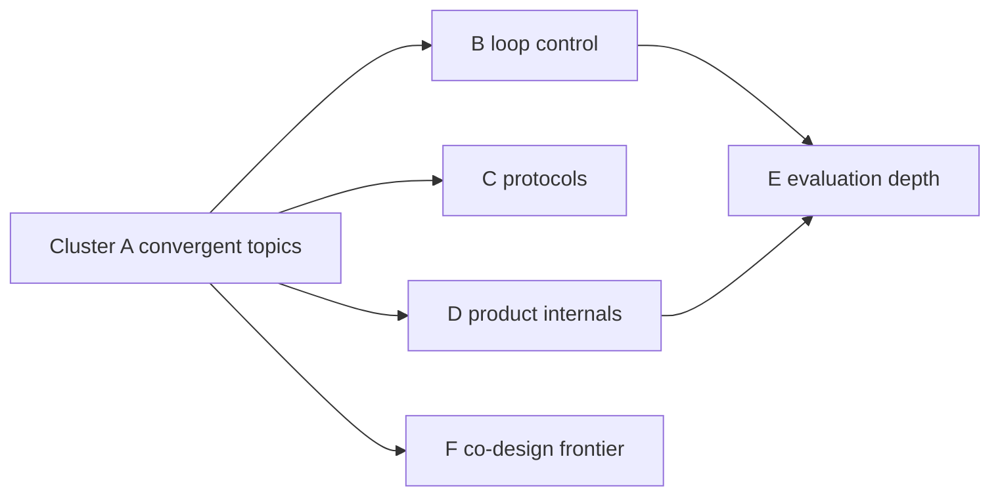

# Harness Engineering Internals — What to Explore Next

> [!info] Future Research
> The twelve Level 1 chapters each nominated 4–5 sub-topics deep enough for a full chapter of their own. You deliberately deferred that second wave. This note is the complete roadmap for it — deduplicated across chapters, clustered by theme, and ranked. Each entry names the parent chapter, why it earns a full chapter, and the questions it must answer.

> [!success] Batch 1 complete (2026-07-02)
> The first five Cluster A topics are written: [[Harness-Internals-Prompt-Assembly-Cache-Economics|A1 Prompt Assembly & Cache Economics]], [[Harness-Internals-Compaction-Pipelines|A2 Compaction Pipelines]], [[Harness-Internals-Subagent-Orchestration|A3 Subagent Orchestration]], [[Harness-Internals-Speculative-Decoding|A4 Speculative Decoding]], [[Harness-Internals-Memory-Poisoning-Defense|A5 Memory Poisoning Defense]]. They're marked ✅ below. Chapters were built to the verbatim [[Harness-Internals-Research-Contract|Research Contract]] (topic-agnostic sibling: [[Production-Research-Chapter-Standard]]). New chapter candidates are in the "Unknown-Unknowns" section at the bottom.

> [!success] Batch 2 complete (2026-07-03)
> Five more written: [[Harness-Internals-Sandbox-Kernel-Enforcement|B2-1 Kernel Sandbox Enforcement]] and [[Harness-Internals-MicroVM-Sandbox-Infrastructure|B2-2 MicroVM Sandbox Infrastructure]] (these two together satisfy roadmap item 6, which predicted its own split), [[Harness-Internals-Agentic-Search-vs-Embedding-Retrieval|B2-3 Agentic Search vs Embedding Retrieval]] (item 7 — **Cluster A now fully complete**), [[Harness-Internals-Information-Flow-Control-Agents|B2-4 Information-Flow Control]] (built the U1 unknown-unknown), and [[Harness-Internals-Termination-Budgets-Loop-Control|B2-5 Termination, Budgets & Loop Control]] (item 8 — **opens Cluster B**). All marked ✅ below. **19 roadmap topics remain deferred** (rest of B: 9–12; all of C: 13–17; D: 18–24; E: 25–26; F: 27). One verified parent correction propagated: Codex's Linux sandbox now defaults to **bubblewrap**, not Landlock (confirmed against the `openai/codex` source) — fixed in [[Harness-Internals-Guardrails-Sandboxing]] and [[Harness-Internals-Codex-Architecture]]. Batch-2's new candidates are in "Unknown-Unknowns surfaced by batch 2" at the bottom.

> [!success] Batch 3 complete (2026-07-03)
> Five more written, **completing Cluster B**: [[Harness-Internals-Durable-Execution|B3-1 Durable Execution]] (item 9), [[Harness-Internals-Scheduling-And-Steering|B3-2 Schedulers & Steering]] (item 10), [[Harness-Internals-Planning-And-Reflection|B3-3 Planning & Reflection]] (item 11), [[Harness-Internals-Agent-Topology-Economics|B3-4 Agent-Topology Economics]] (item 12), and [[Harness-Internals-Agent-Progress-Metrics|B3-5 Agent Progress Metrics]] (built the U6 unknown-unknown). All marked ✅ below. **15 roadmap topics remain** (all of C: 13–17, D: 18–24, E: 25–26, F: 27) plus unbuilt U7–U10. One parent claim *softened, not overturned*: Agent-Loop-Architecture's absolute "plan mode hard-denies Write" now notes the SDK-hard-gate-vs-CLI-soft-nudge split (the CLI mechanism rests on a single-source teardown, so it was hedged and cross-linked, not asserted). Batch-3's new candidates are in "Unknown-Unknowns surfaced by batch 3" at the bottom — note **reward hacking** and **cost-governance gateway** each now have two independent nominations.

> [!success] Batch 4 complete (2026-07-03)
> Five more written, **completing Cluster C** (the user chose "all of Cluster C" over the staged trio+UU default): [[Harness-Internals-Constrained-Decoding-Engines|B4-1 Constrained Decoding Engines]] (item 13), [[Harness-Internals-MCP-Protocol-Internals|B4-2 MCP Protocol Internals]] (item 14), [[Harness-Internals-Programmatic-Tool-Calling|B4-3 Programmatic Tool Calling & Code Mode]] (item 15), [[Harness-Internals-Responses-API-Protocol|B4-4 The Responses API as an Agent Protocol]] (item 16), and [[Harness-Internals-A2A-Protocol-Internals|B4-5 A2A Protocol Internals]] (item 17). All marked ✅ below. **10 roadmap topics remain** (all of D: 18–24, E: 25–26, F: 27) plus unbuilt U7–U15. One parent claim *deepened, not overturned*: [[Harness-Internals-Codex-Architecture]] §15's "encrypted reasoning never persisted" is correct for the *server* side, but the encrypted blob is persisted *client*-side in Codex's rollout JSONL — added as a scoped cross-link, without importing the agent's single-issue forensic count (kept the batch-3 "don't propagate unverified specifics" discipline). The two promoted 2-source unknown-unknowns from batch 3 (**U11 reward hacking**, **U12 cost-governance gateway**) were *not* built this batch — they remain parked, top of the queue for batch 5. Batch-4's new candidates are in "Unknown-Unknowns surfaced by batch 4" at the bottom — note the strongest is a **cross-vendor protocol standard**, nominated independently by both protocol chapters (B4-4 + B4-5).

## How the second wave was scoped

Twelve chapters produced 58 raw recommendations; two were self-rejected by their own authors as too thin (streaming protocol design as a standalone; outcome-based pricing engineering), and several pairs from different chapters converge on the same underlying topic — those are merged below with both parents named. What remains is 27 topics in six clusters. If you only ever run one more session, run Cluster A: it contains the topics that came up independently from *multiple* chapters, which is the strongest signal of load-bearing depth.

## Cluster A — Topics nominated independently by two or more chapters

These earned their priority structurally: separate agents, researching separate pillars, converged on them.

### 1. System Prompt Assembly and Cache Economics ✅ → [[Harness-Internals-Prompt-Assembly-Cache-Economics]]
**Parents:** Runtime Anatomy + Claude Code. **Why:** the static/dynamic prompt split is the clearest case of billing mechanics dictating architecture, and the assembly layer (identity prompt, environment blocks, instruction files, system-reminder re-injection) is the most reverse-engineered yet least documented part of every harness.
**Must answer:** exact layering/precedence in Claude Code, Codex, Cursor; what one mid-session prefix mutation costs in dollars and latency at realistic transcript sizes; how reminder-injection sites trade cache safety against instruction salience.

### 2. Compaction Pipeline Design ✅ → [[Harness-Internals-Compaction-Pipelines]]
**Parents:** Context Compilation + Claude Code. **Why:** compaction is the single most consequential lossy operation in a harness; the tiered escalation, summary schemas, and rehydration strategies have never been cleanly documented in one place, and teardowns disagree on Claude Code's thresholds.
**Must answer:** what summary schemas production harnesses use per task domain; how to eval compaction loss systematically; the observable tiers/triggers and how operators steer them (PreCompact hooks, CLAUDE.md compaction instructions).

### 3. Subagent Orchestration Internals and Context Topologies ✅ → [[Harness-Internals-Subagent-Orchestration]]
**Parents:** Agent Loop + Context Compilation. **Why:** the fork boundary is where the Anthropic-vs-Cognition disagreement becomes an implementable decision — what crosses in each direction, delegation-prompt construction, synthesis at 5+ workers, budget propagation down the tree.
**Must answer:** fresh-context vs fork-with-full-context calculus; how returned summaries get validated; partial-failure handling and tree-wide cost accounting.

### 4. Speculative Decoding — Theory and the Code-Editing Variant ✅ → [[Harness-Internals-Speculative-Decoding]]
**Parents:** Runtime Optimization + Cursor. **Why:** the highest-leverage inference technique visible from the harness layer, with a genuine theory core (rejection-sampling exactness, tree attention, EAGLE-class draft heads) and a product variant (Cursor's deterministic speculative edits) that make one coherent chapter.
**Must answer:** why the acceptance rule preserves the target distribution; when deterministic speculation beats a learned draft model; when speculation *hurts* throughput in a busy continuous-batching system.

### 5. Memory Poisoning and Provenance-Aware Write Paths ✅ → [[Harness-Internals-Memory-Poisoning-Defense]]
**Parents:** Memory Systems + Guardrails. **Why:** OWASP's top agentic risk; a temporally-decoupled attack class that action-time defenses miss entirely, with defensive primitives (provenance tagging, memory contracts, belief-drift detection) still barely built.
**Must answer:** what a provenance-gated write pipeline looks like end to end; how to audit an existing store for planted instructions; whether read-time quarantine can ever be a hard boundary.

### 6. Kernel Sandbox Enforcement (with Codex as the open reference) ✅ → [[Harness-Internals-Sandbox-Kernel-Enforcement]] + [[Harness-Internals-MicroVM-Sandbox-Infrastructure]]
**Parents:** Guardrails + Codex + Production Patterns. **Why:** three chapters hit the same wall from different sides — seccomp/Landlock/Seatbelt primitives, Codex's open-source platform implementations, and Firecracker microVM infrastructure for multi-tenant platforms. Probably two chapters in practice: kernel primitives, then microVM fleet engineering. *(Built as exactly that split — B2-1 syscall layer, B2-2 VM/fleet layer.)*
**Must answer:** writing a seccomp filter that permits real workloads without escape hatches; Landlock ABI negotiation across kernels; Firecracker snapshot/restore warm pools and measured density/latency/security deltas vs gVisor/Kata.

### 7. Agentic Search vs Embedding Retrieval — the Full Treatment ✅ → [[Harness-Internals-Agentic-Search-vs-Embedding-Retrieval]]
**Parents:** Claude Code + Cursor + Tool Calling (tool-retrieval variant). **Why:** the field's most interviewed design fork deserves benchmark-level rigor: grep→read as a search algorithm with a token/latency cost curve, code-specific embedders and rerankers, hybrid designs, and the same problem recurring at tool-registry scale.
**Must answer:** where embedding indexes measurably win (corpus shape, latency budget, query type); how structural queries (callers/implementors) should be served; how to build a retrieval eval at 1,000-tool scale.

## Cluster B — Loop control and reliability engineering

### 8. Termination, Budgets, and Loop Control *(Runtime Anatomy)* ✅ → [[Harness-Internals-Termination-Budgets-Loop-Control]] — doom-loop detection signals, graceful budget exhaustion with clean-state handoff, multi-level budget interaction (turn/token/dollar/wall-clock).
### 9. Durable Execution and Event-Sourced Agent State *(Agent Loop)* ✅ → [[Harness-Internals-Durable-Execution]] — Temporal-style replay vs LangGraph checkpointing guarantees; replay-safe LLM calls under provider nondeterminism; what exactly-once tool execution actually requires.
### 10. Schedulers, Background Tasks, and Mid-Turn Steering *(Agent Loop)* ✅ → [[Harness-Internals-Scheduling-And-Steering]] — the event-loop transformation of the agent loop; cancellation semantics for in-flight mutating tools; hedged execution vs permissions.
### 11. Planning Layers: Plan Mode, Todo State, and Reflection Loops *(Agent Loop)* ✅ → [[Harness-Internals-Planning-And-Reflection]] — recitation re-injection mechanics; critic independence from generator rationalizations; empirical diminishing returns of reflection rounds.
### 12. The Economics of Agent Topologies *(Agent Loop)* ✅ → [[Harness-Internals-Agent-Topology-Economics]] — cache-adjusted cost models for topology choice; the task-value threshold where 15x multi-agent spend beats 4x single-agent-with-compaction.

## Cluster C — Tool-calling and protocol depth

### 13. Constrained Decoding Engines *(Tool Calling)* ✅ → [[Harness-Internals-Constrained-Decoding-Engines]] — Outlines/XGrammar/llguidance internals: compressed FSMs, jump-forward decoding, pushdown automata for CFGs, 128K-vocabulary compile-time trade-offs.
### 14. MCP Protocol Internals *(Tool Calling)* ✅ → [[Harness-Internals-MCP-Protocol-Internals]] — JSON-RPC lifecycle, streamable-HTTP resumability vs load balancers, the 2026 stateless-core rewrite and the Tasks primitive.
### 15. Programmatic Tool Calling and Code Mode *(Tool Calling)* ✅ → [[Harness-Internals-Programmatic-Tool-Calling]] — model-written orchestration code; permission enforcement on calls the harness never individually sees; Anthropic PTC vs Cloudflare Code Mode vs CodeAct.
### 16. The Responses API as an Agent Protocol *(Codex)* ✅ → [[Harness-Internals-Responses-API-Protocol]] — item-based turns, encrypted reasoning items × compaction/ZDR, cache behavior vs Chat Completions.
### 17. A2A Protocol Internals *(Production Patterns)* ✅ → [[Harness-Internals-A2A-Protocol-Internals]] — Agent Card schema, task state machine, streaming modes, and where protocol ends and bilateral trust contracts begin.

## Cluster D — Product-system internals

### 18. Claude Code's Permission Pipeline and the Bash AST Parser *(Claude Code)* — deny-first cascade, the ~4,400-line shell parser vs metacharacter attacks, hook/rule/mode/sandbox composition. (Pairs with #6 and Runtime Anatomy's permission-engine rec — read together.)
### 19. Claude Code Subagent Isolation and IPC *(Claude Code)* — sidechain transcripts, file-mailbox race windows, worktree/remote isolation. (Feeds #3.)
### 20. Unified Exec and PTY Session Management *(Codex)* — transient/persistent session promotion, yield windows, stuck-session detection.
### 21. Codex Cloud Container Execution *(Codex)* — container caching/resume, phase-split egress proxying, best-of-N fan-out scheduling.
### 22. execpolicy and Semantic Command Analysis *(Codex)* — static command classification, the trusted-command set, model-evaluated approval plug-ins.
### 23. Edit-Prediction Model Training *(Cursor)* — Zed's open Zeta recipe, Cursor's online RL (+0.75/−0.25 reward structure), preventing reward hacking, offline evals that predict acceptance.
### 24. Verification Sandboxes and LSP as Agent Substrate *(Cursor)* — shadow-workspace generalized: overlay filesystems, FUSE/FSKit interception, multiplexing language servers across concurrent agent edit-states.

## Cluster E — Evaluation depth

### 25. LLM-as-Judge Engineering + Statistical Methods *(Evaluation)* — calibration sets and gating agreement statistics; trials/tasks needed for a given effect size; correlated-task confidence intervals. Two recs merged: rigor is the common spine.
### 26. Environment Snapshot and Replay Systems *(Evaluation)* — mid-trajectory forking, recorded-replay gateways for non-idempotent APIs, Terminal-Bench/Harbor task formats. Plus benchmark contamination lifecycle and online agent A/B as satellite topics.

## Cluster F — Frontier

### 27. Model-Harness Co-Design *(Runtime Anatomy)* — RL-in-harness post-training, home-harness advantage, what co-design means for open harnesses wrapping closed models. The most forward-looking topic on this list; thin public literature today, likely the defining topic of 2027.

## Unknown-Unknowns surfaced by batch 1

Topics that multiple independent sources kept circling while the batch-1 chapters were being researched, which are **not** on the original 27-topic roadmap. Ranked by how strongly the evidence argues for a dedicated chapter. The strongest candidate (Information-Flow Control) is a *parent* to several existing security chapters, not a sibling — it would reshape the knowledge graph rather than extend a leaf.

### U1. Information-Flow Control for LLM Agents *(from A5 + A4)* — ✅ BUILT → [[Harness-Internals-Information-Flow-Control-Agents]]
FIDES, NeuroTaint, MVAR, and CaMeL's capability algebra are independently converging on IFC — dual confidentiality/integrity lattices with label propagation through data — as the unifying frame for prompt injection, memory poisoning, exfiltration, and cross-agent leakage. This is distinct from the roadmap's Agent-Policy-Engines entry (Datalog over *action traces*, not label propagation through *data*). It sits *above* both [[Harness-Internals-Memory-Poisoning-Defense]] and [[Harness-Internals-Guardrails-Sandboxing]].
**Verdict from the built chapter (2026-07-03):** IFC *is* the parent of the **data**-security cluster — the lethal trifecta, prompt-injection patterns, and provenance-gated memory writes all fall out as corollaries of it — **but it is a sibling, not a parent, of execution-containment/sandboxing** (Cluster A #6 / B2-1 / B2-2). So the security cluster has *two* spines, not one: data-flow (IFC) and execution-containment (kernel/microVM). Re-parent the data-security chapters under IFC in a future reorg; leave the sandbox chapters where they are.

### U2. Certified Robustness for Retrieval and Memory *(from A5)*
RobustRAG's isolate-then-aggregate and SMSR's hypergeometric certificates are a formally different guarantee class — provable bounds against an adaptive attacker — than the probabilistic defenses elsewhere in the repo. Nothing on the roadmap covers certification math. Chapter-worthy.

### U3. Serving Goodput as a First-Class Metric *(from A4)*
TurboSpec/SmartSpec closed-loop control and vLLM's dynamic speculation treat goodput (not raw throughput) as the optimization target; it generalizes beyond speculation into admission control and scheduling. Full Level 3 chapter under [[Harness-Internals-Runtime-Optimization]].

### U4. Peer "Agent Teams" (mutually-communicating agents) *(from A3)*
Claude Code now ships an `agent-teams` primitive distinct from subagents — agents that message *each other*, not just parent↔child. A genuinely new topology beyond the orchestrator/worker tree; extends the permeability spectrum into the peer-to-peer regime. Candidate note, feeds [[Harness-Internals-Subagent-Orchestration]].

### U5. Learned vs Extractive Context Compression *(from A2)*
The LLMLingua family (prompt compression) and soft/learned compression (Gist, ICAE, AutoCompressors) are an adjacent literature agent harnesses have *not yet imported* for transcript compaction. Sits between [[Harness-Internals-Context-Compilation]] and [[Harness-Internals-Compaction-Pipelines]]. Plausible Level 3 chapter.

### Folded-in, not new chapters
- **MagicDec / KV-footprint-aware drafting** *(A4)* — the long-context reversal where speculation helps *again* at high batch once KV cache dominates memory traffic; inverts the "batching kills speculation" rule. Best as a section in the future Speculative-Goodput topic (U3), noted in [[Harness-Internals-Speculative-Decoding]] §15.
- **MTP as a pretraining objective** (DeepSeek-V3-style self-drafting) *(A4)* — a section near Edit-Prediction-Training / Model-Harness-Co-Design, not a chapter.
- **KV-cache compression** (StreamingLLM/H2O/SnapKV/PyramidKV) *(A2)* — activation-level *serving* optimization, invisible to the harness; belongs as a short section under [[Harness-Internals-Runtime-Optimization]], explicitly disambiguated from text compaction in [[Harness-Internals-Compaction-Pipelines]].
- **Cross-session KV prefix sharing** and **server-side cache-editing primitives** *(A1)* — the first is a section under Runtime Optimization; the second (restructuring cached content without full re-prefill) would rewrite the compaction cost model and deserves its own chapter *once documented*.
- **Compact-in-place vs handoff-to-fresh thread lifecycle** *(A2)* — a design axis (Amp abandoned compaction entirely) at the intersection of compaction and subagent orchestration; could anchor a "thread lifecycle strategies" note.
- **Guarded/verifier subagents & execution provenance** (PolicyGuard, Agent-as-a-Judge) *(A3)* — a runtime verification-subagent between orchestrator and mutation; sits between Guardrails and Evaluation, related to U1.

## Unknown-Unknowns surfaced by batch 2

Same discipline as the batch-1 list. Ranked by corroboration: two agents independently circling the same concept is a stronger signal than one agent's deep single mention, so the multi-source items lead. Continues the numbering (U6+).

### U6. Agent Progress Metrics *(from B2-3 + B2-5)* — ✅ BUILT (batch 3) → [[Harness-Internals-Agent-Progress-Metrics]]
Two chapters reached the same gap from opposite sides. B2-3 (Agentic Search) wanted RL-trained search *trajectories* to cut the superlinear turn cost of grep→read; B2-5 (Termination) wanted a *progress signal* to break doom-loops without false positives. Both are really asking one unanswered question: **how does an agent know it is making progress?** No roster chapter owns it, and it is cross-cutting — it feeds termination, planning/reflection (#11), search, and evaluation simultaneously. The perseveration-loop and semantic-early-stopping literature (cited in B2-5) is the seed. Deserves a full chapter; promote it in a future batch.

### U7. The Isolation-Boundary Spectrum & Measured-Isolation Methodology *(from B2-1 + B2-2)* — **strong (two independent sources)**
B2-1 (kernel) surfaced "measured-isolation methodology" (attack surface, leakage, stackability, CVE history, fuzzing as *comparison axes*); B2-2 (microVM) surfaced "the isolation-boundary spectrum as a first-class topic" (hardware VM vs userspace-kernel vs language-runtime isolate as an *unresolved live axis*, not a settled comparison). Same underlying gap: the repo has chapters on *each* boundary but none on *how to choose and how to measure* one. Sits above B2-1/B2-2 and connects to [[Harness-Internals-Evaluation-Infrastructure]] (which does not cover sandbox evaluation). Chapter-worthy.

### U8. Quantitative Information Flow (QIF) for Agents *(from B2-4)* — new axis, chapter-worthy
The GIF line measures information flow in *bits* rather than binary taint labels, enabling *budgeted* declassification (let N bits through, not "tainted/clean"). This resurrects ~20 years of QIF theory suddenly relevant to LLMs and is genuinely not anticipated by the binary-label framing the rest of the security cluster assumes. Sits under [[Harness-Internals-Information-Flow-Control-Agents]] as its quantitative successor. B2-4 filed it as a Level-3 candidate; the evidence supports a full chapter.

### U9. Confidential Computing for Agent VMs (SEV-SNP / TDX) *(from B2-2)* — chapter-worthy
Memory encryption **breaks the snapshot/CoW mechanism** B2-2 is built on — you cannot naively mmap-share per-VM-key-encrypted guest memory, so warm-pool cloning and sub-second restore become open problems. This is not "more security bolted on"; it is a genuine systems conflict with the core density primitive. Sits alongside [[Harness-Internals-MicroVM-Sandbox-Infrastructure]]. Deserves a chapter.

### U10. Declassification Policy Authoring & Synthesis *(from B2-4)* — chapter-worthy
Every IFC system quietly depends on a human hand-writing the declassification points, and a single bad one launders every attack through the lattice. No roster entry covers *who writes these, how they are reviewed, and whether they can be synthesized*. This is the soft underbelly of U1/U8. Full chapter or a shared chapter with the propagation mechanisms below.

### Folded-in, not new chapters (batch 2)
- **Budget inheritance / "agent fork bomb"** *(B2-5)* — how a parent apportions turn/token/dollar budgets to subagents and how overspend propagates; every multi-agent source implies it, none specifies it. A section spanning [[Harness-Internals-Subagent-Orchestration]] and #12 Agent-Topology-Economics.
- **Cost-governance gateway as a distributed-systems surface** *(B2-5)* — the LiteLLM/Admin-API proxy pattern (shared-counter consistency, staleness races, budget-window composition); enforcement infrastructure that #12 (cost *modeling*) does not cover. A section, possibly its own L3 note.
- **Code knowledge graphs / structural retrieval at monorepo scale** *(B2-3)* — tree-sitter/ctags/LSP symbol graphs served over MCP, what actually wins where neither grep nor vectors dominate. Feeds #24 Verification-Sandboxes-LSP; strong enough it *could* graduate to a chapter.
- **Retrieval-specific evaluation** (recall@k, oracle gaps, silent-failure detection) *(B2-3)* — a distinct sub-discipline from the LLM-judge/trace evals in #25/#26; belongs as a section under [[Harness-Internals-Evaluation-Infrastructure]] or folded into U6's eval angle.
- **`SECCOMP_RET_USER_NOTIF` supervisors** *(B2-1)* — userspace-notify seccomp (gVisor-style) enabling stateful, context-aware syscall decisions and fd injection; a section in a future seccomp-engineering L3, noted in [[Harness-Internals-Sandbox-Kernel-Enforcement]] §18.
- **The self-disabling-agent problem** *(B2-1)* — an agent with write access to its own sandbox config can route around its cage ("the sandbox's controls must be unreachable from inside it"); a hardening section bridging [[Harness-Internals-Guardrails-Sandboxing]] and B2-1.
- **RTBAS-style selective label propagation / dependency screeners** *(B2-4)* — the utility-recovery mechanism (LM-judge + attention-saliency screeners) that keeps IFC from over-labeling into uselessness; shares a chapter with U8/U10.
- **Cross-agent IFC** *(B2-4)* — labels surviving agent-to-agent handoff and shared-memory reconciliation; unbuilt in every production framework; sits at the collision of [[Harness-Internals-Information-Flow-Control-Agents]] and [[Harness-Internals-Subagent-Orchestration]].
- **Content-addressed caching as a cross-cutting primitive** *(B2-3)* — the same hash-keyed reuse appears in Cursor's embedding cache, prompt-cache economics, and index reuse; best as a glossary-level cross-cut, not a chapter.
- **Durable execution / suspend-to-storage under sessions** *(B2-2)* — Fly.io Sprites / Cloudflare Dynamic Workflows point at a persistence substrate beneath the ephemeral VM; **already covered by roadmap #9 Durable Execution** — just cross-link the microVM suspend/reap axis from there rather than adding a chapter.

## Unknown-Unknowns surfaced by batch 3

Same discipline: multi-source corroboration ranks highest. Batch 3 produced two items with a *second* independent nomination — one of them across batches — which is the promotion signal that elevated U6. Continues the numbering (U11+).

### U11. Reward Hacking and the Verification Horizon *(from B3-3 + B3-5)* — **strongest candidate (two independent sources)**
Two chapters converged on it from opposite ends. B3-3 (Planning & Reflection) flagged reward hacking inside long-horizon reflection/verification loops; B3-5 (Progress Metrics) flagged it as the *safety counterpart* to progress metrics, with hard numbers (SpecBench's ~+28-point exploit gap per 10× code, a "verification horizon" that widens with task length). The thesis both reached: *any* signal the agent can see — a progress metric, a test suite, a critic score — eventually gets gamed, and the gap scales with horizon. This is distinct from memory poisoning (adversary-planted) and from guardrails (external attacker): it is the agent gaming its *own* success signal. Sits between [[Harness-Internals-Evaluation-Infrastructure]] and [[Harness-Internals-Guardrails-Sandboxing]]. **Deserves a full chapter** — arguably the most production-urgent gap on the list, and the natural safety-side pair to U6.

### U12. Fleet / Org-Scale Cost-Governance Gateway *(from B3-4 + B2-5)* — **strong (two nominations, across batches)**
B2-5 (Termination) filed `Cost-Governance-Gateway` as a Level-3 candidate; B3-4 (Topology Economics) independently reached the same surface from the economics side and *noted the overlap itself*. It is the organization-scale generalization of per-session/per-tree budgets: the LiteLLM cross-pod Redis budget hierarchy, Anthropic's Admin Usage/Cost API, org spend ceilings, and the shared-counter staleness race / budget-window composition / spend-attribution-across-shared-keys problems. Distinct from both parent chapters (which cover *modeling* and *per-tree enforcement*, not fleet infrastructure). Fits between [[Harness-Internals-Termination-Budgets-Loop-Control]] and [[Harness-Internals-Production-Patterns]]. Chapter-worthy.

### U13. Process Reward Models & the Generation-Verification Gap *(from B3-5 + B3-3)* — strong, a verification-cluster spine
B3-5 surfaced PRMs / step-level process supervision (PRM800K, Math-Shepherd, the ORM-vs-PRM distinction, PRM-guided RL and test-time search) as a large self-contained discipline no roster chapter owns; B3-3 surfaced the generation-verification gap as *the* metric governing whether any critic/reflection pass has positive ROI. These are two faces of one question — **how do you score a process rather than an outcome** — and together with U11 they form a coherent "verification & process supervision" cluster the repo currently lacks. Sits between [[Harness-Internals-Evaluation-Infrastructure]] and [[Harness-Internals-Planning-And-Reflection]]. Deserves a chapter (or a two-chapter cluster with U11).

### U14. Affine / Linear Budget Type Systems *(from B3-4)* — chapter-worthy, cross-cutting
The principled fork-bomb fix B3-4 built its budget-inheritance section on: budget as a *non-duplicable resource* enforced by a borrow-checker-style type system (arXiv 2606.04056), rather than a number checked at spawn. Broader than economics — it is an agent-SDK language/runtime design topic, and three independent sources treat budget-as-affine-resource as the emerging standard. Fits near [[Harness-Internals-Durable-Execution]] / [[Harness-Internals-Guardrails-Sandboxing]]. Level-2-worthy.

### U15. Semantics-Aware Sandbox Checkpoint/Restore *(from B3-1)* — chapter-worthy
The logical-log/physical-VM consistency problem: durable execution records a *logical* event log while the sandbox holds *physical* VM/FS state, and reconciling them across a restore needs semantic turn-classification (Crab-style, eBPF). Sits exactly between [[Harness-Internals-Durable-Execution]] and [[Harness-Internals-MicroVM-Sandbox-Infrastructure]] and is owned by neither. Deserves a chapter.

### Folded-in, not new chapters (batch 3)
- **Cache-safe / differential context injection** *(B3-2)* — *where* an async event may be written into a running transcript without invalidating the prompt-cache prefix; broader than [[Harness-Internals-Prompt-Assembly-Cache-Economics]] (billing/layering) and load-bearing for both scheduling and compaction. Strong enough it *could* graduate to a chapter; at minimum a prominent section.
- **Transactional / rollback-capable tool execution** *(B3-2)* — the insight that the cooperative-cancellation tax exists only because tools are non-transactional; sits between [[Harness-Internals-Scheduling-And-Steering]] and [[Harness-Internals-Durable-Execution]].
- **Idempotency-key derivation for LLM-authored tool calls / the outbox pattern** *(B3-1)* — the actual mechanism behind "exactly-once"; a section under Production-Patterns or a Durable-Execution L3.
- **Forkable / time-travelable event-sourced agent stores** *(B3-1)* — fork/rewind sessions as log operations ("The Log is the Agent"); an emerging product-shaped concept, likely its own chapter once products expose branching to users.
- **Durable multi-agent coordination / concurrency serializability** *(B3-1)* — durable fork-join and transaction-anomaly detection across concurrent agents; extends [[Harness-Internals-Subagent-Orchestration]].
- **Multi-client concurrent steering (CRDT territory)** *(B3-2)* — enabled by Codex's decoupled submit/event model, unhandled by any current harness; genuinely novel, no roster home yet.
- **LLM-Modulo / sound-verifier integration** *(B3-3)* — Kambhampati's LLM-proposer + sound-external-verifier loop; fold into [[Harness-Internals-Verification-Sandboxes-LSP]] rather than standing alone.
- **Trajectory-quality evaluation** (efficiency / logical-consistency / tool-utilization axes) *(B3-5)* — process-scoring vs outcome-scoring; a Level-3 under [[Harness-Internals-Evaluation-Infrastructure]], related to U13.
- **Standardized token-yield / quality-adjusted-cost metric** *(B3-4)* — "effective work per token as a function of window occupancy"; nobody has standardized it, so it is an open measurement problem underpinning U13's eval angle and any rigorous compaction/isolation decision — not yet a writable chapter.

## Unknown-Unknowns surfaced by batch 4

Same discipline: multi-source corroboration ranks highest. Batch 4 produced two items with a *second* independent nomination — the promotion signal — and both cross a seam between two of the batch's own chapters. Continues the numbering (U16+).

### U16. Cross-Vendor Open Agent/Inference Protocol Standard *(from B4-4 + B4-5)* — **strongest (two independent sources)**
Both protocol chapters independently reached "the field is converging on a standard, and reimplementers must match it." B4-4 (Responses API) surfaced the item/event model becoming a de-facto inference protocol (the `openresponses.org` spec + the wave of LangChain/vLLM/llama.cpp/LiteLLM reimplementations that all hit the same invariants). B4-5 (A2A) surfaced the *interconnect* landscape converging (A2A alongside ACP and ANP, with an explicit "path to convergence" discussed across sources). These are two faces of one gap: **the repo has chapters on each protocol but none on the protocol *landscape* — who is standardizing what, the inference-protocol vs agent-interconnect split, and the convergence trajectory.** Sits above [[Harness-Internals-Responses-API-Protocol]], [[Harness-Internals-MCP-Protocol-Internals]], and [[Harness-Internals-A2A-Protocol-Internals]]. **Deserves a full chapter** — it is the map that makes the three protocol leaves legible together.

### U17. Capability-Typed Tool Bindings / Constrained Tool-Call Generation *(from B4-3 + B4-1)* — **strong (two independent sources, a cross-chapter seam)**
The recurring idea "make the unauthorized *or* invalid call unrepresentable at the decoder." B4-3 (Programmatic Tool Calling) reached it as the fix for the permission problem — bindings the model-written code physically cannot misuse; B4-1 (Constrained Decoding) reached the same seam from the grammar side (non-JSON DSL generation — SQL/diff/code as first-class constrained output, where the *schema* is the capability boundary). Neither chapter owns it: it is where [[Harness-Internals-Constrained-Decoding-Engines]]'s decoder-invariant machinery meets [[Harness-Internals-Programmatic-Tool-Calling]]'s permission enforcement. Chapter-worthy: yes — it is the constructive (as opposed to detective) answer to code-mode's permission detonation.

### U18. MCP Registries & Server Cards — the Supply Side of Tool Retrieval *(from B4-2)* — chapter-worthy
The 2026 roadmap's Server Cards (`.well-known` capability metadata discoverable *without* connecting) and the 20,000+-server registries (mcp.so) came up in every scaling/discovery source. The repo covers tool retrieval only from the *query* side ([[Harness-Internals-Agentic-Search-vs-Embedding-Retrieval]]); this is the *indexing/supply* side — how the corpus of tools gets published, signed, and made searchable before anyone queries it. Sits directly beside the agentic-search chapter as its missing other half. Chapter-worthy: yes.

### U19. AP2 — Agent Payments Protocol *(from B4-5)* — chapter-worthy
The deliberate money/settlement layer A2A *excluded* by design; the flagship "delegate a purchase to an agent" use case is incomplete without it, and it surfaced repeatedly (Linux Foundation, multiple A2A/MCP guides). Introduces mandates, verifiable credentials, and non-repudiation — a genuinely different trust model from A2A's task delegation. Fits under [[Harness-Internals-Production-Patterns]] beside [[Harness-Internals-A2A-Protocol-Internals]]. Chapter-worthy: yes.

### U20. Data-Blind Orchestration / PII-Tokenized Tool Calling *(from B4-3)* — chapter-worthy
Anthropic's code-execution-with-MCP explicitly has the model orchestrate over `[EMAIL_1]`-style placeholders while the real data never enters its context — orchestration **decoupled from data visibility**. This is a genuinely new capability at the collision of [[Harness-Internals-Programmatic-Tool-Calling]], [[Harness-Internals-Information-Flow-Control-Agents]] (it is a declassification/label-preservation mechanism in disguise), and [[Harness-Internals-Memory-Poisoning-Defense]]. Not represented anywhere in the roster. Chapter-worthy: yes.

### Folded-in, not new chapters (batch 4)
- **MCP Apps / server-rendered sandboxed UI (SEP-1865)** *(B4-2)* — tools declaring HTML UI templates the host renders in sandboxed iframes; a new untrusted-server sandbox surface bridging [[Harness-Internals-MCP-Protocol-Internals]] and [[Harness-Internals-Guardrails-Sandboxing]]. A section in a future "MCP in production" chapter.
- **MCP Gateways** *(B4-2)* — the enterprise proxy/policy layer (AWS, Cloudflare) that centralizes auth, audit, and tool governance and is where header-based routing + confused-deputy defenses actually get enforced. Merge with the MCP-enterprise-identity subtopic; feeds [[Harness-Internals-Production-Patterns]].
- **The Conversations API as a durable primitive** *(B4-4)* — a server-side conversation object with *no 30-day TTL* (successor to Assistants Threads), distinct from `previous_response_id`. A strong section within a "statefulness economics" treatment rather than standalone.
- **Item-model well-formedness invariants & the 400-error surface** *(B4-4)* — reasoning-precedes-message, `call_id` pairing, phase preservation, `store`-dependent enforcement — a coherent invariant set that every third-party reimplementation independently tripped on. Belongs with [[Harness-Internals-Tool-Calling-Internals]] as "protocol invariants"; noted in the Responses chapter §18.
- **Distribution-preserving (KL-minimizing) constrained decoding** *(B4-1)* — the (G)I-DLE line framing the quality tax as a *fixable* per-step reverse-KL artifact, distinct from CRANE's architectural fix; a research-thread section under [[Harness-Internals-Constrained-Decoding-Engines]] §15.
- **The combined serving-economics problem** *(B4-1)* — constrain × speculate × jump-forward × batch as *one* goodput optimization; folds into the batch-1 U3 serving-goodput topic, which it now co-nominates.
- **Agent-authored skills as tools** *(B4-3)* — agents saving reusable code as persistent capabilities (`./skills/*.ts` + `SKILL.md`), dissolving the developer-tool/agent-tool boundary; a self-modification/provenance concern near [[Harness-Internals-Memory-Poisoning-Defense]].
- **MAESTRO threat-modeling + JCS/JWS signed-manifest substrate** *(B4-5)* — the CSA agent-protocol threat framework and the RFC 8785 + detached-JWS machinery under signed Agent Cards (reused for MCP server signing); fold into a future A2A-security L3 or [[Harness-Internals-Guardrails-Sandboxing]].
- **Latent-space compaction as a trainable target** *(B4-4)* — the claim that Codex compaction operates "in latent space," raising whether latent compaction is trainable against downstream success; a heavy-inference section at the [[Harness-Internals-Compaction-Pipelines]] × [[Harness-Internals-Responses-API-Protocol]] seam.

## How these connect

Cluster A first — its seven topics were demanded by multiple chapters and unblock the rest. B and C are independent of each other; D assumes A1–A3 and the product chapters are fresh; E is self-contained but lands better after B (you eval what you can replay); F last, because co-design only makes sense once you know what a harness contributes (A, B, D).

## Connections

- [[Harness-Internals-Overview]] — the completed Level 1 map this roadmap extends
- [[Harness-Internals-Things-You-Dont-Know-Yet]] — the gap-map; this note is its sequel for the next session
- Every parent chapter's own "Subtopics for Further Deep Dive" section carries the original, unmerged recommendation with full key questions.

## References

The parent chapters' reference sections are the bibliography for these topics; see also [[Harness-Internals-Bibliography]] for the full annotated library.
