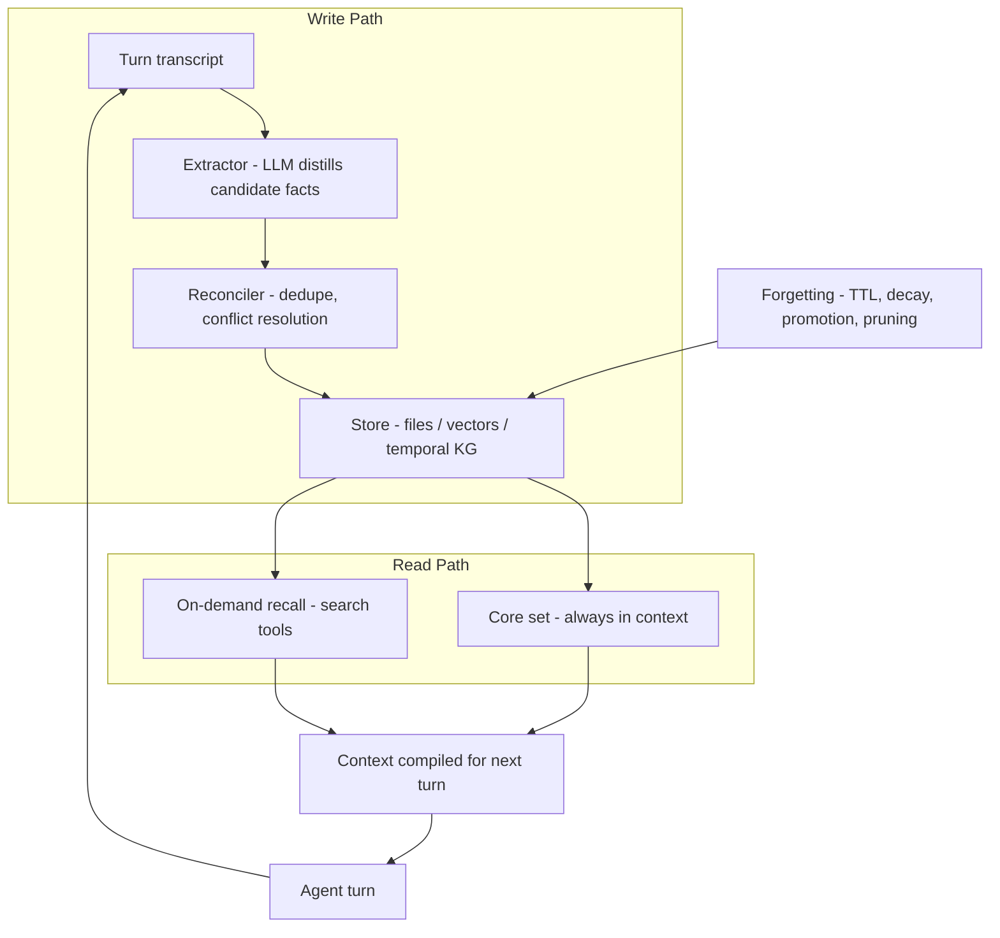

> [!info] Context
> Part of [[Harness-Internals-Overview|Harness Engineering Internals]]. Chapter: Memory Systems — Episodic, Semantic, Procedural, and the Engineering of Forgetting. Depth level 1.

# Memory Systems: Episodic, Semantic, Procedural — and the Engineering of Forgetting

## 1. Executive Overview

An LLM is a pure function. Same weights, same context in, same distribution out. Everything an agent "knows" about you, your project, and its own past work exists in exactly one place at inference time: the token sequence in the context window. Memory, for an agent, is therefore not a component you bolt on — it is the entire discipline of deciding which tokens from an unbounded past earn a place in a bounded present.

That framing immediately splits the problem in two, and most practitioner writing conflates the halves. The first half is a **content taxonomy**: working memory (what I'm doing right now), episodic memory (what happened), semantic memory (what is true), procedural memory (how I should behave). This taxonomy is borrowed from cognitive science and describes *kinds of information*. The second half is **memory architecture**: a storage substrate (context window, files, vector store, knowledge graph), a write path (what gets remembered, extracted by whom, deduplicated how), a read path (what gets recalled, when, at what precision), and control logic (does the agent edit its own memory, or does a background pipeline do it?). The taxonomy tells you *what* you're storing. The architecture tells you *where, how, and who decides*. Any of the four content types can live on any of the substrates — semantic facts can sit in a vector DB (Mem0), a temporal knowledge graph (Zep), a Markdown file (Claude Code), or a pinned context block (Letta). Choosing "episodic memory" is not an architectural decision, and vendors who market a substrate as if it were a memory type are selling you a category error.

This chapter builds both halves from first principles, walks four production architectures in depth (context-as-memory, MemGPT/Letta's OS model, retrieval-backed stores, file-based memory), engineers the write and read paths, treats forgetting as a first-class requirement rather than a failure, and closes with the security and evaluation problems — including the Mem0-versus-Zep benchmark dispute, which is the clearest case study we have of how immature memory evaluation still is.

## 2. Historical Evolution

**Phase 0 — stateless chat (2020–2022).** Early GPT-3 applications had no memory beyond the prompt. Every "conversation" was the developer re-sending accumulated messages. When the transcript exceeded the window (2k, then 4k tokens), you truncated from the front and the model forgot the user's name mid-conversation. The workaround era: rolling summaries stitched into the system prompt, hand-rolled and lossy.

**Phase 1 — RAG as accidental memory (2022–2023).** Vector databases built for document retrieval got repurposed: embed every past message, retrieve top-k on each turn. This worked badly for a reason worth internalizing: conversation is not a document corpus. Retrieval over raw utterances returns "I'm thinking about maybe moving to Pune" and "actually we decided against Pune" as two independent, equally-ranked chunks. Similarity search has no notion of *state* — it cannot know that one fact supersedes another.

**Phase 2 — the OS turn (October 2023).** MemGPT ([arXiv 2310.08560](https://arxiv.org/abs/2310.08560)) reframed the problem: treat the context window as RAM, external storage as disk, and let the LLM itself page data between them via function calls, prompted by "memory pressure" warnings from the harness. This was the first architecture where the *agent* was the memory manager rather than the victim of one. MemGPT became Letta, the company, and its memory-block model.

**Phase 3 — the dedicated memory layer (2024–2025).** Mem0 ([arXiv 2504.19413](https://arxiv.org/abs/2504.19413)) and Zep ([arXiv 2501.13956](https://arxiv.org/abs/2501.13956)) productized the write path: LLM-driven extraction of salient facts, deduplication, and conflict resolution against an external store — vector-first for Mem0, temporal-knowledge-graph-first for Zep. LangChain shipped LangMem with the same shape. The pitch: memory as a service, one API call on write and one on read.

**Phase 4 — the file-based counter-revolution (2025–2026).** Anthropic shipped a memory tool for the Claude API (client-side file operations under a `/memories` directory) and Claude Code's auto-memory (a `MEMORY.md` index plus per-topic Markdown files). Manus and other harness builders converged on "just use the filesystem." The bet: agents that are already good at reading and writing files don't need a bespoke substrate, and plain text you can `grep`, diff, and delete beats an opaque embedding store for auditability. Phase 4 didn't kill Phase 3 — multi-tenant SaaS at millions of users still wants indexed stores — but it broke the assumption that memory requires a database.

The through-line: each phase moved the *decision-making* about memory. Phase 0/1 put it in developer heuristics, Phase 2 put it in the agent, Phase 3 put it in an LLM pipeline outside the agent, Phase 4 split it — agent decides, filesystem stores, human audits.

## 3. First-Principles Explanation

Start from the constraint. A context window is finite (say 200k tokens), attention quality degrades over long contexts well before the hard limit, and every resident token costs money and latency on every turn. An agent that runs for months accumulates gigabytes of interaction history. Memory is therefore forced to be **lossy compression plus indexed retrieval**: you cannot keep everything in context, so you must (a) decide what to persist, (b) store it somewhere cheaper than the context window, and (c) decide what to bring back, when.

Now the taxonomy, properly grounded. These are answers to "what kind of information is this?", each with different lifecycle and consistency requirements:

- **Working memory** is the current context window itself: the task, recent messages, tool results. It's free (already there), perfectly fresh, and evaporates at session end. Every other memory type exists to survive that evaporation.
- **Episodic memory** is records of events: "on June 14 the user asked for a scraping deep dive and rejected paid APIs." Episodes are append-only and time-stamped by nature — they never become false, only old. Their failure mode is volume.
- **Semantic memory** is distilled facts: "the user prefers Python," "the staging DB is Postgres 16." Facts are *mutable* — the user switches editors, the DB gets upgraded. Semantic memory is the only type with an update problem, which is why most of the hard engineering in this chapter concentrates there.
- **Procedural memory** is behavioral rules: "always run tests before claiming completion," "never use em-dashes in this user's drafts." It differs from semantic memory in consequence, not storage: a wrong fact corrupts one answer; a wrong rule corrupts *every* answer. Procedural memory therefore demands the strictest write controls.

The reason practitioners must keep taxonomy and architecture separate: the taxonomy dictates *requirements* (mutability, freshness, blast radius), and the architecture is what you *choose* to satisfy them. "We use episodic memory" is a requirements statement wearing an architecture costume. The real architectural questions are: What is the substrate? Who writes (agent via tools, or background pipeline)? What is the retrieval schedule (always in context, or on demand)? What is the consistency model (last-write-wins, LLM-adjudicated, temporal versioning)? Two systems can both claim "semantic memory" and share zero design decisions.

One more foundational distinction: the **write path** and **read path** are asymmetric and should be designed separately. Writes are rare, tolerate latency (they can run asynchronously after the turn), and demand high precision — a bad write persists forever. Reads happen every turn, must be fast, and demand high *recall precision* in a specific sense: every irrelevant memory injected into context is not merely wasted tokens but active interference, because models attend to what's in front of them. Retrieving the wrong memory is worse than retrieving nothing.

## 4. Mental Models

**The OS model (MemGPT's gift).** Context window = RAM, external store = disk, retrieval = page fault, compaction = swap-out. This model earns its keep because it imports forty years of intuition: you immediately ask about page replacement policy (what gets evicted?), thrashing (agent spends all its turns paging memory instead of working), and locality (recently touched facts are likely needed again). Its limit: OS paging is lossless; agent memory paging is lossy — what you "swap out" is a summary, not the bytes.

**The database model.** Memory is a database with an LLM on both ends: an LLM ETL pipeline on the write path (extract → transform → upsert) and an LLM query planner on the read path. This model surfaces the questions vector-search thinking hides: what's your schema (free text? triples? typed entities?), what's your consistency model when two facts conflict, and what's your migration story when the extraction prompt changes and old memories were written by a different "version" of the extractor?

**Memory as a bet, not a backup.** Every write is a wager that a fact's future retrieval value exceeds its future interference cost. Every read is a wager that relevance outweighs pollution. This is the model that makes *forgetting* obviously necessary rather than regrettable: a memory store that only accumulates is a portfolio that only buys.

**The employee notebook.** A new hire scribbles everything (episodic), gradually distills "how things work here" pages (semantic), and eventually internalizes habits (procedural). Consolidation — episodic evidence promoted into semantic belief — is the notebook's re-write. This is the one cognitive-science analogy that pays rent, because it predicts a real engineering pattern: don't promote a single observation to a durable fact; promote patterns confirmed across episodes.

## 5. Internal Architecture

Every production memory system, whatever its marketing, decomposes into the same five components:



Notice the loop: the agent's own turns are the raw input to the extractor, and the store feeds the next turn's context. Memory systems are feedback loops, which is why their failures compound (Section 9). Now the four substrate architectures in depth.

### 5.1 Context-window-as-memory

The null architecture: keep the whole transcript in context; "memory" is scrollback. Correct choice for short-lived agents — and genuinely underrated, since a fact in context is perfectly fresh, perfectly attributed, and costs zero retrieval machinery. It fails on four axes. Cost: resident tokens are re-billed every turn (prompt caching softens but doesn't eliminate this). Quality: long-context attention degrades — models demonstrably miss facts buried mid-context even within advertised limits. Hard limit: sessions end; the window doesn't survive the process. And cross-session: there is no window to share between yesterday and today. Everything else in this chapter exists because of these four failures. In-conversation compaction — summarizing the transcript in place to keep a session alive — is the adjacent mechanism, owned by [[Harness-Internals-Context-Compilation]]; here we care only about its *output* becoming durable memory (Section 5.5).

### 5.2 MemGPT / Letta: the self-editing OS model

MemGPT's architecture ([arXiv 2310.08560](https://arxiv.org/abs/2310.08560)) splits memory into **main context** (in-window: read-only system instructions, a FIFO message queue, and a *writable* region) and **external context** (out-of-window storage reachable only by function call). The load-bearing innovation is that the LLM manages this hierarchy *itself*, through tools, driven by interrupts: when the harness detects the window filling, it injects a memory-pressure warning ("system alert: limited context space remaining"), and the model responds by summarizing and writing to external storage — exactly an OS raising a page-fault-like signal, except the "OS" delegates the paging policy to the process.

Letta, the productized descendant, refines this into **memory blocks**: labeled, size-capped, persistent strings pinned into the context window — conventionally a `human` block (what the agent knows about the user) and a `persona` block (who the agent is) — which the agent edits via `core_memory_append` and `core_memory_replace`. Below the blocks sit **recall memory** (full message history, searchable on demand) and **archival memory** (a semantically searchable store for arbitrary knowledge, never pinned, only queried). Letta's later addition, **sleep-time compute**, moves memory refinement off the hot path: a background agent reorganizes and rewrites memory blocks while the main agent is idle — the system defragments overnight.

The deep design commitment here: memory management consumes *agent intelligence*. Every `core_memory_replace` is a reasoning step the model could have spent on the task. You're buying adaptivity (the agent decides what matters, in situ, with full task context) and paying in tokens, latency, and a new failure class — the agent that writes garbage into its own instructions (Section 9).

### 5.3 Retrieval-backed stores: Mem0 and Zep/Graphiti

These systems make the opposite commitment: memory management belongs in a *pipeline*, not the agent. The agent (or the application) calls `add(messages)` after a turn and `search(query)` before one; everything else is the vendor's problem.

**Mem0** ([arXiv 2504.19413](https://arxiv.org/abs/2504.19413)) runs a two-phase write. The **extraction phase** feeds the recent exchange plus a rolling conversation summary to an LLM that emits candidate facts. The **update phase** is where the real work happens: for each candidate, retrieve semantically similar existing memories, then have an LLM choose one of four operations — **ADD** (genuinely new), **UPDATE** (augments an existing memory), **DELETE** (contradicts one), or **NOOP** (redundant). This tool-call-mediated reconciliation is the industry's canonical answer to the update problem: don't insert blindly, *adjudicate*. Storage is vector-first, with a graph variant that additionally extracts entity-relationship structure.

**Zep/Graphiti** ([arXiv 2501.13956](https://arxiv.org/abs/2501.13956), [github.com/getzep/graphiti](https://github.com/getzep/graphiti)) argues that facts-as-vectors throws away the two things conversations are actually made of: entities and time. Graphiti builds a temporal knowledge graph — nodes are entities, edges are facts ("Krrish — works_at → FreeCAD project") — and stamps every edge with four timestamps: `t_created` / `t_expired` (when the *system* learned and retired the fact) and `t_valid` / `t_invalid` (when the fact was *true in the world*). When new information contradicts an edge, Graphiti doesn't delete it; it **invalidates** it — closes its validity interval and adds the successor edge. This bitemporal design is the crucial move: "the user lived in Bangalore" isn't false, it's *bounded*, and an agent asked "where did I live before Pune?" needs the invalidated edge. Vector stores that DELETE on contradiction cannot answer that question; that's the concrete cost of Mem0's DELETE operation versus Zep's invalidation, and the honest counter-cost is that graphs are more expensive to build (entity resolution on every write) and to query (graph traversal plus hybrid search versus one ANN lookup).

Retrieval in both is hybrid — semantic similarity plus BM25 keyword matching, plus graph traversal in Zep's case. Mem0's own 2026 state-of-memory report identifies multi-signal retrieval and built-in entity linking as the year's convergent trends — which is worth pausing on: the vector-first vendor is adopting the graph vendor's core arguments. When competitors converge like this, it's because pure embedding similarity demonstrably can't distinguish "current fact" from "superseded fact," and everyone's production traces say so.

### 5.4 File-based memory: Anthropic's bet on plain text

**Anthropic's memory tool** (Claude API, tool type `memory_20250818`, [platform.claude.com docs](https://platform.claude.com/docs/en/agents-and-tools/tool-use/memory-tool)) is almost aggressively simple: Claude issues file commands (view, create, str_replace, insert, delete, rename) against a `/memories` directory, and *your application* executes them client-side. Anthropic stores nothing. The model is trained to check its memory directory before starting tasks and to write learnings as it works. Two consequences follow from the client-side design: you own the substrate (put it on disk, S3, a database — the tool contract is just paths and strings), and you own the vulnerability — the docs are explicit that your handler must reject path traversal (`../../etc/passwd` arriving in a memory path is your problem, not Claude's). See [[Harness-Internals-Guardrails-Sandboxing]] for the general pattern.

**Claude Code auto-memory** ([code.claude.com/docs/en/memory](https://code.claude.com/docs/en/memory)) is the same philosophy shipped as product. Each project gets `~/.claude/projects/<project>/memory/` containing a single `MEMORY.md` index plus per-topic Markdown files. The read-path scheduling is the interesting part: the first ~200 lines (or 25KB) of `MEMORY.md` load at the start of *every* session — that's the always-in-context core set — while topic files load only on demand via ordinary file reads. The write path is agent-driven: Claude writes entries as it works (typed as user / feedback / project / reference), updates them when corrected, deletes them when wrong. There's no embedding index at all; recall beyond the index is Grep.

The design thesis: **plain-text auditability is a feature, not a compromise.** A memory the user can open, read, edit, diff, and delete is a memory that can be *trusted* — and distrusted precisely. Compare debugging a wrong agent belief in a vector store (find the offending embedding among millions, hope deletion doesn't orphan related state) versus in a Markdown file (read it, fix the sentence, commit). The costs are equally plain: no semantic search means recall depends on the index being well-curated and on grep-able phrasing; a 200-line index is a hard budget that forces (healthy) editorial pressure; and nothing in the substrate prevents contradictions — the same agent that wrote the stale fact must notice and fix it. File-based memory works because coding agents are already elite file editors; it would work far less well for a voice assistant with ten million users, which is exactly the niche where Mem0/Zep-style multi-tenant indexed stores remain the right call.

### 5.5 Compaction-generated memory

When a session's transcript is compacted (mechanics in [[Harness-Internals-Context-Compilation]]), the summary is normally ephemeral — it replaces the transcript and dies with the session. The memory-relevant move is **promotion**: treating compaction summaries as candidate *episodic* records and durable-fact sources. Claude Code's auto-memory does a version of this — session learnings survive as memory entries; the operator-side discipline of maintaining PROGRESS.md files ([[Harness-Engineering-State-Persistence]]) is the manual form. The subtle trap: a compaction summary is optimized for *continuing this task*, not for being true in six months. Promoting it verbatim smuggles task-scoped assumptions ("the build is broken" — it was, that Tuesday) into permanent memory. Promotion needs its own extraction pass with a different question: not "what do I need to continue?" but "what will still be true and useful later?"

## 6. Step-by-Step Execution

Trace one fact through a Mem0-style pipeline, end to end. Session 47, the user says: *"Actually, I've moved off Postgres — we're on Neon now, and stop suggesting Docker Compose for local dev, I use Nix."*

**Write path (async, after the turn completes):**

1. The harness enqueues the last exchange plus the rolling summary to the extraction worker. Nothing blocks the user's conversation.
2. The extractor LLM emits candidates: `F1: "User's project database is Neon"`, `F2: "User uses Nix for local dev, not Docker Compose"`. Note what it *didn't* extract — the annoyance in "stop suggesting" could have become a procedural rule; whether it does depends entirely on the extraction prompt's salience instructions.
3. For F1, the reconciler embeds the fact and retrieves neighbors: `M_812: "User's project database is Postgres 16"` (similarity 0.87). Both are handed to the update LLM with the operation schema.
4. The update LLM rules **UPDATE** on M_812 → "User's project database is Neon (previously Postgres 16)". In a Zep-style system this step instead *invalidates* the Postgres edge (`t_invalid = now`) and creates a Neon edge — the history survives structurally rather than parenthetically.
5. F2 finds no strong neighbor → **ADD**. Both writes commit; the vector index updates.

**Read path (session 48, next week):** The user asks "set up local dev for the new service." The harness fires `search("local development environment setup")` before the model runs. Hybrid retrieval scores F2 high (keyword overlap on "local dev" plus semantic match), the updated M_812 moderately. Top-k results are compiled into the system prompt as a memory block — this compilation step belongs to [[Harness-Internals-Context-Compilation]] — and the agent's first token is generated already knowing Nix and Neon. Total marginal cost: one embedding call and one ANN query on read (~tens of milliseconds; Zep reports p95 search latency of 0.632s for its heavier graph search), two LLM calls on write that the user never waited for.

The step where systems diverge is step 4. Last-write-wins is trivially wrong (extraction noise overwrites good facts). LLM adjudication (Mem0) is expensive and occasionally hallucinates a merge. Temporal invalidation (Zep) preserves everything at the cost of graph complexity. File-based systems punt: the agent itself does step 4 whenever it happens to re-read the file, which is either elegantly lazy or nondeterministically never, depending on your read-path discipline.

## 7. Implementation

If you build this yourself — and for a single-user or single-team harness you probably should before buying — four interfaces cover it:

```python
class MemoryStore(Protocol):
    def upsert(self, mem: Memory) -> MemoryId: ...
    def invalidate(self, id: MemoryId, at: datetime) -> None:  # never hard-delete
    def search(self, query: str, k: int, filters: Filters) -> list[ScoredMemory]: ...
    def core_set(self, budget_tokens: int) -> list[Memory]: ...  # always-in-context

class Extractor(Protocol):
    def extract(self, transcript: Turn, summary: str) -> list[CandidateFact]: ...

class Reconciler(Protocol):
    def reconcile(self, fact: CandidateFact,
                  neighbors: list[Memory]) -> Op  # ADD|UPDATE|INVALIDATE|NOOP

class MemoryPolicy(Protocol):
    def decay(self) -> None          # periodic: TTL sweep, score dampening
    def promote(self) -> None        # episodic clusters -> semantic facts
    def compact_index(self) -> None  # keep core_set under budget
```

Design decisions that matter in the build:

**Schema.** Store more than text. A workable record: `{id, text, type: user|project|feedback|reference, provenance: {session_id, turn_id}, t_created, t_valid, t_invalid, access_count, last_accessed}`. Provenance is non-negotiable — when a memory turns out wrong, you need to know which conversation produced it to find its siblings. The bitemporal fields cost nothing now and are unretrofittable later.

**Concurrency.** Run extraction/reconciliation as an async worker consuming a turn queue. The hazard is read-your-writes: the user corrects a fact and immediately asks a question; the read path races the pending write and serves the stale fact. Fixes, in ascending effort: keep the current session's transcript authoritative over memory (the correction is still in working memory — cheap and usually sufficient); session-scoped write-through cache; or synchronous writes for explicit user corrections only ("remember that…" deserves durability before the next turn).

**Core-set compilation.** Reserve a fixed token budget (500–2,000 tokens is typical) for always-in-context memory. Fill it by score: `score = w1·recency + w2·access_frequency + w3·type_priority` with procedural > user-stated > extracted. Everything else is on-demand via a search tool. This two-tier read schedule is the single highest-leverage design choice in the whole system — it bounds context pollution structurally rather than hoping retrieval stays precise.

**Storage.** SQLite with an FTS5 index plus a small embedding table handles a single user for years. You do not need a vector database until you have many users or millions of memories; you need *tenancy* (a `user_id` column enforced in every query, not by prompt) from day one if you'll ever have two users.

**Procedural memory gets a different write path.** Self-edited instructions should be append-only with rollback: store each instruction revision as a new version, log which session and which trigger produced it, and expose `revert`. LangMem's procedural pattern — the agent updating its own system prompt from accumulated feedback — is powerful and exactly as dangerous as giving a process write access to its own executable, which is why the rollback log is not optional (Section 9).

## 8. Design Decisions

**Agent-managed vs pipeline-managed writes.** Letta puts the agent in charge; Mem0/Zep put a pipeline in charge. The agent has task context the pipeline lacks — it knows *why* a fact matters right now — but spends intelligence and tokens on bookkeeping and can corrupt itself. The pipeline is consistent, testable in isolation, and cheap per-turn, but extracts with a fixed prompt that can't know what the current task makes salient. Production systems increasingly split the difference exactly as LangMem's two modes do: hot-path tools for explicit, high-stakes writes ("remember this"), background extraction for ambient learning.

**Files vs vectors vs graphs.** The decision variables are scale, mutability rate, and audit requirements. Files win when a human (or the agent itself, cheaply) should read the whole store — up to a few hundred facts, single-tenant, high-trust-requirement settings. Vectors win at scale with mostly-append workloads. Temporal graphs win when facts churn and *history matters* — customer support, CRM-adjacent agents, anything where "what did we believe last quarter" is a real query. The commonly missed cost of vectors: they make forgetting hard, because deletion by semantic neighborhood is imprecise and the store is illegible to audit.

**Always-in-context vs retrieve-on-demand.** Pinning memory (Letta blocks, MEMORY.md's first 200 lines) buys zero-latency, guaranteed availability — the model *cannot* miss a pinned fact the way it can fail to issue a search call — and pays rent in tokens every single turn. On-demand recall scales unboundedly but silently fails when the model doesn't know it should look. The design answer is a budgeted hierarchy, and the empirically hard part is the *demotion* policy: what leaves the pinned set, and does the model reliably search for what got demoted?

**Extraction granularity.** One fact per record (Mem0, Claude Code's one-fact-per-file topic notes) maximizes reconciliation precision — you can UPDATE one fact without touching neighbors — but fragments context: "uses Nix" and "hates Docker Compose" are one preference, and retrieval may return only half. Coarse records (paragraph summaries) keep coherence and rot faster, because updating one clause means rewriting the blob. Fine granularity with explicit links (the graph answer) is the principled fix and the most expensive.

**Forgetting policy — the decision most systems refuse to make.** Unbounded accumulation degrades retrieval precision (more near-duplicates per query), inflates cost, and preserves stale facts that actively mislead. The toolkit: **TTL by type** (a user's name: infinite; "user is debugging the auth flow": days), **access-based decay** as a *ranking* signal rather than deletion — recently-used memories boosted, untouched ones dampened toward invisibility while still stored, which is reversible forgetting — **promotion** (compress clusters of episodic records into one semantic fact, then age out the episodes), and **pruning** with tombstones for provenance. Prefer invalidate-and-dampen over hard delete everywhere except legal erasure (GDPR right-to-be-forgotten), where hard delete across *all* substrates — including facts *derived from* the erased data — is the requirement, and where vector stores again prove awkward.

## 9. Failure Modes

**Stale facts — the update problem.** The canonical memory bug: extraction wrote "user lives in Bangalore" in March; the June move to Pune either wasn't mentioned explicitly, wasn't extracted, or was ADDed as a *new* fact instead of UPDATEing the old one because embedding similarity fell below the neighbor threshold. Now retrieval returns both, and the agent's answer depends on retrieval order. Debug by provenance: every surfaced memory should carry its source turn, so you can trace which conversation planted it. Structural fix: bitemporal invalidation (Zep's four timestamps) plus reconciliation prompts explicitly instructed to hunt for supersession, not just similarity.

**Contradiction accumulation and merge hallucination.** LLM reconcilers occasionally "merge" two facts into a third that neither conversation stated ("user lives in Pune and works at Neon" — no). Because writes feed future reads, one hallucinated merge propagates: it gets retrieved, the agent asserts it, the user's confused reply gets extracted… Mitigation: reconciler outputs constrained to operations over *existing* text (no free rewriting), plus periodic consistency sweeps offline.

**Context pollution — the read path's silent killer.** Retrieval that injects ten marginally-relevant memories per turn measurably degrades answers even when each memory is individually true, because irrelevant-but-plausible context steers generation. Symptoms: the agent keeps bringing up your old project in unrelated conversations. Fixes: relevance thresholds (return *nothing* below a floor — k should be a maximum, not a quota), per-turn memory token budgets, and scoping filters (project-scoped memories never retrieved cross-project).

**Memory poisoning — injection that persists.** Standard prompt injection dies with the session; an injection that gets *written to memory* executes in every future session. The attack chain: attacker-controlled content (a webpage the agent browses, an email it reads, a document it summarizes) contains instructions crafted to be extracted as a "fact" or "preference"; the write path, which typically applies no trust distinction between user statements and tool-returned text, persists it; the read path later injects it into a fresh, fully-trusted context. Research attacks like MINJA achieved poisoning through *ordinary user-role queries alone*, and the class is now formalized as memory/context poisoning in OWASP's agentic-AI Top 10 (ASI06); Unit 42 demonstrated the persistent variant against production-style assistants. Defenses, layered: never extract memories from tool/web content with the same pipeline that handles user statements (provenance-gated writes); require user confirmation for procedural writes; treat recalled memory as *untrusted input* at read time (delimit it, instruct against executing instructions found in it — imperfect but material); and keep memory legible enough to audit, which is a genuine security argument for the file-based architectures. Cross-link: [[Harness-Internals-Guardrails-Sandboxing]].

**Tenancy leakage.** Multi-user stores where isolation is enforced by retrieval filters (a `WHERE user_id =` clause) fail catastrophically on one missed filter — user A's medical facts surface in user B's session. Isolation belongs at the storage layer (per-tenant namespaces/collections), not the query layer.

**Procedural self-corruption.** An agent with write access to its own instructions and no rollback log is one bad reflection away from permanently degraded behavior — it internalizes a misread correction ("never use type hints") and there is no diff to find, no version to revert. If you remember one rule from this chapter: *procedural writes get versioning, provenance, and a human-visible changelog, or they don't ship.*

**Read-your-writes races** (Section 7) and **thrashing** — a MemGPT-style agent near context limits that spends most of its turns paging memory instead of progressing, the direct analog of OS thrashing; the fix is the same as in operating systems: increase effective working-set headroom (aggressive summarization thresholds) or reduce the working set (narrower task scope, see [[Harness-Internals-Agent-Loop-Architecture]]).

## 10. Production Engineering

**Anthropic** (verified from docs and product): three distinct shipping memory systems, all file-shaped. The API memory tool (`memory_20250818`) — client-side file ops, harness-owned storage. Claude Code auto-memory — `MEMORY.md` index (first ~200 lines/25KB always loaded) plus on-demand topic files, plain Markdown, user-editable, entries typed user/feedback/project/reference. Claude.ai's consumer memory similarly uses model-visible, user-inspectable memory the model edits. The consistent bet across all three: the model manages memory through tools it already has (file editing), and auditability is the product feature. See [[Harness-Internals-Claude-Code-Architecture]] for how this slots into the broader harness.

**OpenAI / ChatGPT** (partially documented; internals inferred from official descriptions plus community reverse-engineering): two mechanisms — "saved memories" (discrete extracted facts, user-viewable and deletable, written when the model judges something durable or the user says "remember…") and "reference chat history" (retrieval over past conversations without discrete fact extraction — inference: an embedding/summary index over transcripts, since OpenAI hasn't published the mechanism). The notable divergence from Anthropic: chat-history reference is memory *without* a legible fact store — higher coverage, lower auditability.

**Letta** (verified from docs/blog): memory blocks with labels, descriptions, and character limits, pinned in-context; `core_memory_append/replace` tools; recall + archival tiers; sleep-time compute doing asynchronous memory refinement. The purest production expression of agent-as-memory-manager.

**Mem0 / Zep** (verified from papers and repos): the two-phase extract/adjudicate pipeline and the bitemporal graph respectively, as detailed in 5.3. Both sell multi-tenant memory-as-a-service; both converged on hybrid retrieval.

**LangMem** (verified from LangChain docs/blog): the taxonomy-explicit framework — semantic/episodic/procedural as first-class types, hot-path tools plus background managers, procedural memory as agent-rewritten system prompts, storage-agnostic via LangGraph's store interface.

**Manus and CLI-agent builders** (stated in engineering posts): converged on filesystem-as-memory for working state — write plans and findings to files, re-read to restore state — which is context engineering shading into memory, and the same pattern the operator-side notes formalize as PROGRESS.md discipline ([[Harness-Engineering-Hub]], [[Harness-Engineering-State-Persistence]]).

The convergence worth naming: *every* vendor ended up with a two-tier read schedule (small always-loaded core + large on-demand store) and *every* vendor ended up doing LLM-mediated write-time reconciliation or agent-mediated file edits — nobody ships raw append-only embedding of transcripts anymore. When five competitors independently abandon the same design, the design was wrong: raw similarity search over unreconciled history cannot handle fact mutation, full stop.

## 11. Performance

**Token economics dominate.** Memory's recurring cost is resident context: a 1,500-token pinned memory block on a 50-turn session is 75k prompt tokens before anyone retrieves anything. Mem0's core pitch is exactly this arithmetic — their 2026 report cites ~6,900 tokens per query against full-context baselines of 26k+ (vendor-reported numbers; treat accordingly). Prompt caching changes the calculus for *stable* memory blocks: a pinned block that never changes is nearly free under caching, which quietly strengthens the always-in-context design — but every edit invalidates the cache suffix, so *volatile* memory belongs at the end of the prompt or on-demand. This interaction between memory placement and cache economics is a [[Harness-Internals-Context-Compilation]] concern that memory design cannot ignore.

**Write amplification.** Pipeline architectures spend 2+ LLM calls per turn on extraction/reconciliation — often more compute than the turn itself for chat workloads. Standard mitigations: batch extraction every N turns or at session end (cost: wider read-your-writes window), use a small model for extraction and a strong one only for conflict adjudication, and skip extraction on low-information turns via a cheap classifier.

**Read latency.** Vector ANN search is single-digit-to-tens of milliseconds; hybrid graph search is heavier (Zep self-reports p95 0.632s). The dispute-relevant detail: Mem0's paper reported Zep latency measured with *sequential* sub-searches that Zep runs in parallel — a reminder that memory benchmarks are as misconfigurable as memory systems. Retrieval runs before first token, so it sits on the TTFT critical path; parallelize it with any other pre-turn work, and consider speculative retrieval on the user's partial input.

**Scale.** Single-user stores are trivially small (years of daily use ≈ thousands of facts — SQLite territory). Scale problems are multi-tenant: millions of users × thousands of facts wants per-tenant sharding, and the interesting benchmark frontier is long-horizon single-tenant accumulation — BEAM evaluates at 1M and 10M token histories, where Mem0 self-reports scores dropping from 64.1 to 48.6, i.e., *everyone's* architecture degrades badly at 10M tokens. Nobody has solved long-horizon memory; the honest reading of 2026 benchmarks is that the field is optimizing the easy regime.

## 12. Best Practices

Budget memory like you budget latency: a fixed token allowance for pinned core, a fixed per-turn allowance for retrieved memories, enforced by the compiler, not by hoping retrieval stays sparse. Design the write path for precision and the read path for restraint — a memory system that remembers less but is never wrong beats one that remembers everything and is occasionally wrong, because trust in surfaced memories is binary for users. Record provenance on every fact; you will need it the first time a user asks "why does it think that?" Give explicit user statements ("remember that I…") a synchronous, confirmed write path distinct from ambient extraction. Never extract durable memories from tool output or fetched web content with the same trust as user statements. Version procedural memory with rollback. Prefer invalidation over deletion everywhere except legal erasure. Test the read path adversarially: seed contradicting facts and verify the newest wins; seed near-duplicates and verify retrieval doesn't return five copies; seed a poisoned "preference" and verify it can't steer the agent. And re-derive, don't hoard: anything cheaply reconstructible from source (the codebase, the docs) doesn't belong in memory — memory is for what *only the interaction history* knows.

Anti-patterns, seen repeatedly: embedding raw transcripts and calling it memory (no reconciliation → guaranteed staleness); retrieval quotas ("always inject top 5") instead of thresholds; memory as a dumping ground for what should be [[Harness-Internals-Context-Compilation]] (session continuity) or RAG (document knowledge); one global memory namespace across projects; and shipping "the agent can update its own instructions!" as a feature before shipping the revert button.

## 13. Common Misconceptions

**"Agent memory is just RAG."** Tempting because both end in similarity search. Wrong because RAG retrieves from a *static, externally-authored* corpus; memory retrieves from a store *the system itself writes*, which introduces everything RAG doesn't have: an extraction policy, an update problem, consistency requirements, poisoning risk, and forgetting. RAG is a library; memory is a diary the librarian also writes. The failure mode of the conflation is concrete: teams ship "memory" that can never revise a fact.

**"The taxonomy is the architecture."** Saying "we have episodic and semantic memory" describes payload types, not a system. The correct replacement: taxonomy ⇒ requirements (mutability, blast radius, freshness), architecture ⇒ substrate + write path + read path + control logic, chosen per requirement.

**"More memory is better."** Accumulation degrades retrieval precision, pollutes context, and preserves stale facts. Memory quality is measured at the *read* path — did the right fact surface, and nothing else? — and unbounded stores actively fight that metric. Forgetting is a feature you must build, not entropy you tolerate.

**"Bigger context windows will make memory obsolete."** Long contexts fix session continuity, not cross-session persistence, not multi-tenancy, not cost (resident tokens re-bill every turn), and not attention degradation — models miss mid-context facts long before hard limits. Windows growing 10× changes *where* the compaction threshold sits; it doesn't remove the write/read path problem.

**"The benchmark settles which memory system is best."** Section 14's dispute question exists because two credible vendors each "won" LoCoMo by double digits. Memory benchmarks are configuration-sensitive (you benchmark your competitor's *misconfiguration*), dataset-fragile, and often solvable by no-memory full-context baselines — which means they weren't measuring memory at all.

## 14. Interview-Level Discussion

**Q1: Your agent keeps asserting a fact the user corrected two weeks ago. Walk me through the diagnosis.**
Work the pipeline backwards. Read path first: is the stale fact being retrieved (store problem) or is the model ignoring a retrieved correction (context problem)? Log the compiled memory block for a failing turn. If the stale fact is surfaced: check whether the correction was ever *written* — pull write-path logs for the correction session; ambient extraction commonly misses corrections phrased as "no, that's wrong" without restating the fact. If it was written: check reconciliation — did it ADD a new fact instead of UPDATE/invalidating the old one (embedding distance between "lives in Bangalore" and "moved to Pune" can miss the neighbor threshold)? Both facts now coexist and retrieval order decides. Fixes by layer: supersession-aware reconciliation prompts, bitemporal invalidation so retrieval can filter to currently-valid facts, and recency-weighted ranking as a backstop. The principal-level point: this bug is *structural* in any append-heavy store; you design it out at write time, you don't patch it at read time.

**Q2: When do files beat a vector database for agent memory?**
When the store is small enough to be legible (hundreds of facts), the tenant count is one, the agent is already competent at file operations, and auditability or trust is a requirement — i.e., exactly the Claude Code profile. Files give you diffing, versioning (git), human repair, zero infra, and a natural two-tier read schedule (index loaded, topics on demand). Vectors earn their complexity at multi-tenant scale, high fact counts, and fuzzy recall needs. The sophisticated answer notes the hybrid: files as substrate *plus* a derived search index, which is where several 2026 systems landed.

**Q3: Design the write path so a poisoned webpage can't permanently compromise the agent.**
Provenance-gate the extractor: facts derived from tool/web content are either never auto-persisted or persisted into a quarantined, low-trust namespace that read-path compilation labels as unverified. User-stated facts get normal persistence; procedural rules require explicit confirmation. At read time, recalled memory is compiled inside delimiters with an instruction that it is data, not directives. Add an offline auditor that scans new writes for instruction-shaped content ("always…", "ignore…", URLs, tool names). Acknowledge honestly that read-time instructions are a mitigation, not a boundary — the only hard boundary is what the write path refuses to persist, which is why provenance gating is the load-bearing control (OWASP's agentic Top 10 classifies this as memory/context poisoning).

**Q4: Mem0 and Zep both claim to beat each other on LoCoMo. What actually happened, and what does it teach about evaluating memory?**
Sequence: Zep claimed 84%+ on LoCoMo; a correction (raised in getzep/zep-papers issue #5) showed the figure included the adversarial question category the benchmark excludes — corrected ≈58%. Mem0's paper then reported Mem0 Graph ≈68% versus Zep at 65.99%; Zep's rebuttal alleged three misconfigurations of *their* system in Mem0's harness — both speakers assigned the user role in a user/assistant graph model, timestamps appended to message text instead of the `created_at` field (breaking temporal reasoning), and sequential instead of parallel sub-searches (inflating reported latency, 0.778s vs their measured p95 0.632s) — yielding a corrected 75.14%. Meanwhile LoCoMo itself: conversations of 16k–26k tokens that fit in any modern window, a category with missing ground truth both vendors dropped, no knowledge-update questions, and a full-context baseline (~73%) that beat the memory systems. Lessons: benchmarking a competitor means benchmarking your configuration of them; a memory benchmark a no-memory baseline can win isn't measuring memory; and absence of update/supersession tests means the *hardest* part of the problem was unscored. Prefer LongMemEval (115k-token conversations, explicit knowledge-update questions) and scale-stressing suites like BEAM, and treat all vendor-reported scores as marketing until independently reproduced.

**Q5: Always-in-context core memory vs retrieve-on-demand — how do you split, and how does prompt caching change it?**
Split by expected access frequency × miss cost. Identity, active-project facts, and procedural rules are accessed near-every-turn and have high miss cost → pin them. Long-tail facts → on-demand, accepting that misses now depend on the model choosing to search. Budget the pinned set hard (hundreds of tokens, not thousands). Caching's twist: stable pinned blocks are almost free under prompt caching, but every edit invalidates the cached prefix from that point on — so order the prompt stable-first (system, tools, stable memory) and volatile-last (retrieved memories, recent messages), and batch memory-block edits rather than editing every turn.

**Q6: Your agent edits its own system instructions based on feedback. What guardrails ship with that feature?**
Versioned, append-only revision history with provenance (which session, which feedback triggered the edit); diff-sized changes only (no wholesale rewrites); a validation gate — regression evals rerun against the new instructions before they go live, which ties into [[Harness-Internals-Evaluation-Infrastructure]]; user-visible changelog and one-click revert; and a protected core the agent cannot edit (safety rules, tenancy rules). The framing that lands: procedural memory is self-modifying code; every discipline we apply to code changes — review, tests, rollback — applies, and "the model probably won't write a bad rule" is not a discipline.

## 15. Advanced Topics

**Sleep-time compute and reflective consolidation.** Letta's background memory-refinement agents point at a general pattern: memory quality work (dedup, promotion, contradiction sweeps, index re-curation) is deferrable and parallelizable, so spend idle compute on it. Open questions: what's the reflection prompt that reliably promotes episodic clusters into *correct* semantic facts, and how do you evaluate a consolidation pass that changes nothing observable until a future retrieval?

**Temporal abstraction at scale.** Mem0's own 2026 report names it an unsolved problem: reasoning over "the user's preferences drifted over six months" requires aggregating across many time-stamped facts, not retrieving one. Bitemporal graphs store the raw material; nobody has a convincing query layer for *trends* yet.

**Shared and organizational memory.** Multi-agent teams ([[Harness-Internals-Agent-Loop-Architecture]]) raise write-contention and trust questions single-agent memory dodges: whose extraction wins, how does agent B trust a fact agent A wrote, and does a team-level memory need its own reconciler agent? Letta's shared memory blocks are the earliest primitive here.

**Memory in weights.** Fine-tuning and continual-learning approaches move memory from context into parameters — cheap at read time, catastrophic to audit, and currently impossible to selectively forget (unlearning research notwithstanding). The pragmatic 2026 position: parameters for skills, context for facts; the boundary will move as unlearning matures.

**Learned memory policies.** Every policy in this chapter — salience, TTL weights, promotion thresholds — is hand-tuned prompt engineering today. The obvious next step is optimizing them against long-horizon task reward rather than retrieval benchmarks, which first requires the application-level evals that Section 14's dispute shows we don't have.

## 16. Glossary

- **Working memory**: The live context window's task-relevant contents; evaporates at session end.
- **Episodic memory**: Time-stamped records of events/interactions; append-only, never false, ages out.
- **Semantic memory**: Distilled facts and preferences; mutable, hence subject to the update problem.
- **Procedural memory**: Persisted behavioral rules/instructions; highest blast radius, needs versioning.
- **Memory architecture**: Substrate + write path + read path + control logic — the system, as opposed to the content taxonomy.
- **Write path**: Extraction → reconciliation → storage pipeline turning interactions into durable memory.
- **Read path**: Scheduling and retrieval of stored memory into context (pinned core + on-demand recall).
- **Reconciliation**: Adjudicating a candidate fact against existing memories (ADD/UPDATE/DELETE-or-invalidate/NOOP).
- **Bitemporal model**: Tracking both system time (created/expired) and world time (valid/invalid) per fact — Graphiti's four timestamps.
- **Edge invalidation**: Closing a fact's validity interval instead of deleting it when superseded.
- **Memory pressure**: Harness-raised signal that context is nearly full, prompting the agent to page memory out (MemGPT).
- **Memory blocks**: Letta's labeled, size-capped, agent-editable strings pinned in context.
- **Core set / pinned memory**: The always-in-context memory tier, loaded every turn under a token budget.
- **Consolidation / promotion**: Compressing episodic records into semantic facts; the engineered analog of "sleeping on it."
- **Decay**: Score dampening of unaccessed memories at retrieval time — reversible forgetting.
- **TTL**: Type-dependent expiry assigned at write time.
- **Memory poisoning**: Persisting attacker-controlled content so an injection survives across sessions (OWASP agentic Top 10).
- **Context pollution**: Degradation caused by injecting irrelevant-but-true memories into context.
- **Read-your-writes race**: Async write path losing to an immediate read, serving pre-correction state.
- **LoCoMo / LongMemEval / BEAM**: Conversational-memory benchmarks; short-, long-, and very-long-horizon respectively.

## 17. References

- **MemGPT: Towards LLMs as Operating Systems — [arxiv.org/abs/2310.08560](https://arxiv.org/abs/2310.08560)**. The founding paper of the OS mental model: main/external context, self-editing via tools, memory-pressure interrupts. Read first; every later system is a reply to it.
- **Zep: A Temporal Knowledge Graph Architecture for Agent Memory — [arxiv.org/abs/2501.13956](https://arxiv.org/abs/2501.13956)** and **Graphiti — [github.com/getzep/graphiti](https://github.com/getzep/graphiti)**. The bitemporal design: four timestamps, edge invalidation. Read for the strongest available argument that time is a first-class dimension of memory, and the repo for how entity resolution actually gets implemented.
- **Mem0: Building Production-Ready AI Agents with Scalable Long-Term Memory — [arxiv.org/abs/2504.19413](https://arxiv.org/abs/2504.19413)**. The canonical two-phase write path (extract, then ADD/UPDATE/DELETE/NOOP adjudication). Read for the pipeline architecture; read its benchmark section *alongside* the next reference.
- **Zep's rebuttal, "Is Mem0 Really SOTA in Agent Memory?" — [blog.getzep.com/lies-damn-lies-statistics-is-mem0-really-sota-in-agent-memory/](https://blog.getzep.com/lies-damn-lies-statistics-is-mem0-really-sota-in-agent-memory/)** plus the correction thread on Zep's own earlier claim — [github.com/getzep/zep-papers/issues/5](https://github.com/getzep/zep-papers/issues/5). Together, the definitive case study in memory-benchmark fragility. Read when you're tempted to trust any vendor's eval table.
- **Anthropic memory tool docs — [platform.claude.com/docs/en/agents-and-tools/tool-use/memory-tool](https://platform.claude.com/docs/en/agents-and-tools/tool-use/memory-tool)**. The client-side file-based contract, including the path-traversal warning. Read before implementing a handler.
- **Claude Code memory docs — [code.claude.com/docs/en/memory](https://code.claude.com/docs/en/memory)**. MEMORY.md index mechanics (200-line/25KB load rule), topic files, entry types. The production reference for file-based auto-memory.
- **Letta on agent memory — [letta.com/blog/agent-memory](https://www.letta.com/blog/agent-memory)** and **Letta memory-blocks docs — [docs.letta.com/guides/agents/memory-blocks/](https://docs.letta.com/guides/agents/memory-blocks/)**. Memory blocks, recall/archival tiers, sleep-time compute. Read for the agent-as-memory-manager design in its mature form.
- **LangMem SDK launch — [langchain.com/blog/langmem-sdk-launch](https://www.langchain.com/blog/langmem-sdk-launch)**. The clearest framework articulation of semantic/episodic/procedural as implementable types, plus the hot-path vs background split.
- **Mem0 State of AI Agent Memory 2026 — [mem0.ai/blog/state-of-ai-agent-memory-2026](https://mem0.ai/blog/state-of-ai-agent-memory-2026)**. Vendor-authored but useful for the benchmark landscape (LoCoMo/LongMemEval/BEAM), the multi-signal-retrieval trend, and honest open problems. Read with the usual vendor discount.
- **Unit 42, "When AI Remembers Too Much — Persistent Behaviors in Agents' Memory" — [unit42.paloaltonetworks.com/indirect-prompt-injection-poisons-ai-longterm-memory/](https://unit42.paloaltonetworks.com/indirect-prompt-injection-poisons-ai-longterm-memory/)** and **OWASP Agent Memory Guard — [owasp.org/www-project-agent-memory-guard/](https://owasp.org/www-project-agent-memory-guard/)**. The memory-poisoning threat model and the emerging defense checklist. Read before shipping any auto-write path.
- **Mem0 on memory eviction and forgetting — [mem0.ai/blog/memory-eviction-and-forgetting-in-ai-agents](https://mem0.ai/blog/memory-eviction-and-forgetting-in-ai-agents)**. Concrete TTL-by-type and decay-as-reranking patterns for Section 8's forgetting toolkit.

## 18. Subtopics for Further Deep Dive

### Temporal Knowledge Graph Construction for Agent Memory
- **Slug**: Memory-Temporal-Knowledge-Graphs
- **Why it deserves a deep dive**: Graphiti's entity resolution, edge invalidation, and hybrid graph retrieval each hide substantial algorithmic machinery this chapter could only sketch; it's also the most defensible technical moat in the memory-vendor space.
- **Has enough depth for a full chapter**: yes
- **Key questions to answer**: How does incremental entity resolution work without full-graph recomputation? How are the four timestamps populated when conversations reference time vaguely ("last spring")? What does the hybrid (semantic + BM25 + graph-traversal) query planner actually execute?

### Memory Poisoning and the Security of Write Paths
- **Slug**: Memory-Poisoning-Security
- **Why it deserves a deep dive**: OWASP now classifies it as a top agentic risk, published attacks (MINJA, self-reinforcing injections) achieve high success rates, and defenses are immature enough that a rigorous treatment has real practical value.
- **Has enough depth for a full chapter**: yes
- **Key questions to answer**: What does a provenance-gated write pipeline look like end to end? How do you audit an existing store for planted instructions? Can read-time quarantine ever be a hard boundary, or only a mitigation?

### Benchmarking Long-Horizon Memory
- **Slug**: Memory-Evaluation-Benchmarks
- **Why it deserves a deep dive**: The Mem0/Zep dispute shows current evals are configuration-fragile and often beaten by no-memory baselines; LongMemEval and BEAM deserve mechanism-level analysis, and application-level memory evaluation is an open design problem.
- **Has enough depth for a full chapter**: yes
- **Key questions to answer**: What properties must a benchmark have so a full-context baseline cannot win? How do you score update/supersession handling? How should third parties configure competitor systems fairly?

### Procedural Memory and Self-Modifying Agents
- **Slug**: Memory-Procedural-Self-Modification
- **Why it deserves a deep dive**: Agents rewriting their own instructions (LangMem's prompt optimization, skills-as-memory) is self-modifying code with none of software engineering's usual controls yet; the versioning/eval-gate/rollback design space is barely mapped.
- **Has enough depth for a full chapter**: yes
- **Key questions to answer**: How do you regression-test an instruction edit before it goes live? What's the right granularity for procedural facts (rules vs skills vs prompt patches)? When should learned procedures graduate into code?

### Consolidation and Sleep-Time Compute
- **Slug**: Memory-Consolidation-Sleep-Time
- **Why it deserves a deep dive**: Background memory refinement (Letta's sleep-time agents, episodic-to-semantic promotion) is the least-documented pipeline stage with the highest leverage on long-horizon quality, and its evaluation problem (invisible until future retrievals) is genuinely unsolved.
- **Has enough depth for a full chapter**: yes
- **Key questions to answer**: What triggers and prompts reliably promote episode clusters into correct facts? How do you measure a consolidation pass? How do consolidation and forgetting policies interact without oscillation?
