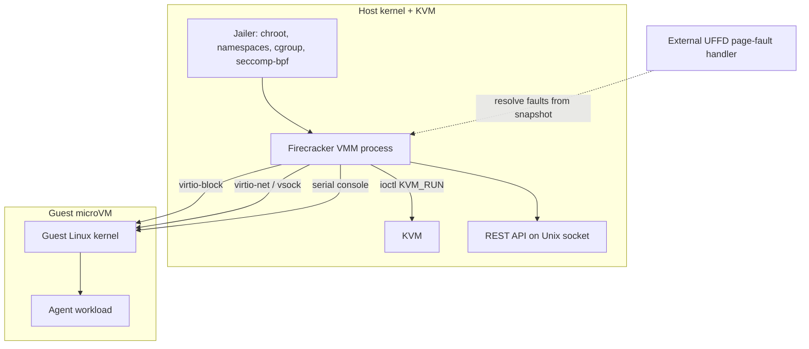
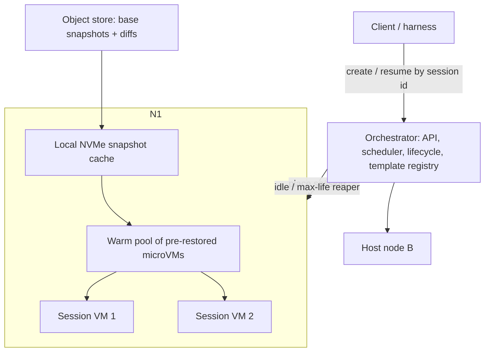

> [!info] Context
> Part of [[Harness-Internals-Overview|Harness Engineering Internals]], Level 2 wave. Parent chapter: [[Harness-Internals-Production-Patterns]], which argued the microVM-per-session decision at the trade-off level. This chapter descends to the implementation level: how Firecracker snapshots actually work, how warm pools and copy-on-write memory sharing make per-session VMs economically viable, the measured deltas between Firecracker/gVisor/Kata/containers, and how the platforms map and reclaim sessions. It owns the VM/fleet layer; its sibling [[Harness-Internals-Sandbox-Kernel-Enforcement]] owns the in-guest syscall layer (seccomp, Landlock, Seatbelt).

# MicroVM Sandbox Infrastructure

## 1. Executive Overview

[[Harness-Internals-Production-Patterns]] established the *why*: an agent runs code co-authored at runtime by a model and by whatever untrusted content the model read, so each session must be treated as potentially hostile to its host and its neighbors — the threat model of a public code-execution service, not of your own web app. That argument terminated in a verdict: put each session behind a hypervisor boundary, and Firecracker is the canonical implementation. This chapter is about everything that verdict left unspecified.

The reframing claim, the one thing to carry into every interview: **a microVM sandbox is not primarily a boot-time story, it is a snapshot-and-memory-sharing story.** The naive reading of "125 ms boot, under 5 MiB overhead" makes microVMs sound like fast containers. That reading misses the actual engineering. A fresh Firecracker boot is too slow and too memory-hungry to put one in front of every agent turn at fleet scale. What makes per-session microVMs economically real is that you *never cold-boot them in the hot path* — you boot one golden VM, snapshot it at the instant it is ready to serve, and then restore hundreds of clones from that snapshot in tens of milliseconds, sharing the snapshot's memory pages copy-on-write so a thousand sandboxes cost far less than a thousand times one sandbox. And the moment you do that, you inherit a whole new class of problem the boot-time story never had: every clone wakes up with an *identical* entropy pool, identical cryptographic state, identical TCP sequence counters — a security bug that has already broken TLS in production systems. The interesting content of microVM sandbox infrastructure lives entirely in that snapshot/restore/clone machinery and its consequences. That is what we build here, from the Firecracker device model up through fleet management and egress policy, comparing Firecracker against gVisor, Kata, hardened containers, and — as the deliberate contrast case — Cloudflare's V8 isolates, which reject the whole premise.

## 2. Historical Evolution

**2018 — Firecracker ships inside Lambda.** AWS built Firecracker because the choice on offer was unacceptable: full virtualization (QEMU) gave strong isolation at hundreds of milliseconds of boot and tens of megabytes of overhead per VM, while containers gave near-zero overhead at the price of a shared host kernel. Serverless economics — many customers' code on one host — demanded both strong isolation *and* minimal overhead. The Firecracker NSDI 2020 paper (Agache et al.) documents the resolution: a purpose-built VMM in ~50K lines of Rust (against QEMU's ~1.4 million lines of C) with a deliberately minimal device model — just virtio-net, virtio-block, a serial console, and a one-button keyboard controller — controlled over a RESTful API on a Unix socket, wrapped by a *jailer* that puts each VMM process in its own chroot, namespaces, cgroup, and a seccomp-bpf filter limiting the VMM itself to a tiny syscall set. Result: ~125 ms to boot, under 5 MiB memory overhead, running under Lambda and Fargate at trillions of requests per month.

**2020 — snapshotting lands.** The original Firecracker still cold-booted a guest kernel per invocation. Snapshot/restore (tracked in GitHub issue #1184, shipped through 2020) changed the economics: capture a running microVM's full state to a file, then restore by memory-mapping that file and resuming the vCPUs — no kernel boot at all. This is the pivot that makes the rest of the field possible.

**2021 — the uniqueness problem is named.** The same year, researchers (the "Restoring Uniqueness in MicroVM Snapshots" work, arXiv 2102.12892) demonstrated that cloning many VMs from one snapshot silently duplicates cryptographic state, reviving an attack class Ristenpart and Yilek had shown against reused VM snapshots and TLS 1.0. Firecracker's answer, VMGenID/SnapSafe support, arrived over subsequent releases. The security cost of the very trick that made snapshots useful became a first-class design concern.

**2022–2024 — gVisor and Kata mature as the alternatives.** Google's gVisor (a userspace guest kernel intercepting syscalls) moved from ptrace to the far faster *systrap* platform as its default in mid-2023, cutting the overhead that had made it a hard sell. Kata Containers matured the "OCI-compatible pod, but each pod is a real VM" model, pluggable over QEMU, Cloud Hypervisor, or Firecracker. The isolation-strength spectrum solidified: container < gVisor < microVM (Firecracker/Kata) < full VM.

**2024–2026 — the agent-sandbox category forms on top.** E2B, Modal, Fly.io Sprites, Vercel Sandbox, and Daytona commercialized "give the agent a computer" as a rentable primitive, and the cloud incumbents followed — AWS Bedrock AgentCore (GA October 2025) is Firecracker-per-session sold as a managed runtime. Simultaneously Cloudflare pushed the *opposite* thesis with Dynamic Workers: for short-lived AI-agent code, a V8 isolate — no VM at all — loads 100× faster on a tenth of the memory. The field now has a genuine, live disagreement about where the isolation boundary belongs, which is the most interesting thing about it.

## 3. First-Principles Explanation

Forget "VM" for a moment. Ask what a hypervisor actually *is*, because the whole security argument rests on it.

A normal Linux process is isolated from other processes by the kernel: separate address spaces, permission checks on every syscall. But every process shares *one* kernel, and that kernel exposes an enormous interface — the Linux kernel is roughly 40 million lines of C behind 450+ system calls. A container is just a process (plus namespaces and cgroups) sharing that same kernel. So a container escape only requires *one* exploitable bug anywhere in those 450+ syscalls or the millions of lines behind them. Container-escape CVEs are not exotic; 2024–2025 alone produced Leaky Vessels, NVIDIAScape, and runc path-race escapes. When the code inside the box is model-authored and attacker-influenceable, "one kernel bug from compromise" is not a boundary you can stand on.

A **virtual machine** changes the shape of the trust problem. Hardware virtualization (Intel VT-x / AMD-V, exposed through KVM) lets the CPU run guest code directly but trap privileged operations to a host-side monitor — the VMM. The guest gets its *own* kernel. Now a guest process that finds a guest-kernel bug has escaped only into its *own* guest kernel; to reach the host it must additionally defeat the VMM. And the VMM's attack surface is not 450 syscalls of Linux — it is the handful of virtual devices the VMM emulates. Firecracker's genius is making that surface as small as possible: ~50K lines of Rust (memory-safe, so whole bug classes vanish), four or five virtual devices, and the VMM process *itself* jailed under seccomp so that even a VMM compromise lands in a box. The going rate for a working hypervisor escape on the exploit market is $250K–$500K; container escapes are found for free every year. That price gap *is* the security delta, quantified.

Now the microVM insight. A traditional VM is heavy because it emulates a whole PC — BIOS, PCI bus, dozens of legacy devices, a full firmware boot. A **microVM** throws all of that away. There is no BIOS, no PCI enumeration, no option-ROM probing; the VMM loads a Linux kernel directly into guest memory and jumps to it. You keep the hardware isolation boundary (the expensive, valuable part) and delete the emulation bloat (the slow, useless part). That is the entire idea, and it is why a microVM boots in ~125 ms with <5 MiB overhead while giving you a private kernel.

The final first-principle, the one that dominates production: **booting is still too slow, so don't boot.** 125 ms per agent turn, multiplied across a fleet, plus the memory of a fresh kernel and userland per session, is expensive. But a booted VM is just *bytes in memory plus a little device state*. If you serialize those bytes once, you can deserialize them arbitrarily many times, skipping the boot entirely — and if many restores share the *same* serialized bytes, they can share the physical memory holding them until they diverge. Snapshotting converts "boot a computer" into "mmap a file," and copy-on-write converts "N computers cost N× memory" into "N computers cost one base plus their individual writes." Everything downstream — warm pools, sub-second resume, multi-tenant density — is a corollary of those two moves. And everything dangerous downstream — the uniqueness problem, the un-snapshottable state — is the bill for them.

## 4. Mental Models

**The snapshot is a `fork()` of an entire computer.** The single most useful analogy. `fork()` duplicates a process's address space cheaply via copy-on-write; the child diverges from the parent only on the pages it writes. A Firecracker restore-from-snapshot is the same operation lifted to a whole machine: the "parent" is the golden snapshot, each restored microVM is a "child" that shares the parent's memory pages read-only and gets private copies only where it writes. This analogy predicts both the wins and the bugs. The win: `fork()` is cheap, so are clones. The bug: everything that is dangerous to duplicate in a forked process — open file descriptors, a seeded PRNG, an in-flight network connection — is dangerous to duplicate in a cloned VM, for exactly the same reason.

**Cold boot vs restore vs resume are three different verbs.** *Cold boot*: load a kernel, initialize devices, start userland — ~1.1 s. *Restore*: reconstruct a VM from a snapshot file (mmap memory, load vCPU/device state, resume vCPUs) — tens of milliseconds. *Resume*: un-pause a VM you already had suspended — near-instant. Warm-pool architectures collapse the user-visible cold start to a *restore*, and session-affinity architectures collapse the second-and-later turns to a *resume* (the VM never left). Conflating these three is the most common source of confused latency numbers in this space.

**Density is a memory-sharing game, not a CPU game.** Intuition says "how many sandboxes per host" is bounded by CPU. Wrong, for agents: they idle 30–70% of wall-clock time waiting on model responses (see [[Harness-Internals-Production-Patterns]]). The binding constraint is RAM, and the lever is how many pages clones can *share* rather than duplicate. A host running 50 VMs restored from one snapshot where most pages are shared is a fundamentally different economic object than 50 independently booted VMs. When you evaluate a sandbox platform, the question "how do you share memory across clones" is more revealing than "what's your boot time."

**The isolation spectrum is a dial, not a switch.** From weakest/cheapest to strongest/costliest: shared-kernel container → gVisor (userspace kernel, syscall interception) → microVM (own guest kernel, minimal VMM) → full VM. You do not pick "secure"; you pick a point on the dial matched to a threat model and a density budget. The mature move is to name the threat first ("model does something dumb" vs "adaptive attacker with a kernel 0-day") and *then* read off the dial position.

## 5. Internal Architecture

Three layers stack here: the VMM and its snapshot machinery (per-VM), the fleet orchestrator (per-host and per-cluster), and the network mediation layer (egress). This section builds the first two; section 9 and section 10 press on egress and failure.

### The Firecracker device model and jailer



A Firecracker instance is one host process running one guest. The *jailer* runs first and sets the cage: a chroot so the VMM sees only its own files, fresh namespaces, a cgroup for resource caps, and a seccomp-bpf filter restricting the VMM to the syscalls it genuinely needs. Inside, the VMM talks to KVM via `ioctl` and offers a small REST API on a Unix socket (`PUT /machine-config`, `PUT /drives`, `PUT /snapshot/create`, `PUT /snapshot/load`, `PUT /actions`). The guest sees a spartan machine: virtio-block for its root disk, virtio-net for networking (or vsock for a socket-only channel to the host), a serial console, and little else. Token-bucket rate limiters sit on the disk and net devices so one guest can't starve the host's I/O.

### What a snapshot captures — and what it deliberately does not

The Firecracker snapshot API produces two files: a **state file** (vCPU registers, KVM state, and the emulated device model — virtio queue positions, serial state, interrupt controller) and a **memory file** (the guest's entire RAM). Per the official snapshot-support docs, a snapshot preserves "the full state of the following resources: the guest memory, the emulated HW state (both KVM and Firecracker emulated HW)." Two snapshot types exist:

- **Full snapshot** — complete and immediately resumable; captures all guest memory.
- **Diff snapshot** — captures only pages dirtied since the last snapshot (requires the `track_dirty_pages` flag at boot/load), written to a sparse file. Diff snapshots are *generally not resumable on their own*; they must be merged onto a base into a full snapshot — with the one exception that a diff snapshot of an already-booted VM is immediately resumable. Diffs are the substrate for incremental checkpointing and cheap fleet-wide base images.

What is **not** in the snapshot is where the bugs live, so memorize this list (all from the official docs):

- **Block-device contents** are only guaranteed flushed to the *host filesystem*, "not necessarily to the underlying persistent storage." Your rootfs bytes are the backing file's problem, not the snapshot's.
- **The MMDS data store is not persisted** across snapshots (the config is, the data is not).
- **Metrics and logging configuration** are not saved.
- **Guest network connectivity is not guaranteed to be preserved** after resume. TCP connections that were open are, for practical purposes, dead on the far side.
- **vsock connections open at snapshot time are closed** on resume; the device is reset to avoid inconsistent state, though listen sockets survive.

The through-line: a snapshot faithfully preserves *compute and memory* and is indifferent to *anything with an external counterparty or an external durability guarantee.* Live TCP, in-flight vsock, an unflushed block write, an MMDS token issued to this specific VM — all of it is either dropped or dangerously stale. This is not a Firecracker defect; it is intrinsic. A connection has two ends and you only snapshotted one; a durable write has an external disk and you only snapshotted RAM.

### Restore, and the UFFD trick that makes clones cheap

On `PUT /snapshot/load`, Firecracker does *not* boot a kernel. It memory-maps the snapshot's memory file, loads vCPU and device state from the state file, and (if `resume_vm` is set) resumes the vCPUs. The community 28 ms breakdown (dev.to, reproducible but not vendor-official) decomposes a restore as roughly 5 ms VMM process start + 8 ms mmap the memory file + 10 ms load CPU/device state + 5 ms channel reconnect. No kernel compile, no device init, no userland start — the guest resumes at the instruction after the snapshot was taken.

The naive restore lets the *host kernel* fault snapshot pages into guest RAM on demand — each first touch is a page fault, a context switch, and disk I/O. Fine for one VM, catastrophic for many clones hammering the same disk. Firecracker's **userfaultfd (UFFD)** support moves fault handling to an external userspace process: Firecracker hands the UFFD over a Unix socket to a handler that `mmap`s the snapshot file *once* and resolves each guest fault with a single `UFFDIO_COPY` ioctl straight from the shared mapping. The payoff is exactly the `fork()`-of-a-computer model: many clones fault from one shared, cached copy of the snapshot; clean pages are shared across all of them; only written pages become private copy-on-write anonymous memory. CodeSandbox and E2B both build on this; the dev.to author measured 50 VMs restored from one snapshot sharing "most of their memory pages," with only written pages unique. Density, therefore, is governed by the *write* working set of the clones, not their nominal RAM.

### The fleet orchestrator



Above the VMM sits the orchestrator, and its shape is consistent across E2B's open-source infra, Fly.io, and (by inference from behavior) AgentCore. A coordinator plane holds the API server, scheduler, template registry, and session lifecycle; host nodes each run the Firecracker binary, the jailer, a local agent exposing gRPC, and a warm pool of pre-restored microVMs. A **template** is the durable artifact: E2B compiles a Dockerfile not into a container image but into a *booted-then-snapshotted microVM* (memory file + rootfs + state), the golden image every session clones from. Base snapshots live in an object store and are pulled to fast local NVMe (E2B targets 2–5 ms restore from local NVMe; cross-host resilience via replication to object storage). The scheduler's job is placement plus keeping the warm pool stocked so a session request is served by a *restore from the pool*, not a cold boot. The lifecycle manager owns the reaper: idle timeout, max lifetime, health.

## 6. Step-by-Step Execution

Trace a single agent's lifecycle through this stack — a code-interpreter session that spans two user turns with a gap between them, on an AgentCore-shaped platform (verified behavior from AWS docs; internal mechanics that AWS doesn't publish are labeled inference).

1. **Session create.** The harness invokes the runtime with a client-supplied `runtimeSessionId` (AgentCore requires ≥33 chars — long enough to be unguessable, since the ID is the routing key). No live microVM exists for this ID, so the orchestrator must materialize one.

2. **Restore, not boot.** The scheduler picks a host with the right template warm in its NVMe cache and pulls a pre-restored microVM from that host's warm pool — or restores one on the spot: mmap the template's memory file, hand a UFFD to the external handler, load vCPU/device state, resume vCPUs. User-visible start is tens of milliseconds (a restore), not ~1.1 s (a boot). *(Inference: AWS does not document Firecracker internals for AgentCore, but the observable latency profile, per-session isolation, and Firecracker lineage make snapshot-restore from a warm pool the overwhelmingly likely mechanism.)*

3. **Post-restore fix-ups.** This is the step the naive model forgets. The restored VM is a *clone of a golden image*, so it wakes believing it is the same machine every other clone believes it is. Before it serves traffic, the platform must re-establish uniqueness: VMGenID has changed (Firecracker updates the 16-byte generation ID and injects a notification before resuming vCPUs, so Linux ≥5.18 re-seeds its in-kernel PRNG), a fresh TAP/network identity with a unique MAC and IP is wired up (guest network connectivity did *not* survive the snapshot), and any per-session metadata/token is issued now (the MMDS data store was not persisted). Skip these and you ship the section-9 bugs.

4. **First turn executes.** The harness (inside the guest) runs model-generated Python. Reads fall through to shared snapshot pages via UFFD; writes — a scratch file, a `pip install`, heap growth — become private CoW anonymous pages. The guest's egress runs through the platform's network mediation (section 9), not the open internet.

5. **Turn ends; VM is suspended, not destroyed.** CPU billing stops (AgentCore bills per-second and not during I/O wait). The microVM is held: its filesystem and memory persist, pinned to the session ID. The next turn will be a *resume*, the cheapest verb.

6. **The gap.** The user goes quiet. Two clocks now run against this VM: a 15-minute idle reaper and an 8-hour absolute lifetime.

7. **Second turn (within 15 min).** The session header routes back to the *same* microVM (session affinity). The filesystem state from turn one is intact; the harness continues. Near-instant.

8. **Or: the gap exceeds 15 minutes.** The reaper fires: the microVM is destroyed and its memory sanitized. A later request with the same session ID gets a *fresh* environment with an empty disk — the "agent forgot everything mid-conversation" failure from [[Harness-Internals-Production-Patterns]]. Durable state had to go to a store outside the VM; the session filesystem is a cache, never a source of truth.

9. **Reclamation.** On destroy, the CoW anonymous pages are freed, the TAP device is torn down, the session-to-VM routing entry is dropped, and the host slot returns to the warm pool's accounting. Because memory was mostly shared, freeing one clone reclaims only its private write set — the base snapshot stays resident to serve the next restore.

The load-bearing observation across all nine steps: the platform spends almost no time *booting*. It spends its time *restoring*, *fixing up uniqueness*, *routing by session ID*, and *reaping*. Those are the real jobs.

## 7. Implementation

Suppose you must build the per-session microVM layer yourself. The essential pieces, with the sharp edges named.

**Golden-snapshot build pipeline.** Boot a microVM from your base kernel + rootfs, run first-boot initialization and warm the language runtime (import the heavy libraries — E2B and Modal both pre-import so the cost is paid once, not per session), pause at the exact instant the guest is *ready to serve its first request*, and snapshot. The "ready to serve" instant matters: Modal explicitly snapshots the container "right before it was about to accept a request," so a restore lands the workload one instruction before serving. Store the memory file + state + rootfs as an immutable template.

```text
# golden-snapshot build (pseudo)
vm = firecracker.boot(kernel, rootfs)
vm.exec("python -c 'import torch, transformers'")   # warm the runtime
vm.wait_until_ready_to_serve()
vm.pause()
snapshot = vm.snapshot_full(track_dirty_pages=True) # enable diffs later
registry.put(template_id, snapshot)                 # immutable
```

**Warm-pool restorer.** Keep K pre-restored VMs per hot template so the common case is a pool checkout, not a restore. Use UFFD so all clones share one mmap of the memory file:

```text
on_session_create(session_id, template_id):
    vm = warm_pool[template_id].checkout()          # or restore-on-miss
    vm.reseed_uniqueness()                           # see below — mandatory
    vm.attach_network(fresh_mac(), fresh_ip())       # network didn't survive snapshot
    vm.issue_session_metadata(session_id)            # MMDS/token, per session
    session_table.put(session_id, vm, idle=15m, max_life=8h)
    warm_pool[template_id].refill_async()
    return vm

restore_with_uffd(template):
    fd = firecracker.load_snapshot(template.state,
                                   mem_backend="uffd")
    handler.register(fd, mmap(template.mem_file))     # one mmap, many clones
```

**The uniqueness fix-up is not optional.** This is the step that separates a correct implementation from a CVE. At minimum: rely on VMGenID (Firecracker always enables the device on x86 and aarch64) so the guest kernel re-seeds — but know that this only covers the *kernel* entropy pool. Userspace PRNG state, cached random tokens, and any secret the golden image generated *before* the snapshot are still byte-identical across every clone. So the golden image must be built to hold *no* per-instance secret, and anything that needs to be unique (session keys, nonces, UUIDs) must be minted *after* restore, in code that either reads `/dev/urandom` (post-reseed) or watches a generation counter. The academic mechanisms — `MADV_WIPEONSUSPEND` to zero sensitive pages on suspend (~600 ns per random generation cost), SysGenId as a userspace-visible monotonic clone counter — exist precisely for the state VMGenID doesn't reach.

**Session router with a lease.** Exactly one VM per session, or you get split-brain conversation state. The router holds a lease per session; the reaper revokes the lease *before* destroying the VM, so a racing request either renews or triggers a clean cold restore (the pattern from [[Harness-Internals-Production-Patterns]]'s implementation section). The session ID is the routing key and must be unguessable, because whoever presents it lands in that VM.

**Network mediation.** The guest gets a TAP device on a per-session bridge or a vsock-only channel; all egress is forced through an out-of-guest proxy (section 9). Never give the guest a default route to the internet.

**Diff snapshots for cheap fanout.** If many sessions share a base but diverge slightly (same template, per-user config), boot the base once, snapshot full, then capture per-variant diffs and restore base+diff. Remember diffs generally need merging to a base to be resumable, except the booted-VM special case.

## 8. Design Decisions

**MicroVM vs gVisor vs container, decided by threat model and density, not dogma.** The isolation dial from section 4 becomes a concrete choice with numbers:

| Property | Hardened container | gVisor | Firecracker microVM | Kata (QEMU) |
|---|---|---|---|---|
| Isolation boundary | shared host kernel | userspace kernel (Sentry) | own guest kernel + minimal VMM | own guest kernel + full VMM |
| Host syscalls exposed | 450+ | ~53–68 (Sentry to host) | VMM device model only | VMM device model only |
| Startup | ~tens of ms | ~50 ms | ~125 ms cold / tens of ms restore | 150–300 ms |
| Syscall-heavy overhead | baseline | +18% median; SQLite insert +125% | low (native guest kernel) | +17% (SQLite) |
| Network throughput hit | baseline | −34% | low | −8% |
| Memory overhead | minimal | modest | <5 MiB VMM | tens of MiB |

(gVisor/Kata deltas from the johal.in and KubeBlocks/Northflank benchmark write-ups — community-measured, not vendor-official; treat as order-of-magnitude.) The reading: gVisor's win is *density and startup* with a real cost on *syscall-heavy* and *network-heavy* workloads, because every syscall detours through the Sentry. Firecracker's win is *native in-guest performance behind the strongest cheap boundary*, paid for with a heavier cold start (which snapshots then erase) and a full guest kernel's memory. Kata sits close to Firecracker on isolation but heavier on startup and memory. Containers win only when the threat is "my own code has a bug," which is not the agent threat model.

This is exactly why the platforms split. E2B, Fly.io, Vercel, and AgentCore chose Firecracker: they run genuinely untrusted, model-authored code and want the hypervisor boundary, and snapshotting neutralizes the boot-time objection. Modal chose gVisor: it optimizes for fast cold starts on *arbitrary* container images and GPU inference, where gVisor's userspace-kernel model composes more naturally with checkpoint/restore of the process tree and the syscall overhead is acceptable for its workload mix. Neither is wrong; they weighted the same dial differently for different workloads.

**Snapshot-restore vs cold boot vs keep-warm.** Three ways to hide boot latency, each with a cost. Cold boot every time: simplest, but ~1.1 s per session is unacceptable at interactive latency. Keep every session's VM warm and idle: instant, but you pay full memory for idle VMs — ruinous at fleet scale. Snapshot-restore from a warm pool: the winning compromise — pay boot cost once per template, amortize across all sessions, share memory CoW across clones. The hidden cost is *operational*: you now own a snapshot build pipeline, a warm-pool refill loop, and the uniqueness fix-up. Everyone serious pays it.

**UFFD vs kernel-faulted restore.** Letting the host kernel fault snapshot pages is simpler but serializes clones on disk I/O and doesn't share pages across VMs. UFFD adds an external handler process and its own failure surface (if the handler dies mid-fault, the guest hangs) but is the *only* path to real multi-tenant density, because it's what lets many clones share one cached mapping. At one VM, skip it; at a thousand, it's mandatory.

**Suspend-to-memory vs suspend-to-storage for idle sessions.** Fly.io Sprites make this explicit: on inactivity, *compute is removed and billing stops, but the filesystem persists* (backed by object storage with a JuiceFS-like chunk model, metadata in local SQLite made durable via Litestream, NVMe as a read-through cache). Resume rehydrates. The trade is resume latency (hundreds of ms to reload state) against idle cost (near-zero). AgentCore makes a coarser version of the same call with its 15-minute reaper: it declines to pay *any* idle cost past the window and forces state to an external store. The design axis is "how much are you willing to pay to keep a dormant session instantly resumable," and platforms genuinely differ.

**The V8-isolate rejection (the contrast case).** Cloudflare's Dynamic Workers reject the microVM premise entirely: run agent code in a **V8 isolate** — a memory-isolated context *inside a shared process*, the same primitive Workers has always used, with a virtual filesystem backed by Durable Objects (SQLite + R2). The claim: isolates load ~100× faster on ~1/10 the memory of containers, with no VM cold start at all, because you're not creating a machine, you're creating a JS execution context. The cost is the boundary's nature: an isolate is a *language-runtime* boundary, not a *hardware* one. Its security rests on V8 being correct and on side-channel mitigations (Spectre-class attacks read across isolates in principle), and it constrains you to what the runtime supports — you cannot `pip install` an arbitrary native binary into a V8 isolate. Cloudflare's own framing is honest about the trade: microVMs are "a sturdier private fortress and broader flexibility"; isolates offer "startup speed, density and lower cost at internet scale." For a JS/Wasm agent doing web-shaped work, the isolate wins on economics; for running untrusted native code, it structurally cannot offer what a guest kernel does. This is the live disagreement of the field, not a settled question.

## 9. Failure Modes

**The uniqueness catastrophe — clones with identical secrets.** The signature failure of naive snapshot fleets. Every VM restored from one snapshot shares the entropy pool, userspace PRNG state, cached tokens, TCP initial sequence numbers, and any pre-snapshot-generated key. The concrete, historical consequence (Ristenpart–Yilek, cited by arXiv 2102.12892): reused nonces/IVs break AES-GCM-class encryption (IV reuse under one key is catastrophic), duplicate TLS session state enables cross-clone attacks, and predictable sequence numbers enable spoofing. *Debug/prevent:* build golden images with no per-instance secret; rely on VMGenID for kernel entropy but mint all userspace uniqueness *after* restore; audit by restoring two clones and diffing `/proc/sys/kernel/random/boot_id`, freshly generated UUIDs, and TLS keys — they must differ.

**DNS is an egress channel even when HTTP is blocked.** The Unit 42 "Cracks in the Bedrock" disclosure against AgentCore's network-isolation mode is the canonical case. The sandbox claimed "no external network connectivity," but (1) recursive DNS resolution to arbitrary domains was permitted, enabling **DNS tunneling** — encode stolen bytes as subdomain labels (`<secret>.attacker.example`) and read them off the authoritative nameserver — and (2) the microVM metadata service (MMDS) accepted unauthenticated GETs, exposing the execution role's IAM credentials. Chained: pull credentials from MMDS, exfiltrate via DNS. AWS's fix (Feb 14, 2026): MMDSv2 token enforcement by default, documentation walked back from "no access" to "limited external network access," and a recommendation to use VPC mode plus Route 53 DNS Firewall for true isolation. *Lesson:* "air-gapped" is only as true as your DNS and metadata posture; blocking HTTP while leaving DNS open is not isolation.

**The un-snapshottable-state trap.** A workload holds a live TCP connection, an open vsock, or an unflushed block write across a snapshot. On restore the TCP peer is gone (network connectivity is not preserved), the vsock connection is closed, and the block write may not be durable. Symptom: "the agent works on a fresh boot but hangs/corrupts after a restore." *Debug:* enumerate external-counterparty state before snapshotting; drain connections and `fsync` before `PUT /snapshot/create`; treat the snapshot boundary like a process migration boundary, because it is one.

**Warm-pool exhaustion and cold-start cliffs.** Under a request spike the warm pool drains faster than it refills, and sessions fall back to cold boots — a latency cliff from tens of ms to ~1 s exactly when load is highest. *Debug:* alarm on pool depth, not just latency; size refill rate against peak arrival, not average.

**UFFD handler death.** The external page-fault handler is a single point of failure for every clone faulting from its mapping. If it crashes or stalls, guests hang on their next fault with no obvious error. *Debug:* health-check the handler; treat its restart as a fleet event.

**Cross-host snapshot incompatibility.** Firecracker snapshots are not freely portable: ARM64 snapshots can't cross GIC versions; x86 needs CPU templates to survive host-microarchitecture differences (e.g., MSR overwrites aren't preserved without them); the host-kernel compatibility table is directional (a snapshot taken on kernel 5.10 may restore on 6.1 but not vice versa). Naive fleet placement that restores a snapshot on an incompatible host gets a failed or subtly broken guest. *Debug:* tag snapshots with their CPU template and host-kernel lineage; constrain the scheduler to compatible hosts.

**Memory-density collapse from write-heavy clones.** Density depends on clones *sharing* pages; a workload that writes most of its address space (large in-place transforms, JITs that rewrite code pages) blows up the private CoW set and collapses the sharing win, silently raising per-session memory. *Debug:* monitor per-VM private-page counts, not just RSS; some workloads are simply not good CoW citizens.

## 10. Production Engineering

Verified from each vendor's own materials except where labeled inference.

**AWS Bedrock AgentCore (verified from AWS docs; Firecracker internals inferred).** Per-session dedicated microVM with isolated CPU/memory/filesystem; session terminated and memory sanitized on completion; up to 8-hour lifetime, 15-minute idle reap, health-based termination; the session header routes to the same microVM for affinity; `runtimeSessionId` ≥33 chars. Built-in Browser and Code Interpreter are themselves session-isolated microVM services. The network-isolation bypass (section 9) and its Feb-2026 fix are the sharpest public lesson about the gap between an isolation *claim* and its *implementation*. AWS separately documents egress control via Network Firewall SNI inspection plus Route 53 DNS Firewall (below).

**E2B (verified from E2B docs + open-source infra + practitioner write-ups).** Firecracker per sandbox; templates compiled from a Dockerfile into a *snapshotted microVM* (not a container image); restore ~150 ms, dropping to ~5–30 ms from a pre-booted snapshot pool; cold boot ~125–200 ms. Orchestrator (API, scheduler, template registry, lifecycle) on a coordinator node; host nodes run Firecracker + jailer + gRPC. Persistence pauses filesystem *and* memory; local NVMe snapshot cache targets 2–5 ms restore, replicated to object storage for resilience. Manus runs on E2B to give its agents virtual computers — a notable production dependency.

**Modal (verified from Modal engineering blog).** The deliberate *gVisor* counterpoint: `runsc` (userspace kernel) rather than `runc`, with memory snapshots via gVisor's checkpoint/restore (the mechanism spans ~18 components' `save_restore.go` files). Measured: a `torch` import that cold-starts in ~5 s restores in ~1.05 s p50 / 0.69 s p0; a Stable Diffusion function drops 13 s → 3.5 s; ~2.5× faster than a standard container start. Snapshots explicitly *exclude* live network connections and NVIDIA GPU state (GPU work runs post-restore via `snap=False` lifecycle methods — the un-snapshottable-state rule again). The container FS is OverlayFS + a FUSE lazy-loading server; the win is converting the ~26,000 syscalls of a heavy import into roughly one file load, at the cost of CPU stalls up to ~900 ms/s during aggressive page loading.

**Fly.io Sprites (verified from Sprites/Fly docs + Simon Willison's writeup).** Firecracker microVMs presented as *persistent* Linux computers: create in 1–2 s, checkpoint/restore in under a second. Suspend uses Firecracker snapshots (CPU registers, memory, file handles); machine resume takes hundreds of ms vs multiple seconds for a fresh start. The distinctive move is storage: the filesystem persists across dormancy on S3-compatible object storage (JuiceFS-like chunks, SQLite metadata via Litestream, NVMe as read-through cache), so a Sprite can go inactive — compute gone, billing stopped — and resume with its disk intact. Positioned squarely for agents ("where should I run a blob of code," including Claude Code).

**Cloudflare (verified from Cloudflare blog/docs).** The *no-VM* thesis: Dynamic Workers run agent code in V8 isolates, ~100× faster load / ~1/10 memory vs containers, with a Durable-Objects-backed virtual filesystem (SQLite + R2) and Dynamic Workflows for durable execution. The explicit trade-off framing (fortress-and-flexibility vs speed-density-cost) is the clearest vendor statement that the isolation boundary is a *choice*, not a given. Relevant to agents doing JS/Wasm, web-shaped work; structurally unable to run arbitrary native code the way a guest-kernel sandbox can.

**Egress in production — Code Interpreter vs Browser.** AWS's own guidance (the "control which domains your AI agents can access" post) is the cleanest public pattern and answers must-answer #4 directly. Deploy the tool microVM in a private subnet with no direct internet; route egress through AWS Network Firewall, which inspects the TLS **SNI** to decide the destination domain, under a **default-deny** policy (`StatefulDefaultActions: ["aws:drop_established"]`) with a leading-dot subdomain allowlist and `STRICT_ORDER` evaluation; layer Route 53 DNS Firewall to stop the DNS-resolution-then-connect-by-IP bypass. The two tools then diverge on *policy*, not mechanism:

- **Code-interpreter VM:** the allowlist should be *tiny and static* — often just `.pypi.org` and `.pythonhosted.org` for package installs (and most common packages are pre-installed, so even those can sometimes be dropped), plus specific AWS endpoints via VPC endpoints. The security argument is strong because a Python script "has no reason to call an unknown IP over port 443"; a strict allowlist is both effective and non-disruptive. This VM is where you are *most* aggressive: default-deny, block `169.254.169.254` (IMDS) and RFC-1918 ranges, validate resolved IPs at connect time against DNS rebinding, and treat DNS itself as an exfil channel (the AgentCore lesson).
- **Browser VM:** the web is the *point*, so the destination set is broad and often unpredictable (arbitrary sites plus their CDNs), which makes an exact-host allowlist impractical and pushes you toward SNI-based category/domain filtering and *heavier compensating controls elsewhere*: ephemeral browser profiles (never the user's real Chrome profile), gating Chrome DevTools Protocol access (CDP can read HttpOnly cookies and replay sessions, bypassing MFA), and content-layer DLP scanning of what leaves. The threat also shifts: a browser VM is a natural SSRF vehicle, so blocking metadata endpoints and internal ranges matters *more* here even though the external allowlist is looser.

The unifying principle: a code VM's egress should be *allowlist-tight* because its legitimate destinations are few and known; a browser VM's egress is *necessarily broad*, so isolation shifts from "which domains" to "what identity, which profile, and what can be read out" — and both must slam shut the metadata service, internal ranges, and DNS-as-tunnel. Cross-reference [[Harness-Internals-Guardrails-Sandboxing]] for the egress-proxy-and-allowlist mechanics from the security side, and [[Harness-Internals-Sandbox-Kernel-Enforcement]] for the in-guest syscall filtering that stops the workload from opening a raw socket in the first place.

## 11. Performance

**The latency budget of a session start.** Cold boot ~1.1 s decomposes into kernel load + device init + userland start, essentially all of which snapshot-restore deletes. A restore is ~tens of ms (the 28 ms community breakdown: ~5 ms VMM start, ~8 ms mmap, ~10 ms state load, ~5 ms channel), and a resume of an already-suspended VM is near-instant. The single highest-leverage performance decision in this whole domain is therefore *architectural, not code-level*: ensure the user-visible path is a restore-from-warm-pool or a resume, never a cold boot. Everything else is second-order.

**Memory is the real scaling constraint.** Because agents idle 30–70% of wall time, CPU is rarely binding; RAM is. The lever is page sharing via UFFD-backed CoW: N clones from one snapshot cost `base + Σ(per-clone write set)`, not `N × base`. Fifty clones sharing "most" pages is the difference between a host holding 50 sessions and holding 5. Optimization targets: minimize the golden image's resident footprint, keep clones good CoW citizens (avoid workloads that rewrite most pages), and prefer diff snapshots when many sessions share a near-identical base.

**Page-fault economics on restore.** A restored VM faults its working set in lazily. Under the kernel-faulted model this serializes on disk; under UFFD it resolves from a shared mmap with one `UFFDIO_COPY` per fault, and clean pages are shared across all clones faulting the same base — so the page cache is amortized fleet-wide rather than per-VM. Modal's number quantifies the *other* side of this: aggressive page loading can stall CPU up to ~900 ms/s, so there's a throughput-vs-latency knob in how eagerly you prefetch (Modal pairs background page loading with FUSE preloading to hide fault latency).

**gVisor's per-syscall tax vs Firecracker's boot tax.** The performance profiles are mirror images. gVisor pays *continuously*: every guest syscall detours through the Sentry (+18% median, +125% on SQLite-insert-class syscall storms, −34% network throughput), but starts fast (~50 ms) and shares memory well. Firecracker pays *once*: a heavier cold boot (erased by snapshots) and a full guest kernel's memory, but native in-guest syscall speed thereafter. So workload shape decides: syscall/network-heavy favors Firecracker's native guest; short-lived, low-syscall, density-first favors gVisor. This is why Modal (arbitrary images, GPU) and E2B (untrusted native code) landed on opposite runtimes despite solving adjacent problems.

**Snapshot size and restore latency scale together.** Firecracker's own docs note restore performance depends on memory size, vCPU count, and device count, and warn of high restore latency under cgroups v1. Bigger golden images restore slower and share less; there's real value in keeping the snapshot lean.

## 12. Best Practices

Mint every unique value *after* restore, never in the golden image. This is the one rule that, violated, produces a security incident rather than a bug: the snapshot duplicates all pre-existing secrets across clones. Build golden images to be secret-free and re-seed on wake.

Treat the session filesystem and memory as a cache with a 15-minute (or platform-specific) TTL, and persist durable state to an external store every meaningful step — the microVM is an execution lease, not a durability boundary.

Force all egress through an out-of-guest proxy with default-deny; give the guest no default route. Make the allowlist *tight for code VMs* (package repos and named APIs only) and compensate with profile/CDP/DLP controls for *browser VMs*. Always block the metadata endpoint (`169.254.169.254`), RFC-1918 ranges, and DNS-as-tunnel; validate resolved IPs at connect time.

Drain external-counterparty state before snapshotting: close/`fsync` connections and block writes, because TCP, vsock, and unflushed disk do not survive the snapshot boundary.

Size warm pools against *peak* arrival and alarm on pool depth, not just latency; a draining pool is a leading indicator of a cold-start cliff.

Use UFFD-backed CoW restore for any multi-tenant fleet; kernel-faulted restore is fine for a single VM and disastrous for a thousand.

Tag snapshots with CPU template and host-kernel lineage and constrain the scheduler to compatible hosts; Firecracker snapshots are not freely portable across microarchitectures or kernel versions.

Test the sandbox by attacking it in CI: restore two clones and assert their entropy/UUIDs/keys differ; try to reach the metadata endpoint, tunnel over DNS, and connect to a blocked host by resolved IP. A boundary you haven't tried to break is a boundary you don't know holds.

Anti-patterns: cold-booting in the hot path; keeping every idle session warm at full memory; a single golden image baking in a TLS key or API token; wildcard egress domains on a browser VM; blocking HTTP while leaving DNS wide open; giving the guest a raw default route "temporarily."

## 13. Common Misconceptions

**"MicroVMs are just fast, secure containers."** They are the opposite of containers on the axis that matters: a container shares the host kernel (450+ syscalls of attack surface), a microVM has its own guest kernel behind a ~50K-line VMM (device-model-sized attack surface). The performance similarity is a snapshotting artifact, not a shared architecture.

**"125 ms boot is the number that matters."** It is the number that *doesn't* matter, because production never cold-boots in the hot path. The numbers that matter are restore latency (~tens of ms), resume latency (near-instant), and page-sharing ratio (density). Quoting boot time reveals you've read the datasheet, not run the fleet.

**"A snapshot is a perfect freeze of the VM."** A snapshot perfectly preserves *compute and memory* and silently drops *everything with an external counterparty or durability guarantee*: live TCP, open vsock, unflushed block writes, the MMDS data store, network connectivity. Restore is a migration, not a pause.

**"Cloning VMs from a snapshot is free and safe."** It's cheap on memory (CoW) but *unsafe by default*: identical entropy, keys, nonces, and sequence numbers across clones is a real, historically-exploited vulnerability class. VMGenID fixes the kernel entropy pool and *nothing above it*; the platform must re-mint userspace uniqueness.

**"Network isolation means the sandbox can't talk to anything."** The AgentCore bypass is the counterexample: "no external network" that still permits recursive DNS is not isolated — DNS tunneling exfiltrates fine, and an unauthenticated metadata service hands out credentials. Isolation is only as strong as its weakest permitted channel.

**"You always want the strongest isolation, so always pick microVMs."** Cloudflare's isolates and Modal's gVisor are deliberate, defensible choices for their workloads. Isolation is a dial matched to threat model and density budget; "always maximum" ignores that a JS agent doing web work or an arbitrary-image GPU job may be better served elsewhere on the dial.

**"gVisor is a lightweight VM."** gVisor has no guest kernel and no hardware VM boundary; it's a *userspace* kernel intercepting syscalls (via systrap/SIGSYS today). It sits *between* container and microVM on the dial — stronger than a container, weaker and lower-overhead than a true guest-kernel VM.

## 14. Interview-Level Discussion

**Q1: Walk me through why per-session Firecracker is economically viable despite ~125 ms boots and a full guest kernel per session. Where does the money actually go?** The 125 ms and the per-kernel memory are both mostly *avoided in production*, and that's the whole trick. You cold-boot a golden VM *once* per template, snapshot it at the ready-to-serve instant, and then every session is a *restore* (~tens of ms) or a *resume* (near-instant), never a boot. Memory: clones restore via UFFD-backed copy-on-write from one shared mmap of the snapshot's memory file, so N sessions cost one base plus each session's private write set, not N full kernels — 50 clones can share "most" pages. So the real costs are: the one-time golden-snapshot build, the warm-pool machinery to keep restores hot, the per-clone write working set (the true density limiter, since agents idle 30–70% and RAM binds before CPU), and the operational tax of the uniqueness fix-up. The boot time on the datasheet is a red herring; the fleet lives on restore latency and page-sharing ratio.

**Q2: A junior engineer builds a warm pool by snapshotting one golden VM and restoring 500 clones. It passes all functional tests and ships. What's the vulnerability, and how does it manifest?** Every clone wakes with byte-identical state: same entropy pool, same userspace PRNG seed, same pre-generated keys, same TCP initial sequence numbers. Functional tests pass because the VMs *work*; the bug is in what they share. It manifests as cryptographic failure across clones — TLS sessions with reused nonces/IVs (IV reuse under one key breaks AES-GCM outright, per the Ristenpart–Yilek attack the uniqueness paper cites), guessable/duplicate UUIDs and tokens, spoofable sequence numbers. The fix has two layers: VMGenID (Firecracker enables it) makes Linux ≥5.18 re-seed its *kernel* entropy on resume — necessary but insufficient, because userspace PRNG state and any secret generated *before* the snapshot are untouched. So the golden image must carry *no* per-instance secret, and every unique value must be minted *after* restore. You verify by restoring two clones and diffing their boot_id, freshly-generated UUIDs, and TLS keys; if any match, you have the bug.

**Q3: Design the egress policy for two agent tools — a Python code interpreter and a web-browsing agent. Why are they different?** Same mechanism, opposite policy. Both sit in a private subnet with no default route, egress forced through an out-of-guest proxy doing SNI-based default-deny, with the metadata endpoint (169.254.169.254), RFC-1918 ranges, and DNS-tunneling all blocked and resolved IPs validated at connect time. The *code VM* gets an allowlist that's tiny and static — package repos (`.pypi.org`, `.pythonhosted.org`) and specific named APIs — because a Python script has no legitimate reason to reach an arbitrary IP; a strict allowlist is both effective and non-disruptive, so you go maximally aggressive here. The *browser VM* can't use a tight allowlist because arbitrary browsing is the point, so you accept a broad destination set and move the isolation elsewhere: ephemeral browser profiles (never the user's real one), gating CDP access (it can read HttpOnly cookies and replay MFA'd sessions), and DLP scanning of outbound content — and you weight SSRF/metadata blocking *more* heavily because a browser is a natural SSRF vehicle. The principle: tighten *where* for the tool with few known destinations; tighten *identity and readback* for the tool whose destinations are unbounded.

**Q4: AgentCore's "network isolation mode" was bypassed. Explain the bypass and what it teaches about isolation claims.** The mode advertised "no external network connectivity," but two channels stayed open. First, recursive DNS to arbitrary domains was permitted, so DNS tunneling worked — encode data as subdomain labels and read it off the authoritative nameserver, no HTTP required. Second, the microVM metadata service accepted unauthenticated GETs, leaking the execution role's IAM credentials. Chained, that's a full exfiltration pipeline inside a supposedly air-gapped box. AWS fixed it by making token-enforced MMDSv2 the default and re-labeling the mode "limited external network access," recommending VPC mode plus DNS Firewall for real isolation. The lesson is that "isolated" is a claim about *every* channel, and the easy-to-forget channels — DNS resolution and the metadata service — are precisely where isolation leaks. Blocking TCP/HTTP while leaving DNS recursive is theater; a boundary is only as strong as its weakest permitted path.

**Q5: When would you choose gVisor or a V8 isolate over a Firecracker microVM for agent code?** Match the dial to the workload. gVisor (Modal's choice) wins when you need fast cold starts on *arbitrary* container images and can tolerate per-syscall overhead — its userspace kernel composes cleanly with process-tree checkpoint/restore, and for GPU inference or import-heavy-then-idle workloads the +18% syscall tax is invisible against model latency, while startup and memory density beat a full guest kernel. A V8 isolate (Cloudflare's choice) wins for short-lived JS/Wasm, web-shaped agent code at internet scale, where ~100× faster load and ~1/10 the memory dominate and you don't need to run native binaries — you accept a language-runtime boundary and its side-channel exposure instead of a hardware one. You choose Firecracker when the code is genuinely untrusted *native* code and you want the hypervisor boundary at native in-guest speed — the E2B/Fly/AgentCore case — because snapshotting has already neutralized the only real objection (boot latency). The wrong move is treating isolation as a scalar to maximize; it's a point on a spectrum chosen against a named threat model and a density budget.

**Q6: What state can't be snapshotted, and how does that constrain harness design?** Anything with an external counterparty or an external durability guarantee: live TCP connections (network connectivity isn't preserved on restore), open vsock connections (closed on resume), unflushed block writes (only guaranteed flushed to the host FS, not persistent storage), the MMDS data store (config persists, data doesn't), and metrics/log config. This forces the harness to treat the snapshot boundary as a *migration* boundary: drain and re-establish connections around suspend/resume rather than assuming they survive, `fsync` durable writes before snapshotting, and put anything that must persist across the session's dormancy in an external store — which dovetails with the "session filesystem is a cache" discipline from [[Harness-Internals-Production-Patterns]]. Modal makes the same rule concrete by excluding live network connections and GPU state from its snapshots and requiring GPU work to run post-restore. The design consequence: your harness must have an explicit "re-establish external state on wake" phase, or it will hang or corrupt intermittently after every restore.

## 15. Advanced Topics

**Sub-10 ms and unikernel restores.** Firecracker restore is ~tens of ms; unikernel approaches (Unikraft Cloud claims sub-10 ms cold starts and 100,000+ instances per server) push further by shrinking the guest to a single-address-space library OS with no full Linux kernel. The open question for agents is whether a unikernel can host the messy, general-purpose userland (arbitrary `pip`, shell, native tools) that "give the agent a computer" demands, or whether the density win costs too much generality.

**Snapshot-safety as a first-class OS primitive.** The academic line (MADV_WIPEONSUSPEND, SysGenId) points toward guests that are *natively snapshot-aware* — kernel and userspace both notified of a clone event and reseeding/regenerating automatically. Today the platform bolts uniqueness fix-ups on from outside; the frontier is making the guest OS handle it intrinsically, so no fleet operator can forget the step.

**Fleet-wide memory dedup beyond CoW.** UFFD-backed CoW shares pages within one snapshot's clones. Cross-*template* sharing (many golden images sharing common base-library pages via content-addressed memory, KSM-style merging, or shared read-only library segments) is largely unexploited and could multiply density again — at the cost of new side-channel surface (shared pages are a covert-channel and Rowhammer risk across tenants).

**The isolation-boundary convergence question.** The live disagreement — hardware (Firecracker) vs userspace-kernel (gVisor) vs language-runtime (V8 isolate) — may not resolve to one winner but to *tiering*: a hardware boundary between tenants, a lighter boundary between a tenant's own tasks. Watch whether platforms start composing them (e.g., isolates *inside* a per-tenant microVM) rather than picking one.

**Confidential computing for agent VMs.** AMD SEV-SNP / Intel TDX encrypt guest memory against even the host. For agents handling regulated data on shared infrastructure, memory-encrypted microVMs are the next boundary — but they complicate snapshotting (you can't naively mmap and share encrypted-with-a-per-VM-key memory), so snapshot/restore of confidential microVMs is an open systems problem directly relevant to this chapter's core mechanism.

## 16. Glossary

- **MicroVM** — A minimal virtual machine with its own guest kernel behind a stripped-down VMM (no BIOS/PCI/legacy devices); Firecracker boots one in ~125 ms with <5 MiB overhead.
- **VMM (Virtual Machine Monitor)** — The host process that runs the guest via hardware virtualization (KVM), emulating a minimal device model. Firecracker is ~50K lines of Rust.
- **Firecracker** — AWS's open-source microVM VMM (NSDI 2020), under Lambda/Fargate/AgentCore and most agent-sandbox platforms.
- **Jailer** — Firecracker's wrapper that puts each VMM in a chroot, namespaces, cgroup, and seccomp-bpf filter before it runs.
- **Snapshot (full / diff)** — Serialized VM state: guest memory + vCPU + KVM + device state. Full is self-contained and resumable; diff captures only dirtied pages and generally must be merged onto a base to resume.
- **Restore** — Reconstructing a VM from a snapshot by mmapping the memory file and loading state, skipping the kernel boot; ~tens of ms.
- **Resume** — Un-pausing an already-suspended VM; near-instant.
- **UFFD (userfaultfd)** — Linux mechanism handing page-fault handling to a userspace process, letting many clones fault lazily from one shared mmap of a snapshot and share clean pages copy-on-write.
- **Copy-on-write (CoW)** — Clones share read-only pages until they write, at which point they get a private copy; the basis of multi-tenant microVM density.
- **VMGenID / SnapSafe** — A device exposing a generation ID that changes on snapshot resume, prompting Linux ≥5.18 to re-seed its kernel PRNG; covers kernel entropy only.
- **The uniqueness problem** — Clones restored from one snapshot share entropy, PRNG state, keys, nonces, and sequence numbers, a historically-exploited vulnerability class (Ristenpart–Yilek).
- **MMDS** — Firecracker's microVM Metadata Service; config persists across snapshots but the data store does not, and an unauthenticated MMDS is a credential-leak channel.
- **gVisor** — A userspace guest kernel (Sentry) intercepting guest syscalls (systrap/SIGSYS today), exposing ~53–68 host syscalls; between container and microVM on the isolation dial.
- **Kata Containers** — OCI-compatible pods each backed by a real VM (QEMU/Cloud Hypervisor/Firecracker); ~150–300 ms startup.
- **V8 isolate** — A memory-isolated JS execution context inside a shared process (Cloudflare Workers/Dynamic Workers); no VM, ~100× faster load / ~1/10 memory, at a language-runtime rather than hardware boundary.
- **Warm pool** — Pre-restored microVMs kept ready so a session start is a pool checkout/restore, not a cold boot.
- **Session affinity** — Routing all requests with a given session ID to the same microVM so filesystem/memory state persists across turns.
- **Egress proxy / SNI filtering** — An out-of-guest choke point that inspects TLS SNI to enforce a domain allowlist on the sandbox's outbound traffic.
- **DNS tunneling** — Exfiltrating data by encoding it in DNS query labels read off an attacker's authoritative nameserver; works even when HTTP egress is blocked.

## 17. References

- **Firecracker snapshot support (official docs)** — https://github.com/firecracker-microvm/firecracker/blob/main/docs/snapshotting/snapshot-support.md — The authoritative source for full vs diff snapshots, exactly what state is and isn't preserved (network, vsock, MMDS, block flush), and the uniqueness/VMGenID caveats. Read first; section 5 grounds here.
- **Firecracker: Lightweight Virtualization for Serverless Applications (NSDI 2020, Agache et al.)** — https://www.usenix.org/conference/nsdi20/presentation/agache — The design rationale: minimal device model, jailer, the strong-isolation-AND-low-overhead thesis. Read for why microVMs exist at all.
- **Restoring Uniqueness in MicroVM Snapshots (arXiv 2102.12892)** — https://arxiv.org/abs/2102.12892 — The definitive treatment of the clone-uniqueness vulnerability: duplicated IVs/PRNG/TLS/sequence state, the Ristenpart–Yilek attack, and the MADV_WIPEONSUSPEND / SysGenId fixes. Read before building any warm pool.
- **Handling page faults on snapshot resume (Firecracker docs)** — https://github.com/firecracker-microvm/firecracker/blob/main/docs/snapshotting/handling-page-faults-on-snapshot-resume.md — How UFFD-backed restore works and why it enables shared-page density. Read for the memory-sharing mechanism.
- **Random for clones (Firecracker docs)** — https://github.com/firecracker-microvm/firecracker/blob/main/docs/snapshotting/random-for-clones.md — VMGenID behavior and its explicit limits (kernel entropy only). Read alongside the uniqueness paper.
- **How I built sandboxes that boot in 28ms using Firecracker snapshots (dev.to)** — https://dev.to/adwitiya/how-i-built-sandboxes-that-boot-in-28ms-using-firecracker-snapshots-i0k — A reproducible community breakdown of restore latency and CoW overlays; treat numbers as practitioner-measured, not vendor-official. Read for a concrete build.
- **Cloning microVMs by sharing memory through userfaultfd (CodeSandbox)** — https://codesandbox.io/blog/cloning-microvms-using-userfaultfd — The memory-sharing-across-clones technique at a production sandbox company. Read for the density engineering (note: may 403 to automated fetchers; open in a browser).
- **Modal — Memory snapshots: Checkpoint/restore for sub-second startup** — https://modal.com/blog/mem-snapshots — The gVisor checkpoint/restore counterpoint with real numbers (torch 5s→1.05s, SD 13s→3.5s) and the un-snapshottable-state rule (network, GPU). Read for the gVisor path.
- **E2B sandbox persistence (docs) + infra DeepWiki** — https://e2b.dev/docs/sandbox/persistence and https://deepwiki.com/e2b-dev/infra/3.2-firecracker-integration — E2B's pause/resume, template-as-snapshot model, and orchestrator/host-node split. Read for the open-source reference architecture.
- **Fly.io Machine suspend and resume (docs) + Sprites** — https://fly.io/docs/reference/suspend-resume/ and https://sprites.dev/ — Firecracker suspend-to-storage, persistent-filesystem dormancy, and the "persistent computer" agent framing. Read for the suspend-vs-reap design axis.
- **AgentCore runtime — how it works & isolated sessions (AWS docs)** — https://docs.aws.amazon.com/bedrock-agentcore/latest/devguide/runtime-how-it-works.html and https://docs.aws.amazon.com/bedrock-agentcore/latest/devguide/runtime-sessions.html — Per-session microVM isolation, 8h/15min lifecycle, session-header routing. Read for the managed-platform mapping.
- **Cracks in the Bedrock: Escaping the AWS AgentCore Sandbox (Unit 42)** — https://unit42.paloaltonetworks.com/bypass-of-aws-sandbox-network-isolation-mode/ — The DNS-tunneling + unauthenticated-MMDS bypass and AWS's Feb-2026 fix. Read as the canonical "isolation claim vs implementation" lesson.
- **Control which domains your AI agents can access (AWS ML blog)** — https://aws.amazon.com/blogs/machine-learning/control-which-domains-your-ai-agents-can-access/ — Network Firewall + SNI default-deny egress, and the code-interpreter-vs-browser domain-requirement split. Read for the egress-policy answer.
- **Your Container Is Not a Sandbox: MicroVM Isolation in 2026 (emirb.github.io)** — https://emirb.github.io/blog/microvm-2026/ — A current, numbers-dense survey (boot times, code sizes, syscall counts, CVEs, platform-to-runtime mapping). Read for the comparative landscape.
- **Benchmark: gVisor vs Kata vs Firecracker (johal.in) + Northflank comparison** — https://johal.in/benchmark-gvisor-10-vs-kata-containers-30-vs/ and https://northflank.com/blog/kata-containers-vs-firecracker-vs-gvisor — The overhead/startup/network deltas in section 8; community-measured, cross-check before quoting. Read when choosing a runtime.
- **gVisor security model & Systrap release (official)** — https://gvisor.dev/docs/architecture_guide/security/ and https://gvisor.dev/blog/2023/04/28/systrap-release/ — How the Sentry intercepts syscalls and why systrap replaced ptrace. Read for the gVisor internals underpinning its overhead profile.
- **Cloudflare Dynamic Workers / Durable Objects for AI agents** — https://blog.cloudflare.com/durable-object-facets-dynamic-workers/ and the Workers security model https://developers.cloudflare.com/workers/reference/security-model/ — The V8-isolate contrast case and its explicit isolation trade-off framing. Read to understand the no-VM position.

## 18. Subtopics for Further Deep Dive

### Snapshot-Safety and Clone Uniqueness Engineering
- **Slug**: Harness-Internals-Snapshot-Uniqueness-Engineering
- **Why it deserves a deep dive**: This chapter named the uniqueness problem and the VMGenID/MADV_WIPEONSUSPEND/SysGenId fixes; a full chapter would build a correct clone-fixup layer end to end, covering exactly which userspace subsystems (OpenSSL RNG, language runtime CSPRNGs, UUID libraries, TLS session caches) need re-seeding and how to detect a missed one at fleet scale.
- **Has enough depth for a full chapter**: yes
- **Key questions to answer**: Which userspace components does VMGenID *not* reach, and how does each detect a clone event? How do you build a CI test that provably catches duplicated entropy across clones? What's the performance cost of comprehensive per-restore re-seeding?

### UFFD-Backed Memory Sharing and Fleet Density
- **Slug**: Harness-Internals-MicroVM-Memory-Density
- **Why it deserves a deep dive**: The copy-on-write / userfaultfd mechanism is the true density lever and was sketched here; the full systems treatment (page-fault handler design, cross-template dedup, KSM, the covert-channel/Rowhammer risk of shared pages) is a chapter of its own.
- **Has enough depth for a full chapter**: yes
- **Key questions to answer**: How do you design a UFFD handler that survives at fleet scale without becoming a single point of failure? What's the achievable page-sharing ratio for real agent workloads, and what kills it? Does cross-template memory dedup pay for its side-channel exposure?

### The Isolation-Boundary Spectrum: Hardware vs Userspace-Kernel vs Language-Runtime
- **Slug**: Harness-Internals-Isolation-Boundary-Spectrum
- **Why it deserves a deep dive**: The Firecracker-vs-gVisor-vs-V8-isolate disagreement is live and consequential, and deserves a rigorous, benchmark-grounded treatment of where each boundary actually holds and breaks (side channels, escape history, workload fit) rather than the summary this chapter had room for.
- **Has enough depth for a full chapter**: yes
- **Key questions to answer**: What is the real, demonstrated escape history of each boundary type? For which agent workload shapes does each win decisively? Will platforms converge on tiering (isolates inside microVMs) rather than picking one?

### Confidential Computing for Agent MicroVMs
- **Slug**: Harness-Internals-Confidential-Agent-VMs
- **Why it deserves a deep dive**: SEV-SNP/TDX memory encryption is the next isolation boundary for regulated agent data, and it directly breaks this chapter's core snapshot/CoW mechanism (you can't naively share per-VM-key-encrypted memory), making confidential-microVM snapshotting a genuine open problem.
- **Has enough depth for a full chapter**: yes
- **Key questions to answer**: How do you snapshot and restore a memory-encrypted microVM? Can clones share encrypted pages at all, or does confidentiality destroy density? What's the attestation flow for an agent VM handling regulated data?
