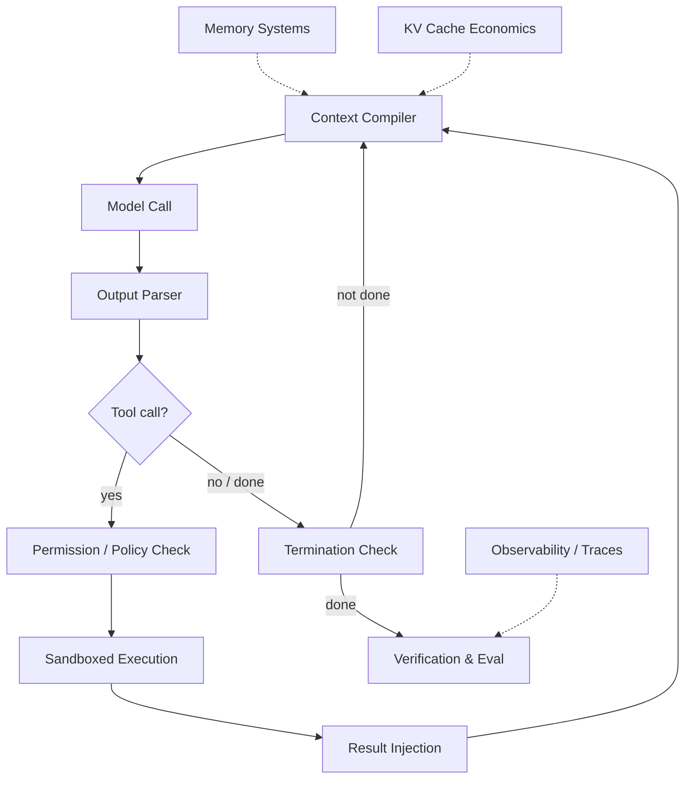
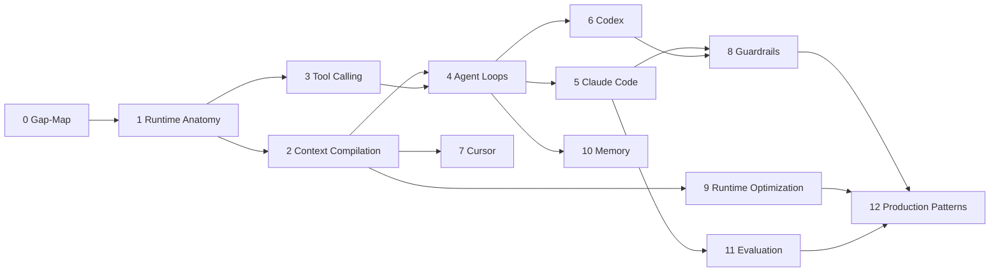

# Harness Engineering Internals

> [!abstract] Research Map
> The builder-side companion to [[Harness-Engineering-Hub]]. That deep dive taught you how to **operate** an agent harness — instructions, state files, scope control, verification. This one teaches you how to **build** one: the runtime architecture, tool-calling machinery, context compilation, sandboxing, caching economics, and evaluation infrastructure behind Claude Code, Codex, Cursor, and Bedrock AgentCore.
> 12 chapters + gap-map + annotated bibliography | Night mode, 2026-07-02

## Why This Exists

There are two ways to know a system. You can know it the way a pilot knows a plane — which levers to pull, what the instruments mean, what to do when something feels wrong. Or you can know it the way the aerospace engineer knows it — why the wing has that shape, what loads the spar carries, which failure modes the design already survived on paper. The existing [[Harness-Engineering-Hub|Harness Engineering]] notes made you a good pilot. This repository exists to make you the engineer.

The gap matters because the people building these systems — at Anthropic, OpenAI, Amazon Bedrock, Cursor, Cognition — do not talk about AGENTS.md hygiene when they talk to each other. They talk about cache invalidation boundaries in the message prefix, about why constrained decoding trades output quality for schema validity, about whether kernel-level sandboxing is worth the cross-platform maintenance burden, about pass^k versus pass@k in their release gates. Every one of those phrases encodes a design decision with a history, a trade-off, and a failure mode. If you only know the operator layer, these conversations are opaque. If you know why the systems are built this way, you can hold your own — and more importantly, you could build significant parts of them yourself.

There is also a timing reason. "Harness engineering" became a named discipline only in early 2026 — Mitchell Hashimoto's February post gave it the formula (Agent = Model + Harness), and OpenAI, Anthropic, and Martin Fowler institutionalized it within weeks. The field is young enough that its entire primary literature is still readable in one focused effort. That window closes as the discipline grows. This repository is that focused effort, captured.

## The Big Picture

Strip away every product name and the same architecture appears everywhere. At the center is a loop so simple it looks trivial: assemble context → call the model → parse what came back → execute any tool calls → append results → repeat until done. Everything interesting in this field is what happens **around** that loop.

Context does not just get concatenated; it gets **compiled** — ordered, budgeted, pruned, and laid out to keep the prompt cache warm, because a cold cache multiplies both cost and latency by roughly an order of magnitude. Tool calls do not just get parsed; they pass through schema validation, permission checks, sandbox selection, and error-recovery policies before a single process spawns. The model's output is never trusted: verification layers, policy engines, and OS-level sandboxes assume the model can be wrong or manipulated, and make the blast radius small when it is. And none of it ships without evaluation infrastructure, because an agent that works in a demo and an agent that works across ten thousand production sessions are separated entirely by the machinery that measures the difference.

The second big idea: the harness is where **determinism lives**. The model is stochastic; everything around it should not be. Permission rules, sandbox profiles, compaction thresholds, retry budgets, eval gates — these are ordinary software, testable and versionable, and they are what turn a probabilistic text generator into something you can run unattended for eight hours. When you hear engineers say "move it out of the prompt and into the harness," this is what they mean: converting a behavior you *hope* the model exhibits into a behavior the runtime *guarantees*.

The third: almost every architectural fight in this field is a fight about **context**. Single loop versus multi-agent is really "can you afford to share full context between decision-makers?" Subagents exist to isolate context, not to simulate teamwork. Compaction, memory systems, retrieval scheduling, and file-system offloading are all answers to the same question — what deserves to occupy the model's scarce, quality-degrading attention window right now? Hold that lens and a dozen seemingly unrelated design decisions snap into one picture.

## How It All Fits Together

Chapters 1–4 are the discipline's core: what a harness is ([[Harness-Internals-Runtime-Anatomy|Runtime Anatomy]]), how context gets built ([[Harness-Internals-Context-Compilation|Context Compilation]]), how tools actually work at the wire level ([[Harness-Internals-Tool-Calling-Internals|Tool Calling Internals]]), and how loops get orchestrated ([[Harness-Internals-Agent-Loop-Architecture|Agent Loop Architecture]]). Everything else stands on these four.

Chapters 5–7 are case studies in the strongest sense — three production systems dissected: [[Harness-Internals-Claude-Code-Architecture|Claude Code]] (the minimal-loop, no-index philosophy), [[Harness-Internals-Codex-Architecture|Codex]] (the kernel-sandboxed Rust runtime), and [[Harness-Internals-Cursor-AI-IDE-Architecture|Cursor]] (the indexed, latency-obsessed IDE). Read them against each other; the disagreements are the curriculum.

Chapters 8–11 are the production disciplines that wrap the core: [[Harness-Internals-Guardrails-Sandboxing|Guardrails & Sandboxing]], [[Harness-Internals-Runtime-Optimization|Runtime Optimization]], [[Harness-Internals-Memory-Systems|Memory Systems]], and [[Harness-Internals-Evaluation-Infrastructure|Evaluation Infrastructure]]. Chapter 12 ([[Harness-Internals-Production-Patterns|Production Patterns]]) zooms out to the platform layer — Bedrock AgentCore and friends — and names the patterns every company independently converged on.

Start with [[Harness-Internals-Things-You-Dont-Know-Yet]] — it maps each gap in the operator-side notes to the chapter that closes it, and it is the honest inventory of what separates using these systems from building them.

## Deep Dives

| # | Chapter | Note | Why It Matters |
|---|---------|------|----------------|
| 0 | Things You Probably Don't Know Yet | [[Harness-Internals-Things-You-Dont-Know-Yet]] | The gap-map backbone — what beginner material omits and builders assume |
| 1 | Runtime Anatomy | [[Harness-Internals-Runtime-Anatomy]] | What a harness IS from the builder side; the discipline's origin and design philosophy |
| 2 | Context Compilation | [[Harness-Internals-Context-Compilation]] | Context as compiled artifact; cache-aware layout; compaction; the field's central resource problem |
| 3 | Tool Calling Internals | [[Harness-Internals-Tool-Calling-Internals]] | Schema→tokens, constrained decoding, provider differences, MCP — the wire-level truth |
| 4 | Agent Loop Architecture | [[Harness-Internals-Agent-Loop-Architecture]] | Loops, graphs, subagents, and the multi-agent debate that splits the industry |
| 5 | Claude Code Architecture | [[Harness-Internals-Claude-Code-Architecture]] | The minimal-harness thesis, reverse-engineered; the no-RAG decision |
| 6 | Codex Architecture | [[Harness-Internals-Codex-Architecture]] | Kernel-level sandboxing, the Rust rewrite, and OpenAI's security-first philosophy |
| 7 | Cursor & AI IDE Architecture | [[Harness-Internals-Cursor-AI-IDE-Architecture]] | Merkle-tree indexing, shadow workspaces, speculative edits, per-surface model routing |
| 8 | Guardrails & Sandboxing | [[Harness-Internals-Guardrails-Sandboxing]] | Defense-in-depth from permission rules to microVMs; why injection defense must be architectural |
| 9 | Runtime Optimization | [[Harness-Internals-Runtime-Optimization]] | KV cache economics, batching, speculative decoding, routing — why harnesses are shaped by inference physics |
| 10 | Memory Systems | [[Harness-Internals-Memory-Systems]] | Episodic/semantic/procedural memory architectures and the engineering of forgetting |
| 11 | Evaluation Infrastructure | [[Harness-Internals-Evaluation-Infrastructure]] | Benchmarks dissected, LLM-judge limits, trace evals — the machinery of knowing it works |
| 12 | Production Patterns | [[Harness-Internals-Production-Patterns]] | Bedrock AgentCore and the convergent patterns of agent platforms at scale |
| — | Annotated Bibliography | [[Harness-Internals-Bibliography]] | Every primary source, with what it teaches and when to read it |
| — | Explore Next | [[Harness-Internals-Explore-Next]] | The deferred Level 2 wave: 27 deeper chapters, deduplicated and ranked for a future session |

### Level 2 — Deep-Dive Wave

Twenty Level 2 chapters across four batches, each going a full chapter deeper than its parents on one convergent topic. Batch 1 wrote the multi-nominated core of Cluster A; batch 2 finished Cluster A, added the security-cluster spine (Information-Flow Control), and opened Cluster B; batch 3 finished Cluster B and promoted the top discovered topic (Agent Progress Metrics); batch 4 completed Cluster C, the tool-calling and protocol layer. Ten roadmap topics remain deferred in [[Harness-Internals-Explore-Next]].

**Batch 1 — Cluster A core** (each nominated independently by two or more Level 1 chapters):

| # | Chapter | Note | Parents | Why It Matters |
|---|---------|------|---------|----------------|
| A1 | System Prompt Assembly & Cache Economics | [[Harness-Internals-Prompt-Assembly-Cache-Economics]] | Runtime Anatomy · Claude Code | Billing mechanics dictate prompt architecture; the assembly layer triangulated across Claude Code, Codex, Cursor |
| A2 | Compaction Pipeline Design | [[Harness-Internals-Compaction-Pipelines]] | Context Compilation · Claude Code | The most consequential lossy operation: tiers, summary schemas, rehydration, steering, cross-harness comparison |
| A3 | Subagent Orchestration & Context Topologies | [[Harness-Internals-Subagent-Orchestration]] | Agent Loop · Context Compilation | The fork boundary as an implementable decision; Anthropic-vs-Cognition resolved into criteria |
| A4 | Speculative Decoding: Theory + Code-Editing Variant | [[Harness-Internals-Speculative-Decoding]] | Runtime Optimization · Cursor | Rejection-sampling exactness, tree attention, EAGLE, and Cursor's deterministic speculative edits in one chapter |
| A5 | Memory Poisoning & Provenance-Aware Write Paths | [[Harness-Internals-Memory-Poisoning-Defense]] | Memory Systems · Guardrails | OWASP's top agentic risk; provenance-gated writes, auditing, quarantine, belief-drift detection |

**Batch 2 — Cluster A finish + security spine + Cluster B opener:**

| # | Chapter | Note | Parents | Why It Matters |
|---|---------|------|---------|----------------|
| B2-1 | Kernel Sandbox Enforcement | [[Harness-Internals-Sandbox-Kernel-Enforcement]] | Guardrails · Codex | The syscall-layer truth: seccomp-bpf construction, Landlock ABI negotiation, Seatbelt SBPL, Codex's real profiles; corrects the stale "Landlock-default" claim (Codex now defaults to bubblewrap) |
| B2-2 | MicroVM Sandbox Infrastructure | [[Harness-Internals-MicroVM-Sandbox-Infrastructure]] | Production Patterns | Firecracker snapshots/warm pools, gVisor/Kata/container deltas, per-session VM mapping and reclaim |
| B2-3 | Agentic Search vs Embedding Retrieval | [[Harness-Internals-Agentic-Search-vs-Embedding-Retrieval]] | Claude Code · Cursor · Tool Calling | grep→read as an algorithm with a cost curve vs code embedders/rerankers; the same IR problem at 1,000-tool scale |
| B2-4 | Information-Flow Control for LLM Agents | [[Harness-Internals-Information-Flow-Control-Agents]] | Guardrails · Memory Poisoning | The parent of the *data*-security cluster: dual lattices, label propagation, CaMeL/FIDES/NeuroTaint/MVAR; trifecta and provenance-writes fall out as corollaries |
| B2-5 | Termination, Budgets & Loop Control | [[Harness-Internals-Termination-Budgets-Loop-Control]] | Runtime Anatomy | Doom-loop detection, graceful mid-task exit, multi-level budget enforcement; opens Cluster B |

**Batch 3 — Cluster B finish + promoted unknown-unknown:**

| # | Chapter | Note | Parents | Why It Matters |
|---|---------|------|---------|----------------|
| B3-1 | Durable Execution & Event-Sourced Agent State | [[Harness-Internals-Durable-Execution]] | Agent Loop · Runtime Anatomy | Deterministic replay, replay-safe LLM calls, at-least-once + idempotency as the honest "exactly-once"; the substrate under long-horizon reliability |
| B3-2 | Schedulers, Background Tasks & Mid-Turn Steering | [[Harness-Internals-Scheduling-And-Steering]] | Agent Loop | Loop-as-event-loop; mid-mutation cancellation without state corruption; steering vs the prompt cache |
| B3-3 | Planning Layers: Plan Mode, Todo State & Reflection | [[Harness-Internals-Planning-And-Reflection]] | Agent Loop | What planning/reflection demonstrably buys vs cargo-cult loops; critic independence; the generation-verification gap |
| B3-4 | The Economics of Agent Topologies | [[Harness-Internals-Agent-Topology-Economics]] | Agent Loop · Subagent Orchestration | Cache-adjusted cost model, the task-value threshold V*, affine budget inheritance that makes the fork bomb impossible by construction |
| B3-5 | Agent Progress Metrics | [[Harness-Internals-Agent-Progress-Metrics]] | Termination · Agent Loop | How an agent knows it's making progress — promoted from batch-2's top 2-source unknown-unknown; PRMs, semantic early-stopping, the online-vs-retrospective split |

**Batch 4 — Cluster C complete (tool-calling & protocol layer):**

| # | Chapter | Note | Parents | Why It Matters |
|---|---------|------|---------|----------------|
| B4-1 | Constrained Decoding Engines | [[Harness-Internals-Constrained-Decoding-Engines]] | Tool Calling | Schema→FSM/PDA→token-mask over a ~128K vocabulary; jump-forward/coalesced decoding; Outlines vs XGrammar vs llguidance compared; where masking distorts output quality and how to recover it |
| B4-2 | MCP Protocol Internals | [[Harness-Internals-MCP-Protocol-Internals]] | Tool Calling | The JSON-RPC lifecycle end to end; stdio/SSE/streamable-HTTP transports and why resumability re-imposes load-balancer stickiness; the 2026 stateless-core RC + Tasks primitive; OAuth + the tool-poisoning/confused-deputy surface |
| B4-3 | Programmatic Tool Calling & Code Mode | [[Harness-Internals-Programmatic-Tool-Calling]] | Tool Calling | Model-written orchestration code collapses token cost 20–98%, but detonates the per-call permission model; Anthropic PTC vs Cloudflare Code Mode vs CodeAct vs smolagents — containment replaces authorization |
| B4-4 | The Responses API as an Agent Protocol | [[Harness-Internals-Responses-API-Protocol]] | Codex | Item-based turns vs the message model; encrypted reasoning items × ZDR × compaction; server-side state (`store`/`previous_response_id`) vs stateless; the protocol Codex is built on |
| B4-5 | A2A Protocol Internals | [[Harness-Internals-A2A-Protocol-Internals]] | Production Patterns | Agent Card discovery, the task state machine, SSE vs push-notification streaming, the MCP-vs-A2A division of labor, and where protocol ends and bilateral trust begins |

## Recommended Study Order

Foundations first (1–4, in order — 2 and 3 can swap). Then the case studies (5–7) while the foundations are fresh, because every case study is an argument about them. Then the production disciplines (8–11) in any order, and Production Patterns (12) last — it only pays off once you can recognize what the platforms are abstracting.

## Sources

Chapter-level references live in each note; the full annotated library is in [[Harness-Internals-Bibliography]]. The sources that anchor the whole repository:

- [Mitchell Hashimoto — My AI Adoption Journey](https://mitchellh.com/writing/my-ai-adoption-journey) — the February 2026 post that named the discipline
- [OpenAI — Harness Engineering](https://openai.com/index/harness-engineering/) — the 1M-line-app field report that put numbers behind it
- [Anthropic — Effective harnesses for long-running agents](https://www.anthropic.com/engineering/effective-harnesses-for-long-running-agents) — the operator-to-builder bridge
- [Cognition — Don't Build Multi-Agents](https://cognition.ai/blog/dont-build-multi-agents) — one pole of the field's defining argument
- [Anthropic — How we built our multi-agent research system](https://www.anthropic.com/engineering/multi-agent-research-system) — the other pole
- [awesome-harness-engineering](https://github.com/ai-boost/awesome-harness-engineering) — the community's living index of the field

## Related Notes

- [[Harness-Engineering-Hub]] — the operator-side deep dive this repository extends (14 notes: instructions, state, scope, verification, session lifecycle)
- [[Harness-Engineering-What-Is-A-Harness]] — the operator-side definition; chapter 1 rebuilds it from the builder side
- [[Harness-Engineering-State-Persistence]] — operator-side state discipline; chapter 10 covers the systems underneath
- [[Harness-Engineering-Observability]] — operator-side observability practice; chapter 11 covers the infrastructure
