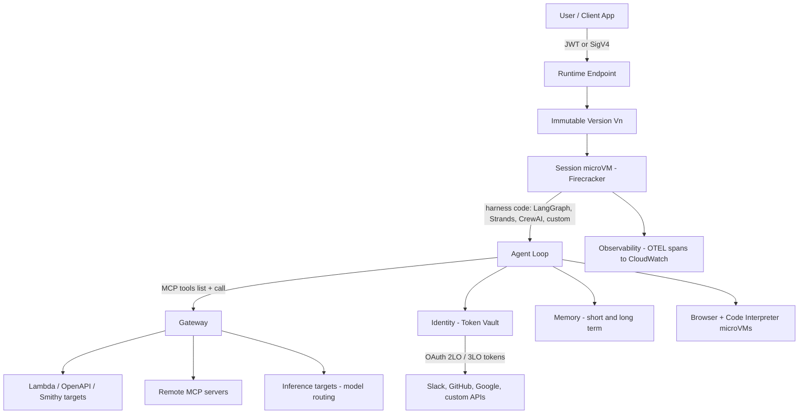

> [!info] Context
> Part of [[Harness-Internals-Overview|Harness Engineering Internals]]. Chapter: Production Agent Platforms — Bedrock AgentCore, Enterprise Runtimes, and the Patterns Everyone Converged On. Depth level 1.

# Production Agent Platforms: Bedrock AgentCore, Enterprise Runtimes, and the Patterns Everyone Converged On

## 1. Executive Overview

Every previous chapter in this manual dissected a harness from the inside: the loop ([[Harness-Internals-Agent-Loop-Architecture]]), the tool pipeline ([[Harness-Internals-Tool-Calling-Internals]]), the sandbox ([[Harness-Internals-Guardrails-Sandboxing]]), memory ([[Harness-Internals-Memory-Systems]]). This chapter zooms out and asks a different question: what happens when agent infrastructure stops being something each team hand-rolls and becomes a cloud product you rent?

Between mid-2025 and 2026, every major cloud vendor shipped a managed agent platform: Amazon Bedrock AgentCore (GA October 13, 2025), Google's Vertex AI Agent Engine plus the ADK and A2A protocol, Microsoft's Azure AI Foundry Agent Service and Agent Framework, OpenAI's AgentKit on top of the Responses API, and Anthropic's Claude Agent SDK. These teams did not coordinate, they compete viciously, and yet their platforms converged on nearly identical primitives: per-session isolation, a tool projection layer speaking MCP, agent identity separate from user identity, OpenTelemetry-based tracing, and checkpoint/resume semantics. When independent engineering organizations under competitive pressure all land on the same shapes, those shapes are telling you something true about the problem. This chapter uses AgentCore as the deep case study — it is the best-documented — then maps the other platforms against it, extracts the convergent patterns with their reasons, and is honest about where the vendors genuinely disagree and why.

## 2. Historical Evolution

The pre-platform era had a predictable arc. In 2023, "building an agent" meant wiring LangChain or a hand-rolled loop to an LLM API and running it wherever your web app ran — a Flask process, a Lambda function, a notebook. This worked for demos and collapsed in production for reasons that had nothing to do with model quality:

**Hosting mismatch.** Serverless functions imposed 15-minute execution caps on workloads that run for hours. Container platforms like ECS or Kubernetes could run long, but they pool requests from many users through shared processes — fine for stateless HTTP handlers, dangerous for an agent that writes files, holds credentials, and executes model-generated code on behalf of one specific user.

**Credential sprawl.** Agents need to call Gmail, GitHub, Slack, internal APIs. Teams stuffed OAuth tokens into environment variables or passed user tokens straight through to the agent process, which meant a prompt-injected agent could exfiltrate the user's actual credentials. Nobody had an answer to "who is the agent, exactly?" in the IAM sense.

**Tool integration N×M.** Every agent needed custom glue for every API. Anthropic's Model Context Protocol (released November 2024) attacked this by standardizing the agent↔tool wire format, and its adoption by OpenAI in March 2025 made it the de facto standard. But MCP created a new problem — enterprises now had hundreds of tools across dozens of servers, and stuffing 500 tool schemas into a context window destroys both cost and tool-selection accuracy.

**The first-generation managed offerings were too opinionated.** Bedrock Agents v1 and the OpenAI Assistants API forced you into the vendor's orchestration logic: their prompting strategy, their loop, their state model. Meanwhile Claude Code, Devin, and Manus demonstrated through 2025 that the harness — the loop design, context management, tool ergonomics — is where agent quality actually lives, and teams refused to give it up. The second-generation platforms internalized this lesson: host *my* loop, don't replace it.

So the 2025–2026 platform generation split the stack: **you own the harness, the platform owns everything below it** — isolation, sessions, identity, tool connectivity, memory storage, tracing. AWS previewed AgentCore in July 2025 and shipped GA in October; OpenAI announced AgentKit at DevDay on October 6, 2025; Microsoft merged AutoGen and Semantic Kernel into the Agent Framework on October 1, 2025; Google had released ADK 1.0 for Python in May 2025 and donated A2A to the Linux Foundation on June 23, 2025. Four platform launches inside four months. That is what a category solidifying looks like.

## 3. First-Principles Explanation

Start from what an agent workload actually *is*, and the platform primitives fall out one by one.

An agent is a process that: (a) runs code partially authored by a model at runtime, (b) holds credentials to act on external systems, (c) maintains mutable state across a conversation that can span hours, (d) makes a variable and unpredictable number of expensive model calls, and (e) serves exactly one principal — a user, or an autonomous trigger — per session.

Take each property seriously and derive the requirement:

**Model-generated behavior → strong isolation.** A web server executes code *you* wrote; the worst a malicious request can do is exploit a bug you shipped. An agent executes plans the model wrote, sometimes including literal code via a code interpreter, sometimes shaped by prompt injection from content the agent read. You must treat the agent process as *potentially adversarial toward its own host* — the same trust posture as a multi-tenant code-execution service like AWS Lambda. That is why the isolation boundary must be a hypervisor, not a Linux namespace. Containers share a kernel; the kernel's syscall surface is enormous and container escapes via kernel bugs recur every year. A microVM (Firecracker being the canonical implementation — the same VMM under Lambda) gives each session its own guest kernel behind a ~50 KB-attack-surface virtual machine monitor, boots in around 125 milliseconds, and costs under 5 MB of memory overhead. You get VM-grade blast-radius containment at near-container density. When the workload can be steered by an attacker through the *prompt*, the kernel-sharing shortcut that containers take is exactly the shortcut you cannot afford.

**One principal per session → session-scoped environments.** If user A's agent and user B's agent share a filesystem or process memory, a prompt-injected agent for A can read B's scratch files and session context. The clean fix is structural, not policy-based: one session, one environment, destroyed at the end. Cross-session contamination becomes impossible rather than merely forbidden.

**Hours-long, stateful, bursty → a new compute economics.** Sessions last hours but the CPU is mostly idle — the agent spends 30–70% of wall-clock time waiting on model responses or tool I/O (AWS's own figure). Provisioned containers waste that; 15-minute serverless caps forbid it. The platform answer is a session-pinned microVM that persists (up to 8 hours in AgentCore) but bills CPU only while actively processing, not during I/O wait.

**Credentials to external systems → identity brokering.** The agent must never *be* the user (impersonation means the audit log lies about who acted) and must never hold long-lived secrets in its own process (prompt injection exfiltrates them). So the agent gets its own workload identity, credentials live in a vault outside the agent's environment, and the agent requests scoped, short-lived tokens per action — delegation, not impersonation.

**Hundreds of tools → a projection layer.** Enterprises will not rewrite two decades of REST APIs and Lambda functions as MCP servers. A gateway that *projects* existing interfaces (OpenAPI specs, Lambda functions) as MCP tools, plus semantic search so the agent retrieves the 5 relevant tools out of 500 rather than carrying all of them in context, is the only path that meets enterprises where they are.

Every managed platform is, at its core, these five derivations packaged as services.

## 4. Mental Models

**The platform is an operating system for agents.** This is the model AgentCore's design makes almost literal. The Runtime is the process model (one session = one isolated process); Gateway is the syscall table (a uniform, mediated interface to everything outside the process); Identity is the permission system (each process runs as a principal distinct from the logged-in user, like a service account); Memory is the filesystem that survives process exit; Observability is `strace` for agents. Sierra even named its product "Agent OS." The analogy earns its keep because it predicts correctly: just as an OS doesn't care what language your process is written in, the platform doesn't care what framework your harness uses — it defines the ABI (an HTTP contract on `/invocations` and `/ping`, in AgentCore's case) and hosts anything that speaks it.

**Harness above the line, platform below it.** Draw one horizontal line. Above: the agent loop, prompts, tool selection logic, framework choice — the things that determine agent *quality*, which vendors learned teams will not surrender. Below: isolation, scaling, identity, credential storage, trace collection — the things that determine agent *safety and operability*, which teams are happy to surrender. The 2025 platform generation succeeded precisely where the 2024 generation failed because it moved the line down.

**The agent is a contractor, not an employee with your badge.** For identity: an employee (classic app acting as the user) walks around with the user's badge — everything they touch looks like the user did it. A contractor has their own badge, plus a signed work order saying which client they're working for. AgentCore's token vault model is the contractor pattern: the agent authenticates as itself, carries verifiable user context, and gets scoped access per job. When something goes wrong, the audit trail distinguishes "the user did X" from "the user's agent did X" — a distinction that matters enormously in an incident review.

## 5. Internal Architecture — AgentCore as the Deep Case Study

AgentCore is seven composable services; you can adopt any subset. Here is how a fully wired deployment fits together:



**Runtime.** Your harness is a container image in ECR exposing two endpoints: `POST /invocations` (accepts the payload, returns JSON or an SSE stream) and `GET /ping` (returns `Healthy` or `HealthyBusy` — the busy state is how long-running background work signals "don't reap me"). The Runtime is framework-agnostic by construction: LangGraph, CrewAI, Strands Agents, or a bare `while` loop all deploy identically because the contract is HTTP, not a Python API. It also natively hosts MCP servers and A2A servers as alternative protocol contracts. WebSocket support handles bidirectional streaming for interactive experiences.

Two constructs govern deployment. **Versions** are immutable snapshots — creating a Runtime makes V1; any config change (new image, network settings) creates V2, V3, never mutating history. **Endpoints** are named pointers to versions with their own ARNs: the auto-created `DEFAULT` endpoint tracks the latest version; you create custom endpoints (`prod`, `staging`) pinned to specific versions and retarget them without downtime. This is blue/green deployment reduced to a pointer swap, with rollback being the same pointer swap in reverse. The reason this matters more for agents than for stateless services: an agent version change can alter *behavior* in ways integration tests won't catch, so cheap, instant rollback is not a luxury.

**Sessions** are the isolation unit. Each `runtimeSessionId` (client-supplied, minimum 33 characters) maps to a dedicated microVM with isolated CPU, memory, and filesystem. The session lives through Active → Idle → Terminated: reaped after 15 minutes of inactivity, an 8-hour maximum lifetime, or a failed health check. On termination the microVM is destroyed and its memory sanitized; a subsequent request with the same session ID gets a *fresh* environment. Session state is therefore explicitly ephemeral — durable context belongs in Memory. Billing follows the session model: $0.0895 per vCPU-hour and $0.00945 per GB-hour metered per second, with CPU not billed during I/O wait — which, given agents idle 30–70% of the time waiting on models, is the difference between viable and absurd economics for 8-hour sessions.

**Gateway** is the tool projection layer. It fronts three target categories. *MCP targets* run in aggregation mode: Lambda functions, OpenAPI specs, Smithy models, and remote MCP servers all get merged into one virtual MCP server presenting a single consolidated `tools/list`. *HTTP targets* are passthrough — other agents, A2A services — routed by path without aggregation. *Inference targets* route LLM calls across providers (Bedrock, OpenAI, Anthropic) keyed on the request's `model` field, making Gateway also a model gateway. The killer feature is semantic tool search, exposed as a built-in MCP tool named `x_amz_bedrock_agentcore_search`: instead of listing 500 tools into the context window, the agent queries in natural language and receives the relevant handful. AWS claims roughly 3× better latency from keeping agents focused on relevant tool subsets versus the full registry — plausible, since tool schemas are token-heavy and tool-selection accuracy degrades measurably as the tool count grows.

**Identity** implements the contractor model. Agents get *workload identities*. Inbound auth validates who may invoke the agent (IAM SigV4 or OAuth JWT against your IdP — Cognito, Okta, Entra ID). Outbound auth governs what the agent may reach, in two modes: **user-delegated** (OAuth 3-legged authorization-code flow — the user consents once, the resulting token is cached in the *token vault* under the compound key of workload identity + user identity) and **autonomous** (2-legged client-credentials flow for the agent acting as itself — cron-triggered agents, background jobs). The vault sits outside the agent's environment; the agent never sees long-lived refresh tokens, only short-lived access tokens fetched per need. This is the direct structural answer to "prompt injection steals credentials."

**Memory** is a managed service with two tiers: short-term session events (turn-by-turn raw records) and long-term extracted knowledge, produced asynchronously (~1 minute after events land) by configurable strategies — semantic fact extraction into vector-searchable namespaces, user-preference extraction, session summarization, or custom logic. Memory *branching* lets parallel agents in a multi-agent system write to isolated branches of a shared memory resource without clobbering each other. The design decision worth noticing: memory extraction runs *outside* the agent loop, on the platform, asynchronously — contrast with Anthropic's stance in section 10.

**Built-in tools.** Browser and Code Interpreter are themselves session-isolated services — one session, one dedicated microVM, destroyed after use. Code Interpreter runs Python/JS/TS with a 15-minute default (extendable to 8 hours); Browser offers live-view and full session replay with CloudTrail audit. These exist as managed services because they are the two most dangerous capabilities an agent can have (arbitrary code, arbitrary web), and the ones teams most predictably sandbox incorrectly — see [[Harness-Internals-Guardrails-Sandboxing]].

**Observability** emits OpenTelemetry spans into CloudWatch's GenAI observability, following the OTel GenAI semantic conventions covered in section 10.

## 6. Step-by-Step Execution

Trace one request through the full stack. A user asks a deployed support agent: "check my last order and refund it if it hasn't shipped."

1. The client app, holding a JWT from Okta, calls `InvokeAgentRuntime` with the agent endpoint's ARN, a `runtimeSessionId` (reused from the ongoing conversation), and the user message as payload.
2. Inbound auth validates the JWT: signature against the IdP's discovery URL, audience and client allowlists. Invalid → rejected before any compute spins up.
3. The endpoint resolves to its pinned version — say `prod` → V7. The session router checks whether a live microVM exists for this session ID. It does (the conversation started three minutes ago), so the request routes to the existing microVM, whose filesystem still holds the harness's working state from the previous turn. Had the session been new or reaped, a fresh Firecracker microVM would boot from V7's container image — a cold start on the order of seconds including container init, versus milliseconds for the warm path.
4. Inside the microVM, the platform delivers the payload to `POST /invocations`. Your harness — say a LangGraph graph — wakes up and enters its loop.
5. The harness needs an order-lookup tool. Rather than carrying the company's 300-tool catalog in context, it calls Gateway's `x_amz_bedrock_agentcore_search` with "look up customer order status"; Gateway returns the top-matching tool schemas: `orders_get`, `shipments_status`, `refunds_create`.
6. The harness asks the model (routed through a Gateway inference target or called directly) for the next action; the model emits a tool call to `orders_get`.
7. Gateway receives the MCP `tools/call`, resolves `orders_get` to its target — an OpenAPI spec fronting the order service — and needs credentials. The credential provider checks the token vault under (workload identity, user identity): a valid OAuth token from the user's earlier 3LO consent exists, so it's attached and the REST call executes. No cached token would mean surfacing a consent URL to the user and suspending until authorization completes.
8. The response translates back into an MCP tool result; the harness feeds it to the model; the model decides the order hasn't shipped and calls `refunds_create`; same mediation path. The agent streams its running commentary to the user over SSE the whole time.
9. Every step emitted OTel spans — an `invoke_agent` root, `chat` children per model call with `gen_ai.usage.input_tokens`/`output_tokens`, `execute_tool` spans per Gateway call — flowing to CloudWatch for the trace waterfall.
10. The turn ends. The microVM idles (CPU billing stops), holding filesystem state for the next turn. Asynchronously, ~1 minute later, Memory's extraction strategies process the new session events: "user prefers refunds to store credit" lands in the user-preference namespace, available to *future* sessions.
11. Fifteen minutes pass with no follow-up. The session is reaped: microVM destroyed, memory sanitized. The conversation's durable residue lives only in Memory records and traces.

## 7. Implementation — How You Would Build One

Suppose you had to build a minimal AgentCore-shaped platform in-house. The essential decomposition:

**Control plane vs data plane.** The control plane is boring CRUD: agent definitions, versions (append-only table — immutability is just "no UPDATE"), endpoints (a `name → version_id` pointer table), gateway targets, credential provider configs. The data plane is where the design lives.

**Session router.** A consistent-hash or lookup-table mapping `session_id → microVM address`, with the invariant that at most one microVM serves a session. Sticky routing plus a lease: the router holds a lease per session; the reaper (idle 15 min / lifetime 8 h) revokes the lease before destroying the VM, so a racing request either renews the lease or triggers a clean cold start. Get this wrong and you get two VMs for one session — split-brain conversation state.

```
on_invoke(session_id, payload):
    vm = session_table.get(session_id)
    if vm is None or not vm.lease_alive():
        image = endpoint.resolve_version().image
        vm = firecracker_pool.boot(image)        # ~125ms VMM + container init
        session_table.put(session_id, vm, lease=15m, max_life=8h)
    return vm.http_post("/invocations", payload)  # SSE passthrough
```

**Pool management.** Cold-boot latency is dominated by container init, not the VMM, so keep a pool of pre-booted microVMs with the base layers warm, and lazily attach the version-specific image layers on assignment. This is the Lambda playbook applied to sessions.

**Tool projection compiler.** Gateway's core is a compiler from interface descriptions to MCP schemas: OpenAPI operation → MCP tool (operationId → name, parameters/requestBody → JSON Schema inputSchema), plus a runtime shim translating `tools/call` arguments into an HTTP request and back. For semantic search, embed each tool's name + description at target-sync time into a vector index; the search tool is just top-k retrieval over that index. The subtle part is *capability synchronization* — re-syncing when a target MCP server changes its advertised tools.

**Token vault.** A KMS-encrypted store keyed by (workload_identity, user_identity, provider), holding refresh tokens; an exchange service that mints short-lived access tokens on demand and *never returns refresh tokens to the agent*. The agent-facing API is `get_token(provider, scopes)`, which either returns a token or raises `AuthorizationRequired(consent_url)` — forcing the harness to model the human-consent interrupt as a first-class suspension, which is the same checkpoint/resume machinery you need for approvals generally.

**Billing meter.** Sample CPU steal/usage from the hypervisor per second; bill memory for the session's alive-time, CPU only for busy seconds. The hypervisor boundary is what makes this trustworthy — the guest can't lie about its own idleness.

## 8. Design Decisions

**MicroVM per session, not container per session, not shared pool.** Cost: microVMs add boot latency and memory overhead versus reusing warm containers, and per-session VMs cap density. Gain: a hypervisor boundary against model-steered code, and structural (not policy) elimination of cross-session leakage. AWS could make this trade cheaply because Firecracker already existed with ~125 ms boots and <5 MB overhead; a platform without that asset faces a much uglier trade, which is why smaller vendors often settle for gVisor or hardened containers ([[Harness-Internals-Guardrails-Sandboxing]] covers that spectrum).

**Immutable versions + pointer endpoints, not in-place updates.** Cost: version sprawl, more storage, a two-step deploy. Gain: rollback is instant and *exact* — an agent misbehaving in production rolls back to a bit-identical prior configuration. Because agent regressions are behavioral and eval suites are leaky ([[Harness-Internals-Evaluation-Infrastructure]]), exact rollback is worth more here than in ordinary services.

**Framework-agnostic HTTP contract, not an SDK-defined harness.** Cost: AWS can't optimize the loop it doesn't control, and can't guarantee agent quality. Gain: it never has to win the framework war, and captures workloads regardless of who wins. This is a deliberate inversion of Bedrock Agents v1's failure. OpenAI made the opposite bet with the Agents SDK + Responses API — own the loop primitives, integrate vertically — which buys them tight product cohesion at the price of ecosystem lock-in anxiety.

**Delegation, not impersonation.** Cost: real complexity — token vault, consent flows, compound identity keys. The cheap alternative (pass the user's token through) works fine right up until an injected agent uses the user's full-scope token for something the agent was never meant to do, and the audit log attributes it to the human. Every serious platform paid the complexity cost here; it's the least-varied pattern across vendors.

**Memory as a platform service (AWS/Google) vs memory as harness technique (Anthropic).** AgentCore and Agent Engine run extraction pipelines server-side; Anthropic's Agent SDK treats memory as context management — agentic filesystem search plus compaction inside the loop. The platform-side bet: memory is infrastructure, extraction should be async and survive any harness. The harness-side bet: what's worth remembering is deeply coupled to the task, and a generic extraction pipeline stores noise. This is a genuine disagreement, unresolved as of mid-2026, and covered from the algorithmic side in [[Harness-Internals-Memory-Systems]].

## 9. Failure Modes

**Session reaping surprises.** The 15-minute idle reaper and 8-hour lifetime are hard walls. An agent that stashes critical state only on the session filesystem loses it silently when the user replies 16 minutes later — the same session ID lands in a *fresh* microVM with an empty disk. Debug signature: "the agent forgot everything mid-conversation, intermittently." Fix: treat session disk as cache; durable state goes to Memory or your own store every turn — the platform-side version of the discipline in [[Harness-Engineering-State-Persistence]].

**The long-running-work vs health-check race.** Background work that doesn't flip `/ping` to `HealthyBusy` (AgentCore's `@app.async_task` does this for you) looks idle to the reaper, which kills the microVM mid-task. Debug via session termination reasons in traces.

**Consent deadlocks.** A 3LO flow with no user present (background trigger) suspends forever, or worse, the harness treats `AuthorizationRequired` as a tool error and retries in a loop, burning tokens. Autonomous-mode agents must use 2LO credentials; the harness must model consent as an interrupt, not an error.

**Semantic tool search misses.** Search over tool descriptions is only as good as the descriptions. Two tools named `create_ticket` (Jira vs internal CRM) with thin descriptions produce wrong-tool retrievals that look like model failures but are actually registry hygiene failures. Debug by logging the search query and returned candidates in the `execute_tool` span, not just the final call.

**Version/endpoint drift.** Teams point `DEFAULT` at production traffic, forget that `DEFAULT` auto-tracks the latest version, and an innocent config update becomes an instant unreviewed prod deploy. Production traffic belongs on explicitly pinned endpoints, always.

**Cost blowups.** Per-second billing with idle-CPU exemption is forgiving, but 8-hour sessions × thousands of users × memory-hours add up, and a runaway loop that never idles bills full CPU for hours. You need per-session budget alarms wired to `StopRuntimeSession` — the platform gives you the kill switch but not the policy.

**Memory extraction lag.** Long-term memory lands ~1 minute after events. An agent that writes a fact and immediately queries long-term memory for it reads its own stale past — a read-after-write consistency gap that surfaces as flaky "sometimes it knows, sometimes it doesn't" bugs in fast multi-turn exchanges.

## 10. Production Engineering — The Platform Landscape

**AWS (verified from docs and launch materials).** The pure infrastructure play described above: seven composable services, model-agnostic, framework-agnostic, sold like Lambda. AWS's position: agent quality is your problem, agent operations are theirs.

**Google (verified from docs).** A vertically integrated but open-standards stack: **ADK** (open-source framework, Python 1.0 in May 2025, later Go/Java/TS) for building; **Vertex AI Agent Engine** for hosting — managed runtime plus Sessions, Memory Bank, Example Store (few-shot retrieval as a service, which no other platform productized), and code-execution sandboxes; framework support beyond ADK (LangGraph, LangChain, LlamaIndex, AG2, custom). Google's distinctive contribution is **A2A**: released April 9, 2025, donated to the Linux Foundation June 23, 2025, now governed by a TSC including AWS, Microsoft, IBM, Salesforce, SAP, ServiceNow, with 150+ member organizations. A2A standardizes agent↔agent communication the way MCP standardized agent↔tool: JSON-RPC over HTTP/SSE, discovery via published **Agent Cards** (machine-readable capability descriptions), work modeled as **Tasks** with a lifecycle (submitted → working → input-required → completed/canceled/failed), and deliberate opacity — agents collaborate without exposing internal memory, tools, or logic. Google's bet: if agents from different vendors must interoperate, owning the protocol matters more than owning the runtime.

**Microsoft (verified from Microsoft blogs and docs).** Three layers for three audiences: **Copilot Studio** (low-code, 230,000+ organizations), **Azure AI Foundry Agent Service** (pro-code managed hosting, 10,000+ organizations since GA), and the **Microsoft Agent Framework** (public preview October 1, 2025) — the convergence of AutoGen's research-grade multi-agent orchestration (group chat, debate, reflection patterns) with Semantic Kernel's enterprise plumbing; both predecessors moved to maintenance mode. Native MCP and A2A support, OTel observability built in. The most instructive Microsoft artifact is the **Azure SRE Agent**, their flagship applied agent: its engineering posts describe a filesystem-as-workspace design — runbooks, query schemas, and past investigation notes exposed as files that the agent works over with `read_file`, `grep`, and shell commands, extended via skills and subagents. That is the Claude Code architecture, independently adopted by Microsoft for a production ops agent — one of the strongest convergence signals in the industry.

**OpenAI (verified from docs and announcements).** The substrate is the **Responses API** — server-side conversation state, built-in tools (web search, file search, code interpreter, computer use), designed explicitly as the agent-native successor to Chat Completions. Above it, the **Agents SDK**: deliberately minimal primitives — Agents, **Handoffs** (delegation by *transferring control*: switching instructions, model, and toolset mid-conversation rather than spawning a subagent), Guardrails, Sessions, Tracing — and notably provider-agnostic, supporting 100+ non-OpenAI models. **AgentKit** (DevDay, October 6, 2025) adds the productized layer: Agent Builder (visual canvas with versioning), Connector Registry (admin-governed data-source and MCP connector catalog — their Gateway analog), ChatKit (embeddable UI), and trace-grading evals. OpenAI's shape: vertical integration from model to UI, with the API as the runtime rather than a rentable VM — closest to "the model provider *is* the platform."

**Anthropic (verified from engineering posts).** The inverse strategy: no hosted runtime; the product is the harness itself. The **Claude Agent SDK** is the extracted Claude Code harness — the loop, agentic filesystem search, automatic context compaction, subagents for parallel isolated contexts, hooks, MCP integration — shipped as a library under the thesis "give the agent a computer": file operations, bash, and code execution generalize better than bespoke per-task tools. Anthropic created MCP (November 2024), which every platform in this chapter now speaks — arguably the highest-leverage single artifact in the ecosystem. Verification is pushed into the loop (rules-based checks, visual feedback, LLM-as-judge) rather than into a platform service. Later "Managed Agents" posts signal movement toward hosted execution surfaces (documented, but thinner public detail than the SDK). Anthropic's bet: harness quality dominates infrastructure quality, and the harness must live close to the model.

**Sierra (verified from Sierra's blog; internals partially inferred).** The applied-agent company pattern: don't sell infrastructure, sell *outcomes*. Agent OS spans a code path (Agent SDK — goals, guardrails, journeys as composable skills) and a no-code path (Agent Studio, where CX teams describe journeys in plain English and the system generates instructions, guardrails, and integrations), plus Insights for optimization. Reporting by Contrary Research describes a "constellation" of 15+ models from multiple providers with supervisory agents wrapping policy enforcement around task agents (inference — consistent with Sierra's public statements but not an official architecture doc). The genuinely novel piece is **outcome-based pricing**: Sierra charges per resolved conversation, saved cancellation, or completed upsell — escalations to humans typically cost nothing. Per-seat pricing punishes vendors for agent effectiveness (fewer seats needed); per-usage pricing bills activity regardless of value; per-outcome pricing forces the vendor to eat the cost of every failed trajectory, which makes agent reliability a direct P&L line. Pricing model as engineering forcing-function.

**Perplexity (mixed: Vespa partnership is official; internals reported/inferred).** The answer engine is a specialized harness where the "tools" are a search stack: hybrid retrieval (BM25 + dense embeddings) over a live web index served by Vespa (officially documented partnership — distributed retrieval, ranking, and ML inference in one low-latency pipeline at thousands of concurrent queries/second), multi-stage ML ranking, structured prompt assembly with pre-embedded citations, and constrained generation. Model routing across frontier models plus in-house **Sonar** models (post-trained on Llama 3.3 70B for factuality) served by their ROSE inference engine (reported by industry analyses — not an official architecture publication; treat specifics as inference). The lesson: Perplexity's stated moat is the *orchestration* — retrieval, ranking, routing, citation discipline — not any model, which is the harness-engineering thesis restated as a business model.

**The convergent patterns, with reasons.** Across all seven: (1) *per-session isolation* — because model-steered execution makes sessions mutually untrustworthy; (2) *a tool projection layer* (Gateway / Connector Registry / MCP servers) — because N×M integration doesn't scale and context windows can't hold full registries; (3) *agent identity distinct from user identity* — because audit and least-privilege both break under impersonation; (4) *OTel-based tracing* using the GenAI semantic conventions (`invoke_agent` → `chat` → `execute_tool` span trees, `gen_ai.usage.*` attributes) — already emitted by VS Code Copilot, OpenAI Codex, and Claude Code — because nobody wants proprietary trace formats for a cross-vendor stack; (5) *checkpoint/suspend/resume* — because human approval gates and 3LO consent make interruption a first-class state, not an error; (6) *MCP for tools* and (7) *A2A for cross-vendor agent communication* — because standards beat bespoke glue exactly when the ecosystem fragments across vendors, which it has.

## 11. Performance

The performance profile of a hosted agent platform is dominated by four costs, in descending order of typical impact:

**Model latency** dwarfs everything — which is why the single most consequential platform optimization is economic, not computational: not billing CPU during the 30–70% of session time spent in I/O wait. The engineering-side mitigations live in the harness (streaming, parallel tool calls, model routing to cheaper/faster models for sub-tasks — see [[Harness-Internals-Runtime-Optimization]]).

**Cold starts.** Firecracker's VMM boots in ~125 ms, but container image pull and framework import push worst-case session starts to seconds. Mitigations: pre-warmed microVM pools with lazily attached image layers, slim base images, deferred imports in harness code. Session reuse amortizes this — the warm path (existing microVM) is a plain HTTP hop.

**Context size.** Tool schemas are the silent token tax. Gateway's semantic search converts an O(all tools) context cost into O(relevant tools) — AWS's ~3× latency claim comes from this, and the token-cost saving compounds every single model call in the loop. Prompt caching interacts here: a stable tool prefix caches well, while dynamically retrieved tools break prefix caching — a real tension between projection-layer dynamism and cache economics.

**Fan-out.** Multi-agent parallelism (subagents, A2A delegation) buys wall-clock speed at multiplied token cost and multiplied tail-latency exposure: the orchestrator waits on the slowest child. Memory branching and isolated contexts keep parallel writers safe, but nothing makes the p99 of a 5-way fan-out cheaper than its slowest branch.

Scalability itself is the platform's job and mostly solved by the session-sharded microVM model: sessions are embarrassingly parallel, so horizontal scale is limited by pool provisioning and account-level quotas rather than architecture.

## 12. Best Practices

Treat the session filesystem as cache, never as the source of truth; persist per-turn to Memory or your own store. Pin production endpoints to explicit versions and stage rollouts by retargeting pointers — never let production ride `DEFAULT`. Register tools with descriptions written for retrieval, because semantic search over your registry is only as good as the prose in it. Use user-delegated (3LO) credentials for anything a human triggers and autonomous (2LO) for anything a schedule triggers, and never blur them. Wire per-session cost alarms with a hard `StopRuntimeSession` action. Emit and *keep* full OTel traces from day one — trace-grading is how AgentKit-style eval loops and the practices in [[Harness-Engineering-Observability]] become possible at all. Model human approval and OAuth consent as suspensions with durable checkpoints, not as retryable errors. And the meta-practice: keep your harness portable behind the platform's HTTP contract, so the platform remains a hosting decision rather than an architecture decision.

The anti-patterns are the mirror images: passing raw user tokens into agent processes; one mega-agent carrying every tool in the registry; treating the 8-hour session ceiling as a state-management strategy; framework lock-in that welds your loop to one vendor's orchestration semantics.

## 13. Common Misconceptions

**"An agent platform is just serverless hosting with a longer timeout."** Tempting because the invocation surface looks like Lambda. Wrong because the hard parts are orthogonal to compute: identity delegation, tool projection, session-pinned statefulness, and behavioral rollback. If longer timeouts were the problem, ECS would have solved it in 2023.

**"MicroVMs are security theater; containers are fine."** Fine for code *you* wrote. Agent workloads execute model-authored actions influenced by attacker-authored content — the threat model of a public code-execution service, not of your own API. Kernel-sharing isolation and that threat model have a documented history of ending badly together.

**"MCP and A2A compete."** They sit at different joints: MCP is agent↔tool (capabilities exposed to a model), A2A is agent↔agent (opaque peers negotiating tasks with lifecycle state). An AgentCore Gateway can aggregate MCP tools while the Runtime hosts an A2A server in the same deployment.

**"Outcome-based pricing is just a billing detail."** It inverts the engineering economics: every failed trajectory becomes vendor cost, so reliability work funds itself. Sierra's pricing is best read as a public commitment about their confidence in agent completion rates — and even Sierra concedes it isn't universal, blending in consumption pricing for interactions (like routing) with no crisp outcome.

**"The platform makes my agent good."** The platform makes your agent *operable* — isolated, auditable, deployable, traceable. Quality still lives entirely above the line, in the harness: loop design, context management, tool ergonomics, verification. Nothing in this chapter substitutes for the previous ones.

## 14. Interview-Level Discussion

**Q1: Why did AWS choose per-session microVMs when containers would be an order of magnitude denser?**
Because the workload violates the assumption that makes shared-kernel isolation acceptable: that the code's behavior is fixed by its author. Agent behavior is co-authored at runtime by the model and by any content the agent reads (prompt injection), so each session must be treated as potentially hostile to its neighbors and its host. Containers isolate via kernel namespaces — one kernel bug from cross-session compromise. Firecracker gives each session a guest kernel behind a minimal VMM at ~125 ms boot and <5 MB overhead, so AWS bought VM-grade blast radius at near-container economics. The honest caveat: this trade was cheap *for AWS* because Firecracker existed and was battle-tested under Lambda; without that asset, gVisor-style syscall interception is the pragmatic middle.

**Q2: Your agent must call GitHub for the user. Walk through why passing the user's OAuth token into the agent is wrong and what the correct architecture is.**
Three failures: exposure (the token sits in a process that ingests untrusted content — injection can exfiltrate it), scope (the user's token typically carries the user's *full* permissions, violating least privilege for an agent that needs one repo), and audit (every action attributes to the human, so forensics can't separate "user did it" from "user's agent did it"). Correct: the agent holds a workload identity; the user consents once via 3LO; the refresh token lands in a vault keyed by (agent identity, user identity); the agent requests short-lived, scoped access tokens per action and never sees the refresh token. Actions now audit as "agent X, on behalf of user Y, with scope Z." For unattended agents, swap 3LO for 2LO client credentials — the agent acts as itself, and the audit trail says so.

**Q3: Gateway's semantic tool search improves latency ~3× but can break prompt caching. Explain the tension and how you'd manage it.**
Static tool lists form a stable prompt prefix that caches across turns — big savings on repeated context. Dynamic retrieval shrinks the tool set (fewer tokens, better selection accuracy, the 3× claim) but changes the prefix per query, invalidating the cache. Manage it by tiering: a small stable core toolset (always present, cacheable, ordered deterministically) plus retrieved long-tail tools appended *after* the stable prefix so cache hits survive up to the dynamic suffix. Measure the crossover: below a few dozen tools, static + cached usually wins; in the hundreds, retrieval wins regardless because selection accuracy — not tokens — becomes the binding constraint.

**Q4: AgentCore terminates sessions at 15 idle minutes / 8 hours, yet advertises long-running agents. Reconcile this, and design for a 3-day workflow.**
The microVM is an *execution* lease, not a durability boundary — the platform is telling you state outlives compute or it doesn't outlive anything. A 3-day workflow is a chain of sessions over a durable checkpoint: after each meaningful step, persist a resumable representation (plan, progress, pending approvals — the platform-grade version of [[Harness-Engineering-State-Persistence]]) to Memory or your own store; on each trigger (user reply, webhook, timer), a fresh session rehydrates from the checkpoint. Human approvals and OAuth consent are just checkpoints with an external unblock condition. The 8-hour ceiling then stops being a limit and becomes a forcing function for crash-safe design — the workflow now also survives deploys and microVM failures.

**Q5: Microsoft owns AutoGen (research multi-agent) and Semantic Kernel (enterprise SDK). Why merge them instead of keeping both?**
Because two frameworks with different runtimes fragment everything downstream that a platform monetizes: one observability integration, one MCP/A2A binding, one hosting path in Foundry, one set of enterprise compliance reviews. The Agent Framework keeps AutoGen's orchestration research (group chat, debate, reflection) as *patterns* on top of Semantic Kernel-grade production plumbing, and both predecessors went to maintenance mode. The general lesson: at platform scale, runtime unification beats framework diversity, because the expensive assets — identity, telemetry, hosting — attach to the runtime, not the API surface.

**Q6: When A2A connects your agent to a vendor's agent, what does the protocol *not* solve about trust?**
A2A gives you discovery (Agent Cards), a task lifecycle, transport security, and deliberate opacity of internals. It does not tell you whether the remote agent is *competent* (a Card is a self-declared claim, not a capability proof), whether its incentives align with yours (an airline's rebooking agent optimizes for the airline), how to verify a returned result you can't inspect the reasoning for, or how to bound liability when a delegated task goes wrong. Today's mitigations are contractual and evaluative — allowlists, per-counterparty eval suites, human gates on high-stakes delegations, treating remote outputs as untrusted inputs to your own verification. Agent-to-agent trust is an open problem (section 15), and the protocol authors know it.

## 15. Advanced Topics and Open Problems

**Cross-session learning.** Every platform persists *memories*; none credibly persists *skill*. An agent that solved a gnarly refund edge case on Tuesday re-derives the solution on Thursday. Extraction pipelines capture facts and preferences, but procedural knowledge — "this is how you handle this class of problem" — resists the embed-and-retrieve treatment. The frontier approaches: distilling successful trajectories into retrievable playbooks or skills (Anthropic's Agent Skills lean this way; the Azure SRE Agent's self-improvement loop writes its own investigation notes as files), and eventually feeding production traces into fine-tuning. Nobody has closed the loop at platform scale, partly because trajectory quality-labeling is itself unsolved.

**Long-horizon reliability.** Per-step success compounds brutally: 99% per step is ~37% over 100 steps. Checkpointing contains the blast radius of crashes but not of *drift* — accumulated small misjudgments that no single step flags. Open questions: mid-trajectory verification that doesn't double cost, plan-level (not step-level) rollback, and eval infrastructure for hour-scale tasks ([[Harness-Internals-Evaluation-Infrastructure]] covers why current evals top out at minutes).

**Cost predictability.** Token consumption per task varies by an order of magnitude with input complexity, and sessions bill by the hour-scale. Enterprises budget; agents don't. Sierra's outcome pricing transfers the variance to the vendor rather than eliminating it. Expect cost-aware harnesses (budget as a first-class loop constraint, model routing under a spend ceiling) and platform-level budget primitives beyond today's alarms-and-kill-switch.

**Agent-to-agent trust.** A2A's 150+ organizations are building the rails before the trust layer exists: capability attestation (proving a Card's claims), reputation portable across vendors, delegated-authority chains (user → my agent → vendor's agent, with scopes narrowing at each hop), and dispute resolution for autonomous transactions. The identity groundwork (workload identities, token vaults) is necessary but nowhere near sufficient — this is where the next protocol iteration will be fought.

## 16. Glossary

- **AgentCore Runtime** — AWS's managed hosting service for agent containers; framework- and model-agnostic, session-isolated via microVMs.
- **microVM** — A minimal virtual machine (Firecracker) with its own guest kernel, booting in ~125 ms with <5 MB overhead; the isolation unit for agent sessions.
- **Session** — One interaction context (one `runtimeSessionId`) pinned to one microVM; max 8 h lifetime, reaped after 15 min idle, memory sanitized on termination.
- **Version / Endpoint** — Immutable configuration snapshot / named mutable pointer to a version with its own ARN; together, the deployment and rollback mechanism.
- **Gateway** — The tool projection layer: aggregates Lambda/OpenAPI/Smithy/MCP targets into one virtual MCP server, routes HTTP and inference traffic.
- **Tool projection** — Compiling existing interfaces (REST APIs, functions) into MCP tool schemas plus a runtime translation shim, without rewriting the backend.
- **Semantic tool search** — Natural-language retrieval over a tool registry (`x_amz_bedrock_agentcore_search`) so agents carry only relevant tools in context.
- **Workload identity** — An identity belonging to the agent itself, distinct from any user, enabling delegation and honest audit trails.
- **Token vault** — Platform-managed encrypted storage for OAuth credentials, keyed by (agent identity, user identity), releasing only short-lived scoped tokens to agents.
- **2LO / 3LO** — OAuth two-legged (client credentials; agent acts as itself) vs three-legged (authorization code; agent acts on behalf of a consenting user).
- **MCP** — Model Context Protocol; the standard for agent↔tool communication, created by Anthropic (Nov 2024), adopted industry-wide.
- **A2A** — Agent2Agent protocol; the standard for agent↔agent communication (Agent Cards, task lifecycle, JSON-RPC/SSE), Google-created, Linux Foundation-governed.
- **Agent Card** — A machine-readable, self-declared description of an agent's capabilities used for A2A discovery.
- **OTel GenAI semantic conventions** — OpenTelemetry's standard span/attribute schema for agents: `invoke_agent`, `chat`, `execute_tool` spans; `gen_ai.usage.*` attributes.
- **Outcome-based pricing** — Charging per completed business outcome (resolution, save, upsell) rather than per seat or per usage; Sierra's model.
- **Handoff** — OpenAI Agents SDK primitive: delegation by transferring conversational control (instructions, model, tools swap) rather than spawning a subordinate.
- **Memory branching** — Isolated write branches within a shared memory resource so parallel agents don't clobber each other's context.

## 17. References

- **AgentCore Runtime — How it works (AWS docs)** — https://docs.aws.amazon.com/bedrock-agentcore/latest/devguide/runtime-how-it-works.html — The primary source for sessions, microVM isolation, versions/endpoints, inbound/outbound auth, and protocol contracts. Read first; everything in section 5 grounds here.
- **AgentCore Gateway — Core concepts (AWS docs)** — https://docs.aws.amazon.com/bedrock-agentcore/latest/devguide/gateway-core-concepts.html — Precise definitions of target categories, aggregation mode, authorizers, and credential providers. Read when designing a tool projection layer.
- **AWS Bedrock AgentCore Deep Dive (Joud W. Awad)** — https://joudwawad.medium.com/aws-bedrock-agentcore-deep-dive-6822e4071774 — The best independent end-to-end walkthrough: memory strategies, identity flows, built-in tools, with implementation-level detail the docs scatter. Read after the docs for synthesis.
- **AgentCore pricing (AWS)** — https://aws.amazon.com/bedrock/agentcore/pricing/ — Source for the vCPU-hour/GB-hour rates and the no-charge-during-I/O-wait model. Read when estimating session economics.
- **Building agents with the Claude Agent SDK (Anthropic)** — https://claude.com/blog/building-agents-with-the-claude-agent-sdk — The harness-as-product philosophy: give the agent a computer, agentic search, compaction, subagents, verification. Read to understand the anti-platform position.
- **Linux Foundation A2A announcement** — https://www.linuxfoundation.org/press/linux-foundation-launches-the-agent2agent-protocol-project-to-enable-secure-intelligent-communication-between-ai-agents — Governance, founding members, and timeline for A2A. Pair with the protocol site: https://a2a-protocol.org/latest/ for Agent Cards, task lifecycle, and the MCP-complementarity argument.
- **Introducing Microsoft Agent Framework (Azure blog)** — https://azure.microsoft.com/en-us/blog/introducing-microsoft-agent-framework/ — The AutoGen + Semantic Kernel convergence rationale and the four-pillar design. Read for the framework-consolidation case study.
- **Introducing AgentKit (OpenAI)** — https://openai.com/index/introducing-agentkit/ — Agent Builder, Connector Registry, ChatKit, and evals; with the Agents SDK docs at https://openai.github.io/openai-agents-python/ for Handoffs/Guardrails/Sessions primitives. Read for the vertically integrated alternative to AWS's primitives approach.
- **Outcome-based pricing for AI agents (Sierra)** — https://sierra.ai/blog/outcome-based-pricing-for-ai-agents — The incentive-alignment argument against per-seat and per-usage pricing. Short; read for the business-model-as-engineering-constraint angle. Contrary Research's Sierra breakdown (https://research.contrary.com/company/sierra) covers the reported internals — treat as secondary.
- **Inside the LLM Call: GenAI Observability with OpenTelemetry (OpenTelemetry blog, 2026)** — https://opentelemetry.io/blog/2026/genai-observability/ — Authoritative on the GenAI semantic conventions: span types, attributes, adopters (VS Code Copilot, Codex, Claude Code). Read before instrumenting any harness.
- **Vertex AI Agent Engine overview (Google Cloud docs)** — https://docs.cloud.google.com/vertex-ai/generative-ai/docs/agent-engine/overview — Runtime, Sessions, Memory Bank, Example Store, and framework support. Read to compare Google's managed surface against AgentCore's.
- **How Perplexity uses Vespa (Vespa.ai)** — https://vespa.ai/perplexity/ — The official account of Perplexity's retrieval serving layer. Read for the answer-engine-as-harness pattern; treat non-Vespa internals (ROSE, Sonar details) from secondary analyses like ByteByteGo (https://blog.bytebytego.com/p/how-perplexity-built-an-ai-google) as reported, not verified.
- **Azure SRE Agent — agentic workflows (Microsoft Tech Community)** — https://techcommunity.microsoft.com/blog/appsonazureblog/how-we-build-and-use-azure-sre-agent-with-agentic-workflows/4508753 — Microsoft's applied agent converging on filesystem-as-workspace + skills + subagents. Read as independent confirmation of the Claude Code architectural pattern.

## 18. Subtopics for Further Deep Dive

### AgentCore Identity and the Agent Delegation Problem
- **Slug**: Production-Patterns-Agent-Identity-Delegation
- **Why it deserves a deep dive**: Identity is the least-understood and least-varied convergent pattern — every platform built a token vault and delegation model, and the OAuth mechanics (2LO/3LO, token exchange, workload identity federation, scope narrowing across delegation chains) are deep enough for a full chapter with security analysis.
- **Has enough depth for a full chapter**: yes
- **Key questions to answer**: How does token exchange actually work step-by-step across user → app → agent → tool? What does a prompt-injection attack against each credential architecture look like, and which architectures survive? How should delegation chains narrow scope hop-by-hop in user → orchestrator → subagent → external agent flows?

### A2A Protocol Internals and Multi-Agent Interop
- **Slug**: Production-Patterns-A2A-Protocol-Internals
- **Why it deserves a deep dive**: This chapter covered A2A's role; the wire protocol itself — Agent Card schema, task state machine, streaming/push notification modes, auth schemes, and the unsolved trust layer — merits protocol-level treatment comparable to the tool-calling chapter's treatment of MCP.
- **Has enough depth for a full chapter**: yes
- **Key questions to answer**: What exactly is in an Agent Card and how does discovery work in practice? How do task lifecycle transitions map onto long-running, human-in-the-loop work? Where does the protocol stop and bilateral contract begin for trust, liability, and verification?

### Firecracker and Sandbox Infrastructure for Agent Workloads
- **Slug**: Production-Patterns-MicroVM-Sandbox-Infrastructure
- **Why it deserves a deep dive**: The microVM decision was argued here at the trade-off level; the implementation level — Firecracker internals, snapshot/restore for warm pools, gVisor/Kata/container comparison benchmarks, network egress policy for agent VMs — is a full systems chapter, and it's the layer interviewers at infra companies probe hardest.
- **Has enough depth for a full chapter**: yes
- **Key questions to answer**: How do Firecracker snapshots enable sub-second session resume, and what state can't be snapshotted safely? What are the measured density/latency/security deltas between Firecracker, gVisor, Kata, and hardened containers for agent workloads? How should egress filtering differ for a code-interpreter VM vs a browser VM?

### The Managed Memory Services: AgentCore Memory vs Memory Bank vs Harness-Side Memory
- **Slug**: Production-Patterns-Managed-Memory-Services
- **Why it deserves a deep dive**: Memory placement is the sharpest genuine disagreement between platforms (server-side extraction pipelines vs in-loop context management), and the extraction-strategy internals — semantic/preference/summary pipelines, namespaces, branching, consistency semantics — were only sketched here. Complements [[Harness-Internals-Memory-Systems]] from the platform side.
- **Has enough depth for a full chapter**: yes
- **Key questions to answer**: How do extraction strategies decide what to persist, and what are their measured precision/recall failure modes? What consistency model do async extraction pipelines actually provide, and how should harnesses handle the read-after-write gap? When does platform memory beat harness memory empirically, and for which task classes?

### Outcome-Based Pricing as an Engineering Constraint
- **Slug**: Production-Patterns-Outcome-Pricing-Engineering
- **Why it deserves a deep dive**: Pricing-model-as-reliability-forcing-function is a genuinely novel pattern with engineering consequences (resolution measurement systems, dispute-proof outcome attribution, cost-per-trajectory management) that no other chapter covers, but it is thinner than the protocol/infrastructure topics.
- **Has enough depth for a full chapter**: no
- **Key questions to answer**: How do you build an outcome-attribution system both parties trust? What does per-trajectory unit economics look like when the vendor eats failed attempts? Where does outcome pricing structurally not work?
