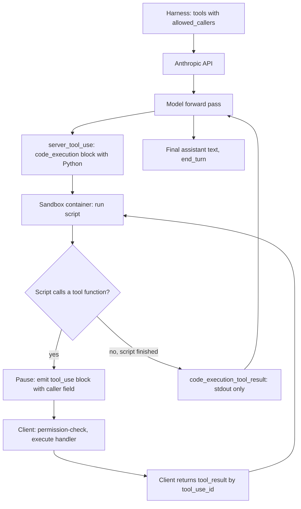

> [!info] Context
> Part of [[Harness-Internals-Overview|Harness Engineering Internals]], Level 2 wave. Parent chapter: [[Harness-Internals-Tool-Calling-Internals]] (which sketched this in its Advanced Topics). This chapter takes the sketch apart: what "the model writes orchestration code that calls tools" means mechanically, why it collapses token cost and latency, and why it detonates the per-call permission model the rest of the harness depends on — the reason it cross-links [[Harness-Internals-Sandbox-Kernel-Enforcement]], [[Harness-Internals-MicroVM-Sandbox-Infrastructure]], and [[Harness-Internals-Agent-Topology-Economics]].

# Programmatic Tool Calling and Code Mode

## 1. Executive Overview

Ordinary tool calling is a conversation: the model emits one invocation, the harness runs it, the result comes back into context, the model reads it and emits the next invocation. Every step is a full model inference pass over the entire growing context, and every intermediate result — every row of every query, every byte of every file listing — lands in the context window and is billed as input tokens on every subsequent turn. For a task that needs three tool calls this is fine. For a task that needs forty, it is a catastrophe of cost and latency, and the model's context fills with data it will summarize in one sentence and never look at again.

Programmatic tool calling — Anthropic's productized name; "code mode" is the generic term, "CodeAct" the academic ancestor — replaces the conversation with a program. Instead of emitting invocations one at a time, the model writes a *script* in a real programming language, and your tools are exposed to that script as callable functions. The script runs in a sandbox. It loops, branches, filters, and calls tools as many times as it likes, and only its final printed output re-enters the model's context. Forty tool calls become one block of Python. Nineteen model inference passes collapse into zero-between-calls. Hundreds of kilobytes of intermediate data stay in the sandbox and never cost a token.

The claim that reframes the topic for someone who thinks they already understand tool calling: **the token and latency win is the easy part, and it is not the interesting part.** The interesting part is that code mode quietly deletes the harness's control point. The entire security architecture of an agent — the permission prompt in Claude Code, the allow/deny policy in Codex, the "are you sure you want to delete this?" gate — assumes the harness sees every tool call *before* it executes and can veto it. When the model writes a loop that calls `delete_record` forty times inside a sandbox the harness never inspects, that assumption is gone. This chapter is really about the two ways the industry has answered that problem, and why they lead to completely different sandbox requirements.

## 2. Historical Evolution

The pre-history is the ReAct loop and JSON function calling, both covered in [[Harness-Internals-Tool-Calling-Internals]]. The relevant fact for this chapter is that function calling, from its June 2023 debut, was *turn-structured*: one call, one result, one model round-trip, repeat. That structure was a feature — it kept the model in the loop, able to react to each result — and it was the bottleneck.

**February 2024 — CodeAct.** Xingyao Wang and collaborators published "Executable Code Actions Elicit Better LLM Agents" (arXiv 2402.01030, ICML 2024). The thesis was blunt: stop making the model emit actions as JSON, and let it emit executable Python instead. Python is a *unified action space* — the same channel expresses tool calls, control flow, data manipulation, and composition, whereas JSON expresses only "call this one function with these arguments." Their measurement across 17 LLMs on API-Bank and a purpose-built benchmark (M3ToolEval) showed up to a 20% higher success rate for code actions over JSON/text actions. They also shipped the artifacts to make it reproducible: CodeActInstruct (7k multi-turn instruction-tuning interactions) and CodeActAgent (fine-tuned on Llama2 and Mistral). CodeAct is the intellectual root of everything else in this chapter.

**December 2024 — smolagents.** Hugging Face released smolagents, a deliberately minimal agent library built around the CodeAct idea, with `CodeAgent` (writes Python) as the default and `ToolCallingAgent` (writes JSON) as the fallback. smolagents did two things that mattered: it popularized the "agents that think in code" framing for practitioners, and it forced the security question into the open, because now anyone could run a code-writing agent on their laptop and get owned by it. Its docs are unusually honest that "no local Python sandbox can ever be completely secure."

**September 2025 — Cloudflare Code Mode.** Cloudflare reframed the idea for the MCP era ([[Harness-Internals-MCP-Protocol-Internals]]). Their observation: MCP made it trivial to connect hundreds of tools, and hundreds of tool definitions drown the context window. Their fix — convert an entire MCP server's schema into a *TypeScript API* with typed function signatures and doc comments, present the agent with a single "run this code" tool, and execute the code in a V8 isolate whose only outbound capability is a set of *bindings* to the connected servers. The tagline captures the token argument: "give agents an entire API in 1,000 tokens." For the Cloudflare API's 2,500+ endpoints, that is a reduction from ~1.17 million tokens to ~1,000 — 99.9%.

**November 2025 — Anthropic's "Code execution with MCP."** Anthropic published the same pattern as an engineering recommendation: present MCP servers as files in a filesystem the agent navigates, load tool definitions on demand, and run orchestration code that keeps intermediate results out of context. Their worked example: 150,000 tokens of upfront tool definitions and intermediate data collapsing to ~2,000 — 98.7%.

**January 2026 — Programmatic Tool Calling GA.** Anthropic shipped the managed, first-class API version: the `code_execution` tool plus an `allowed_callers` field on any tool definition, so Claude writes Python that calls your tools as async functions inside Anthropic's sandbox. This is the version with published production numbers (37–38% input-token reduction on multi-tool benchmarks) and — crucially for this chapter — a specific answer to the permission problem: the individual tool calls are re-surfaced to the client. The frontier now is the tension between that answer and Cloudflare's, which resolves the same problem in the opposite direction.

## 3. First-Principles Explanation

Start from the thing being optimized. A tool-calling agent's cost has two components that both grow with the number of tool calls:

1. **Inference passes.** Each sequential tool call requires the model to run a full forward pass over the *entire* current context to decide the next action. Ten sequential calls means ten prefills over a context that grows every time. This is the latency floor described in [[Harness-Internals-Tool-Calling-Internals]] section 11.
2. **Context accumulation.** Each tool result is appended to the conversation and re-sent — and re-billed as input tokens — on every subsequent turn. A tool that returns 20,000 tokens of JSON costs 20,000 input tokens *this* turn and every turn after, even though the model extracts one number from it.

The turn-structured design pays both costs on every call because it insists the model mediate every step. Now ask the depth-loop question: *does the model actually need to see every intermediate result?* For "read file A, then based on its contents decide whether to edit B," yes — the decision requires model reasoning over the result. But for "check whether each of these 20 employees exceeded their expense limit and tell me who did," no. The 19 employees who are under budget are noise. The model needs the *conclusion*, not the data. The turn-structured loop forces all 20 line-item sets through the context anyway.

Code is the natural expression of "do this computation and give me only the answer." Consider the two encodings of the same task.

Turn-structured (20 round trips, 20 result-sets in context):

```text
model: call get_expenses(employee=1) -> [huge json]  # into context, billed
model: call get_expenses(employee=2) -> [huge json]  # into context, billed
... 18 more ...
model: reason over 20 result-sets, emit answer
```

Code mode (1 script, 0 intermediate results in context):

```python
over_budget = []
for emp in employees:
    rows = json.loads(await get_expenses({"employee": emp}))
    if sum(r["amount"] for r in rows) > limits[emp]:
        over_budget.append(emp)
print(over_budget)   # only this line re-enters the model's context
```

Everything the turn-structured version spent tokens on — the twenty result-sets, the nineteen intermediate inference passes — is gone. The loop runs in the sandbox. The `sum` and the comparison run in the sandbox. Only `print(over_budget)` crosses back into context.

Now the mechanical question that defines the whole design space: **how are the tools exposed to the script, and where does the script run?** There are exactly three arrangements, and they differ precisely on where the trust boundary sits.

- **Tool as re-surfaced call (Anthropic PTC).** The sandbox exposes each tool as an async function stub. When the script calls it, the sandbox *pauses*, the API returns a normal `tool_use` block to your client, your client executes the tool (with all its usual permission checks) and returns the result, and the sandbox resumes. The harness still sees every call. What's hidden is only the *result*, which never enters the model's context.
- **Tool as capability binding (Cloudflare Code Mode).** The sandbox exposes each tool as a live object (a "binding") wired directly to the backing server. When the script calls it, the call goes straight to the server through the binding — the harness does *not* see the individual call. The trust boundary is the binding surface and the sandbox perimeter.
- **Tool as in-process function (CodeAct / smolagents local).** The tool is just a Python function in the same interpreter as the model-written code. There is no per-call boundary at all; the only boundary is whatever the interpreter/sandbox as a whole is allowed to touch.

These three are not implementation trivia. They are three different answers to "who can veto a tool call," and everything downstream — the security model, the failure modes, the right kind of sandbox — follows from which one you pick.

## 4. Mental Models

**Code mode is compiler-versus-interpreter for agent actions.** Turn-structured tool calling is an interpreter: the model executes one action, observes, executes the next — an interactive REPL where the model is the human at the keyboard. Code mode is a compiler: the model emits a whole program ahead of time, and the sandbox runs it to completion. The trade is the classic one. The interpreter (turn-structured) gives you a breakpoint at every step — you can inspect, gate, and intervene between actions. The compiler (code mode) gives you throughput — no per-step overhead — but you've given up the breakpoints. Every property of code mode, good and bad, is a property of having moved from step-at-a-time to batch.

**Tools presented as an API beat tools presented as a menu, because the model has read a billion APIs and zero menus.** Cloudflare's sharpest line: "LLMs have seen a lot of code. They have not seen a lot of 'tool calls.'" Function-calling formats are special tokens and synthetic training data — a dialect invented for the occasion. A typed TypeScript function with a docstring is something the model has seen millions of times in its pre-training. Asking a model to compose five JSON tool calls is asking Shakespeare to write in a language he learned last week; asking it to write five lines of Python that call five functions is asking him to write in English. This is why code mode often *improves accuracy* while cutting tokens (CodeAct's up-to-20% success bump): it plays to the model's strongest muscle.

**The context window is a scarce shared resource, and intermediate results are squatters.** Extending the "tool definitions are rent" model from the parent chapter: intermediate tool *results* are worse than rent, because they don't even provide standing value — they're data the model needs for one computation and then never again. Code mode is a garbage collector for the context window: the transient data lives and dies in the sandbox's memory, and only the durable conclusion is promoted into context.

**Programmatic tool calling turns the permission problem from "authorize each action" into "sandbox the actor."** This is the mental model that makes the security sections inevitable. In turn-structured calling, security is *authorization*: the harness sees `Bash("rm -rf /")` and denies it. In pure code mode, the harness never sees the individual action, so security becomes *containment*: you can't authorize what you can't see, so you must instead ensure the actor (the running code) *physically cannot* do harm — which is exactly the job of kernel-level and microVM sandboxing ([[Harness-Internals-Sandbox-Kernel-Enforcement]], [[Harness-Internals-MicroVM-Sandbox-Infrastructure]]). Code mode doesn't remove the security problem; it relocates it from the policy layer to the isolation layer.

## 5. Internal Architecture

The full architecture has five moving parts: the tool-binding compiler, the code sandbox, the tool bridge, the pause/resume machinery, and the result marshaller. Here is the Anthropic Programmatic Tool Calling arrangement, because it is the one with a pause/resume boundary the client participates in.



Responsibilities, precisely:

- **Tool-binding compiler.** Turns each tool's JSON Schema into a callable stub in the sandbox's language. In Anthropic PTC the stubs are async Python functions, each taking a single dict argument and returning a string (`rows = json.loads(await query_database({"sql": "..."}))`). In Cloudflare Code Mode the compiler emits a full TypeScript interface with JSDoc derived from the MCP schema. The docstring/schema quality here is load-bearing — it is the only thing telling the model how to call the tool correctly.
- **Code sandbox.** The isolated execution environment. Anthropic runs a managed Python container (the same one behind the code execution tool); Cloudflare runs a V8 isolate (a "Dynamic Worker," spun up per request via the Worker Loader API); self-hosted CodeAct/smolagents runs either a restricted local interpreter or a remote container (E2B/Docker). This component's isolation strength *is* the security posture, discussed in §10.
- **Tool bridge.** The channel by which a call inside the sandbox reaches the actual tool implementation. Three shapes, per §3: re-surfaced client call (Anthropic), in-process binding to the backing server (Cloudflare), or plain in-process function (local CodeAct).
- **Pause/resume machinery (Anthropic-specific).** When the script calls a client tool, the API suspends the container, emits a `tool_use` block whose `caller` field is `{"type": "code_execution_20260120", "tool_id": "srvtoolu_..."}`, and waits. The client answers with a `tool_result` keyed by `tool_use_id`; the API resumes the *same* container (identified by a `container` id) exactly where it paused. This is coroutine suspension across an HTTP boundary — the script's stack is frozen server-side between requests.
- **Result marshaller.** Collects the script's `stdout`/`stderr`/`return_code` into a `code_execution_tool_result` block and hands *only that* back to the model. The intermediate tool results the script consumed never appear in this block, which is the entire token-saving mechanism.

The one structural fact to hold onto: in Anthropic's design the pause/resume boundary means **individual tool calls still traverse the client**, so the harness's existing permission machinery still fires; in Cloudflare's design the bridge is a direct binding, so it does not, and enforcement must live at the binding and sandbox layers instead.

## 6. Step-by-Step Execution

Walk one complete Anthropic Programmatic Tool Calling turn, because the pause/resume dance is where the abstract architecture becomes concrete. Task: "Query customer purchase history from last quarter and identify our top 5 customers by revenue." One tool, `query_database`, marked `allowed_callers: ["code_execution_20260120"]`, plus the `code_execution` tool.

1. **Initial request.** The harness sends the user message and the `tools` array, exactly as normal tool calling, except `query_database` carries `allowed_callers` and the `code_execution_20260120` tool is present.

2. **Model writes a script, not a call.** The model's response contains a `server_tool_use` block of type `code_execution` whose `input.code` is Python:

   ```python
   import json
   rows = json.loads(await query_database({'sql': '<sql>'}))
   top = sorted(rows, key=lambda x: x['revenue'], reverse=True)[:5]
   print(f'Top 5 customers: {top}')
   ```

   Note what the model did *not* do: it did not emit a `query_database` call for the client to run and reason over. It emitted a program that will call `query_database` itself.

3. **Sandbox runs, hits the tool boundary.** The container executes the script. At `await query_database(...)`, the tool is a client-side tool, so execution *pauses*. The API returns to the harness: a `tool_use` block for `query_database` with `input: {"sql": "..."}` and `caller: {"type": "code_execution_20260120", "tool_id": "srvtoolu_abc123"}`, plus a `container` id and `expires_at`, and `stop_reason: "tool_use"`. **This is the control point.** The harness sees a concrete database query and can validate it, permission-check it, or deny it — exactly as it would for a direct call. The `caller` field is the only thing distinguishing it from a normal call.

4. **Harness executes and returns.** The harness runs the query, and replies with a user message containing *only* a `tool_result` block keyed by the `tool_use_id`, and — mandatory — the `container` id from the paused response. Two rules bite here. First, the message may contain **only** `tool_result` blocks; you cannot append a text comment (the API rejects it), because the model is not in the loop right now — the *script* is. Second, the `container` id is required, not optional, while a call is pending: without it the API can't find the frozen stack to resume.

5. **Script resumes.** The container thaws, `query_database` returns the string the harness sent, `json.loads` parses it, the `sorted(...)[:5]` runs *in the sandbox*, and `print` writes to stdout. The raw rows — potentially thousands — never left the container.

6. **Completion.** The API emits a `code_execution_tool_result` block with `stdout` ("Top 5 customers: [...]"), `stderr`, and `return_code: 0`. Only this crosses back into the model's context. The model then writes its final answer ("Your top 5 customers generated $167,500...") and stops with `end_turn`.

Contrast the loop shape. Turn-structured, this task with 20 regions instead of 1 query would be 20 model inference passes and 20 result-sets in context. Programmatic, it is one script; if the script calls the tool 20 times in a loop, the API pauses and resumes 20 times — 20 *client* round trips, but **zero model inference passes between them**, and zero intermediate results in context. And if the calls are independent, the model writes `await asyncio.gather(*(query_database(q) for q in queries))` and the 20 pauses come back as 20 parallel `tool_use` blocks in one response, which the harness answers in one batch.

The Cloudflare Code Mode execution path is shorter because there is no client pause: the model emits TypeScript, the Worker Loader spins a fresh V8 isolate, the code runs to completion calling MCP servers through bindings, and `console.log` output returns. The harness sees the code and the final output — never the individual binding calls.

## 7. Implementation

If you were building code mode yourself — the "self-managed sandboxed execution" path Anthropic explicitly documents as a valid alternative to their managed offering — five components carry the weight.

**Binding compiler.** Walk the tool registry and emit a stub per tool in the sandbox language. For Python, an async wrapper whose body serializes the call and blocks on the bridge:

```python
async def query_database(args: dict) -> str:
    return await _bridge.call("query_database", args)   # returns tool_result text
```

For a Cloudflare-style TypeScript surface, generate a typed signature plus JSDoc from the schema, so the model gets `get_expenses(input: GetExpensesInput): Promise<string>` with the description inline. The schema's `description` fields are the model's only documentation; treat them as prompt, not comments.

**The bridge.** This is the design decision. Re-surfacing (Anthropic) means the bridge is an RPC that suspends the coroutine, escapes the sandbox, and hands a `tool_use` block to the client — high fidelity to the existing permission model, at the cost of a client round trip per call. Direct binding (Cloudflare) means the bridge is an in-isolate object that calls the backing server directly, with credentials injected by a *supervisor* outside the sandbox — lower latency, but the harness loses per-call visibility. The rule that makes the direct-binding version safe: **credentials never enter the sandbox.** The API key lives on the supervisor; the binding is a capability handle, so model-written code can *use* the connection without ever *reading* the secret. This is why Cloudflare disables `fetch()` and `connect()` inside the isolate entirely — the only way out is through a binding, and bindings are the allowlist.

**The sandbox.** Non-negotiable properties for running model-written code: no ambient network egress (or a strict allowlist), no host filesystem, no environment variables (prompt-injection can otherwise exfiltrate them), CPU/memory/wall-clock limits, and ephemeral teardown. The spectrum of how to get there is the subject of [[Harness-Internals-Sandbox-Kernel-Enforcement]] (seccomp/Landlock/Seatbelt on a shared kernel) and [[Harness-Internals-MicroVM-Sandbox-Infrastructure]] (Firecracker/gVisor/Kata for a separate kernel). smolagents' `LocalPythonExecutor` sits at the weak end — an AST interpreter that whitelists imports and caps operation count — and its own docs tell you it is not sufficient for untrusted code; E2B or Docker (`executor_type="e2b"`) is the production answer.

**Pause/resume state (if re-surfacing).** You must be able to freeze a running interpreter, serialize enough to resume it after an arbitrary client delay, and key it so the right `tool_result` reconnects. Anthropic exposes this as the `container` id with a lifecycle: created per request unless reused, idle-reclaimed after ~5 minutes, resurrection blocked after 30 days, and a per-call timeout (~4 minutes) that raises a `TimeoutError` *inside* the script if the client is slow. That last detail is elegant: a slow tool doesn't hang the platform; it surfaces as a normal Python exception the model's code can catch and retry.

**Result marshaller and error surfacing.** Capture `stdout`, `stderr`, `return_code`. Only stdout is the "answer." But `stderr` matters: an uncaught exception's traceback goes to `stderr`, the model sees it in the `code_execution_tool_result`, and — because it wrote the code — it can debug and rewrite. This is error-as-result (parent chapter §8) lifted to the program level: the failing *program* is fed back, not a single failing call.

A concrete configuration point worth internalizing from the Anthropic API: `allowed_callers` takes `["direct"]` (default, normal tool calling), `["code_execution_20260120"]` (programmatic only), or both. Anthropic's guidance is to pick one per tool, not both, because the value is guidance to the model about how the tool is meant to be used, and ambiguity hurts selection. And the load-bearing caveat, quoted from their docs: `allowed_callers` "is not a hard API-level block on direct invocation... Do not rely on `allowed_callers` as a security boundary." It shapes behavior; it does not enforce it.

## 8. Design Decisions

**Re-surface calls, or bind them directly?** This is *the* decision, and the two vendors chose opposite answers for defensible reasons. Anthropic re-surfaces: every programmatic tool call comes back to the client as a `tool_use` block before it executes. The payoff is that the entire existing permission apparatus — [[Harness-Internals-Claude-Code-Permission-Pipeline]], user prompts, allow/deny policy — keeps working unchanged, because from the client's perspective a programmatic call and a direct call are the same shape (they differ only by the `caller` field). The cost is a client round trip per call, so you keep the *inference* savings (no model re-sampling) but not the *network* savings on the tool side. Cloudflare binds directly: calls never leave the isolate, so you get maximum latency and token savings, but you forfeit per-call client visibility and must move enforcement to bindings + OAuth downscoping + isolate perimeter. The heuristic: re-surface when per-call authorization is a hard requirement (agents acting on a user's private, mutable data with a human in the loop); bind directly when the tool surface is already scoped to what the user approved at connect time and throughput dominates.

**Why keep intermediate results out of the model but route them through the client?** Anthropic's design has a subtle property: the *results* skip the model's context (token saving) but still pass through your client (the pause/resume). So you get the context economics of code mode without losing the ability to inspect or log every result. Cloudflare's design keeps results out of *both* — they live and die in the isolate — which is stronger for privacy (Anthropic's MCP-code-execution writeup makes the same point: "data you don't wish to share with the model can flow through your workflow without ever entering the model's context," and the client can even tokenize PII to `[EMAIL_1]` before the model sees anything) but means you can't cheaply audit intermediate values without instrumenting the sandbox.

**Python vs TypeScript vs a restricted DSL.** Anthropic chose Python (its models are heavily trained on it, and the scientific-Python ecosystem is a superpower for data filtering). Cloudflare chose TypeScript (V8 isolates are their native, cheap sandbox, and JS start-up is milliseconds). Neither chose a restricted DSL, and that's the interesting rejection: a locked-down expression language would be trivially safe to sandbox, but it would forfeit the entire reason code mode works — that the model has *seen* the language a billion times. The safety you'd gain at the language layer you'd lose at the capability layer (the model would write worse code), so both vendors pushed safety down to the sandbox instead of up to the language.

**Managed vs self-hosted sandbox.** Anthropic documents three tiers explicitly. Client-side direct execution (you run the model's code in your own process where the tool functions live) is the least work and the most dangerous — "executes untrusted code outside of a sandbox... vectors for code injection." Self-managed sandboxed execution is safe but "complex to build and maintain," and you must build an IPC protocol for tools that need to reach outside the sandbox. Anthropic-managed is safe-by-default with no infra. The trade is the usual build-vs-buy, sharpened by the fact that the thing you'd be building is a secure code sandbox — one of the harder pieces of infrastructure in existence.

**Why can't strict mode and programmatic calling coexist (yet)?** Anthropic's docs state tools with `strict: true` are not supported with programmatic calling, and `disable_parallel_tool_use` isn't either, and you can't force a specific tool programmatically via `tool_choice`. The likely mechanical reason (inference, not documented): strict mode is grammar-constrained decoding of the *model's* tool-argument tokens, but in programmatic calling the model isn't emitting the tool arguments — the *script* is, at runtime, from values the model may never have seen. There's no token stream to constrain, so the guarantee has nowhere to attach. Recursive-`$ref` schemas are likewise rejected for programmatic calling (a `400 invalid_request_error` with "Circular $ref detected") because the schema-to-stub compiler can't emit a finite function signature for an infinitely nested type.

## 9. Failure Modes

**The deleted control point.** The headline failure. A destructive tool inside a loop the harness (in pure code mode) never inspects: `for id in ids: await delete_record({"id": id})`. In turn-structured calling, the harness could prompt before the first delete. In pure code mode it cannot, because the deletes happen inside the sandbox. Anthropic's re-surfacing design mostly rescues this (each delete pauses and re-surfaces, so the permission pipeline still fires per call) — but note the UX degrades: forty pause/resume prompts is not a usable "are you sure?" flow, so harnesses tend to pre-authorize the whole script or the whole tool for the turn, which is a coarser grant than per-call. In Cloudflare/self-hosted code mode the control point is simply gone; containment is your only defense.

**Code injection through tool results.** Anthropic's docs flag it directly: tool results are returned to the script as strings, and "if your tool returns data from external sources or accepts user input, be aware of code injection risks if the output will be interpreted or executed as code." A tool that returns attacker-controlled text, fed into an `eval` or a shell call the model's code constructs, is a classic injection — now with the model as the unwitting gadget author. This composes with MCP's description-injection problem (parent chapter §9): a malicious server can both poison the model's instructions *and* return payloads into a code context.

**Sandbox escape via "safe" imports.** The smolagents/NCC Group finding is the canonical study. `LocalPythonExecutor` blocks `os` and `open`, but the moment a user adds `pandas` or `numpy` to `additional_authorized_imports` for convenience, they've reintroduced file I/O: `pandas.read_csv` and friends reach the filesystem without ever touching a blocked symbol. The lesson generalizes: an allowlist of *libraries* is not an allowlist of *capabilities*, because rich libraries smuggle capabilities. This is exactly why the robust answer is kernel- or VM-level containment ([[Harness-Internals-Sandbox-Kernel-Enforcement]], [[Harness-Internals-MicroVM-Sandbox-Infrastructure]]), where the boundary is syscalls and network, not Python symbols.

**Container/coroutine timeout.** In Anthropic PTC, a pending programmatic call times out (~4 min) and raises `TimeoutError` inside the script, and idle containers are reclaimed (~5 min). A harness that's slow to return a `tool_result` — a laggy backend, a queued job — will see its script's calls fail mid-run. The model usually retries, but a systematically slow tool turns into a systematically failing loop. Debug by watching `expires_at` and the pause-to-result latency; fix by chunking long operations or making the tool faster.

**The message-shape 400s.** Responding to a pending programmatic call with anything other than pure `tool_result` blocks — an appended text note, an image in the result content — is rejected. So is omitting the `container` id while a call is pending, or dropping the result for any one of N parallel programmatic calls. These are the programmatic analogues of the `tool_use_id` correlation bugs from the parent chapter, with an extra rule (text-free result messages) that surprises people who built their turn-structured code path to always attach commentary.

**Silent over-cost on the wrong workload.** Code mode is not free: there's fixed overhead for container startup and script generation. On strictly sequential single-call workloads Anthropic measured it *costing ~8% more* on τ²-bench with no accuracy gain, because the script can't skip a round trip when every call depends on the model reasoning over the last result. Enabling it globally "to save tokens" can quietly *raise* cost on the wrong traffic. The failure is invisible without per-workload measurement.

**Debuggability collapse.** When forty tool calls happen inside one opaque script, a bug ("why did it decide employee 12 was over budget?") is no longer visible in the tool-call trace — it's a logic error inside model-written code you may not have logged. The observability surface that turn-structured agents get for free (every call and result in the transcript) has to be deliberately rebuilt: log the generated code, log every bridge call, capture stderr.

## 10. Production Engineering

**Anthropic (verified from docs and the advanced-tool-use post).** Programmatic Tool Calling GA, gated on `code_execution_20260120`+, available on the Claude API, Claude on AWS, and Microsoft Foundry (Hosted-on-Anthropic only), and explicitly *not* on Amazon Bedrock or Google Cloud as of the docs. Managed Python sandbox reused from the code execution tool; not ZDR-eligible; container data retained up to 30 days. The enforcement story is re-surfacing plus the honest caveat that `allowed_callers` is guidance, not a boundary — so your *client* remains the security-relevant layer, and it must still be prepared for a direct `tool_use` on any tool. MCP-connector tools cannot be called programmatically (a deliberate restriction: MCP tools reach external systems Anthropic's sandbox shouldn't bridge to). Published numbers: 43,588→27,297 tokens (37%) on a complex-research benchmark with accuracy *up* (internal-knowledge 25.6→28.5, GAIA-family 46.5→51.2); ~38% billed-input-token reduction on a 75-tool project-management agent with no accuracy change; 20–40% typical savings across production traffic in the 10–49-tool band; and the web-search dynamic-filtering result — +11% average accuracy with −24% input tokens on BrowseComp and DeepSearchQA (BrowseComp: Opus 4.6 45.3%→61.6%; DeepSearchQA F1: Opus 4.6 69.8→77.3).

**Cloudflare (verified from the Code Mode posts).** V8-isolate sandbox via the Worker Loader API — a fresh Dynamic Worker per run, no filesystem, no env vars, `fetch`/`connect` disabled. Tool access exclusively through bindings, credentials held by an out-of-sandbox supervisor and injected downstream, OAuth 2.1 downscoping the token to user-approved permissions at connect time. The Cloudflare MCP server exposes 2,500+ endpoints as two tools (`search()` over the OpenAPI spec, `execute()` to run generated code) in ~1,000 tokens — a 99.9% reduction from ~1.17M. This is the "containment, not authorization" model in its purest production form: safety comes from the isolate perimeter and the binding allowlist, not from inspecting calls.

**Self-hosted CodeAct / smolagents (verified from HF docs + NCC Group).** The cautionary tier. `LocalPythonExecutor` (AST-walking interpreter, default-deny imports, submodule access off by default, operation-count cap) is a real hardening over raw `exec`, but "no local Python sandbox can ever be completely secure" and rich authorized imports reopen the filesystem. Production guidance is unambiguous: remote isolation (E2B microVMs or Docker) with process isolation, ephemeral teardown, and kernel controls (seccomp/AppArmor) — the same primitives the microVM chapter covers.

**Cost model.** Programmatic calling is priced as code execution, and — the number that flips the economics — tool results from programmatic invocations *do not count toward input/output token usage*; only the final code-execution result and the model's response are billed. That is the direct token-billing consequence of "intermediate results stay in the sandbox." The offsetting cost is container time (billed) and the fixed startup overhead, which is why the τ²-bench sequential case can net negative.

**Monitoring.** Because the transcript no longer contains every action, production code-mode agents need explicit instrumentation: log the generated script, emit a structured event per bridge call (tool name, args hash, latency, error), capture `stderr` and `return_code`, and track container lifecycle (creation, reuse, reclaim, timeout). Anthropic's own debugging guidance — check the `caller` field, monitor container ids, test tools independently before enabling programmatic calling — is a checklist for exactly the visibility you lose.

## 11. Performance

**Where the savings actually come from — decompose it.** There are three distinct wins and they don't all fire on every workload.

1. **Inference-pass elimination.** N sequential tool calls that don't each require model reasoning collapse from N model prefills to 0-between-calls. Anthropic quantifies this as eliminating "19+ inference passes when orchestrating 20+ tool calls." This is the *latency* win, and it's the biggest one for fan-out workloads.
2. **Context/token elimination.** Intermediate results never enter context, so they're never billed and never re-sent on later turns. This is the 37–38% billed-input-token reduction, and it compounds over a long conversation because turn-structured results are re-billed every subsequent turn while sandbox results are billed zero times.
3. **Accuracy from playing to code strength.** Not a cost win but a quality one: composition and filtering in real code, on data the model doesn't have to eyeball, yields the CodeAct up-to-20% and Anthropic's dynamic-filtering +11%.

**Where it costs instead.** Fixed overhead: container spin-up (V8 isolates hide this at ~milliseconds; a managed Python container is heavier), script generation tokens, and — for re-surfacing designs — a client round trip per call. On the τ²-bench sequential single/double-call workload, that overhead netted +8% cost with unchanged accuracy. The crossover is workload shape: **fan-out and large-result-filtering win big; strictly sequential model-in-the-loop reasoning loses.** Anthropic's blunt operational advice is to measure billed input tokens with and without `allowed_callers` on representative traffic before enabling it broadly.

**Parallelism.** The sharpest latency multiplier. Because tools are async functions, the model can `asyncio.gather` independent calls, and the sandbox issues them concurrently — twenty health checks in the wall-clock time of one. Turn-structured parallel tool calls (parent chapter) get you concurrency within a single turn; code mode gets you concurrency *and* the loop *and* the filtering in one shot, without a model pass between any of it.

**The context-window ceiling as a hard win.** Cloudflare's framing is not just about cost — 1.17M tokens of tool definitions *exceeds most models' context windows entirely*, so without code mode the agent literally cannot hold the full API. Here code mode isn't an optimization; it's the only way the workload fits at all. This connects to deferred loading / Tool Search from the parent chapter: progressive disclosure of tool *definitions* and programmatic execution of tool *calls* are the two halves of making thousand-tool agents possible.

## 12. Best Practices

**Reserve code mode for the workloads that win.** Fan-out over many items, large results that can be filtered/aggregated before the model sees them, and iterative agentic search. Do *not* reach for it on single-tool tasks, small responses, first-turn interactions, or strictly sequential reasoning chains — the overhead can exceed the savings, and Anthropic's numbers prove it can go net-negative. Measure before enabling globally.

**Document output schemas obsessively.** In programmatic calling the model deserializes tool results *in code* (`json.loads(await ...)`), so the tool's *output* format is now as important as its input schema — the model has to write the parsing. Anthropic's guidance: state the JSON structure and field types in the tool description. A vague output description turns into a `KeyError` in the model's script.

**Return machine-readable, concise data.** JSON over prose, only the fields that matter, paginated. This was good advice for turn-structured tools; it's mandatory here, because the code will be parsing and filtering it.

**Never treat the language-level allowlist as security.** The smolagents lesson: authorizing a library authorizes its capabilities transitively. For anything but fully trusted code, put a real isolation boundary (microVM/container with no ambient network or filesystem) under the sandbox and treat the interpreter's restrictions as defense-in-depth, not the defense.

**Keep credentials out of the sandbox.** Whether you re-surface (client holds the keys) or bind (supervisor holds the keys), the running code should never be able to *read* a secret — only *use* a capability. Cloudflare's binding model and Anthropic's client-side execution both enforce this; a naive "just give the sandbox the env vars" implementation throws it away and hands prompt-injection a credential exfiltration path.

**Rebuild the observability you lost.** Log the generated code and every bridge call. The turn transcript no longer tells the whole story; without explicit logging, a logic bug inside model-written code is invisible.

**Anti-patterns:** enabling programmatic calling on all tools indiscriminately; using `additional_authorized_imports`/`allowed_callers` as if they were security controls; feeding un-sanitized tool output into `eval`/shell inside model code; running model-written code in your own process "just for the demo."

## 13. Common Misconceptions

**"Code mode is just a token-optimization."** It's a control-flow relocation that *happens* to save tokens. Moving orchestration into a sandboxed program changes where security, observability, and intervention live — the token savings are the visible symptom of a much deeper architectural shift. Treating it as a flag you flip for cheaper bills misses that you've changed your threat model.

**"The harness can't see the tool calls in code mode."** True for Cloudflare and self-hosted code mode; *false* for Anthropic Programmatic Tool Calling, where every call re-surfaces as a `tool_use` block the client executes. The two designs look identical from the model's side and are opposite from the security side. Knowing which one you're on is the whole game.

**"`allowed_callers` stops a tool from being called directly."** No — Anthropic documents it as guidance to the model, explicitly "not a hard API-level block" and not to be relied on as a security boundary. Your client must still handle a direct `tool_use` for any tool it defines, even ones marked programmatic-only.

**"Constrained decoding still guarantees valid tool arguments."** Not in programmatic calling — strict mode is unsupported there, because the arguments are computed by the running script from runtime values, not emitted as a constrained token stream. The guarantee has nothing to attach to. If you need schema-guaranteed arguments, you need direct calling.

**"Code mode makes agents safer because the model can't run arbitrary commands, only your tools."** Backwards. The model is now writing *arbitrary code* in a real language; your tools are just some of the functions available to it. Unless the sandbox truly contains it, model-written code can do anything the sandbox can reach — which is why "safe imports" leak and why kernel/VM isolation is the actual safety mechanism, not the tool allowlist.

**"CodeAct/code mode is a Claude feature."** It's a general pattern with an academic root (CodeAct, ICML 2024) and independent implementations across Anthropic, Cloudflare, and Hugging Face. The convergence of three independent teams on "let the model write code that calls tools" is itself the signal that it's a structural improvement, not a vendor gimmick.

## 14. Interview-Level Discussion

**Q: Code mode "hides" tool calls from the harness. Anthropic's Programmatic Tool Calling and Cloudflare's Code Mode both implement code mode — do both hide the calls? Explain the consequence.**
No, and this is the crux. Anthropic *re-surfaces*: when the sandboxed script calls a client tool, execution pauses and the API emits a normal `tool_use` block (distinguished only by a `caller` field) that the client executes with all its usual permission checks before the script resumes. Cloudflare *binds directly*: the call goes from the V8 isolate straight to the backing MCP server through a capability binding, and the harness never sees it. The consequence is where enforcement lives. Anthropic keeps per-call authorization working (at the cost of a client round trip per call and a degraded UX if you actually prompt per call), so its threat model is unchanged from turn-structured calling. Cloudflare moves enforcement to the isolate perimeter, the binding allowlist, and OAuth downscoping at connect time — "containment, not authorization." Neither is wrong; they're optimized for different requirements (per-user private-data authorization vs. pre-scoped high-throughput API access).

**Q: Your team enabled programmatic tool calling across all agents "to cut costs" and the bill went up on some workloads. Diagnose.**
Code mode has fixed overhead (container startup, script generation, and in Anthropic's case a client round trip per call) that only pays off when it eliminates model inference passes or keeps large intermediate results out of context. On strictly sequential workloads where each call depends on the model reasoning over the previous result, the script can't skip any round trip, so you pay the overhead for no benefit — Anthropic measured +8% on τ²-bench. The fix is to enable it selectively on fan-out/large-result workloads (where they measured 37–38% savings) and leave sequential model-in-the-loop tasks on direct calling. Measure billed input tokens per workload class; don't flip it globally.

**Q: Why does moving orchestration into model-written code make kernel-level sandboxing more important than it was for turn-structured agents?**
Because you've changed the unit of untrusted action from "a tool call the harness inspects" to "an arbitrary program the harness may never inspect." In turn-structured calling, security can be *authorization*: reject the bad call. In pure code mode you can't authorize what you can't see, so security must become *containment*: the running code must be physically unable to do harm regardless of what it does. That's precisely a kernel/VM isolation problem — syscall filtering, no ambient network, no host filesystem, ephemeral teardown — because language-level restrictions leak (a whitelisted `pandas` reaches the filesystem). The permission problem didn't vanish; it moved from the policy layer down to the isolation layer, where seccomp/Landlock ([[Harness-Internals-Sandbox-Kernel-Enforcement]]) and microVMs ([[Harness-Internals-MicroVM-Sandbox-Infrastructure]]) live.

**Q: Why can't Anthropic apply strict-mode structured outputs to programmatically-called tools?**
Strict mode works by grammar-constraining the *model's* token emission of the tool arguments — masking illegal tokens as the model writes the JSON. In programmatic calling, the model doesn't emit the arguments; it emits a *script*, and the arguments are computed at runtime from values (query results, loop variables) the model never tokenized. There is no argument token stream to constrain, so the guarantee has nothing to attach to. It's the same reason recursive-`$ref` schemas are rejected for programmatic calling: the compiler that turns a schema into a callable stub can't express an infinitely-nested type as a finite function signature. If you need schema-guaranteed arguments, the tool must be called directly.

**Q: A tool returns data fetched from a third-party website, and it's used inside a programmatic-calling workflow. What's the specific new risk versus using the same tool in turn-structured calling?**
Code injection with the model as the gadget. In programmatic calling the tool result is handed to the *script* as a string and may be parsed, transformed, or — dangerously — interpreted as code. If the model's code does anything like `eval` on the content, constructs a shell command from it, or writes it to a file that's later executed, attacker-controlled content in the fetched data becomes attacker-controlled code inside your sandbox. Turn-structured calling puts the result into the model's context as data, where the worst case is prompt injection of the *model*; programmatic calling additionally exposes the *execution environment*. Anthropic's docs call this out explicitly and the mitigation is to sanitize/validate tool outputs and never let model code execute them — plus, of course, a real sandbox so injection is contained even if it succeeds.

## 15. Advanced Topics

**How much orchestration is too much?** The parent chapter posed it and it's still open: every tool call you move into code is a call the harness (in pure code mode) can't intervene on. There's a spectrum from "one tool per turn, full model judgment" to "the whole task is one script, zero model steps in the middle." The right cut point depends on how many decisions genuinely need model reasoning versus mechanical filtering — and nobody has a principled way to predict it per task. A promising direction is *hybrid*: let the model write code for the mechanical fan-out but re-surface the *consequential* calls (destructive or irreversible ones) for authorization, which is exactly what Anthropic's re-surfacing enables if the harness is selective about which tools it pre-authorizes.

**Progressive disclosure of tool definitions inside code mode.** Anthropic's MCP-code-execution design presents tools as *files in a filesystem* the agent navigates, reading only the definitions it needs. This fuses code mode with Tool Search/deferred loading (parent chapter): the model discovers tools by `ls`-ing a directory and reads a tool's signature only when about to use it, so both the *definitions* and the *results* are demand-loaded. The open problem is search quality at thousand-tool scale — a filesystem is a browsable index but not a ranked one.

**Skills as compiled agent behavior.** If the model writes a good orchestration script once, why regenerate it? Anthropic's writeup describes saving reusable functions as *skills* (`./skills/save-sheet-as-csv.ts` with a `SKILL.md`), so the agent accretes a library of higher-level capabilities over time. This is the beginning of agents that *compile* their own tools — the boundary between "tool the developer wrote" and "tool the agent wrote and saved" dissolves, which reopens every trust question one layer up.

**Privacy-preserving execution and PII tokenization.** Because intermediate data can stay in the sandbox, code mode enables workflows where the model orchestrates over data it never sees: the client tokenizes `alice@corp.com` to `[EMAIL_1]` before anything reaches the model, real values flow between tools inside the sandbox, and the model reasons over placeholders. This is a genuinely new capability — orchestration decoupled from data visibility — with implications for regulated-data agents that the field has barely started to exploit.

**Stateless resumption and durable code execution.** Anthropic's pause/resume freezes an interpreter's stack across HTTP boundaries with a ~4-minute call timeout and ~5-minute container idle window. Push that further and you get *durable* code execution — scripts that survive minutes-to-hours of tool latency, checkpointing state — which is the same problem [[Harness-Internals-Durable-Execution]] tackles for agent loops. The convergence of "model writes a long-running program" and "the program must survive infrastructure churn" is a real systems frontier.

**Constrained code generation.** Strict mode doesn't work on programmatic arguments today, but the research edge is constraining the *generated code* itself — grammars over the sandbox language, or capability-typed APIs where the type system makes an unauthorized call unrepresentable. A binding surface where "you may not call `delete_*`" is a compile error in the model's script would move authorization back up to the language layer without losing code mode's expressiveness.

## 16. Glossary

- **Programmatic tool calling (PTC)**: Anthropic's feature where the model writes Python that calls tools as async functions inside a sandbox, so intermediate results bypass the model's context.
- **Code mode**: the generic pattern — model writes orchestration code that calls tools — of which PTC, Cloudflare Code Mode, and CodeAct are instances.
- **CodeAct**: the ICML 2024 paper (arXiv 2402.01030) establishing executable Python as a unified action space, with up-to-20% higher success over JSON/text actions.
- **`allowed_callers`**: Anthropic tool field selecting `direct`, `code_execution_...`, or both; guidance to the model, explicitly *not* a security boundary.
- **`caller` field**: on a returned `tool_use` block, marks whether the call was `direct` or from code execution (with the `tool_id` of the code-execution run), letting the client match programmatic calls to their script.
- **`code_execution` tool / `server_tool_use`**: the Anthropic tool that runs model-written Python in a managed container; PTC is built on it.
- **Container / `container` id**: the sandbox instance; must be passed back to resume a paused script; idle-reclaimed ~5 min, non-resumable after 30 days.
- **Pause/resume (coroutine suspension)**: freezing the running script when it calls a client tool, re-surfacing a `tool_use` block, and thawing after the `tool_result` returns.
- **Re-surfacing**: exposing each programmatic tool call to the client as a normal `tool_use` block so existing permission checks still fire (Anthropic's approach).
- **Binding**: a live capability object exposing a backing server to sandboxed code without exposing credentials or general network access (Cloudflare's approach).
- **Worker Loader / Dynamic Worker isolate**: Cloudflare's API for spinning a fresh V8 isolate per code-mode run, with no filesystem, no env vars, and `fetch`/`connect` disabled.
- **`LocalPythonExecutor`**: smolagents' AST-interpreting restricted Python runtime; default-deny imports and op-count cap; explicitly not sufficient for untrusted code.
- **Containment vs authorization**: the two enforcement philosophies — physically isolate the actor (containment) vs. inspect and veto each action (authorization); code mode pushes toward containment.
- **Progressive disclosure**: loading tool definitions on demand (e.g., as files in a filesystem) rather than all upfront.
- **Skill**: a reusable orchestration function the agent saves and reloads, compiling repeated behavior into a higher-level capability.

## 17. References

- [Anthropic — Programmatic tool calling (docs)](https://platform.claude.com/docs/en/agents-and-tools/tool-use/programmatic-tool-calling) — the definitive mechanics: `allowed_callers`, the `caller` field, pause/resume with `container` ids, message-shape restrictions, error handling, the three alternative implementations, and the explicit "not a security boundary" caveat plus the τ²-bench and 38% numbers. Read first; everything else contextualizes this.
- [Anthropic — Introducing advanced tool use](https://www.anthropic.com/engineering/advanced-tool-use) — where PTC sits alongside Tool Search and input_examples, with the 43.6K→27.3K token (37%) and accuracy numbers. Read for the "why" behind the feature.
- [Anthropic — Code execution with MCP](https://www.anthropic.com/engineering/code-execution-with-mcp) — the filesystem-of-tools progressive-disclosure design, the 150K→2K (98.7%) example, PII tokenization, and skills. The clearest statement of the privacy-preserving-orchestration idea.
- [Anthropic — Improved web search with dynamic filtering](https://claude.com/blog/improved-web-search-with-dynamic-filtering) — the +11% accuracy / −24% input-token result on BrowseComp and DeepSearchQA, with per-model breakdowns; concrete evidence that code-based filtering improves quality, not just cost.
- [Cloudflare — Code Mode: the better way to use MCP](https://blog.cloudflare.com/code-mode/) — the "LLMs have seen a lot of code, not tool calls" argument, the V8-isolate/Worker-Loader sandbox, and the binding security model where credentials never enter the sandbox. The best articulation of the containment-not-authorization philosophy.
- [Cloudflare — Code Mode: give agents an entire API in 1,000 tokens](https://blog.cloudflare.com/code-mode-mcp/) — the 2,500-endpoint / 1.17M→1,000-token (99.9%) result, the `search()`/`execute()` two-tool surface, and OAuth 2.1 downscoping. Read for the context-window-ceiling framing.
- [Wang et al. — Executable Code Actions Elicit Better LLM Agents (CodeAct)](https://arxiv.org/abs/2402.01030) — the academic root: unified code action space, up-to-20% success gain across 17 LLMs, CodeActInstruct and CodeActAgent. Read to understand why code beats JSON at the model level, not just the systems level.
- [Hugging Face — Introducing smolagents](https://huggingface.co/blog/smolagents) — the practitioner framing of code agents, `CodeAgent` vs `ToolCallingAgent`, and the composability/generality argument. The accessible on-ramp to the pattern.
- [Hugging Face — smolagents secure code execution](https://huggingface.co/docs/smolagents/en/tutorials/secure_code_execution) — `LocalPythonExecutor` internals (AST, import allowlist, op cap), the E2B integration, and the crucial admission that no local sandbox is fully secure. Read before running any code agent locally.
- [NCC Group — Autonomous AI Agents: a hidden risk in insecure smolagents CodeAgent usage](https://www.nccgroup.com/research/autonomous-ai-agents-a-hidden-risk-in-insecure-smolagents-codeagent-usage/) — the "safe imports leak capabilities" analysis (pandas/numpy → filesystem) and why code agents eliminate the human-review checkpoint. The best short security teardown of the pattern.
- [GitHub — xingyaoww/code-act](https://github.com/xingyaoww/code-act) — the CodeAct reference implementation and dataset; read the agent loop to see how code actions and observations interleave.

## 18. Subtopics for Further Deep Dive

### Durable and Resumable Code Execution for Agents
- **Slug**: Durable-Execution
- **Why it deserves a deep dive**: PTC's pause/resume across HTTP boundaries (freeze an interpreter, resume after arbitrary tool latency, timeout inside the script) is a special case of durable execution — model-written programs that must survive minutes-to-hours of external latency and infra churn. Already on the roster as its own chapter; this chapter shows the concrete API-level version.
- **Has enough depth for a full chapter**: yes (and it exists — cross-link, don't duplicate)
- **Key questions to answer**: How is a running interpreter's stack serialized and resumed? How do container idle-reclaim windows interact with long tool latency? Where does this converge with Temporal-style durable workflows?

### Capability-Typed Tool Bindings and Constrained Code Generation
- **Slug**: Capability-Typed-Bindings
- **Why it deserves a deep dive**: The frontier fix for the deleted-control-point problem is making unauthorized calls *unrepresentable* in the generated code — capability types, grammars over the sandbox language, binding surfaces where "no delete" is a compile error. This is where constrained decoding (parent chapter's engines) meets code mode.
- **Has enough depth for a full chapter**: yes
- **Key questions to answer**: Can a type system encode per-user authorization such that model-written code that violates it won't compile? How would you constrain-decode generated code against such a grammar without killing expressiveness? What's the runtime-vs-compile-time split for value-level checks the type system can't express?

### Privacy-Preserving Agent Orchestration (Data-Blind Execution)
- **Slug**: Data-Blind-Orchestration
- **Why it deserves a deep dive**: Code mode uniquely enables the model to orchestrate over data it never sees (PII tokenization, sandbox-resident intermediate results). For regulated-data agents this is a category-defining capability, and it's barely explored.
- **Has enough depth for a full chapter**: yes
- **Key questions to answer**: How does the client tokenize/detokenize PII around a sandbox without leaking through side channels? What's the correctness model when the model reasons over placeholders? How do you audit a workflow whose intermediate data the model (and maybe you) never saw?

### Agent-Authored Tools and the Skills Trust Boundary
- **Slug**: Agent-Authored-Skills
- **Why it deserves a deep dive**: When agents save reusable orchestration scripts as skills, the line between developer-written and agent-written tools dissolves, reopening provenance and trust questions one layer up. Intersects memory systems and MCP.
- **Has enough depth for a full chapter**: borderline — yes if merged with a broader "agent self-modification and provenance" treatment; thin on its own.
- **Key questions to answer**: How do you version, review, and permission agent-authored skills? What stops a poisoned skill from persisting across sessions? How does this interact with memory-poisoning defenses ([[Harness-Internals-Memory-Poisoning-Defense]])?
