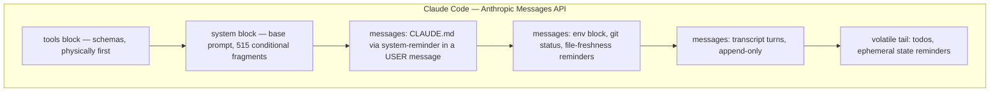
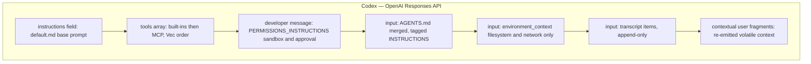

> [!info] Context
> Part of [[Harness-Internals-Overview|Harness Engineering Internals]], Level 2 wave. Parent chapters: [[Harness-Internals-Context-Compilation]], [[Harness-Internals-Claude-Code-Architecture]], [[Harness-Internals-Codex-Architecture]]. Where the parent taught *why* layout is a cache contract, this chapter dissects the *exact physical byte layout* three production harnesses ship and the *exact billing arithmetic* their two different caching mechanisms produce.

# Prompt Assembly and Cache Economics: How Harnesses Physically Lay Out a Request and Pay For It

## 1. Executive Overview

[[Harness-Internals-Context-Compilation]] established the discipline: a request is a compiled artifact, the KV cache turns byte layout into a binary contract, and the optimal shape is *stable prefix, append-only body, volatile tail*. That chapter proved the constraint. This chapter opens the machine and reads the assembled instruction stream slot by slot — where the tool schemas physically sit, where the base system prompt ends and the user-authored instruction files begin, which bytes are cached and which are re-billed — for the two harnesses whose innards are most exposed (Claude Code on the Anthropic Messages API, Codex on the OpenAI Responses API) plus the one whose caching posture is on the public record from staff (Cursor).

The reframing claim, for the reader who thinks "stable prefix, append-only tail" is the whole story: **the two dominant harnesses reach the same physical layout through two mechanically opposite caching APIs, and the difference is not cosmetic — it changes what a harness engineer must do, what can silently break, and what the failure looks like on the bill.** Anthropic sells *explicit control*: you place up to four `cache_control` breakpoints and pay a 25% write premium at each, redeemed at a 90% read discount. OpenAI sells *zero-config automatic caching* keyed on a stable identifier that, in Codex, defaults to the conversation's `thread_id` — no breakpoints exist to place, and the lever you pull is a routing key, not a cache marker. Same KV-reuse physics underneath, two entirely different engineering surfaces on top. Get the two confused — treat Codex like it has breakpoints, or treat Claude Code like caching is automatic — and you will design the wrong invalidation guard and misread the wrong metric. The chapter's spine is that contrast, worked to the dollar.

## 2. Historical Evolution

The parent chapter traced the arc from prompt engineering to RAG to agent loops to the 2024 arrival of prompt-cache pricing. Pick up the thread there and follow it into *how the request is physically structured*, because that is where the two vendors diverged.

The first agent harnesses (2023, Chat Completions era) assembled a `messages[]` array by string-templating: a system message, then alternating user/assistant turns. Caching did not exist as a billed feature, so nobody cared about byte stability. The layout was whatever the templating library produced — often with a timestamp in the system prompt "for context," which nobody yet knew was a cache poison because there was no cache to poison.

**August 2024 — Anthropic ships explicit prompt caching.** `cache_control` breakpoints, a defined invalidation hierarchy (`tools` → `system` → `messages`), a 5-minute TTL, and a pricing pair: 1.25× to write a cache entry, 0.1× to read one. This was the first time a harness author had a *knob*. It also imposed a discipline: because breakpoints cache a prefix, the harness had to guarantee the prefix was byte-stable, which retroactively made "no timestamp in the system prompt" a hard rule rather than a style preference.

**Late 2024 — OpenAI ships automatic prefix caching.** No knobs. Any prompt over 1,024 tokens is eligible; the server hashes a prefix and reuses the longest match in 128-token increments; discounts range 50%–90% by model. The philosophy is the mirror image of Anthropic's: the vendor infers the cacheable prefix instead of the developer declaring it. To give developers *some* control over the one thing automatic caching can't infer — which server holds your warm cache — OpenAI added `prompt_cache_key`, a routing hint.

**2025 — the Responses API and the harness rewrites.** OpenAI moved agentic products onto the Responses API, reporting (documented) that it gave "materially better cache utilization" for agent workflows than Chat Completions. Codex CLI is built on it. Around the same window, Claude Code (Anthropic's own harness) matured its assembly into a heavily conditional system-prompt compiler — the Piebald teardown of client v2.1.199 (July 2026) counted 515 distinct conditional fragments assembling the system block. Cursor, building an IDE rather than a CLI, faced the hardest version of the problem — prompt content that changes as the user moves the cursor and edits files — and Cursor staff have stated on the record that prompt caching is central to how they keep the agent affordable.

The milestone that matters for this chapter: by 2026 three independent teams (Anthropic, OpenAI, Cursor) had converged on the *same physical layout* while sitting on top of *two different caching mechanisms*. Section 8 explains why the layout converged; Sections 5–7 dissect what each actually ships.

## 3. First-Principles Explanation

Recap the one fact the whole chapter rests on, then go past where the parent stopped. During prefill, a transformer computes a key and value tensor for every input token, and by causal attention those tensors depend only on tokens at or before that position. So a token prefix's KV tensors are a pure function of the prefix bytes. Identical prefix bytes → identical tensors → the server can skip recompute and read them from a cache. The reuse condition is *exact prefix identity*: one changed byte at position p invalidates every cached tensor at position ≥ p. No partial credit.

The parent stopped there. Now ask the question this chapter exists to answer: **given that physics, what does the API actually let you say to the server, and how does the server decide what to reuse?** There are exactly two designs in production, and they answer a different question.

**Design A — explicit breakpoints (Anthropic).** The developer annotates specific positions in the request with `cache_control: {"type": "ephemeral"}`. The server treats each such position as a *cache write point*: it stores the KV state of the prefix up to that marker under a hash of that prefix's bytes. On the next request, the server walks the breakpoints and, for each, looks back through recently-written entries for a byte-identical prefix hash; a hit reads that prefix's tensors at 0.1× price. The mental frame: *you tell the server where the reusable boundaries are*, and you pay a small premium (1.25×) to establish each boundary because writing a cache entry costs the server storage and bookkeeping.

**Design B — automatic longest-prefix (OpenAI).** The developer annotates nothing. Above a 1,024-token floor, the server hashes the leading bytes of every request, routes it (using the first ~256 tokens, plus `prompt_cache_key` if supplied) to a server likely to hold a matching cache, and there reuses the longest byte-identical prefix in 128-token blocks. The mental frame: *the server infers the boundary*; your only levers are (a) keep the prefix byte-stable so the inference finds a long match, and (b) supply a stable routing key so the request lands where its warm cache lives.

The consequence for a harness author is sharp and is the thing most people get wrong. Under Design A you have a *placement problem*: where do the four breakpoints go, and is the write premium worth it at each? Under Design B you have a *stability-plus-routing problem*: is the prefix byte-identical, and does every request in a conversation carry the same routing key? These are different engineering tasks with different bugs. A Design-A bug is a mis-placed breakpoint (cache write you paid for but never read, or a gap that overflows the lookback window). A Design-B bug is a drifting prefix or a rotating routing key (traffic scatters across servers, each missing once). Confusing the two produces guards that defend against the wrong failure.

Now derive the agent-loop economics with numbers, because the parent gave the shape and the coordinator's third must-answer question demands the arithmetic (Section 11 completes it). An agent replays its whole history every turn. At turn n the request is roughly `prefix + history(1..n-1) + new`. If the prefix and history are cached, you pay full input price only on `new` (plus, on Anthropic, a one-time write premium on newly-cached spans). If the prefix mutates at turn n, *everything after the mutation point re-prefills at full price and, if you re-cache it, at the 1.25× write price*. The cost of a single careless byte is therefore not "a bit more" — it is the difference between paying for `new` tokens and paying for the entire history, every turn until the session ends or the prefix stabilizes again.

## 4. Mental Models

**The request is a document with a frozen masthead.** Picture a newspaper printed fresh every turn. The masthead — title block, section headers, standing legal boilerplate — is identical in every edition; the newsroom keeps a printing plate for it and reuses the plate (the cache). The news body is set fresh each edition and appended. If someone changes one letter in the masthead, the plate is scrapped and re-cut. The whole art of harness assembly is deciding what belongs on the plate (tools, base system prompt) versus in the body (turns, tool results) versus in a hand-stamped corner that changes every edition and was never on the plate anyway (the volatile tail: todos, timestamps, ephemeral warnings).

**Two vendors, two ways to run the print shop.** Anthropic's shop makes you point at the exact lines where a plate boundary should be (breakpoints) and charges a setup fee per plate. OpenAI's shop looks at your edition, notices how much of the front matches yesterday's plate, and reuses it automatically — but you have to hand your edition to the *same* print shop each day (routing key) or the new shop has no plate for you.

**`prompt_cache_key` is a return address, not a cache tag.** The single most common misconception about Codex's caching is that `prompt_cache_key` names the cache entry. It does not. It biases *routing* — which physical server your request lands on — so that requests sharing a prefix land where that prefix is already warm. In Codex the default value of this return address is the conversation's `thread_id` (verified in source at `client.rs:453`): every turn of one conversation carries the same return address, so every turn routes to the same warm server. This is why Codex needs no breakpoints: append-only assembly gives it a byte-stable growing prefix for free, and the stable `thread_id` routing key keeps that prefix on one server across the whole session.

**Instruction files are body content wearing a system-prompt costume.** The instinctive model is that `CLAUDE.md` / `AGENTS.md` are "your part of the system prompt." Mechanically false, and the falseness is load-bearing (Section 5). Both harnesses inject these user-authored files as *messages in the conversation array*, wrapped in tags, not into the true `system`/`instructions` field. Understanding why requires seeing that the system field is the most cache-sensitive real estate in the request and the most compliance-critical, and vendors keep user-editable content out of both.

## 5. Internal Architecture

Here is the slot-by-slot layout each harness actually assembles. This is the heart of the chapter; the parent gave a generic three-band diagram, this gives the real slots for two named products.





Component responsibilities, Claude Code (Anthropic Messages API):

**The `tools` block sits physically first.** Anthropic's own caching docs define the invalidation order `tools` → `system` → `messages`, and tools are first because they are the most stable content in the entire request — schemas don't change within a session unless an MCP server (re)connects. This is why "all MCP servers must connect before the session starts" is a hard rule: an MCP reconnection mid-session mutates the tools block at the very front and invalidates *everything*.

**The `system` block is a conditional compiler, not a string.** The Piebald teardown of v2.1.199 (inference — reverse-engineering of the minified client, corroborated across independent teardowns but not vendor-published) found the base prompt assembled from 515 conditional fragments — feature flags, model-specific instructions, tool-availability guards. The critical design fact: it is deterministic given the session config, so it renders byte-identical every turn, which is what lets it be cached at all.

**`CLAUDE.md` is injected as a `<system-reminder>` inside a *user* message — not the system block.** This is verifiable in live Claude Code request traces and is corroborated by this very session's context (the CLAUDE.md content arrives wrapped in `<system-reminder>` tags in a user turn). Why not the system block? Two reasons. First, cache safety: user-editable files change often, and putting them in the system block would place volatile content in the second-most-cache-critical region. Placing them in an early user message keeps them in the append-only body where they're still cached but their edits invalidate less. Second, and per Anthropic's own model behavior, `<system-reminder>`-wrapped content yields *probabilistic* compliance, not the deterministic authority of the true system prompt — the VILA-Lab framing is that reminders nudge rather than command. The harness deliberately does not grant user files system-level authority.

**The env/git/freshness reminders and transcript** follow in the messages array, append-only, exactly as the parent described. The **volatile tail** (todo recitation, ephemeral warnings) is placed last, after all cached content.

Component responsibilities, Codex (OpenAI Responses API):

**The `instructions` field carries the base prompt.** Codex sets the Responses API `instructions` field to the contents of `default.md` (or, for `codex-*` models, `PERSONALITY_HEADER + placeholder + BASE`). This is the analog of Claude Code's system block.

**The `tools` array is built-ins first, then MCP, in `Vec` order.** Deterministic ordering is the whole point — a stable serialization order keeps the prefix byte-identical across turns.

**Sandbox and approval policy live in a *separate developer message* (`PERMISSIONS_INSTRUCTIONS`), NOT in `environment_context`.** This corrects a widely-cited secondary source (Section 13). The current source ships approval/sandbox guidance as its own developer-role fragment; only machine-readable `<filesystem>` and `<network>` descriptors sit inside `<environment_context>`.

**`AGENTS.md` is merged hierarchically and injected as a tagged user/input message** (`# AGENTS.md instructions … <INSTRUCTIONS>`), with a 32 KiB cap, a `--- project-doc ---` separator, and root→cwd precedence (closest file wins, `AGENTS.override.md` outranks `AGENTS.md` per level). Like `CLAUDE.md`, it is body content, not the `instructions` field — same cache-safety and authority logic.

The convergence is now visible slot for slot: both put the most-stable machine content (tools/base prompt) at the front, both push user-authored instruction files into the conversation body, both end with a volatile tail, and both keep everything through the first user turn frozen for the session.

## 6. Step-by-Step Execution

Walk one turn on each harness so the caching mechanics are concrete. Take mid-session turn 14, ~100K tokens of stable prefix + history, a 40KB tool result just returned.

**Claude Code (Anthropic), turn 14:**

1. *Ingestion.* The tool-result packer truncates the 40KB result on structural boundaries and, if oversized, offloads to disk with a pointer (parent chapter mechanics).
2. *Assembly.* The compiler emits `tools` (byte-identical to turn 13), `system` (byte-identical — the 515-fragment render is deterministic), then the messages array: the `<system-reminder>` CLAUDE.md (unchanged), env/git block, transcript turns 1–13 (append-only, byte-identical), the new tool-result block, then the volatile tail with the todo list rewritten (item 2 now checked).
3. *Breakpoint placement.* The harness sets `cache_control` markers — up to four, typically end of `tools`, end of `system`, and end of the previous transcript. (The specific "breakpoint right after the MCP/tool instructions" placement is **inference — attributed to karanprasad's client analysis, read from code, never wire-measured**.)
4. *Cache negotiation.* The server hashes each breakpoint's prefix, walks back up to 20 content blocks looking for byte-identical entries from prior turns, finds the turn-13 entries: ~100K tokens read at 0.1×, the newly-appended tool-result span written at 1.25×, the volatile tail billed as ordinary input. Prefill for the 100K cached tokens is skipped.
5. *Response.* The model streams the next tool call; it is appended verbatim (byte-exactness matters — next turn it must match). The 5-minute TTL on every hit cache entry is refreshed for free by the read.

**Codex (OpenAI), turn 14:**

1. *Ingestion.* Same idea — pack the tool result before appending.
2. *Assembly.* The compiler emits `instructions` (byte-identical), the `tools` Vec (byte-identical), the `PERMISSIONS_INSTRUCTIONS` developer message, the tagged `AGENTS.md` input, `<environment_context>`, transcript items 1–13 (append-only), the new tool-result item, then re-emitted contextual user fragments at the tail.
3. *Routing.* The request carries `prompt_cache_key = thread_id` (the session's stable id, from `client.rs:453`). No breakpoints are placed — there is no such API.
4. *Cache negotiation.* The server routes by the key + first-~256-token hash to the server that handled turn 13, finds the longest byte-identical prefix (the entire ~100K prefix + history, since assembly is append-only), reuses it in 128-token blocks, and prefills only the new item and tail. Discount applies automatically above the 1,024-token floor.
5. *Response.* The item stream (reasoning items, then message or function calls) is appended; `TokensUsed` is emitted with cache statistics (Codex exports `codex.cache.hit_rate` via OpenTelemetry — community analysis).

The two paths produce the same economic outcome — marginal cost ≈ new tokens — through mechanically different negotiations. That is the whole point.

## 7. Implementation

If you build a harness that must target *both* APIs (a real requirement for any multi-provider tool), the load-bearing abstraction is a `CacheStrategy` that hides the explicit/automatic split behind one interface, plus a compiler that guarantees byte-stability regardless of backend.

```python
class CacheStrategy(Protocol):
    def annotate(self, blocks: list[Block]) -> Request: ...
    def routing_hints(self, session_id: str) -> dict: ...

class AnthropicExplicit:
    def annotate(self, blocks):
        # place <=4 breakpoints at volatility boundaries:
        # end(tools), end(system), end(prev_transcript)
        pts = self.place_breakpoints(blocks)   # returns <=4 indices
        for i in pts:
            blocks[i].cache_control = {"type": "ephemeral"}  # 1.25x write, 0.1x read
        return Request(blocks)                  # no routing key concept
    def routing_hints(self, session_id): return {}

class OpenAIAutomatic:
    def annotate(self, blocks):
        return Request(blocks)                  # no breakpoints exist
    def routing_hints(self, session_id):
        return {"prompt_cache_key": session_id} # == thread_id: stable per session

class Compiler:
    def compile(self, state, strategy: CacheStrategy) -> Request:
        blocks = self.render(state)             # deterministic: sorted keys, stable order
        assert self.prefix_is_stable(blocks)    # ABI check vs last turn (minus tail)
        req = strategy.annotate(blocks)
        req.extra = strategy.routing_hints(state.session_id)
        return req
```

Design points that separate a correct implementation from a plausible-looking broken one:

- **The breakpoint abstraction must be a no-op on OpenAI, and the routing-key abstraction must be a no-op on Anthropic.** These are not symmetric features with a shared parameter; they are different mechanisms. A common bug is a "cache config" struct with a `cache_key` field that a developer *also* wires into some Anthropic path where it does nothing — producing a false belief that caching is "configured."
- **Determinism is a backend-independent invariant.** Sorted JSON keys, stable tool ordering, no `datetime.now()` in any stable slot. This is the same rule the parent gave; it matters identically on both APIs because both depend on exact prefix bytes.
- **Instruction-file injection is a body operation on both.** Render `CLAUDE.md`/`AGENTS.md` into an early conversation message wrapped in the harness's tag convention, never into `system`/`instructions`. Enforce the 32 KiB-style cap so a runaway file can't blow the budget or (worse) introduce nondeterministic content into the body.
- **Telemetry is the only way you'll ever see a cache regression**, because nothing errors. On Anthropic, log `cache_read_input_tokens` / total input per call. On OpenAI, log `cached_tokens` from the usage object and your session-level hit rate. Alert on regressions from a per-session baseline. This is doubly important because the *symptom* of the two backends' failures differs: Anthropic shows a breakpoint that never reads; OpenAI shows scattered near-misses as routing drifts.
- **Pre-warming differs by backend.** Anthropic supports an explicit `max_tokens: 0` warm-up call to establish a cache entry before fanning out parallel requests (a cache entry only becomes readable after the first response begins, so n cold parallel calls each pay the write). OpenAI has no explicit warm primitive; you warm by issuing one request and relying on the routing key to keep siblings on the same server, and you keep any single prefix under ~15 requests/minute to avoid overflow onto cold servers.

## 8. Design Decisions

**Why did two vendors converge on the same physical layout?** Because the KV cache's exact-prefix constraint admits essentially one optimal layout regardless of the API on top: put the least-volatile content first so the longest possible prefix stays byte-identical, and put the most-volatile content last so its churn invalidates the least. Both `cache_control` (explicit) and longest-prefix (automatic) reward exactly this. The layout is a property of the *physics*, not the API. This is the single most important thing to internalize: the convergence is not imitation, it is two teams independently solving the same optimization under the same constraint.

**Why explicit breakpoints (Anthropic) vs automatic (OpenAI)?** This is a genuine product-philosophy fork, not a right/wrong. Anthropic is selling *control to sophisticated builders*: you decide which spans are worth the 1.25× write premium, you get a deep 0.1× read discount, and you get power features (1-hour TTL at 2× write, `max_tokens: 0` pre-warm, 20-block lookback semantics you can reason about). The bet: harness authors who control their stack end-to-end will extract more value from a knob than from a default. OpenAI is selling *coverage to a heterogeneous developer base*: every prompt over 1,024 tokens benefits with zero integration work, at a shallower discount on most models. The bet: aggregate savings across millions of un-tuned integrations beats deep savings for the few who'd tune. For a harness you own (Claude Code, Codex, your own), the explicit model extracts more value; for a random app developer, automatic captures more that would otherwise be left on the table.

**Why keep user instruction files out of the system field?** Three converging reasons, each sufficient. *Cache*: user files change often; the system/instructions field is second only to tools in cache criticality, and volatility there is expensive. *Authority*: vendors reserve deterministic system-level compliance for their own safety-critical instructions and grant user content only the probabilistic authority of a reminder — a deliberate safety decision, not an accident. *Precedence and composition*: `AGENTS.md` is hierarchically merged (root→cwd, override files, closest-wins); expressing that composition as a body message with clear tags is cleaner than splicing it into a monolithic system string. All three point the same way, which is why both harnesses do the same thing.

**Why does Codex default the routing key to `thread_id` rather than something finer or coarser?** A coarser key (e.g., per-user) would route unrelated conversations to the same server and thrash its cache. A finer key (e.g., per-turn) would defeat the purpose entirely — each turn would route independently and lose the warm prefix (this is exactly the mistake the debunked third-party reimplementation makes; Section 13). `thread_id` is the natural unit: it is precisely the scope over which the prefix grows monotonically and stays byte-stable, so it is precisely the scope over which cache stickiness pays off. The design is not arbitrary; it is the unique key that matches the cache's lifetime.

**Breakpoint budget as a scarce resource (Anthropic-specific).** Four breakpoints, and each costs a write premium. The design question is placement, and the answer follows volatility boundaries: end of `tools`, end of `system`, and one or two in the transcript to catch the growing history. Spending a breakpoint inside the volatile tail is pure waste — you pay a write for content you'll change next turn and never read. This is a real optimization problem with a small search space, and it is *the* thing that has no analog on OpenAI.

## 9. Failure Modes

**Silent cache annihilation (both backends).** The classic timestamp/request-id/user-string interpolated near the front. On Anthropic it zeroes the read at every breakpoint downstream of the mutation; on OpenAI it shortens the longest-prefix match to before the mutation. Same root cause, two symptoms. Debug by diffing consecutive raw request bodies byte-by-byte — first divergence is the leak — and by watching the per-call cached-token ratio.

**Mis-placed breakpoint / never-read write (Anthropic-specific).** You set `cache_control` at a position that changes every turn (or inside the tail), paying 1.25× writes that are never read at 0.1×. Net: you pay *more* than not caching. Detect by checking that every breakpoint's span shows up as `cache_read_input_tokens` on the *following* turn; a write with no subsequent read is a bug.

**The 20-block lookback miss (Anthropic-specific).** Cache reads walk back at most 20 content blocks from each breakpoint. Append 30 small blocks between breakpoints and the prior entry falls outside the window — a miss despite byte-perfect prefix. Fix: place breakpoints so no inter-breakpoint gap exceeds 20 blocks, or coalesce small blocks.

**Routing-key drift / prefix scatter (OpenAI-specific).** The prefix is byte-stable but `prompt_cache_key` rotates (a proxy strips it, or the harness regenerates it per request instead of per session). Requests scatter across servers, each cold-missing once. The symptom is a *middling, jittery* hit rate rather than a clean 0% — the tell that distinguishes it from a prefix-drift bug. Fix: pin the key to the session (`thread_id`) and verify it survives every proxy hop.

**Rate-driven overflow (OpenAI-specific).** Exceed ~15 requests/minute against one prefix and traffic spills onto additional servers that each miss once. Common in parallel fan-out. Fix: warm one server, then throttle or batch siblings.

**MCP reconnection mid-session (both).** An MCP server drops and reconnects, re-serializing the tools block at the very front. On both backends this invalidates the entire cache for the rest of the session. This is the single most expensive avoidable failure because tools are position-zero content. Fix: connect all MCP servers before the first turn; treat a reconnection as a session-restart event and expect (and monitor) the full re-prefill.

**Instruction-file nondeterminism (both).** An `AGENTS.md`/`CLAUDE.md` that embeds a git-generated line count, a build timestamp, or CWD-dependent content changes the body prefix each turn. Because these files sit early in the body, the damage is large. Fix: lint instruction files for volatile content; the 32 KiB cap also bounds blast radius.

**Compaction cache reset (both).** Compaction replaces the transcript wholesale; the post-compaction context shares no prefix with the pre-compaction one, so the entire new context re-prefills at write prices. This is *expected*, not a bug — but firing compaction too eagerly pays this reset repeatedly. The parent chapter's 150–200K-even-on-1M-windows guidance is the mitigation.

## 10. Production Engineering

**Anthropic / Claude Code (mixed: docs verified, client internals inference).** Verified from official caching docs: `cache_control` with ≤4 breakpoints; `tools`→`system`→`messages` invalidation hierarchy; 5-minute TTL refreshed free on hit; 1-hour TTL at 2× write; 1.25× write / 0.1× read; per-model minimum cacheable sizes (roughly 512–4,096 tokens); 20-block lookback; `max_tokens: 0` pre-warm. Inference (client reverse-engineering, corroborated across teardowns, not vendor-published): the 515-fragment conditional system compiler; CLAUDE.md via `<system-reminder>` in a user message; breakpoint placement after tool/MCP instructions (attributed to karanprasad's read of the code — **never wire-measured**). See [[Harness-Internals-Claude-Code-Architecture]].

**OpenAI / Codex (mostly verified: open source).** Verified from source and docs: Responses API with `instructions` = `default.md`; tools Vec ordering; `PERMISSIONS_INSTRUCTIONS` as a separate developer message; `AGENTS.md` merge (32 KiB cap, `--- project-doc ---` separator, override/closest-wins precedence); `prompt_cache_key` defaulting to `thread_id` at `client.rs:453`; automatic caching ≥1,024 tokens in 128-token increments; `codex.cache.hit_rate` OpenTelemetry export (community analysis). The economic figures in Vaughan's write-up — ~90% savings on cached spans, 80–90% hit-rate targets, ~15 req/min overflow ceiling — are **inference consistent with the mechanism but not stated in first-party source**. See [[Harness-Internals-Codex-Architecture]] and [[Harness-Internals-Responses-API-Protocol]].

**Cursor (on-record staff statements, internal assembly unpublished).** Cursor staff have stated on the record that prompt caching is central to keeping the agent economically viable, and the leaked GPT-5 agent prompt shows the same late-injection pattern ("we may automatically attach … current state") that Claude Code and Codex use for volatile context. What is *not* public: Cursor's exact slot ordering and how it stabilizes a prefix when the user is actively editing files mid-turn (the hardest version of the problem — an IDE's context legitimately changes as the cursor moves). The reasonable inference is that Cursor freezes a per-conversation prefix and injects live editor state into the volatile tail, but the internal assembly is unpublished. `.mdc` rule files apply via frontmatter matching, analogous to `AGENTS.md`. See [[Harness-Internals-Cursor-AI-IDE-Architecture]].

**The convergence, restated for production intuition.** Three teams, two caching APIs, one layout. Where they *diverge* is exactly where the API forces a different engineering task: Anthropic shops instrument "is every breakpoint being read," OpenAI shops instrument "is the routing key sticky and the hit rate smooth," and both instrument "is the prefix byte-stable." A cost regression review at any of them starts at the same place — the per-call cached-token ratio — and then forks to the backend-specific second question.

## 11. Performance

Now the arithmetic the coordinator's third must-answer question demands: **the dollar and latency cost of a mid-session prefix mutation, under current published Anthropic pricing** (1.25× write, 0.1× read, 2× write for 1-hour TTL, 5-minute default TTL).

Set up a concrete session. Stable prefix + history at the mutation point = 100,000 tokens. Base input price = 1 unit/token (use "unit" so the ratios are exact; multiply by the model's per-token rate for dollars). The turn also adds 4,000 new tokens.

*Cached turn (no mutation), Anthropic:*
- 100,000 tokens read from cache at 0.1× = 10,000 units.
- 4,000 new tokens: if you cache them, 4,000 × 1.25 = 5,000 units (write); if not, 4,000 × 1 = 4,000 units.
- Total ≈ 14,000–15,000 units.

*Mutated turn (a timestamp changes at position ~0), Anthropic:*
- The entire 100,000-token prefix now misses. It re-prefills at full input price: 100,000 × 1 = 100,000 units.
- To restore caching you re-write it: 100,000 × 1.25 = 125,000 units on the turn you re-establish the cache (the write premium applies to the newly-cached span).
- Plus the 4,000 new tokens.
- Total on the mutation turn ≈ 125,000–129,000 units versus ~15,000 for a clean turn — roughly a **9× spike on that turn**, and if the mutation *recurs every turn* (a live timestamp), you never get the 0.1× read back at all and every turn costs ~104,000 units instead of ~15,000: a sustained **~7× cost multiplier** for the rest of the session. This is the "silent 7–10× bill" the parent chapter warned about, now with the arithmetic behind the number.

*Latency cost of the same mutation.* Cached prefixes skip prefill compute. The ankitbko controlled measurement (cited in the parent) put median time-to-first-token at 953 ms with stable prefixes vs 2,727 ms with perturbed ones — a **65% TTFT regression** from prefix instability alone, on top of the cost. For an interactive agent making dozens of calls per task, this is the difference between a responsive tool and a sluggish one, multiplied across every turn.

*The 1-hour-TTL trade.* Anthropic's 1-hour TTL costs 2× to write (vs 1.25× for 5-minute). Worth it only when reuse is likely *after* the 5-minute window but *within* the hour — e.g., a user who steps away mid-session. Break-even: the 2× write is recovered if the entry is read at least once at 0.1× before it would otherwise have expired and forced a full re-prefill. For a continuously active session, the free 5-minute refresh-on-hit makes the cheaper TTL correct; for bursty human-in-the-loop sessions, the 1-hour TTL avoids a cold re-prefill that would cost far more than the extra write premium.

*Codex/OpenAI side, for contrast.* No write premium exists, so a mutation's cost is purely the lost discount: the mismatched suffix re-prefills at full price with no 1.25× penalty to re-cache. The mutation is *cheaper to recover from* on OpenAI (no write premium) but *harder to prevent* because you can't pin the boundary with a breakpoint — you're relying entirely on byte-stability and routing stickiness. Different mechanism, same lesson: the prefix is sacred.

*What to monitor, quantitatively.* Per-call cached/total input ratio (target: rising toward 1.0 as sessions deepen); per-session hit rate (Anthropic: is every breakpoint read; OpenAI: is it smooth and high); TTFT distribution (a bimodal distribution is a cache-miss tell); compaction frequency (each one is a deliberate full re-prefill). A hit-rate regression is a layout bug; a tokens-per-task regression is a packing bug. GPU-side mechanics (paged KV blocks, prefix-tree sharing) live in [[Harness-Internals-Runtime-Optimization]].

## 12. Best Practices

Freeze the entire front matter at session start — tools, base prompt, MCP servers — and treat any mid-session change to it as a session restart with an expected full re-prefill. Inject `CLAUDE.md`/`AGENTS.md` as tagged body messages, never into `system`/`instructions`, and lint them for volatile content (timestamps, line counts, CWD strings) and cap their size. Keep the transcript append-only with deterministic serialization (sorted keys, stable tool order). Push everything per-turn to the volatile tail.

On Anthropic specifically: place your ≤4 breakpoints at volatility boundaries (end of tools, end of system, one or two in the transcript), verify each breakpoint's span is *read* on the following turn, keep inter-breakpoint gaps under 20 blocks, and pre-warm with `max_tokens: 0` before parallel fan-out. On OpenAI/Codex specifically: pin `prompt_cache_key` to the session/`thread_id` and verify it survives every proxy hop, keep single-prefix request rate under ~15/min, and rely on append-only assembly for the byte-stable prefix.

The anti-patterns are the mirror image: a timestamp or per-user string in any stable slot; a breakpoint inside the volatile tail (paying writes you never read); an MCP server allowed to reconnect mid-session; an `AGENTS.md` that embeds `git` output; a routing key regenerated per-request; caching a one-shot batch prompt that will never be reused (the 1.25× write is pure loss without a hit); and — the conceptual anti-pattern that spawns the rest — treating the two backends' caching as the same feature with a shared config knob.

## 13. Common Misconceptions

**"`prompt_cache_key` names or tags the cache entry."** It routes; it does not tag. It biases which server handles the request so a warm prefix is present. The entry is keyed by the prefix bytes, not by your key. Believing otherwise leads people to rotate the key thinking they're "namespacing" caches, when they're actually scattering their own traffic.

**"Codex hashes a fresh cache key per turn."** This is the debunked claim, and it is worth naming its origin: it comes from HKUDS/nanobot issue #2440, a *third-party reimplementation* of Codex, not upstream. Upstream Codex sets `prompt_cache_key = thread_id` (`client.rs:453`) — one stable key for the whole conversation. A per-turn key would defeat caching entirely by routing each turn independently. Cite the source, not the reimplementation.

**"Claude Code's system prompt is one big monolithic string."** Two teardowns disagreeing here is a *version artifact*, not a real conflict. The 2025 Sonnet-4-era teardowns saw a more monolithic prompt; the July-2026 v2.1.199 teardown counted 515 conditional fragments. Both are correct about their version. The prompt got more conditional over time.

**"Codex's sandbox/approval policy lives in `<environment_context>`."** Widely repeated (including in Daniel Vaughan's otherwise-excellent write-up) but out of date. Current source ships approval/sandbox guidance as a separate `PERMISSIONS_INSTRUCTIONS` developer message; only machine-readable `<filesystem>`/`<network>` descriptors sit in `<environment_context>`. The agent that verified this caught a code change post-dating the secondary source.

**"`CLAUDE.md`/`AGENTS.md` are part of the system prompt."** Mechanically false and the falseness matters: they are body messages with only probabilistic (reminder-level) authority, kept out of the true system field for cache-safety, authority-scoping, and composition reasons (Section 8).

**"Caching is automatic, so Codex needs no cache engineering."** Automatic caching still requires a byte-stable prefix and a sticky routing key. "Automatic" removes the breakpoint-placement task, not the stability discipline. A Codex integration with a drifting prefix caches nothing, silently.

## 14. Interview-Level Discussion

**Q1 (must-answer): Two harnesses reach the same physical layout on two different caching APIs. Describe both layouts precisely and explain why they converged.**
Claude Code (Anthropic Messages API): `tools` block first, then the `system` block (a 515-fragment conditional compile), then the messages array — CLAUDE.md via `<system-reminder>` in a user message, env/git/freshness reminders, append-only transcript — then a volatile tail of todos and ephemeral reminders. Codex (Responses API): `instructions` field = base prompt, `tools` Vec (built-ins then MCP), a `PERMISSIONS_INSTRUCTIONS` developer message, `AGENTS.md` as a tagged input message, `<environment_context>` (filesystem/network only), append-only transcript items, then re-emitted contextual fragments at the tail. They converged because the KV cache's exact-prefix constraint has one optimum — least-volatile first, most-volatile last — and both `cache_control` and automatic longest-prefix reward exactly that. The layout is dictated by the physics, not the API.

**Q2 (must-answer): Contrast the two caching mechanisms and say what engineering task each imposes.**
Anthropic: explicit `cache_control` breakpoints (≤4), 1.25× write / 0.1× read, 20-block lookback, tools→system→messages hierarchy. Task: *placement* — put breakpoints on volatility boundaries and make sure every write is later read. OpenAI/Codex: automatic caching above 1,024 tokens in 128-token blocks, discount by model, routed by first-~256-token hash plus `prompt_cache_key`. Task: *stability + routing* — keep the prefix byte-identical and pin the routing key to the session. The bugs differ accordingly: a never-read breakpoint vs a scattered routing key.

**Q3 (must-answer): Quantify the cost and latency of a single recurring prefix mutation on Anthropic.**
With a 100K-token prefix at 1 unit/token base: a clean cached turn costs ~14–15K units (100K read at 0.1× = 10K, plus new tokens). A recurring mutation at the front kills the read every turn, so each turn costs ~104K units — a sustained ~7× multiplier — and the one-time re-establishment turn spikes to ~125K units (~9×) from the 1.25× re-write. Latency: prefix instability regressed median TTFT 953 ms → 2,727 ms (~65%) in the ankitbko measurement. On OpenAI the recovery is cheaper (no write premium) but prevention is harder (no breakpoint to pin the boundary).

**Q4 (must-answer): Where do CLAUDE.md/AGENTS.md physically live, and why not in the system prompt?**
Both are injected as tagged messages in the conversation body (CLAUDE.md as `<system-reminder>` in a user turn; AGENTS.md as a `# AGENTS.md instructions … <INSTRUCTIONS>` input), not into `system`/`instructions`. Three reasons: cache-safety (user files change often and the system field is cache-critical), authority-scoping (vendors reserve deterministic system authority for their own safety instructions and give user content only probabilistic reminder-level authority), and composition (AGENTS.md's hierarchical merge is cleaner as a tagged body message than spliced into a monolithic system string).

**Q5 (must-answer): How is Codex's cache keyed, and is the "per-turn hash" claim correct?**
Keyed by prefix bytes; routed by `prompt_cache_key`, which defaults to the conversation `thread_id` (`client.rs:453`) — one stable key for the whole session. The per-turn-hash claim is wrong and comes from HKUDS/nanobot #2440, a third-party reimplementation, not upstream Codex. A per-turn key would route each turn independently and defeat caching. `thread_id` is the unique key matching the prefix's monotonic-growth lifetime.

**Q6 (must-answer): A Codex integration behind a corporate proxy shows a middling, jittery cache hit rate. Diagnose.**
Middling-and-jittery (not a clean 0%) is the routing-drift signature: the prefix is byte-stable but the proxy is stripping or the harness is rotating `prompt_cache_key`, so requests scatter across servers each missing once. Confirm by logging the key at the wire and checking it's constant per session and survives the proxy. Secondary suspect: request rate over ~15/min against one prefix overflowing onto cold servers. Contrast with a clean 0%, which would indicate prefix drift (a mutation near the front) rather than routing.

## 15. Advanced Topics

**Cache-editing / server-side restructuring.** Anthropic has signaled work on editing cached content server-side without a full re-prefill — restructuring the middle of a cached context while preserving the KV state around it. If shipped, it partially dissolves the append-only constraint: you could evict a stale tool result from the middle without paying the full downstream re-prefill. This is currently beta/inference territory; if it matures it changes the compaction calculus materially (compaction's whole cost is the cache reset).

**Prefix-tree sharing across sessions.** Both vendors' serving stacks can, in principle, share KV prefixes across *different* conversations that happen to share a leading span (the same base system prompt across all of a customer's sessions). How aggressively each does this — and whether a harness should deliberately maximize cross-session prefix overlap by standardizing base prompts — is an open production optimization. Belongs partly to [[Harness-Internals-Runtime-Optimization]].

**IDE-context stabilization (the Cursor problem).** The hardest unpublished problem: an editor's context legitimately changes as the user moves the cursor and edits files, yet the harness wants a byte-stable prefix. The design space — freeze a per-conversation snapshot and diff live state into the tail, vs re-snapshot at natural boundaries and eat periodic resets — is genuinely unsolved in public. This is the strongest candidate for its own Level 3 chapter.

**Routing-key economics as a scheduling problem.** `prompt_cache_key` turns cache locality into a load-balancing question: pack same-prefix requests onto one server for cache hits, but not so many that you hit the ~15/min overflow or a hot-shard bottleneck. This is a classic locality-vs-load tension and connects to [[Harness-Internals-Scheduling-And-Steering]].

**Learned breakpoint placement.** On Anthropic, breakpoint placement is currently heuristic (volatility boundaries). A harness could learn, from its own telemetry, where writes actually get read and place breakpoints to maximize realized read discount minus write premium — a small online-optimization problem with a directly measurable objective.

## 16. Glossary

- **Explicit cache breakpoint (`cache_control`)**: an Anthropic annotation marking a prefix position as a cache write point; ≤4 per request, 1.25× write / 0.1× read.
- **Automatic prefix caching**: OpenAI's zero-config reuse of the longest byte-identical prefix above a 1,024-token floor, in 128-token increments.
- **`prompt_cache_key`**: OpenAI routing hint that biases which server handles a request so a warm prefix is present; in Codex defaults to `thread_id` (`client.rs:453`).
- **`thread_id`**: Codex's conversation identifier; the natural scope over which the prefix grows monotonically and stays byte-stable, hence the default routing key.
- **`instructions` field**: the Responses API slot Codex fills with its base prompt (`default.md`); analog of Anthropic's `system` block.
- **`system` block**: Anthropic's system-prompt field; in Claude Code, a deterministic compile of ~515 conditional fragments (inference).
- **`<system-reminder>`**: the tag Claude Code wraps CLAUDE.md (and other injected context) in when placing it as a user-message body element; yields probabilistic, not deterministic, compliance.
- **`PERMISSIONS_INSTRUCTIONS`**: Codex's separate developer-role message carrying sandbox/approval guidance — distinct from `<environment_context>`.
- **`<environment_context>`**: Codex's machine-readable `<filesystem>`/`<network>` descriptor block; does *not* contain approval policy.
- **20-block lookback**: Anthropic's limit on how far back (in content blocks) a cache read searches from each breakpoint.
- **Write premium**: the 1.25× (5-min TTL) or 2× (1-hour TTL) surcharge to establish an Anthropic cache entry; recovered on the first read.
- **Routing drift**: OpenAI-specific failure where a rotating/stripped `prompt_cache_key` scatters requests across servers, producing a middling jittery hit rate.
- **Prefix scatter**: the traffic pattern resulting from routing drift or rate overflow, where a byte-stable prefix nonetheless misses because it isn't co-located.

## 17. References

- **Anthropic — Prompt caching documentation** (https://platform.claude.com/docs/en/build-with-claude/prompt-caching). The authoritative mechanics for the explicit model: breakpoints, TTLs, 1.25×/0.1× pricing, tools→system→messages hierarchy, 20-block lookback, `max_tokens: 0` pre-warm. Read first when implementing the Anthropic path; every dollar figure in Section 11 traces here.
- **OpenAI — Prompt Caching 201 cookbook** (https://developers.openai.com/cookbook/examples/prompt_caching_201). The automatic model's internals: 1,024-token floor, 128-token increments, first-~256-token routing hash, `prompt_cache_key` behavior and the 60%→87% hit-rate example, ~15 req/min overflow. Read alongside the Anthropic docs to feel the explicit-vs-automatic fork.
- **Daniel Vaughan — Prompt Caching in Codex CLI** (https://codex.danielvaughan.com/2026/04/21/codex-cli-prompt-caching-maximise-cache-hits-cost-reduction/). The best worked example of Codex's cache-ordered layout and cost math. Excellent but treat two things as dated/inference: the sandbox-in-`environment_context` claim (now a separate developer message) and the specific economic percentages (consistent with the mechanism, not first-party).
- **Daniel Vaughan — AGENTS.md advanced patterns** (https://codex.danielvaughan.com/2026/03/26/agents-md-advanced-patterns/). The hierarchy/override/closest-wins precedence rules for AGENTS.md merging. Read when reasoning about monorepo instruction chains.
- **AGENTS.md — OpenAI Codex docs** (https://developers.openai.com/codex/guides/agents-md). The official instruction-file spec; pair with the precedence analysis above.
- **Ankit Sinha — Prompt Engineering for KV-Cache** (https://ankitbko.github.io/blog/2025/08/prompt-engineering-kv-cache/). The controlled measurement behind Section 11's latency numbers: 953 ms vs 2,727 ms TTFT, 85.2% vs 0% hit rate, 71% cost delta. Read for the methodology and to internalize that the same workload runs at 0% or 85% depending purely on byte layout.
- **Manus — Context Engineering for AI Agents** (https://manus.im/blog/Context-Engineering-for-AI-Agents-Lessons-from-Building-Manus). The production war-story establishing KV-cache hit rate as the #1 metric and the append-only/deterministic-serialization discipline that both backends require. Read for why the stability rules are non-negotiable.
- **Piebald / community teardown of Claude Code v2.1.199** (system-prompt fragment analysis; see [[Harness-Internals-Claude-Code-Architecture]] references). Source of the 515-fragment conditional-compile figure. All specifics are inference from the minified client, corroborated across teardowns; treat as reverse-engineered, not vendor-published.
- **Codex source — `client.rs`** (github.com/openai/codex, `codex-rs/core/src/client.rs`). The primary artifact proving `prompt_cache_key` defaults to `thread_id` (~line 453) and the tools-Vec ordering. Read the source, not the reimplementations, for any Codex caching claim.
- **HKUDS/nanobot issue #2440** (github.com/HKUDS/nanobot). Cited here only as the origin of the debunked "per-turn cache key" claim — a third-party reimplementation, not upstream Codex. Read to see how a plausible-looking reimplementation diverges from the real design.
- **[[Harness-Internals-Context-Compilation]]** — the parent chapter. The general KV-cache contract, attention economics, packing/compaction/offloading. Read first; this chapter assumes its "stable prefix, append-only body, volatile tail" result and drills into the physical slots and billing arithmetic beneath it.

## 18. Subtopics for Further Deep Dive

### IDE Prompt Stabilization Under Live Editing
- **Slug**: IDE-Prompt-Stabilization
- **Why it deserves a deep dive**: Cursor/Windsurf face the hardest version of prefix stability — editor context legitimately changes as the user edits — and the public record is staff quotes plus a leaked prompt, with the internal assembly unpublished. The design space (freeze-and-diff-to-tail vs periodic re-snapshot) is genuinely unsolved in public.
- **Has enough depth for a full chapter**: yes
- **Key questions to answer**: How does an IDE harness snapshot editor state for a stable prefix while reflecting live edits? Where does live cursor/file state get injected? How often must it eat a cache reset, and what triggers one?

### Cross-Session KV Prefix Sharing
- **Slug**: Cross-Session-Prefix-Sharing
- **Why it deserves a deep dive**: Both vendors can share KV prefixes across different conversations that share a leading span (a standardized base prompt). How aggressively each serving stack does this, and whether harnesses should deliberately maximize cross-session overlap, is an unconsolidated production-optimization question sitting between this chapter and [[Harness-Internals-Runtime-Optimization]].
- **Has enough depth for a full chapter**: no (better as a section extension of Runtime-Optimization)
- **Key questions to answer**: Do vendors share prefixes across sessions/customers, and under what isolation guarantees? Should a harness standardize base prompts to maximize shared-prefix hits? What are the privacy/isolation limits?

### Routing-Key Scheduling and Cache Locality
- **Slug**: Cache-Locality-Scheduling
- **Why it deserves a deep dive**: `prompt_cache_key` turns cache locality into a load-balancing problem — pack same-prefix requests for hits, but respect the ~15/min overflow and hot-shard limits. This locality-vs-load tension is a real scheduling problem linking caching to [[Harness-Internals-Scheduling-And-Steering]].
- **Has enough depth for a full chapter**: no (fold into Scheduling-And-Steering)
- **Key questions to answer**: How should a harness batch/throttle same-prefix requests to maximize hit rate without overflow? How does the routing key interact with server-side load balancing? Where is the optimal operating point?

### Server-Side Cache Editing Primitives
- **Slug**: Cache-Editing-Primitives
- **Why it deserves a deep dive**: Emerging APIs that restructure cached content without full re-prefill would partially dissolve the append-only constraint and rewrite the compaction cost model — the single most consequential possible change to this chapter's economics.
- **Has enough depth for a full chapter**: yes (once the primitives are documented; currently beta/inference)
- **Key questions to answer**: What operations do cache-editing APIs permit, and at what price? How does mid-context eviction-without-reset change compaction design? Which invalidation guarantees survive an edit?
