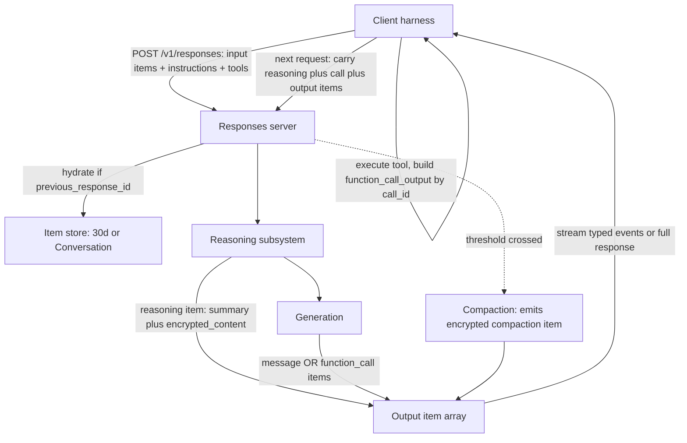

> [!info] Context
> Part of [[Harness-Internals-Overview|Harness Engineering Internals]], Level 2 wave. Parent chapter: [[Harness-Internals-Codex-Architecture]], which established that Codex is built directly on the Responses API. That chapter treated the API as a black box the loop calls. This chapter opens the box: what an "item" is, how turns compose from items, how encrypted reasoning survives across turns, and where the item model collides with zero-data-retention and compaction. It sits alongside [[Harness-Internals-Prompt-Assembly-Cache-Economics]] (which billed the two caching mechanisms to the dollar), [[Harness-Internals-Compaction-Pipelines]] (the general theory of lossy paging), and [[Harness-Internals-Tool-Calling-Internals]] (function-call representation).

# The Responses API as an Agent Protocol

**Epistemic note.** The Responses API is a proprietary hosted service; its server internals are not public. But an unusual amount is checkable, because three independent surfaces expose its wire behavior: OpenAI's own documentation and cookbooks **(documented)**; the open-source Codex CLI, whose Rust `ResponseItem` enum and compaction filters are readable and whose bug reports quote exact API errors **(source-verified / community analysis)**; and third-party reimplementations (vLLM, llama.cpp, LiteLLM, LangChain) that had to match the wire format and filed issues when they got it wrong **(community analysis)**. Throughout, claims are labeled: **(documented)** for official OpenAI statements, **(source-verified)** for things visible in the Codex repo or reproduced API errors, **(community analysis)** for third-party source reads I could not line-verify, and **(inference)** for reasoning from observed behavior. The API also moves fast — parameters and defaults quoted here are snapshots as of mid-2026.

## 1. Executive Overview

The Responses API is OpenAI's agent-oriented inference API, launched in March 2025 as the successor to both Chat Completions (for agentic use) and the Assistants API. On the surface it looks like a cleaned-up Chat Completions: you send input, you get output, you can call tools. That framing is the mistake this chapter exists to correct.

The reframing claim, for anyone who thinks the Responses API is "Chat Completions v2 with server-side history": **it is a different data model, not a different endpoint. Chat Completions models a conversation as a flat list of role-tagged messages; the Responses API models it as an ordered list of heterogeneous, typed *items* — messages, reasoning, function calls, function-call outputs, compaction blobs — where reasoning is a first-class citizen the model produces, the client carries, and (crucially) neither can fully read.** Everything downstream — the 40–80% cache-utilization gain OpenAI reports, the encrypted-reasoning mechanism that keeps zero-data-retention customers from losing chain-of-thought, the model-switch failures that crash sessions with `invalid_encrypted_content`, the compaction endpoint that hands the client an opaque blob — falls out of that one design decision. Codex is not merely *built on* the Responses API; Codex is the reference implementation of what an agent harness on top of the item model has to do.

Three threads run through the chapter. First, the **item model**: why OpenAI split the monolithic Chat Completions "message" into typed items, and what that buys an agent loop. Second, **encrypted reasoning items**: how a model's hidden chain-of-thought is carried across turns without the client or (optionally) OpenAI ever storing it — and how that collides with ZDR, model switching, and compaction. Third, **statefulness as a dial**: server-side storage (`store=true`, `previous_response_id`, the Conversations API) versus fully stateless replay, the surprising fact that stateful is *slower*, and why Codex — the flagship Responses API consumer — deliberately runs it stateless.

## 2. Historical Evolution

The Responses API is the third answer OpenAI shipped to the same question: how should a developer represent a multi-turn, tool-using conversation to a model?

**2020–2022 — Completions.** The original `/v1/completions` endpoint took a single text string and returned a completion. Conversation was the developer's problem: you concatenated turns into one prompt yourself. There was no notion of roles, tools, or state.

**March 2023 — Chat Completions.** `/v1/chat/completions` introduced the `messages[]` array: an ordered list of objects, each with a `role` (`system`, `user`, `assistant`) and `content`. This was the format the entire industry standardized on. Tool calling was bolted on later: an assistant message could carry a `tool_calls` field, and you replied with a message of `role: "tool"`. It is stateless by design — you own the history and resend it every request. Its defining property, which becomes the villain of this story, is that *many concerns are glued into one object*: a single assistant message might carry text content, tool calls, and (for reasoning models) some notion of thinking, all in one blob with optional fields **(documented — the migration guide's own framing)**.

**November 2023 — the Assistants API.** OpenAI's first attempt at server-side state. It introduced heavy, persistent server objects: an **Assistant** (model + instructions + tools bundled together), a **Thread** (stored conversation), a **Run** (an execution of an Assistant against a Thread, asynchronous, requiring polling or webhooks), and **Run Steps** (the sub-events of a run). It was widely disliked for two reasons: the polling-based async model was awkward, and its pricing was brutal — every message reprocessed the entire thread including full uploaded file text, with no developer control over the context window **(documented — multiple migration writeups).**

**Why both became insufficient at once.** Two forces converged in 2024–2025. First, **reasoning models** (o1, o3, o4-mini and successors) produce an internal chain-of-thought that materially improves answers — but OpenAI, unlike Anthropic or DeepSeek, *does not expose the raw chain-of-thought* to clients. In Chat Completions' flat message model there is nowhere clean to put "reasoning the model did that the client must carry back but must not read." Second, **agentic workflows** replay the whole history every turn, so caching became the dominant cost lever (see [[Harness-Internals-Prompt-Assembly-Cache-Economics]]), and the flat message array — where tool results are just more messages — made it hard for the server to reason about what was stably cacheable.

**March 2025 — the Responses API.** OpenAI's answer was to stop gluing concerns together. The unit of conversation became the **item**, a typed object. A message is one item type; a reasoning trace is another; a function call is another; its output is another. The Assistants primitives map onto the new world cleanly: **Assistants become Prompts, Threads become Conversations, Runs become Responses, and Run Steps become Items** **(documented — the Assistants migration guide).** OpenAI announced the Assistants API would sunset **August 26, 2026**, once Responses reached feature parity **(documented — deprecations page).**

**2025–2026 — the harness rewrites adopt it.** OpenAI moved its own agentic products onto the Responses API and reported it gave "materially better cache utilization" for agent workflows **(documented).** Codex CLI migrated from Chat Completions to the Responses API in **v0.113.0 (early March 2026)** **(community analysis — Codex knowledge base, pinned to a release).** By 2026 OpenAI had layered further primitives directly onto the item model: **server-side compaction** (`POST /v1/responses/compact`, and inline `context_management` with a `compact_threshold`) turned context management into an API feature returning a typed compaction item **(documented).** The trajectory is unmistakable: the item model is becoming the substrate for OpenAI's entire agent stack, and features that used to live in the harness (summarization, state) are migrating into the protocol.

## 3. First-Principles Explanation

Start from the irreducible problem. A model turn is a function: `input tokens → output tokens`. To hold a conversation, you feed the model everything relevant and it emits the next contribution. The only question a conversation API answers is: **what is the shape of "everything relevant," and who is responsible for assembling it?**

Chat Completions answers: the shape is a flat list of `{role, content}` messages, and *you* assemble it every time. This is clean when a turn is "user says X, assistant says Y." It gets muddy the moment a turn contains internal structure. Consider one agentic turn where the model thinks, calls a tool, sees the result, thinks again, and answers. In the message model you must flatten that into: an assistant message with `tool_calls`, then a `tool` message with the result, then another assistant message. The "thinking" has no home — in Chat Completions with reasoning models, it is discarded, or stuffed awkwardly into a field. And the server, receiving your flattened array next turn, cannot cheaply tell which parts are stable.

The Responses API answers differently: **the shape is an ordered list of typed items, and the item is the atom.** An item has a `type` that determines its schema. The core types **(documented / source-verified from Codex's `ResponseItem` enum):**

- **`message`** — a unit of conversation with a `role` (`user`, `assistant`, `system`, or `developer`) and `content` (which is itself an array of typed content parts: `input_text`, `input_image`, `output_text`, etc.). This is the closest analog to a Chat Completions message, but it carries *only* conversational content — nothing else is glued on.
- **`reasoning`** — a model-produced item holding the chain-of-thought for a step, with fields for a human-readable `summary` array, optional `content`, and (critically) `encrypted_content`. The raw reasoning is not exposed; what you get is a summary plus an opaque encrypted blob.
- **`function_call`** — the model's request to run a tool, with a `name`, a JSON-string `arguments`, and a `call_id` that uniquely identifies this invocation.
- **`function_call_output`** — the result you feed back, linked to its call by matching `call_id`, carrying the tool's `output`.
- **`compaction`** — (2026 addition) an opaque item carrying compressed prior state; discussed in Sections 7 and 9.

The design consequence is immediate and is the whole point. Because concerns are *separated into distinct items*, three things become possible that the message model made hard:

**1. Reasoning can be carried without being read.** A `reasoning` item is a distinct object the client stores and replays, but whose substance (`encrypted_content`) is opaque to the client. You cannot do this cleanly with a flat message whose `content` is a string you own — you'd have to either expose the reasoning (which OpenAI refuses) or hide it inside the message and hope. Sean Goedecke's argument is blunt and correct: the Responses API "exists primarily to work around" the fact that OpenAI conceals reasoning traces while competitors return them verbatim; the stateful/item design lets OpenAI "maintain the chain-of-thought in their backend, plug it in to the conversation for you, and then strip it out before sending it back down to the client" **(community analysis — seangoedecke.com).**

**2. The server can reason about item identity for caching.** Items have IDs and stable boundaries. A stable prefix of items produces a stable KV-cache prefix (see [[Harness-Internals-Prompt-Assembly-Cache-Economics]]); OpenAI reports switching agentic workflows from Chat Completions to Responses **boosted cache utilization from 40% to 80%** **(documented — the reasoning-items cookbook).** The item model is what lets the server treat "the reasoning and tool calls from earlier in this turn" as a coherent, cacheable unit.

**3. State can be delegated to the server.** Since items are typed objects with IDs, the server can store them and let you reference a whole prior response by ID (`previous_response_id`) instead of resending it. This is the statefulness dial of Section 4.

Now the subtlety that trips up nearly everyone, and that you must get right. **Reasoning items live and die within a single user turn.** The documentation is explicit: across user turns, "input and output tokens from each step are carried over, while **reasoning tokens are discarded**" **(documented — reasoning guide).** But *within* a turn — across the function-call round trips of one user request — reasoning is load-bearing: you must "ensure all items between the last user message and your function call output are passed into the next response untouched" **(documented).** So the rule is: between the model asking to call a tool and you returning that tool's output, the reasoning that produced the call must ride along; once the user speaks again, prior reasoning is dropped. This is why the cookbook says reasoning items matter "if a turn includes a function call" — the function call creates an *intra-turn round trip* where reasoning continuity is needed. A community investigation on Hacker News surfaced exactly this confusion, with one commenter noting OpenAI's diagram says you *may* include reasoning 1+2+3 "for ease, but we will ignore them" across user turns **(community analysis — HN thread 46738798).** The terminology trap: "turn" in OpenAI's docs sometimes means *user* turn and sometimes means an *agent* step; reasoning persistence differs between the two.

## 4. Mental Models

**The transcript is a typed AST, not a chat log.** Stop picturing a list of speech bubbles. Picture an abstract syntax tree flattened to a list: each node is typed, and the *type* determines what the node means and what fields it carries. A `function_call` node and a `message` node are as different as an `IfStatement` and a `StringLiteral`. The harness's job is to keep this list well-formed — and, like an AST, it has structural invariants (a `function_call` must be followed by its `function_call_output`; a `message` from the assistant depends on the `reasoning` that produced it). Violate an invariant and the server rejects the whole thing (Section 9).

**Reasoning is a sealed envelope you must carry but cannot open.** When the model reasons, it hands you a sealed envelope (`encrypted_content`) plus a short note describing roughly what's inside (`summary`). You are the courier: you must carry the envelope back next round so the model can re-read its own thoughts, but you cannot open it, and — this is the killer — *a different model cannot open it either*, because the seal is keyed to the model that made it (Section 9's `invalid_encrypted_content`). The whole ZDR story is about who holds the key to the envelope, not who holds the envelope.

**Statefulness is a "who holds the ledger" choice, not a feature.** In [[Harness-Internals-Codex-Architecture]] we called the conversation an append-only ledger. The Responses API asks: does the ledger live on your disk or OpenAI's server? `store=true` + `previous_response_id` = OpenAI holds it, you pass a pointer. `store=false` + full replay = you hold it, you resend it. Same ledger, different custodian. The naive intuition is "server-side is faster because you send less" — and it is *wrong* (Section 10): the server's ledger lookup is a database hit that costs more than the bytes you saved.

**The API is absorbing the harness.** Watch the direction of travel. Summarization used to be something Claude Code and Codex implemented in application code. Now `POST /v1/responses/compact` does it server-side and returns a typed item. State used to be the harness's job; now the Conversations API holds it. The item model is a beachhead: once conversation is typed objects the server understands, OpenAI can keep pulling harness responsibilities down into the protocol. A harness engineer should read each new item type as "a job that just moved from my code into the wire."

## 5. Internal Architecture

Decompose the system into the pieces a harness engineer actually interacts with.

**The item store (conceptual).** When `store=true`, the server persists the items of each response under a response ID for 30 days **(documented).** The Conversations API persists items under a durable conversation object with *no* 30-day TTL **(documented).** With `store=false`, nothing is persisted; the client is the sole custodian.

**The request assembler.** Every call to `POST /v1/responses` takes an `input` (a string or an array of items), plus `instructions` (the top-level system prompt, replacing Chat Completions' system message), `tools`, and control parameters (`reasoning`, `include`, `store`, `previous_response_id`, `context_management`). The server materializes the *effective* item list: if `previous_response_id` is set, it hydrates the prior items from its store and prepends them; otherwise it uses exactly what you sent.

**The reasoning subsystem.** For reasoning models, the server runs the chain-of-thought, emits a `reasoning` item (summary + optionally `encrypted_content`), then the message or function calls. The `include: ["reasoning.encrypted_content"]` request flag controls whether the encrypted blob is returned to the client **(documented).**

**The compaction subsystem.** Either invoked explicitly (`POST /v1/responses/compact`) or inline via `context_management=[{"type":"compaction","compact_threshold": N}]`. When the rendered token count crosses the threshold, the server compacts server-side, emits a typed `compaction` item with `encrypted_content`, prunes context, and continues inference **(documented).**

**The streaming layer.** A response can stream as typed server-sent events (Section 6), or return whole. This is a different event model from Chat Completions' `delta` chunks — 53 distinct event types organized by item lifecycle **(documented — community-compiled from the streaming reference).**

The item lifecycle across a turn is the thing to internalize:



Notice what is *not* in this diagram that would be in a Chat Completions one: there is no single "message with everything attached." The output is an *array* of items, and the client's job between turns is to keep that array well-formed and carry the right subset forward.

## 6. Step-by-Step Execution

Walk one agentic turn with a reasoning model, streaming, on the item model. The user asks: "why is the auth test failing?" and the model must read a file (one tool call) before answering.

**Step 1 — Request.** The harness POSTs to `/v1/responses` with `input` = the prior conversation items plus a new `message` item `{type:"message", role:"user", content:[{type:"input_text", text:"why is the auth test failing?"}]}`, plus `instructions`, `tools` (including a `read_file` function schema), `reasoning:{effort:"medium"}`, and — because this is a stateless ZDR-style harness like Codex — `store:false` and `include:["reasoning.encrypted_content"]`.

**Step 2 — Server assembles and reasons.** The server takes the item array as-is (no hydration, since no `previous_response_id`), runs the model. The model produces internal chain-of-thought, decides it needs the file, and emits a `reasoning` item and a `function_call` item.

**Step 3 — Streaming events.** The client sees a precise event sequence **(documented — 53-event model):**

1. `response.created`, then `response.in_progress`.
2. `response.output_item.added` for the **reasoning** item.
3. `response.reasoning_summary_part.added` → several `response.reasoning_summary_text.delta` → `response.reasoning_summary_text.done` → `response.reasoning_summary_part.done`. (The client sees the *summary* stream, never the raw reasoning.)
4. `response.output_item.done` for the reasoning item — now carrying `encrypted_content`.
5. `response.output_item.added` for the **function_call** item.
6. several `response.function_call_arguments.delta` (the JSON arguments accreting token by token) → `response.function_call_arguments.done`.
7. `response.output_item.done` for the function_call.
8. `response.completed`, with `usage` (including `output_tokens_details.reasoning_tokens`).

Deltas must be reassembled in `sequence_number` order; the `.done` event for each piece carries the finalized string **(documented).**

**Step 4 — Client executes the tool.** The harness parses the function_call: `name="read_file"`, `arguments='{"path":"tests/auth_test.py"}'`, `call_id="fc_abc"`. It runs the read (through its ToolRouter and sandbox — see [[Harness-Internals-Codex-Architecture]]), producing file contents.

**Step 5 — Build the output item.** The harness constructs `{type:"function_call_output", call_id:"fc_abc", output:"<file contents>"}`. The `call_id` is the join key linking output to call.

**Step 6 — The intra-turn round trip.** Here is where the item model earns its keep. The harness POSTs again, and its `input` must contain, *in order and untouched*: the reasoning item (with its `encrypted_content`), the function_call item, and the new function_call_output item. The documentation is explicit that "all items between the last user message and your function call output" must be "passed into the next response untouched" **(documented).** If the harness drops the reasoning item, a reasoning model loses the thread of *why* it called the tool, and (Section 9) may error outright.

**Step 7 — Server re-reads its own reasoning.** For a `store:false` request with encrypted content, the server decrypts the `encrypted_content` **in memory, uses it to generate the next step, then discards it — never written to disk** **(documented).** The model now "remembers" its reasoning from Step 2 without OpenAI having persisted anything.

**Step 8 — Final answer.** The model reasons again (new reasoning item), decides it has enough, and emits an assistant `message` item explaining the auth failure. Events stream as before but end with `output_item.added`/`.done` for a message, and `output_text.delta` events for the visible answer.

**Step 9 — Turn ends; reasoning is dropped.** The harness appends the assistant message to its transcript. When the *user* speaks next, the reasoning items from this turn are no longer needed and can be dropped — the model will not reuse them across the user-turn boundary **(documented).** This is why long agent sessions don't accumulate unbounded reasoning tokens: they are intra-turn scaffolding, discarded at the turn seam.

Contrast this with Chat Completions doing the same work: you'd flatten steps 2–8 into `assistant(tool_calls)` → `tool(result)` → `assistant(text)`, with no place for reasoning and no `call_id`-typed output item — just a `tool` role message. The item model makes the intermediate structure explicit and, therefore, cacheable and reasoning-preserving.

## 7. Implementation

If you were building a harness on the Responses API — which is exactly what Codex does — the core is an item-list manager plus a well-formedness enforcer. Sketch it:

```python
# Pseudo-code for a stateless (store=false) item-model agent turn.
def run_turn(history_items, user_msg, tools, instructions):
    history_items.append(make_message("user", user_msg))
    while True:
        resp = responses.create(
            model="gpt-5.x",
            instructions=instructions,
            input=history_items,           # full replay; no previous_response_id
            tools=tools,
            reasoning={"effort": "medium"},
            store=False,                   # stateless
            include=["reasoning.encrypted_content"],  # carry sealed reasoning
        )
        # Append EVERY output item, in order, untouched — this is the invariant.
        history_items.extend(resp.output)   # reasoning, function_call(s), message

        calls = [it for it in resp.output if it.type == "function_call"]
        if not calls:
            return resp                      # assistant message = turn done
        for call in calls:
            result = TOOL_ROUTER.dispatch(call.name, json.loads(call.arguments))
            history_items.append(make_fc_output(call.call_id, result))
```

Three implementation points that are non-obvious and that the parent chapter only gestured at:

**Codex runs it stateless, on purpose.** OpenAI's own guidance recommends `store=true` + `previous_response_id` for best performance. Codex does the opposite: since roughly PR #1641 it **stopped using `previous_response_id` and replays full history each turn** **(source-verified — issue #4047, closed as bug then re-litigated).** For the Codex reasoning models specifically (`gpt-5.x-codex`), **`store` is enforced to `false` regardless of what you pass, and `include:["reasoning.encrypted_content"]` is forced on** **(community analysis — Blackbox AI's proxy docs describing OpenAI's Codex model behavior; consistent with Codex's ZDR posture).** Why give up the server-side convenience? Three reasons: (1) ZDR — many Codex enterprise deployments require zero data retention, so server-side storage is off the table; (2) latency — stateful is measurably *slower* (Section 10); (3) control — the harness owns its transcript, can inspect and compact it, and never depends on OpenAI's item store being resolvable.

**The encrypted reasoning blob is the price of stateless.** Because Codex replays full history with `store=false`, it cannot rely on the server remembering reasoning. So it carries `encrypted_content` on every `reasoning` item forward. Codex persists these in its on-disk rollout JSONL: one investigated rollout file held **554 top-level `response_item` rows of `type:"reasoning"` with an `encrypted_content` field** **(source-verified — issue #25290's file forensics).** The harness stores sealed envelopes it cannot read, purely to hand back to the model.

**Compaction returns an item, not a string.** When Codex crosses its auto-compact threshold, on OpenAI-hosted models it calls `POST /v1/responses/compact` (non-streaming), sending model name, full input history, and base instructions; the server returns compacted `ResponseItem` objects including a **`type=compaction` item with `encrypted_content`** **(community analysis — sam-saffron gist; danielvaughan; tonylee).** Codex's remote-compaction filter (`compact_remote.rs` / `process_compacted_history`) then keeps assistant and real user messages plus the `Compaction` encrypted item, and drops developer messages and non-user-content user messages **(source-verified — Codex source, quoted in issue #20774 and the gist).** For non-OpenAI providers, Codex falls back to *inline* summarization: it appends a summarization prompt as a user message and stores the returned summary as a **user-role message** with a prefix "Another language model started to solve this problem and produced a summary of its thinking process" **(source-verified — the gist quotes the exact prompt).** So the same harness has two compaction paths — an encrypted server-side one for OpenAI, a plaintext client-side one for everyone else — and they produce *different* item shapes.

Codex's actual `ResponseItem` enum (Rust) enumerates the item types the harness must handle: `Message { id, role, content, phase }`, `Reasoning { id, summary, content, encrypted_content }`, `FunctionCall { call_id, name, arguments, id }`, `FunctionCallOutput { call_id, output }`, and `Compaction { encrypted_content }`, plus tool-specific variants (local shell, MCP tool calls, custom tools) **(source-verified — enum fields quoted across issues #17541, #20774, #25290).** Note the `phase` field on messages: newer Codex models (`gpt-5.3-codex`+) require the `phase` field on assistant messages to be preserved and resent, and dropping it "can degrade performance" **(documented — the compact API reference).**

## 8. Design Decisions

**Why typed items instead of a richer message?** OpenAI could have kept the flat message array and added optional fields (a `reasoning` field, a better `tool_calls`). They split into items instead. The reason is *separation of invalidation and identity*. When reasoning, tool calls, and content are separate items with separate IDs and boundaries, the server can cache, hydrate, prune, and compact them independently. Glued into one message, any change to any field invalidates the whole object. The 40→80% cache utilization jump is the measurable payoff of that separation **(documented).** The cost is client complexity: harnesses now manage a heterogeneous list with well-formedness invariants, and third-party tools (LangChain, vLLM, llama.cpp, LiteLLM) repeatedly shipped bugs mis-handling the item stream (Section 9). OpenAI traded developer simplicity for server-side optimizability — a defensible trade for OpenAI, a real tax on everyone building on top.

**Why hide reasoning behind an encrypted blob?** Anthropic returns thinking as inspectable `thinking` content blocks; DeepSeek and Qwen return chain-of-thought verbatim. OpenAI encrypts it. The business reason is competitive: raw chain-of-thought is training-signal-rich and safety-sensitive, and OpenAI chose not to expose it. The *engineering* consequence, forced by that choice, is the entire encrypted-reasoning apparatus. The elegant part: it lets a stateless/ZDR client keep reasoning benefits without OpenAI storing anything — you carry the sealed envelope, OpenAI holds only the key. The ugly part: the seal is model-specific, so the blob is a landmine on model switch (Section 9), and it makes the transcript *partially unreadable to its own harness*, which breaks debuggability. This is the design tension flagged in [[Harness-Internals-Codex-Architecture]]: "the conversation is becoming partially unreadable to its own runtime, by design."

**Why offer server-side state at all if the flagship runs stateless?** Because most developers are not Codex. For a typical chatbot, `store=true` + `previous_response_id` genuinely simplifies code — you pass a pointer, not a growing array — and the latency penalty is invisible against a single-turn interaction. OpenAI is optimizing for the median developer with the stateful path and for the power harness with the stateless path. The mistake is assuming the stateful path is strictly better; it is a convenience/latency/compliance trade, and the most sophisticated consumer (Codex) took the other branch.

**Why put compaction in the API?** Because compaction is the one operation where being *server-side* unlocks something the client can't do: the server can compress into *latent* representations (encrypted state, tool-call restoration data, structured metadata) rather than a lossy text summary. A client-side summarizer can only produce text; the server can produce an opaque blob "that preserves the model's latent understanding of the original conversation" **(community analysis — tonylee, danielvaughan).** The cost is total loss of inspectability and the ZDR/model-switch coupling. Contrast Claude Code, which keeps compaction textual and inspectable and lets the user steer it (`/compact focus on the API changes`) — a deliberately different bet, dissected in [[Harness-Internals-Compaction-Pipelines]].

**Why `call_id` on tool items instead of positional pairing?** In Chat Completions, tool results are just the next `tool` message — positional. The Responses API makes the join explicit via `call_id`, because with **parallel tool calls** (multiple `function_call` items in one response) positional pairing is ambiguous. Explicit IDs let outputs return in any order and let the server enforce pairing invariants (Section 9).

## 9. Failure Modes

The item model's well-formedness invariants are strict, and violating them fails loudly — which is good, except the failures are non-obvious and cluster at exactly the operations harnesses must perform (compaction, model switching, replay).

**`invalid_encrypted_content` on model switch.** The defining failure. `encrypted_content` on `Reasoning` and `Compaction` items is **provider- and model-specific** — designed so the *same* model can recall its reasoning without recomputing, but decryptable by no other model **(source-verified — issue #17541).** Switch models mid-conversation and the API returns HTTP 400: *"The encrypted content gAAA…S6Q= could not be verified. Reason: Encrypted content could not be decrypted or parsed."* Codex's mid-session model switch crashes on exactly this. The fix pattern, mirroring how Codex already strips images when moving to a text-only model, is to **filter `encrypted_content` out on model switch** (keeping the `summary`), or start a new thread **(source-verified — issue #17541).** Generalizable lesson: any state keyed to a specific model is a hidden coupling that surfaces the instant you route across models — a real hazard for multi-model harnesses and gateways.

**The item-pairing invariant (orphaned assistant messages).** With `store=true`, the server enforces that a server-assigned assistant `message` item depends on its preceding server-assigned `reasoning` item. Codex's `compact_remote.rs` filter kept assistant messages but dropped reasoning items, producing an orphaned `Message(assistant)`. Replaying it against `/v1/responses` with `store=true` returns HTTP 400: *"Item 'msg_…' of type 'message' was provided without its required 'reasoning' item: 'rs_…'."* **(source-verified — issue #20774).** The bug hid from most users because Codex only sets `store=true` on Azure-hosted endpoints; with `store=false` the same orphan replays fine. The invariant: **if you keep an assistant message, keep its reasoning predecessor — or drop both.** This is the AST well-formedness rule from Section 4 made concrete.

**Undecryptable persisted blobs on resume.** Because Codex persists `encrypted_content` to disk (the 554-row rollout file), resuming an old session can send the server encrypted reasoning/compaction blobs the current client/server can no longer decrypt or parse — and Codex historically failed the *whole* continuation request rather than degrading gracefully **(source-verified — issue #25290, which also found 4 nested encrypted compaction records and 28 malformed JSONL rows in one file).** The lesson for durable agent state (see [[Harness-Internals-Durable-Execution]]): opaque, key-dependent blobs are fragile at rest; a robust harness must tolerate un-decryptable history, not crash on it.

**Dropped reasoning items breaking function-call round trips.** Within a turn, if the harness drops the reasoning item between a function_call and its output, a reasoning model loses continuity and can error or degrade **(documented — the reasoning-function-calls cookbook shows all reconstructed histories retain reasoning items).** The failure is silent-ish: the model may still answer, but worse, because it lost the chain-of-thought that motivated the call.

**Third-party wire-format mismatches.** Because the item/event model is intricate, reimplementations get it wrong in instructive ways: LangChain's streaming converter **dropped `encrypted_content` from reasoning items** (issue #10844); vLLM emitted tool-call XML as `response.output_text.delta` instead of `response.function_call_arguments.delta` for non-harmony models (issue #36435); LiteLLM's Responses streaming silently dropped `function_call` events (issue #21090); llama.cpp's SSE was missing `output_index`/`id` fields the Vercel AI SDK required (issue #20607) **(community analysis — all filed issues).** For a harness author, the takeaway is defensive: if you route through any non-OpenAI Responses endpoint, assume the item stream is subtly non-conformant and validate it.

**Stateful latency as a "failure."** Not a crash, but a performance failure worth naming: `store=true` with `previous_response_id` is *slower* than stateless replay (Section 10) — the opposite of the naive expectation, and a trap for teams who migrate for "efficiency."

## 10. Production Engineering

**Codex (OpenAI).** The reference consumer. Runs the Responses API **stateless** (`store=false`, full history replay, `include:["reasoning.encrypted_content"]`), for ZDR compliance, latency, and transcript control **(source-verified / community analysis).** For ZDR customers, OpenAI's arrangement is precise: **OpenAI persists the customer's decryption key, but not their data** — so encrypted reasoning from prior turns can be decrypted server-side in memory without violating zero-data-retention **(community analysis — Blackbox/ZDR docs and OpenAI's reasoning guide, consistent).** Compaction uses the server-side encrypted path on OpenAI models and inline text summarization elsewhere. Codex exports cache metrics (`codex.cache.hit_rate`) via OpenTelemetry because a prefix break silently doubles the bill (see [[Harness-Internals-Prompt-Assembly-Cache-Economics]]).

**The stateful-vs-stateless latency finding (measured).** A widely cited community benchmark, with an OpenAI engineer confirming the cause, found:

- **`store=true` (stateful):** Responses mean ≈ 4.27s (median 2.35s, max 21.7s) vs Chat Completions mean ≈ 1.35s — roughly **3× slower**.
- **`store=false` (stateless):** Responses mean ≈ 2.90s vs Chat Completions ≈ 1.26s — still **~2× slower**.

OpenAI's Steve Coffey (API Engineering) attributed it to **database lookups** for server-side state and said they were "working to optimize our database" **(community analysis — OpenAI developer forum thread; numbers as reported there, not vendor-official benchmarks).** The mechanism: `previous_response_id` forces the server to retrieve stored items, a DB hit that outweighs the bytes you saved by not resending. This is the empirical basis for Codex's stateless choice and the correction to the "server-side is faster because you send less" intuition. Even so, billing is unchanged: **even with `previous_response_id`, all prior input tokens in the chain are billed as input tokens** **(documented — conversation-state guide)** — server-side state saves your *upload bytes*, not your *token bill*, and costs you latency.

**Other harnesses, for contrast.** Claude Code sits on Anthropic's Messages API, which returns inspectable `thinking` blocks and uses explicit `cache_control` breakpoints — a different item philosophy (typed content blocks within a message, plus separate context-management betas `clear_tool_uses_20250919` and server-side `compact_20260112`). See [[Harness-Internals-Compaction-Pipelines]] and [[Harness-Internals-Prompt-Assembly-Cache-Economics]] for the head-to-head. Cursor and other IDE agents that support multiple model backends must abstract over both the Responses item model and the Messages block model — which is precisely where the `invalid_encrypted_content` model-switch hazard bites hardest (see [[Harness-Internals-Cursor-AI-IDE-Architecture]]).

**Monitoring and security.** The two operationally load-bearing signals: cache hit rate (a collapse = a prefix regression, often from a mutated instruction or reordered tools) and reasoning-token count (`output_tokens_details.reasoning_tokens` — a proxy for cost and for whether `reasoning.effort` is set too high). Security-wise, the encrypted-reasoning design means the transcript on disk contains blobs the harness cannot audit — a real consideration for regulated deployments that must prove what the agent "knew" (see [[Harness-Internals-Memory-Poisoning-Defense]] for provenance concerns).

## 11. Performance

**Cache utilization is the headline.** OpenAI's own measurement: moving an agentic workload from Chat Completions to Responses **raised cache utilization from 40% to 80%**, and on reasoning models, retaining reasoning items delivered **~3% on SWE-bench** **(documented — reasoning-items cookbook).** Cached input tokens are steeply discounted (the cookbook cites **cached input for `o4-mini` at 75% cheaper than uncached**). The mechanism is the item model preserving a longer stable byte prefix: because reasoning and tool structure are typed items appended in order rather than re-flattened messages, the cacheable prefix stays byte-stable longer. The general prefix-cache physics (≥1,024-token minimum prefix, 128-token increments, exact-prefix matching) is dissected in [[Harness-Internals-Prompt-Assembly-Cache-Economics]]; the Responses-specific point is that the item model makes those long stable prefixes *easier to maintain* than the message model did.

**Reasoning tokens are the hidden cost line.** Reasoning tokens "occupy space in the model's context window and are billed as output tokens," counted in `output_tokens_details.reasoning_tokens` **(documented).** `reasoning.effort` (`none`/`minimal`/`low`/`medium`/`high`/`xhigh`) is the primary lever: higher effort = more reasoning tokens = more cost and latency, sometimes better answers. Because reasoning is discarded across user turns, it doesn't accumulate in the transcript — but within a long tool-calling turn it does, and a 50-tool-call turn can carry substantial intra-turn reasoning.

**Statefulness costs latency, not tokens.** As Section 10 quantified: server-side state adds a DB-lookup latency (2–3× slower) while saving zero tokens on the bill. For a latency-sensitive harness, this is decisive — the stateless replay path is faster *and* the tokens cost the same, so the only thing `store=true` buys is smaller HTTP uploads, which are negligible against inference time. This is why "the bottleneck is inference" (from [[Harness-Internals-Codex-Architecture]]) plus "state lookup adds latency" pushes serious harnesses to stateless.

**Parallel tool calls cut wall-clock.** The item model natively represents multiple `function_call` items in one response; a harness can dispatch them concurrently (independent reads/searches) rather than serializing round trips — a real per-turn latency win, and one Chat Completions supported less cleanly.

**Compaction economics.** Server-side compaction trades a one-time compaction inference for reduced ongoing per-turn tokens. But — as in [[Harness-Internals-Compaction-Pipelines]] — every compaction resets the cacheable prefix, so the next call is a full-price miss. The tuning rule survives into the item world: compact as *late* as the `compact_threshold` safely allows (Codex defaults to ~90% of the window), not eagerly.

## 12. Best Practices

The practices that fall out of the mechanics, each with its why:

**Preserve intra-turn items untouched.** Between a function_call and its output, carry the reasoning, the call, and the output forward verbatim and in order. Dropping reasoning breaks reasoning-model continuity; reordering breaks `call_id` pairing. This is the single most important item-model discipline.

**Filter `encrypted_content` at model boundaries.** If your harness can switch models mid-session (multi-model routing, fallback, A/B), strip `encrypted_content` from reasoning and compaction items when the target model differs from the producer, keeping the `summary`. Otherwise you will hit `invalid_encrypted_content`. Better yet, key each thread to a model.

**Choose statelessness deliberately, not by default.** If you need ZDR, want lowest latency, or want to own/inspect/compact your transcript, run `store=false` with full replay and `include:["reasoning.encrypted_content"]` — the Codex posture. Use `store=true` + `previous_response_id` only when developer simplicity dominates and latency/compliance don't matter. Never migrate to stateful "for efficiency" — it's slower and saves no tokens.

**Tolerate undecryptable history.** Persisted encrypted blobs can become undecryptable (model change, key rotation, format drift). Design resume paths to *degrade* — drop the un-decryptable items, keep summaries — not to crash the whole continuation (the #25290 lesson).

**Keep the prefix byte-stable.** Everything from [[Harness-Internals-Prompt-Assembly-Cache-Economics]] applies: no timestamps or version strings in `instructions`, configure all tools/MCP servers at session start, order items so the longest prefix stays stable. The item model gives you the *opportunity* for long stable prefixes; carelessness still throws it away.

**Preserve the `phase` field.** On newer Codex-class models, keep and resend `phase` on assistant messages — dropping it degrades performance.

**Anti-patterns:** flattening items back into a pseudo-message model (loses the caching and reasoning benefits); migrating to stateful for a latency-sensitive agent; compacting eagerly; switching models within a live thread; trusting a non-OpenAI Responses endpoint's item stream without validation.

## 13. Common Misconceptions

**"The Responses API is Chat Completions with server-side memory."** It is a different data model. The server-side memory (`store`, `previous_response_id`) is *optional* and, for the flagship consumer, *unused*. The load-bearing change is typed items and first-class reasoning, not where state lives.

**"Server-side state makes it faster because you send less."** Measured false — 2–3× *slower*, because state resolution is a database lookup that costs more than the saved bytes, and you're billed for the same tokens either way. The efficiency win of the Responses API is *caching*, which works in the stateless path too.

**"`previous_response_id` saves you money on tokens."** No. All prior input tokens in the chain are still billed as input tokens. It saves upload bandwidth and client bookkeeping, not tokens.

**"Reasoning items persist across the whole conversation."** They persist *within* a turn's function-call round trips and are *discarded across user turns*. The model does not reuse prior-turn reasoning; the docs say the tokens "will not be sent to the model." Conflating agent steps with user turns is the root of endless confusion (HN thread 46738798).

**"The encrypted reasoning blob is a security feature for me."** It's a mechanism for OpenAI to keep chain-of-thought hidden while letting it persist. For *you*, it's mostly a constraint: unreadable, model-locked, fragile at rest. The one thing it does for you is enable reasoning benefits under ZDR.

**"Encrypted content means OpenAI stores nothing."** For ZDR, OpenAI stores the *decryption key*, not the data. The blob rides with the client; the key stays server-side so the model can decrypt in memory. "Zero data retention" is precise: no *data* retained, but a key is.

**"Compaction is just server-side summarization."** The Codex/Responses compaction item is an *encrypted, opaque, latent-state* blob, not a text summary — richer than text but uninspectable and model-locked. Claude Code's textual compaction is the opposite bet. Same word, different mechanism (see [[Harness-Internals-Compaction-Pipelines]]).

## 14. Interview-Level Discussion

**Q1 — Why did OpenAI move from a flat message array to typed items, and what concretely does an agent loop gain?** Because gluing content, reasoning, and tool calls into one message object couples their invalidation and prevents the server from treating them as independently cacheable, hydratable, and compactable units. Separating into typed items (`message`/`reasoning`/`function_call`/`function_call_output`/`compaction`) lets reasoning be carried-but-hidden, lets tool outputs join to calls by `call_id` (enabling parallel calls), and keeps a longer byte-stable prefix — OpenAI measured 40→80% cache utilization and ~3% SWE-bench from the switch. The cost is client-side complexity and strict well-formedness invariants whose violation returns hard 400s. Strong answers note the direction of travel: the item model is a beachhead for pulling harness responsibilities (state, compaction) into the protocol.

**Q2 — Codex runs the Responses API statelessly despite OpenAI recommending `store=true`. Defend the choice with numbers.** Three reasons. ZDR: enterprise deployments forbid server-side storage, so `store=false` is mandatory and Codex reasoning models enforce it. Latency: measured, stateful is 2–3× slower than stateless (mean ~4.3s vs ~1.4s at `store=true`) because state resolution is a DB lookup, confirmed by OpenAI's own engineer — and it saves *zero* tokens on the bill. Control: the harness owns its transcript, can inspect and compact it, and never depends on OpenAI's item store resolving. The trade Codex accepts: it must carry `encrypted_content` on every reasoning item forward and persist those blobs to disk, inheriting the model-switch and undecryptable-resume failure classes. Net: for a latency-sensitive, compliance-bound, control-hungry harness, stateless wins decisively.

**Q3 — A session crashes with `invalid_encrypted_content` after a model switch. Root-cause and fix it.** `encrypted_content` on `Reasoning`/`Compaction` items is keyed to the producing model. On switch, the harness replays the old model's sealed blobs verbatim; the new model can't decrypt them and the API 400s. Fix: at the model boundary, filter out `encrypted_content` (retain the `summary` for context), mirroring how Codex already strips images for text-only models — or, cleaner, pin each thread to one model and start a new thread on switch. The deeper lesson: any state keyed to a specific model is a hidden coupling that a multi-model router will detonate; audit for model-keyed state whenever you add routing/fallback.

**Q4 — Explain exactly when reasoning items must be preserved and when they can be dropped, and why the distinction exists.** Within a single user turn, across the function-call round trips, reasoning must be carried forward untouched: the model needs the chain-of-thought that motivated a call to interpret the call's output. Across user-turn boundaries, reasoning is discarded — the model won't reuse prior-turn reasoning, and the tokens aren't sent. The distinction exists because reasoning is *intra-task scaffolding*: valuable while executing one request's multi-step plan, noise once the user redirects. Practically: preserve everything between the last user message and your function_call_output; drop reasoning once the user speaks again. Getting this wrong either breaks tool-use continuity (dropping too early) or wastes tokens and context (carrying too long).

**Q5 — Compare the Responses item model to Anthropic's Messages block model for an agent harness.** Both are typed: Responses has top-level items (`message`, `reasoning`, `function_call`, …); Messages has typed *content blocks within a message* (`text`, `thinking`, `tool_use`, `tool_result`). Key divergences: Anthropic returns `thinking` *inspectable*; OpenAI encrypts reasoning and model-locks it. Anthropic uses explicit `cache_control` breakpoints (developer declares cache points, pays a write premium); OpenAI caches automatically on prefix. Anthropic's compaction/context-editing betas keep summaries textual; Codex's Responses compaction is an encrypted latent blob. For a harness, the Responses model is more optimizable server-side but less transparent and more coupled (model-locked blobs, well-formedness 400s); the Messages model is more inspectable and steerable but pushes cache management onto the developer. A multi-model harness must abstract both — and the Responses model's model-keyed encryption is the sharpest edge in doing so.

**Q6 — OpenAI put compaction in the API (`/v1/responses/compact`). Why is server-side compaction fundamentally more capable than client-side, and what does it cost?** A client can only summarize into *text* — it can't produce the model's latent state. The server can compress into an encrypted blob preserving "latent understanding": tool-call restoration data, internal state markers, structured metadata a plaintext summary would lose. That's a genuine capability the client cannot replicate. Costs: total loss of inspectability (you can't audit or steer the summary), model-lock (the blob is undecryptable by other models and fragile at rest — see the undecryptable-resume crash), and ZDR coupling. Claude Code deliberately took the opposite bet (textual, inspectable, user-steerable compaction). The right framing: server-side compaction trades transparency and portability for compression fidelity — correct for a single-model, single-vendor harness, wrong when you need auditability or multi-model portability.

## 15. Advanced Topics

**Latent-space compaction as a research direction.** The encrypted compaction blob hints at compaction in latent space rather than token space — carrying forward a compressed representation of the model's internal state instead of a text summary. A Hacker News thread on OpenAI's own compaction writeup noted the compaction "is in the latent space" **(community analysis — HN 46742214).** If this generalizes, the open question is whether latent compaction can be *trained against downstream task success* rather than hand-tuned — the same open problem [[Harness-Internals-Compaction-Pipelines]] flags for text summaries, but now with a representation the harness can't even read.

**The API absorbing the harness.** Track the primitives OpenAI has pulled into the protocol: state (Conversations), summarization (compaction), and built-in tools (web search, file search, code interpreter, computer use, MCP client). Each is a harness responsibility that became a wire feature. The open strategic question for harness builders: which responsibilities remain *yours* — and the durable answer is likely the trust boundary (sandboxing, permissions, execution) and the environment engineering, not the loop mechanics, which are converging into the API. See [[Harness-Internals-Model-Harness-Co-Design]].

**Provider-portable reasoning.** The model-locked encrypted blob is a portability wall. An open direction is a *portable* reasoning representation — a summary rich enough to substitute for the encrypted blob across models. Codex's model-switch fix (keep `summary`, drop `encrypted_content`) is a crude version; a principled one would let reasoning survive model migration without recomputation. Nobody has this yet.

**ZDR and auditability tension.** Encrypted reasoning satisfies ZDR but defeats auditability — a regulated deployment can't prove what the agent reasoned over. There's an unresolved tension between "retain no data" and "prove what happened," and the encrypted-reasoning design currently resolves it entirely toward the former. Expect regulated industries to demand a middle path.

**Wire-protocol standardization.** The `openresponses.org` specification and the flurry of third-party reimplementations (vLLM, llama.cpp, LiteLLM, LangChain) signal the item/event model is becoming a de facto standard others must match — and the bug reports (Section 9) map the hard parts. Whether the Responses item model becomes an open standard like Chat Completions did is an open question with real consequences for harness portability.

## 16. Glossary

- **Responses API** — OpenAI's agent-oriented inference API (`POST /v1/responses`), successor to Chat Completions (for agents) and the Assistants API; models conversation as typed items.
- **Item** — The atomic unit of a Responses conversation: a typed object (`message`, `reasoning`, `function_call`, `function_call_output`, `compaction`, tool-specific variants) with a `type` that determines its schema.
- **Message item** — Conversational content with a `role` (`user`/`assistant`/`system`/`developer`) and a `content` array of typed parts (`input_text`, `input_image`, `output_text`, …). Carries only content — no glued-on tool calls or reasoning.
- **Reasoning item** — Model-produced chain-of-thought for a step; fields `summary` (human-readable), `content`, and `encrypted_content` (opaque). Raw reasoning is not exposed.
- **`encrypted_content`** — Opaque, provider/model-specific encrypted blob on reasoning and compaction items; lets the producing model recall its state without recomputation; undecryptable by other models.
- **function_call item** — Model's tool invocation: `name`, JSON-string `arguments`, `call_id`, `id`.
- **function_call_output item** — Tool result, joined to its call by matching `call_id`, carrying `output`.
- **Compaction item** — 2026 item type (`type=compaction`) carrying compressed prior state as `encrypted_content`; produced by server-side compaction.
- **`store`** — Request parameter; `true` persists response items server-side (30-day default retention); `false` = stateless, client is sole custodian.
- **`previous_response_id`** — Chains a request to a prior response; server hydrates prior items instead of the client resending them. Bills prior tokens regardless; adds DB-lookup latency.
- **Conversations API** — Durable server-side conversation object (no 30-day TTL) accumulating items across sessions/devices.
- **`include: ["reasoning.encrypted_content"]`** — Request flag causing reasoning items to carry `encrypted_content`, enabling stateless/ZDR reasoning persistence.
- **ZDR (Zero Data Retention)** — Compliance mode where OpenAI retains no customer data; for reasoning, OpenAI retains only the *decryption key*, not the data.
- **`reasoning.effort`** — Controls reasoning depth: `none`/`minimal`/`low`/`medium`/`high`/`xhigh`; higher = more reasoning tokens, cost, latency.
- **`reasoning.summary`** — Requests a reasoning summary (`auto`/`concise`/`detailed`, model-dependent); surfaced in the reasoning item's `summary` array.
- **`context_management` / `compact_threshold`** — Inline server-side compaction: when rendered tokens cross the threshold, the server compacts and emits an encrypted compaction item.
- **`POST /v1/responses/compact`** — Explicit server-side compaction endpoint; returns compacted `ResponseItem` objects including a compaction item.
- **`phase`** — Field on assistant messages (newer Codex-class models) that must be preserved and resent; dropping it degrades performance.
- **`invalid_encrypted_content`** — HTTP 400 returned when an encrypted blob can't be decrypted/verified, typically after a mid-conversation model switch.
- **`ResponseItem`** — Codex's Rust enum modeling the item types the harness handles (`Message`, `Reasoning`, `FunctionCall`, `FunctionCallOutput`, `Compaction`, …).
- **Streaming events** — 53 typed server-sent events (`response.created`, `response.output_item.added`, `response.function_call_arguments.delta`, `response.reasoning_summary_text.delta`, `response.completed`, …) tracking item lifecycle; replaces Chat Completions `delta` chunks.

## 17. References

- **[Migrate to the Responses API — OpenAI](https://developers.openai.com/api/docs/guides/migrate-to-responses)** — The normative account of how items differ from messages (`message`/`function_call`/`function_call_output`), `instructions` vs system messages, `store`, `text.format`, and the breaking changes. Read first; it's the primary source for Sections 2, 3, and 12's migration points.
- **[Reasoning models — OpenAI](https://developers.openai.com/api/docs/guides/reasoning)** — The authoritative source on reasoning items: discarded across turns, preserved within function-call round trips, `encrypted_content`, `include`, `reasoning.effort`/`summary`, and `output_tokens_details.reasoning_tokens`. Read for Sections 3, 6, and 11.
- **[Better performance from reasoning models using the Responses API — OpenAI Cookbook](https://developers.openai.com/cookbook/examples/responses_api/reasoning_items)** — The source of the hard numbers: 40→80% cache utilization, ~3% SWE-bench, 75% cheaper cached tokens, and the in-memory-decrypt-then-discard description. Read for Sections 8 and 11.
- **[Conversation state — OpenAI](https://developers.openai.com/api/docs/guides/conversation-state)** — `store`, `previous_response_id`, the Conversations API, 30-day retention, and the critical "prior tokens billed regardless" note. Read for Sections 4 and 10.
- **[Compaction — OpenAI](https://developers.openai.com/api/docs/guides/compaction)** and **[Compact a response (API reference)](https://developers.openai.com/api/reference/resources/responses/methods/compact)** — Server-side compaction: `context_management`, `compact_threshold`, the encrypted compaction item, ZDR-friendliness with `store=false`, and the `phase`-preservation note. Read for Sections 5, 7, and 8.
- **[Handling Function Calls with Reasoning Models — OpenAI Cookbook](https://developers.openai.com/cookbook/examples/reasoning_function_calls)** — The item-ordering rules (`reasoning → function_call → function_call_output`), `call_id` pairing, and why dropped reasoning items break continuity. Read for Sections 6 and 9.
- **[The whole point of OpenAI's Responses API is to hide reasoning traces (Sean Goedecke)](https://www.seangoedecke.com/responses-api/)** — The clearest articulation of *why* the item/stateful design exists: to persist hidden chain-of-thought that competitors expose. Community analysis, but the load-bearing argument for Section 3's framing.
- **[The Responses API Is OpenAI's Bet That State Belongs on the Server (AI Engineer Weekly)](https://aiengineerweekly.substack.com/p/the-responses-api-is-openais-bet)** — The strategic read on server-side state and the API-absorbing-the-harness trajectory. Read for Sections 4 and 15.
- **[Open AI Responses API vs. Chat Completions vs. Anthropic Messages API (Portkey)](https://portkey.ai/blog/open-ai-responses-api-vs-chat-completions-vs-anthropic-anthropic-messages-api/)** — Cross-vendor comparison of statefulness and item/block models. Useful for Section 14's Q5, but imprecise on caching (it wrongly implies caching is Claude-exclusive) — cross-check against OpenAI's own caching docs.
- **[Stateful Responses API Much Slower Than Chat Completions (OpenAI Developer Forum)](https://community.openai.com/t/stateful-responses-api-much-slower-than-chat-completions/1354518)** — The measured latency numbers and OpenAI's engineer confirming the DB-lookup cause. The empirical spine of Sections 9–11.
- **[Codex issue #4047 — previous_response_id ignored for multi-turn](https://github.com/openai/codex/issues/4047)** — Source-verified evidence Codex replays full history statelessly rather than chaining. Read for Section 7.
- **[Codex issue #17541 — model switch fails with encrypted content](https://github.com/openai/codex/issues/17541)** — The `ResponseItem::Reasoning`/`Compaction` `encrypted_content` fields and the `invalid_encrypted_content` error, verbatim. The primary source for Section 9's headline failure.
- **[Codex issue #20774 — compact_remote.rs violates item-pairing invariant](https://github.com/openai/codex/issues/20774)** — The reasoning-precedes-message invariant and the exact 400 error, plus the `store=true`-only manifestation. Read for Section 9.
- **[Codex issue #25290 — session replay fails on persisted encrypted blobs](https://github.com/openai/codex/issues/25290)** — Forensics of a rollout file (554 encrypted reasoning rows, nested compaction records) and the crash-on-undecryptable behavior. Read for Sections 7 and 9.
- **[Codex compaction prompts and analysis (sam-saffron gist)](https://gist.github.com/sam-saffron-jarvis/30403c1bc5682bf9f69fa00933aad815)** and **[How Codex Solves Compaction Differently (Tony Lee)](https://tonylee.im/en/blog/codex-compaction-encrypted-summary-session-handover/)** — Community reads of Codex's remote vs inline compaction paths, the exact summarization prompt, and the encrypted-blob design. Read for Sections 7 and 8.
- **[Unrolling the Codex agent loop — OpenAI](https://openai.com/index/unrolling-the-codex-agent-loop/)** — OpenAI's own walkthrough of the loop on the Responses API and its cache/compaction behavior. Canonical but blocks automated fetchers; read in a browser. Corroborated here via secondary coverage (n1n.ai, Codex knowledge base).
- **[Responses API streaming: the simple guide to events (OpenAI Developer Forum)](https://community.openai.com/t/responses-api-streaming-the-simple-guide-to-events/1363122)** — The 53-event taxonomy and the reasoning+function-call lifecycle order. The source for Section 6's event sequence.

## 18. Subtopics for Further Deep Dive

### Encrypted Reasoning and Latent-State Compaction Internals
- **Slug**: Encrypted-Reasoning-Latent-Compaction
- **Why it deserves a deep dive**: This chapter treated `encrypted_content` and the compaction blob as opaque by necessity. A dedicated chapter could go as far as public evidence allows into the blob's role, latent-space compaction, the ZDR key-custody arrangement, and the model-lock failure surface — a distinct topic from [[Harness-Internals-Compaction-Pipelines]]'s text-summary focus.
- **Has enough depth for a full chapter**: yes — with heavy (inference) labeling, since the blob is opaque.
- **Key questions to answer**: What can be inferred about the blob's contents from replay behavior? How does the ZDR key-custody model actually work end to end? Is latent compaction trainable against downstream success?

### The Item-Model Well-Formedness Invariants
- **Slug**: Responses-Item-Invariants
- **Why it deserves a deep dive**: The 400-returning invariants (reasoning-precedes-message, call_id pairing, phase preservation, store=true vs false differences) are a coherent formal system worth enumerating exhaustively, with each violation mapped to its error and its harness-code cause.
- **Has enough depth for a full chapter**: borderline — enough for a long section, possibly a chapter if paired with the streaming-event state machine.
- **Key questions to answer**: What is the complete invariant set? How does store=true vs false change enforcement? What is the exhaustive streaming-event state machine?

### Cross-Vendor Agent Protocol Comparison (Responses vs Messages vs open reimplementations)
- **Slug**: Agent-Protocol-Cross-Vendor
- **Why it deserves a deep dive**: The Responses item model, Anthropic's content-block model, and the open reimplementations (vLLM, llama.cpp, openresponses.org) are converging into a de facto agent protocol layer. A chapter mapping the equivalences, the portability walls (model-locked encryption), and the standardization trajectory would serve multi-model harness builders directly.
- **Has enough depth for a full chapter**: yes.
- **Key questions to answer**: Where do the item and block models map cleanly and where not? What breaks portability across vendors? Is an open standard emerging?

### Statefulness Economics: Server-Side State vs Stateless Replay at Scale
- **Slug**: Statefulness-Economics
- **Why it deserves a deep dive**: The counterintuitive "stateful is slower and saves no tokens" finding deserves rigorous treatment across models, request sizes, and cache-warmth regimes, with the DB-lookup cost model made explicit — the quantitative backbone behind why flagship harnesses go stateless.
- **Has enough depth for a full chapter**: borderline — depends on how much fresh benchmarking is possible; likely a strong section within a broader latency chapter.
- **Key questions to answer**: How does the stateful/stateless latency gap scale with history size? When (if ever) does server-side state win? How does it interact with prompt caching and routing stickiness?
