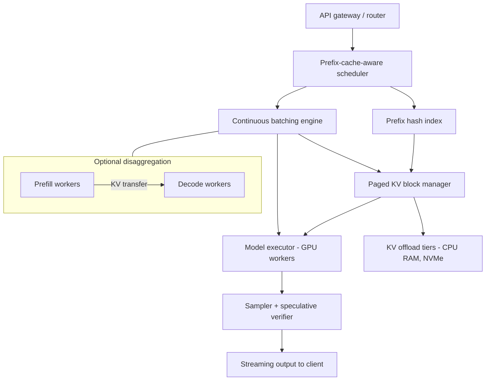

> [!info] Context
> Part of [[Harness-Internals-Overview|Harness Engineering Internals]]. Chapter: Runtime Optimization — KV Cache Economics, Speculative Execution, Batching, and Model Routing. Depth level 1.

# Runtime Optimization: KV Cache Economics, Speculative Execution, Batching, and Model Routing

## 1. Executive Overview

Every design decision in an agent harness eventually cashes out as a GPU doing arithmetic somewhere. When Claude Code re-sends a 150,000-token conversation on every turn, when Cursor applies a full-file rewrite at 1,000 tokens per second, when a subagent gets delegated to a cheaper model — each of those choices is priced by the physics of transformer inference: how much memory the KV cache eats, whether the GPU is waiting on compute or on memory bandwidth, and whether the serving stack can reuse work it already did.

This chapter teaches the inference side of harness engineering. Not how to build vLLM — how to *reason about* the serving layer well enough that prompt-caching bills, time-to-first-token behavior, and per-model pricing stop being magic numbers and start being predictable consequences of a machine you understand. The core claim: **an agent harness is a client program whose dominant cost is re-reading its own history, and the entire modern inference stack — paged KV caches, continuous batching, prefix caching, speculative decoding, model routing — exists to make that re-reading cheap.** A harness builder who understands why cache reads cost 10% of base input price will structure prompts append-only without being told; one who doesn't will burn 10x the budget and wonder why latency is spiky.

What this chapter does *not* own: deciding **what** goes into the context window. That policy question — retrieval, compaction, history editing — belongs to [[Harness-Internals-Context-Compilation]]. Here we take the compiled context as given and ask: how is it priced, how is it served, and what shape should it have so the serving layer can exploit it?

## 2. Historical Evolution

Transformer serving went through three distinct eras, and the pricing model you see on Anthropic's and OpenAI's pricing pages is a fossil record of all three.

**Era one: static batching (2020–2022).** Early serving systems (FasterTransformer, TensorRT before in-flight batching) treated LLM inference like image classification: collect N requests, pad them to the same length, run the batch to completion, return everything at once. This is catastrophic for generative workloads because output lengths vary wildly — one request in the batch generates 20 tokens, another generates 800, and the GPU spends most of its time computing padding for sequences that finished long ago. Worse, new requests queue behind the entire batch. Serving systems also pre-allocated KV cache memory for the *maximum possible* sequence length per request, so memory that would never be used sat reserved.

**Era two: iteration-level scheduling and paged memory (2022–2023).** Orca (OSDI '22, Yu et al.) made the observation that unlocked everything after it: the natural scheduling unit for autoregressive generation is not the *request* but the *iteration* — one decode step. If you schedule per iteration, a finished sequence exits the batch immediately and a queued request enters mid-flight. The batch composition changes every step. Orca reported up to 36.9x higher throughput than existing systems at comparable latency. This idea, renamed **continuous batching** (or in-flight batching in NVIDIA's stack), is now universal.

Continuous batching created a new problem: if requests join and leave constantly, you can no longer pre-allocate contiguous KV memory per request without massive fragmentation. vLLM's PagedAttention paper (arXiv 2309.06180, SOSP '23) measured that existing systems actually used only **20–38% of allocated KV cache memory** — the rest lost to internal fragmentation (reserved-but-unused slack) and external fragmentation. Their fix was lifted straight from operating systems: break the KV cache into fixed-size blocks ("pages," typically 16 tokens each), maintain a block table per sequence mapping logical to physical blocks, and allocate on demand. Near-zero waste, and — critically for what came later — physical blocks can now be **shared** between sequences that have identical prefixes. vLLM reported 2–4x throughput over FasterTransformer and Orca at the same latency.

**Era three: caching as a product, disaggregation, and the agentic workload (2024–present).** Once KV blocks were shareable across requests, the obvious next step was to persist them: if a second request arrives with the same first 100k tokens, skip the prefill and reuse the stored KV. Gemini shipped explicit context caching in May 2024, Anthropic shipped prompt caching with `cache_control` breakpoints in August 2024, OpenAI shipped automatic prefix caching in October 2024. Simultaneously, serving research split the two phases of inference onto different hardware pools (DistServe, Mooncake — Moonshot AI's production system for Kimi is explicitly "KVCache-centric disaggregated" serving), because prefill and decode have opposite hardware appetites — a point we're about to build from scratch. The current frontier is inference stacks co-designed for *agents specifically*: NVIDIA's Dynamo work observes that coding agents sustain 95–98% cache hit rates and that a 2–30 second tool-call pause can age an agent's entire prefix out of a naive LRU cache, and proposes agent-aware hints (`nvext.agent_hints`) so the scheduler knows which blocks will be reused and which never will.

The through-line: every era moved the granularity of resource management finer — from request, to iteration, to 16-token block — and each refinement turned previously wasted work into either throughput (for the provider) or discounts (for you).

## 3. First-Principles Explanation

### Why a KV cache exists at all

In attention, each token's representation is projected into three vectors: query, key, value. To compute attention for token *t*, the model needs the **keys and values of every token before it**. Generation is autoregressive — one token at a time — so without caching, generating token 1,001 would mean recomputing K and V for all 1,000 prior tokens, every step. That's O(n²) recomputation for work whose results never change: token 500's key vector is a pure function of the prefix, which is frozen. So you compute each token's K and V once and keep them in GPU memory. That stored tensor is the KV cache. It is not an optimization you can skip; it's the difference between O(n) and O(n²) generation, and every serving system has one.

Queries are *not* cached — a query is only ever used at the step where its token is being processed, then discarded. Only K and V persist. This asymmetry is why the cache is called "KV" and why the memory math below has a factor of 2, not 3.

### The memory math

Per token, per layer, the model stores one key vector and one value vector for each KV head. In half precision (2 bytes per element):

```
KV bytes per token = 2 (K and V) × 2 (bytes, fp16/bf16) × n_layers × n_kv_heads × d_head
```

Work two real examples. Llama-2-7B (32 layers, 32 heads, head dim 128, full multi-head attention): 2 × 2 × 32 × 32 × 128 = **524 KB per token**. A 4,096-token context costs ~2.1 GB of KV — on top of the 14 GB of weights. Now Llama-3-70B, which uses grouped-query attention with only 8 KV heads (80 layers, head dim 128): 2 × 2 × 80 × 8 × 128 = **327 KB per token** — a model 10x larger with a *smaller* per-token cache. That's the entire point of GQA and MQA: they exist because KV memory, not weight memory, is what limits batch size, and batch size is what limits throughput. At 128k context, even that GQA cache is ~40 GB — more than the H100's 80 GB can spare after weights unless the model is sharded. kipply's classic inference-arithmetic walkthrough runs the same numbers for an Anthropic-style 52B dense model and gets ~2 MB per token: KV for a single long conversation can rival the memory of the weights themselves.

This is the first economic fact: **your conversation history physically occupies rented HBM on someone's GPU.** Providers price accordingly.

### Prefill vs decode: two different machines wearing one trench coat

A single API call has two phases with opposite performance characters.

**Prefill** processes the entire prompt at once. All n prompt tokens go through the model in parallel — the matmuls are large (n × d_model against the weight matrices), the GPU's tensor cores are saturated, and the cost is roughly 2 × P FLOPs per token for a P-parameter model. Prefill is **compute-bound**: the limiting resource is floating-point throughput. A 100k-token prompt into a 70B model is on the order of 1.4 × 10¹⁶ FLOPs — tens of GPU-seconds of raw compute if you weren't parallelizing across a node. This is what you're paying for in "input tokens," and it's why time-to-first-token grows with prompt length.

**Decode** generates one token per step. To produce that single token, the GPU must read *every weight* of the model (140 GB for a 70B in fp16) plus the sequence's entire KV cache out of HBM — and it does only ~2 FLOPs per parameter with all that data. The arithmetic intensity (FLOPs per byte moved) is around 1–2, while the hardware wants hundreds. An A100 does 312 TFLOPs but moves only 1.5 TB/s; the ratio is ~208 FLOPs per byte. kipply's framing: computing the forward pass for 1 token takes the same wall-clock time as for ~208 tokens, because below that batch size you're waiting on memory, not on math. Decode is **memory-bandwidth-bound**. Batch-of-1 decode on a single H100 for a 70B model tops out around (3.35 TB/s ÷ 140 GB) ≈ 24 tokens/second no matter how clever your kernels are — the weights simply cannot be read from HBM any faster.

Three consequences fall straight out of this asymmetry, and they explain most of the pricing page:

1. **Output tokens cost ~3–5x input tokens** not because they're worth more, but because each one requires a full pass over the weights serving only that one token (amortized across the batch), while input tokens amortize the weight-read across the whole prompt in prefill.
2. **Batching is nearly free for decode.** If reading the weights takes the same time for 1 or 208 sequences, serving 200 concurrent users costs barely more than serving 1. This is why continuous batching multiplied throughput by an order of magnitude: it keeps the decode batch full.
3. **Skipping prefill is enormously valuable.** If the KV for a prefix already exists, the provider skips the compute-bound phase entirely and just loads stored tensors. That's what prompt caching sells you — and why the read price (10% of input) is close to the marginal cost of memory traffic while the write price (100–125%) reflects doing the prefill *plus* storage.

> [!tip] The one-sentence mental compression
> Prefill is a compute problem, decode is a memory-bandwidth problem, and the KV cache is the bridge between them — so input pricing tracks FLOPs, output pricing tracks HBM reads, and cache pricing tracks storage plus reload bandwidth.

### Why prompt caching gives ~90% off, not 100%

A cache hit still isn't free for the provider: the stored KV blocks must be resident (or restored from a colder tier) and read back into the attention computation; the request still occupies scheduler and routing capacity; and storage itself has carrying cost — which is exactly why Anthropic's 1-hour TTL write costs 2.0x base versus 1.25x for the 5-minute TTL, and why Gemini's *explicit* caching bills storage per hour separately. The 0.1x read price is a reasonable shadow price of "load tensors and attend to them" versus "recompute them from scratch."

## 4. Mental Models

**The pricing page is a map of marginal costs.** Experts read a provider's pricing table the way a systems engineer reads a datasheet. Input price ≈ prefill FLOPs. Output price ≈ decode bandwidth-seconds. Cache write premium ≈ storage provisioning. Cache read discount ≈ what prefill *would have cost* minus reload bandwidth. When a price seems weird, look for the serving mechanism underneath — it's almost always there.

**The prefix tree.** Think of the provider's cache as a giant trie over token sequences, keyed by cumulative hash. Your request walks down the trie as far as it matches, pays 0.1x for the matched path, and pays full price (plus write premium) for the new branch. Everything about cache-friendly harness design — append-only histories, stable tool definitions, no timestamps in system prompts — is just "don't fork the trie near the root."

**Two latencies, one throughput — and each product surface cares about a different one.** Time-to-first-token (TTFT) is a prefill/queueing metric; tokens-per-second (TPS, or its inverse, time-per-output-token) is a decode metric; end-to-end task latency is dominated by neither for agents — it's dominated by *loop structure*: how many model turns, how many serialized tool calls, how much dead time between them. A chat product lives and dies on TTFT plus streaming feel. Cursor's tab completion lives on total time for ~20 tokens, so it needs a small model with tiny TTFT. An autonomous agent running for 20 minutes barely cares about TTFT at all — it cares about turn count and whether tool calls run in parallel. Optimizing the wrong latency for the surface is the most common runtime mistake harness teams make.

**The agent is a bursty, loyal customer.** From the serving stack's perspective, an agent session is a long-lived prefix that grows monotonically, punctuated by silences (tool execution) and occasional huge appends (tool output). NVIDIA's agentic-inference work formalizes this: system prompts are reused every turn; reasoning tokens are often never reused; a tool call is a 2–30 second pause that a naive LRU evictor interprets as abandonment. Good harness design communicates loyalty to the cache (stable prefixes, prompt_cache_key routing, TTL choices); great serving stacks are starting to accept explicit hints about it.

## 5. Internal Architecture

A modern serving stack, whether vLLM, TensorRT-LLM/Dynamo, or a proprietary equivalent behind the Anthropic/OpenAI APIs, decomposes into the same components. (For the proprietary stacks this structure is inference from public serving systems and provider documentation, not published architecture.)



**Router / gateway:** terminates the API call, computes a hash of the prompt prefix (OpenAI documents routing on a hash of roughly the first 256 tokens, with `prompt_cache_key` as a user-supplied tiebreaker), and steers the request toward a worker likely to hold the cached prefix. Cache-aware routing matters because KV blocks live in a specific GPU's memory — a cache hit on the wrong machine is a miss.

**Scheduler with continuous batching:** maintains a running batch; every iteration it admits new requests (starting their prefill, possibly chunked), evicts finished ones, and preempts requests if KV memory runs out. **Chunked prefill** deserves a sentence of mechanism: instead of letting a 100k-token prefill monopolize the GPU for seconds (stalling every decoding request in the batch — TPOT spikes users feel as a mid-answer freeze), the scheduler splits prefill into chunks and interleaves them with decode steps, keeping the batch's arithmetic intensity high and latency smooth. The cost is a slightly slower TTFT for the long request — a deliberate trade of one latency for another.

**Paged KV block manager:** the PagedAttention core. Fixed-size blocks, a block table per sequence, reference counting so identical prefixes share physical blocks (prefix sharing), copy-on-write when shared sequences diverge (as in parallel sampling), and eviction/offload policies for blocks under memory pressure. Offload tiers (CPU RAM, then NVMe/remote — Mooncake's "KVCache-centric" design, NVIDIA's CMX context-storage platform) are what make hour-long cache TTLs economically possible: warm prefixes don't have to hold HBM hostage.

**Disaggregated prefill/decode (optional, increasingly standard at scale):** separate GPU pools for the two phases, with KV transferred over the interconnect between them. DistServe's argument: colocated prefill and decode contend — a big prefill wrecks decode TPOT, decode steals compute from prefill TTFT — and the two phases want different parallelism strategies and even different hardware SKUs (compute-heavy vs bandwidth-heavy). Disaggregation lets each pool meet its own SLO and scale independently; the price is KV-transfer bandwidth and system complexity.

**Sampler + speculative verifier:** where speculative decoding lives, covered in §7.

## 6. Step-by-Step Execution

Walk one turn of a coding agent — turn 12 of a session, 120k tokens of accumulated context, the user's new message plus one round of tool use — through the whole stack. Anthropic-style explicit caching, but the mechanics generalize.

1. **Harness assembles the request** append-only: tool definitions (unchanged since turn 1), system prompt (unchanged), messages 1–23 (unchanged), new user message appended. A `cache_control` breakpoint sits on the last message block; the tools → system → messages ordering means the cumulative hash of everything up to the previous turn's breakpoint is identical to what turn 11 wrote.
2. **Gateway hashes the prefix** and routes to a worker pool holding that cache entry. The cache index matches ~119.5k tokens of prefix — the system checks the current breakpoint and walks backward through recent blocks to find the longest previously *written* prefix.
3. **Scheduler admits the request.** The matched prefix's KV blocks are located (some possibly restored from CPU-RAM offload after the previous turn's 20-second `pytest` run — this restore is invisible to you but is exactly the path NVIDIA's agent-hints work optimizes). Only the ~500 new tokens need prefill.
4. **Chunked prefill of the suffix** is interleaved into the running batch alongside dozens of other sessions' decode steps. Because 500 tokens is one chunk, TTFT is dominated by queueing, not compute — this is why cached agent turns feel instant despite 120k-token contexts.
5. **Decode loop.** Each iteration, the engine gathers the batch, reads weights + each sequence's KV block tables, computes one token per sequence, streams deltas out. Your token appears in the SSE stream; the client renders it. If the provider runs speculative decoding, several tokens may be verified per weight-read.
6. **Model emits a `tool_use` block and stops.** Usage metadata reports ~119.5k `cache_read_input_tokens` (billed at 0.1x), ~500 `cache_creation_input_tokens` (billed at 1.25x — the new suffix was written at the breakpoint), and the output tokens. Total input bill: roughly **12% of what an uncached 120k-token turn would cost**.
7. **Harness executes the tool** (locally — the provider is now idle for this session; its KV blocks start aging). If the harness runs multiple independent tool calls, it executes them in parallel — pure client-side latency win, zero inference cost.
8. **Turn 13 repeats the walk**, one node deeper in the prefix trie. The 5-minute TTL was refreshed for free by the read in step 3; as long as the loop keeps cycling faster than the TTL, the session never pays full prefill again.

The failure version of this walk is instructive: if the harness had injected `Current time: 14:32:07` at the *top* of the system prompt, step 2 would match nothing, step 3 would prefill all 120k tokens (tens of seconds of TTFT), and the bill would be ~10x. One line of code, order-of-magnitude consequences.

## 7. Implementation

### Speculative decoding: getting multiple tokens per weight-read

Decode's bottleneck is reading 140 GB of weights to produce one token. Speculative decoding (Leviathan et al., arXiv 2211.17192; concurrently Chen et al. at DeepMind) attacks it directly: use a cheap **draft** to propose k tokens, then run the big model *once* over all k positions in parallel — a prefill-shaped, compute-bound verification — and accept the longest prefix of proposals the target model agrees with. A rejection-sampling rule makes the output distribution **provably identical** to the target model's; speculation changes latency, never content. The economics ride on the **acceptance rate**: the original paper reported 2–3x speedups with a small draft model.

Draft strategies form a spectrum:

- **Separate draft model** (original formulation): a 1–7B model drafting for a 70B target. Flexible but requires a second model resident and a compatible tokenizer.
- **Medusa** (arXiv 2401.10774): bolt k extra decoding heads onto the target itself, each predicting the token at position +1, +2, ... in parallel. No second model; acceptance ~60–80% and degrading at longer speculation depths because heads predict independently.
- **EAGLE-family**: a lightweight autoregressive head over the target's hidden states, drafting token-by-token with real inter-token dependencies — acceptance ~80–95%, 3–4x throughput in EAGLE-3 deployments.
- **Deterministic drafts — Cursor's speculative edits**: the harness-visible variant. In a code-edit task, the model's output is mostly a *copy of the input file*. So don't draft with a model at all — feed chunks of the original file as the speculation, verify with greedy decoding, and let the target model "fast-forward" through unchanged regions, dropping out of speculation only where the edit actually diverges. Cursor's fine-tuned Llama-3-70B fast-apply model hits ~1,000 tokens/second — ~13x vanilla inference — because acceptance rates on unchanged code approach 100%. This is the deepest lesson in the chapter for harness builders: **Cursor changed the task format (full-file rewrite instead of diffs) partly because it made the output predictable enough to speculate on.** Task design and serving optimization are the same discipline.

### Cache-aware prompt assembly (the harness side)

The rules fall out of the prefix-trie model. In pseudo-code:

```python
def assemble(request):
    blocks = []
    blocks += stable_tool_definitions()   # NEVER varies within a session;
                                          # editing one tool def invalidates everything after it
    blocks += static_system_prompt()      # no timestamps, no per-request state
    blocks += conversation_history()      # append-only: never rewrite, reorder,
                                          # or delete earlier messages mid-session
    blocks += volatile_context()          # time, dynamic state — AFTER the breakpoint
    blocks += new_user_turn()
    place_cache_breakpoint(blocks, on="last stable block")
    return blocks
```

Anthropic gives you up to 4 explicit breakpoints (useful for layering: tools+system on a 1-hour TTL, conversation on 5-minute); OpenAI and Gemini's implicit mode do prefix matching automatically, so the same *ordering* discipline applies even with no knob to turn. Minimum cacheable lengths are real constraints: ~512–4,096 tokens depending on Anthropic model, 1,024 for OpenAI, ~1,024–2,048 for Gemini implicit — short prompts silently don't cache. Invalidation cascades follow the tools → system → messages hierarchy: change a tool definition and you've burned the entire cache; toggle `tool_choice` or add an image and you've burned the message-level cache. One subtle race: a cache entry only becomes usable once the writing request's response *begins*, so N parallel subagent calls sharing a prefix will all pay the write unless you warm the cache first (Anthropic supports a `max_tokens: 0` pre-warm request) or stagger the first call.

### Model routing and cascades

Routing exploits the enormous price spread between model tiers (often 20–60x between a frontier model and its small sibling) and the fact that most queries don't need the frontier. Two architectures:

- **Router (predict-then-route):** a classifier scores the query and picks a model *before* generation. RouteLLM (arXiv 2406.18665) trained routers — matrix factorization over Chatbot Arena preference data worked best — that maintain ~95% of GPT-4 quality on MT-Bench while sending only ~14% of queries to the strong model, cutting cost >2x (up to 85% on some benchmarks). Key finding: preference-data-trained routers transfer across model pairs without retraining, so the router outlives any particular model generation.
- **Cascade (try-then-escalate):** run the cheap model, check confidence or a verifier, escalate on failure. Higher worst-case latency (you pay both models on escalation), but the escalation signal is grounded in an actual attempt rather than a prediction.

Harnesses in production route mostly by **surface and role**, which is coarser but more reliable than per-query ML routing: Cursor uses a small custom model for tab completion, a mid-tier fast-apply model for edits, and a frontier model for agent chat — three models, one product, selected by surface. Claude Code routes by role: frontier model for the main loop, cheaper models available for delegated subagent work (model-tier delegation), plus **reasoning-effort knobs** as a continuous cost dial on the same model — extended-thinking budgets and effort parameters convert "how hard should the model think" from a model-selection problem into a per-request parameter. A subagent doing mechanical file-search work on a frontier model at high effort is the routing anti-pattern: wrong tier, wrong knob.

### Token budgets at the harness level

The harness controls the *output* side of tool calls, and tool output is the fastest-growing, least-valuable part of most agent contexts. Practical mechanics: hard caps per tool result (truncate with an explicit marker so the model knows), pagination handles instead of full dumps, and delegation — send a subagent to read the 40k-token log file and return a 500-token conclusion, so the main loop's precious cached context never absorbs the raw dump. This is where runtime economics and [[Harness-Internals-Context-Compilation]] meet: compilation decides what's worth keeping; runtime economics tells you each retained token is paid for again on *every subsequent turn* (at 0.1x if you've kept the cache intact — at 1x forever if you haven't).

## 8. Design Decisions

**Explicit vs automatic caching.** Anthropic makes you place `cache_control` breakpoints and charges a 25% write premium; OpenAI caches automatically above 1,024 tokens with no write charge and a 50–90% read discount (50% on the 2024-era GPT-4o family; up to 90% on current models, per OpenAI's docs); Gemini offers both an implicit mode and an explicit mode with per-hour storage billing and TTL control. The trade is control versus ergonomics. Explicit breakpoints let a sophisticated client layer TTLs, pre-warm, and *know* what will hit; they also let the provider charge for storage honestly (the 1-hour TTL at 2x write is a real storage contract, not best-effort). Automatic caching is free ergonomic wins for naive clients, but it's best-effort — OpenAI's in-memory retention is 5–10 minutes typically (with 24-hour GPU-local retention on newer models), evicted under load precisely when you're busiest, and you can't buy certainty. That all three providers converged on ~0.1x read pricing tells you the underlying serving cost is similar; that they diverged on the write/storage side tells you they're making different bets about who their sophisticated customers are.

**Why append-only histories won.** You could imagine harnesses that aggressively rewrite history each turn — dedupe tool outputs, re-rank messages, compress old turns inline. Some early frameworks did. Caching killed it: any mutation before the breakpoint forks the prefix trie and repays full prefill on the entire context. Modern harnesses therefore batch history mutations into rare, explicit **compaction events** (accept one full cache miss, then enjoy a smaller cached prefix) rather than continuous rewriting. The serving layer's pricing reshaped client architecture — a beautiful example of economic API design doing what documentation never could.

**Full-file rewrite vs diff output (Cursor).** Diffs minimize output tokens; rewrites maximize them. Cursor chose rewrites anyway, for three measured reasons: models are far better trained on full files than diff formats; models are bad at the line numbers diffs require; and more output tokens give the model more forward passes to get the edit right. The move only makes economic sense *because* speculative edits make rewrite tokens ~13x cheaper than naive decoding — they bought accuracy with a serving trick. Decision-shape to remember: a "wasteful" format plus an optimization that exploits its predictability can beat an "efficient" format the model handles poorly.

**Disaggregation vs colocation.** Colocated prefill/decode with chunked prefill is simpler and keeps GPUs fungible; disaggregation (DistServe, Mooncake) meets tight TTFT *and* TPOT SLOs simultaneously and lets each phase scale and choose hardware independently, at the cost of KV-transfer plumbing and fleet rigidity. Under ~medium scale, chunked prefill usually wins on simplicity; at frontier-provider scale with contractual latency SLOs, disaggregation wins — which is why the biggest providers run it and your self-hosted vLLM probably shouldn't.

## 9. Failure Modes

**The invalidation cascade.** One changed byte in a tool description invalidates tools → system → messages — the entire cache. Symptom: bill and TTFT jump ~10x with no code change anyone remembers. Real-world triggers: a tool registry that re-serializes definitions in nondeterministic dict order; a feature flag toggling server-side tools (which providers implement by editing the system prompt); an A/B test injecting variant IDs into the system prompt. Debug by diffing the exact request bytes of two consecutive turns and checking `cache_read_input_tokens` in usage metadata — it's the ground truth for what actually hit.

**The volatile-prefix bug.** Timestamps, session IDs, or "user is currently viewing file X" placed early in the prompt. Every turn is a full cache miss forever. The fix is ordering (volatile content after the breakpoint), not removal.

**TTL expiry between turns.** An agent pauses 6 minutes on a long test run; the 5-minute cache dies; the next turn repays full prefill on 150k tokens. Options: 1-hour TTL on the stable prefix (2x write, amortized over a long session it's nearly always worth it), or a keep-alive ping. On the serving side this is the LRU-blindness problem NVIDIA's agent-hints work targets: the evictor can't distinguish "abandoned" from "waiting on pytest."

**Parallel-fanout write stampede.** Ten subagents launched simultaneously with a shared prefix; the cache entry isn't readable until the first response begins; all ten pay the write. Warm first, then fan out.

**Speculative decoding acceptance collapse.** Speedup assumes the draft predicts the target. On out-of-distribution content the acceptance rate craters and you pay draft cost plus verification for near-zero accepted tokens — worse than no speculation. Cursor's deterministic variant has the same cliff: an edit that rewrites most of a file gets no fast-forward. Correctness is never at risk (rejection sampling guarantees the target distribution); only latency degrades, which makes this failure mode invisible unless you monitor accepted-tokens-per-step.

**Router misrouting.** A cheap-first cascade sends a subtle concurrency bug to the small model, which confidently "fixes" it wrong; the verifier can't tell. Escalation policies need task-level signals (tests failing twice → escalate) rather than model self-confidence, which is poorly calibrated exactly on the queries that most need escalation.

**Chunked-prefill TPOT contamination (self-hosting).** Oversized prefill chunks stall interleaved decode steps; users see mid-response freezes whenever someone else submits a long document. Tune chunk size against your traffic mix; watch p99 inter-token latency, not means.

## 10. Production Engineering

**Anthropic.** Prompt caching with up to 4 explicit breakpoints, 5m/1h TTLs, per-model minimum cacheable lengths (512–4,096 tokens), documented invalidation hierarchy, `max_tokens: 0` pre-warming, and usage-metadata observability (`cache_read_input_tokens` / `cache_creation_input_tokens`) — all verified in platform docs. Claude Code's own traffic is the canonical cache-shaped workload: append-only history, stable tool definitions, incremental per-turn writes (inference from documented client behavior and the API's design center — Anthropic doesn't publish Claude Code's serving internals).

**OpenAI.** Automatic prefix caching ≥1,024 tokens in 128-token increments, prefix-hash routing (~first 256 tokens) with `prompt_cache_key` for routing affinity, 5–10 minute typical retention (up to 24h GPU-local on newer models), org-isolated caches — verified in API docs. No write premium; best-effort semantics.

**Google.** Dual-mode: implicit caching on by default for Gemini 2.5+ (90% discount on hits; 75% on 2.0-era) plus explicit CachedContent objects with TTLs and hourly storage billing; minimums ~1,024–2,048 tokens implicit, higher for explicit on Vertex — verified in Gemini API docs, with per-model minimums shifting across releases.

**Cursor.** Fast-apply: fine-tuned Llama-3-70B doing full-file rewrites with deterministic speculative edits at ~1,000 tok/s (~13x vanilla), served via Fireworks' speculative API; trained ~80% synthetic data; evaluated on ~450 edits graded by Claude Opus — verified from Cursor's and Fireworks' engineering blogs. Per-surface routing (tab model / apply model / frontier chat) — verified in outline, proprietary in detail. See [[Harness-Internals-Cursor-AI-IDE-Architecture]].

**Moonshot (Kimi) / Mooncake.** Published architecture: KVCache-centric disaggregated serving — separate prefill and decode clusters plus a distributed cache pooling DRAM/SSD across the fleet, scheduling requests to maximize cache reuse under SLOs. The clearest public evidence that at scale, the KV cache *is* the system and compute clusters orbit it.

**NVIDIA (Dynamo).** The agentic co-design agenda, verified from developer blogs: KV-aware routing, offload tiers (CMX context-memory storage), FP4 KV quantization, and `agent_hints` letting orchestrators mark block reuse-value and session lifecycle — motivated by measured coding-agent behavior (95–98% cache hit rates; tool-call pauses defeating LRU). Direction of travel: the harness↔serving interface is widening beyond "tokens in, tokens out."

**Perplexity / DistServe lineage.** Perplexity's engineering blog documents disaggregated prefill/decode in production; DistServe (UCSD) supplied the goodput argument. Verified publications; per-provider deployment details vary.

## 11. Performance

The numbers that anchor intuition, all from the cited sources: continuous batching delivered up to **23x** throughput over naive static batching in Anyscale's OPT-13B benchmark (and Orca reported up to 36.9x vs pre-iteration-level systems); PagedAttention added **2–4x** on top of continuous batching by fixing the 60–80% KV memory waste; prompt-cache reads price at **0.1x** input and cut long-context TTFT by up to ~80–90%; speculative decoding yields **2–3x** decode speedup classically, **3–4x** for EAGLE-3, **~13x** for Cursor's deterministic-draft special case; routing recovers **2x+ cost** at ~95% quality retention (RouteLLM).

Where to spend optimization effort in a harness, in order: (1) **cache hit rate** — it multiplies against your largest cost line every single turn; instrument `cache_read_input_tokens` per turn and treat any unexplained drop as a P1; (2) **loop structure** — one avoided model turn beats any per-token optimization; parallel tool execution and background/async execution attack wall-clock directly; (3) **model-tier fit per surface** — tab vs apply vs agent; effort knobs down for mechanical work; (4) **tool-output budgets** — every retained token recurs in cost every subsequent turn. Only after those four does anything server-side (self-hosted engine tuning, chunk sizes, spec-decode drafts) matter for a typical harness team, because the provider already did it.

## 12. Best Practices

Structure prompts as: stable tools → stable system → append-only history → volatile tail — and never let anything volatile creep forward. Pin serialization: canonical JSON key order for tool definitions, byte-identical across turns. Choose TTLs deliberately: 1-hour on session-stable prefixes for agents that pause on tools; pre-warm before parallel fan-out. Watch cache metrics in production the way you watch error rates — cache regression is a silent 10x cost incident. Truncate tool outputs at the harness with explicit markers; delegate bulk reading to cheap-tier subagents that return conclusions, not dumps. Route by surface first, per-query second. Use effort/thinking budgets as a dial before reaching for a different model. And the meta-practice, courtesy of Cursor: when output is predictable, *make it more predictable* — task formats that echo their input are speculative-decoding fuel.

Anti-patterns, for symmetry: timestamps in system prompts; regenerating tool schemas per request; rewriting history every turn instead of compacting rarely; frontier models at max effort for grep-shaped subagent work; measuring only mean TTFT while p99 inter-token latency rots; and "optimizing" to diff outputs without checking whether the model can actually produce them reliably.

## 13. Common Misconceptions

**"Prompt caching caches responses."** No — it stores the *KV tensors of your prompt prefix*, not any output. A cache hit still runs full decode and can produce a completely different answer. The thing being skipped is prefill compute, nothing else. This also answers the privacy worry: nothing is learned or shared; OpenAI's caches are org-isolated and Anthropic's keys are exact-prefix hashes.

**"Output tokens are premium-priced because they're the valuable part."** Backwards causality. Output tokens are expensive because decode is memory-bandwidth-bound — each output token forces a full weight read amortized only across the batch, while input tokens share prefill's dense matmuls. The price is physics, not value-based pricing.

**"The GPU is busy while the model 'thinks between tokens.'"** During decode the GPU's arithmetic units are mostly *idle*, starved by HBM bandwidth. That's why batching 200 sequences barely slows any of them, why speculative decoding gets multiple tokens per weight-read essentially free, and why "GPU utilization" (SM occupancy) is a misleading metric for decode-heavy workloads — watch bandwidth utilization instead.

**"Speculative decoding trades quality for speed."** The rejection-sampling acceptance rule provably preserves the target model's output distribution exactly. What varies is speed alone. If outputs changed, no provider could deploy it silently — and they all do.

**"A 90% discount means caching makes context nearly free, so context size doesn't matter."** Cache reads still cost 0.1x *per token per turn*, decode still attends over the full KV (latency), long contexts still degrade model behavior, and one invalidation repays everything at full price. Caching lowers the slope; it doesn't remove the incentive that [[Harness-Internals-Context-Compilation]] exists to serve.

**"OpenAI's automatic caching beats Anthropic's because it's free and effortless."** Different contracts, not better/worse: automatic is best-effort with eviction under load and no storage guarantee; explicit costs a write premium and engineering attention but buys layered TTLs, pre-warming, and predictability. For a harness whose whole cost model rides on hit rate, predictability is usually worth the premium.

## 14. Interview-Level Discussion

**Q1: Derive why decode is memory-bound and prefill is compute-bound, and name one system consequence of each.**
Per token, a forward pass does ~2 FLOPs per parameter and must read each parameter once. Prefill processes n tokens against one weight-read: arithmetic intensity ~2n FLOPs/byte — for n in the thousands this exceeds the GPU's ~200 FLOPs-per-byte balance point (A100: 312 TFLOPs / 1.5 TB/s), so compute limits you. Decode processes 1 token per sequence per weight-read: intensity ~2 × batch_size, far below balance for realistic batches, so bandwidth limits you. Consequences: prefill → chunked prefill and prefill/decode disaggregation (protect decode TPOT from prefill bursts, give each phase its own hardware); decode → continuous batching (batch is nearly free) and speculative decoding (spend idle FLOPs verifying drafted tokens).

**Q2: Your agent's per-turn cost jumped 8x overnight with no deploy. Diagnose.**
Cache regression until proven otherwise. Check `cache_read_input_tokens` per turn — if it collapsed, something is mutating the prefix: nondeterministic tool-schema serialization, a server-side feature toggle that edits the system prompt (web search, citations), an injected timestamp/experiment ID, or breakpoint placement drifting onto volatile content. Byte-diff two consecutive requests. If cache reads look healthy, check for TTL misses from longer tool-execution pauses (new slow tool?), a context-length regression (tool outputs ballooning), or provider-side eviction under load if relying on automatic caching.

**Q3: Design the caching strategy for a harness that fans out 8 parallel subagents sharing a 60k-token base context.**
Pre-warm: one `max_tokens: 0` request writing the shared prefix at a breakpoint (or one serialized subagent call before the fan-out), because concurrent requests can't read an entry until the writing response begins — naive fan-out pays 8 cache writes. Layer breakpoints: tools+system on 1h TTL, shared base on 5m. Give each subagent its distinct instructions *after* the shared prefix. On OpenAI, set a shared `prompt_cache_key` so all 8 route to the same cache-holding workers. Budget: 8 × 60k × 0.1x reads ≈ the cost of half of one uncached call.

**Q4: When is speculative decoding harmful, and how would you detect it in production?**
When acceptance collapses: draft/target distribution mismatch (OOD domains, unusual languages), temperature settings hurting agreement, or Medusa-style independent heads at deep speculation lengths. You then pay drafting plus verification for ~zero accepted tokens — net slower than plain decode. Detect via accepted-tokens-per-verification-step (dashboarded per domain), and p50/p99 TPOT segmented by traffic type. Mitigate with adaptive speculation length or per-domain draft disable. Note what you never need to monitor: output quality — the acceptance rule preserves the target distribution exactly.

**Q5: Argue for and against per-query ML routing (RouteLLM-style) versus per-surface static routing in a coding harness.**
For per-query: real queries are heterogeneous, and RouteLLM shows ~95% of strong-model quality at ~14% strong-model traffic — the spread between tiers is 20–60x, so even mediocre routing prints money at chat-assistant scale. Against, for a *harness*: agent queries aren't i.i.d. one-shots — they're turns in a stateful loop where a weak model's subtle error compounds across subsequent turns and poisons shared context, and where switching models mid-session can invalidate provider-side caches and change tool-calling behavior. Surface/role routing (tab vs apply vs agent loop; main loop vs subagents) captures most of the spread with none of the mid-session risk, and effort knobs give per-request cost control *within* a tier. Strongest hybrid: static tier per role, cascade-with-task-level-verifier (tests pass?) for escalation.

**Q6: Why did Cursor's "wasteful" full-file rewrite beat diff formats, and what general principle does it illustrate?**
Diffs minimize tokens but sit outside the model's training distribution and require line-number arithmetic models are bad at; rewrites are in-distribution and give the model more forward passes to converge on the correct edit. The token cost was then neutralized by speculative edits: since a rewrite mostly echoes the input file, the original file serves as a deterministic draft, and verification fast-forwards through unchanged spans at ~100% acceptance → ~1,000 tok/s, 13x vanilla. Principle: co-design the task format with the serving optimization — predictable output is a resource, and sometimes the right move is to *increase* redundancy so the runtime can exploit it. (Same principle underlying append-only prompts and prefix caching.)

## 15. Advanced Topics

**KV compression and quantization.** FP8 and now FP4 KV caches (NVIDIA's NVFP4 work) halve-and-halve the per-token memory bill, trading numerical precision in attention for batch size and context length; research variants (coupled quantization, ThinKV-style adaptive compression for reasoning traces) push toward 1–2 bits per channel. The open question is quality cliffs on long-horizon agent tasks, where small attention errors compound.

**KV as a storage tier / "context as infrastructure."** Mooncake, NVIDIA CMX, and per-provider offload systems treat KV as a first-class datacenter storage class with its own hierarchy (HBM → DRAM → NVMe → network), placement, and eviction policy. Endgame: session context that survives hours and migrates across the fleet — 24-hour cache retention is the first product-visible sign.

**Explicit harness↔serving contracts.** `nvext.agent_hints` and prompt_cache_key are early forms of a wider interface: the orchestrator declaring "this prefix is a session that will resume in ~20s," "these reasoning tokens will never be reused," "these 8 requests share a parent." Expect the token-stream API to grow session- and DAG-aware scheduling semantics; harness builders who structure workloads explicitly will be first to exploit it.

**Adaptive computation.** Reasoning-effort parameters are the crude version of a deep idea: spend compute proportional to marginal value. Research directions include early-exit transformers (halt layers when confident), dynamic speculation depth, and routing *within* a model (MoE is already this, at expert granularity). For agents, the interesting frontier is *loop-level* adaptivity — a harness that lowers effort for mechanical turns and raises it at decision points, automatically.

**Prefix-sharing at the fleet level.** Cross-request dedup of common public prefixes (popular system prompts, standard tool suites) raises the same questions CDNs faced: cache poisoning, side channels (timing attacks that reveal whether *someone else* cached a prefix — why providers scope caches per-org), and economics of shared vs isolated storage.

## 16. Glossary

- **KV cache** — Stored key/value tensors for every processed token, per layer per KV head; makes autoregressive generation O(n) instead of O(n²); the dominant dynamic memory consumer in serving.
- **Prefill** — Phase processing the whole prompt in parallel; compute-bound; determines TTFT; what "input tokens" pay for.
- **Decode** — Phase generating one token per step per sequence; memory-bandwidth-bound; determines TPS; what "output tokens" pay for.
- **Arithmetic intensity** — FLOPs performed per byte moved from memory; below the hardware's balance ratio (~208 for A100) you're memory-bound.
- **TTFT / TPOT / TPS** — Time-to-first-token; time-per-output-token; tokens-per-second — the three latency metrics, dominated by prefill+queueing, decode, and decode respectively.
- **Continuous (in-flight) batching** — Iteration-level scheduling (Orca) that admits/evicts sequences every decode step, keeping the batch full.
- **PagedAttention** — KV cache managed in fixed-size blocks via per-sequence block tables (vLLM), eliminating fragmentation and enabling prefix sharing and copy-on-write.
- **Chunked prefill** — Splitting long prefills into chunks interleaved with decode steps, trading the long request's TTFT for everyone else's TPOT stability.
- **Prefill/decode disaggregation** — Running the two phases on separate GPU pools with KV transfer between them (DistServe, Mooncake), so each meets its own SLO.
- **Prompt (prefix) caching** — Product-level reuse of stored prefix KV across API calls; exact-prefix-match, hash-keyed; reads ~0.1x input price.
- **Cache breakpoint (`cache_control`)** — Anthropic's explicit marker of where a cacheable prefix ends; up to 4 per request; writes happen only at breakpoints.
- **TTL** — Cache entry lifetime (Anthropic: 5m default / 1h at 2x write price), refreshed free on each read.
- **Speculative decoding** — Draft-k-tokens-then-verify-in-one-pass; rejection sampling preserves the target distribution exactly; speedup ∝ acceptance rate.
- **Acceptance rate** — Fraction of drafted tokens the target model accepts; the single number governing speculative speedup.
- **Medusa / EAGLE** — Draft-free speculation via extra decoding heads on the target (Medusa, ~60–80% acceptance) or an autoregressive head over hidden states (EAGLE, ~80–95%).
- **Speculative edits** — Cursor's deterministic-draft variant: the original file is the speculation; verification fast-forwards unchanged code.
- **Model routing / cascade** — Selecting model tier per query before generation (router) or escalating after a cheap attempt fails (cascade); RouteLLM is the canonical trained router.
- **Reasoning-effort knob** — Per-request parameter controlling thinking-token budget; a continuous cost/quality dial within one model tier.
- **Goodput** — Request throughput *that meets latency SLOs*; the metric disaggregation optimizes, as distinct from raw throughput.

## 17. References

- **vLLM / PagedAttention paper** — Kwon et al., "Efficient Memory Management for LLM Serving with PagedAttention," https://arxiv.org/abs/2309.06180 — The 20–38% memory-utilization measurement, block-table design, prefix sharing, copy-on-write. Read first among the papers; every serving system since is a response to it.
- **kipply, "Transformer Inference Arithmetic"** — https://kipp.ly/transformer-inference-arithmetic/ — The back-of-envelope toolkit: KV bytes-per-token formula, the 208 FLOPs/byte balance point, latency derivations. Read when you want to *derive* rather than memorize this chapter's §3.
- **Anthropic prompt caching documentation** — https://platform.claude.com/docs/en/build-with-claude/prompt-caching — Breakpoint semantics, invalidation hierarchy, TTL pricing (1.25x/2x write, 0.1x read), per-model minimums, pre-warming. The reference to keep open while building a cache-aware harness.
- **OpenAI prompt caching guide** — https://developers.openai.com/api/docs/guides/prompt-caching — Automatic ≥1,024-token caching, 128-token increments, prefix-hash routing and `prompt_cache_key`, retention windows. Read to understand the best-effort contract you're relying on.
- **Gemini context caching docs** — https://ai.google.dev/gemini-api/docs/caching — Implicit vs explicit modes, storage billing, per-model minimums. Read when comparing provider cache contracts.
- **Anyscale, "How continuous batching enables 23x throughput"** — https://www.anyscale.com/blog/continuous-batching-llm-inference — The clearest empirical demonstration of why iteration-level scheduling matters, with the static-vs-continuous benchmark. Read for §2's era-two intuition with real charts.
- **Cursor, "Editing Files at 1000 Tokens per Second"** — https://cursor.com/blog/instant-apply — Full-file-rewrite rationale, speculative edits algorithm, 13x numbers, evaluation method. The best public example of task-format/serving co-design; pairs with Fireworks' companion post (https://fireworks.ai/blog/cursor).
- **Leviathan et al., "Fast Inference from Transformers via Speculative Decoding"** — https://arxiv.org/abs/2211.17192 — The original draft-and-verify formulation and the rejection-sampling exactness proof. Read to understand why speculation is quality-safe.
- **Cai et al., "Medusa"** — https://arxiv.org/abs/2401.10774 — Multi-head draft-free speculation; read alongside the EAGLE papers to see the acceptance-rate arms race.
- **Ong et al., "RouteLLM: Learning to Route LLMs with Preference Data"** — https://arxiv.org/abs/2406.18665 — Preference-trained routers, 95%-quality-at-14%-strong-calls result, cross-model-pair transfer. Read before building any per-query routing.
- **DistServe (Hao AI Lab blog)** — https://haoailab.com/blogs/distserve/ — The goodput argument for prefill/decode disaggregation, with the interference analysis. Read for §5's disaggregation box; Mooncake (https://arxiv.org/abs/2407.00079) is the production-scale sequel.
- **NVIDIA, "Full-Stack Optimizations for Agentic Inference with NVIDIA Dynamo"** — https://developer.nvidia.com/blog/full-stack-optimizations-for-agentic-inference-with-nvidia-dynamo/ — The 95–98% agent cache-hit measurement, LRU-vs-tool-call-pause problem, agent-hints direction. Read last: it's where serving stacks and harnesses start negotiating explicitly.

## 18. Subtopics for Further Deep Dive

### KV Cache Systems: Paging, Offload Tiers, and Quantization
- **Slug**: Runtime-KV-Cache-Systems
- **Why it deserves a deep dive**: This chapter derived the memory math and named PagedAttention, but block-manager internals (copy-on-write, eviction policy, radix-tree prefix indexes like SGLang's), multi-tier offload (Mooncake, CMX), and FP8/FP4 KV quantization each have real algorithmic depth with direct cost consequences.
- **Has enough depth for a full chapter**: yes
- **Key questions to answer**: How does a radix-tree prefix cache differ from hash-based block matching, and what does each make cheap? What are the bandwidth/latency budgets for restoring an offloaded 100k-token prefix from DRAM vs NVMe? Where do quantized KV caches measurably break agent tasks?

### Speculative Decoding Internals
- **Slug**: Runtime-Speculative-Decoding
- **Why it deserves a deep dive**: The rejection-sampling proof, tree-structured speculation, EAGLE-3's feature fusion, and the interaction between speculation and batching (speculation consumes the idle FLOPs that batching also wants) were only sketched here.
- **Has enough depth for a full chapter**: yes
- **Key questions to answer**: Why exactly does the acceptance rule preserve the target distribution, including under temperature sampling? How does tree attention verify multiple draft branches in one pass? When does speculation hurt throughput in a busy continuous-batching system even with good acceptance?

### Prompt Caching API Design Across Providers
- **Slug**: Runtime-Prompt-Caching-API-Design
- **Why it deserves a deep dive**: The explicit-vs-automatic-vs-hybrid design space, cache-key/routing semantics, security isolation (timing side channels, org scoping), and billing-contract details reward a full comparative teardown with worked cost models per harness workload shape.
- **Has enough depth for a full chapter**: yes
- **Key questions to answer**: What exact request mutations invalidate caches on each provider, and how would you build a conformance test suite for it? What is the break-even session length for 1h-TTL writes vs 5m? How do providers prevent cross-tenant cache timing attacks?

### Model Routing, Cascades, and Effort Control
- **Slug**: Runtime-Model-Routing-Cascades
- **Why it deserves a deep dive**: RouteLLM got two paragraphs; the field spans trained routers, uncertainty-calibrated cascades, task-level verifiers as escalation gates, and the statefulness problem (routing inside multi-turn agent loops) that one-shot benchmarks ignore.
- **Has enough depth for a full chapter**: yes
- **Key questions to answer**: How do you evaluate a router on agentic (multi-turn, tool-using) traffic rather than single-turn benchmarks? What signals beat model self-confidence for escalation? How should routing interact with provider-side prompt caches when switching tiers mid-session?

### Latency Engineering for Agent Surfaces
- **Slug**: Runtime-Agent-Latency-Engineering
- **Why it deserves a deep dive**: TTFT/TPS/end-to-end got a mental model here but not the operational treatment: streaming architectures, parallel and background tool execution, optimistic UI, and per-surface latency budgets (tab vs apply vs chat vs autonomous) each carry measurable design patterns.
- **Has enough depth for a full chapter**: yes
- **Key questions to answer**: What latency budget does each agent surface actually need, and what evidence exists for the thresholds? How do harnesses overlap tool execution with model generation safely? When does background/async execution change the product contract rather than just the latency?
