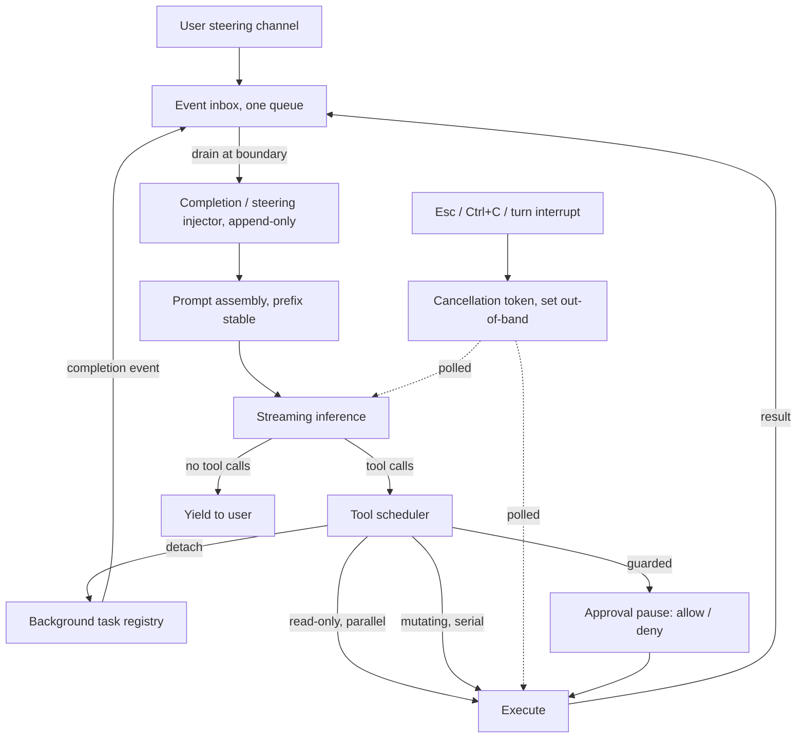

> [!info] Context
> Part of [[Harness-Internals-Overview|Harness Engineering Internals]], Level 2 wave. Parent chapter: [[Harness-Internals-Agent-Loop-Architecture]], which named the "interrupt/steering channel" and the "tool scheduler" as two of the six components of the execution engine but treated them as line items. This chapter takes them apart. It is the point where the tidy `assemble → call → execute` loop stops being a loop and becomes an *event loop* — the moment a background build can finish while the model is thinking, or a user can type mid-turn. It sits in Cluster B alongside [[Harness-Internals-Termination-Budgets-Loop-Control]] (which owns the *stop* side of loop control) and [[Harness-Internals-Durable-Execution]] (which owns crash-resume); this chapter owns *concurrency correctness while the agent is alive and running*.

# Schedulers, Background Tasks, and Mid-Turn Steering

## 1. Executive Overview

The ten-line agent loop in [[Harness-Internals-Agent-Loop-Architecture]] is a lie of omission. It is written as a strictly sequential program: assemble a prompt, call the model, run the tools it asked for, append, repeat. Every arrow points forward, nothing arrives from the side, and the only actor is the model. That description is accurate for a demo and wrong for every shipping harness, because two features that every serious harness has — **background tasks** (a build or a dev server that keeps running while the agent moves on) and **mid-turn steering** (the user typing a correction while the agent is working) — both introduce inputs that arrive *asynchronously*, at times the loop did not choose. The instant a second source of events exists, you no longer have a loop. You have a scheduler.

This is the reframing claim, stated up front: **the agent loop is a single-consumer event loop wearing a `while True` costume, and almost every subtle production bug in this area comes from engineers who kept thinking of it as a straight-line loop after it stopped being one.** A `while` loop has one input stream and one clock. An event loop merges *three* streams — model output, tool completions, and user steering — each on its own clock, and it must decide, at well-defined points, which to service next. The discipline of this chapter is the discipline of writing a correct event loop whose most expensive operation (inference) is *uninterruptible once dispatched*, whose side effects (file writes, network calls) are *not transactional*, and whose scheduling decisions are billed by the token.

Two hard problems fall out of that and organize everything below. First, **cancellation of a mid-mutation tool call**: the user hits Esc while the agent is halfway through writing a file or halfway through an in-flight API POST. You cannot `kill -9` your way to a clean state — you inherit the entire literature of cooperative cancellation, atomic writes, and idempotency, and most of it is thinly documented in the agent world because everyone rediscovered it independently. Second, **feeding asynchronous events back into a running turn without destroying the prompt cache**: the flat loop is economically viable *only* because unchanged prompt prefixes are cached (see [[Harness-Internals-Prompt-Assembly-Cache-Economics]]), and the naive way to inject a "your build finished" event — editing the context — is exactly the operation that invalidates that cache and can triple your bill. The correct designs for both problems are non-obvious, and getting either wrong produces failures that only appear under real concurrency, which is to say, only in production.

## 2. Historical Evolution

**Phase 0 — the human was the scheduler (2022–2023).** In the ChatGPT-copy-paste era, there was no scheduler because there was nothing to schedule: one synchronous request, one response, and a human deciding what happened next. Background work meant the human ran a build in another terminal. Steering meant the human edited their next message. The loop had exactly one input stream — the human — and the human was slow enough that concurrency never arose.

**Phase 1 — the synchronous tool loop (2023–2024).** The first ReAct-style agents and the early Claude Code / Codex CLIs ran the strictly sequential loop. Tool calls executed inline and blocking: the loop stopped, ran `npm test`, waited however long it took, appended the result, and only then called the model again. This is correct and simple, and it has one intolerable failure: a long-running command (a dev server that never exits, a ten-minute build) freezes the agent for its entire duration. The user sits watching a spinner while the model, which could be reasoning about the next step, is blocked on a subprocess. The demand for *not blocking on long tools* is what forced the first real scheduling decision.

**Phase 2 — background execution and the notification queue (2024–2025).** Harnesses learned to *detach* long tools. Claude Code shipped `run_in_background` on its Bash tool and a `Ctrl+B` binding to background a running command; the tool returns a task ID immediately, writes output to a file, and lets the loop continue. The moment a tool can finish *after* the turn that launched it, you need a way to get its result back into context — and that is a second input stream. The answer everyone converged on was a **notification queue drained at turn boundaries**: completed background tasks enqueue an event, and the harness injects those events into context just before the next inference. This is the exact seam where the loop became an event loop, and it was quiet enough that most write-ups still don't name it.

**Phase 3 — first-class steering and the async submit/event model (2025).** OpenAI's Rust rewrite of Codex (`codex-rs`) made the asynchronous structure *architectural* rather than incidental. Instead of a function that calls the model and returns, the core became a **submission queue / event queue** pair (Section 5): clients submit `Op`s (`Op::UserTurn`, `Op::Interrupt`, `Op::Shutdown`) and consume `EventMsg`s (`TurnStarted`, `AgentMessageDelta`, `ExecCommandBegin`/`End`, `PatchApplied`, `TokensUsed`, `TurnFinished`) — a decoupling documented in community teardowns of the codebase and in the app-server protocol. Codex's app-server protocol then exposed `turn/interrupt` (cancel an in-flight turn, which finishes with `status: "interrupted"`) and, crucially, `turn/steer` (append user input to an *already running* turn), making mid-turn steering a named protocol operation rather than a UI trick. Claude Code exposed the user side of the same capability: `Esc` to interrupt while "Claude keeps the work done so far," and queued input that merges at the next boundary.

**Phase 4 — the concurrency-correctness reckoning (2025–2026).** With background tasks and steering both shipping, the subtle bugs arrived, and they were exactly the bugs distributed systems predicted. Claude Code issue #11716 documented background-task completion notifications *accumulating* as stale system-reminders and burning 11.6× the normal token rate — a cache-and-state-tracking bug, not a model bug. Issue #29230 documented a server-side KV-cache regression where stale cached context made the model *resist user redirection*, "requiring 3–5 explicit interruptions instead of 1" — a steering failure caused directly by cache mechanics. Codex issue #20209 documented Ctrl+C taking 2–3 seconds to actually abort, exposing that cancellation is *cooperative*, not instantaneous, even in a Rust codebase. The field is now in the phase where it is importing the old answers on purpose: cooperative cancellation tokens, atomic-write patterns, idempotency keys, and hedged requests (Dean & Barroso's *The Tail at Scale*) are being explicitly adapted to agent tool execution.

The through-line: each phase added an asynchronous input stream, and each new stream created a class of race that the previous, more-sequential design had made impossible. The scheduler is the accumulated answer to "what do I do when two things want the loop's attention at once?"

## 3. First-Principles Explanation

Start from the sequential loop and ask the generative question: *what breaks the assumption that the loop is the only actor?*

```python
while True:
    resp = model.call(context)          # (1) the model produces
    if not resp.tool_calls:
        break
    for call in resp.tool_calls:
        result = execute(call)           # (2) the harness executes
        context.append(result)
```

Two assumptions are load-bearing and both are false in production. **Assumption A: `execute(call)` returns before the loop proceeds.** False for a dev server that never exits — you must be able to launch it and move on, which means `execute` sometimes returns a *handle* and the *actual result* arrives later. **Assumption B: nothing else touches `context` or wants the loop's attention between iterations.** False the moment a human can type while the model is mid-generation. Kill either assumption and you have introduced an event that is not produced by the loop itself. That is the definition of an event loop.

So reframe the harness honestly. It is a single-consumer scheduler servicing three producers:

- **The model**, producing tokens and tool-call requests (streamed, so it produces *incrementally*).
- **The environment**, producing tool completions — including *deferred* ones from backgrounded tasks that finish long after their launching turn.
- **The user**, producing steering input at arbitrary wall-clock times.

The scheduler's data model is therefore not "a program counter" but **a set of queues and a rule for when to drain each**. The minimal correct model:

```python
inbox = Queue()          # events from all three producers, tagged by source
state = "IDLE"           # IDLE | INFERRING | EXECUTING | WAITING_APPROVAL

# producers push:
#   ("model_chunk", delta)         from the streaming inference task
#   ("tool_done", handle, result)  from a completed (possibly background) tool
#   ("user_input", text)           from the steering channel
#   ("interrupt",)                 from Esc / Ctrl+C / turn/interrupt
```

Now every hard question in this chapter is a *scheduling* question about this inbox, and each has a first-principles answer:

**When can an event be serviced?** Not "whenever it arrives." Inference, once dispatched, is a black box you are billed for; the prompt is already on the wire. You physically cannot inject a token into a request that has left. Therefore user steering and tool completions can only be *acted on* at a **safe point**: a boundary the loop reaches between operations. The two natural safe points are *before the next inference* (inject queued events into the next prompt) and *between tool calls* (before dispatching the next one). Everything else is either impossible (mid-inference injection) or dangerous (mid-tool-call mutation).

**What does "cancel" even mean here?** Cancellation cannot be preemptive, for the same reason Go's `context` is "cooperative, not coercive": the runtime cannot safely rip a goroutine — or an in-flight `write()`, or a half-sent HTTP body — out of existence. Cancellation is *a signal the target must check and honor*. The loop sets a flag or closes a channel; the streaming reader, the subprocess supervisor, and the tool executor must each poll it and unwind cleanly. This is why Ctrl+C in Codex takes 2–3 seconds (#20209): the interrupt is *delivered* instantly but *honored* only when the in-flight stream reader next reaches a checkpoint.

**Why is the cache in the room?** Because the flat loop's economics depend on the prompt prefix being *byte-stable* across turns (see [[Harness-Internals-Runtime-Optimization]] and [[Harness-Internals-Prompt-Assembly-Cache-Economics]]). Causal attention means a KV cache is valid only up to the first token that differs from the cached prefix; change one token early in the context and every token after it must be recomputed. So *where* you inject an asynchronous event matters enormously: append it at the end (cheap, preserves the prefix) or splice it into the middle (catastrophic, invalidates everything downstream). The scheduler's injection policy is also a cache policy, and treating them separately is how you ship a feature that silently triples inference cost.

Those three answers — safe points, cooperative cancellation, append-don't-splice — are the entire spine of the chapter. The rest is mechanism, edge cases, and who implements them how.

## 4. Mental Models

**The event loop with an uninterruptible syscall.** The closest familiar structure is a classic single-threaded event loop (Node.js, a game loop, an OS scheduler) — one consumer, many event sources, a run-to-completion discipline. But there is one twist that makes the agent version genuinely harder than Node: the most expensive event handler, inference, is *both* long (seconds) *and* effectively uninterruptible once started (the request is remote and billed). It is as if `libuv` had one syscall that took ten seconds, could not be cancelled without wasting money already spent, and blocked injection of new events for its whole duration. Every scheduling decision bends around that one fact. Node handles slow I/O by making it async; the harness cannot make the model's *reasoning* async, so it schedules *around* inference boundaries instead of interrupting them.

**Reads commute, writes don't — now as a cancellation policy.** The parent chapter established the read/write distinction as the parallelism boundary. It reappears here as the *cancellation* boundary, and the reason is the same: commutativity. A cancelled read is free to abandon — you fetched nothing, or you fetched something and threw it away; the world is unchanged either way, so any interleaving is equivalent. A cancelled *write* is a correctness hazard, because a half-applied write leaves the world in a state that no correct sequential execution would ever produce: a file with the first 4 KB of new content and the last 2 KB of old, an API call that debited an account but never recorded the transfer. So the cancellation rule *is* the read/write rule: **abandon reads freely; drain, roll back, or make-atomic every write.** When you see a harness that cancels all in-flight tools identically, you are looking at one that will eventually corrupt a file.

**The mailbox, not the interrupt line.** Novices model steering as a hardware interrupt — a signal that preempts the CPU and runs a handler *now*. That model is wrong and produces wrong designs (people try to inject text mid-inference). The correct model is an **actor mailbox**: messages accumulate in a queue, and the actor processes each to completion before picking up the next. Steering is mail, not an interrupt. The user's "actually, don't touch the tests" lands in the mailbox immediately, but it is *read* at the next boundary, when the loop is between operations and can safely reconcile it. This is exactly Codex's `turn/steer`: it *appends* to the running turn's input stream; it does not preempt it. Holding the mailbox model in your head prevents an entire family of impossible designs.

**Cancellation is `SIGTERM`, never `SIGKILL`.** The Unix distinction is the whole lesson. `SIGKILL` is preemptive and unclean: the process dies mid-syscall, buffers unflushed, locks held. `SIGTERM` is cooperative: it asks the process to stop, and the process runs its cleanup handler — flush, release, checkpoint — then exits. Agent cancellation must be `SIGTERM`-shaped because the "process" is holding a half-written file and an open network socket. The 2–3 second Codex abort is the cost of doing `SIGTERM` correctly (letting the stream unwind) instead of `SIGKILL` (dropping it and possibly desyncing state). Slower-but-clean beats instant-but-corrupt every time a write is in flight.

## 5. Internal Architecture

The scheduler decomposes into six components. This refines the parent's "interrupt/steering channel" and "tool scheduler" line items into their actual internal parts.

- **Event inbox (submission queue).** A single queue that all producers push into, each event tagged by source and, critically, by *time of arrival* and *the turn/operation it targets*. Codex names this the submission queue and its element type `Op`; the documented variants include `Op::UserTurn`, `Op::Interrupt`, and `Op::Shutdown`, with the app-server protocol adding `turn/start`, `turn/interrupt`, and `turn/steer` on top.
- **Turn state machine.** Tracks whether the loop is `IDLE`, `INFERRING`, `EXECUTING`, or `WAITING_APPROVAL`, because *which events are legal and where they get serviced depends on the state*. Steering is accepted while `INFERRING` or `EXECUTING` (queued for the next boundary) but rejected for turn kinds that cannot absorb it — Codex explicitly refuses `turn/steer` for review turns and manual compaction turns, returning `invalid request`.
- **Cancellation token / scope.** A single shared cancellation signal per turn (a flag, a closed channel, a `CancellationToken`), propagated to every child operation: the streaming inference reader, each running subprocess, each in-flight network tool. This is the cooperative-cancellation spine borrowed wholesale from Go `context` and structured concurrency: the token is set once; every child polls it and unwinds.
- **Tool scheduler / dispatcher.** Classifies each requested call as read-only or mutating (keying off a `readOnlyHint`-style annotation, as in [[Harness-Internals-Tool-Calling-Internals]]), runs reads concurrently and writes serially, and — the new part here — decides whether a call runs *foreground* (blocking, result returns this turn) or *background* (detached, result returns via the completion queue). It also owns the *approval pause*: Codex can pause a turn mid-execution to ask the client `allow`/`deny` before a guarded tool runs, blocking on the answer.
- **Background task registry.** Tracks detached tasks: task ID, launching turn, process handle, output sink (Claude Code writes to a file the model retrieves with `Read`), and *lifecycle state*. This registry is where the #11716 bug lived — state that failed to clear after `KillShell`, so completion notifications kept regenerating.
- **Completion / steering injector.** The component that drains the inbox at safe points and turns queued events into context. Its single most important property is *cache-safety*: it must append at the tail (as a new user message or a trailing `system-reminder`) rather than mutate the prefix. It is the fuel line between the async world and the model's next prompt.

Here is the data flow, with the safe points marked. Note where the two asynchronous streams (background completions, user steering) *re-enter* the loop: only at the boundary, never mid-operation.



Two architectural invariants are worth stating flatly. First, **the asynchronous streams only enter through the inbox and only leave it at a boundary** — there is exactly one place events become context, and it is append-only. Second, **the cancellation token is orthogonal to the inbox**: it is not a queued event to be serviced later, it is an out-of-band flag that in-flight operations poll *now*. Conflating the two (putting "interrupt" in the same queue as "user typed a message" and only reading it at the next boundary) is precisely how you get a Ctrl+C that does nothing until the current tool finishes — the worst of both worlds.

## 6. Step-by-Step Execution

Walk two concrete scenarios end to end. The first is a background task reporting back; the second is mid-turn steering that lands while a mutating tool is in flight — the hard case.

**Scenario A — a background dev server, then a steer.** Prompt: *"Start the dev server, then fix the failing login test."*

1. **Turn 1, inference.** The model emits `Bash("npm run dev", run_in_background=true)`. The scheduler classifies it as long-running, detaches it, registers task `bg_1` with an output file, and returns to the model *immediately*: "started as background task bg_1." No blocking. The model's next context contains the handle, not the server's (never-arriving) final output.
2. **Turn 2, inference.** With the server running, the model runs `Bash("npm test -- login")` in the foreground (blocking), gets a failure, and reads the source. Meanwhile `bg_1` prints a compilation warning to its file. That warning is *not* injected mid-inference — it waits.
3. **Boundary drain.** Before assembling the prompt for turn 3, the injector drains the inbox. It finds a `bg_1` event ("server logged a warning"). It appends this as a trailing `system-reminder` at the *tail* of the context — after all prior turns, so the cached prefix (system prompt, tools, turns 1–2) is untouched and still a cache hit. Only the new reminder tokens are fresh.
4. **User steers.** As the model begins inference for turn 3, the user types "the test is fine, the bug is in the server." This lands in the inbox tagged `user_input`. The loop is `INFERRING`; the message is *not* injected into the in-flight request (the prompt already left). It is held.
5. **Next boundary.** Turn 3's inference completes (the model, not yet aware of the steer, proposed an edit to the test). At the boundary, the injector drains the steer and appends it as a user message. Turn 4's prompt now contains the correction. The model replans with full memory of everything it learned — no restart, no lost state — and pivots to the server. This is the parent chapter's "clean injection point" claim, made mechanical: it works because there is exactly one context and one consumer to reconcile.

**Scenario B — steering that races a mutating tool.** Prompt: *"Refactor `auth.ts` to use the new token API,"* and the user hits Esc while the model is mid-`Edit`.

1. **Inference.** The model emits `Edit(auth.ts, old_block, new_block)` — a mutating call. The scheduler serializes it and begins execution.
2. **The write starts.** The edit tool opens the target and begins writing. In a *naive* implementation it truncates `auth.ts` and streams new bytes directly into it; at this instant the file on disk is half old, half new — an inconsistent state.
3. **Esc arrives.** The user's interrupt sets the cancellation token. Here the design fork is total:
   - **Naive (wrong):** the harness kills the write immediately. `auth.ts` is now corrupt — half-written, non-compiling. The next turn's context does not reflect this; the model believes the file is either old or new, and reasons against a phantom. This is the parent's "steering race" failure and the reason the read/write split is a cancellation policy.
   - **Correct:** the edit was implemented as an **atomic write** — content written to a temp file in the same directory, `fsync`'d, then `rename`'d over `auth.ts` (an atomic filesystem operation). The cancellation token is checked at the *safe point before the rename*. If Esc landed before the rename, the temp file is discarded and `auth.ts` is *untouched* — the edit simply didn't happen. If Esc landed after the rename, the edit fully completed and the harness records it as done. There is no half state to inherit, because the only durable transition is the rename, and rename is atomic.
4. **Reconcile.** Now the crucial second half, which even careful implementations forget: **the model's next prompt must reflect the true final state.** If the edit was cancelled pre-rename, the harness appends a tool result like "Edit to auth.ts was cancelled by user; the file is unchanged," *then* the user's steering message. If it completed, "Edit applied," then the steer. Either way the model's world-model matches reality on the next inference. Skip this and the model plans against a stale world — the single most common steering bug after the cache one.
5. **Cancellation is not instant.** Even done correctly, honoring the interrupt takes time: the streaming inference reader must reach its poll checkpoint, the write must reach its safe point, buffers flush. Codex's 2–3 second abort (#20209) is this, visible. The UX lesson: show "stopping…" and mean it; do not promise instantaneous cancel you cannot deliver without corrupting state.

The contrast between A and B is the whole chapter in miniature. In A, everything asynchronous entered at a boundary and appended cleanly. In B, the danger was an event arriving *during* a mutation, and safety came entirely from making the mutation atomic and checking cancellation at a safe point — never from cancelling faster.

## 7. Implementation

Build the scheduler in layers on top of the naive loop from [[Harness-Internals-Agent-Loop-Architecture]] §7.

**The event inbox and the drained boundary.** The loop is restructured around a queue that all producers push into. Draining happens at exactly one place — before prompt assembly — so injection is always append-only:

```python
import asyncio

class Scheduler:
    def __init__(self):
        self.inbox = asyncio.Queue()
        self.cancel = asyncio.Event()      # the cooperative cancellation token
        self.bg = {}                        # task_id -> BackgroundTask

    async def run(self, session):
        while True:
            # 1. SAFE POINT: drain async events into context, append-only.
            self._drain_inbox_into(session)      # bg completions + queued steers
            ctx = assemble_prompt(session)        # prefix stays byte-stable

            # 2. Inference — cancellable, but expensive-if-wasted.
            self.cancel.clear()
            resp = await self._infer_cancellable(ctx)
            if resp is CANCELLED:
                session.append(system_note("Turn interrupted; partial work kept."))
                continue                          # loop back to safe point
            session.append(resp)
            if not resp.tool_calls:
                if not await self._steer_pending():   # nothing queued to replan on
                    return finalize(session)
                continue

            # 3. Dispatch tools — reads parallel, writes serial, cancel-checked.
            await self._dispatch(resp.tool_calls, session)
```

**Cancellable inference.** Streaming lets cancellation be *cooperative* rather than fire-and-forget: the reader polls the token between chunks. Cancelling discards tokens already paid for, so the harness prefers to let short inferences finish and only aborts long ones:

```python
    async def _infer_cancellable(self, ctx):
        chunks = []
        async for delta in model.stream(ctx):     # network stream
            if self.cancel.is_set():
                await model.abort()                # close the stream; billed-so-far is sunk
                return CANCELLED
            chunks.append(delta)
        return assemble(chunks)
```

**The tool dispatcher with a per-turn idempotency registry.** Reads run concurrently; writes serialize; every call checks the token *before* it starts (so a queued interrupt stops the *next* write, not a running one); and a per-turn registry deduplicates identical calls so a re-proposed or hedged call does not double-fire a side effect:

```python
    async def _dispatch(self, calls, session):
        seen = session.turn_tool_registry     # hash(name+canonical_args) -> result
        reads  = [c for c in calls if c.tool.read_only]
        writes = [c for c in calls if not c.tool.read_only]

        async def run(c):
            key = fingerprint(c)              # canonical JSON, sort_keys=True
            if key in seen:                   # dedup: never repeat a side effect
                return seen[key]
            if self.cancel.is_set() and not c.tool.read_only:
                return tool_result(c, "cancelled before execution; no change made")
            result = await execute_atomic(c, self.cancel)   # writes are atomic + cancel-safe
            seen[key] = result
            return result

        for r in await asyncio.gather(*[run(c) for c in reads]):
            session.append(r)
        for c in writes:                      # one at a time, order preserved
            session.append(await run(c))
```

**Atomic, cancellation-safe writes.** The mutating-tool cancellation problem is solved not in the scheduler but *in the tool*, by never leaving a durable half-state. For a file edit, that is the write-temp-then-rename pattern, with the cancellation check at the only reversible safe point — before the rename:

```python
import os, tempfile

async def edit_file_atomic(path, new_content, cancel):
    d = os.path.dirname(path) or "."
    fd, tmp = tempfile.mkstemp(dir=d)         # SAME directory -> rename is atomic
    try:
        with os.fdopen(fd, "w") as f:
            f.write(new_content)
            f.flush(); os.fsync(f.fileno())   # durable before we commit
        if cancel.is_set():                   # SAFE POINT: nothing committed yet
            os.unlink(tmp)
            return "cancelled; file unchanged"
        os.replace(tmp, path)                 # atomic commit (same filesystem)
        return "applied"
    except BaseException:
        try: os.unlink(tmp)
        except OSError: pass
        raise
```

For a *network* write (a POST that charges a card, files an issue, sends an email) there is no rename trick — you cannot un-send a request that already left. The only defense is an **idempotency key** derived from stable inputs (run ID + turn index + action type), so that a retry, a hedge, or a resumed-after-crash re-execution collapses to one effect server-side. This is the same discipline durable execution demands (see [[Harness-Internals-Durable-Execution]]); the crewAI report #5802 ("tool re-execution on task retry has no idempotency guard — duplicate payments, emails, trades possible") is the canonical failure of omitting it.

**Background task completion, cache-safely.** A detached task registers a handle and, on exit, enqueues a completion event that the *next* boundary drains and appends. The two design choices from Claude Code issue #6854 are (a) inject the completion as a trailing message and let the model decide when to read the full output, or (b) push a todo item and trigger generation. Both keep the injection at the tail:

```python
    def _drain_inbox_into(self, session):
        while not self.inbox.empty():
            ev = self.inbox.get_nowait()
            if ev.kind == "tool_done":        # background completion
                session.append_tail(system_reminder(
                    f"Background task {ev.task_id} exited (code {ev.code}). "
                    f"Output in {ev.sink}. Read it if relevant."))
            elif ev.kind == "user_input":     # queued steer
                session.append_tail(user_message(ev.text))
            self._gc_finished(ev)             # clear registry state — the #11716 fix
```

The `_gc_finished` call is not incidental. Claude Code #11716 was precisely the absence of it: killed tasks kept regenerating "still running / was killed / no longer running" reminders every turn because the registry state never cleared, accumulating ~2,500–4,000 tokens *per reminder per turn* and reaching 11.6× normal token consumption. The lesson is that background-task state is a resource that must be *reaped*, and the reaping must be idempotent (draining the same completion twice must not re-append it).

## 8. Design Decisions

**Why events are serviced at boundaries, not preemptively.** The alternative — interrupt inference the instant a steer arrives, restart with the new message — is simpler to reason about and almost always wrong. It throws away tokens already generated and paid for; it discards whatever the model had figured out this turn; and it invalidates the cache work of the in-flight request. Boundary-servicing keeps the model's partial progress ("Claude keeps the work done so far") and preserves the cache. The cost is latency: a steer issued mid-inference is not *acted on* until the current inference finishes, which at agentic context sizes can be tens of seconds. Harnesses accept that cost because the model replanning *with* the last turn's learnings beats it restarting *without* them. The escape hatch, for when the user wants to abandon the current direction entirely, is the *interrupt* path (Section 5's out-of-band token), which does cancel the in-flight inference — a deliberate, user-chosen forfeit of paid tokens, distinct from a steer.

**Steer vs. interrupt as two distinct operations.** Codex's protocol makes the distinction explicit and it is the correct design: `turn/steer` *augments* a running turn (keeps its context, appends input, no new turn started), while `turn/interrupt` *cancels* it (turn ends `interrupted`). Collapsing them into one "user typed something" event forces a single policy on two different intents. "Also check the config file" is a steer — the model should finish its thought and incorporate it. "Stop, you're on the wrong track" is an interrupt — the model should abandon and replan. A harness that treats every mid-turn message as an interrupt is jumpy and wastes tokens; one that treats every message as a steer cannot be stopped. You need both, keyed off intent (Codex keys off the operation; Claude Code keys off `Esc` vs. typing-then-Enter).

**Cooperative cancellation over preemptive.** Every mature system chose cooperative cancellation — Go's `context`, .NET's `CancellationToken`, structured-concurrency nurseries, Codex's `Op::Interrupt` — for the same reason: preemption cannot guarantee clean state. Ripping out a thread mid-`write()` or mid-request leaves partial mutations and leaked resources. Cooperative cancellation trades *promptness* for *safety*: the target keeps running until it reaches a checkpoint where stopping is clean. The visible cost is abort latency (Codex #20209, 2–3 s). The invisible benefit is that you never inherit a corrupt file. This trade is non-negotiable for anything holding a mutating resource; it is only debatable for pure-read operations, which *can* be abandoned preemptively because there is nothing to corrupt — which is why some harnesses abort read tools instantly and drain write tools cooperatively, applying the read/write split one more time.

**Background-by-default vs. foreground-by-default.** Should long tools auto-background, or wait for an explicit signal? Foreground-by-default (the Claude Code choice: you press `Ctrl+B` or ask) keeps the common case simple and legible — most tools are short and blocking is fine — and makes backgrounding a deliberate act for the genuinely long-running. Background-by-default would hide completion timing from the user and multiply the notification-injection surface (every tool becomes an async stream). The convergent choice is *foreground with easy escalation to background*, because backgrounding adds a whole async stream and its attendant races (#11716), and you only want that complexity where it pays — for the dev server, not the `ls`.

**Append-only injection vs. context rewriting.** The deepest decision, because it is where scheduling meets economics. When a background task finishes or the user steers, the *tempting* implementation edits the context to reflect new reality — updates a status line in the system prompt, rewrites a stale tool result. Every such mid-prefix edit invalidates the KV cache from the edit point forward (causal attention), re-inflating cost and latency by up to an order of magnitude on a large session — the Hermes and open-webui bug reports document exactly this, and the Claude Code #29230 regression is the mirror image (stale cache the injection *failed* to invalidate, so the model saw old context and resisted steering). The correct discipline is uniform: **never mutate the prefix to convey new information; always append at the tail.** New user message, trailing `system-reminder`, appended tool result — all cache-safe. Anthropic's task-budget design (see [[Harness-Internals-Termination-Budgets-Loop-Control]]) makes the same choice for a different signal: the budget countdown is injected server-side per turn precisely so it never has to live in — and mutate — the client's cached prefix. Any per-turn dynamic value that must reach the model is a cache landmine unless it rides at the tail.

## 9. Failure Modes

**Corrupted state from mid-mutation cancellation.** The headline failure. Esc lands mid-`Edit`; a non-atomic writer leaves the file half-written; the next turn reasons against a phantom. *Debug:* the interrupted turn's last tool was a mutating one, and the working tree does not match either the pre- or post-edit content. *Fix:* atomic writes (temp + `fsync` + `rename`) with the cancellation check before the commit point; for network writes, idempotency keys. Never solve it by cancelling faster — speed does not make a partial write whole.

**Stale world-model after interrupt.** The write was cancelled cleanly, but the harness forgot to tell the model, so the next inference assumes the edit applied (or didn't) incorrectly. *Debug:* the model references file contents that don't exist. *Fix:* after any cancellation, append a tool result stating the *true* final state before the user's steer, so the model's next prompt is grounded in reality.

**Cache obliteration by injection.** A steer or completion is spliced into the middle of the context (or written into the system prompt), invalidating the KV cache; per-turn latency jumps from ~2 s to minutes on a 20 K-token session and cost multiplies. *Debug:* cache-hit metrics collapse right after a steer or a background completion; billed input tokens spike. *Fix:* append-only injection at the tail; keep tool definitions and system prompt in a fixed order (the Hermes tool-shuffling bug); inject dynamic per-turn values server-side or at the tail, never in the cached prefix.

**Notification storm / stale-reminder accumulation.** Background-task state that never clears keeps re-injecting "still running / killed / gone" reminders every turn (Claude Code #11716), reaching 11.6× normal token consumption; 78% of message tokens become reminder overhead by exchange 10. *Debug:* token usage grows super-linearly with no new work; the same reminder text repeats across turns. *Fix:* idempotent reaping — drain each completion exactly once, clear registry state on kill/exit, and cap or dedupe reminders. A completion is an *edge*, not a *level*; inject it on the transition, not on every subsequent turn.

**The interrupt that isn't (queued instead of signalled).** An implementer puts "interrupt" in the same inbox as steers and only reads it at the next boundary, so Ctrl+C does nothing until the current tool finishes. *Debug:* cancellation feels dead during long tools. *Fix:* the cancellation token is out-of-band, polled by in-flight operations *now* — not a queued event serviced later. Keep it orthogonal to the mailbox.

**Cancellation that hangs.** The cooperative target never reaches its poll checkpoint (a tool blocked on a syscall with no cancellation support, a stream reader in a tight loop that doesn't check the token). *Debug:* "stopping…" never completes. *Fix:* every long operation must poll the token at a bounded interval, and there must be a *hard* escalation — a wall-clock deadline after which the harness force-kills the subprocess (accepting the state risk it was trying to avoid, because a hung agent is worse). Codex's 2–3 s abort is the acceptable version; an unbounded hang is the failure.

**Steering a turn that can't absorb it.** A steer arrives during a review turn or a manual compaction — operations whose structure cannot integrate free-form user input mid-flight. Codex returns `invalid request`; a naive harness might inject it anyway and corrupt the specialized turn's output. *Debug:* steering during a structured/specialized operation produces malformed results. *Fix:* the turn state machine gates which turn kinds accept steering (Codex's explicit rejection list), and the UI should reflect that the turn is un-steerable rather than silently dropping input.

**Hedged execution double-effect.** Two speculative attempts at a *write* both complete before the loser is cancelled, firing the side effect twice (duplicate issue filed, card charged twice). *Debug:* two identical external effects with near-simultaneous timestamps. *Fix:* hedge only idempotent operations, or gate the effect behind a shared idempotency key so the second attempt is a server-side no-op (Section 10).

## 10. Production Engineering

How the majors actually implement scheduling and steering, with epistemic labels.

**OpenAI / Codex** *(verified via app-server protocol docs and community teardowns of `codex-rs`; some internals are reverse-engineered).* The core is an explicit **submission-queue / event-queue** architecture: clients submit `Op`s and consume `EventMsg`s asynchronously, fully decoupling rendering from the engine ("the TUI subscribes to events; it does not call into the core engine synchronously"). Steering and cancellation are *first-class protocol operations*: `turn/steer` appends user input to a running turn (requires `expectedTurnId`; emits no new `turn/started`; rejected for review and manual-compaction turns), and `turn/interrupt` cancels the active turn, which finishes with `status: "interrupted"`. Interrupt does *not* auto-kill background terminals (a separate `thread/backgroundTerminals/clean` exists) — a deliberate separation of "cancel the reasoning" from "kill the side processes." A guarded tool can *pause* the turn for client `allow`/`deny` before running. *Verified failure:* Ctrl+C abort latency of 2–3 s (#20209), confirming cooperative (not preemptive) cancellation even in Rust. *Inference:* the cancellation token is a tokio-level signal propagated through the turn's task tree; the exact channel types are not officially documented, only described in teardowns.

**Anthropic / Claude Code** *(loop and UX verified via official docs; live scheduler internals reverse-engineered).* `Esc` interrupts the current response or tool call mid-turn, and the documentation states the invariant plainly — "Claude keeps the work done so far" — i.e., cooperative cancellation preserving partial progress, not a restart. Background tools: `run_in_background`/`Ctrl+B` detaches a Bash command, returns a task ID immediately, writes output to a file the model retrieves with `Read`, auto-cleans on exit, terminates on a 5 GB output cap, and (v2.1.193+) reaps idle background shells under OS memory pressure — a resource-governance layer on the async stream. Subagents can run in the background and be stopped with `Ctrl+X Ctrl+K` (twice within 3 s to confirm). A genuinely elegant detail: **`/btw` side questions "run independently and don't interrupt the main turn," reusing the parent conversation's prompt cache** — a read-only side channel that answers from existing context with no tools, so it neither blocks the loop nor breaks the cache. *Verified failure:* background completions injected as `system-reminder`s accumulating without reaping (#11716, 11.6× token waste, closed "not planned"), and a KV-cache regression where stale cached context made the model resist redirection, "requiring 3–5 explicit interruptions instead of 1" (#29230). Both are scheduling/cache bugs, not model bugs — evidence that this layer is where the subtle production failures live. Full product anatomy: [[Harness-Internals-Claude-Code-Architecture]].

**LangGraph** *(verified via docs).* Steering is expressed as **checkpointed interrupts**: `interrupt()` pauses the graph at exactly that line, persists the entire state snapshot via a checkpointer, and returns control; the caller resumes with `Command(resume=value)`, which becomes the return value of `interrupt()` inside the node. This is a fundamentally different shape from the flat loop's mailbox — it is *durable* pause/resume (the pause can outlive the process), at the cost of requiring a checkpointer and idempotent nodes (a resumed node re-runs from its start; see [[Harness-Internals-Durable-Execution]]). It is steering-as-persistence rather than steering-as-mailbox; the trade is durability and human-approval-gates-as-primitives versus the flat loop's simplicity and single-context reconciliation.

**AG2 / AutoGen** *(verified via docs, less mature in this area).* Provides `a_run_iter()` async iteration where a background thread blocks after each event until the consumer advances, plus human-in-the-loop hooks that can steer or interrupt a run, and a stated need for "a stable runtime contract for streaming messages and partial results, tool lifecycle (start → progress → finish/fail), and state snapshots while the run is still executing." The framing is right; the primitives are lower-level than Codex's named `turn/steer`.

**Hedged/tied requests from the systems canon** *(verified, Dean & Barroso, adaptation to agents is emerging).* *The Tail at Scale* is the source doctrine for speculative execution: **hedged requests** defer a duplicate until the first attempt exceeds the 95th-percentile latency, limiting extra load to ~5% while cutting the tail; **tied requests** enqueue on multiple servers that cancel each other on start (the client staggering sends by ~2× the average network delay), reducing median latency 16% and the 99.9th percentile 40% in Google's measurements. In an agent harness this maps to hedging a slow subagent or a flaky read tool — but *only* for idempotent operations, because the whole scheme relies on duplicate work being harmless, which reads are and writes are not (Section 8). The cross-domain lesson is exact: hedging is a read-side tail-latency tool, and the read/write split decides where it is safe.

The convergence is telling: everyone separates *steer* (augment, cache-preserving, boundary-serviced) from *interrupt* (cancel, out-of-band, cooperative), everyone injects async events append-only, and everyone's public bug tracker shows the same two failure families — cache invalidation and un-reaped async state. They differ mainly in whether steering is a mailbox (Codex, Claude Code) or a durable checkpoint (LangGraph), a choice that tracks whether the harness is optimized for interactive latency or for long-running durability.

## 11. Performance

**Inference is the uninterruptible cost center; scheduling exists to not waste it.** A tool dispatch is milliseconds to seconds; an inference at agentic context size is seconds to a minute and is billed whether or not you use the result. So the dominant performance rule of the scheduler is *never discard a completed inference you paid for* — which is exactly why steering is boundary-serviced (keep the in-flight inference) and why cancellation of *inference* is a reluctant, user-initiated forfeit rather than an automatic reaction to every steer.

**Cache stability is worth an order of magnitude, and injection is where you lose it.** The flat loop is economically viable only under prefix caching: on a ~20 K-token session, a cache hit turns per-turn latency from ~3 minutes of full prefill into ~2 seconds of processing just the new tokens (Hermes bug-report numbers), and Codex chose the Responses API partly for 40–80% better cache utilization in multi-turn use (parent chapter, §10). Every asynchronous injection is a chance to break that. Appending at the tail costs only the new tokens' prefill and preserves the hit; splicing into the prefix forces re-prefill of everything downstream. The performance delta between the correct and naive injection of a single "your build finished" event can be two orders of magnitude in that turn's input cost. This is why the injection policy is a *performance* decision as much as a correctness one.

**Background execution is a latency win, not a compute win.** Detaching a ten-minute build doesn't make it finish faster; it lets the model do useful work during those ten minutes instead of blocking. The win is *wall-clock overlap*: the agent's reasoning and the build's execution proceed concurrently. The cost is the notification-injection surface and its failure modes (#11716). The break-even is task duration: for a sub-second tool, backgrounding's overhead (registry, completion event, extra reminder tokens) exceeds any overlap benefit; for a multi-minute tool it is decisively worth it. This is the concrete performance reason for foreground-by-default with escalation.

**Hedging trades load for tail latency, quantified.** From *The Tail at Scale*: the 95th-percentile-deferral hedge buys most of the tail reduction for ~5% extra load, and tied requests cut the 99.9th percentile 40% for near-zero extra load (the cancellation reclaims the duplicate almost immediately). Applied to a subagent wave with a straggler (parent chapter §14, Q7), hedging the straggler is affordable *because reads tolerate redundancy* — the duplicate's wasted tokens are the ~5% load, and you take whichever returns first. On writes the calculus inverts: the "wasted" duplicate is a *second side effect*, not wasted tokens, so hedging is unsafe without idempotency keys, and the tail-latency benefit is usually not worth the correctness risk.

**Cancellation latency is a real, bounded cost.** Cooperative cancellation is not free — Codex's 2–3 s abort is the poll-and-unwind time. In an interactive UX this is the gap between pressing Esc and the prompt returning. It is bounded by the poll interval of the slowest in-flight operation, so the optimization is *tighter poll checkpoints* (check the token more often) traded against the per-check overhead. The right target is "fast enough to feel responsive, slow enough to unwind cleanly" — sub-second for reads, a few seconds for a draining write is acceptable, unbounded is a bug.

## 12. Best Practices

Each traces to a mechanism or failure above.

- **Model the loop as an event loop with one consumer and three producers.** Design the inbox, the safe points, and the drain policy explicitly. Pretending it is a straight-line `while` is the root of the subtle bugs.
- **Service async events only at boundaries; inject append-only.** New user message, trailing `system-reminder`, or appended tool result — never a mid-prefix edit. Keep tool and system-prompt order fixed. The injection policy *is* the cache policy.
- **Separate steer from interrupt.** Steer augments and is boundary-serviced and cache-preserving; interrupt cancels and is out-of-band and cooperative. Key them off explicit intent (operation type, or Esc vs. typed-message), and expose both.
- **Make the cancellation token out-of-band and polled, never queued.** In-flight operations must check it *now*, not at the next boundary. Keep it orthogonal to the event mailbox.
- **Make every mutating tool atomic and cancellation-safe.** Files: temp + `fsync` + `rename`, with the cancel check before the rename. Network writes: idempotency keys from stable inputs. Cancellation safety is a property of the *tool*, not the scheduler.
- **After any cancellation, reconcile the model's world-model.** Append the true final state (applied / unchanged / partial-then-rolled-back) before the next inference. A clean cancel with a stale prompt is still a bug.
- **Reap background-task state idempotently.** Inject a completion once, on the transition; clear registry state on exit/kill; cap and dedupe reminders. A completion is an edge, not a level (#11716).
- **Background by exception, not by default.** Foreground blocking tools; escalate to background only for genuinely long-running work where wall-clock overlap pays for the async complexity.
- **Hedge only idempotent operations.** Speculative/tied execution is a read-side tail-latency tool. On writes it double-fires side effects unless gated by an idempotency key.
- **Give cancellation a hard escalation deadline.** Cooperative-first, but force-kill after a bounded wall-clock timeout so a non-cooperating tool can't hang the agent forever.

Anti-patterns, named: injecting steering mid-inference (impossible / restart-and-lose-work); splicing events into the cached prefix (cache obliteration); treating every mid-turn message as an interrupt (jumpy, wasteful) or as a steer (unstoppable); `kill -9` cancellation of a mutating tool (corruption); background completions injected as levels not edges (#11716 storm); hedging a non-idempotent write (double effect); a cancellation path with no deadline (hang).

## 13. Common Misconceptions

**"Steering interrupts the model."** No — steering *queues* and merges at the next boundary; interrupting is a *separate* operation. The mental model is an actor mailbox, not a hardware interrupt line. A steer lands in the inbox immediately but is acted on when the loop is between operations and can safely reconcile it. Conflating the two produces designs that try to inject text into a request that has already left the machine.

**"Cancellation is instantaneous / just kill the operation."** Cancellation is cooperative, not preemptive, because the target may hold a half-written file or an open socket. The runtime *signals*; the operation *checks and unwinds*. Codex's 2–3 s abort is not a bug to be optimized to zero — it is the cost of unwinding cleanly. Preemptive kill of a mutating operation is how you corrupt state.

**"A cancelled edit either happened or didn't — no in-between."** Only if the edit was written atomically. A naive writer that truncates-then-streams *does* leave an in-between: half old, half new. The atomicity that makes "happened or didn't" true is something you must engineer (temp + rename), not a property you get for free.

**"Injecting a background-task result into context is trivial — just add a message."** *Where* you add it decides whether you keep or destroy the prompt cache, and *how many times* you add it decides whether you get a notification storm. Both the position (tail, not prefix) and the cardinality (once, on the edge) are load-bearing. The "trivial" version ships #11716.

**"Background tasks make the agent faster."** They make it *less blocked* — wall-clock overlap, not compute reduction. The build takes just as long; the agent simply isn't frozen during it. For short tools the async overhead makes the agent *slower*. Backgrounding is a latency-overlap tool with a duration break-even, not a speed-up.

**"Hedging a slow tool is a safe universal optimization."** Only for idempotent operations. *The Tail at Scale*'s hedging works because a duplicate read is harmless; a duplicate write is a second side effect. The read/write split gates where speculation is safe, exactly as it gates parallelism and cancellation.

## 14. Interview-Level Discussion

**Q1: Walk me through cancelling a tool call that is mid-mutation — a file half-written, or an HTTP POST in flight. How do you cancel without corrupting state?**
You cannot cancel the mutation preemptively without risking corruption, so you make the mutation *atomically committable* and cancel at the safe point before the commit. For a file: write the new content to a temp file in the *same directory*, `fsync` it, then `rename` over the target — rename is atomic on a single filesystem, so the only durable transition is all-or-nothing. Check the cancellation token *before* the rename: if set, discard the temp file and the original is untouched; if not, commit. There is no half-state because half-written bytes live only in the throwaway temp file. For a network write there is no rename analogue — the request, once sent, cannot be un-sent — so the defense shifts to *idempotency keys* derived from stable inputs (run ID + turn + action), making a retry or a hedge collapse to one server-side effect. Then, either way, the second half everyone forgets: append the *true* final state to context ("edit cancelled, file unchanged" / "applied") so the model's next inference isn't reasoning against a phantom. Cancellation is cooperative throughout — the token is signalled instantly but honored at the next safe checkpoint, which is why clean aborts take a beat (Codex's 2–3 s). The read/write split is the organizing principle: reads you abandon freely, writes you make atomic or idempotent.

**Q2: Design mid-turn steering. What are the hard parts, and how does it interact with the prompt cache?**
Steering is a mailbox, not an interrupt: the user's message lands in an inbox tagged by source and target turn, but it is *acted on* only at a safe point — the next prompt-assembly boundary — because you cannot inject into an inference already on the wire. Four hard parts. (1) Injection point: boundary-servicing preserves the model's in-flight work and the cache but adds latency (the steer waits out the current inference); an interrupt path exists for "abandon now," a deliberate token forfeit. (2) Steer vs. interrupt as distinct operations — augment vs. cancel — keyed off intent, as Codex splits `turn/steer` from `turn/interrupt`. (3) Cache: the steer must be *appended at the tail* (a new user message), never spliced into the prefix or written into the system prompt, because causal attention invalidates the KV cache from the first changed token — the difference between a 2-second and a multi-minute turn on a 20 K-token session. (4) Reconciliation: if the steer accompanies a cancelled tool, the appended context must reflect the tool's true final state. The single-threaded loop makes all four tractable because there is exactly one context and one consumer to reconcile — an underrated argument for the flat loop over parallel workers, which have no clean injection point.

**Q3: How does a background task report back into a running turn without breaking the cache, and what goes wrong at scale?**
The task detaches, registers a handle, and on exit enqueues a completion event. The loop drains that queue at the next boundary and *appends* the completion at the tail — a trailing `system-reminder` or a new message — so the cached prefix (system prompt, tools, prior turns) is byte-stable and still a cache hit; only the reminder's tokens are fresh. Two things go wrong at scale. First, cardinality: if you inject the completion as a *level* ("task still running") every turn instead of an *edge* (once, on exit), you get Claude Code #11716 — reminders accumulating to 11.6× normal token consumption because state never reaped. The fix is idempotent reaping: drain each completion exactly once, clear registry state on kill/exit. Second, position: any temptation to *update* an existing status line in place mutates the prefix and obliterates the cache. The discipline is uniform — completions are edges, injected once, at the tail. Anthropic generalizes it for the budget countdown by injecting it server-side per turn so it never touches the client's cached prefix.

**Q4: When is hedged (speculative) execution safe in an agent harness, and when does it blow up?**
Hedging — run a duplicate, take the first to return — is safe exactly when the operation is *idempotent*, which for agents means *reads*. *The Tail at Scale* gives the recipe: defer the hedge until the first attempt passes the 95th-percentile latency (extra load ~5%), or use tied requests that cancel each other on start (Google measured 40% off the 99.9th percentile for near-zero extra load). Applied to a straggler subagent doing research, hedging is cheap insurance: the duplicate's tokens are the ~5% tax, and redundant *reads* just compose. It blows up on *writes*: two hedged attempts that both complete before the loser cancels fire the side effect twice — duplicate payment, duplicate issue, duplicate email (crewAI #5802). So the rule is the read/write split again: hedge reads freely; hedge writes only behind a shared idempotency key that makes the second effect a server-side no-op, and usually don't bother because the correctness risk rarely justifies the tail-latency gain.

**Q5: Why is the agent loop "really" an event loop, and what specifically becomes hard because of that?**
The naive loop assumes one actor (the model) and one forward-flowing input stream. Two features break that: background tasks (a completion arrives *after* its launching turn) and mid-turn steering (the user produces input at an arbitrary wall-clock time). Each adds an asynchronous producer, and the moment you have more than one producer you have a scheduler, not a loop — with a mailbox and a rule for when to drain it. What becomes hard is everything that concurrency makes hard: races (a steer arriving during a mutation), ordering (which of two events serviced first), and the fact that the most expensive operation is uninterruptible-once-started and billed. The scheduler's answers are safe points (act on async events only at boundaries), an out-of-band cooperative cancellation token (orthogonal to the mailbox), and append-only injection (to protect the cache). The tell that someone still thinks it's a loop: they try to inject steering into a running inference, or they cancel a write with `kill -9`, or they splice a status update into the prefix. All three are event-loop category errors dressed as loop code.

**Q6: Your cancellation sometimes takes 3 seconds and sometimes hangs forever. Diagnose and fix.**
The 3-second case is *correct* cooperative cancellation: the token is signalled instantly, but the in-flight stream reader and the tool executor only honor it at their next poll checkpoint, then unwind (flush buffers, discard temp files). That's the Codex #20209 behavior and it's the price of clean state — optimize it by tightening poll intervals, not by preempting. The *hang* is a different bug: some operation never reaches a poll checkpoint — a subprocess blocked on a syscall with no cancellation support, or a tight loop that doesn't check the token. Two fixes, layered. First, make every long operation poll the token at a bounded interval (structured-concurrency discipline: children check the parent's cancel scope). Second, add a *hard escalation deadline* — after N seconds of cooperative cancellation, force-kill the subprocess, accepting the state risk because a hung agent is strictly worse than a possibly-messy one. Cooperative-first with a preemptive backstop is the standard shape; cooperative-only with no deadline is the hang you're seeing.

## 15. Advanced Topics

**Speculative tool execution and prefetch.** Beyond hedging stragglers, harnesses can *speculatively* run the tool the model is *likely* to call next — prefetch the file it usually reads after a test failure — and discard the result if the model asks for something else. This is branch prediction for agents. It is safe only for reads (a mispredicted write is a real side effect) and pays only when the predicted-correct rate times the saved latency exceeds the wasted-read cost. The open problem is a good predictor: today it would be heuristic ("after a failing test, prefetch the source"), tomorrow potentially a small model trained on tool-transition sequences.

**Differential context injection.** The append-only discipline keeps the cache but still re-sends the whole (cached) prefix conceptually each turn. The efficiency frontier (parent chapter §15, and the "Stop Wasting Your Tokens" line of work) asks whether async events could be injected as *diffs* against a shared cache the provider holds, so a background completion updates the model's view without re-transmitting or re-prefilling. This is KV-cache-level sharing applied to the scheduler's injection path — nascent, provider-dependent, and entangled with how much cache state the API exposes.

**Durable steering across crashes.** LangGraph's checkpointed `interrupt()` already makes a *pause* survive process death. The frontier is making *steering itself* durable in a flat loop: a steer issued while the agent is mid-turn, the process crashes, and on resume the steer is still pending and correctly ordered against the recovered turn state. This is the intersection of this chapter and [[Harness-Internals-Durable-Execution]] — the event inbox becomes part of the event-sourced log, and replay must reconstruct not just the turn but the pending async events, deterministically.

**Preemptive-but-safe cancellation via transactional tools.** The cooperative-cancellation tax (abort latency) exists because tools hold non-transactional resources. If every mutating tool were *fully transactional* — a write-ahead log, a two-phase commit, a filesystem snapshot per turn — cancellation could be preemptive *and* safe: roll back the transaction. Claude Code's checkpointing/rewind (restore code to a previous point) gestures at this; a full version would make every turn a transaction with a durable rollback, at the cost of snapshot overhead per turn. Whether the overhead is worth removing the abort latency is an open engineering trade.

**Multi-client steering and conflict.** Codex's decoupled submit/event model allows *multiple* clients to observe one session. The unexplored hard case is multiple clients *steering* one session concurrently — two humans, or a human and an automated supervisor, both pushing input to the same running turn. Now the mailbox has contending writers and you inherit concurrency control (ordering, last-writer-wins vs. merge, conflicting corrections). No harness handles this well yet; it is where agent scheduling meets collaborative-editing (CRDT/OT) theory.

## 16. Glossary

- **Event loop (agent sense)**: the agent loop once it services more than one input stream (model output, tool completions, user steering); a single-consumer scheduler, not a straight-line `while`.
- **Submission queue / event queue (SQ/EQ)**: Codex's architecture where clients submit `Op`s and consume `EventMsg`s asynchronously, decoupling the engine from rendering.
- **Op / EventMsg**: Codex's operation and event types. Ops include `UserTurn`, `Interrupt`, `Shutdown`; events include `TurnStarted`, `AgentMessageDelta`, `ExecCommandBegin`/`End`, `PatchApplied`, `TokensUsed`, `TurnFinished`.
- **Steering**: injecting user input into a *running* turn so the agent course-corrects without restarting; queued in a mailbox and serviced at a boundary. Codex's `turn/steer`; Claude Code's queued input.
- **Interrupt**: cancelling the active turn (distinct from steering); out-of-band, cooperative. Codex's `turn/interrupt` (turn ends `interrupted`); Claude Code's `Esc`.
- **Safe point / boundary**: a moment between operations (before the next inference, between tool calls) where async events can be serviced without racing an in-flight operation.
- **Cooperative cancellation**: cancellation signalled by a shared token that in-flight operations poll and honor by unwinding cleanly — as opposed to preemptive kill. The Go `context` / `CancellationToken` model.
- **Cancellation token / scope**: the per-turn shared signal (flag, closed channel) propagated to every child operation; out-of-band, orthogonal to the event mailbox.
- **Atomic write**: writing to a temp file in the same directory, `fsync`, then `rename` over the target, so a crash or cancel leaves either the old or the new file, never a half-written one.
- **Idempotency key**: a stable identifier (run ID + turn + action) sent with a side-effecting call so retries/hedges/resumes collapse to one server-side effect.
- **Background task**: a tool detached to run past its launching turn, returning a handle immediately and its result later via the completion queue. Claude Code's `run_in_background`.
- **Completion / notification queue**: the queue background completions enqueue into, drained and appended to context at the next boundary.
- **Append-only injection**: adding async events at the tail of context (new message, trailing reminder) to preserve the cached prefix, never mutating the prefix.
- **Edge vs. level (injection)**: injecting a state *transition* once (edge) versus re-injecting a *condition* every turn (level); the level anti-pattern causes notification storms.
- **Hedged request**: sending a duplicate of a slow request (deferred past the 95th-percentile latency) and taking the first response; safe only for idempotent operations. From *The Tail at Scale*.
- **Tied request**: enqueuing on multiple servers that cancel each other once one starts processing; near-zero extra load, large tail-latency reduction.

## 17. References

- **OpenAI Codex — app-server protocol README** (https://github.com/openai/codex/blob/main/codex-rs/app-server/README.md) — The authoritative spec for `turn/start`, `turn/interrupt` (status `interrupted`), and `turn/steer` (`expectedTurnId`, rejection of review/compaction turns, no new `turn/started`). Read this to see steering and cancellation as *named protocol operations* rather than UI behaviors.
- **Codex Knowledge Base — "Inside the Codex Agent Loop" and "The codex-rs Architecture"** (https://codex.danielvaughan.com/2026/03/28/codex-agent-loop-deep-dive/ and https://codex.danielvaughan.com/2026/03/28/codex-rs-rust-rewrite-architecture/) — Community teardowns of the submission-queue/event-queue model, `Op`/`EventMsg` variants, and the decoupled submit/event architecture. Read for the internal shape the official docs don't spell out (treat as reverse-engineered, not vendor-confirmed).
- **Codex issue #20209 — "long time to abort after Ctrl+C"** (https://github.com/openai/codex/issues/20209) — Concrete evidence that cancellation is cooperative (2–3 s), not preemptive, even in Rust. Read to internalize why clean cancellation costs latency.
- **Claude Code Docs — Interactive mode** (https://code.claude.com/docs/en/interactive-mode) — `Esc` interrupt ("keeps the work done so far"), `Ctrl+B` backgrounding, `Ctrl+X Ctrl+K` subagent stop, and the `/btw` cache-reusing side channel. Read for the user-facing surface of steering, cancellation, and background execution.
- **Claude Code issue #11716 — background-task reminder storm** (https://github.com/anthropics/claude-code/issues/11716) — The canonical failure of injecting background completions as *levels* not *edges*: 11.6× token waste from un-reaped state. Read before building any notification-injection path.
- **Claude Code issue #6854 — background completion notification design** (https://github.com/anthropics/claude-code/issues/6854) — The two design options (todo-queue-then-generate vs. chat-history injection) for reporting background completions back into a turn. Read for the design space.
- **Claude Code issue #29230 — KV-cache stale-context regression** (https://github.com/anthropics/claude-code/issues/29230) — Steering failure caused by cache mechanics: stale cached context makes the model resist redirection ("3–5 interruptions instead of 1"). Read to see the cache/steering interaction as a first-class correctness concern.
- **Dean & Barroso — "The Tail at Scale"** (https://cacm.acm.org/research/the-tail-at-scale/) — The source doctrine for hedged and tied requests: 95th-percentile deferral (~5% load), tied-request cancellation (40% off the 99.9th percentile). Read to ground speculative/hedged tool execution in the systems canon.
- **LangGraph Docs — Interrupts** (https://docs.langchain.com/oss/python/langgraph/interrupts) — Steering-as-durable-checkpoint: `interrupt()` + `Command(resume=...)` + checkpointer. Read to contrast the mailbox model (Codex/Claude Code) with the persistence model.
- **The Go Blog / go.dev — "Canceling in-progress operations" and context docs** (https://go.dev/doc/database/cancel-operations) — The cooperative-cancellation model in its clearest form: contexts signal, they don't coerce; the callee must check `Done()` and clean up. Read for the theory under agent cancellation.
- **Practitioner writeups on idempotent agent tools** (e.g., https://www.channel.tel/blog/idempotent-tool-calls-agent-retry-safety and crewAI issue #5802, https://github.com/crewAIInc/crewAI/issues/5802) — Idempotency keys, per-turn tool-call registries, state-check-write, and the duplicate-side-effect failure. Read before enabling any retry or hedge on a write tool.

## 18. Subtopics for Further Deep Dive

### Cache-Safe Context Injection Mechanics
- **Slug**: Scheduling-Cache-Safe-Injection
- **Why it deserves a deep dive**: This chapter asserted "append-only, never mutate the prefix," but the full mechanism — exactly how tokenization boundaries, tool-definition ordering, and server-side vs. client-side injection interact with each provider's cache implementation — is a chapter of its own, tightly coupled to [[Harness-Internals-Prompt-Assembly-Cache-Economics]].
- **Has enough depth for a full chapter**: yes
- **Key questions to answer**: How do Anthropic, OpenAI, and open-source inference servers differ in where a prefix cache breaks? What is the exact cost model of a mid-prefix edit vs. a tail append at various context sizes? How do you inject a per-turn dynamic value (budget, timestamp, background status) without ever touching the cached prefix?

### Transactional Tool Execution and Rollback
- **Slug**: Scheduling-Transactional-Tools
- **Why it deserves a deep dive**: The cooperative-cancellation tax exists only because tools hold non-transactional resources. A full treatment of write-ahead logs, per-turn filesystem snapshots, and two-phase commit for agent tools — enabling preemptive-but-safe cancellation and clean rollback — is a distinct engineering discipline touching [[Harness-Internals-Durable-Execution]] and Claude Code's checkpointing.
- **Has enough depth for a full chapter**: yes
- **Key questions to answer**: What does exactly-once tool execution require under cancellation *and* crash? How much overhead does per-turn snapshotting cost, and when is it worth removing abort latency? How do you compose transactional file edits with non-transactional network side effects in one turn?

### Speculative and Prefetched Tool Execution
- **Slug**: Scheduling-Speculative-Execution
- **Why it deserves a deep dive**: Hedging stragglers is the simplest form; speculative *prefetch* of the model's likely-next tool call (branch prediction for agents) is an open efficiency frontier that this chapter only gestured at, with real trade-offs in predictor quality and wasted-read cost.
- **Has enough depth for a full chapter**: yes
- **Key questions to answer**: What predicts the next tool call well enough to prefetch profitably? How do you bound wasted speculative reads? Where does speculation compose with the read/write safety split, and can any write ever be speculated safely?

### Multi-Client and Collaborative Steering
- **Slug**: Scheduling-Multi-Client-Steering
- **Why it deserves a deep dive**: Codex's decoupled submit/event model already allows multiple clients to observe one session; concurrent *steering* by multiple actors (two humans, or a human plus an automated supervisor) is unhandled and drags in collaborative-editing theory (ordering, conflict resolution, CRDT/OT).
- **Has enough depth for a full chapter**: yes
- **Key questions to answer**: How should contending steers to one running turn be ordered and merged? Is last-writer-wins acceptable, or do corrections need CRDT-style merge? How does an automated supervisor's steering compose with a human's without oscillation?
