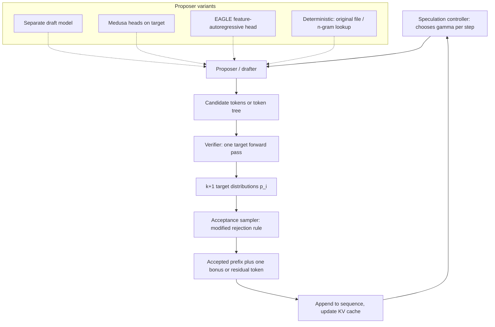

> [!info] Context
> Part of [[Harness-Internals-Overview|Harness Engineering Internals]], Level 2 wave. Parent chapters: [[Harness-Internals-Runtime-Optimization]] (which derived why decode is memory-bandwidth-bound and named speculative decoding as the fix) and [[Harness-Internals-Cursor-AI-IDE-Architecture]] (which introduced Cursor's speculative edits as task-format/serving co-design). This chapter is the theory core those two chapters deferred: the proof that speculation is quality-safe, the mechanics of verifying many tokens in one pass, the EAGLE-class draft heads, and the deterministic code-editing variant — plus the failure mode both parents flagged but did not resolve, namely when speculation *hurts* under continuous batching.

# Speculative Decoding: Theory and the Code-Editing Variant

## 1. Executive Overview

Speculative decoding is the rare optimization that is both provably free of quality cost and, deployed wrong, a throughput regression. Those two facts are the whole chapter. The first is a theorem — a modified rejection-sampling rule guarantees the tokens you emit are distributed *exactly* as the large model would have emitted them, so no provider ever has to tell you speculation is on. The second is an economic reality the theorem hides: speculation spends extra floating-point work to buy latency, and floating-point work is only free when the GPU is idle. In a lightly loaded single-stream decode, the GPU is drowning in idle compute and speculation is close to a strict win. In a busy continuous-batching server at batch 32, the GPU is already compute-saturated, and every rejected draft token is compute stolen from other users. The same technique is a 2.7x speedup and a 1.3x speedup on the same hardware depending only on how many requests are in flight.

The reframing for someone who thinks they understand speculative decoding: **it is not a decoding trick, it is arithmetic-intensity arbitrage.** [[Harness-Internals-Runtime-Optimization]] established that decode reads all the model's weights from HBM to produce a single token, doing ~2 FLOPs per parameter while the hardware wants ~200 — so the tensor cores sit idle waiting on memory. Speculative decoding notices that the weights get read *whether you verify one token or ten*, and fills the idle compute with the verification of drafted tokens. When that idle compute exists, speculation is nearly free; when batching has already consumed it, speculation is a tax. Everything else — the rejection-sampling proof, EAGLE's feature-level heads, tree attention, Cursor's deterministic edits, the goodput schedulers — is machinery built on top of that single observation.

This chapter owns the *decoding-layer* mechanism. It does not re-derive the memory-bandwidth math ([[Harness-Internals-Runtime-Optimization]] §3 does that) or the KV-cache paging that speculation shares GPU memory with. It takes "decode is memory-bound at low batch" as given and asks: exactly how do you exploit it, exactly why is it correct, and exactly when does it stop working.

## 2. Historical Evolution

**Before speculation: the sequential-dependency wall (through 2022).** Autoregressive generation is intrinsically serial — token *t+1* cannot be computed until token *t* is chosen, because *t* is fed back as input. Every latency optimization before 2022 attacked constants: better kernels, quantization, smaller models, KV caching to avoid recomputation. None broke the sequential dependency itself. A 70B model on one GPU decodes at roughly 24 tokens/second no matter how good your kernels are (the derivation is in [[Harness-Internals-Runtime-Optimization]]), because that number is set by weight-read bandwidth, and you read all the weights once per token.

**The two-paper birth (late 2022–early 2023).** Two groups independently published the same core idea within months. Leviathan, Kalman, and Matias at Google Research posted "Fast Inference from Transformers via Speculative Decoding" (arXiv 2211.17192, Nov 2022), and Chen et al. at DeepMind posted "Accelerating Large Language Model Decoding with Speculative Sampling" (arXiv 2302.01318, Feb 2023). Both: use a cheap draft model to guess several tokens, verify them with the target model in *one parallel forward pass*, and — the crucial contribution — accept them with a rejection rule that provably preserves the target distribution. Leviathan reported 2x-3x on T5-XXL; Chen reported 2x-2.5x on Chinchilla 70B. That both teams converged on the identical modified-rejection-sampling rule is a strong signal it is the *right* rule, not one of many — a point §8 returns to.

**Eliminating the draft model (2023–2024).** A separate draft model is operationally annoying: a second set of weights resident in GPU memory, a compatible tokenizer, its own serving path. Three lineages removed it. **Medusa** (Cai et al., arXiv 2401.10774, early 2024) bolted extra prediction heads onto the target model itself. **Lookahead decoding** (Fu et al., arXiv 2402.02057, Feb 2024) used Jacobi iteration to generate and verify n-grams inside the target's own forward pass. **Prompt-lookup / n-gram decoding** (Apoorv Saxena, 2023) threw out learned prediction entirely and drafted by copying n-grams already present in the prompt. Simultaneously, **SpecInfer** (Miao et al., arXiv 2305.09781) generalized single-sequence verification to *token trees* — verifying many candidate branches in one pass via a topology-aware attention mask.

**The EAGLE line and feature-level drafting (2024–2025).** The SafeAILab group's EAGLE papers (EAGLE-1 arXiv 2401.15077; EAGLE-2 arXiv 2406.16858; EAGLE-3 arXiv 2503.01840) reframed the draft as autoregression over the target's *hidden features* rather than its tokens, pushing acceptance rates from Medusa's ~0.6 toward ~0.8 and speedups toward 5-6x. EAGLE-3 is, as of 2026, the default learned speculator in vLLM, SGLang, and TensorRT-LLM.

**The product variant and the batching correction (2024–2025).** Cursor shipped deterministic speculative edits — the original file as a zero-cost draft — hitting ~1000 tokens/second on a fine-tuned Llama-3-70B ("Editing files at 1000 tokens per second," Oct 2024). Zed independently did the same with vLLM's n-gram speculation for its Zeta edit model. And the research community published the correction that the early papers' single-stream framing had obscured: Su et al.'s "The Synergy of Speculative Decoding and Batching" (arXiv 2310.18813) showed the speedup collapses as batch size grows, and the TurboSpec/SmartSpec goodput work (arXiv 2406.14066) built schedulers that turn speculation *off* under load. MagicDec (arXiv 2408.11049) then showed the collapse *reverses* again at long context. The technique's story is now three acts: it works, it stops working under load, and it works again when the KV cache — not the weights — becomes the bottleneck.

## 3. First-Principles Explanation

### The problem restated precisely

Generating a token requires a forward pass. A forward pass over the target model costs one full read of its weights from HBM (~140 GB for a 70B in fp16), which dominates wall-clock at low batch. The forward pass *also* has enormous unused parallel compute — the tensor cores can do hundreds of FLOPs per byte moved but decode asks for ~2. So the per-token latency is set by "read all weights," and the compute to process *one* token versus *several* tokens in that same pass is roughly equal, because both are dwarfed by the memory traffic. This is the exploitable asymmetry: **a forward pass that verifies k tokens costs almost the same wall-clock as one that produces 1, as long as k is small enough that compute stays under the memory-bound ceiling.**

### The core move

If you already had k candidate tokens, you could verify all of them in a single target forward pass — feed the target `prefix + [x1, x2, ..., xk]`, and because of the causal attention mask, the target produces a next-token distribution at *every* position simultaneously: the distribution after `prefix`, after `prefix+x1`, after `prefix+x1+x2`, and so on. One weight-read, k+1 distributions. If the candidates are good, you accept several tokens for the price of one pass.

Where do the candidates come from? A cheap **draft** — a small model, an extra head, or a deterministic guess. The draft is allowed to be wrong; that is what the verification is for. The entire design space is "what makes a good cheap draft," and the entire correctness question is "how do you accept/reject candidates without changing the output distribution."

### Why you cannot just accept the draft's tokens

The naive version — draft k tokens, keep the ones the target "agrees with" by argmax — only works for greedy decoding and even then only by luck of definition. Under sampling (temperature > 0), the target is a *distribution*, not a single answer. If you sampled from the draft's distribution q and kept the token whenever the target's distribution p assigns it nonzero probability, you would over-represent tokens the draft likes and under-represent tokens the target likes but the draft rarely proposes. The output would be sampled from something between p and q, not from p. Some early informal schemes did exactly this and quietly changed the distribution. The contribution of Leviathan and Chen was a rule that provably does not.

### The acceptance rule

Let `p(x)` be the target model's probability for token x at this position, and `q(x)` the draft's. Draw a candidate x from the draft, `x ~ q`. Then:

- **If `p(x) >= q(x)`**: accept x unconditionally. (The target likes this token at least as much as the draft; keeping it cannot over-represent it.)
- **If `p(x) < q(x)`**: accept x with probability `p(x) / q(x)`, and otherwise reject. (The draft over-proposed this token; accept it only in proportion to how much less the target wanted it.)
- **On rejection**: do not fall back to a plain target sample. Sample the replacement from the *residual* distribution `p'(x) = norm(max(0, p(x) - q(x)))` — the target's probability mass that the draft failed to cover, renormalized.

Equivalently and more implementably: draw `r ~ Uniform[0,1]`, accept if `r < min(1, p(x)/q(x))`. Leviathan states it as: sample from q, "keeping it if q(x) <= p(x), and in case q(x) > p(x) we reject the sample with probability 1 - p(x)/q(x)." Chen's Theorem 1 is titled, in the paper, "Modified Rejection Sampling recovers the target distribution."

### Why the rule is exact — the proof a strong engineer can verify

The claim is: the token this procedure emits at each position is distributed *exactly* as `p`. Prove it by computing `P(emit = x')` for an arbitrary token x' and showing it equals `p(x')`. There are exactly two disjoint ways to emit x':

**Path 1 — x' was drafted and accepted.** You draft x' with probability `q(x')`, and accept it with probability `min(1, p(x')/q(x'))`. So:

```
P(drafted x' and accepted) = q(x') * min(1, p(x')/q(x')) = min(q(x'), p(x'))
```

That algebra is the crux: `q * min(1, p/q) = min(q, p)`. If `p >= q`, the min is 1 and you get `q`... wait, check: `min(q,p) = q` when `p>=q`. And `q * min(1,p/q) = q*1 = q`. Consistent. If `p < q`, `min(1,p/q)=p/q`, and `q*(p/q)=p=min(q,p)`. Consistent. So Path 1 contributes exactly `min(p(x'), q(x'))`.

**Path 2 — some draft token was rejected, and the residual resample produced x'.** The total probability that *a* rejection happens is `1 - β`, where `β = sum_x min(p(x), q(x))` is the acceptance probability (the overlap of the two distributions). When a rejection happens, you sample from `p'(x') = max(0, p(x') - q(x')) / Z` where `Z = sum_x max(0, p(x) - q(x))`. The elegant fact is `Z = 1 - β` exactly — because `sum_x max(0, p-q) = sum_x (p - min(p,q)) = 1 - sum_x min(p,q) = 1 - β`. So the normalizer of the residual equals the total rejection probability, and they cancel:

```
P(rejection, then resample x') = (1 - β) * p'(x')
                               = (1 - β) * max(0, p(x') - q(x')) / (1 - β)
                               = max(0, p(x') - q(x'))
                               = p(x') - min(p(x'), q(x'))
```

**Sum the two disjoint paths:**

```
P(emit x') = min(p(x'), q(x')) + [p(x') - min(p(x'), q(x'))] = p(x')
```

QED. Leviathan proves this as Theorem 3.5 (with the supporting lemma in Appendix A.1); Chen as Theorem 1. The whole trick is that the residual's renormalization constant is precisely the leftover rejection probability, so the two paths compose back into `p`. Nothing about model size, architecture, or draft quality enters the proof — only that `p` and `q` are valid distributions over the same vocabulary. That generality is why it is safe to deploy silently and why draft quality affects *speed only*, never *output*.

### Where temperature enters, and why the proof survives it

Temperature, top-k, and nucleus sampling are transformations applied to the logits *before* the rule sees them. You temperature-scale and truncate the target's logits to get `p`, and identically transform the draft's to get `q`, and then run the acceptance rule on those `p` and `q`. Because the proof assumed nothing about `p` and `q` beyond being distributions, it holds for any temperature — as Chen states verbatim: "With standard sampling methods such as nucleus, top-k sampling and adjusting temperature, we can modify the probabilities accordingly before applying this rejection sampling scheme." The one operational requirement is that *both* models be transformed the same way, so that `p` and `q` are the distributions you actually intend to sample the final output from.

**Greedy (temperature 0) is not a special case — it is a limit.** Leviathan folds it in explicitly: "argmax sampling is equivalent to zeroing out non-max elements of the distribution and normalizing." At T=0, `p` collapses to a one-hot vector on the target's argmax token and `q` to a one-hot on the draft's argmax. The rule then reduces to: accept iff the draft's argmax equals the target's argmax (`p(x)=1 >= q(x)=1` when they match; `p(x)=0` forces rejection when they differ, and the residual is a one-hot on the target's argmax). That is exactly "accept if the tokens match, else emit the target's token" — the intuitive greedy verification, recovered as the zero-temperature limit of the general rule. Measured speedups are consistently higher at T=0 than T=1 (Leviathan: 3.4x vs 2.6x on translation) because argmax-vs-argmax agreement is a higher bar to clear on the draft's side but, once cleared, is deterministic, giving higher overlap `β`.

## 4. Mental Models

**Speculation is CPU branch prediction, and the analogy is exact, not loose.** A CPU does not wait to know a branch's outcome; it predicts, executes speculatively down the predicted path, and squashes the work on a mispredict. Speculative decoding predicts the next k tokens, executes the target's verification down that path, and squashes the tail after the first rejection. Correct predictions collapse latency; mispredicts waste work but never corrupt state (the rejection rule is the "squash"). [[Harness-Internals-Cursor-AI-IDE-Architecture]] notes Cursor runs this at three layers — speculative edits, speculative requests, cache warming — which is precisely a CPU's branch prediction, prefetching, and value prediction operating together.

**The acceptance rate is a distribution-overlap measurement.** `β = sum_x min(p(x), q(x))` is the area under the pointwise minimum of the two probability curves — literally how much the draft's beliefs overlap the target's. This is the single number that governs everything: a draft that *is* the target has β=1 (all tokens accepted, since `sum_x min(p,p) = sum p = 1`); any different draft has β strictly below 1. Every advance in this field — Medusa heads, EAGLE features, deterministic file drafts — is an attempt to raise `β` while keeping the draft cheap. The two goals fight: a bigger draft raises β but costs more per proposal.

**Expected tokens per pass is a geometric series.** If each token accepts independently with probability α and you draft γ tokens, the expected number of tokens emitted per verification pass is `(1 - α^(γ+1)) / (1 - α)`. At α=0.8, γ=5 that is ~3.6 tokens per pass; at α=0.5 it is ~1.9. This formula is why acceptance rate matters super-linearly and why you cannot fix a bad draft by drafting *more* tokens — the series saturates. It also, as §11 shows, is exactly what the goodput schedulers optimize.

**Verification is a prefill in miniature.** The parent chapter drew the sharp line: prefill is compute-bound (process many tokens against one weight-read), decode is memory-bound (one token per weight-read). A speculative verification pass processes k+1 tokens against one weight-read — it *is* a tiny prefill. This is why speculation borrows prefill's economics: it is free exactly when decode's idle compute is available, and it stops being free exactly when the batch has turned decode compute-bound (because then you have no idle compute to lend it). Hold this model and §9 and §11 become obvious rather than surprising.

**The draft/target cost ratio `c` is the hidden second dial.** Speedup is not just about acceptance; it is `(1 - α^(γ+1)) / ((1-α)(γc + 1))` where c is the ratio of one draft step's cost to one target step's cost. A perfect draft (α=1) with a *free* draft (c=0) gives unbounded speedup; a perfect draft that costs as much as the target (c=1) gives at most ~2x. This is why "the original file is the draft" (c≈0, Cursor) can beat "a learned 7B draft for a 70B target" (c≈0.1, high α) — the free draft wins the denominator even at slightly lower acceptance.

## 5. Internal Architecture

A speculative decoder decomposes into a **proposer**, a **verifier**, and an **acceptance sampler**, wrapped by a **speculation controller** that decides how much to speculate. The proposer is the only component that varies across the whole zoo of methods; verifier and sampler are near-universal.



**Proposer.** Emits either a linear sequence of γ candidate tokens or a *tree* of candidate continuations. The four families:

- *Separate draft model* — a 1-7B model drafting for a 70B target. Maximum flexibility, but a second model resident in HBM, competing for the same memory the KV cache wants ([[Harness-Internals-Runtime-Optimization]] taught that KV memory, not weights, caps batch size — a draft model eats into it).
- *Medusa heads* — K extra feed-forward heads trained on top of the target's final hidden state, head k predicting the token at position +k+1. No second model; the heads are cheap. But each head predicts *independently* of the others' outputs, so joint accuracy decays with depth.
- *EAGLE head* — a single lightweight transformer layer that autoregresses over the target's *hidden features* (second-to-top layer), described below. Higher acceptance than Medusa at comparable cost.
- *Deterministic proposer* — no learned parameters at all. The original file (Cursor) or an n-gram matched from the prompt (prompt-lookup, Zed) supplies the draft. Cost c≈0.

**Verifier.** One forward pass of the target over the candidate tokens. For a linear draft this needs the ordinary causal mask; for a *tree* it needs a topology-aware mask (below). The verifier produces the k+1 conditional distributions in a single weight-read.

**Acceptance sampler.** Applies the rejection rule of §3 position-by-position, stopping at the first rejection, then emitting one residual/bonus token. Purely elementwise arithmetic over the logits; negligible cost.

**Speculation controller.** Chooses γ (and, in tree methods, the tree shape) per step. In the naive systems γ is a fixed constant. In production serving stacks (§11) it is *dynamic* — a function of measured acceptance and current batch size — and this component is where speculation is made safe under load.

### Tree attention: verifying many branches in one pass

A linear draft verifies one candidate continuation. But the draft is uncertain, so why bet on a single path? Medusa and SpecInfer verify a *tree* of candidates — several possible first tokens, each branching into several second tokens — in the *same single forward pass*, by constructing an attention mask that encodes the tree's topology.

The mechanism: flatten the tree's nodes into a sequence, but instead of the standard lower-triangular causal mask (where token i attends to all of 1..i), build a mask where **each node attends only to its ancestors on the path back to the root**. Token u attends to token v iff v lies on u's ancestor path (including v=u); all other pairs get −∞ in the mask (masked out), 0 otherwise. Position IDs come from tree *depth*, not flattened index. The effect is that sibling branches are invisible to each other — a token on branch A cannot attend to a token on branch B — so the single forward pass computes, for every node, the target distribution conditioned on exactly that node's root-to-node path, with no cross-contamination. SpecInfer calls this "topology-aware causal mask" and fuses it into a single attention kernel; Medusa calls it "tree attention." Both verify the whole tree, then walk from the root accepting the longest path the rejection rule allows.

Medusa builds its tree as a Cartesian product of its heads' top predictions — e.g. top-2 from head 1 × top-3 from head 2 = 6 candidate length-2 continuations. SpecInfer builds it from multiple small draft models' outputs merged into one tree. The payoff is a higher effective acceptance length per pass, because you are no longer forced to commit to one guess of the first token before you have verified it — you verify several and keep whichever survives. The cost is more candidate tokens per pass (more compute), which — foreshadowing §9 — is exactly the resource that becomes scarce under batching.

### EAGLE: autoregression at the feature level

EAGLE's insight is that drafting at the *token* level throws away information the target already computed. When the target processes a token, its second-to-top-layer hidden state (the "feature") is a rich continuous representation; the final token is a lossy, sampled projection of it. Medusa's heads predict tokens from the current feature but do not autoregress — head 2 does not see head 1's output — so their joint distribution drifts from the target's.

EAGLE-1 instead runs a small autoregressive head over the *feature* sequence: it predicts the next feature from the current feature, then the next from that, chaining feature-to-feature. Crucially it also feeds in the *actually sampled token* one step ahead, which resolves the fundamental ambiguity that a feature alone cannot capture which token was sampled from it. The paper's framing: "the uncertainty inherent in the sampling process significantly constrains the performance of predicting the next feature," fixed by inputting "the token sequence from one time step ahead, which includes the sampling outcomes." Feature sequences are smoother and more predictable than token sequences, so a tiny head tracks them well — feature-prediction accuracy ~0.8 versus Medusa's ~0.6. Because the draft is conditioned on the target's own internal representations, its distribution `q` closely tracks the target's `p`, so the overlap β is high and — the paper proves — the output distribution is preserved for both greedy and sampled decoding.

EAGLE-2 observes that acceptance is *context-dependent*, not just position-dependent: some contexts are easy to predict several tokens ahead, others hard. It uses the draft head's own confidence to build a *dynamic* draft tree per step — expanding the branches the draft is confident about and pruning the rest — rather than EAGLE-1's static tree. No new training; just use the confidence you already compute. EAGLE-3 goes further, abandoning feature prediction for direct token prediction and *fusing* the target's low-, mid-, and high-level features (not just the top layer), unlocking a scaling property EAGLE-1 lacked: EAGLE-1's feature-regression objective capped how much training data helped, whereas EAGLE-3 finds "increasing training data leads to proportional improvements in speedup." The lineage's numbers: EAGLE-1 ~2.7-3.5x on 70B, EAGLE-2 ~3-4.3x, EAGLE-3 up to ~6.5x, with average accepted tokens per pass climbing from ~3.2 to ~5-6. This is the arc from a good independent draft (β capped by distribution mismatch) to a draft welded to the target's own computation (β approaching 1).

## 6. Step-by-Step Execution

Walk one speculative step concretely, with a 70B target, a draft, temperature 0.7, and γ=4. The sequence so far is a prefix ending in "the function returns".

1. **Draft proposes 4 tokens autoregressively.** The draft (say an EAGLE head) runs 4 cheap steps, sampling `x1="a", x2="new", x3="list", x4="of"` and recording its distributions `q1..q4` at each step (after temperature 0.7). Cost: 4 draft passes, each a small fraction of a target pass.

2. **Target verifies all 4 in one forward pass.** Feed the target `prefix + [a, new, list, of]`. With the causal mask, the target's outputs at the four candidate positions plus the final position give five distributions: `p1 = p(· | ...returns)`, `p2 = p(· | ...returns a)`, `p3 = p(· | ...returns a new)`, `p4 = p(· | ...returns a new list)`, and `p5 = p(· | ...returns a new list of)`. All five come from one weight-read. Each is temperature-0.7 scaled to match the draft.

3. **Accept token by token via the rejection rule.**
   - Position 1: candidate "a", draw `r1 ~ U[0,1]`. Accept if `r1 < min(1, p1("a")/q1("a"))`. Say the target also liked "a" (`p1("a") >= q1("a")`) — accept unconditionally.
   - Position 2: "new", accept if `r2 < min(1, p2("new")/q2("new"))`. Target liked it — accept.
   - Position 3: "list", but suppose the target wanted "dictionary" here; `p3("list")` is small relative to `q3("list")`. Draw `r3`; likely `r3 >= p3/q3` — **reject**.
   - Stop. Positions 1-2 are accepted ("a new"); position 3 is rejected; position 4 is discarded (never had a chance — it was conditioned on the now-rejected "list").

4. **Emit the residual token at the rejection point.** Because position 3 rejected, sample the replacement from `p3'(x) = norm(max(0, p3(x) - q3(x)))` — the target's mass the draft under-covered. This yields, say, "dictionary". The step emits three tokens total: "a new dictionary".

5. **The bonus-token case.** Had all four accepted, you would *additionally* sample a free token from `p5` (the final position's distribution, computed for free in the same pass but not yet used by any candidate). That is why γ drafts can yield up to γ+1 tokens: the last verification position is a genuine unused target distribution. This is the mechanism behind "verify k, advance up to k+1."

6. **Update KV cache and loop.** The accepted tokens' keys/values are already in the cache from the verification pass; the rejected tail's KV entries are dropped (their block references released — see the paged-KV interaction in [[Harness-Internals-Runtime-Optimization]]). Control returns to the speculation controller for the next γ.

The observable result: three tokens produced in roughly one target forward pass plus four cheap draft passes — versus three target forward passes without speculation. If the draft passes cost ~10% of a target pass each, that is ~1.4 target-pass-equivalents for three tokens, a ~2.1x speedup *this step*. The speedup fluctuates step to step with the acceptance pattern; the geometric-series formula gives its expectation.

The critical property to internalize from this walk: **the output "a new dictionary" is a valid sample from the target's own distribution.** At no point did the draft's opinion leak into what was emitted — the draft only chose *what to verify*. Had the draft proposed garbage, positions would have rejected immediately and you would have fallen back to plain target sampling (one token per pass, the residual token), slower but identically distributed.

## 7. Implementation

### The verifier and acceptance sampler, in pseudocode

```python
def speculative_step(target, prefix, draft_tokens, draft_probs, temperature):
    # draft_tokens: [x1..xk]; draft_probs[i] = q_i over vocab (already temp-scaled)
    # One target forward pass over prefix + all draft tokens.
    logits = target.forward(prefix + draft_tokens)      # shape [k+1, vocab]
    p = softmax(logits / temperature)                   # p[0..k], k+1 distributions

    accepted = []
    for i, x in enumerate(draft_tokens):
        r = uniform(0, 1)
        if r < min(1.0, p[i][x] / draft_probs[i][x]):
            accepted.append(x)                          # accept, continue
        else:
            # reject: emit one token from the residual, then stop
            residual = normalize(relu(p[i] - draft_probs[i]))
            accepted.append(sample(residual))
            return accepted                             # rejection ends the run
    # all k accepted: sample the free bonus token from the final position
    accepted.append(sample(p[k]))
    return accepted
```

Two implementation subtleties matter. First, `p[i][x] / draft_probs[i][x]` must guard against `draft_probs[i][x] == 0`; a draft that assigns zero to a token it nonetheless sampled is a bug, but numerical underflow can produce it — clamp. Second, the whole thing must be done in the model's numeric precision consistently, because "lossless" is only lossless "up to the precision limits of hardware numerics" (vLLM's own caveat): fp16 rounding means speculative and non-speculative runs can diverge in the last bits, which is why bit-exact reproducibility tests allow a tolerance.

### Batch expansion versus MQA scoring — the detail that decides whether verification is cheap

Verifying k draft tokens per sequence naively means turning one sequence into k query positions. vLLM's original `BatchExpansionTop1Scorer` literally expanded the batch: a sequence with draft tokens {1,2,3} became three single-query sub-sequences, "increasing memory usage and attention calculation by factor K," and it supported only top-1 (linear) drafts, not trees. The current `MQAScorer` uses a multi-query-attention-style kernel to score all k proposal positions for a sequence *without* expanding the batch — the same idea that lets GQA/MQA shrink the KV cache ([[Harness-Internals-Runtime-Optimization]]), reused for verification. This is not a micro-optimization: batch expansion's K× memory blowup is exactly what makes naive speculation collide with continuous batching's memory pressure, so the scorer implementation is load-bearing for whether speculation survives under batch.

### Tree attention mask construction

```python
def tree_mask(tree):
    # nodes flattened in DFS order; parent[i] = index of node i's parent (-1 for root)
    n = len(tree.nodes)
    mask = full((n, n), NEG_INF)
    for i in range(n):
        j = i
        while j != -1:            # walk ancestors to root
            mask[i][j] = 0.0      # node i may attend to ancestor j (and itself)
            j = tree.parent[j]
    pos_ids = [tree.depth[i] for i in range(n)]   # position = tree depth
    return mask, pos_ids
```

The mask is the entire trick: sibling branches never see each other, so one forward pass evaluates every root-to-node path independently. The verifier then does a tree walk from the root, applying the rejection rule along each edge and keeping the deepest surviving path.

### The deterministic proposer (Cursor / prompt-lookup)

The learned proposer is replaced by string logic. For prompt-lookup (Saxena's reference implementation, upstreamed into HuggingFace `transformers` as `prompt_lookup_num_tokens` and into vLLM as `method="ngram"`):

```python
def ngram_propose(generated, context, max_ngram=3, num_pred=10):
    # take the last max_ngram generated tokens as a search key
    key = generated[-max_ngram:]
    # find where that key occurs earlier in context; propose what followed it
    for start in find_occurrences(context, key):        # reference impl: FIRST match
        return context[start + max_ngram : start + max_ngram + num_pred]
    return []                                            # no match -> no draft this step
```

For Cursor's speculative edits the "context" is the original file and the draft is simply the file's continuation from the current point. Fireworks (which serves Cursor's apply model) describes the verification precisely: "the server will find the longest prefix of the 'speculation' field that matches the model's generation with temperature=0," then "proceed with normal generation respecting request parameters." So the draft is the whole remaining file; the target greedily verifies the longest matching prefix in bulk (one pass covers a long unchanged span), drops to token-by-token generation where the edit diverges, and the next supplied prediction segment re-anchors it to the file. The acceptance on unchanged spans approaches 1.0 because the deterministic draft *is* the bytes the model would greedily emit — the degenerate best case of the acceptance rule where `q` matches `p` exactly.

Cursor's model is a fine-tuned Llama-3-70B hitting ~1000 tokens/second (~3500 chars/s), a "~13x speedup over vanilla inference using Llama-3-70b" and "~9x speedup over our previous GPT-4 speculative edits deployment," evaluated on "450 full-file edits, each under 400 lines" graded by Claude-3 Opus. (Cursor's own blog does not publish a scalar pass-rate; the widely-repeated "~80% synthetic training data" figure is *not* verbatim on the primary post — treat it as reported. The resynchronization heuristic itself — how the server re-locates the file position after a divergence — is genuinely undisclosed; see §9.)

## 8. Design Decisions

**Why the modified rejection rule and not something simpler.** Two teams converged on the identical rule, which tells you the design space is narrow. The obvious alternative — accept the draft token whenever the target's probability is nonzero — biases the output toward the draft, as §3 argued. The other alternative — accept only on exact argmax match — works but only for greedy decoding and wastes the draft's information under sampling (a draft token the target *would* have sampled with probability 0.4 gets rejected whenever it is not the argmax). The modified rejection rule is the unique construction that (a) preserves the exact target distribution under any sampling temperature and (b) accepts with the maximum possible probability `min(p,q)` — you cannot accept more often without breaking correctness, because `sum min(p,q)` is the literal overlap. It is optimal, not merely correct.

**Separate draft model vs. self-drafting heads.** A separate draft (original formulation) is flexible — swap it, retrain it independently — but costs a second model resident in HBM and demands tokenizer compatibility. Self-drafting (Medusa, EAGLE) eliminates both by growing the draft *out of* the target: the heads share the target's embedding and forward computation up to the penultimate layer. The trade is coupling — an EAGLE head is trained against a specific target and dies if you swap the target — for higher acceptance (the draft sees the target's own features) and lower memory. Production converged on self-drafting (EAGLE-3 is the default in three major engines) because at serving scale the memory a separate draft steals from the KV cache — and thus from batch size — outweighs its flexibility.

**Learned draft vs. deterministic draft — quantitatively, when each wins.** This is must-answer question 5, and the answer is a function of *input-output overlap*. A learned draft has cost `c≈0.1` and acceptance `α≈0.7-0.95`. A deterministic draft (file/n-gram) has cost `c≈0` and acceptance that is *bimodal*: ≈1.0 on spans the output copies from the input, ≈0 on spans it does not. Plug into the speedup formula `(1-α^(γ+1))/((1-α)(γc+1))`:

- **High-overlap tasks (code apply, summarization, RAG answers, edit prediction, agentic file rewrites):** the deterministic draft's α≈1.0 on copied spans *and* c≈0 dominate. Cursor's 13x and prompt-lookup's measured 2.4x on CNN/DailyMail summarization ("relatively consistent 2.4x speedup on average," Saxena) are unreachable by a learned draft, whose `c>0` caps it and whose α<1 even on copyable spans. The deterministic draft is strictly better here: zero memory, zero draft forward passes, no tokenizer coupling, and higher acceptance on exactly the spans that dominate the output.
- **Low-overlap tasks (open-ended chat, creative writing, chain-of-thought reasoning, translation, code authored from scratch):** the input contains nothing to copy, so the n-gram draft finds no matches (α≈0, no speedup), while a learned draft still predicts the target's distribution and delivers 2-4x. This is exactly why Cursor and Zed use deterministic drafts for *edits* but production chat servers use EAGLE-style learned drafts.

The clean rule: **deterministic where the output echoes the input, learned where the output is novel.** No single published table pits n-gram acceptance against learned-draft acceptance on the same task (a real gap in the literature), but the mechanism above is unambiguous and the endpoint numbers (2.4x prompt-lookup on summarization; ~0 on turn-0 chat) bracket it.

**Task-format co-design — the deepest harness lesson.** [[Harness-Internals-Cursor-AI-IDE-Architecture]] made this point and it bears repeating with the theory now in hand: Cursor chose full-file rewrites over diffs partly *because* rewrites make the output a near-copy of the input, which makes the deterministic draft's acceptance ≈1.0. They increased output redundancy on purpose so the serving layer could exploit it. This is not a coincidence of two good decisions; it is one decision. The token cost of rewriting the whole file (which diffs would have avoided) is neutralized precisely by the speculation the rewrite format enables. Task design *is* serving optimization when the task's output structure determines the draft's acceptance rate.

**Static tree vs. dynamic tree vs. linear.** A linear draft bets everything on one continuation. A static tree (Medusa) hedges across a fixed set of branches. A dynamic tree (EAGLE-2) allocates branches by measured confidence. Each step up costs more candidate tokens per verification pass — more compute — for higher acceptance length. Under low load that trade is free (idle compute); under high load it inverts (§9). So the *right* tree size is not a model property but a *load* property, which is why the frontier is dynamic controllers (§11), not a fixed best tree.

## 9. Failure Modes

**Speculation hurting throughput under continuous batching (must-answer question 6).** This is the failure the parent chapter flagged and this chapter resolves. Recall the mental model: verification is a mini-prefill, free only when decode has idle compute. Continuous batching's entire purpose ([[Harness-Internals-Runtime-Optimization]] §2) is to *consume* that idle compute by processing many sequences per weight-read. So batching and speculation compete for the same resource. Su et al. (arXiv 2310.18813) measured it exactly: their adaptive speculative decoding gives "a 2.73× speedup (63% latency reduction)" at batch size 1, but "when the batch size is 32, the speedup is 1.31×," and "when using large batch sizes (e.g., 16 or 32), higher speculation lengths incur performance slowdowns." The mechanism: at batch 32 the GPU is already compute-bound from the batch itself, so each drafted token you verify is real compute multiplied across 32 sequences, and every *rejected* draft token is that compute wasted — stolen from the throughput of every other request in the batch. At low batch, rejected drafts cost idle FLOPs (nearly free); at high batch, they cost throughput. The paper's thesis is that optimal speculation length is a *decreasing function of batch size*, trending toward "don't speculate" (γ→0) as the server fills. The insidious part: acceptance rate can be *perfectly healthy* and speculation still hurts — the failure is not bad drafting, it is good drafting applied when there is no idle compute to pay for it. Detection: segment throughput by batch size; if p50 tokens/sec-per-request *falls* as concurrency rises past some crossover, speculation length is too high for your load.

**The long-context reversal (why the above is not the whole story).** MagicDec (arXiv 2408.11049) showed the collapse *reverses* at long context. Once the sequence is long enough that the KV cache exceeds the model's weight footprint, the decode step becomes memory-bound *again* even at large batch — because KV cache, unlike weights, "scales with batch size," and "for long enough sequences, the KV cache becomes the primary memory bottleneck." Idle compute reappears, and speculation pays off again — "up to 2.51× for Llama3.1-8B at batch sizes 32-256." The trick is that the *draft* must have a bounded KV footprint (MagicDec uses a StreamingLLM-style fixed 512-token draft window that "retain[s] a high acceptance rate even for sequences as long as 100K"), so the draft's cost stays constant while the target's grows. This is a genuine subtlety a Principal engineer will probe: "speculation hurts at high batch" is true for short contexts and *false* for long ones, and the discriminating variable is whether weights or KV dominate memory traffic — the same weights-vs-KV distinction the parent chapter built.

**Resync failure on repetitive code (must-answer question 7).** Deterministic drafting must decide *which* occurrence of a matched n-gram to copy from. The reference prompt-lookup implementation returns the *first* match; repetitive code (switch/case arms, similar config blocks, repeated boilerplate) has many matches, and anchoring to the wrong repetition means the draft proposes a continuation from the wrong block. **But — and this is the sharp, load-bearing distinction — in a properly verified scheme this is a *latency* bug, not a *correctness* bug.** The draft only *proposes*; the target still verifies every token. Fireworks' description of Cursor's apply is exact: verification is "deterministic (greedy) generation... the longest prefix of the 'speculation' that matches the model's generation with temperature=0," so the emitted sequence *equals the fine-tuned model's greedy decode regardless of which repetition the draft anchored to*. A wrong anchor causes an earlier prefix mismatch → more token-by-token fallback → slower, never a different token. vLLM states the general guarantee: speculative decoding is "algorithmically validated to be lossless," and "greedy sampling with speculative decoding matches greedy sampling without it."

Where the "wrong repetition" becomes a *genuine* correctness bug is when there is *no* model verification — an unverified fuzzy diff-applier that string-matches the model's loose edit into the file. There, anchoring to the wrong occurrence silently duplicates or drops a block, and the output is syntactically plausible garbage. This is precisely the ~40% deterministic-patch failure rate [[Harness-Internals-Cursor-AI-IDE-Architecture]] cited as the reason Cursor uses a *trained* apply model with verification instead of string patching. So the taxonomy is: verified speculation → wrong anchor is a speed bug; unverified patching → wrong anchor is a correctness bug. Mitigations for the speed bug: larger match windows / higher n-gram order to disambiguate repetitions (`prompt_lookup_max`, TensorRT-LLM's `max_matching_ngram_size`); constrain matching to *forward progress* (search only ahead of the last copy anchor, not the global first occurrence); keep multiple candidate continuations (TensorRT-LLM's `is_keep_all` / `is_use_oldest`); and a post-apply structural/AST diff with non-speculative re-decode on anomaly. Note that a *buggy implementation* of n-gram speculation can produce genuine garbage (HuggingFace TGI issue #2997, "Nonsense responses with n-gram speculative decoding") — but that is an implementation defect, not the algorithm.

**Acceptance collapse on out-of-distribution content.** The speedup rides entirely on acceptance. On content the draft has never seen — unusual languages, rare domains, adversarial inputs, high temperature that flattens both distributions and lowers overlap — acceptance craters and you pay draft cost plus verification for near-zero accepted tokens: net *slower* than plain decode. Correctness is never at risk (the rejection rule holds), which makes this failure *invisible* unless you monitor accepted-tokens-per-pass. Detection: dashboard the acceptance rate per domain and the accepted-length distribution; a bimodal or collapsed distribution flags a domain where speculation should be disabled.

**Draft/target tokenizer or version skew.** A separate draft model with a mismatched tokenizer produces token IDs the target cannot interpret at the same positions, silently destroying acceptance. Self-drafting heads avoid this by construction (shared tokenizer). This is a deployment failure that looks like acceptance collapse but is a config bug.

**Memory pressure from the draft.** A separate draft model and the expanded verification batch both consume HBM that the KV cache wants. Under memory pressure the scheduler preempts sequences ([[Harness-Internals-Runtime-Optimization]] §5), and speculation can *reduce* the achievable batch size, hurting throughput independently of acceptance. The MQAScorer (§7) exists partly to bound this.

## 10. Production Engineering

**Cursor (verified from engineering blogs).** Deterministic speculative edits: the original file as draft, a fine-tuned Llama-3-70B apply model, ~1000 tok/s / ~13x vanilla, served via Fireworks' speculative API (the `prediction` field carrying the file as speculation, verified by longest-greedy-prefix match). Per-surface model routing (tab / apply / frontier chat) puts the apply model only where its speculation-friendly full-file-rewrite format applies. The resynchronization heuristic is proprietary and undisclosed.

**Zed (verified from Zed's blog; some serving flags reported).** Zeta, a Qwen2.5-Coder-7B edit-prediction model, uses vLLM's n-gram speculative decoding: "we use n-gram search to identify promising jumping-off points in the input where we can start parallel token generation." Latency targets p50 < 200 ms, p90 < 500 ms. Fully open weights and dataset, making Zeta the best public proxy for studying a Cursor-Tab-class speculative edit model. The exact vLLM flags (n-gram window sizes, 8 speculative tokens, FP8) are reported from the model card, not the blog.

**vLLM (verified from docs).** Supports EAGLE, EAGLE3, MTP, draft-model, PARD, MLP-Speculator, N-gram, Suffix Decoding, and *Dynamic* Speculative Decoding. Config via `--speculative-config` JSON: `method`, `model`, `num_speculative_tokens`, `prompt_lookup_min/max`. The docs give the operational guidance directly: "Simpler methods such as n-gram and suffix decoding provide modest speedups without increasing workload during peak traffic" — i.e. the lightweight, low-compute-overhead methods are the safe default under load, precisely because of §9. EAGLE drafts must run without tensor parallelism (the target may still be TP).

**SGLang (verified benchmark).** EAGLE-2, EAGLE-3, MTP, draft-model, N-gram. Published MT-bench numbers on 1×H100 for Llama-3.1-8B-Instruct: baseline 158.34 tok/s → EAGLE-2 244.10 (~1.54x) → EAGLE-3 373.25 (~2.36x). Flags: `--speculative-algorithm EAGLE3`, `--speculative-num-steps`, `--speculative-eagle-topk`, `--speculative-num-draft-tokens`; leaving the tuning flags unset triggers auto-tuning.

**TensorRT-LLM (verified from docs).** Draft-Target, N-gram (an explicit "Prompt Lookup Decoding" implementation maintaining a prefix→continuation map drawn from prompt + prior output), Medusa, ReDrafter (recurrent draft predictor with beam search, "logits prediction, beam search, and draft token acceptance ... performed inside the TensorRT engine"), EAGLE, and Lookahead ("a lookahead branch that generates n-grams using a fixed-sized 2D window, and a verification branch," training-free, "can be enabled for any autoregressive model").

**The anti-batching correction as production practice.** The frontier of production speculation is *not* a better draft — it is a controller that knows when *not* to speculate. TurboSpec/SmartSpec (arXiv 2406.14066, authors overlapping vLLM's core team — Kwon, Li, Zhang, Stoica, Hao Zhang) is the reference. It predicts *goodput* — "the amount of successfully generated tokens," counting only verified/accepted tokens — and adjusts speculation length in real time to maximize it. It estimates acceptance α by moving average, predicts accepted length `l(α,k) = (1 - α^(k+1))/(1-α)`, models batch forward time as a linear fit `T_fwd = α_M·N_context + γ_M·N_batched + δ_M`, and picks the k that maximizes goodput — an O(1) search since k < 10. Under high load it drives k→0 (speculation off): "For large batch sizes, not speculate altogether can result in higher goodput." Result: up to 3.2x latency reduction versus naive baselines, *and no regression under load* — which the naive fixed-γ speculation cannot promise. This is now vLLM's "Dynamic Speculative Decoding."

**What the frontier labs do (inference).** Anthropic, OpenAI, and Google do not publish their serving-side speculation. It is a safe inference that they run it — the technique is standard, distribution-preserving (so invisible to users and safe to deploy silently), and the parent chapter's speedup numbers (2-3x classical, up to 13x for Cursor's special case) are too large to leave unclaimed. It is equally safe to infer they run *load-adaptive* speculation of the TurboSpec class, because their batch sizes are large and fixed-γ speculation would regress throughput exactly when they are busiest. But no provider documents the draft architecture, speculation length, or acceptance rates of their production APIs — this is genuinely unknowable from outside, and any specific claim about, say, "Claude uses EAGLE-3 with γ=5" would be fabrication.

## 11. Performance

The numbers that anchor intuition, all from cited primary sources:

- **Classical single-stream:** 2-3x (Leviathan T5-XXL: 3.4x greedy / 2.6x sampled translation; Chen Chinchilla-70B: 2-2.5x).
- **Self-drafting heads:** Medusa ~2.2-3.6x; EAGLE-1 ~2.7-3.5x (70B); EAGLE-2 ~3.05-4.26x; EAGLE-3 up to ~6.5x. Accepted tokens per pass climb ~2 → ~3.2 (EAGLE-1) → ~4-5.5 (EAGLE-2) → ~5-6 (EAGLE-3).
- **Deterministic:** prompt-lookup 2-4x on input-grounded tasks (2.4x summarization); Cursor 13x apply.
- **The batching collapse:** 2.73x at batch 1 → 1.31x at batch 32 (Su et al.), with slowdowns for γ>1 at batch 16-32 on short context.
- **The long-context reversal:** up to 2.51x at batch 32-256 for long sequences (MagicDec), *rising* with batch.
- **Adaptive:** up to 3.2x latency reduction with no load regression (TurboSpec/SmartSpec).
- **Draft-free lookahead:** 1.8x MT-bench, 4x multi-GPU code completion (Fu et al.).

The performance discipline that falls out: **speculation length is a load-dependent knob, not a constant.** The single most common production mistake is setting γ once and leaving it. The right operating posture is: measure acceptance α per domain, measure batch size continuously, and set γ (or disable) to maximize goodput — high γ at low load and long context, γ→0 at high load and short context. The second discipline: monitor *accepted-tokens-per-pass*, not just latency, because acceptance collapse is a silent latency regression the rejection rule hides (quality never moves). The third: for input-grounded surfaces (apply, summarization), prefer the deterministic draft — it has c≈0 and cannot steal HBM from the KV cache, so it degrades gracefully under load where a learned draft's memory footprint does not.

Where speculation sits relative to the other runtime levers ([[Harness-Internals-Runtime-Optimization]] §11 ranked them): it is *below* cache-hit-rate, loop structure, and model-tier fit for a typical *harness* team, because the provider already implements it and you cannot tune it through the API. It rises to first-rank only for teams *self-hosting* the serving stack — and there it is a top-three lever, coupled tightly to batching and KV-cache decisions that must be co-tuned, never optimized in isolation.

## 12. Best Practices

Choose the draft by the task's input-output overlap: deterministic (file/n-gram) for edits, apply, summarization, and RAG; learned (EAGLE-class) for open-ended generation. Never set speculation length as a fixed constant in a batched server — make it a function of measured batch size and acceptance, and be willing to drive it to zero under load; adopt a goodput controller (TurboSpec-class) if you self-host. Monitor accepted-tokens-per-pass per domain as a first-class metric, because acceptance collapse is invisible in quality and only shows as latency. For self-drafting, prefer EAGLE-3 over Medusa (higher acceptance, distribution-preserving by construction where Medusa's default typical-acceptance is *not*). Verify — always. The correctness guarantee is a property of the rejection rule (or greedy longest-prefix verification), so any scheme that skips verification to save a pass has thrown away the theorem and reintroduced the ~40% patch-failure class of bug. For deterministic drafts on repetitive content, disambiguate anchors with longer match windows and forward-only matching, and add a structural post-check with non-speculative re-decode on anomaly. And co-design: if you control the task format and the serving stack, shape the output to be predictable — a format that echoes its input is speculation fuel, and increasing redundancy can be the correct move (the counterintuitive lesson of Cursor's full-file rewrites).

Anti-patterns, for symmetry: a fixed γ in a variable-load server (regresses throughput exactly when busy); a separate draft model when a self-drafting head would do (steals KV memory, caps batch size); unverified fuzzy patching of model edits (silent correctness bugs on repetitive code); monitoring only latency and never acceptance (misses silent collapse); a learned draft on an input-copying task where a free deterministic draft would beat it on both cost and acceptance; and disabling speculation for long-context high-batch workloads on the assumption that "batching kills speculation" — the MagicDec reversal makes that assumption wrong exactly where long-context agents live.

## 13. Common Misconceptions

**"Speculative decoding trades a little quality for speed."** No — it trades *nothing* for speed. The modified rejection rule (§3) makes the output a provably exact sample from the target distribution, under any temperature. Draft quality affects speed alone. If outputs changed, no provider could deploy it silently, and they all do.

**"A wrong draft can corrupt the output."** Only if you skip verification. In a verified scheme the draft chooses *what to check*, never *what to emit*; a wrong draft is rejected and you fall back to a plain target sample — slower, identically distributed. The corruption failure belongs to *unverified* fuzzy patchers, which is a different (and worse) design, not speculative decoding.

**"Bigger γ means more speedup."** The expected-tokens formula `(1-α^(γ+1))/(1-α)` saturates: at α=0.8, going from γ=4 to γ=8 barely moves the mean accepted length, while the verification compute grows linearly. Past a point, more draft tokens are pure wasted compute — and under batching, wasted compute is a throughput regression. Optimal γ is bounded and load-dependent, not "as high as possible."

**"Speculation always helps; it's a free speedup."** True at batch 1, false at batch 32 for short contexts (2.73x → 1.31x, Su et al.), and true *again* at batch 256 for long contexts (MagicDec). The discriminating variable is whether the decode step is memory-bound (idle compute exists → speculation helps) or compute-bound (batch already saturates compute → speculation taxes). "Free" is a low-load property, not a universal one.

**"Medusa and EAGLE are the same kind of thing — extra heads on the model."** Both are self-drafting, but Medusa's heads predict tokens *independently* (no autoregression among them), so joint accuracy decays with depth; EAGLE autoregresses over the target's *features*, conditioning each draft step on the previous, which is why its acceptance is materially higher (~0.8 vs ~0.6). And Medusa's default typical-acceptance is *not* distribution-preserving, whereas EAGLE's rejection-based acceptance is. They occupy different points on the correctness *and* accuracy axes.

**"Prompt-lookup / n-gram decoding is a toy — real systems use learned drafts."** For input-grounded tasks it is often *better* than a learned draft: zero cost, zero memory, and acceptance ≈1.0 on copied spans that a learned draft cannot match. Cursor's 13x apply and Zed's Zeta are production systems built on exactly this. It is not a toy; it is the optimal draft for its task class.

## 14. Interview-Level Discussion

**Q1 — Prove that speculative decoding preserves the target distribution, and state precisely where temperature enters.** Compute `P(emit x')` as the sum of two disjoint paths. Path 1 (drafted and accepted): `q(x')·min(1, p(x')/q(x')) = min(p(x'), q(x'))`. Path 2 (some rejection, then residual resample): the total rejection probability is `1-β` with `β=Σ min(p,q)`, and the residual `norm(max(0,p-q))` has normalizer `Σ max(0,p-q) = 1-β` exactly, so `(1-β)·max(0,p(x')-q(x'))/(1-β) = p(x')-min(p(x'),q(x'))`. Sum: `min(p,q) + p - min(p,q) = p(x')`. QED (Leviathan Theorem 3.5, Chen Theorem 1). Temperature/top-k/nucleus are applied to *both* models' logits before the rule; the proof assumes nothing about `p,q` beyond being distributions, so it holds for any temperature applied identically to both. Greedy is the T→0 limit where `p,q` become one-hot and the rule reduces to exact-match acceptance.

**Q2 — Walk the single verification pass and explain why γ drafts can yield γ+1 tokens.** Feed the target `prefix + [x1..xγ]` in one forward pass. The causal mask makes the output at position i the distribution `p(· | prefix, x1..xi)`, so one weight-read yields γ+1 conditional distributions. Accept x1..xγ position by position via the rejection rule, stopping at the first rejection and emitting a residual token there. If *all* γ accept, the final position's distribution `p_{γ+1}` is a genuine unused target distribution — sample a free "bonus" token from it. Hence up to γ+1 tokens per pass. The economic point: that pass costs one weight-read (~one decode step's memory traffic) but advances up to γ+1 positions, and the weight-read is the bottleneck at low batch.

**Q3 — When does speculation hurt throughput, and how do you detect and fix it in production?** It hurts when the decode step is already compute-bound — i.e. high batch size on short-to-moderate context — because verification's extra FLOPs, and especially rejected drafts' wasted FLOPs, are then stolen from other requests' throughput (Su et al.: 2.73x at batch 1 → 1.31x at batch 32; slowdowns for γ>1 at batch 16-32). Detect by segmenting per-request tokens/sec by batch size; a fall past a concurrency crossover means γ is too high for load. Fix with a goodput controller (TurboSpec/SmartSpec) that predicts accepted-tokens-per-unit-time and drives γ→0 under load. Caveat the interviewer will want: at *long* context the KV cache re-dominates memory traffic, decode goes memory-bound again even at large batch, and speculation helps once more (MagicDec, up to 2.51x at batch 256) provided the draft has a bounded KV footprint.

**Q4 — Quantitatively, when does a deterministic draft beat a learned one?** Speedup `= (1-α^(γ+1))/((1-α)(γc+1))`. A learned draft: `c≈0.1, α≈0.7-0.95`. A deterministic draft: `c≈0`, `α≈1.0` on input-copied spans and `≈0` off them. For high-overlap tasks (apply, summarization, RAG, edit prediction) the deterministic draft wins on *both* factors — free (`c=0` maximizes the denominator) and near-perfect acceptance on the spans that dominate the output — which is why Cursor gets 13x and prompt-lookup gets 2.4x on summarization, numbers a learned draft cannot reach. For low-overlap tasks (open chat, CoT, from-scratch code) the deterministic draft finds no matches (α≈0, no speedup) and the learned draft's 2-4x wins. Rule: deterministic where output echoes input; learned where output is novel.

**Q5 — Why do EAGLE-class heads beat an independent draft model, and what did each EAGLE generation add?** An independent draft has a distribution `q` that structurally differs from the target's `p`, capping overlap `β` and thus acceptance. EAGLE conditions the draft on the *target's own hidden features*, so `q` tracks `p` closely (feature-prediction accuracy ~0.8 vs Medusa ~0.6). EAGLE-1: autoregress at the feature level (smoother than tokens) and feed the sampled token one step ahead to resolve sampling ambiguity. EAGLE-2: dynamic, confidence-driven draft trees (acceptance is context-dependent, so shape the tree per step). EAGLE-3: drop feature prediction for direct token prediction and fuse low/mid/high features, which removes the data-scaling cap so more training data yields proportionally more speedup (up to ~6.5x). Bonus: it also avoids the separate-draft operational costs — no second model in HBM competing with the KV cache, no tokenizer skew.

**Q6 — Is Cursor's "wrong repetition" resync bug a correctness bug or a latency bug, and what would make it a correctness bug?** In Cursor's verified scheme it is a *latency* bug: Fireworks verifies by "the longest prefix of the speculation that matches the model's generation with temperature=0," so the emitted tokens equal the fine-tuned model's greedy decode regardless of which repetition the deterministic draft anchored to. A bad anchor causes an earlier mismatch → more token-by-token fallback → slower, never different output. It becomes a *correctness* bug only if you drop verification — an unverified fuzzy diff-applier that string-matches the model's loose edit into the file will anchor to the wrong repetition and silently duplicate or drop a block (the ~40% deterministic-patch failure class). The lesson: the correctness guarantee lives entirely in the verification step; skip it and you are back to plausible-looking garbage. Mitigations for the latency version: longer match windows, forward-only anchoring, keep-multiple-candidates, post-apply structural diff with non-speculative re-decode.

## 15. Advanced Topics

**Multi-token prediction (MTP) as a training-time objective.** Rather than bolting a draft on after training, models like DeepSeek-V3 are *pretrained* with an auxiliary objective to predict several future tokens, so the base model natively emits high-quality multi-token proposals. This blurs the draft/target boundary — the model is its own draft — and is supported as a first-class method in vLLM and SGLang. The open question is how much of the acceptance-rate gain comes from the objective versus the architecture, and whether MTP heads generalize across the fine-tunes a harness applies.

**Coordinated multi-layer speculation.** [[Harness-Internals-Cursor-AI-IDE-Architecture]] noted Cursor speculates at decode, request, and cache levels with three independent heuristics. The research frontier is a *unified* controller allocating a compute budget across all speculation layers by expected latency saved — the same shift the goodput schedulers made within decode-level speculation, generalized upward. No public system does this coherently yet.

**Speculation and constrained decoding interaction.** When output must satisfy a grammar ([[Harness-Internals-Constrained-Decoding-Engines]]), the draft's proposals may violate the grammar even when the target would not, and the verifier must apply the grammar mask consistently to both. Getting the interaction right — so the draft proposes only grammar-valid tokens, raising acceptance — is an active area; a grammar-aware draft is strictly better than a grammar-blind one for structured output like tool calls.

**Adaptive draft selection.** Rather than one draft, maintain a portfolio (n-gram for copyable spans, EAGLE for novel spans) and switch per position based on whether the current context has input overlap. A harness generating code edits interleaved with novel explanation is exactly the mixed workload this would serve. Early forms exist (vLLM's suffix decoding blends n-gram with learned); a principled per-position router does not.

**Speculative decoding for reasoning traces.** Long chain-of-thought generation is decode-heavy and a natural speculation target, but reasoning tokens have low input overlap (deterministic drafts fail) and the acceptance behavior of learned drafts on reasoning is under-studied. Given that reasoning-effort budgets are a major cost lever ([[Harness-Internals-Runtime-Optimization]]), speculation tuned for reasoning traces is high-leverage and largely open.

**The KV-footprint-aware draft (generalizing MagicDec).** MagicDec's fixed-window draft is the first instance of a broader principle: as context lengths grow toward the million-token agent sessions the harness world is heading for, the draft's *KV* cost matters as much as its compute cost, and drafts must be designed to have bounded or sublinear KV footprint. This couples speculation design to the KV-offload-tier work ([[Harness-Internals-Runtime-Optimization]] §15) in ways not yet fully worked out.

## 16. Glossary

- **Speculative decoding** — Draft k tokens cheaply, verify them with the target in one parallel forward pass, accept via a rule that preserves the target distribution exactly; speedup ∝ acceptance rate × (1 − draft cost).
- **Draft / target (proposer / verifier)** — The cheap model or heuristic that proposes tokens (draft, distribution q) and the large model that verifies them (target, distribution p).
- **Modified rejection sampling** — The acceptance rule: accept drafted x if `p(x)≥q(x)`, else accept with probability `p(x)/q(x)`; on rejection sample from `norm(max(0,p−q))`. Provably yields exact samples from p.
- **Acceptance rate (α, β)** — The probability a drafted token is accepted; equals the distribution overlap `Σ min(p,q)`; the single number governing speedup. β=1 iff draft equals target.
- **Expected accepted length** — `(1−α^(γ+1))/(1−α)` tokens per verification pass; saturates in γ, which is why bigger γ has diminishing returns.
- **Bonus token** — The extra token sampled from the final verification position when all γ drafts accept, giving up to γ+1 tokens per pass.
- **Residual distribution** — `norm(max(0, p−q))`, the target mass the draft under-covered; sampled on rejection, and its normalizer equals the rejection probability, which is why the rule is exact.
- **Tree attention / token tree** — Verifying multiple candidate branches in one pass via a topology-aware mask where each node attends only to its ancestors, so sibling branches do not contaminate each other (Medusa, SpecInfer).
- **Medusa** — Self-drafting via K extra heads on the target predicting positions +1..+K independently; ~0.6 acceptance; default typical-acceptance is not distribution-preserving.
- **EAGLE 1/2/3** — Self-drafting via a head autoregressing over the target's hidden features (EAGLE-1), with dynamic confidence-driven trees (EAGLE-2) and multi-layer feature fusion + direct token prediction that scales with data (EAGLE-3); ~0.8 acceptance, up to ~6.5x.
- **Prompt-lookup / n-gram decoding** — Deterministic drafting by matching the last few generated tokens against the prompt/context and copying what followed; zero cost, ideal for input-grounded tasks.
- **Speculative edits** — Cursor's deterministic variant: the original file is the draft; verification is longest-greedy-prefix match; ~13x on full-file rewrites.
- **Lookahead decoding** — Draft-model-free speculation using Jacobi iteration to generate and verify n-grams inside the target's own forward pass; trades extra per-step FLOPs for fewer steps.
- **Speculation length (γ)** — The number of tokens drafted per step; a load-dependent knob, not a constant.
- **Goodput** — Successfully generated (accepted) tokens per unit time; the metric adaptive speculation controllers (TurboSpec/SmartSpec) maximize, as distinct from raw throughput.
- **Draft/target cost ratio (c)** — One draft step's cost divided by one target step's; the second dial of speedup alongside acceptance; ≈0 for deterministic drafts.
- **MTP (multi-token prediction)** — Pretraining a model with an auxiliary objective to predict several future tokens, making it its own high-quality draft.

## 17. References

- **Leviathan, Kalman, Matias, "Fast Inference from Transformers via Speculative Decoding"** — https://arxiv.org/abs/2211.17192 (render: https://ar5iv.labs.arxiv.org/abs/2211.17192) — The original formulation, the acceptance rule, Theorem 3.5 (distribution preservation), the expected-tokens formula, and the greedy-as-limit argument. Read first; §3 of this chapter is its proof reconstructed.
- **Chen et al. (DeepMind), "Accelerating LLM Decoding with Speculative Sampling"** — https://arxiv.org/abs/2302.01318 (render: https://ar5iv.labs.arxiv.org/abs/2302.01318) — The concurrent independent derivation, Theorem 1, and the explicit statement that temperature/top-k/nucleus are applied before the rule. Read alongside Leviathan to see two teams reach the identical rule.
- **Cai et al., "Medusa"** — https://arxiv.org/abs/2401.10774 (render: https://ar5iv.labs.arxiv.org/abs/2401.10774), blog https://www.together.ai/blog/medusa — Multi-head self-drafting, Cartesian-product candidates, tree attention, typical acceptance. Read for the first draft-free method and the tree-attention mechanism.
- **Miao et al., "SpecInfer"** — https://arxiv.org/abs/2305.09781 (HTML: https://arxiv.org/html/2305.09781) — Token-tree verification with a topology-aware causal mask; the clearest treatment of verifying many branches in one pass. Read for §5's tree mechanism.
- **Li et al., "EAGLE-1/2/3"** — https://arxiv.org/abs/2401.15077, https://arxiv.org/abs/2406.16858, https://arxiv.org/abs/2503.01840; repo https://github.com/SafeAILab/EAGLE — Feature-level autoregression, dynamic draft trees, multi-layer fusion, and the data-scaling result. Read to understand why self-drafting beats independent drafts and where the acceptance-rate gains come from.
- **Su, Giannoula, Pekhimenko, "The Synergy of Speculative Decoding and Batching"** — https://arxiv.org/abs/2310.18813 (render: https://ar5iv.labs.arxiv.org/abs/2310.18813) — The batching-collapse result (2.73x → 1.31x) and the "optimal speculation length shrinks with batch size" thesis. Read for §9's core failure mode; the single most important paper for anyone self-hosting.
- **Sadhukhan et al., "MagicDec"** — https://arxiv.org/abs/2408.11049, blog https://infini-ai-lab.github.io/MagicDec/ — The long-context reversal: KV cache re-dominates, decode goes memory-bound again at large batch, fixed-window drafts restore speedup up to 2.51x. Read immediately after Su et al. to get the complete, non-monotone picture.
- **Liu et al., "TurboSpec / SmartSpec: Optimizing Speculative Decoding Serving Using Goodput"** — https://arxiv.org/abs/2406.14066 (v1 HTML: https://arxiv.org/html/2406.14066v1) — The goodput definition and the closed-loop controller that adapts speculation length and disables it under load. Read for how production makes speculation safe; it is vLLM's dynamic speculative decoding.
- **Fu et al., "Lookahead Decoding"** — https://arxiv.org/abs/2402.02057, repo https://github.com/hao-ai-lab/LookaheadDecoding — Draft-free Jacobi-iteration speculation; the compute-for-steps trade that makes it load-sensitive like draft-based methods. Read for the draft-free alternative and its own batching caveat.
- **Saxena, "Prompt Lookup Decoding"** — https://github.com/apoorvumang/prompt-lookup-decoding — The reference deterministic n-gram drafter, its 2-4x numbers on input-grounded tasks, and the first-match behavior that causes the repetition ambiguity. Read for the simplest possible draft and the resync-failure origin.
- **Cursor, "Editing Files at 1000 Tokens per Second"** — https://cursor.com/blog/instant-apply, and Fireworks companion https://fireworks.ai/blog/cursor — Speculative edits, the file-as-draft algorithm, longest-greedy-prefix verification, 13x, the 450-case eval. Read for the production deterministic variant; note the resync heuristic is undisclosed and the "80% synthetic" figure is not verbatim.
- **Zed, "Zed now predicts your next edit with Zeta"** — https://zed.dev/blog/edit-prediction — Open-weights edit model on vLLM n-gram speculation with published p50/p90 targets; the transparent proxy for studying Cursor-Tab-class speculative editing.
- **vLLM speculative decoding docs** — https://docs.vllm.ai/en/latest/features/speculative_decoding/ (and n-gram: https://docs.vllm.ai/en/latest/features/speculative_decoding/n_gram/) — Method matrix, the "lightweight methods under peak traffic" guidance, batch-expansion-vs-MQA scoring, losslessness caveat. Read for the engine-level reality of every method above.
- **SGLang and TensorRT-LLM speculative docs** — https://docs.sglang.io/advanced_features/speculative_decoding.html, https://nvidia.github.io/TensorRT-LLM/advanced/speculative-decoding.html — Cross-engine method support and the SGLang EAGLE-3 benchmark (158→373 tok/s on H100). Read to compare how three production engines expose the same techniques.

## 18. Subtopics for Further Deep Dive

### EAGLE-Class Draft-Head Training
- **Slug**: Speculative-EAGLE-Head-Training
- **Why it deserves a deep dive**: This chapter explained *what* EAGLE heads do and *why* they beat independent drafts, but not *how you train one* — the feature-regression loss, the "training-time test" simulation of EAGLE-3, the multi-layer fusion mechanics, and how a head is trained against a specific target and re-trained when the target is fine-tuned. Directly adjacent to [[Harness-Internals-Edit-Prediction-Training]], which trains a related class of small edit models.
- **Has enough depth for a full chapter**: yes
- **Key questions to answer**: What exactly is the training objective and data for an EAGLE head, and how much target-specific data does it need? How does EAGLE-3's "training-time test" work mechanically? How do you keep a draft head valid across target fine-tunes without full retraining?

### Goodput-Optimal Speculation Control Under Continuous Batching
- **Slug**: Speculative-Goodput-Control
- **Why it deserves a deep dive**: The batching interaction (§9, §11) is the single hardest part of production speculation and got the depth of a section, not a chapter. The TurboSpec/SmartSpec cost models, the linear forward-time fit, the α-estimation moving average, the MagicDec long-context reversal, and how a scheduler co-optimizes speculation length with KV memory and admission control together form a full systems chapter.
- **Has enough depth for a full chapter**: yes
- **Key questions to answer**: How do you build and calibrate the forward-time cost model across hardware? How should speculation length co-vary with context length given the MagicDec reversal? How does the goodput controller interact with the paged-KV block manager and preemption?

### Deterministic Drafting and Resynchronization Algorithms
- **Slug**: Speculative-Deterministic-Resync
- **Why it deserves a deep dive**: The resync heuristic Cursor withholds is a real algorithm with real failure modes (§9), and the design space — forward-only anchoring, multi-candidate retention, suffix automata, AST-aware anchoring, post-apply structural verification — is broad enough for a dedicated treatment that generalizes beyond code to any input-grounded generation.
- **Has enough depth for a full chapter**: yes
- **Key questions to answer**: What re-anchoring algorithms exist and how do they handle repetitive structure? How do suffix automata (as in some engines) beat naive first-match n-gram lookup? What is the right post-apply verification to catch a mis-anchor that the token verifier let through?

### Tree Attention and Token-Tree Verification Kernels
- **Slug**: Speculative-Tree-Attention-Kernels
- **Why it deserves a deep dive**: The topology-aware mask (§5, §7) was explained conceptually, but the kernel engineering — fusing the tree mask into a single attention kernel, sharing the KV cache across branches, the DFS traversal, dynamic tree construction cost, and how tree size trades against verification compute under batching — is a GPU-kernel-depth topic connecting to the paged-attention machinery in [[Harness-Internals-Runtime-Optimization]].
- **Has enough depth for a full chapter**: yes
- **Key questions to answer**: How is the tree mask fused efficiently and how is KV shared across branches? What is the optimal tree shape as a function of acceptance profile and batch size? How do dynamic trees (EAGLE-2) get built cheaply per step?
