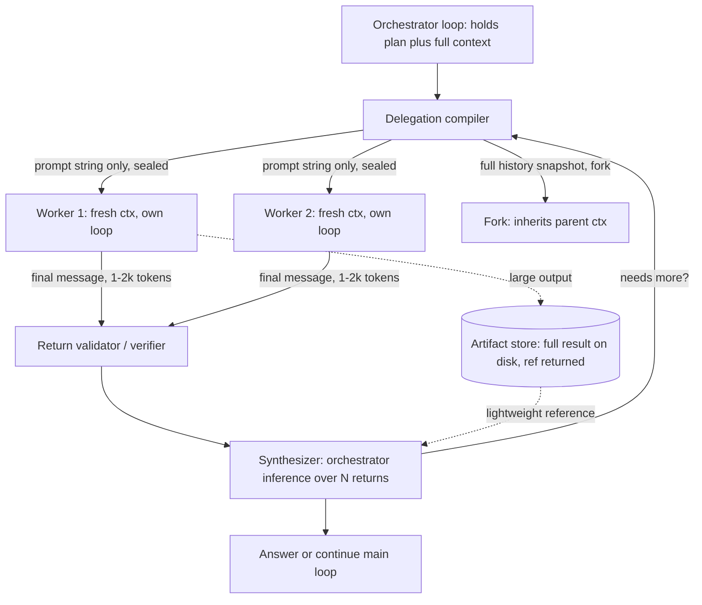

> [!info] Context
> Part of [[Harness-Internals-Overview|Harness Engineering Internals]], Level 2 wave. Parent chapters: [[Harness-Internals-Agent-Loop-Architecture]] (which established *why* subagents exist — context isolation — and the Anthropic-vs-Cognition debate) and [[Harness-Internals-Context-Compilation]] (which established the KV-cache contract that makes the fork boundary an economic decision). This chapter owns the general orchestration *mechanism*: what crosses the fork boundary in each direction, how delegation prompts are built, how returns are validated and synthesized at scale, and how budgets propagate down a tree. Claude-Code-specific isolation/IPC plumbing lives in the sibling [[Harness-Internals-Claude-Code-Subagent-Isolation]].

# Subagent Orchestration Internals and Context Topologies

## 1. Executive Overview

A subagent is a boundary. On one side sits an orchestrator holding the task, the plan, and the accumulated conversation. On the other sits a worker with a fresh context window, a narrower tool set, and one job. The entire engineering discipline of subagent orchestration is the design of *what passes through that boundary in each direction, and what is deliberately blocked* — because the boundary is simultaneously a firewall (it keeps exploratory token churn out of the parent) and a lossy channel (every unstated decision the worker makes is invisible to everyone else).

The parent chapter [[Harness-Internals-Agent-Loop-Architecture]] settled the *whether*: subagents exist for context isolation, parallelize reads and never writes, and the multi-agent debate resolves by task shape. This chapter settles the *how*, and it earns one claim that reframes the topic for anyone who thinks "spawn a subagent" is a simple call: **the fork boundary is a compression codec with an adjustable dictionary, and almost every subagent bug is a codec mismatch.** The orchestrator encodes a task into a delegation prompt; the worker decodes it, does work, and re-encodes its findings into a summary; the orchestrator decodes that. Each encode/decode step discards information. Whether the system works depends entirely on whether the *right* information survives the round trip — and that is a decision you make explicitly, per direction, per field, or the model makes it for you badly.

Get this wrong in the down direction and workers duplicate effort or misinterpret scope. Get it wrong in the up direction and the orchestrator synthesizes confidently over holes. Get the *quantity* of context wrong — too little and workers guess, too much and you've paid to isolate nothing — and you've built the worst of both architectures. The frontier question, which Section 15 reaches, is whether this codec can be *learned* rather than hand-tuned: today every production system hand-writes its delegation and compression rules, and the token numbers (4× a chat for a single agent, 15× for multi-agent) say the hand-tuning is expensive to get wrong.

## 2. Historical Evolution

The subagent is a much older idea than LLMs, and knowing its lineage explains why the current designs look the way they do.

**Blackboard systems (1970s–80s).** The Hearsay-II speech-understanding system introduced a shared "blackboard" that independent knowledge sources read from and wrote to opportunistically. This is the *maximal-sharing* pole: every worker sees everything. It is exactly what AutoGen's group chat rebuilds today, and it fails today for the same reason it struggled then — with many contributors writing to one shared state, coordination cost and interference grow faster than the added intelligence.

**The chains era (2022–2023).** Early LLM applications passed strings between fixed steps. There was no "subagent" because there was no agency to delegate — control flow lived in developer code (the pre-history covered in [[Harness-Internals-Agent-Loop-Architecture]]).

**Role-play multi-agent (2023–2024).** ChatDev, MetaGPT, CAMEL, and AutoGen's early group chats introduced the seductive framing that still misleads people: give each agent a *human job title* — CEO, CTO, programmer, tester — and let them converse. These systems worked in demos and failed in measurement. The 2025 MAST study (Section 9) found ChatDev correctness "as low as 25–33%" on its own program-development benchmark, with most failures attributable not to weak models but to specification and coordination breakdowns between the role-players. The lesson the field slowly absorbed: *a role is not a boundary worth paying for*. A "tester agent" and a "coder agent" sharing one artifact just relocated the coder's private decisions behind a lossy conversational wall.

**Anthropic's taxonomy and the orchestrator-workers pattern (December 2024).** "Building Effective Agents" named *orchestrator-workers* as the one delegation pattern where the decomposition itself is model-decided at runtime, and paired it with the simplicity-first doctrine. This reframed delegation away from fixed org charts toward dynamic, task-scoped fan-out.

**The 2025 collision.** Within days of each other in June 2025, Cognition published "Don't Build Multi-Agents" (single-threaded; actions carry implicit decisions; when you must compress, use a *compressor model*, not parallel agents) and Anthropic published "How we built our multi-agent research system" (orchestrator-workers beat single-agent Opus 4 by 90.2% on internal research evals). The parent chapter resolved the contradiction by task shape. What this chapter adds is that the two companies had *implemented the boundary differently*: Anthropic's workers start from a fresh context and return a distilled summary (maximal isolation); Cognition's prescription is to never fork the write path at all, and to compress *along the single thread* instead.

**Productization and the depth-limit reversal (2025–2026).** Claude Code shipped the `Task` tool (renamed `Agent` in v2.1.63) with a hard one-level nesting limit — subagents could not spawn subagents. Then, notably, Anthropic *relaxed* it: as of Claude Code v2.1.172 subagents can spawn their own subagents, capped at five levels below the main agent. This is a direct reversal of the "depth 1 is enforced everywhere" claim in the parent chapter, and Section 8 explains why the reversal is real but the *default* discipline of shallow trees survives it. In parallel, OpenAI's Agents SDK formalized the opposite-pole primitive — the *handoff*, where the target agent inherits the entire conversation — plus `Agent.as_tool` for the isolated case, giving the industry, for the first time, named vocabulary for both ends of the boundary-permeability spectrum.

## 3. First-Principles Explanation

Begin with the pure-function view from [[Harness-Internals-Agent-Loop-Architecture]]: a model is a function from a token sequence to a token distribution, with no memory. A subagent, therefore, is not an "entity." It is a *second, independent invocation of that function*, driven by its own agent loop, whose only connection to the first invocation is whatever tokens the harness chooses to copy between them. There is no shared mind, no shared memory, no channel except the token streams the harness wires up. Everything else is anthropomorphic illusion.

That single fact generates the whole design space. A boundary between two loops has exactly two directions, and you must specify what crosses each:

**The down channel (parent → worker): the delegation prompt.** The worker's context window starts fresh. In the Claude Agent SDK's exact words, "A subagent's context window starts fresh, with no parent conversation... The only channel from parent to subagent is the Agent tool's prompt string, so include any file paths, error messages, or decisions the subagent needs directly in that prompt." This is the load-bearing sentence of the entire chapter. The worker will act on hundreds of micro-decisions; every one it did not receive in that prompt, it will *invent*. Anthropic learned this empirically and named the required fields: "Each subagent needs an objective, an output format, guidance on the tools and sources to use, and clear task boundaries." Omit them and, again in their words, "agents duplicate work, leave gaps, or fail to find necessary information."

**The up channel (worker → parent): the return.** When the worker's loop terminates, its full transcript — every file it read, every tool result, every reasoning step — is discarded, and *only its final message* is spliced into the parent's history as the tool result. Anthropic quantifies the compression: a worker "might explore extensively, using tens of thousands of tokens or more, but returns only a condensed, distilled summary of its work (often 1,000–2,000 tokens)." A 40:1 to 80:1 compression ratio is typical and *intended*. If the parent needed the full transcript, the isolation would be pointless — you would have paid for a second context window and then poured its contents into the first.

Now derive why both channels are lossy *by construction*, not by accident:

- The down channel is lossy because the parent cannot know, at delegation time, every fact the worker will turn out to need. It is compressing a live, high-dimensional context into a static prompt written before the work starts.
- The up channel is lossy because the whole point is to not return the tens of thousands of tokens. Compression *is* the feature.

So the subagent boundary is a **double lossy-compression pass with a fresh, uncorrelated decision-maker in the middle.** This is the precise, mechanical statement of Cognition's "actions carry implicit decisions." It is not a vague warning about coordination; it is a statement about information theory. The Data Processing Inequality — you cannot increase information by processing it through a channel — has a direct corollary here, which the 2026 "Single-Agent... Under Equal Thinking Token Budgets" paper makes explicitly: inter-agent messages can only lose information relative to a single unified reasoning trace over the same tokens. A subagent architecture is *guaranteed* to carry less mutual information between "what the worker learned" and "what the orchestrator knows" than a single agent that did the same work inline would. You accept that loss in exchange for the isolation benefit. The engineering question is always whether the trade nets out — and Section 8 makes that quantitative.

One more first principle, about *why isolation is worth anything at all* given the loss. Recall the two constraints from [[Harness-Internals-Context-Compilation]]: attention degrades with length (context rot), and the KV cache makes prompt layout a binary contract. A subagent addresses both. Its exploratory token burst — 80k tokens of file dumps to answer one question — happens in a disposable context that is thrown away, so the parent's attention budget is never spent on it and the parent's cached prefix is never invalidated by it. The subagent is a *context firewall*: high-entropy work is quarantined, and only low-entropy conclusions cross back. That is the benefit you are buying with the double compression loss.

## 4. Mental Models

**The codec with an adjustable dictionary.** Treat every fork as `encode → transmit → decode`. The delegation prompt is the encoder; the worker is a noisy transmission channel that also *adds* signal (it does real work); the return summary is re-encoding for the trip back. A codec has a *dictionary* — shared context both sides already possess so it needn't be transmitted. A fresh-context subagent has an empty dictionary: everything must be in the prompt. A *fork* (below) ships the parent's entire dictionary along. Most orchestration design is choosing dictionary size against transmission cost.

**Permeability is a dial, not a switch.** The industry's primitives line up on a single axis of boundary permeability, and seeing them as one spectrum is the most useful mental move in this chapter:

| Permeability | Primitive | What crosses down | What returns |
| :-- | :-- | :-- | :-- |
| Fully sealed | Anthropic `Agent`/`Task`, OpenAI `Agent.as_tool` | Only the prompt string / typed args | Only the final message |
| Filtered | OpenAI handoff with `input_filter`; LangGraph `Send(state)` | A chosen subset of history/state | Merged via reducers |
| Fully open | OpenAI handoff (default); AutoGen group chat; Claude Code *fork* | The entire conversation history | Shared/continuous |

The read/write mental model from the parent chapter tells you where on this dial to sit: **sealed for read-heavy exploration (isolation dominates), open for decision-critical continuation (coordination dominates).** The PolicyGuard result in Section 9 is the empirical spike proving the "open" end matters: strip conversation history from a policy-checking subagent and its ability to correctly authorize actions collapses to zero, because the decisions it must validate live in the history, not the task description.

**The orchestrator's context is a scarce, billed resource that sits idle during a wave.** In synchronous fork-join, the orchestrator holds a large, expensive context open while workers run, contributing nothing but still occupying the window. This reframes barrier stalls not as a latency problem but as a *rent* problem — you are paying to hold real estate that does no work — and explains why dataflow scheduling (consume results as they arrive) is the recurring efficiency fix.

**Delegation is management, and bad management fails the same ways.** The MAST taxonomy (Section 9) reads like a performance review of a dysfunctional team: unclear task specs, ignored inputs, work that derails, no verification of what was handed back. Experts intuit subagent design by asking "would this instruction work if I gave it to a competent contractor who has never seen my project and cannot ask follow-ups?" If the answer is no, the delegation prompt is underspecified — because the contractor and the subagent share the exact constraint: one shot, no shared context, no clarifying questions.

## 5. Internal Architecture

A subagent-capable harness adds five components on top of the single-loop anatomy from [[Harness-Internals-Agent-Loop-Architecture]]. The `Subagent manager` named there decomposes into these.

1. **Delegation compiler.** Turns the orchestrator's intent into a worker's initial context. For a fresh-context design this is: resolve the subagent *definition* (system prompt, tool allow-list, model, effort, `maxTurns`), then concatenate it with the orchestrator-supplied *prompt string* (objective + output format + boundaries). For a fork design it instead *snapshots the parent's full message history* and hands it over intact.
2. **Worker runtime.** A complete, independent agent loop — its own turn manager, tool scheduler, and persistence — running the worker to termination. Crucially it maintains a *separate transcript file*; when the parent compacts, worker transcripts are untouched (they are stored separately), which is what makes a worker resumable and auditable after the fact.
3. **Return channel + validator.** Captures the worker's final message, optionally validates it against a schema or a verification pass, and splices it into the parent's history as the tool result. Partial-failure policy lives here (Section 9).
4. **Wave scheduler.** Decides fan-out width, launches workers (synchronously as a barrier, or in the background), tracks per-worker budgets and timeouts, and collects results. This is where budget propagation (Section 7) is enforced.
5. **Synthesizer.** The orchestrator's own next inference, whose prompt now contains N returned summaries and must fuse them. At small N this is "read them and write the answer"; at 5+ workers it becomes a genuine aggregation problem (Section 8).



Note the artifact side-channel (dashed to `ART`). Anthropic explicitly recommends it for large worker outputs: "implement artifact systems where specialized agents can create outputs that persist independently. Subagents call tools to store their work in external systems, then pass lightweight references back to the coordinator... This prevents information loss during multi-stage processing and reduces token overhead from copying large outputs through conversation history." This is the up-channel escape valve: when the thing a worker produces is genuinely large (a generated file, a full dataset), you do not squeeze it through the 1–2k-token summary bottleneck. You write it to disk and return a pointer — the same restorable-compression discipline from [[Harness-Internals-Context-Compilation]], now applied across the fork boundary.

### Where the components live, per company

The same five components map onto every production system, differing mainly in the delegation compiler's dictionary size and the wave scheduler's synchrony:

- **Claude Code / Agent SDK.** Delegation compiler = subagent definition (`.claude/agents/*.md` frontmatter) + prompt string; sealed by default. Worker runtime stores transcripts in separate files. As of v2.1.198 the wave scheduler runs subagents in the *background* by default, setting `run_in_background: false` only when it needs the result before continuing — a quiet but important shift from the synchronous-by-default behavior the parent chapter described.
- **OpenAI Agents SDK.** Two delegation compilers: `handoff()` (open — full history, trimmable by `input_filter`) and `Agent.as_tool()` (sealed — structured args, returns to caller). The distinction is the SDK's central design choice, discussed in Section 8.
- **LangGraph.** Delegation compiler = the `Send(node, state)` object, which carries a *chosen* state payload to each parallel worker invocation; the synthesizer is a downstream node reading state that reducers merged. Filtered permeability, made explicit in code.

## 6. Step-by-Step Execution

Walk a concrete read-heavy delegation end to end, using Anthropic's research system as the reference implementation because it is the most fully documented. Query: *"Which board members of S&P 500 IT companies previously worked at a semiconductor firm?"*

**Step 1 — Orchestrator plans in a scratchpad.** The lead agent (Opus-class) uses extended thinking as "a controllable scratchpad" to assess complexity and decide decomposition. Per Anthropic's effort-scaling heuristic, this is a broad, decomposable query, so it will fan out wide rather than answer inline: "complex research might use more than 10 subagents with clearly divided responsibilities." (Anthropic's post also states the lead "spins up 3–5 subagents in parallel"; the two figures describe different things — steady-state parallel *wave width* versus total *subagent count* across the whole task — and are worth not conflating.)

**Step 2 — Delegation compilation, per worker.** For each slice ("IT companies with tickers A–F," "G–M," ...), the orchestrator writes a prompt string carrying all four required fields: objective ("find board members of these named companies who previously worked at a semiconductor firm"), output format ("a list of `{person, company, prior_semiconductor_employer, source_url}` records"), tool/source guidance ("use company proxy statements and SEC filings before secondary sources"), and boundaries ("only these tickers; do not research adjacent companies"). This prompt is the worker's *entire world*. Nothing from the orchestrator's planning, and nothing from sibling workers, reaches it.

**Step 3 — Workers run isolated loops in parallel.** Each worker runs its own agent loop — "start wide, then narrow down," making 3+ parallel tool calls per turn — burning tens of thousands of tokens on search results and filing text. None of that enters any other context. If worker 3 discovers the proxy-statement format that works, workers 1, 2, and 4 do not learn it; they redundantly rediscover it. That redundancy is the accepted cost of isolation (Section 11 quantifies why it is tolerable for reads).

**Step 4 — Returns, compressed.** Each worker terminates and returns a 1–2k-token distilled list. Its transcript — the tens of thousands of tokens — is discarded from the orchestrator's view (retained on disk for audit). Five workers return roughly 5–10k tokens total into the orchestrator's context, in place of the ~250k+ tokens the same work would have added inline.

**Step 5 — Synthesis.** The orchestrator's next inference sees the five returned lists. With five overlapping, possibly-conflicting lists, plain concatenation is insufficient — the same person may appear twice, or one worker may report a semiconductor employer another missed. The orchestrator must dedupe, reconcile, and merge. Because these are *facts*, they compose (a person either was or wasn't a semiconductor employee); this is precisely why read-heavy research parallelizes safely, whereas conflicting *design decisions* would not compose.

**Step 6 — The separate citation pass.** Once research is complete, Anthropic's system "exits the research loop and passes all findings to a `CitationAgent`, which processes the documents and research report to identify specific locations for citations." This is a distinct, final validation-style pass, not interleaved with research. It is the up-channel's quality gate: a dedicated worker whose only job is to verify that every claim in the synthesized report is anchored to a real source. Structurally it is an evaluator over the synthesis, and it exists because the synthesis step is exactly where fabricated or mis-attributed facts sneak in.

**Step 7 — Loop or finish.** "The `LeadResearcher` synthesizes these results and decides whether more research is needed — if so, it can create additional subagents or refine its strategy." The orchestrator either spawns a follow-up wave (e.g., a worker to chase down the three records that lacked sources) or returns the answer.

The two structural observations from the parent chapter's single-turn walkthrough recur, amplified: the deliverable was never any single worker's message (it was the synthesized, cited report), and the dominant cost was the parallel workers' isolated exploration, not the orchestrator's tokens — which is why token spend, not agent count, drove 80% of the performance variance on BrowseComp.

## 7. Implementation

Build the five components yourself. The naive version — "spawn worker, await string" — is missing everything that makes it survivable.

### The delegation prompt as a structured template

Do not let the model free-write delegation prompts. Give it a template that forces the four required fields, because the failure mode of underspecification is silent (the worker guesses and proceeds confidently):

```python
DELEGATION_TEMPLATE = """\
OBJECTIVE: {objective}          # one concrete, verifiable goal
OUTPUT_FORMAT: {schema}         # exact shape you will parse back
TOOLS_AND_SOURCES: {guidance}   # which tools, which sources, in what order
BOUNDARIES: {boundaries}        # explicit scope limits: do NOT touch X
CONTEXT_YOU_NEED: {carried}     # file paths, error text, decisions already made
"""

def delegate(objective, schema, guidance, boundaries, carried, *, budget):
    prompt = DELEGATION_TEMPLATE.format(...)
    return spawn_worker(prompt, tools=restrict(guidance),
                        max_tokens=budget.tokens, max_turns=budget.turns,
                        timeout=budget.wall_clock)
```

The `CONTEXT_YOU_NEED` field is the one people forget and the one the SDK docs single out: "include any file paths, error messages, or decisions the subagent needs directly in that prompt." A worker told to "fix the failing test" without the test's file path will spend its first several turns rediscovering what the orchestrator already knew — pure waste, because that knowledge sat one context window away and simply wasn't copied.

### Validating the return

The up channel returns a string; treat it as untrusted input crossing a service boundary, exactly as GitHub's "treat agents like distributed systems" guidance prescribes. Three escalating levels of validation, matched to how much you trust the worker:

1. **Schema validation (cheap, mandatory for machine-consumed returns).** If the orchestrator will parse the return, force it through a JSON schema with constrained decoding. This is exactly how Manus does its up channel: "the planner defines the sub-agent's output schema... Sub-agents have a `submit results` tool to populate this schema before returning results to the planner, and Manus uses constrained decoding to ensure output adheres to the defined schema." The return is not free-form prose the orchestrator hopes to parse — it is a typed value the worker is *forced* to produce. The gap this closes is large and measured: schema compliance rises from roughly 35% with prompting alone to ~100% with strict constrained decoding, and on the 10k-schema JSONSchemaBench, constrained decoding reaches ~0.96 coverage where unconstrained decoding collapses on hard schemas. OpenAI's SDK exposes the same lever on the *down* channel via a handoff's `input_type` (a Pydantic schema the model must fill to invoke the handoff). The subtlety worth knowing: forcing structured output can *suppress* tool-calling in some open-weight models (the "constraint tax"), so validate the *final* return, not every intermediate worker turn.
2. **A verification pass (moderate cost, for correctness-critical returns).** Run a second, cheap model whose only job is to check the return against criteria — Anthropic's `CitationAgent` is this pattern for source-grounding. Give the verifier the *artifact and the criteria, not the generator's reasoning*, so it cannot inherit the generator's rationalizations (the evaluator-optimizer discipline from [[Harness-Internals-Agent-Loop-Architecture]]).
3. **A guarded verifier that reads full context (for policy/mutation-critical returns).** The PolicyGuard design (Section 9) places a verifier subagent between the orchestrator and any mutating action; it reads the *full* conversation, checks each proposed call against policy text plus an auto-generated per-tool checklist, and returns PASS/BLOCK. Its causal ablation is the key implementation lesson: strip the conversation history and mutation-authorization accuracy drops to 0% — so a verifier that must judge *decisions* needs the open channel, even when everything else stays sealed.

### Budget propagation down the tree

This is must-answer #5 and the least-documented part of production harnesses. The clean formalization comes from the resource-bounded agent-contracts framework: budgets flow *down*, cost accounting flows *up*, and one conservation law binds them.

**The conservation law.** For any orchestrator with budget `B` distributing to children, the aggregate of child budgets must not exceed the parent's: `Σ Rᵢ ≤ R_parent`, and total consumption cannot exceed the system budget: `Σⱼ cⱼ(r) ≤ B(r)` for every resource `r` (tokens, dollars, wall-clock), regardless of whether execution is parallel, sequential, or hierarchical. This is the invariant a correct scheduler enforces; empirically the framework reported zero conservation violations across 50 trials once it was enforced at runtime.

**Allocation strategies**, in increasing sophistication:
- *Equal split* — divide `B` by fan-out width when per-task complexity is unknown. Safe, wasteful.
- *Proportional* — scale each child's budget by an estimated complexity weight (the orchestrator's own effort heuristic: "simple fact-finding = 1 agent, 3–10 tool calls" is a proportional prior).
- *Negotiated* — children request amounts; the orchestrator caps to prevent over-claiming.
- Keep a **reserve buffer** (typically 10–15%) for coordination overhead and re-spawns, and return unused child budget to a shared pool so efficient workers subsidize hungry ones: `B_available(t) = B_reserve + Σ_{completed}(bⱼ − cⱼ)`.

**Timeouts propagate the same way as tokens**, with one asymmetry: a child's wall-clock timeout must be strictly less than the parent's remaining budget minus expected synthesis time, or the parent times out mid-synthesis holding a full context (the worst case — you paid for everything and returned nothing). In a synchronous wave, the *wave's* effective timeout is the max over its members (the barrier), so a single slow child taxes the whole level.

**Tree-wide cost accounting** is a fold up the tree. In token terms the natural unit is tokens (input + output); a useful approximation for a message-passing edge is `edge_cost ≈ 2m` (m tokens produced by the sender, m read by the receiver), so a node's total cost is its own leaf computation plus the sum of its edges. This yields the depth-vs-width scaling law that governs topology choice: an internal node that can read at most `W` tokens and receives `m`-token messages has fan-in capped at `⌊W/m⌋`. A *star* (one orchestrator, N leaves) is therefore hard-capped at `N ≤ ⌊W/m⌋` leaves before the orchestrator's own window overflows on the returns alone — which is the mechanical reason deep, narrow trees scale to more workers (`N = b^L` leaves) than flat, wide stars: the tree distributes the fan-in constraint across levels. This is the quantitative core of the "why not just spawn 100 workers into one orchestrator" question.

### The scale-out cliff

Subagents-as-tool-calls work for a handful of delegations per turn. Beyond that the orchestration itself belongs outside the conversation. Anthropic's SDK draws the line explicitly: "Subagents work well for a few delegated tasks per turn. For runs that coordinate dozens to hundreds of agents, use the `Workflow` tool, which moves the orchestration into a script the runtime executes outside the conversation context." At that scale you have left "agent orchestration" and entered "distributed job scheduling," and the right tool is a scheduler, not a model deciding fan-out in-context.

## 8. Design Decisions

### Fresh context vs. fork-with-full-context — the actual calculus

This is must-answer #2, and it is the sharpest design fork in the chapter. Claude Code exposes both primitives, which makes the comparison concrete. A **fresh subagent** starts empty; only the prompt string crosses. A **fork** "inherits completely: conversation history of the main session as is — everything, system prompts, tools, models, and message history."

The calculus has four terms:

**1. Cache economics cut the opposite way from intuition.** Intuitively, forking (copying the whole history) sounds more expensive than a fresh start. It is often *cheaper* on the first request, because "forks share the same system prompt and tool definitions as the parent session, they can reuse the parent's prompt cache directly during the initial request. Regular sub-agents launched from a new context cannot utilize this reuse." A fresh subagent has a *different* prefix (its own system prompt, its own tool subset), so its first inference is a full cache-cold prefill — it pays write prices for its entire prompt. A fork's first inference reads the parent's already-warm prefix at 0.1× (Anthropic) — see [[Harness-Internals-Context-Compilation]] for why exact-prefix reuse is binary. So for a *short* task needing lots of parent context, forking can be strictly cheaper.

**2. But the fork poisons its own window with everything it inherited.** The fresh subagent's entire reason for existing (per the parent chapter) is that its exploratory churn never touches the parent's window. A fork inherits the parent's window — so if the fork then does 80k tokens of exploration, it is doing so *on top of* the full inherited history, in a large, context-rot-prone window, and it gets no isolation benefit at all. The fresh subagent trades cache-cold startup for a small, clean window; the fork trades a warm start for a large, dirty one.

**3. Coordination loss is inverse to permeability.** The fresh subagent maximizes the double-compression loss of Section 3: the worker knows only what the prompt said. The fork eliminates the *down*-channel loss entirely (it has everything the parent had). PolicyGuard's ablation proves this is sometimes decisive: for a worker that must reason about *decisions already made*, the fork's full context is not a nice-to-have but a correctness prerequisite (0% success without it).

**4. Return semantics differ.** A fresh subagent returns a summary and vanishes. A fork "continues to display permission requests in the terminal" and behaves like a continuation of the same session — because it *is* the same conversation, branched.

The decision rule that falls out: **fork when the worker must inherit decisions and the task is short and context-dependent (write-adjacent continuation, policy checks, "try three approaches from here"); use a fresh subagent when the worker will explore heavily and return a small conclusion (read-heavy research, codebase search).** OpenAI's Agents SDK encodes exactly this dichotomy in its API surface: `handoff()` is the fork (full history, "by default the new agent sees the entire conversation history"), tunable with `input_filter` when you want a *filtered* fork; `Agent.as_tool()` is the fresh subagent ("in handoffs the new agent receives the conversation history; in this tool the new agent receives generated input") — and, tellingly, the two differ on a *second* axis: a handoff *transfers control permanently* (the caller does not resume — "we update the current agent and input, and re-run the loop"), whereas an agent-as-tool *returns a value and the caller stays in control*. That control-flow difference is not incidental to the context difference: an agent you fork *into* is one you are becoming; an agent you call *as a tool* is one you are delegating to and awaiting.

Manus is the third independent implementation of the same dichotomy, and the strongest convergence evidence, because it was arrived at from a different starting point (isolated VMs, not a chat SDK). Per the Manus team's own description, sub-agents exist "to isolate context," and the planner uses *two* inheritance modes explicitly: for simple tasks "the planner simply creates instructions and passes them to the sub-agent via the function call" (fresh — instructions only); for complex tasks "the planner shares its *full* context with the sub-agent... [which] still has its own action space and instructions, but receives the full context that the planner also has access to" (fork). Three companies — Anthropic (Task vs the implicit fork), OpenAI (`as_tool` vs `handoff`), Manus (instructions-only vs full-context) — independently shipped the same two-mode boundary with the same selection rule. When three teams converge on a distinction from three different substrates, the distinction is fundamental, not a framework accident.

### The permeability spectrum across frameworks

Lay the frameworks on the Section-4 dial and the design space becomes legible:

- **AutoGen group chat / Swarm (fully open).** "Participant agents broadcast their responses so all agents share the same message context"; a Swarm handoff passes "tool calls and results... to the target agent through context." This is the blackboard reborn — maximal coordination, maximal token cost, maximal interference. It is the right choice only when every agent genuinely needs to see everything, which is rare and shrinks as tasks grow.
- **LangGraph `Send` (filtered).** The orchestrator chooses each worker's state payload explicitly (`Send("generate_joke", {"subject": s})`), and reducers (`operator.add`, custom merge functions) fuse returns into shared state. This is the *engineered* middle: you decide, in code, exactly what crosses each way. The cost is that you are back to design-time decisions about information flow — which is fine when the flow is known, and a straitjacket when it isn't (the flat-loop-vs-graph argument from the parent chapter, now at the boundary level).
- **CrewAI hierarchical (open-ish, manager-mediated).** A `manager_agent` with `allow_delegation=True` routes to workers (`allow_delegation=False` to prevent loops); context passes via a `context=` parameter and optional shared memory. Note the measured overhead — "expect the manager to add 30–50 percent additional token usage compared to sequential mode" — which is the same ~30% orchestration tax the SupervisorAgent paper found, appearing independently again.
- **Anthropic `Agent` / OpenAI `as_tool` (sealed).** The default for isolation.

The convergence worth calling out: three independent measurements — CrewAI's 30–50% manager overhead, the SupervisorAgent paper's 29.68% GAIA savings from *removing* redundant supervision context, and the RCR-Router paper's ~70% context reduction from routing only role-relevant context — all say the same thing. **Broadcasting full context to every agent wastes roughly a third or more of the token budget on retransmission.** The sealed and filtered designs exist to reclaim it.

### Depth limits: why the reversal doesn't overturn the default

The parent chapter stated depth-1 nesting is "enforced everywhere." Fresh research corrects this: Claude Code v2.1.172+ allows subagents to spawn subagents, capped at *five* levels below the main agent. But the three original reasons for shallow trees survive the reversal, and they explain why the *default* is still shallow even though depth is now permitted:

1. **Runaway risk** — recursive spawning is a fork bomb with a billing meter; the depth cap (now 5) exists precisely to bound it, and you disable further spawning per-worker by omitting `Agent` from its tool list.
2. **Resource accounting** — the fan-in law above (`N ≤ ⌊W/m⌋` per level) means a bounded-depth tree has predictable worst-case cost; unbounded depth does not. The cap makes the conservation law tractable.
3. **The telephone problem** — each level is another double-compression pass with another uncorrelated decision-maker. A depth-5 tree plays the encode/decode game five times; the task specification degrades at every hop. So the cap is 5 but the *wise* default remains 1–2, used only when a sub-problem genuinely has its own isolable sub-exploration. Depth was relaxed to enable specific hierarchical research patterns, not to bless arbitrary recursion.

### Synthesis strategy at 5+ workers

Must-answer #4. At N=2 the orchestrator reads both returns and writes an answer — synthesis is trivial. At 5+ overlapping, possibly-conflicting returns, "just read them" degrades, and you must pick an aggregation strategy. The options, from cheapest to most robust:

- **Concatenate** — dump all returns into the synthesizer's context. Simplest; works when returns are disjoint (each worker owned a non-overlapping slice, as in the S&P board-member example). Fails when returns overlap or conflict, because the synthesizer must silently reconcile and may hallucinate the reconciliation.
- **Re-rank then fuse** — the LLM-Blender pattern: a ranker scores candidate returns pairwise (`PairRanker`), then a fusion step merges the top-ranked ones into a single improved output (`GenFuser`). Use when workers attempted the *same* task and you want the best blend rather than a pick. LLM-Blender's own result — average rank 3.2 vs. the best single model's 3.9 across 12 methods — is modest but real: fusion beats picking one.
- **Adjudicate / audit** — for reasoning tasks, majority voting is actively dangerous: on minority-correct instances it scores 0% *by construction*, because "increased multiplicity of an erroneous hypothesis cannot be voted away." The 2026 reasoning-tree auditing work organizes worker outputs into shared prefixes with explicit *divergence points*, and at each critical divergence a localized auditor scores branches on factual accuracy, logical soundness, and constraint adherence — *selecting* a branch rather than re-solving. It beats majority vote by ~3% average (up to 5.7%) and, tellingly, recovers 65% of GSM8K cases where the correct answer was in the minority. Learned aggregation (AggLM) makes the same argument — "the majority is not always right" — and trains an RL aggregator to reconstruct the correct answer even when it is the minority view.
- **Credibility-weighted** — when some workers may be unreliable or adversarial, weight returns by a credibility score (Shapley-style contribution) rather than counting equally, down-weighting outliers.

The failure mode common to all naive synthesis: **confabulation consensus** — multiple workers, sharing a base model, make the *same* mistake, and the orchestrator reads agreement as correctness. Independent-error assumptions underpinning voting are violated when workers share a model, which they usually do. The defense is auditing the *reasoning*, not counting the *answers* — which is why the strongest strategies select on evidence at divergence points instead of tallying votes.

## 9. Failure Modes

The empirical map here is the MAST taxonomy ("Why Do Multi-Agent LLM Systems Fail?", Berkeley), the first grounded failure taxonomy for multi-agent systems: 14 fine-grained modes across 200+ traces and 7 frameworks (ChatDev, MetaGPT, HyperAgent, AppWorld, AG2, Magentic-One, OpenManus), with strong annotator agreement (Cohen's κ ≈ 0.88). Its three top-level categories are almost perfectly the three failure surfaces of the fork boundary:

**Specification issues (~42% of failures).** The down channel is underspecified. Dominant individual modes: *step repetition* (17.14% — the single largest mode; workers redo work because they weren't told it was done), *disobey task specification* (10.98%), *unaware of termination conditions* (9.82%). Debug: read the delegation prompt as if you were the worker with no other context. If you couldn't execute it correctly, neither can the worker. This category is why the four-field template in Section 7 exists.

**Inter-agent misalignment (~37%).** Coordination breaks between agents. Dominant modes: *reasoning-action mismatch* (13.98% — the worker reasons one way and acts another), *fail to ask for clarification* (11.65% — it guesses instead of surfacing ambiguity, because it *cannot* ask), *task derailment* (7.15%). This is the double-compression loss made visible: the worker's private reasoning diverges from what anyone else can see. Debug by diffing the worker's transcript (retained on disk) against its returned summary — the divergence between what it did and what it reported is where misalignment hides. Harnesses that discard worker transcripts make this class nearly invisible, which is the argument for persisting them even though the parent never reads them.

**Task verification failures (~21%).** Nobody checked the return. Modes: *premature termination* (7.82% — the worker or orchestrator declares victory unverified), *no/incomplete verification* (6.82%), *incorrect verification* (6.66%). This is the up channel with no validator, and it is why Section 7's return-validation ladder and Anthropic's `CitationAgent` matter. MAST's own interventions confirm the leverage: adding multi-level verification to ChatDev bought +15.6% absolute success; a role-specification fix bought +9.4% — but neither eradicated failures, which is the paper's sober headline: better delegation and verification help, yet "more fundamental changes to agent organization" remain necessary.

Beyond the taxonomy, the orchestration-specific failures:

**Partial failure (must-answer #6): one worker dies, hallucinates, or returns garbage.** The naive orchestrator either aborts the whole wave (wasting every sibling's tokens) or silently synthesizes over the hole (the worse failure — a confident, incomplete answer). Production behavior is *explicit partial-result accounting*. The Claude Agent SDK models this precisely as of v2.1.199: "an API error that ends the subagent early, such as a rate limit, is never delivered as its result. If the subagent already produced output, the Agent tool returns that partial output with a note that the subagent didn't finish; otherwise the tool result is an error message." The orchestrator is *told* which worker failed and whether it has partial output, so it can hedge, re-spawn, or downweight — rather than guess. Anthropic's higher-level statement: "letting the agent know when a tool is failing and letting it adapt works surprisingly well," combined with "deterministic safeguards like retry logic and regular checkpoints," and resume-from-checkpoint so a mid-wave crash costs one step, not the run. The anti-pattern is treating a garbage return as a valid one because it parsed — schema-valid and *correct* are different, which is why the verification pass (not just the schema check) exists.

**The straggler.** Four of five workers done, one running for 90 more seconds. In a synchronous wave the barrier prices the whole wave at its slowest member — Anthropic accepts this cost explicitly: "the entire system can be blocked while waiting for a single subagent to finish." Mitigations: per-worker timeout with partial return; hedged requests (spawn a duplicate straggler, take the first result — affordable only because reads tolerate redundancy); and structurally, replace the barrier with dataflow so synthesis begins on arrivals and the orchestrator can kill or re-scope the straggler based on what siblings already found.

**Confabulation consensus.** Covered in Section 8 — shared-model workers make correlated errors and majority voting launders the error into false confidence. Detect by checking whether "agreement" survives an evidence audit at divergence points, not by trusting the count.

**Budget cascade.** A retry loop re-sends full accumulated context, so a second attempt is *more* expensive than the first, and a hub failure in a star topology triggers parallel retry storms across all workers — landing at a 2–3× cost multiplier over baseline. The conservation law from Section 7, enforced at runtime with a hard halt when any child exceeds its allocation, is what prevents a local failure from becoming a tree-wide budget blowout. Field-observed multi-agent failure rates in cost analyses run "roughly 41% to 86.7%, with most failures attributed to specification and coordination issues rather than base-model capability" — the same diagnosis as MAST, from the cost side.

## 10. Production Engineering

**Anthropic — Claude Research (verified; engineering blog).** Orchestrator-workers with an Opus-class lead and Sonnet-class workers; lead plans in an extended-thinking scratchpad, fans out (3–5 parallel per wave, more across the task), workers make 3+ parallel tool calls each, then a separate `CitationAgent` grounds every claim. Delegation carries objective/output-format/tool-guidance/boundaries. Numbers: +90.2% over single-agent Opus 4 on internal research evals; ~15× chat tokens; token spend explains 80% of BrowseComp variance; parallelism cut wall-clock up to 90%. Synchronous waves (accepted bottleneck, async named as future); resume-from-checkpoint; *artifact systems* for large worker outputs (store externally, return a reference); rainbow deployments so a harness update never strands a running agent mid-flight ("we use rainbow deployments... gradually shifting traffic from old to new versions while keeping both running simultaneously"). Evaluation: ~20 queries to start, single-call LLM judge scoring 0.0–1.0 with pass/fail against a five-criterion rubric (factual accuracy, citation accuracy, completeness, source quality, tool efficiency) — detail in [[Harness-Internals-Evaluation-Infrastructure]].

**Cognition — Devin (verified position; internals inferred).** Single-threaded write path; when the trace outgrows the window, a *compressor model* distills "a history of actions & conversation into key details, events, and decisions" — and "depending on the domain, you might even consider fine-tuning a smaller model (this is in fact something we've done at Cognition)." Sanctioned subagent exception, verbatim: "Claude Code... never does work in parallel with the subtask agent, and the subtask agent is usually only tasked with answering a question, not writing any code." So Cognition's boundary is: forks allowed for read-only Q&A, never for the write path, and compression happens *along the thread* rather than across parallel forks.

**Anthropic — Claude Code / Agent SDK (loop verified via docs; internals partly community-reverse-engineered).** Sealed subagents via the `Agent` tool (formerly `Task`); definitions in `.claude/agents/*.md` frontmatter (`description`, `prompt`, `tools`, `model`, `effort`, `maxTurns`, `permissionMode`, `isolation: worktree`, `memory`). Background-by-default as of v2.1.198; nesting up to 5 levels (v2.1.172+); partial-output-on-error (v2.1.199); worker transcripts stored separately and unaffected by parent compaction; the `Workflow` tool for dozens-to-hundreds of agents. The Claude-Code-specific isolation and IPC mechanics are the sibling chapter [[Harness-Internals-Claude-Code-Subagent-Isolation]]'s domain; here the point is the general shape.

**OpenAI — Agents SDK (verified; official docs).** The two-primitive design: `handoff()` (open — full history transfers, `input_filter`/`HandoffInputData` to trim, `RunConfig.nest_handoff_history` to collapse prior transcript into a single `<CONVERSATION HISTORY>` summary block — which is Cognition's compressor idea productized at the boundary) versus `Agent.as_tool()` (sealed — structured args, returns to caller). This is the clearest public statement that the industry treats fork-vs-fresh as a first-class API choice, not an implementation detail.

**Manus — Wide Research and the planner/executor design (verified product docs + a first-party-sourced third-party writeup).** Wide Research runs a star topology at product scale: "the main agent breaks your request into hundreds of independent sub-tasks," each "assigned to a dedicated agent with its own fresh context window," tested to 250 items with "uniform quality," and — the load-bearing architectural choice — "sub-agents never talk to each other. This prevents context pollution and reduces hallucinations." Each sub-agent is "a fully capable, general-purpose Manus instance" with its own VM, not a role-specialized persona; the main agent "collects all completed sub-tasks and assembles them." Beneath Wide Research sits a general planner / knowledge-manager / executor design whose sub-agents exist "to isolate context," communicate via *function calling* (explicitly "aligned with Anthropic's multi-agent research") rather than shared history, choose between the two context-inheritance modes above, and return values through a planner-defined output schema enforced by constrained decoding. Manus is the cleanest existence proof that the sealed-star topology and schema-validated returns scale to hundreds of workers in production.

**The framework field (verified; official docs).** LangGraph: `Send` for filtered fan-out (each worker gets its own state payload, not the whole shared state), reducers merging returns at a Pregel-style *super-step barrier* — "nodes that run in parallel are part of the same super-step," their writes buffered and committed atomically at the boundary, so parallel workers never see each other's writes mid-step; the supervisor's `output_mode` chooses whether it sees each worker's `last_message` or `full_history`, and the `task_description` handoff pattern rewrites `messages` to a single distilled task so a worker sees the scoped task rather than the full transcript (the filtered fork, in code). CrewAI: `manager_agent` hierarchical delegation via auto-injected "Delegate work to coworker" / "Ask question to coworker" tools, at a measured 30–50% token overhead. AutoGen: fully-open group chat where the manager *broadcasts* every message to every agent (the blackboard), versus its isolated two-agent/sequential/nested patterns that pass only summaries. The spread from sealed-star (Manus, Anthropic) through filtered (LangGraph) to fully-open broadcast (AutoGen group chat) is the entire design space; no single point is correct for all tasks, which is the whole argument.

## 11. Performance

**The token multipliers set the stakes.** A single agent uses ~4× the tokens of a chat; a multi-agent system ~15× (Anthropic). Multi-agent is, first and foremost, a mechanism for spending more tokens within a wall-clock budget and beyond one context window — which is why it wins on breadth-first reads (it *can* spend 15× usefully) and loses on tasks a single bigger context handles at 4×.

**The equal-budget correction.** The most important recent performance finding cuts against reflexive multi-agent enthusiasm: under *equal thinking-token budgets*, single-agent systems consistently match or beat multi-agent ones on multi-hop reasoning ("SAS is the strongest default architecture for multi-hop reasoning"). The mechanism is the Data Processing Inequality from Section 3 (inter-agent messages lose information) plus constraint drift (workers over-explore and lose the thread — 23 observed extraction failures where the correct answer was reasoned but never surfaced). Multi-agent won only when context was heavily degraded. The lesson: **multi-agent's wins come largely from spending *more* tokens, not from the topology itself.** Before reaching for workers, ask whether the same token budget spent on one longer single-agent trace would do better — often it does.

**Redundant retransmission is the dominant waste.** Three independent measurements converge (Section 8): CrewAI's 30–50% manager overhead, SupervisorAgent's 29.68% GAIA savings from purging redundant supervision context (34.64% on GAIA L2, with accuracy *preserved or improved*), and RCR-Router's ~70% context-size reduction from routing only role-relevant context to each worker (<2–3% accuracy loss). The unifying diagnosis: broadcasting unchanged context to every agent, and rebroadcasting it at every synchronization point, is where a third-plus of the budget goes. The fixes are the sealed/filtered permeability designs and *differential* context updates (send what changed, not the whole state) rather than full rebroadcast.

**Redundant re-reading across isolated workers** is the cost *of* isolation: worker B re-fetches what worker A already fetched because they can't see each other. Tolerable for reads (worst case, wasted tokens), and the mitigation is a *shared read cache* so overlapping fetches hit a warm store rather than re-executing — one of the cleaner efficiency wins available, and one barrier-synchronized designs forgo.

**Barrier stalls and idle orchestrator context.** In synchronous fork-join the orchestrator's large context sits idle (but billed, and window-occupying) while workers run, and the wave finishes at its slowest member's pace. Dataflow scheduling reclaims both — synthesis starts on first arrival — at the cost of the state-consistency and error-propagation complexity Anthropic cited for shipping synchronous anyway.

**Model tiering** is the highest-leverage cost lever: frontier model for the orchestrator and any write path, cheaper/faster models for the read fan-out (Anthropic's Opus-lead/Sonnet-workers split; Claude Code's Explore subagent runnable on Haiku). A worker doing mechanical search does not need the orchestrator's reasoning depth, and paying frontier prices for fan-out is the most common self-inflicted cost wound. The SupervisorAgent's own overhead — only ~15% of total tokens for the filter — shows runtime supervision pays for itself when it prunes a larger waste.

## 12. Best Practices

Write delegation prompts as structured templates that force objective, output format, tool/source guidance, boundaries, and the specific context the worker needs (file paths, error text, decisions already made) — an underspecified worker is a coin flip you paid tokens for, and MAST puts ~42% of all failures in this bucket. Match boundary permeability to the read/write shape: sealed fresh subagents for read-heavy exploration that returns a small conclusion; forks (or filtered handoffs) when the worker must inherit decisions already made. Validate the return at the level its consumer demands — schema for machine-parsed returns, a verification pass for correctness-critical ones, a full-context guarded verifier for anything that authorizes mutations. Route large worker outputs to an artifact store and return a reference, never squeeze them through the summary bottleneck. Propagate budgets down with a conservation law and account cost up; keep a reserve buffer and return unused budget to a pool. Tell the orchestrator explicitly which workers failed and whether output is partial; never let a garbage return be synthesized as valid. Tier models — frontier for the orchestrator and writes, cheap for read fan-out. Persist worker transcripts even though the parent never reads them; they are the only way to debug the misalignment class. Prefer dataflow to barriers once tail latency bites, and a shared read cache to redundant re-fetching.

Anti-patterns, all field-observed: role-play org charts (a "tester agent" and "coder agent" negotiating in prose — you added lossy boundaries and gained nothing a section header in one prompt wouldn't); majority-voting reasoning tasks (confabulation consensus scores 0% on minority-correct instances); broadcasting full context to every agent (a third of your budget, gone to retransmission); deep trees used because the harness now permits them (each level is another telephone hop degrading the spec); reaching for workers when the same token budget on one longer single-agent trace would win; and discarding worker transcripts, which makes the largest failure class invisible.

## 13. Common Misconceptions

**"A subagent is a specialist you hired."** It is a second invocation of a stateless function with a fresh window and a copied prompt. There is no persistent entity, no shared memory, no ability to ask you a follow-up. "Specialization" is just a focused system prompt plus a restricted tool set — both applyable without any subagent. If your subagent design doesn't save the parent's context tokens, the "specialist" framing is misleading you into paying for a boundary that buys nothing.

**"Forking is more expensive than a fresh subagent because it copies everything."** Backwards on the first request: a fork reuses the parent's warm cached prefix (0.1× reads), while a fresh subagent's different prefix is a cache-cold full prefill at write prices. The fork's real cost is downstream — it inherits a large, rot-prone window and gets no isolation. Cost and isolation are separate axes.

**"More workers means more intelligence."** Under equal token budgets, single-agent matches or beats multi-agent on reasoning, and token spend (not agent count) explains 80% of research-eval variance. Workers are a way to *deploy more tokens in parallel within a wall-clock budget*, and every added worker adds coordination failure modes. Agent count is a cost knob wearing an intelligence costume.

**"Majority vote makes multi-agent reliable."** It launders correlated errors into false confidence and scores 0% by construction whenever the correct answer is the minority view — which, with workers sharing a base model, is exactly when you need aggregation to work. Audit reasoning at divergence points; don't tally answers.

**"Depth-1 nesting is a hard law."** It was, and now isn't — Claude Code permits five levels. But the reasons for shallow trees (runaway cost, tractable accounting, the telephone problem) survive, so shallow remains the *default discipline*; the raised cap is for specific hierarchical patterns, not a license to recurse.

**"The orchestrator sees what its workers did."** It sees only their final messages — 1–2k distilled tokens each, with the tens of thousands of tokens of actual work discarded from its view. The orchestrator coordinates over summaries, which is why delegation precision and return validation carry the whole reliability load.

## 14. Interview-Level Discussion

**Q1: Design the boundary for a coding agent that must research an unfamiliar library and then edit code using what it learned. Fresh subagent, fork, or single loop? Justify per direction.**
Split by read/write. The research is read-heavy, high-churn, low-conclusion — a *sealed fresh subagent* is correct: it burns tens of thousands of tokens on docs and source in a disposable window and returns a 1–2k-token distilled summary (API shapes, gotchas, the specific call to use), keeping the parent's window and cached prefix clean. The editing is write-path and depends on decisions the main loop is making — it stays *in the single main loop*, not a fork, because splitting the write path exposes it to conflicting implicit decisions (the Flappy Bird failure). If you must isolate a hard edit sub-problem, prefer a *fork* over a fresh subagent so it inherits the decisions already made — but the default is one loop consuming the research subagent's summary. The tell that you've designed it right: the research worker saves the parent tokens (isolation earns its keep) and no two contexts ever write the same artifact.

**Q2: Your five-worker research wave returns five overlapping, partially-conflicting lists. Walk the synthesis, including the failure you're guarding against.**
Concatenation is wrong here because the returns overlap — the synthesizer would silently reconcile and can hallucinate the reconciliation. Because these are *facts*, they compose, so: dedupe by entity, and at each conflict (worker A says X, worker B says not-X) treat it as a divergence point and adjudicate on evidence — prefer the return with a primary source, spawn a targeted follow-up worker for unresolved conflicts, and run a citation/verification pass over the merged result so every surviving claim is source-anchored. The failure I'm guarding against is confabulation consensus: if three workers share a base model and make the same mistake, naive agreement reads as truth. So I audit reasoning at divergence points rather than counting votes — majority voting scores 0% precisely on the minority-correct cases where I most need the aggregator to work.

**Q3: Propagate a $2 / 10-minute / 200k-token budget across a two-level subagent tree, and account cost back up. What invariants must hold?**
Budgets flow down, cost flows up, bound by one conservation law: the sum of children's budgets can't exceed the parent's (`Σ Rᵢ ≤ R_parent`) for every resource. Allocate proportionally to estimated complexity (the orchestrator's own effort heuristic is a proportional prior), keep a 10–15% reserve for coordination and re-spawns, and return a completed worker's unused budget to a shared pool so hungry siblings can draw on it. Each child's wall-clock timeout must be strictly less than the parent's remaining time minus expected synthesis time, or the parent times out mid-synthesis holding a full context — the worst outcome. Account cost up as a fold: node cost = its own leaf tokens + Σ edge costs (≈2m per message edge). Enforce at runtime with a hard halt when any child exceeds its allocation, so a local overrun can't cascade into a tree-wide blowout. And respect the fan-in law: an orchestrator reading `m`-token returns caps at `⌊W/m⌋` children before its own window overflows on the returns alone — which is why you go deeper, not just wider, past that point.

**Q4: When is a fork strictly better than a fresh subagent, and when is it strictly worse?**
Strictly better when the worker must reason about decisions already made and the task is short: PolicyGuard's ablation shows a policy-checking worker's authorization accuracy drops to 0% without the full conversation, and a fork also reuses the parent's warm cached prefix, so its first inference is cheap. Strictly worse when the worker will explore heavily: the fork inherits the parent's large window, so its exploration compounds context rot and it gets none of the isolation that was the entire point — a fresh subagent's small clean window wins despite its cache-cold start. The axis is: does the worker need the parent's *decisions* (fork) or need *freedom from the parent's clutter* (fresh)? OpenAI's SDK encodes exactly this as `handoff()` vs `Agent.as_tool()`.

**Q5: Anthropic reports +90.2% from multi-agent; a 2026 paper reports single-agent wins under equal token budgets. Reconcile them.**
They measure different things and both are right. Anthropic's baseline is single-agent *on breadth-first research that structurally can't fit one context window* — so part of the 90.2% is a capability unlock (the single agent literally couldn't hold the corpus), and token spend alone explains 80% of the variance, meaning much of the win is "spent more tokens in parallel." The equal-budget paper controls exactly that away: give both architectures the *same* thinking tokens on multi-hop reasoning and the single agent matches or wins, because inter-agent messaging loses information (Data Processing Inequality) and workers drift. Reconciliation: multi-agent's advantage is real when the task exceeds one window and rewards parallel token spend (breadth-first reads); it evaporates when a single context could hold the work and you've merely fragmented one reasoning trace into lossy pieces. Decide by task shape and whether you're budget- or window-bound, not by architecture preference.

**Q6: One worker in a wave starts returning confident nonsense (hallucinated sources). How does the harness catch it before it poisons the synthesis?**
Three gates. First, schema validation on the return — but that only catches malformed output, not confident-but-wrong, so it's necessary not sufficient. Second, a verification pass: a dedicated checker (Anthropic's `CitationAgent` pattern) that takes the *artifact and criteria but not the worker's reasoning*, so it can't inherit the rationalization, and confirms each claimed source actually exists and supports the claim — this is what catches hallucinated citations specifically. Third, explicit partial-result accounting: if the worker errored, the harness returns its partial output *flagged as unfinished* rather than as a clean result, so the orchestrator downweights it. The structural defense is that the synthesizer must never treat a schema-valid return as a *correct* one — valid and true are different, and the gap is exactly where a hallucinating worker gets through. Persist the worker's transcript so the post-mortem can diff what it did against what it claimed.

## 15. Advanced Topics

**Learned delegation and compression.** Today's delegation heuristics ("simple = 1 agent, 3–10 calls") are prompt-encoded folklore, and today's return compression is a hand-written summary schema. The research direction is to *learn* both: RL over decomposition, worker count, and per-subtree budgets with cost in the reward; and Cognition's fine-tuned compressor models that preserve decision-relevant detail far better than generic summarization. The eval challenge is measuring "what did the boundary lose" at scale — you need a way to score a summary against downstream task success, not human-judged quality (see [[Harness-Internals-Evaluation-Infrastructure]]).

**Asynchronous, steerable orchestration.** The named frontier (Anthropic): orchestrators that steer running workers, spawn on demand, and consume results as dataflow rather than at a barrier. Open problems are state consistency (a worker acting on a world an earlier worker changed), result ordering, and error propagation across a dynamic task graph — distributed-systems problems with a stochastic node at every vertex. This is where subagent orchestration merges with [[Harness-Internals-Durable-Execution]] and [[Harness-Internals-Scheduling-And-Steering]].

**Communication beyond prose summaries.** Everything here passes natural-language strings across the boundary, which is the lossy channel. Alternatives under exploration: typed findings with provenance (structured artifacts, not prose); shared memory stores that workers read/write with locking (the blackboard reborn with token budgets and modern concurrency control — [[Harness-Internals-Memory-Systems]]); and KV-cache-level sharing so parallel workers reuse each other's prefix computation instead of re-embedding identical sources — attacking the redundant-re-reading waste at the substrate level rather than the application level ([[Harness-Internals-Runtime-Optimization]]).

**Verified boundary integrity.** MAST shows verification failures are ~21% of the total and that adding verification helps but doesn't eradicate. The open direction is *provenance-aware* verification — checking both semantic provenance (does the returned evidence actually support the claim) and procedural provenance (did the worker follow authorized steps) — and guarded verifier subagents (PolicyGuard) as a standard architectural layer between orchestrator and any mutation, rather than a bolt-on.

**Topology as an optimization variable.** The budget-conservation and fan-in laws point toward treating topology (fan-out width, tree depth, per-subtree budget) as a formal budget-constrained optimization solved *per query* — the ZEBRA / INFRAMIN / retrieval-conditioned-topology line of work — rather than a fixed architecture. The endpoint is a harness that chooses, for each task, how wide and deep to fan out given a dollar budget, the way a query planner chooses a join order. This is the deep version of [[Harness-Internals-Agent-Topology-Economics]].

## 16. Glossary

- **Fork boundary**: the interface between an orchestrator loop and a spawned worker loop; a double lossy-compression pass (delegation prompt down, summary up) with an independent decision-maker in the middle.
- **Delegation prompt**: the prompt string that is the *entire* down-channel to a fresh-context worker; must carry objective, output format, tool/source guidance, boundaries, and any specific context (file paths, decisions) the worker needs.
- **Fresh-context subagent (sealed)**: a worker whose context window starts empty; only the prompt string crosses down, only the final message returns up. Maximizes isolation; pays cache-cold startup.
- **Fork (open)**: a worker that inherits the parent's entire conversation history; eliminates down-channel loss and reuses the warm cached prefix, but inherits a large, rot-prone window and gains no isolation.
- **Handoff**: OpenAI Agents SDK's open-boundary primitive — the target agent inherits the full conversation (trimmable via `input_filter`); contrast `Agent.as_tool` (sealed).
- **Permeability spectrum**: the axis from fully sealed (Anthropic `Agent`, OpenAI `as_tool`) through filtered (LangGraph `Send`, filtered handoff) to fully open (AutoGen group chat, Claude Code fork).
- **Return / summary compression**: discarding the worker's transcript and splicing only its ~1–2k-token final message into the parent; a deliberate 40:1–80:1 compression.
- **Artifact system**: an up-channel escape valve — a worker writes a large output to external storage and returns a lightweight reference, avoiding the summary bottleneck.
- **Budget conservation law**: `Σ Rᵢ ≤ R_parent` for every resource; child budgets sum to no more than the parent's, enforced at runtime with a hard halt on overrun.
- **Fan-in constraint**: an orchestrator reading `m`-token returns caps at `⌊W/m⌋` children before its window overflows; the reason deep trees scale to more workers than flat stars.
- **Synchronous wave / barrier synchronization**: fork-join where the orchestrator blocks until an entire wave completes, pricing the wave at its slowest member.
- **Dataflow scheduling**: consuming worker returns as they arrive and synthesizing incrementally, instead of at a barrier.
- **Confabulation consensus**: correlated errors among shared-model workers that majority voting launders into false confidence; scores 0% by construction on minority-correct instances.
- **Rank-then-fuse**: synthesis by ranking candidate returns (`PairRanker`) then generatively merging the top ones (`GenFuser`) — LLM-Blender.
- **Reasoning-tree auditing**: synthesis by organizing worker outputs into shared prefixes with divergence points and adjudicating branches on evidence, beating majority vote.
- **Guarded verifier**: a full-context subagent (PolicyGuard) between orchestrator and mutation, returning PASS/BLOCK per proposed action; needs the open channel to judge decisions.
- **MAST**: the Multi-Agent System failure taxonomy — 14 modes in 3 categories (specification ~42%, inter-agent misalignment ~37%, verification ~21%).
- **Compressor model**: Cognition's alternative to parallel forks — a (possibly fine-tuned) model that distills a single thread's history into key details and decisions.
- **Rainbow deployment**: running old and new harness versions simultaneously with gradual traffic shift, so an update never strands a running agent.

## 17. References

- **Anthropic — "How we built our multi-agent research system"** (https://www.anthropic.com/engineering/multi-agent-research-system) — The primary source for delegation-field requirements, effort-scaling heuristics, the `CitationAgent` pass, artifact systems, synchronous waves, rainbow deployments, and the 90.2%/15×/80%-variance numbers. The single most important read for this chapter; every orchestration decision here argues with or builds on it.
- **Cognition — "Don't Build Multi-Agents"** (https://cognition.com/blog/dont-build-multi-agents) — The compressor-model prescription, the read-only-Q&A subagent exception, and "actions carry implicit decisions." Read for the case *against* forking the write path and for the single-thread-plus-compressor alternative.
- **Anthropic — "Effective context engineering for AI agents"** (https://www.anthropic.com/engineering/effective-context-engineering-for-ai-agents) — Source for the 1,000–2,000-token return figure and the clean separation-of-concerns framing of sub-agent isolation. Read for the up-channel compression numbers.
- **Claude Docs — "Subagents in the SDK"** (https://code.claude.com/docs/en/agent-sdk/subagents) — The authoritative mechanics: "the only channel from parent to subagent is the prompt string," fresh-context inheritance table, the 5-level nesting cap (v2.1.172), background-by-default (v2.1.198), partial-output-on-error (v2.1.199), and the `Workflow` tool scale-out cliff. Read when implementing on the SDK.
- **Claude Docs — "Create custom subagents"** (https://code.claude.com/docs/en/sub-agents) — The definition format and full frontmatter field set (`tools`, `model`, `effort`, `maxTurns`, `permissionMode`, `isolation: worktree`, `memory`), and the built-in Explore/Plan/general-purpose agents. Read for what a delegation compiler resolves.
- **OpenAI — Agents SDK Handoffs** (https://openai.github.io/openai-agents-python/handoffs/) — The two-primitive design: `handoff()` (full history, `input_filter`/`HandoffInputData`, `nest_handoff_history`) vs `Agent.as_tool()`. The clearest public statement that fork-vs-fresh is a first-class API choice. Read for the open end of the permeability spectrum.
- **LangGraph Docs — Graph API** (https://docs.langchain.com/oss/python/langgraph/graph-api) — The `Send` API for filtered fan-out, reducers for merge, subgraph state isolation. Read for the engineered-middle permeability design.
- **CrewAI Docs — Hierarchical Process** (https://docs.crewai.com/en/learn/hierarchical-process) — `manager_agent`/`allow_delegation`, context passing, and the measured 30–50% manager token overhead. Read for the manager-mediated delegation pattern and an independent measurement of the orchestration tax.
- **AutoGen Docs — Swarm** (https://microsoft.github.io/autogen/stable/user-guide/agentchat-user-guide/swarm.html) — Fully-open group chat and `HandoffMessage`-driven Swarm; the maximal-sharing (blackboard) pole. Read to understand what sealed/filtered designs are reacting against. (Note the version fragmentation: AutoGen 0.2 `GroupChat`, the AG2 fork's Swarm, and the 0.4+ rewrite are three different APIs.)
- **Manus — "Introducing Wide Research"** (https://manus.im/blog/introducing-wide-research) and the Wide Research docs (https://manus.im/docs/features/wide-research) — The sealed-star topology at product scale: fresh-context per sub-task, "sub-agents never talk to each other," central synthesis, tested to 250 items. Read for isolation-at-scale as shipped.
- **Lance Martin (LangChain) — "Context Engineering in Manus"** (https://rlancemartin.github.io/2025/10/15/manus/) — Third-party but sourced from the Manus team: the planner/knowledge-manager/executor design, function-calling communication, the two context-inheritance modes (instructions-only vs full-context), and the `submit results` output-schema + constrained-decoding return. The richest public account of a production sub-agent protocol; read for the mechanism the official Manus posts leave vague.
- **Cemri, Pan et al. — "Why Do Multi-Agent LLM Systems Fail?" (MAST)** (https://arxiv.org/abs/2503.13657) — The 14-mode, 3-category failure taxonomy with per-mode percentages, the ChatDev correctness numbers, and the verification/role-spec intervention gains. The empirical map of Section 9; read before designing any multi-agent system.
- **"Stop Wasting Your Tokens: Towards Efficient Runtime Multi-Agent Systems"** (https://arxiv.org/abs/2510.26585) — The SupervisorAgent LLM-free filter; 29.68% GAIA token savings with accuracy preserved, at ~15% supervisor overhead. Read for the redundant-context waste diagnosis and the runtime-supervision fix.
- **"RCR-Router: Role-Aware Context Routing..."** (https://arxiv.org/abs/2508.04903) — ~70% context-size reduction by routing only role-relevant context per worker, <2–3% accuracy loss. Read for the strongest quantification of retransmission waste and its cure.
- **"Single-Agent LLMs Outperform Multi-Agent Systems... Under Equal Thinking Token Budgets"** (https://arxiv.org/abs/2604.02460) — The equal-budget correction and the Data Processing Inequality argument. Required reading before choosing multi-agent; it is the strongest skeptical counterweight to Anthropic's numbers.
- **"PolicyGuard" (dialogue-grounded verifier subagent)** (https://arxiv.org/abs/2606.29225) — The guarded-verifier pattern and the causal ablation showing full context transfer is *necessary* for decision-validation (0% without it). Read for the empirical proof that the open channel matters for policy-critical workers.
- **Reasoning-tree auditing — "Auditing Multi-Agent LLM Reasoning Trees Outperforms Majority Vote and LLM-as-Judge"** (https://arxiv.org/abs/2602.09341) — Divergence-point adjudication beating majority vote by ~3% (up to 5.7%) and recovering minority-correct answers. Read for the strongest synthesis strategy at scale.
- **"The Majority is not always right" (AggLM)** (https://arxiv.org/abs/2509.06870) — RL-trained aggregation that reconstructs minority-correct answers. Read alongside the auditing paper for learned synthesis.
- **"An Adversary-Resistant Multi-Agent LLM System via Credibility Scoring"** (https://arxiv.org/abs/2505.24239) — Credibility-weighted (Shapley-style) aggregation for untrusted/adversarial workers. Read for robust synthesis under unreliable returns.
- **LLM-Blender** (https://arxiv.org/abs/2306.02561) — The canonical rank-then-fuse pipeline (`PairRanker` + `GenFuser`). Read for the mechanics of fusing same-task returns.
- **"Agent Contracts: A Formal Framework for Resource-Bounded Autonomous AI Systems"** (https://arxiv.org/abs/2601.08815) — The budget conservation law, allocation strategies, reserve buffers, and runtime enforcement. Read for the formal grounding of budget propagation down a subagent tree.
- **Augment Code — "Multi-Agent Cost Compounding"** (https://www.augmentcode.com/guides/multi-agent-cost-compounding) — The six cost-multiplication factors, topology-specific cascade patterns, and the 41–86.7% field failure rates. Read for the cost-side view of orchestration failure.

## 18. Subtopics for Further Deep Dive

### Return Validation and Structured Inter-Agent Contracts
- **Slug**: Subagent-Return-Validation-Contracts
- **Why it deserves a deep dive**: This chapter established the three-level validation ladder (schema → verification pass → guarded verifier) but treated constrained decoding and the "constraint tax" as background; the full mechanism — how schema-enforced returns interact with tool-calling suppression, how verifier subagents are prompted to avoid inheriting rationalizations, and how provenance (semantic + procedural) is checked — is its own chapter.
- **Has enough depth for a full chapter**: yes
- **Key questions to answer**: How does forcing structured output on a return suppress tool use, and how do you avoid it? How should a verifier subagent's prompt be built so it audits rather than rubber-stamps? What does end-to-end provenance verification of a multi-step worker actually require?

### Synthesis and Aggregation Algorithms at Scale
- **Slug**: Subagent-Synthesis-Aggregation
- **Why it deserves a deep dive**: Section 8 sketched concatenate / rank-fuse / audit / credibility-weight, but each is a research area with its own failure surface, and the confabulation-consensus problem alone (why voting fails on shared-model workers) merits mechanism-level treatment against LLM-Blender, reasoning-tree auditing, and RL aggregation.
- **Has enough depth for a full chapter**: yes
- **Key questions to answer**: When does fusion beat selection, and vice versa? How do you detect correlated worker errors before synthesis? Can an aggregator be trained against downstream task success rather than voting rules?

### Budget-Constrained Topology Optimization
- **Slug**: Subagent-Topology-Optimization
- **Why it deserves a deep dive**: The conservation law and fan-in constraint here are the seeds of a full query-planner-style optimizer that chooses fan-out width, tree depth, and per-subtree budget per task; the ZEBRA/INFRAMIND/retrieval-conditioned-topology line makes this concrete. Overlaps [[Harness-Internals-Agent-Topology-Economics]] but from the orchestration-mechanism side.
- **Has enough depth for a full chapter**: yes
- **Key questions to answer**: How do you estimate per-subtask complexity to allocate proportionally? How is topology chosen per query under a dollar budget? How do reserve buffers and budget pooling interact with tail latency?

### Asynchronous and Steerable Wave Scheduling
- **Slug**: Subagent-Async-Wave-Scheduling
- **Why it deserves a deep dive**: This chapter took synchronous waves as the shipped default and named dataflow as the frontier; the async design — steering running workers, spawning on demand, incremental synthesis over arrivals, and the state-consistency/error-propagation problems that follow — is the least-documented and hardest part, bridging to [[Harness-Internals-Scheduling-And-Steering]] and [[Harness-Internals-Durable-Execution]].
- **Has enough depth for a full chapter**: yes
- **Key questions to answer**: How does incremental synthesis handle late evidence contradicting early conclusions? What are the correct semantics for killing or re-scoping a straggler mid-wave? How do hedged worker requests interact with budget accounting?
