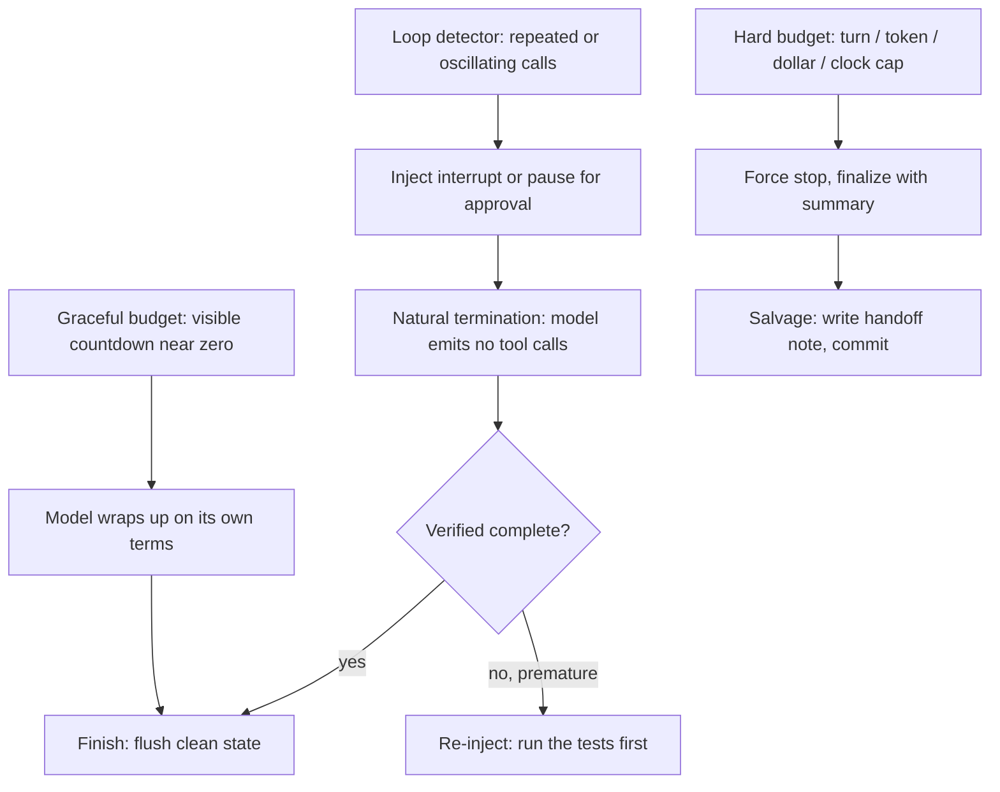
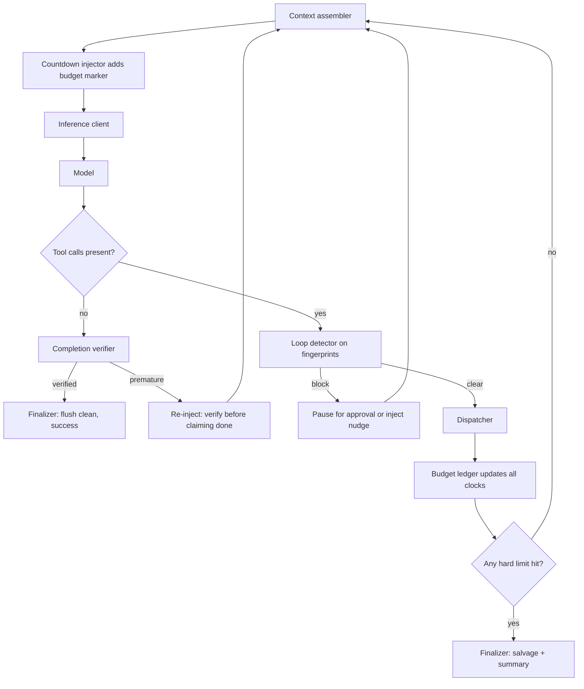

> [!info] Context
> Part of [[Harness-Internals-Overview|Harness Engineering Internals]], Level 2 wave. Parent chapter: [[Harness-Internals-Runtime-Anatomy]], which established the six-component harness and named termination as "a first-class design problem, not an afterthought." This chapter opens Cluster B by taking that claim apart: how an agent decides to stop, how it detects it is stuck, how four independent budgets are enforced together, and how a fleet of agents is kept from bankrupting the org that runs them. It is foundational for the rest of Cluster B — [[Harness-Internals-Scheduling-And-Steering]] (cancellation and interrupt), [[Harness-Internals-Durable-Execution]] (crash-resume), and [[Harness-Internals-Agent-Topology-Economics]] (the cost model).

# Termination, Budgets, and Loop Control

## 1. Executive Overview

Every agent harness is a `while` loop, and every `while` loop needs a condition that turns it off. That sentence sounds trivial and is the reason most people underestimate the problem. In ordinary software the loop's exit condition is a boolean you compute from data you control. In an agent harness the loop's *primary* exit condition is a stochastic model deciding, on its own, to emit a response with no tool calls — a decision you cannot compute, cannot guarantee, and cannot fully trust. Everything else in this chapter exists because you cannot rely on the model to stop.

Termination is where three otherwise-separate concerns collide: **correctness** (did the task actually finish, or did the model just quit?), **safety** (is the loop about to run forever, deleting files or spending money the whole way?), and **cost** (an agent with no ceiling is an unbounded line item on a bill someone eventually reads). The parent chapter's equation was Agent = Model + Harness. The refinement this chapter adds: the harness's most under-documented job is not deciding what the agent *does* — it is deciding when the agent *stops doing it*, and doing that gracefully enough that a forced stop leaves clean, resumable state rather than a half-applied edit and a broken build.

Here is the reframing claim, the one that should change how you think even if you have already built an agent loop: **stopping and finishing are different operations, and conflating them is the root of most agent-reliability failures.** *Stopping* is cutting the loop off — trivial, a counter and a `break`. *Finishing* is the model reaching a verified-complete state and then stopping — hard, because it requires the model to know it is done and to leave the world in a coherent state on the way out. A turn cap that fires mid-edit *stops* the agent; it does not *finish* it, and the difference is the gap between "resume tomorrow" and "spend an hour cleaning up a corrupted working tree." The entire discipline of termination engineering is the work of converting cheap, reliable *stopping* mechanisms into graceful *finishing* behavior — surfacing budget pressure to the model early enough that it wraps up on its own terms, before the hard cap ever has to fire.

## 2. Historical Evolution

The history of agent termination is a history of learning, repeatedly and expensively, that the loop does not stop itself.

**Phase 0 — the human was the loop condition (2022–early 2023).** In the ChatGPT-as-copy-paste era covered in [[Harness-Internals-Runtime-Anatomy]], termination was a non-problem: a human ran each step and simply stopped asking. There was no autonomous loop to run away.

**Phase 1 — ReAct and the first runaway loops (2022–2023).** The moment ReAct-style agents ran unattended, the failure appeared. LangChain's early `AgentExecutor` shipped with `max_iterations` (default 15) and `max_execution_time` almost from the start, not as a feature but as a bandage: prompt-parsed agents drifted, hallucinated tool names, and re-ran the same failing action until something killed them. The `max_iterations` counter was the industry's first admission that the model would not reliably stop.

**Phase 2 — recursion limits as graph safety (2023–2024).** When LangGraph reframed the agent as a state graph with cycles, it inherited the halting problem in its purest form: a graph with a cycle can run forever. LangGraph's answer was `recursion_limit`, default **25 supersteps**, raising `GraphRecursionError` on breach (per the LangChain docs). This was a philosophical shift — the limit was framed not as "your task is too big" but as "your agent is probably stuck," with the docs explicitly warning that raising the limit to 1,000 just means "paying for 1,000 API calls instead of 25" without fixing the underlying cycle.

**Phase 3 — the SDK budget era (2024–2025).** As harnesses matured into products, budgets multiplied and specialized. OpenAI's Agents SDK made `max_turns` a first-class `Runner` argument (default **10**), raising `MaxTurnsExceeded`. The Claude Agent SDK shipped `max_turns` *and* `max_budget_usd`, returning a structured `ResultMessage` with subtype `error_max_turns` or `error_max_budget_usd` rather than throwing. Cursor exposed the ceiling directly in its UI: **25 tool calls** per interaction in standard agent mode, raised to **200** in MAX mode, with a "Continue" button turning the hard cap into a human checkpoint. The pattern across all of them: turn-counting as the universal backstop, because it is the one signal that is always available and impossible to game.

**Phase 4 — doom-loop detection as a named feature (2025–2026).** Turn caps stop a runaway loop, but only after it has burned the entire budget. The next generation of harnesses added *early* detection: fingerprinting repeated tool calls to catch a stuck agent within a handful of repetitions rather than after 25. Kilocode's stream processor popularized the pattern; it was ported into opencode, PraisonAI shipped a `loop_detection_plugin`, and NousResearch's hermes-agent filed it as an explicit feature (issue #512, "Doom Loop Detection — Pause on Repeated Identical Tool Calls"). Dzianis Vashchuk's widely-cited "Agent doom loop" writeup put a dollar figure on the stakes — a **$250 overnight loss** from eight agents stuck in a `TodoWrite` feedback loop — and crystallized the lesson that these bugs "only manifest when you leave the agent alone long enough."

**Phase 5 — graceful budget exhaustion and fleet governance (2026).** The frontier moved from *stopping* to *finishing*. Anthropic's "Effective harnesses for long-running agents" (November 2025) documented clean-state handoff across context windows — progress files, per-boundary git commits, one-feature-at-a-time discipline. Anthropic then shipped **task budgets** (beta, `task-budgets-2026-03-13`), which inject a token countdown *the model can see*, so it paces itself and "finishes gracefully as the budget is consumed" instead of being truncated mid-action. Simultaneously the governance layer went organization-wide: Anthropic's Admin Usage & Cost API, LiteLLM's team/user/key budget hierarchy, and Codex's Compliance-API usage reporting turned per-session caps into fleet-wide spend controls. Termination had become a three-level concern: within a turn, within a session, and across an organization.

The through-line: each phase added a control because the previous phase's control fired *too late*. The turn cap catches the loop that the model failed to exit; the doom-loop detector catches the loop before the turn cap; the visible budget countdown catches it before the detector, by making the model exit on its own. Each layer buys earlier, cheaper, cleaner termination.

## 3. First-Principles Explanation

Start from the loop itself, stripped to nothing (this is the loop from [[Harness-Internals-Runtime-Anatomy]] §7, now read for its exit conditions):

```python
while True:
    resp = model.call(context)
    if not resp.tool_calls:
        break                    # (A) natural termination
    results = dispatch(resp.tool_calls)
    context.extend(results)
```

There is exactly one termination path here, marked (A): the model chooses not to call a tool. Ask the first-principles question — *what could go wrong with relying only on (A)?* — and every budget and detector in this chapter falls out as a necessary answer.

**Necessity 1: (A) may never happen.** The model is a probability distribution over next tokens. Nothing in that distribution guarantees it will ever place high probability on "stop." If the context keeps nudging it toward action — an unresolved error, a tool that keeps returning "not done yet" — it can loop forever. The halting problem is not decidable in general, and you certainly cannot decide it for a stochastic black box. Therefore: *the harness must impose an external stop the model cannot override.* This is the **hard budget** — a counter in harness code (`max_turns`, `recursion_limit`) that fires regardless of what the model wants. It is the load-bearing wall of the whole design because it is the only guarantee of termination that exists.

**Necessity 2: (A) may happen for the wrong reason.** The model may stop because it *believes* it is done when it is not — Anthropic's "premature completion" failure mode. Natural termination is a claim by the model, and the model's claims are exactly as trustworthy as the rest of its output: not enough to be load-bearing for correctness. Therefore: *finishing must be verified against the environment, not accepted on the model's say-so.* This connects termination to the sensor discipline of the parent chapter — a completion claim should be structurally contingent on a test having actually run in the transcript.

**Necessity 3: (A) may be delayed by uninformative feedback.** The subtlest failure. The model is *trying* to make progress, but each action returns a result that gives it no new information, so its next-token distribution keeps producing the same plan. It re-runs the failing command, reads the same file, calls the same tool. This is the **doom loop**, and it is distinct from Necessity 1 because the model is not misbehaving — the *harness* is, by feeding it a signal it cannot learn from. Therefore: *the harness must detect stalled progress and inject new information (or stop).* This is **loop detection**, and its root-cause fix lives in tool design (return informative errors), not in the detector.

**Necessity 4: the hard stop from Necessity 1 is violent.** A counter that fires mid-edit leaves broken state — the "undocumented broken state" failure mode. The hard budget guarantees termination but not *clean* termination. Therefore: *the harness needs a soft signal, surfaced early, that lets the model wind down before the hard stop.* This is the **graceful-degradation budget** (task-budget countdown, `RemainingSteps` checks) — advisory pressure applied before the enforced ceiling.

Those four necessities define the four-layer defense that every serious harness converges on, from cheapest-and-latest-firing to most-graceful-and-earliest:



Read top to bottom, this is a defense-in-depth stack. You *want* termination to happen as high in the diagram as possible: natural, verified finishing is best; a forced kill at the bottom is worst but must always be present as the guarantee. The engineering craft of this chapter is pushing the actual termination point upward — making the graceful and detection layers fire before the hard cap ever has to.

One more first-principles distinction, because it governs how each control is *enforced*. Budgets come in two enforcement regimes:

- **Hard (enforced):** harness code that the model cannot influence. `max_turns`, `max_tokens`, `recursion_limit`, wall-clock timeouts, `max_budget_usd`. These *guarantee* a bound. They are deterministic, non-bypassable, and — crucially — dumb: they cannot leave clean state, they just cut.
- **Soft (advisory):** signals surfaced to the model that *bias* it toward stopping but do not force it. The task-budget countdown, a system-reminder saying "you are running low on context." These enable graceful finishing but *guarantee nothing* — the model can ignore them.

You need both, for the same reason [[Harness-Internals-Runtime-Anatomy]] argued you need both guides and sensors: soft budgets produce clean termination when they work; hard budgets produce guaranteed termination when the soft ones don't. Anthropic's task-budgets documentation is explicit that its budget is "a soft hint, not a hard cap," and that `max_tokens` remains "the absolute ceiling that prevents runaway generation." That pairing — advisory pacer plus enforced ceiling — is the canonical pattern.

## 4. Mental Models

**The circuit breaker and the fuel gauge.** An electrical circuit breaker trips at a hard current threshold to prevent a fire; it does not care what you were doing. That is the hard budget: `max_turns` as a breaker that trips to prevent a runaway. A fuel gauge is different — it does not stop the car, it *informs the driver*, who then decides to find a gas station before running dry. That is the task-budget countdown: a gauge the model reads to decide when to wrap up. A car needs both. A gauge with no low-fuel cutoff lets an inattentive driver strand themselves; a hard cutoff with no gauge strands *everyone* the instant the tank empties, mid-highway. Every mature harness pairs a gauge (soft, visible to the model) with a breaker (hard, in harness code). When you see a harness with only a turn cap and no visible budget signal, you are looking at a car with a breaker and no gauge: it will never catch fire, but it will strand its passengers mid-edit constantly.

**Termination as a controller, not an event.** The parent chapter framed the whole harness as a control loop. Termination is that controller's stopping criterion, and control theory has a name for the failure it prevents: *limit cycles* — a system oscillating forever around a setpoint it never settles on. A doom loop is a limit cycle in agent space. The perseveration-loop research (arXiv 2510.10823) makes this literal: it defines a loop as detected when, over a sliding window, "a small-period cycle is detected in a ring buffer of recent positions (period P ≤ 3)," progress "is below ε," and a "revisit ratio... exceeds a threshold." That is the control engineer's oscillation detector transplanted into an agent harness. Thinking in these terms tells you *what to measure*: not just repetition, but repetition **combined with lack of progress**, because a poll loop that legitimately repeats while progress advances is not a doom loop.

**The three clocks.** An agent runs against three independent clocks, and experts keep them mentally separate because each fails differently. The **turn clock** counts model round-trips — it bounds *reasoning steps* and catches logical non-convergence. The **token clock** counts context consumed — it bounds *how much the model has read and written* and catches context exhaustion. The **wall clock** counts real seconds — it bounds *latency and lease time* and catches hung tools and infrastructure stalls. A short task can be fast on all three; a doom loop is slow on the turn clock but may be cheap on the token clock (tiny repeated calls); a single runaway `grep` on a huge repo blows the wall clock and token clock while barely touching the turn clock. Because the failure modes are orthogonal, the budgets must be independent and enforced together — no single clock catches everything.

**Stopping is a `break`; finishing is a protocol.** Hold this one above all others. A junior engineer implements termination as `if turns > N: break`. A senior engineer implements it as a *protocol*: detect pressure early, tell the model to reach a safe checkpoint (commit, write the progress file, note what remains), *then* stop. The difference is the difference between `kill -9` and `SIGTERM`-with-a-cleanup-handler. Anthropic's long-running-agent design is essentially a `SIGTERM` handler for agents: the discipline of "commit to git with descriptive messages" and "write summaries of progress in a progress file" at every boundary is exactly a cleanup handler that makes the next process able to resume.

## 5. Internal Architecture

Termination logic is not one component; it is a cross-cutting concern that touches the loop at three points. Recall the six components from [[Harness-Internals-Runtime-Anatomy]] §5 — the piece that owns termination is the **state store & termination controller**, but it reads signals produced everywhere. Here is the decomposition specific to this chapter:

- **Budget ledger.** Holds the running counts against each clock: turns used, tokens consumed (input + output + tool results), dollars spent, wall-clock elapsed. Updated after every model call and every tool dispatch. This is the source of truth for "how much have we spent."
- **Budget policy.** The configured limits (`max_turns`, `max_budget_usd`, token budget, wall-clock deadline) plus the *composition rule*: how they combine (almost always "stop when **any** limit is hit" — the effective budget is the minimum over all clocks).
- **Loop detector.** Maintains a sliding window (ring buffer) of recent tool calls, each reduced to a **fingerprint**. Runs one or more detectors — exact-repeat, oscillation, poll-no-progress — after each tool-call request, before dispatch. Emits a signal: `clear`, `warn`, or `block`.
- **Countdown injector.** For soft budgets: computes remaining budget and injects a marker the model can read (server-side in Anthropic's task budgets; a `RemainingSteps` value in LangGraph). This is the fuel gauge.
- **Completion verifier.** Guards natural termination against premature completion: when the model stops, checks whether the stop is backed by evidence (tests run, feature-list entries flipped to pass) before accepting it as *finished* rather than merely *stopped*.
- **Finalizer.** The graceful-shutdown path. When any hard limit is about to fire, this component gives the model a last chance to commit clean state and write a handoff, then serializes the transcript and returns a structured result (`ResultMessage` subtype, `MaxTurnsExceeded`, or a salvaged summary).

The data flow, with the termination touch-points marked:



Two architectural points deserve emphasis. First, the loop detector runs **before** dispatch — it must, because the whole point is to *not* execute the repeated call. Second, the budget check runs **after** dispatch and ledger update but before the next context assembly, so the loop always completes the in-flight tool call before checking whether to stop (you never want to leave a tool half-run). This ordering is why a hard budget still tends to stop at a *coherent* boundary — between turns, not mid-tool — even though it is a blunt instrument.

## 6. Step-by-Step Execution

Walk a concrete doom loop from birth to interception, then a concrete graceful budget exhaustion. This is the anatomy in motion.

**Scenario A — a doom loop caught by fingerprint detection.** Task: "make the flaky integration test pass." The test fails because of a race condition the model cannot see from the test output alone.

1. **Turn 1.** Model calls `Bash(npm test -- integration)`. Fingerprint computed: `md5("Bash" + canonical_json({command: "npm test -- integration"}))` → `a3f2...`. Ring buffer: `[a3f2]`. Detector: clear. Dispatch. Result: "1 failing: expected 200, got 500." Ledger: 1 turn, ~800 tokens.
2. **Turn 2.** Model reads the handler, edits a line it *thinks* fixes it, re-runs. Fingerprint of the re-run `npm test` is again `a3f2`. Buffer: `[read, edit, a3f2]`. The `a3f2` count in the window is 2. Detector: clear (threshold is 3). Result: still "expected 200, got 500" — identical, because the edit did not address the race.
3. **Turn 3.** The model, seeing the *same* error, makes a *similar* edit and re-runs `npm test` — `a3f2` again. Buffer window now contains `a3f2` three times. **Detector fires: `block`.** This is the exact-repeat detector from the Hermes/Kilocode design: "if any fingerprint appears 3 or more times... inject a `[SYSTEM WARNING]`... and skip tool execution for that turn."
4. **Intervention.** The harness does *not* run the test a third time. It injects a system message: "You have run `npm test -- integration` three times with an identical result. The feedback is not changing. Step back: the failure may be a race condition invisible in the test output. Add logging, or run the test with `--runInBand`." This is new information — the thing the uninformative test output failed to provide.
5. **Turn 4.** The model, now steered, runs `npm test -- integration --runInBand` (a *different* fingerprint, `b91c...`), the race disappears, the test passes. Natural termination follows. Had the injected nudge failed and the model re-run `a3f2` a fourth time, the two-tier escalation kicks in: the harness pauses and asks the human "Agent is repeating the same action. Allow / Break?" — because, as the Hermes issue puts it, "LLMs can ignore injected text, but they cannot bypass a genuine execution halt."

Notice what the detector bought: interception at turn 3 instead of turn 25. Under a bare `max_turns=25` cap, the agent would have burned 22 more turns of identical failing tests before the breaker tripped — and then stopped with the bug *unfixed* and the working tree holding a useless edit. The detector converted a guaranteed-failure runaway into a steered success.

**Scenario B — graceful token-budget exhaustion.** Task: "audit this repo for security issues and report findings," run with Anthropic task budgets, `task_budget: {type: "tokens", total: 100000}`.

1. **Turn 1.** The server injects a countdown marker the model sees: `remaining ≈ 100000`. The model thinks, then calls `bash(cat package.json && npm audit --json)`, spending ~5,000 tokens on thinking + the tool call. Countdown the model saw ended near **95,000**. (Per the task-budgets docs, the countdown counts what the model *sees* — thinking, tool calls, tool results, output — not what the client re-sends.)
2. **Turn 2.** Client executes the tool, appends the 2,800-token audit output. That result counts against the budget as the model reads it. Model spends ~4,000 more on thinking + a `grep`. Countdown: **≈88,200**.
3. **Middle turns.** The audit is large. By turn 9 the countdown reads **≈22,000**. The model, *seeing* this, changes behavior: instead of opening three more files, it begins consolidating. This is the entire point — the model "uses this signal to pace itself and finish gracefully."
4. **Wind-down.** At **≈12,000 remaining**, the model stops investigating and writes its findings report. It does not get truncated mid-sentence, because it chose to start the report while it still had room. Natural termination at `stop_reason: end_turn` with **≈6,000** to spare.

Contrast the ungraceful version: no visible budget, just a hard `max_tokens`. The model investigates until the context is full, starts writing the report, and gets cut off with `stop_reason: max_tokens` **mid-finding** — a truncated, useless report and no signal that it was the *budget*, not the *analysis*, that ended it. The visible countdown is what converts a truncation into a graceful finish. (And the docs warn of the opposite failure: a budget set *too small* — "a 20,000-token budget for a multi-hour agentic coding task" — makes the model "decline to attempt the task at all," a refusal-like behavior. The gauge only helps if the tank is plausibly big enough for the trip.)

## 7. Implementation

Here is the shape of a termination controller you could build, threading all four layers into the loop from [[Harness-Internals-Runtime-Anatomy]].

**The fingerprint and ring-buffer detector.** This is the exact-repeat + oscillation core, ~40 lines, following the Kilocode/Hermes/opencode designs:

```python
import hashlib, json
from collections import deque

def fingerprint(call) -> str:
    # Canonical JSON so key order never changes the hash.
    payload = call.name + json.dumps(call.input, sort_keys=True, separators=(",", ":"))
    return hashlib.md5(payload.encode()).hexdigest()

class LoopDetector:
    def __init__(self, window=20, repeat_threshold=3, is_poll=None):
        self.window = deque(maxlen=window)     # ring buffer of (fp, result_hash)
        self.repeat_threshold = repeat_threshold
        self.is_poll = is_poll or (lambda name: any(
            k in name.lower() for k in ("status", "poll", "check", "wait", "ping", "health")))

    def observe(self, call, result) -> str:      # -> "clear" | "warn" | "block"
        fp = fingerprint(call)
        rh = hashlib.md5(str(result).encode()).hexdigest()
        # (1) Exact-repeat: same fingerprint N times in the window.
        repeats = sum(1 for f, _ in self.window if f == fp)
        # (2) Poll-no-progress: polling tool, same args AND same result.
        stalled_poll = (self.is_poll(call.name)
                        and any(f == fp and r == rh for f, r in self.window))
        # (3) Oscillation: A,B,A,B — current fp equals the one two steps back,
        #     and the last two fingerprints differ.
        fps = [f for f, _ in self.window]
        oscillating = (len(fps) >= 3 and fp == fps[-2] and fps[-1] != fps[-2])
        self.window.append((fp, rh))
        if repeats + 1 >= self.repeat_threshold or stalled_poll or oscillating:
            return "block" if repeats + 1 > self.repeat_threshold else "warn"
        return "clear"
```

Three design notes that separate this from a toy. **Canonical serialization is not optional** — `json.dumps(..., sort_keys=True)` — because `{a:1,b:2}` and `{b:2,a:1}` are the same call and must hash the same, or the detector silently misses loops. **The poll classifier prevents false positives**: a `check_build_status` tool that legitimately polls a server *should* repeat; you exempt it from exact-repeat but *not* from poll-no-progress (repeating with an *unchanged result* is still a stall). PraisonAI's plugin ships exactly this heuristic — polling tools matched by keywords like "status," "poll," "check," "wait," "ping," "health." **Cross-message scope matters**: the opencode bug report (#25254) documents a real failure where detection "only examines the current assistant message, missing repetitions across multiple conversation turns" — you must fingerprint across *all* tool calls since the last user turn, not just within one response.

**The composed budget check.** Enforcing four clocks together is a `min` over independent predicates:

```python
class BudgetLedger:
    def __init__(self, max_turns=None, max_tokens=None,
                 max_usd=None, deadline_s=None):
        self.limits = dict(turns=max_turns, tokens=max_tokens,
                           usd=max_usd, seconds=deadline_s)
        self.used = dict(turns=0, tokens=0, usd=0.0, seconds=0.0)
        self.t0 = time.monotonic()

    def charge(self, turns=0, tokens=0, usd=0.0):
        self.used["turns"]  += turns
        self.used["tokens"] += tokens
        self.used["usd"]    += usd
        self.used["seconds"] = time.monotonic() - self.t0

    def breached(self) -> str | None:            # returns the clock that tripped
        for clock, limit in self.limits.items():
            if limit is not None and self.used[clock] >= limit:
                return clock
        return None

    def pressure(self) -> float:                 # 0.0 = fresh, 1.0 = exhausted
        ratios = [self.used[c] / lim for c, lim in self.limits.items() if lim]
        return max(ratios, default=0.0)
```

The `breached()` method returns the *first* clock to trip, which is the effective budget — the minimum across clocks. `pressure()` is what feeds the soft layer: when it crosses, say, 0.8, the harness injects a wind-down nudge. This is the manual equivalent of LangGraph's `RemainingSteps` managed value, which (per the source, `is_last_step.py`) computes `scratchpad.stop - scratchpad.step` so a node can check `if state["remaining_steps"] <= 2: wrap_up()` and end gracefully before the `recursion_limit` throws.

**The loop, fully wired:**

```python
async def run_turn(session, budget, detector):
    for _ in range(budget.limits["turns"] or 10_000):
        ctx = assemble_context(session)
        if budget.pressure() >= 0.8:
            ctx.inject_system("Budget is running low. Reach a safe checkpoint: "
                              "commit your work, update the progress file, and "
                              "summarize what remains. Then stop.")     # soft
        resp = await model.call(ctx, budget=budget)
        session.append(resp); budget.charge(turns=1, tokens=resp.usage.total,
                                            usd=resp.cost)
        if not resp.tool_calls:
            if verify_completion(session):      # guard premature completion
                return finalize_success(session)
            session.inject_system("Do not claim completion until tests pass. Run them.")
            continue
        for call in resp.tool_calls:
            signal = detector.observe(call, peek=None)
            if signal == "block":
                session.inject_system(loop_break_message(call)); break
            result = await dispatch(call)
            session.append(result)
            budget.charge(tokens=result.tokens)
            detector.observe(call, result)      # record actual result for poll detection
        if clock := budget.breached():          # hard cap — after in-flight work
            return finalize_salvage(session, reason=clock)   # graceful shutdown
    return finalize_salvage(session, reason="turns")
```

The ordering is the whole lesson: soft nudge at the top (before the model acts, while it can still choose to wind down), detector before dispatch (so a blocked call never runs), hard check after dispatch (so we stop at a clean turn boundary), and *both* exits route through a `finalize_*` that flushes state rather than a bare `return`.

**The `finalize_salvage` path** is where graceful meets forced. It is the agent's `SIGTERM` handler:

```python
def finalize_salvage(session, reason):
    # One last, cheap, non-model action to leave clean state.
    run_tool(Bash("git add -A && git commit -m 'WIP: budget-limited checkpoint' || true"))
    write_progress_file(session)      # what was done, what remains, current failures
    summary = cheap_model.summarize(session)   # small model, not the frontier one
    return ResultMessage(subtype=f"error_max_{reason}", result=None,
                         handoff=summary, session_id=session.id)
```

Note it returns `result=None` on the error subtype — matching the Claude SDK contract where `result` is populated *only* on `success`, forcing the caller to check the subtype before trusting the output. That is a deliberate type-level guardrail against treating a truncated run as a finished one.

## 8. Design Decisions

**Why turn-counting is the universal backstop.** Every harness — LangChain (`max_iterations`), LangGraph (`recursion_limit=25`), OpenAI Agents SDK (`max_turns=10`), Claude SDK (`max_turns`), Cursor (25/200) — has a turn cap, and they converged on it independently for a first-principles reason: the turn count is the *one* signal that is always available, monotonic, and impossible for the model to influence. Tokens require accounting that varies by model; dollars require a pricing table; wall-clock is noisy under load. The turn is the atomic unit of the loop, so counting it is free and exact. It is the crudest budget and the only one you can never omit. The trade-off it accepts: a turn cap is *semantically blind* — 25 turns might be a trivial lookup wildly over-provisioned or a deep refactor cut off at the knees. It bounds runaway but says nothing about value delivered.

**Advisory versus enforced budgets — and why Anthropic chose advisory for tokens.** The deepest design decision in the space. A token budget could be enforced (hard-cut at N tokens) or advisory (show the model a countdown, let it self-regulate). Anthropic shipped task budgets as *advisory* — "a soft hint, not a hard cap" that "Claude may occasionally exceed... if it is in the middle of an action that would be more disruptive to interrupt than to finish." Why choose the weaker guarantee? Because the goal is *graceful finishing*, and only the model knows when it is at a safe stopping point. A hard token cut cannot know whether it is severing a completed thought or a half-written function; the model can. So Anthropic pairs the advisory pacer with an enforced `max_tokens` ceiling — the model self-regulates against the soft signal, and the hard ceiling catches the rare case where it doesn't. This is the general pattern: **use soft budgets for gracefulness, hard budgets for guarantees, and always have both.** A harness with only hard budgets truncates constantly; one with only soft budgets has no bound at all.

**Where to detect loops: exact-repeat versus semantic similarity.** Two philosophies. **Exact-repeat fingerprinting** (MD5 of tool + canonical args) is cheap, deterministic, zero-latency, and catches the most common doom loop — the model literally re-running the same call. Its blind spot: a model that varies its calls slightly (reads `foo.py`, then `foo.py ` with a trailing space, then `./foo.py`) evades the hash while making no real progress. **Semantic similarity** (embed each tool call or agent state, flag when successive embeddings exceed a similarity threshold) catches those near-duplicates. The "Semantic Early-Stopping for Iterative LLM Agent Loops" paper (arXiv 2606.27009) reports halting when embedding similarity crosses a threshold "typically in the 0.85–0.95 range," reducing iterations "by approximately 30–40% while maintaining answer quality." The trade-off is stark: semantic detection needs an embedding call per step (latency + cost + a model dependency), and a mis-tuned threshold either misses loops (too high) or kills legitimate iterative refinement that *looks* similar but is progressing (too low). The industry verdict as of 2026: **exact-repeat fingerprinting is the default because it is free and safe; semantic detection is a research-grade refinement worth it only where near-duplicate evasion is common and an extra embedding call per turn is affordable.** Most shipping harnesses (opencode, PraisonAI, Hermes) use fingerprinting; semantic stopping lives mostly in papers and specialized QA agents.

**The oscillation gap.** Exact-repeat catches A-A-A; it misses A-B-A-B. A model bouncing between "edit file" and "revert edit," or "hypothesis 1" and "hypothesis 2," never repeats a single call three times, so a naive repeat counter never fires. This is why serious detectors add the oscillation check (current fingerprint equals the one two steps back) and why the perseveration-loop literature insists on the *combined* signal: cycle detection **plus** a progress metric below ε. Repetition alone is not a doom loop; repetition without progress is. Getting this wrong in either direction is costly — false negatives waste the whole budget, false positives interrupt a legitimately-repetitive-but-progressing task (compiling, then polling a deploy, then compiling again).

**Why the root-cause fix is tool design, not detection.** The most important and least-implemented decision. A doom loop is a *symptom*; the disease is uninformative feedback. Vashchuk's $250 loss traced to a `TodoWrite` tool that "returned the full current state after each call," so "the model saw that state, decided something needed updating, called `TodoWrite` again," forever. The detector would have caught it — but the *fix* was "stop reflecting full state back to the model on every tool call. Return minimal confirmation instead." LangGraph's docs say the same: the durable fix for recursion errors is to "improve your tool's error messages so the agent can reason its way out of the loop," not to raise the limit. Detection is a safety net; informative tool results are the floor you should not fall onto in the first place. A harness that relies on loop detection to paper over chatty, uninformative tools is treating the symptom.

**Composition: minimum, not sum.** When four budgets coexist, the effective limit is the *minimum* — stop when *any* clock trips — not a weighted sum. This is a safety decision: you want the *most conservative* bound to win, because each clock guards a different disaster (turns guard non-convergence, dollars guard the bill, wall-clock guards a hung tool). Summing or averaging them would let a cheap-but-infinite loop evade the dollar cap by staying under it forever. Every production harness composes with `any()`.

## 9. Failure Modes

**The turn cap that stops mid-edit.** The classic. `max_turns` fires while the model has a file half-edited and a test half-written; the working tree is now inconsistent, and the next session inherits a broken build it mistakes for the model's bug. *Debug:* look at the last turn before the `error_max_turns` subtype — is it a mutating tool? *Fix:* the `finalize_salvage` path — commit WIP and write a handoff before returning — plus a soft pressure nudge that starts wind-down at 80% so the hard cap rarely fires mid-action.

**The detector that misfires on legitimate polling.** A `wait_for_deploy` tool that polls every 10 seconds trips the exact-repeat detector on its third call and gets blocked — now the agent can never wait for anything. *Debug:* the loop-break message appears on a tool that is *supposed* to repeat. *Fix:* the poll classifier (exempt polling tools from exact-repeat, subject them to poll-*no-progress* instead — same call **and** same result). PraisonAI's separate `poll_no_progress` detector exists precisely for this.

**Cross-turn loop evasion.** The opencode bug (#25254): the model repeats `read_file` with the same path once per turn across three turns. Each *message* contains only one repetition, so a per-message detector never sees three. *Debug:* the agent is visibly stuck but the detector never fires. *Fix:* fingerprint across all tool calls since the last *user* turn, not within a single assistant message. Also from that bug: the "inverted filter order" — slicing the window before filtering by tool name lets a stray text block break the all-match check. Filter by fingerprint *first*, then count.

**Premature completion accepted as success.** The model emits no tool calls and a confident "All done, the feature works" — but no test ran. The harness treats natural termination as finished. *Debug:* the `success` result has no test invocation in the transcript. *Fix:* the completion verifier — gate `success` on evidence (a test result in the transcript, feature-list entries flipped to pass). Anthropic's feature-list-as-JSON pattern, where every feature starts "failing" and only the environment can flip it, exists to make premature victory *structurally* impossible.

**The budget-too-small refusal.** Counterintuitive: setting a token budget *below* what the task needs makes the model refuse or scope down aggressively rather than attempt. The task-budgets docs flag this directly — "if you observe unexpected refusals or premature stops after setting a budget, raise the budget before debugging other parameters." *Debug:* the model quits immediately or scopes the task to a fraction. *Fix:* size budgets against the *p99* of measured task spend, not a guessed default.

**The countdown-mirroring bug that starves the model early.** Specific to advisory token budgets. If your client both re-sends full history *and* decrements `remaining` on each turn, "the model sees an under-reported budget and the countdown drops faster than it should, causing Claude to wrap up earlier than the budget actually allows" (task-budgets docs). *Debug:* the model finishes with lots of budget nominally left. *Fix:* set the budget once on the initial request and let the server track the countdown; only pass `remaining` when you actually compact/rewrite history.

**Silent budget-check on stale spend.** In a distributed gateway (LiteLLM), budget enforcement reads spend from a shared counter; if that counter is stale, a key can overspend before the check catches up. LiteLLM issue #27735 documents exactly this — "BudgetExceededError uses stale spend while /key/info shows spend below max_budget." *Debug:* spend overshoots the cap under concurrency. *Fix:* the cross-pod Redis counter LiteLLM uses "to keep enforcement fast and consistent across workers" — but be aware there is an inherent race window between charge and check under high concurrency.

**Cost blindness across a fleet.** No per-session `max_budget_usd`, no org quota; one runaway agent among hundreds spends thousands before anyone notices at month-end. *Debug:* the bill, too late. *Fix:* the three-tier governance of §10 — per-session hard cap, workspace budget alerts, org-level usage API polled daily.

## 10. Production Engineering

How the majors actually terminate agents, with epistemic labels.

**Anthropic / Claude Code + Agent SDK.** *Verified (documentation):* The Agent SDK ships `max_turns` and `max_budget_usd`, both defaulting to *no limit*, returning a `ResultMessage` with subtype `error_max_turns` / `error_max_budget_usd` and `result` populated only on `success`. Automatic compaction fires as context nears the window limit, emitting a `compact_boundary` system message — a form of *soft* termination pressure on the token clock. Task budgets (beta `task-budgets-2026-03-13`, on Fable 5, Mythos 5, Opus 4.8, Opus 4.7 — *not* on Claude Code surfaces) inject a model-visible token countdown for graceful wind-down. The long-running-agent harness handles cross-session termination via progress files (`claude-progress.txt`), per-boundary git commits, one-feature-at-a-time discipline, and session-open re-verification. *Inference (from the docs' framing, not an internal spec):* Claude Code's interactive doom-loop handling — the visible "esc to interrupt" and its internal repeated-call heuristics — is not fully documented; the SDK exposes the caps but the CLI's live loop-break UX is reverse-engineered from behavior.

**OpenAI / Codex + Agents SDK.** *Verified:* The Agents SDK enforces `max_turns` (default 10) and raises `MaxTurnsExceeded`, with `error_handlers={"max_turns": ...}` to return a controlled output instead of throwing, and `max_turns=None` to disable. Codex governs *cost* at the plan/org level: usage counts toward an "agentic usage limit," API-route usage is bounded only by "the spend limit you set on the dashboard," and enterprise controls include RBAC, audit logs, and usage monitoring "via the Compliance API" covering CLI, IDE, and cloud usage. *Inference:* Codex's cloud sandbox almost certainly imposes wall-clock lease limits on container runs (standard for any container fleet), but the exact timeout is not published.

**Cursor.** *Verified:* Standard agent mode caps at **25 tool calls** per interaction, surfaced as a "Continue" checkpoint (human-in-the-loop turn extension) rather than a silent kill; MAX mode raises it to **200**. Cursor also exposes a team/user **spending limit** in dollars. *Inference (community analysis):* the 25-call default is tuned as much for cost predictability as for safety — it forces a human decision point before a long autonomous run, which both bounds spend and re-grounds the user. Not vendor-stated.

**LangChain / LangGraph.** *Verified:* `recursion_limit` (default 25 supersteps) raises `GraphRecursionError`; `RemainingSteps` is a managed value computing `stop - step` for in-graph graceful wind-down; `max_execution_time` bounds wall-clock in the legacy `AgentExecutor`. Because parallel nodes run in one superstep, the recursion count is *not* a simple tool-call count — a subtlety that trips teams whose fan-out graphs hit the limit faster than expected.

**Fleet governance — the gateway pattern.** *Verified:* This is where per-session termination becomes org policy. **Anthropic's Admin Usage & Cost API** (`/v1/organizations/usage_report/messages`, `/cost_report`) reports token and dollar spend bucketed by workspace, API key, model, and service tier at 1m/1h/1d granularity; workspaces can carry monthly budget alerts (e.g., a "$500 cap on specific dev workspaces"), and the Enterprise Analytics API attributes spend per named user. **LiteLLM** productizes a four-level budget hierarchy — key, user, team, tag — each with `max_budget` and a `budget_duration` reset window, enforced against a cross-pod Redis spend counter, with independent budget windows (a daily cap under a monthly ceiling). **Codex** exposes org spend limits plus Compliance-API usage export. The architecture is consistent across all three: a **proxy/gateway** sits between every agent and the model API, tags each request to a key/team/user, accumulates spend in a shared fast store, and rejects (`BudgetExceededError`) once a cap is hit — turning thousands of independent agent loops into one governable spend surface. This is the fleet-scale generalization of the per-session `max_budget_usd`: the same "stop when the dollar clock trips" logic, hoisted from one loop to the whole organization.

The cross-company convergence is the tell: everyone ships (a) an un-omittable turn/step cap, (b) an optional dollar cap, and (c) an external usage/cost API for governance. They disagree only on the *soft* layer — Anthropic invests heavily in a model-visible countdown, Cursor in a human "Continue" checkpoint, OpenAI in error-handler hooks — reflecting different bets on *who* should make the wind-down decision: the model, the user, or the calling code.

## 11. Performance

Termination logic is cheap; getting it wrong is expensive. The performance story is entirely about *what a bad termination decision costs*, not about the CPU cost of the check itself.

**The detector is free; the loop it prevents is not.** An MD5 fingerprint over a tool call is sub-microsecond; a ring buffer of 20 entries is nothing. Against that, one avoided doom-loop turn saves a full frontier-model round-trip — on the order of $0.01–$0.50 and 2–20 seconds depending on model and context size. Catching a loop at repetition 3 instead of turn 25 saves ~22 model calls. The detector's cost/benefit ratio is so lopsided that there is no performance argument against running it; the only cost is false-positive interruptions, which are a *correctness* problem, not a *performance* one.

**Semantic detection flips the ratio.** Embedding every tool call to compare similarity adds an embedding API call (or local inference) per step — latency in the tens of milliseconds and a real per-step cost. On a long agent run this is a meaningful tax. The 30–40% iteration reduction reported by the semantic early-stopping paper only pays off when the *avoided* iterations (each a full frontier call) outweigh the *added* embedding calls (each cheap). For a harness on an expensive frontier model with common near-duplicate loops, it pays; for a cheap model with rare loops, the embedding tax exceeds the savings. This is why fingerprinting is the default and semantic stopping is situational.

**Budget accounting must not become the bottleneck in a fleet.** At single-session scale, incrementing a ledger is free. At fleet scale, *every* request must check a shared spend counter before proceeding, and that check is now on the critical path of every model call. LiteLLM's answer — read from a "cross-pod counter in Redis... to keep enforcement fast and consistent across workers" — is the standard move: an in-memory-speed shared counter, not a database round-trip per request. The trade-off is the staleness race (§9): a Redis counter updated asynchronously can lag actual spend under burst load, so enforcement is *eventually* consistent, and a hard-cap breach can overshoot by a few requests. For most cost governance this is acceptable; for a hard regulatory spend ceiling it is not, and you pay for synchronous accounting.

**The token clock and prompt caching interact.** A subtle one from the task-budgets docs: if you mutate the budget's `remaining` value on each request, "the changed value invalidates any cache prefix that contains it." The budget marker, if placed in the cached prefix and changed per turn, silently destroys prompt-cache hits — re-inflating cost and latency 10x (see [[Harness-Internals-Runtime-Anatomy]] §11 on cache economics, and [[Harness-Internals-Prompt-Assembly-Cache-Economics]]). The fix Anthropic chose is to inject the countdown *server-side per turn* so it never has to live in the client's cached prefix. Any budget signal you surface to the model must be positioned to *not* break prefix stability — a termination feature that quietly triples your inference bill is a net loss.

**Wall-clock budgets bound tail latency, not mean.** The turn and token clocks bound the *expected* run; the wall clock bounds the *tail* — the hung tool, the network stall, the infrastructure pause. In a fleet, the wall-clock deadline is what keeps a stuck agent from holding a container lease indefinitely, which is a throughput concern (leases are finite) as much as a cost one. This is why cloud agent runners (Codex cloud, [[Harness-Internals-Codex-Cloud-Execution]]) impose wall-clock limits independent of any token or turn budget.

## 12. Best Practices

Each traces to a failure mode or design decision above.

- **Always set a hard turn cap, even when you set nothing else.** It is the only guaranteed bound and it is free. `max_turns` / `recursion_limit` is the load-bearing wall; every other budget is refinement on top.
- **Pair every soft budget with a hard ceiling.** Advisory countdown for gracefulness, enforced `max_tokens` / `max_budget_usd` for the guarantee. Never ship one without the other — soft-only has no bound, hard-only truncates mid-action.
- **Compose budgets with `any()`, never `sum()`.** Stop when the most conservative clock trips. Each clock guards a different disaster; let the strictest win.
- **Fingerprint with canonical serialization and cross-turn scope.** `sort_keys=True`, and count repetitions across all calls since the last *user* turn, not within one assistant message (the opencode bug). Exempt polling tools from exact-repeat but subject them to poll-no-progress.
- **Detect repetition *and* lack of progress, not repetition alone.** Add the oscillation check (fingerprint two steps back) and, where you can measure it, a progress metric. A repeating-but-progressing loop is fine; only repetition without progress is a doom loop.
- **Fix uninformative tools before adding detectors.** The durable cure for doom loops is informative error messages and minimal-state tool results (Vashchuk's `TodoWrite` lesson, LangGraph's "improve your tool's error messages"). Detection is the safety net, not the floor.
- **Make graceful degradation start early.** Wind-down at ~80% budget pressure via a soft nudge, so the hard cap rarely fires mid-edit. `RemainingSteps <= 2 → wrap up`.
- **Route every hard stop through a finalizer.** Commit WIP, write a progress/handoff file, summarize with a *cheap* model. Convert `kill -9` into `SIGTERM`-with-cleanup. Return `result=None` on error subtypes so callers cannot mistake a truncated run for a finished one.
- **Verify completion against the environment, never the model's word.** Gate `success` on a test result in the transcript or a feature-list flip. Premature victory is structurally preventable.
- **Govern the fleet, not just the session.** Per-session dollar cap, workspace budget alerts, org usage API polled daily. One runaway among many is invisible without it.
- **Size budgets from measured p99, not a guessed default.** Too-small budgets cause refusals; run a sample without a budget first and set the cap from the distribution.

Anti-patterns, named: a turn cap with no finalizer (stops mid-edit); a detector with no poll exemption (blocks legitimate waiting); raising `recursion_limit` to 1,000 to "fix" a loop (pays for 1,000 calls); mutating the budget marker inside the cached prefix (destroys caching); accepting natural termination as completion (premature victory); soft budget with no hard ceiling (unbounded); per-session caps with no org governance (fleet-blind).

## 13. Common Misconceptions

**"A high `max_turns` means the agent can handle bigger tasks."** No — it means a *stuck* agent burns more before stopping. LangGraph's docs are blunt: raising the limit just means "paying for 1,000 API calls instead of 25" if the agent is looping. The turn cap sizes the *runaway blast radius*, not the task capacity. Bigger tasks need better state externalization (progress files, feature lists) so they span *sessions*, not a bigger single-session cap.

**"Loop detection and turn limits do the same job."** They fire at different times for different reasons. The turn limit is a *late, unconditional* backstop that catches any non-termination after the full budget is spent. The loop detector is an *early, targeted* interceptor that catches the *specific* pathology of repeated calls within a handful of turns — and, unlike the turn cap, it can *steer the agent back onto a productive path* rather than just killing it. You need both: the detector for early intelligent intervention, the cap for the guarantee.

**"A token budget hard-cuts the model at N tokens."** Not the advisory kind. Anthropic's task budget is "a soft hint, not a hard cap" — the model may exceed it to finish an in-flight action, and the *actual* ceiling is a separate `max_tokens`. Treating the advisory budget as a guaranteed cut leads to two errors: relying on it for a hard spend guarantee (it isn't one), and being surprised when the model overshoots slightly to finish cleanly (that's the feature working).

**"Stopping the loop is the hard part."** Stopping is a `break`. *Finishing* — reaching verified-complete state and leaving the world coherent on the way out — is the hard part. The entire clean-state-handoff apparatus (git commits, progress files, one-feature discipline) exists because a stop that isn't a finish leaves broken state for the next session.

**"Detecting a repeated call is enough to detect a doom loop."** Repetition alone flags legitimate polling and legitimate iterative refinement as false positives, and misses A-B-A-B oscillation entirely. The correct signal is repetition (including period-2 cycles) *combined with* absence of progress — the perseveration-loop literature's `cycle AND progress<ε AND high-revisit` conjunction. Repetition is necessary, not sufficient.

**"Budgets are a cost feature."** They are a *safety* feature that happens to also control cost. An agent with no budget is not just an unbounded bill; it is an unbounded *blast radius* — unbounded file mutations, network calls, and time. [[Harness-Internals-Runtime-Anatomy]] put it exactly: "termination logic is safety logic." Cost is the most visible symptom, not the core concern.

## 14. Interview-Level Discussion

**Q1: Design the termination logic for an autonomous coding agent that may run for hours across multiple context windows. What are all the ways it should stop, and how do they compose?**
Layered defense, cheapest-graceful to hardest-guaranteed. (1) *Natural termination* — model emits no tool calls — but gated by a *completion verifier* that requires environmental evidence (tests run) before accepting it as finished, to prevent premature victory. (2) *Soft budget pressure* — a model-visible countdown (task-budget style) plus a wind-down nudge at ~80% pressure — so the agent commits clean state and wraps up on its own terms. (3) *Loop detection* — fingerprint-based repeat/oscillation/poll-no-progress checks that intercept stalls within ~3 repetitions and steer the model back rather than kill it. (4) *Hard budgets* — turn, token, dollar, and wall-clock caps composed with `any()` (minimum wins), each routed through a finalizer that commits WIP, writes a handoff/progress file, and returns a structured error subtype with `result=None`. Cross-window continuity is handled by externalizing task state to the environment (feature-list JSON, progress file, git history) and re-grounding at session start, because the transcript is compacted and lossy. The interviewer listens for: the stop/finish distinction, `any()` composition, the finalizer path, and completion verification against the environment.

**Q2: Your agent burned $250 overnight in a loop. Walk me through diagnosis and the layered fix.**
First, read the transcript for the repeating pattern — almost certainly the same tool called with the same args, or an A-B oscillation. Vashchuk's real case: a `TodoWrite` tool that reflected full state back, so the model saw state, updated it, saw it again, forever. *Immediate* fix: a hard `max_budget_usd` / spend cap so no single run can do this again — "hard stops, not soft warnings." *Root-cause* fix: the tool. Stop reflecting full state; return minimal confirmation. *Detection* fix: fingerprint-based loop detection to catch it within 3 repetitions next time. *Governance* fix: per-session dollar cap plus an org usage API alert so a fleet-wide recurrence is caught in hours, not at month-end. The strong answer names all four layers and correctly identifies the tool (not the detector) as the *root* cause.

**Q3: Exact-repeat fingerprinting versus semantic-similarity loop detection — when would you reach for each, and what does each miss?**
Fingerprinting (MD5 of tool + canonical args, ring buffer, threshold ~3) is the default: free, deterministic, zero added latency, catches the common literal-repeat loop. It misses near-duplicates (trivial arg variations that evade the hash) and, without an oscillation check, A-B-A-B cycles. Semantic detection (embed each call/state, flag similarity >0.85–0.95 per arXiv 2606.27009) catches near-duplicates and paraphrased-equivalent states, cutting iterations 30–40% in the paper's QA tasks — but adds an embedding call per step (latency, cost, a model dependency) and risks false positives that kill legitimate refinement that merely *looks* similar. Reach for semantic only when near-duplicate evasion is common *and* the avoided frontier calls outweigh the added embedding calls. Note that the deepest fix for either is informative tool feedback, not better detection.

**Q4: Why did Anthropic make task budgets advisory rather than a hard token cut, and what does that decision cost?**
The goal is *graceful finishing*, and only the model knows when it is at a safe stopping point — a hard cut cannot tell a completed thought from a half-written function. So the budget is a visible countdown the model paces against, "a soft hint, not a hard cap," and the model may overshoot slightly to finish an in-flight action. The cost of that choice: no *guarantee*. So Anthropic pairs it with an enforced `max_tokens` ceiling that catches the rare non-compliance. The design principle — soft for gracefulness, hard for guarantees, always both — generalizes to every budget dimension. The subtle cost: the countdown must be injected server-side per turn to avoid living in (and invalidating) the prompt-cache prefix; a naive client-side implementation that mutates the budget in the cached prefix silently 10x's inference cost.

**Q5: How do you govern cost across a fleet of thousands of concurrent agents without a database round-trip on every model call?**
A gateway/proxy between every agent and the model API, tagging each request to a key/team/user/tag, accumulating spend in a *cross-pod fast store* (Redis) rather than a per-request DB write — LiteLLM's exact architecture, "to keep enforcement fast and consistent across workers." Each budget level (key/user/team/tag) has a `max_budget` and a reset window, with independent windows (daily cap under monthly ceiling). Requests are rejected with a `BudgetExceededError` once a cap is hit. Above the gateway, an org usage/cost API (Anthropic's Admin Usage & Cost API, Codex's Compliance API) reports spend by workspace/model/user for daily finance review and budget alerts. The honest caveat: the shared counter is *eventually* consistent, so under burst load a hard cap can overshoot by a few requests (LiteLLM's stale-spend race) — acceptable for cost control, not for a hard regulatory ceiling, which needs synchronous accounting you pay latency for.

**Q6: What's the difference between an agent that "stopped" and one that "finished," and why does the harness care?**
Stopping is the loop ending — trivially achievable with a counter and a `break`. Finishing is the agent reaching a *verified-complete* state and *then* stopping, having left the environment coherent. The harness cares because the two produce completely different next-session experiences: a stop that isn't a finish leaves undocumented broken state (half-applied edit, broken build) that the next session mistakes for a bug and wastes time debugging; a finish leaves clean, committed, documented state that the next session builds on. The harness's job is to convert cheap stopping mechanisms (turn caps) into graceful finishing (commit + handoff before the cap fires, verify before accepting completion). This is why every hard budget should route through a finalizer, and why Anthropic's long-running harness treats per-boundary git commits and progress files as mandatory, not optional.

## 15. Advanced Topics

**Learned termination policies.** Today's stop conditions are hand-coded heuristics (count to N, hash and compare). The research frontier asks whether termination can be *learned* — a policy trained to predict, from the transcript, whether continuing will make progress. Hierarchical RL already does this with a learned termination function jointly optimized with the option policy; transplanting it to agent harnesses would replace "3 repeats → stop" with "the model's own uncertainty/progress estimate → stop." Open problem: a learned stopper is another stochastic component, so it inherits the trust problem — you would still need a hard cap under it.

**Progress metrics as first-class signals.** The perseveration-loop work insists on a *progress* term (distance-to-goal below ε), but "progress" is trivial in a gridworld and hard in a coding task. What is the progress metric for "fix the bug"? Test pass-rate delta? Number of failing assertions? Diff churn? A rigorous, general progress signal would let loop detection distinguish "repeating and stuck" from "repeating and advancing" without heuristics — arguably the single highest-value open problem in termination, because it dissolves the false-positive/false-negative tension at the root.

**Budget-aware planning.** Task budgets today make the model *react* to a countdown. The next step is making the model *plan* against a budget from the start — allocating its token budget across sub-goals the way a project manager allocates hours, front-loading the highest-value work so a mid-run cut still leaves a useful partial result. This connects to [[Harness-Internals-Planning-And-Reflection]] and the "cognitive bandwidth" line of work (planning with schemas rather than actions) that tries to make long-horizon agents budget-efficient by construction.

**Self-terminating multi-agent systems.** In multi-agent topologies ([[Harness-Internals-Subagent-Orchestration]], [[Harness-Internals-Agent-Topology-Economics]]), termination composes non-trivially: a parent must decide when the *ensemble* is done, and a subagent's budget is a slice of the parent's. Budget *inheritance* (how a parent apportions its dollar/turn budget to children, and how children's overspend propagates up) is under-specified in every current framework. The failure mode — a parent that spawns subagents faster than they terminate — is a fork bomb in agent space, and no harness has a clean answer yet.

**Semantic stopping at scale.** The 2606.27009 semantic-early-stopping result is promising but evaluated on QA. Whether embedding-similarity stopping holds up on *long-horizon coding*, where legitimate progress often *looks* semantically similar (edit, test, edit, test), is open — the very similarity that flags a QA loop may be the signature of healthy iterative refinement in code. A code-aware progress embedding (that encodes test state, not just call text) may be needed.

## 16. Glossary

- **Natural termination**: The loop ending because the model emits a response with no tool calls. The primary, model-controlled stop condition — necessary but not sufficient for *finishing*.
- **Stopping vs. finishing**: Stopping is cutting the loop off; finishing is reaching verified-complete state and *then* stopping with the environment left coherent. The central distinction of this chapter.
- **Hard (enforced) budget**: A limit in harness code the model cannot override — `max_turns`, `max_tokens`, `recursion_limit`, `max_budget_usd`, wall-clock deadline. Guarantees a bound; cannot leave clean state on its own.
- **Soft (advisory) budget**: A signal surfaced to the model that biases it toward stopping without forcing it — the task-budget countdown, a wind-down nudge. Enables graceful finishing; guarantees nothing.
- **Task budget**: Anthropic's advisory token budget (beta `task-budgets-2026-03-13`); injects a model-visible countdown over the full agentic loop so the model paces itself and finishes gracefully. Soft, not a hard cap.
- **Doom loop**: A repeated (or oscillating) sequence of actions driven by uninformative feedback, burning budget without progress. A limit cycle in agent space.
- **Fingerprint (tool-call)**: A hash (typically MD5) of tool name + canonically-serialized arguments, used to detect exact-repeat calls in a sliding window.
- **Sliding window / ring buffer**: The bounded history of recent tool-call fingerprints the loop detector examines (e.g., last 20–30 calls).
- **Repeat threshold**: The count of identical fingerprints in the window that triggers detection (commonly 3).
- **Oscillation detection**: Catching A-B-A-B cycles (fingerprint equals the one two steps back), which exact-repeat detection misses.
- **Poll-no-progress detector**: Catches a polling tool called with the same args *and* returning the same result — a stall distinct from legitimate polling that advances.
- **Two-tier escalation**: Detection response that first injects a warning/nudge (which the model can ignore) and, on continued repetition, escalates to a genuine execution halt or human approval prompt (which it cannot).
- **Semantic early-stopping**: Detecting convergence via embedding similarity of successive states/outputs (threshold ~0.85–0.95) rather than exact repetition (arXiv 2606.27009).
- **RemainingSteps**: LangGraph managed value computing `stop - step`, letting a node wind down before the `recursion_limit` throws.
- **recursion_limit**: LangGraph's hard cap on supersteps (default 25); parallel nodes share one superstep, so it is not a raw tool-call count.
- **Completion verifier**: Harness logic that gates natural termination on environmental evidence (tests run, feature flipped to pass) to prevent premature completion.
- **Finalizer / clean-state handoff**: The graceful-shutdown path — commit WIP, write a progress/handoff file, summarize — that converts a forced stop into resumable state.
- **Budget composition (`any()` / minimum)**: The rule that the effective limit is the strictest clock; stop when any budget trips.
- **Gateway/proxy budget enforcement**: Fleet-scale cost governance via a proxy that tags requests and enforces per-key/user/team spend caps against a shared fast counter (LiteLLM pattern).
- **Premature completion**: The model declaring a task done without verification — one of Anthropic's four documented long-running-agent failure modes.

## 17. References

- **Anthropic — "Task budgets"** (Claude Platform Docs; beta `task-budgets-2026-03-13`) — https://platform.claude.com/docs/en/build-with-claude/task-budgets — The canonical treatment of advisory token budgets: the model-visible countdown, why it is a soft hint paired with a hard `max_tokens`, the `remaining` field across compaction, the cache-invalidation and countdown-mirroring pitfalls, and the budget-too-small refusal behavior. Read first for the graceful-exhaustion half of this chapter.
- **Anthropic — "How the agent loop works" (Agent SDK)** — https://code.claude.com/docs/en/agent-sdk/agent-loop — `max_turns` and `max_budget_usd` (both default no-limit), the `ResultMessage` subtypes (`error_max_turns`, `error_max_budget_usd`) with `result` only on `success`, automatic compaction boundaries. Read for the enforced-budget contract and structured termination results.
- **Anthropic — "Effective harnesses for long-running agents"** (Nov 26, 2025) — https://www.anthropic.com/engineering/effective-harnesses-for-long-running-agents — The clean-state-handoff source: the four failure modes (premature completion, one-shotting, undocumented broken state, insufficient testing), progress files, per-boundary git commits, one-feature discipline, session-open re-verification. Read for the stop-vs-finish and cross-session material.
- **LangChain — "GRAPH_RECURSION_LIMIT"** — https://docs.langchain.com/oss/python/langgraph/errors/GRAPH_RECURSION_LIMIT — `recursion_limit` (default 25 supersteps), why raising it is not a fix, and the "improve your tool's error messages" root-cause guidance. Read for the graph-cycle framing of termination.
- **LangGraph source — `is_last_step.py` (RemainingSteps)** — https://github.com/langchain-ai/langgraph/blob/main/libs/langgraph/langgraph/managed/is_last_step.py — The actual `stop - step` computation behind `RemainingSteps`; read to see how graceful in-graph wind-down is implemented against a hard cap.
- **OpenAI — "Running agents" (Agents SDK)** — https://openai.github.io/openai-agents-python/running_agents/ — `max_turns` (default 10), `MaxTurnsExceeded`, `error_handlers={"max_turns": ...}`, `max_turns=None` to disable, and the final-output termination rule. Read for OpenAI's enforced-turn model and its error-handler escape hatch.
- **NousResearch — hermes-agent issue #512, "Doom Loop Detection"** — https://github.com/NousResearch/hermes-agent/issues/512 — The clearest spec of fingerprint detection: MD5 of tool + args, sliding window, threshold 3, two-tier escalation (inject warning, then genuine halt/approval), Kilocode inspiration, per-tool exemptions. Read for the reference doom-loop implementation.
- **opencode issue #25254, "doom loop detection misses cross-message repetitions"** — https://github.com/anomalyco/opencode/issues/25254 — A production bug report exposing two real detector flaws: per-message scope missing cross-turn repeats, and inverted slice-before-filter order. Read to learn the two mistakes everyone makes building a detector.
- **PraisonAI — "Doom Loop Detection"** — https://praison.ai/docs/features/doom-loop-detection — Three detectors (generic repeat, poll-no-progress, ping-pong), the polling-keyword heuristic, `warn_threshold`/`critical_threshold`, `history_size`, configurable per-detector. Read for the most complete shipping detector config surface.
- **"Semantic Early-Stopping for Iterative LLM Agent Loops"** (arXiv 2606.27009) — https://arxiv.org/abs/2606.27009 — Embedding-similarity convergence detection (threshold ~0.85–0.95), 30–40% iteration reduction, contrasted with exact-match stopping. Read for the semantic alternative to fingerprinting and its trade-offs.
- **"Building Effective AI Coding Agents for the Terminal"** (arXiv 2603.05344) — https://arxiv.org/html/2603.05344v2 — Documents an Extended-ReAct loop with explicit doom-loop detection, staged compaction as token budget nears exhaustion, progressive degradation, and cooperative cancellation. Read for a full harness's integrated view of loop control.
- **"The Irrational Machine: Neurosis and the Limits of Algorithmic Safety"** (arXiv 2510.10823) — https://arxiv.org/pdf/2510.10823 — The perseveration-loop formalization: cycle detection (period ≤ 3) AND progress-below-ε AND high-revisit-ratio as the conjunctive loop signal. Read for why repetition alone is insufficient.
- **Dzianis Vashchuk — "Vibe Engineering: Agent doom loop"** — https://medium.com/@dzianisv/vibe-engineering-agent-doom-loop-6158dff417be — The $250-overnight case study; the `TodoWrite`-reflects-full-state root cause and the "hard stops not soft warnings" / minimal-confirmation fixes. Read for the operational stakes and the tool-design root cause.
- **Anthropic — "Usage and Cost API" / "Get Cost Report" (Admin API)** — https://platform.claude.com/docs/en/manage-claude/usage-cost-api and https://docs.anthropic.com/en/api/admin-api/usage-cost/get-cost-report — Org-wide spend by workspace/key/model/service tier, budget alerts, per-user attribution. Read for the fleet-governance layer.
- **LiteLLM — "Budgets, Rate Limits"** — https://docs.litellm.ai/docs/proxy/users — The key/user/team/tag budget hierarchy, `max_budget`/`budget_duration`, cross-pod Redis enforcement, independent budget windows. Read for the gateway pattern that generalizes per-session caps to a fleet.
- **Cursor — "How to Continue When 25 Tool Call Limit is Reached"** (Community Forum) — https://forum.cursor.com/t/how-to-continue-when-25-tool-call-limit-is-reached/62836 — The 25-call standard / 200 MAX cap surfaced as a human "Continue" checkpoint. Read for the human-in-the-loop turn-extension design point.

## 18. Subtopics for Further Deep Dive

### Progress Metrics for Doom-Loop Discrimination
- **Slug**: Agent-Progress-Metrics
- **Why it deserves a deep dive**: The false-positive/false-negative tension in loop detection dissolves if you can measure *progress* rigorously — but "progress" for a coding task (test delta? assertion count? diff churn?) has no standard definition. This is arguably the highest-value open problem in termination.
- **Has enough depth for a full chapter**: yes
- **Key questions to answer**: What progress signals are computable per domain (coding, research, browsing)? How do you combine cycle-detection with a progress term without domain-specific tuning? Can a code-aware progress embedding beat call-text similarity?

### Budget Inheritance in Multi-Agent Topologies
- **Slug**: Budget-Inheritance-Multi-Agent
- **Why it deserves a deep dive**: When a parent spawns subagents, budgets must be apportioned and overspend must propagate — and no current framework specifies this cleanly. The "agent fork bomb" (parent spawning faster than children terminate) has no standard defense.
- **Has enough depth for a full chapter**: yes
- **Key questions to answer**: How should turn/token/dollar budgets be sliced across a subagent tree? How does a child's overspend or non-termination propagate to the parent's caps? What terminates the *ensemble* vs. an individual agent? Connects to [[Harness-Internals-Subagent-Orchestration]] and [[Harness-Internals-Agent-Topology-Economics]].

### Fleet Cost-Governance Gateway Architecture
- **Slug**: Cost-Governance-Gateway
- **Why it deserves a deep dive**: The proxy-that-enforces-spend pattern (LiteLLM, org usage APIs) has its own systems-design surface — shared-counter consistency, the staleness race, per-key/team/tag hierarchies, budget-window resets — distinct from single-session termination.
- **Has enough depth for a full chapter**: yes
- **Key questions to answer**: How do you enforce a hard org spend ceiling under high concurrency without a synchronous DB write per call? How do daily/monthly budget windows compose? How is spend attributed across shared keys and subagents?

### Budget-Aware Planning
- **Slug**: Budget-Aware-Planning
- **Why it deserves a deep dive**: Task budgets today make the model *react* to a countdown; making it *plan* against a budget (front-loading high-value work so a mid-run cut still yields a useful partial) is a different, harder capability that connects termination to planning.
- **Has enough depth for a full chapter**: yes
- **Key questions to answer**: How does a model allocate a token/turn budget across sub-goals? Does budget-aware planning improve partial-result quality under early cuts? How does it interact with [[Harness-Internals-Planning-And-Reflection]] and schema-based planning?
