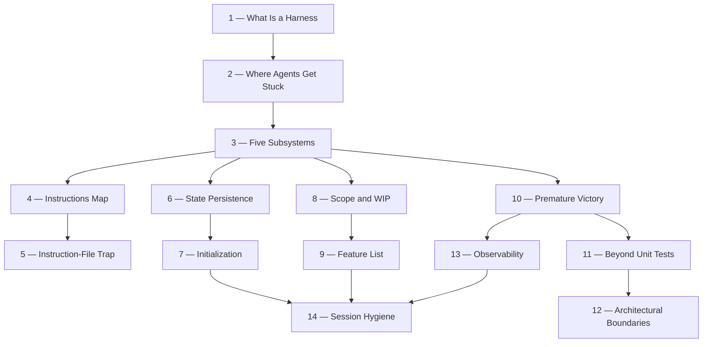

# Harness Engineering — Hub

> [!abstract] Hub Note
> The index for a 14-note deep dive on **harness engineering**: building the working environment *around* an AI coding agent so it produces reliable results across real repositories and multiple sessions. Restructured from a raw research dump on 2026-06-18.

## Overview

There's a hard truth most people learn the hard way: the strongest model in the world will still fail on real engineering tasks if you don't build a proper environment around it. It starts well, then something goes wrong. It skips a step, breaks a test, says "done" when it isn't. You spend more time cleaning up than if you'd done it yourself.

This isn't a model problem. It's a **harness** problem. Harness engineering is about building a complete working environment around the model so it produces reliable results. It's not about writing better prompts. It's about designing the system the model operates inside.

The question isn't "can models write code?" They can. The question is: **can they reliably complete real engineering tasks inside real repositories, over multiple sessions, without constant human supervision?** That is what the harness answers.

## The Five Subsystems

```text
    ┌────────────────────────────────────────────────────────────────┐
    │                          THE HARNESS                           │
    │   ┌──────────────┐  ┌──────────────┐  ┌────────────────────┐   │
    │   │ Instructions │  │    State     │  │   Verification     │   │
    │   └──────────────┘  └──────────────┘  └────────────────────┘   │
    │   ┌──────────────┐  ┌──────────────────────────────────────┐   │
    │   │    Scope     │  │         Session Lifecycle            │   │
    │   └──────────────┘  └──────────────────────────────────────┘   │
    └────────────────────────────────────────────────────────────────┘

    The MODEL decides what code to write.
    The HARNESS governs when, where, and how it writes it.
```

## Glossary

> [!info] Key terminology
> - **Capability Gap** — the gulf between model performance on benchmarks and on real tasks. A 50–60% pass rate on SWE-bench Verified means nearly half of real issues go unresolved.
> - **Harness** — everything outside the model: instructions, tools, environment, state management, verification feedback. If it's not model weights, it's harness.
> - **Harness-Induced Failure** — the model has sufficient capability, but the execution environment has structural defects.
> - **Verification Gap** — the gap between the agent's confidence in its output and actual correctness. The most common failure mode.
> - **Diagnostic Loop** — execute, observe failure, attribute to a specific harness layer, fix that layer, re-execute. The core methodology of harness engineering.
> - **Definition of Done** — a set of conditions verifiable by command (tests pass, lint clean, types check). Without it, the agent invents its own.

## Topics

| # | Topic | Note | Summary |
|---|-------|------|---------|
| 1 | What Is a Harness | [[Harness-Engineering-What-Is-A-Harness]] | Why the harness, not the model, decides reliability — and the $9-vs-$200 experiment that proves it |
| 2 | Where Agents Get Stuck | [[Harness-Engineering-Where-Agents-Get-Stuck]] | The five recurring failure modes that the harness exists to fix |
| 3 | The Five Subsystems | [[Harness-Engineering-Five-Subsystems]] | Instructions, Tool, Environment, State, Feedback — and the 20%→100% staged experiment |
| 4 | Instructions: Drawing a Map | [[Harness-Engineering-Instructions-Drawing-A-Map]] | AGENTS.md as a router not an encyclopedia; the fresh-session test |
| 5 | The Instruction-File Trap | [[Harness-Engineering-Instruction-File-Trap]] | How AGENTS.md bloats, why it hurts, and how to split it |
| 6 | State Persistence | [[Harness-Engineering-State-Persistence]] | ACID for agent state; PROGRESS.md; context anxiety; compaction vs reset |
| 7 | The Initialization Phase | [[Harness-Engineering-Initialization-Phase]] | Why setup is a separate kind of work from implementation |
| 8 | Scope Control & WIP=1 | [[Harness-Engineering-Scope-Control-WIP]] | Overreach, attention as a finite resource, and finishing one thing first |
| 9 | The Feature List Primitive | [[Harness-Engineering-Feature-List-Primitive]] | Why the feature list is a foundational data structure, not a memo |
| 10 | Preventing Premature Victory | [[Harness-Engineering-Preventing-Premature-Victory]] | Externalizing termination judgment; three-layer validation |
| 11 | Beyond Unit Tests (E2E) | [[Harness-Engineering-Beyond-Unit-Tests-E2E]] | The blind spots of unit tests and why E2E changes agent behavior |
| 12 | Architectural Boundaries | [[Harness-Engineering-Architectural-Boundaries]] | Enforcing invariants and agent-oriented error messages that self-correct |
| 13 | Observability | [[Harness-Engineering-Observability]] | Runtime vs process observability; the three-agent DAW experiment |
| 14 | Session Hygiene | [[Harness-Engineering-Session-Hygiene]] | Cleanup, drift, quality docs, and long-term reliability |

## How These Connect



**Reading order:** Notes 1–3 build the mental model. Notes 4–5 cover the Instructions subsystem; 6–7 the State subsystem; 8–9 the Scope subsystem; 10–13 the Verification and Observability subsystems; 14 the Session Lifecycle that ties everything together over time.

## Connections

- [[Harness-Internals-Overview]] — the builder-side companion repository (2026-07-02): 12 textbook chapters on the internals behind these practices — context compilation, tool-calling wire protocols, agent loops, Claude Code/Codex/Cursor architecture, guardrails, KV-cache economics, memory, and eval infrastructure. Start with [[Harness-Internals-Things-You-Dont-Know-Yet]].
- [[Backend-Engineering-Testing-Quality]] — the testing discipline harness verification builds on
- [[Backend-Engineering-Integration-Testing]] — the E2E layer the harness leans on for completion evidence
- [[Backend-Engineering-Structured-Logging]] — the runtime signals observability collects

## References

- [Effective harnesses for long-running agents — Anthropic](https://www.anthropic.com/engineering/effective-harnesses-for-long-running-agents)
- [Harness design for long-running apps — Anthropic](https://www.anthropic.com/engineering/harness-design-long-running-apps)
- [Harness Engineering — OpenAI](https://openai.com/index/harness-engineering/)
- [Laws of software evolution (Lehman) — IEEE](https://ieeexplore.ieee.org/document/1702314) — full text paywalled (abstract only)
